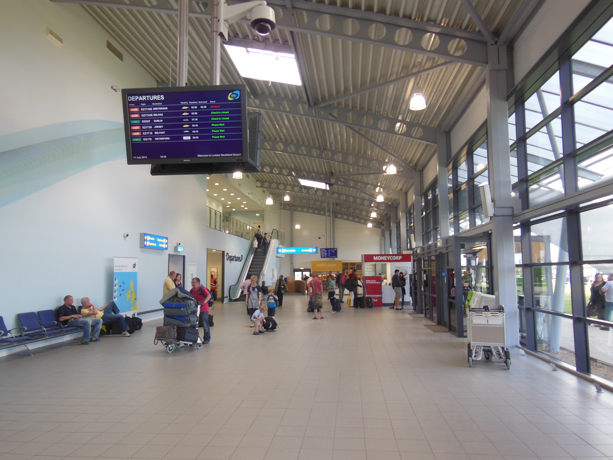

London Southend Airport (SEN) is located 40 miles (64 km) east of Central London in Essex. It has a single passenger terminal connected via a covered 2-minute walkway to **Southend Airport railway station**.

> 💡 **Quick Verdict: Southend to London (2026)**  
> - **Fastest & Best Option:** **Greater Anglia Rail**. Direct trains run every 20 minutes to **Stratford** (46 mins) and **London Liverpool Street** (52–55 mins).  
> - **Contactless vs. Oyster:** Contactless bank cards and Apple/Google Pay ARE accepted at Southend Airport station, but **Oyster cards are NOT valid**!  
> - **Smart Interchange Tip:** Change at **Stratford** for the Elizabeth line to reach Paddington, Farringdon, or Canary Wharf faster than staying on the train to Liverpool Street!

---

## Southend Transport Options Compared

*Fares and travel times checked on **2 August 2026**.*

| Transport Option | Central London Station | Journey Time | Single Adult Fare | Best Used For |
| --- | --- | --- | --- | --- |
| **Greater Anglia Rail** | Stratford Station | 46 mins | From **£13.40** *(Advance)* | **Best interchange** for Elizabeth Line & Docklands |
| **Greater Anglia Rail** | London Liverpool Street | 53 mins | From **£13.40** *(Advance)* | **Best direct route** into The City & Financial District |
| **Taxi / Uber / Private Transfer** | Door-to-door anywhere in London | 75–120+ mins | **£100.00 – £150.00+** | Door-to-door comfort for families & heavy luggage |

---

## Which route is best for your hotel area?

| Hotel Area or Landmark | Recommended Train Route | Why Take This Route? |
| --- | --- | --- |
| **Liverpool Street, The City, Shoreditch** | **Greater Anglia to Liverpool Street** | Direct train in 53 mins. |
| **Stratford, Olympic Park, Westfield** | **Greater Anglia to Stratford** | Direct train in 46 mins. |
| **Canary Wharf & Docklands** | **Greater Anglia to Stratford ➔ Elizabeth / Jubilee Line** | Fast transfer avoiding Liverpool Street congestion. |
| **Farringdon, Bond Street, Paddington** | **Greater Anglia to Stratford ➔ Elizabeth Line** | Step-free cross-city Elizabeth line connection. |
| **King's Cross, Euston, Bloomsbury** | **Greater Anglia to Liverpool Street ➔ Underground** | Short Tube connection from Liverpool Street. |

---

## Book Airport Transfers & Experiences

---

Powered by <a target="_blank" rel="sponsored" href="https://www.getyourguide.com/london-l57/">GetYourGuide</a>

## Greater Anglia Station & Terminal Access

Southend Airport features a **single passenger terminal**.

*Southend Airport terminal. Photo: [Chris j wood](https://commons.wikimedia.org/wiki/File:Southend_Airport_terminal_building_01.jpg), [CC BY-SA 3.0](https://creativecommons.org/licenses/by-sa/3.0/).*

* **Covered Walkway:** Southend Airport station is located **100 meters** from the terminal doors (a 2-minute covered walk).
* **Step-Free Platforms:** The station and platforms are 100% step-free.

---

## 5 Common Southend transit mistakes to avoid

1. **Trying to use an Oyster card:** Oyster cards are **NOT valid** at Southend Airport (contactless bank cards or train tickets are required).
2. **Staying on the train to Liverpool Street when going to West End:** Change at **Stratford** for the Elizabeth line to reach Paddington or Bond Street faster.
3. **Confusing Southend Airport station with Southend Victoria or Southend Central:** Southend Airport has its own dedicated station right next to the runway terminal!
4. **Switching payment devices between taps:** Tapping in with a bank card and out with Apple Pay creates two incomplete journey penalties.
5. **Hailing unlicensed taxis:** Always pre-book licensed taxis or private transfers.

---

## Related London Transport Guides

* ✈️ [Heathrow Airport to London Transport Guide](/articles/heathrow-airport-to-london/)
* ✈️ [Gatwick Airport to London Transport Guide](/articles/gatwick-airport-to-london/)
* ✈️ [Stansted Airport to London Transport Guide](/articles/stansted-airport-to-london/)
* ✈️ [Luton Airport to London Transport Guide](/articles/luton-airport-to-london/)
* 🚊 [Getting Around London: Complete Transport Overview](/articles/getting-around-london-transport-guide/)

---

*Fares and travel times checked on 2 August 2026. Always verify live timetables with [Greater Anglia](https://www.greateranglia.co.uk/).*
