London has **six three-Michelin-star restaurants** in the 2026 guide, and a second tier of rooms where the building does as much work as the kitchen.

This guide separates the two, because a milestone dinner and a spectacular room are different bookings.

> 💡 **The Short Version:** **Restaurant Gordon Ramsay** has held three stars since 2001, longer than anywhere else in London. **Core** is Clare Smyth's. **River Café's terrace** takes months. **Clos Maggiore** is the room to book for a proposal. And **Dinner by Heston closes in January 2027**, so this is the year.

*No paid placements. Booking windows are what the restaurants themselves publish, and they are the thing most likely to catch you out.*

## Where they are

| If you are near… | Where to book |
| --- | --- |
| **Mayfair** | Alain Ducasse at The Dorchester, Hélène Darroze at The Connaught, Sketch, Murano, Umu |
| **Chelsea** | Restaurant Gordon Ramsay |
| **Notting Hill** | Core by Clare Smyth, The Ledbury |
| **Knightsbridge** | Dinner by Heston Blumenthal |
| **Hammersmith** | River Café |
| **Covent Garden** | Clos Maggiore, Rules |
| **The City** | Duck & Waffle, SUSHISAMBA |
| **Soho** | Bob Bob Ricard |

**Price guide:** **£££** £40–£70 · **££££** £90+. Among the three-star rooms, the range actually runs from about **£96** for two courses at lunch at Hélène Darroze to **£295** for dinner at The Ledbury.

---

## The three-star rooms

All six, which is the whole list for London.

### Restaurant Gordon Ramsay, Chelsea

*££££ · 68 Royal Hospital Road · book months ahead*

**Three stars held continuously since 2001** — the longest-running three-star restaurant in London. A small Chelsea dining room rather than a grand one; the reputation is entirely the cooking.

**Closed Sunday and Monday**, and bookings open well ahead and go. **The lunch menu is the cheapest way in** by a distance, and it is the same kitchen.

A quiet room rather than a scene — worth knowing if you are choosing between this and somewhere with more theatre. Fourteen minutes from Sloane Square, which is further than it sounds.

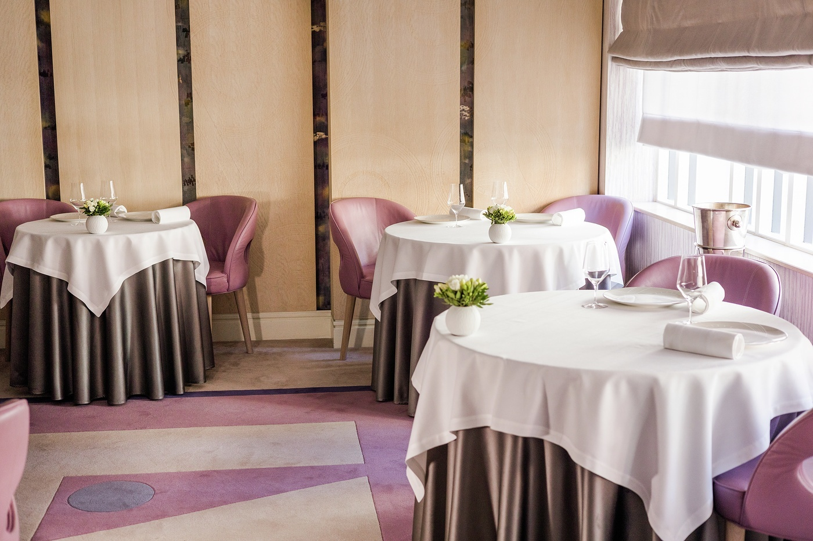

*The dining room on Royal Hospital Road.*

### Core by Clare Smyth, Notting Hill

*££££ · book months ahead*

Smyth was the first British woman to run a three-star kitchen, and the cooking is built on British produce rather than French technique — which is the distinction between this and the Mayfair three-stars.

**Two dishes carry the argument.** The **"potato and roe"** — a single charlotte potato cooked for hours, dressed in trout roe and a dulse beurre blanc — and **"core apple"**, a dessert built to look exactly like an apple. Both have been on since it opened and both are ordered by almost every table.

**Closed Sunday and Monday.** Reservations open on a rolling window and go the day they release.

**92 Kensington Park Road, W11 2PN**, nine minutes from Holland Park, in a residential street rather than a hotel — and The Ledbury is five minutes away, which puts two three-star kitchens on the same walk.

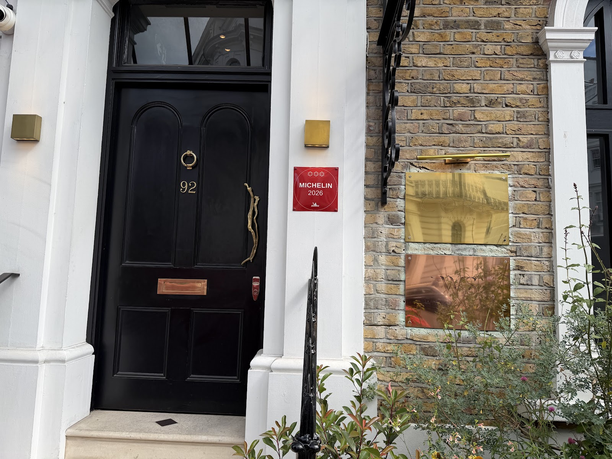

*The door at 92 Kensington Park Road, with its 2026 Michelin plaque.*

### Alain Ducasse at The Dorchester, Mayfair

*££££ · Park Lane*

Classical French haute cuisine, including the **Table Lumière** — a private table for six ringed by a curtain of fibre optics.

**Ask about the Table Lumière specifically when you book** — it is not offered by default, and it is the reason most people choose this over the other three-stars.

**What arrives is classical French at the top of the range**: the **sauté gourmand of lobster** with truffled chicken quenelles has been a fixture for years, and the **baba au rhum**, wheeled over and finished at the table with your choice of rum, is the dessert everyone remembers.

**Jacket preferred and no sportswear**, which is worth knowing before you dress for it.

**Closed Sunday and Monday, and it books months ahead.** It sits inside The Dorchester at **53 Park Lane, W1K 1QA**, so the room is the hotel's rather than the restaurant's own, about seven minutes from Hyde Park Corner.

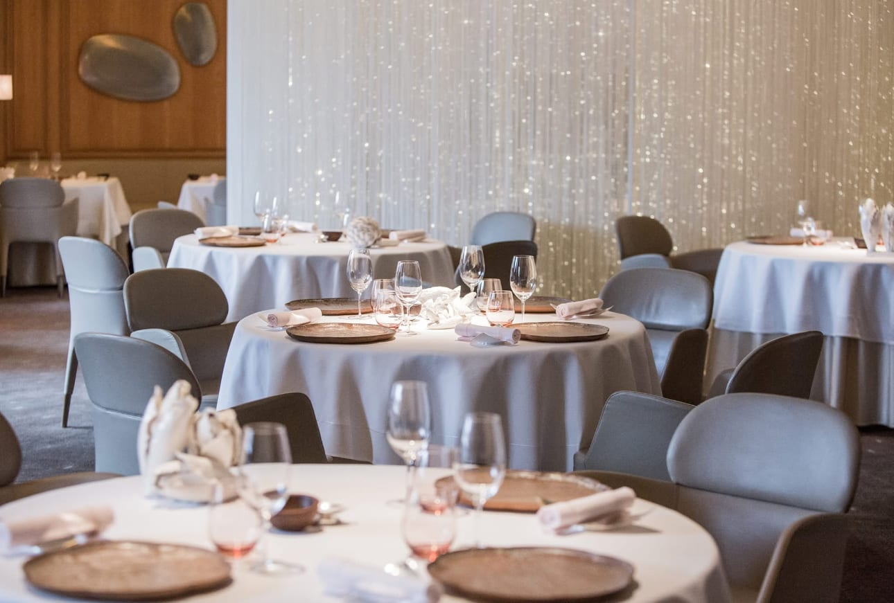

*The dining room at Alain Ducasse at The Dorchester, inside the hotel on Park Lane.*

### Hélène Darroze at The Connaught, Mayfair

*££££ · Carlos Place*

Three stars for cooking rooted in Darroze's native Landes — **regional French at the very top end**, which London has almost none of. The third star came in 2021.

**What that means on the plate** is south-western French produce treated seriously: Landes chicken, foie gras, Périgord truffle in season, and a tasting menu built around named growers rather than techniques.

**Book months ahead**, and note it sits inside The Connaught — so the Connaught Bar is downstairs, takes no reservations at any hour, and mixes its martini at your table from a trolley for £30. A drink there before dinner is the obvious pairing and the only part of the evening you cannot reserve.

**Closed Sunday and Monday, and it books months ahead.** Inside The Connaught at **Carlos Place, W1K 2AL**, about eight minutes from Bond Street.

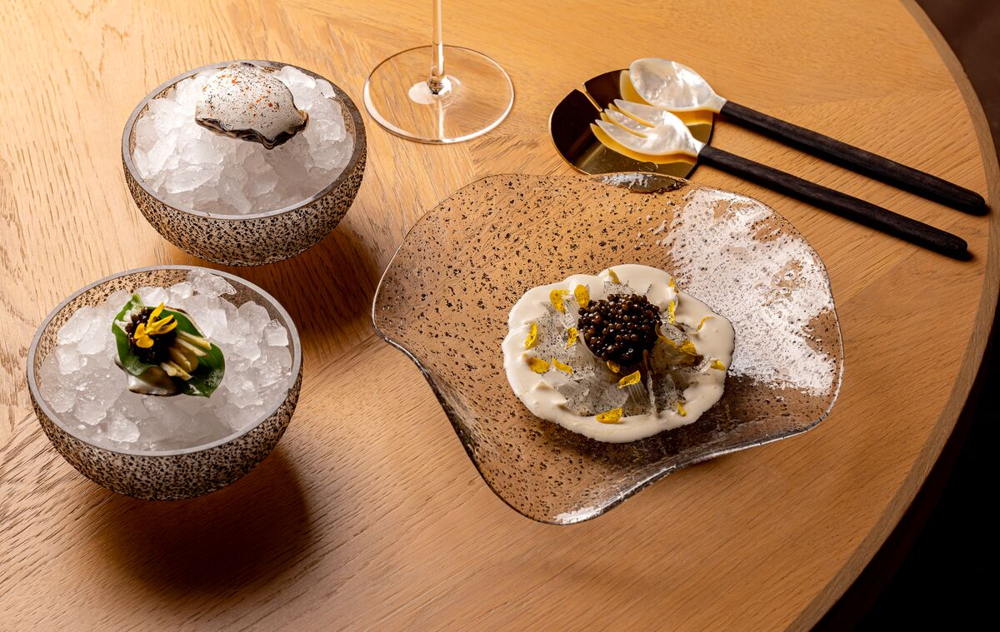

*A caviar course from the tasting menu, served over crushed ice.*

### The Ledbury, Notting Hill

*££££*

Brett Graham reopened it in 2022 with a tighter focus on British sourcing, and it took its **third Michelin star in 2024** — the fastest return to the top of the guide of any London restaurant in recent memory.

**It grows its own mushrooms**, and that is not a garnish detail: the kitchen runs its own mushroom farm and a deer park supplies the venison, so the menu is built backwards from what the estate produces. Expect game in autumn and a lot of British produce you will not see elsewhere.

**Closed Sunday and Monday, and it books months ahead.** This is one of the hardest tables in London and there is no walk-in alternative.

**127 Ledbury Road, W11 2AQ**, nine minutes from Westbourne Park and ten from Notting Hill Gate — and Core by Clare Smyth, also three stars, is a five-minute walk away.

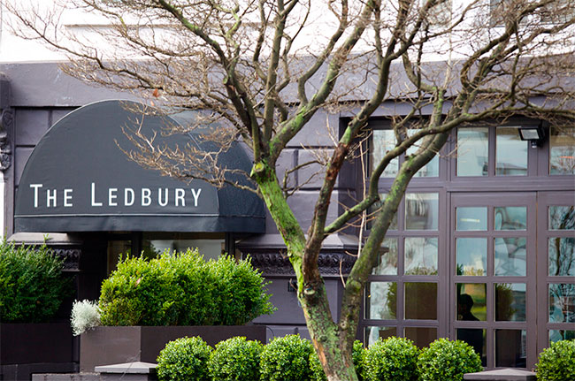

*The Ledbury at 127 Ledbury Road, Notting Hill.*

### Sketch — The Lecture Room & Library, Mayfair

*££££*

Pierre Gagnaire's London expression, on Conduit Street. The rest of Sketch — the Gallery, the egg lavatories — is a separate and cheaper experience in the same building, which makes it the one three-star address where you can have a version of the evening without the tasting menu.

> 💡 **Sketch publishes no prices anywhere on its site.** They appear only once you are inside the booking flow.

**Books weeks rather than months ahead**, which makes it the most gettable of the three-star rooms, and it is six minutes from Oxford Circus. The Gallery downstairs takes bookings separately, so if the Lecture Room is beyond the budget, the pink room and the egg-shaped lavatories are a cheaper way into the same building.

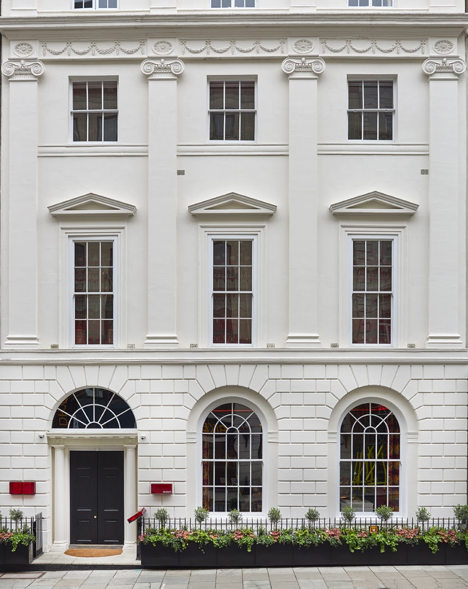

*The Georgian building on Conduit Street that houses Sketch.*

---

Powered by <a target="_blank" rel="sponsored" href="https://www.getyourguide.com/london-l57/">GetYourGuide</a>

## Closing soon

### Dinner by Heston Blumenthal, Knightsbridge

*££££ · two stars · closing January 2027*

Dishes rebuilt from British historical recipes as far back as the fourteenth century, each one dated on the menu — the **Meat Fruit (c.1500)**, a chicken liver parfait moulded and glazed to look exactly like a mandarin, is the one everybody orders and the one to order.

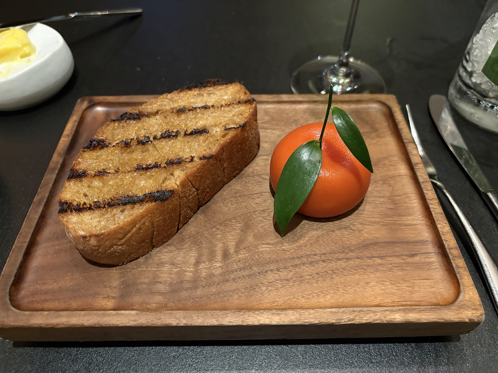

*The Meat Fruit (c.1500), served with grilled sourdough.*

**The other two to know** are the **Tipsy Cake (c.1810)**, a spit-roasted pineapple brioche that takes long enough to cook that you order it at the start of the meal, and **Rice & Flesh (c.1390)**, saffron rice with calf's tail.

**Ask for a table on the park side.** The dining room looks over Hyde Park, and the kitchen's glass-walled pineapple spit is visible from parts of the room.

> ⚠️ **Confirmed closing in January 2027** when the Knightsbridge lease ends. If you have been meaning to go, this is the year.

**Closed Tuesdays** and books months ahead. It is inside the Mandarin Oriental, two minutes from Knightsbridge station.

---

## Book for the room

Where the building is the occasion.

### Clos Maggiore, Covent Garden

*£££ · the conservatory*

Regularly called **the most romantic room in London** — a blossom-covered conservatory with a fire and a retractable roof, and the blossom is real rather than a print.

The cooking is Provençal and northern Italian: **rack of lamb, hand-made pasta, a long French wine list** that runs to several hundred bins. It is very good rather than the point; the room is the point, and the kitchen knows it.

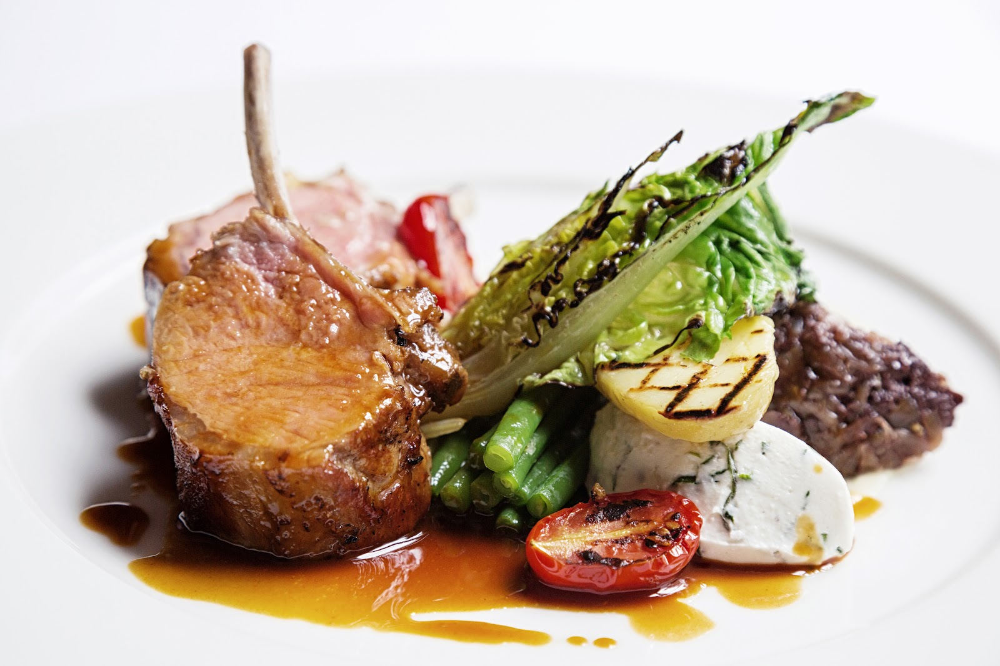

*Rack of lamb at Clos Maggiore.*

> 💡 **Book the conservatory specifically and say why.** The restaurant has several rooms and only one of them is the one in the photographs — asking for the conservatory, and mentioning the occasion, is the difference between a good dinner and the one people remember.

**33 King Street, WC2E 8JD**, two minutes from Covent Garden, and there is a **pre- and post-theatre menu** that is a fraction of the à la carte.

*Clos Maggiore's frontage on King Street at Christmas. Photo: [James E. Petts](https://www.flickr.com/photos/14730981@N08/52553938990), [CC BY-SA 2.0](https://creativecommons.org/licenses/by-sa/2.0/).*

### River Café, Hammersmith

*££££ · book months ahead*

Michelin-starred simplicity on the Thames, and the kitchen where both Jamie Oliver and Hugh Fearnley-Whittingstall trained. Informal in atmosphere and expensive in practice, which catches people out.

**The terrace tables book furthest ahead and are the entire point** — a table inside on a summer evening is a different and lesser night. Books months ahead, and it is eighteen minutes from Barons Court, so allow for the walk.

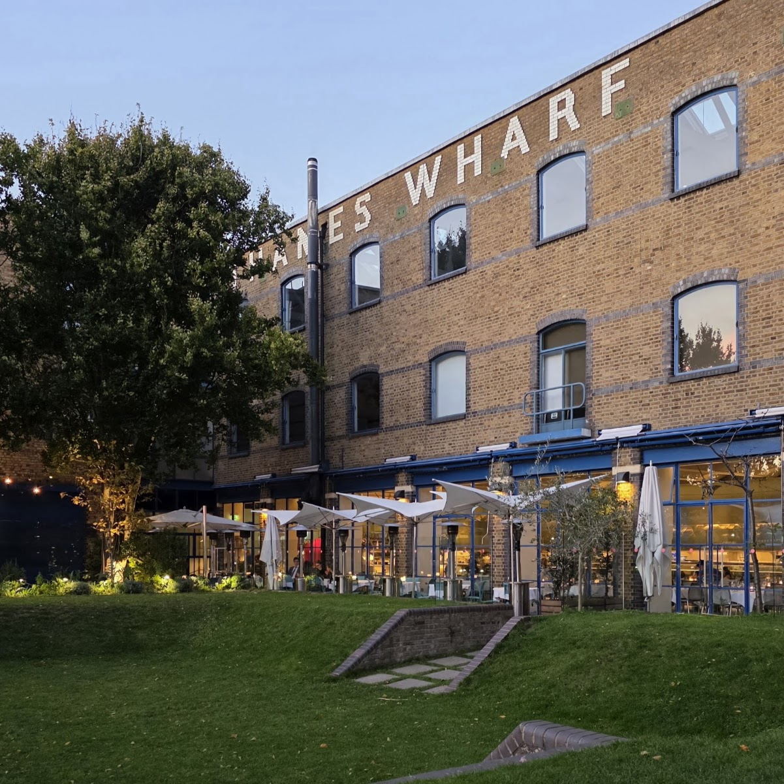

*The terrace and lawn at Thames Wharf.*

### Sketch, Mayfair

*££££ · the Gallery and the egg pods*

Afternoon tea inside an art installation, and **four separate rooms behind one door** — which is the thing to understand before booking, because they are different restaurants at different prices.

**The Gallery** is the one everybody photographs, rebuilt in 2022 in yellow and copper by Yinka Shonibare and India Mahdavi, doing afternoon tea and a modern European menu. **The Lecture Room & Library** upstairs is the **three-Michelin-star** restaurant and a different proposition entirely. The **Glade** is the woodland-themed room, and the **Parlour** is the casual one.

**The egg-shaped lavatory pods** are free to visit — you do not need a booking to go and look.

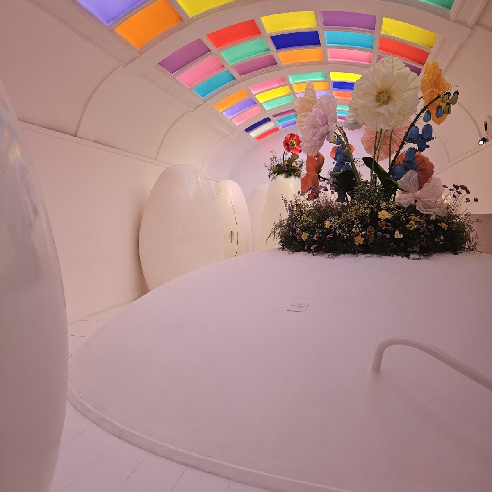

*The egg-shaped lavatory pods at Sketch.*

**Book the specific room, not "Sketch"**, and book weeks ahead for the Gallery and months for the Lecture Room. **9 Conduit Street, W1S 2XG**, three minutes from Oxford Circus.

### Bob Bob Ricard, Soho

*££££ · Press for Champagne*

Booth-only, art deco throughout in blue leather and brass, and a **button at every table marked Press for Champagne**. It works, and pressing it is the entire reason half the room is there.

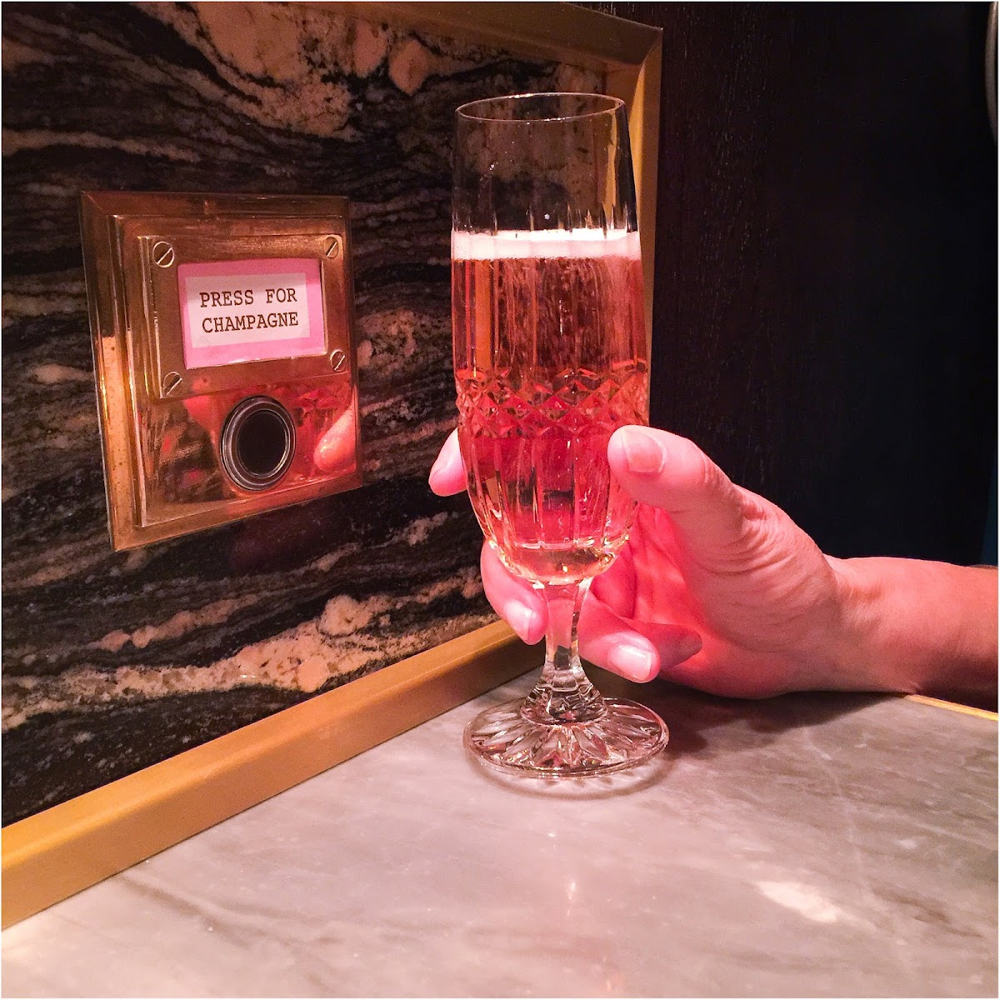

*The Press for Champagne button on a booth wall.*

**The food is Anglo-Russian and better than the gimmick suggests**: **beef Wellington for two**, **chicken Kiev**, **lobster mac and cheese**, and a caviar list. Puddings arrive under a gold-leaf dome.

> ⚠️ **Every table is a booth and there are no bar seats**, so this is a fixed booking for a fixed number rather than somewhere to add a person to. Booths seat four to six and are allocated by party size.

**1 Upper James Street, W1F 9DF**, and there is a second site in the City.

*Caviar with blinis and soured cream. Photo: [Ewan-M](https://www.flickr.com/photos/55935853@N00/5111925674), [CC BY-SA 2.0](https://creativecommons.org/licenses/by-sa/2.0/).*

**Books weeks ahead**, and it is booths only — there is no bar and no walk-in. Five minutes from Piccadilly Circus.

It is the one on this page that is unembarrassed about being fun rather than serious, which for some occasions is exactly right.

### Duck & Waffle, City of London

*££££ · forty floors up, 24 hours*

**Open 24 hours**, forty floors up in the Heron Tower, so a celebration can start at 2am and end with sunrise over the City. The sunrise and late-night slots are the ones worth planning around, and they are the reason to choose it over any other high room in London.

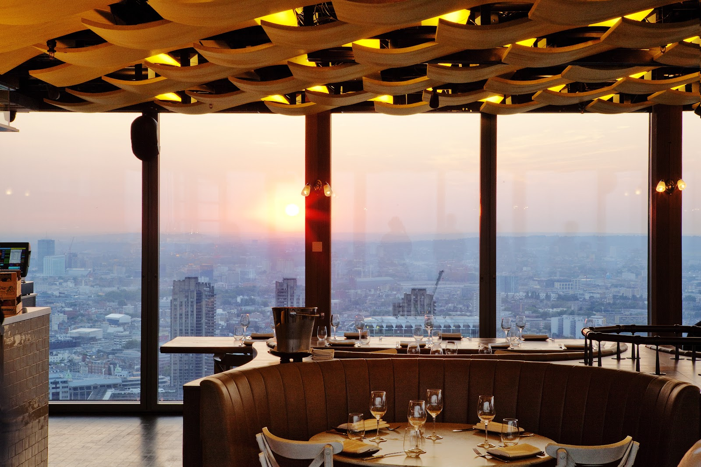

*The view from forty floors up in 110 Bishopsgate.*

**The signature is the dish it is named after** — confit duck leg, a fried duck egg and mustard maple syrup on a waffle, **£26** — and it is on the menu at four in the morning exactly as it is at eight in the evening.

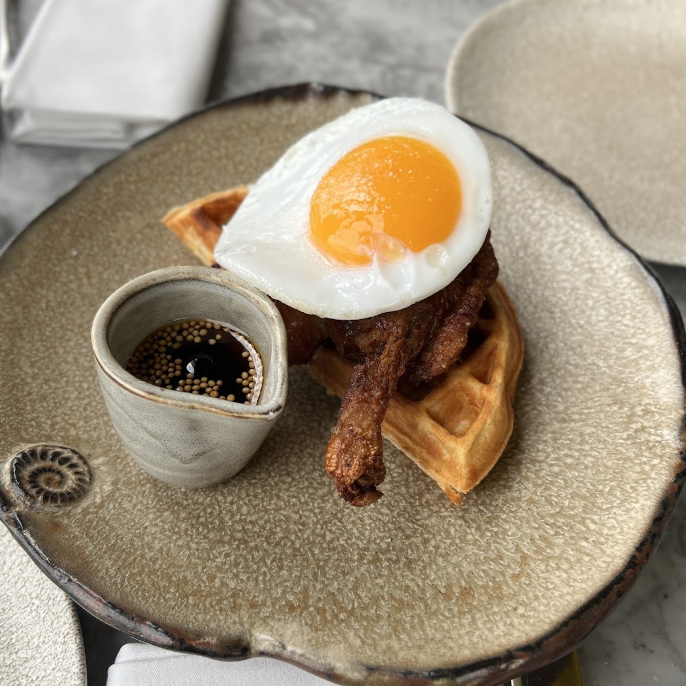

*The dish it's named after: confit duck leg and a fried duck egg on a waffle, with mustard maple syrup.*

**Book even at 2am.** Reservations run up to two months ahead and the room is small for the demand. **Card only, no cash**, smart casual.

**Book a window table specifically** — a table away from the glass is a materially lesser experience.

**110 Bishopsgate, EC2N 4AY**, three minutes from Liverpool Street — and Liverpool Street stops running long before the restaurant does, so settle the journey home first.

### Rules, Covent Garden

*££££ · since 1798*

**London's oldest restaurant**, trading since 1798, and written into *Spectre* as Bond's own regular — the film makes no attempt to disguise the room.

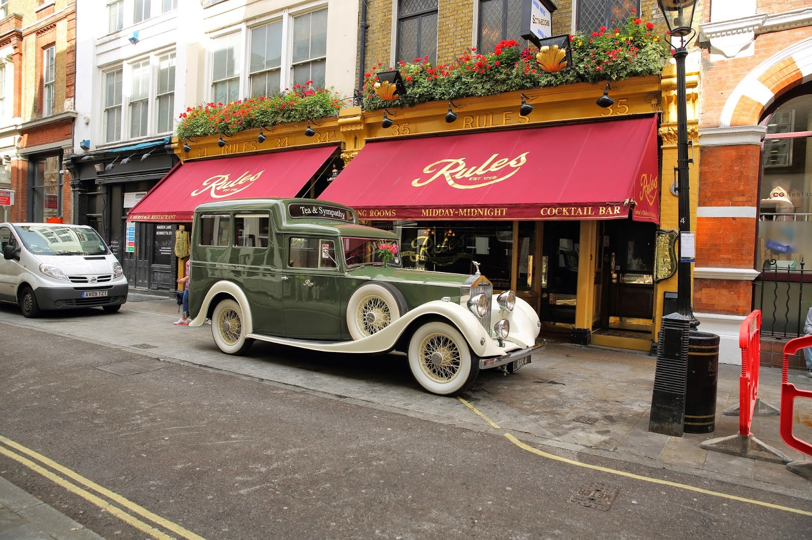

*Rules on Maiden Lane, trading since 1798.*

**Game is the speciality and it is properly seasonal**: grouse from mid-August, then partridge, pheasant, woodcock and venison through the autumn, hung and served from the restaurant's own estate in the Pennines. **Steak and kidney pudding** and **jugged hare** are the other things to order, and neither is a museum piece.

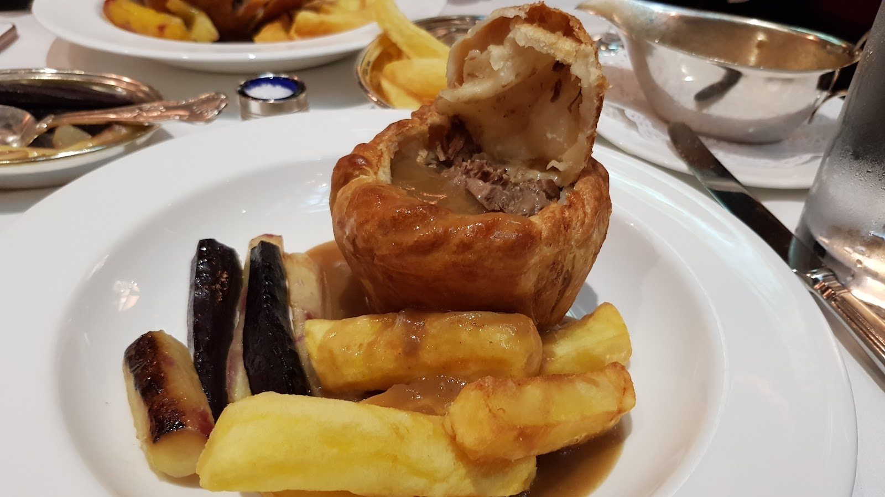

*Steak and kidney pudding at Rules.*

**Autumn is the season to come.** Out of it you are eating in a beautiful room; in it you are eating something you genuinely cannot get in many places.

**Book, and book well ahead** — it is small, heavily panelled and consistently full, and walk-ins are optimistic. The ground-floor room is the one from the film. **35 Maiden Lane, WC2E 7LB**, three minutes from Covent Garden.

---

Powered by <a target="_blank" rel="sponsored" href="https://www.getyourguide.com/london-l57/">GetYourGuide</a>

## What changed at the top end this year

**Two arrivals worth knowing about.** **Bonheur by Matt Abé** opened with **two stars** in Le Gavroche's old Mayfair site, and **Row on 5** was promoted from one star to two.

> ⚠️ **And one correction.** **Humo** in Mayfair **lost its star in the 2026 guide and is still trading normally.** It remains a good restaurant, but anything still describing it as Michelin-starred is out of date.

---

## Cheaper ways into serious kitchens

The gap between lunch and dinner at a starred restaurant is the single biggest saving available in London dining, and it is for the same kitchen and the same room.

**Verified set lunches, cheapest first:**

* **Pied à Terre**, Fitzrovia — **£35** for three courses, on its 35th-anniversary menu. **The cheapest verified way into a Michelin-starred dining room in London**, and you have to mention it when booking or you will not be offered it.
* **La Trompette**, Chiswick — **£45** for three courses, Wednesday to Friday.
* **Chez Bruce**, Wandsworth — **£68.50** for three courses, at every lunch service.
* **Hélène Darroze at The Connaught** — à la carte is served **at lunch only**, and two courses come in around £96 against £230 for the shortest tasting menu — the cheapest three-star lunch on this page.
* **Restaurant Gordon Ramsay**, Chelsea — **£125**, Tuesday to Friday, against £180 à la carte and £210 for the Prestige menu.
* **The Ledbury**, Notting Hill — **£220** for six courses at lunch against **£295** for dinner. A £75 saving on the same kitchen.

**Where lunch does not help:** Core by Clare Smyth saves only £30 at lunch, and Alain Ducasse at The Dorchester publishes no set lunch at all — its cheapest route in is the £215 three-course menu.

* **A. Wong**, Pimlico — dim sum at lunch is **à la carte per dish**, not a set menu, which is why no headline price is quoted. Dumplings start around **£4.50–£6** and the top items reach £15–£16, so you control the bill. Still the cheapest way into a two-star kitchen in London.
* **Café Murano** — Angela Hartnett's everyday room, and considerably cheaper than Murano. Note it is a sibling restaurant at a different address rather than a cheaper room in the same building.
* **Sushi Atelier** — repeatedly named the best-value serious omakase in central London.
* **Trullo** — what London chefs recommend when they are paying themselves.

---

Powered by <a target="_blank" rel="sponsored" href="https://www.getyourguide.com/london-l57/">GetYourGuide</a>

## What to know

* **Three-star rooms take months.** Set a calendar reminder for the day bookings open.
* **Ask about dress codes when booking.** Most prefer smart; almost none now require a tie except The Ritz for tea.
* **Dietary requirements need 48 hours' notice** at tasting-menu restaurants — they build the menu around them and cannot improvise on the night.
* **Deposits are standard** at this level and are usually non-refundable inside 48 hours.
* **Say if it is an occasion.** Every restaurant here will do something, and none of them will if you do not mention it.

---

## Continue planning your London trip

- 🍽️ **[Eat in London: Restaurants, Food Markets & Quick Food Hub](/articles/eat-in-london-guide/)**
- 🫖 **[The Best Afternoon Tea in London](/articles/best-afternoon-tea-london/)**
- 🎪 **[Unusual Restaurants in London](/articles/unusual-restaurants-london/)**
- 🍸 **[The Best Cocktail Bars in London](/articles/best-cocktail-bars-london/)**
- 🛍️ **[Mayfair Area Guide](/articles/mayfair-area-guide/)**
- 🎭 **[Covent Garden Area Guide](/articles/covent-garden-area-guide/)**
