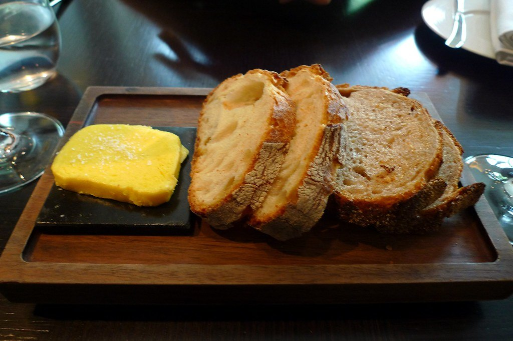
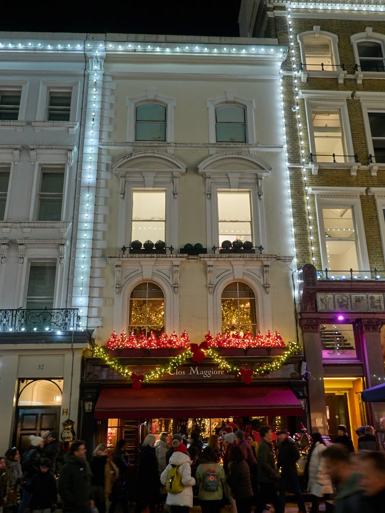
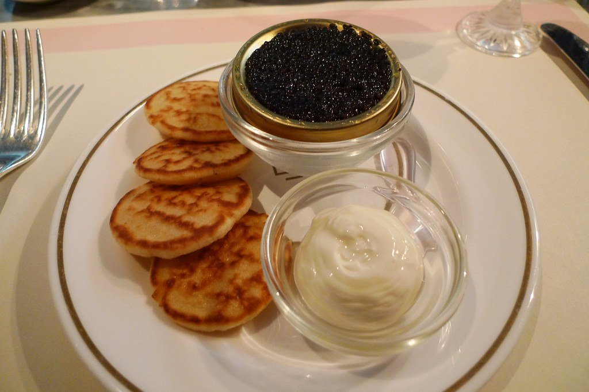

London has **six three-Michelin-star restaurants** in the 2026 guide, and a second tier of rooms where the building does as much work as the kitchen.

This guide separates the two, because a milestone dinner and a spectacular room are different bookings.

> 💡 **The Short Version:** **Restaurant Gordon Ramsay** has held three stars since 2001, longer than anywhere else in London. **Core** is Clare Smyth's. **River Café's terrace** takes months. **Clos Maggiore** is the room to book for a proposal. And **Dinner by Heston closes in January 2027**, so this is the year.

> 📘 **How we choose these (editorial note)**
> No paid placements. These are drawn from a wide spread of sources rather than any single list - the food and travel press, the big listings sites, independent blogs and specialists, video, and what Londoners recommend themselves - and cross-referenced against each other. Booking windows are what the restaurants themselves publish and are the thing most likely to catch you out.

## Where they are

| If you are near… | Where to book |
| --- | --- |
| **Mayfair** | Alain Ducasse at The Dorchester, Hélène Darroze at The Connaught, Sketch, Murano, Umu |
| **Chelsea** | Restaurant Gordon Ramsay |
| **Notting Hill** | Core by Clare Smyth, The Ledbury |
| **Knightsbridge** | Dinner by Heston Blumenthal |
| **Hammersmith** | River Café |
| **Covent Garden** | Clos Maggiore, Rules |
| **The City** | Duck & Waffle, SUSHISAMBA |
| **Soho** | Bob Bob Ricard |

**Price guide:** **£££** £40–£70 · **££££** £90+. Among the three-star rooms, the range actually runs from **£125** for Restaurant Gordon Ramsay's set lunch to **£295** for dinner at The Ledbury.

---

## The three-star rooms

All six, which is the whole list for London.

### Restaurant Gordon Ramsay, Chelsea

*££££ · 68 Royal Hospital Road · book months ahead*

**Three stars held continuously since 2001** — the longest-running three-star restaurant in London. A small Chelsea dining room rather than a grand one; the reputation is entirely the cooking.

The lunch menu is the cheapest way in.

### Core by Clare Smyth, Notting Hill

*££££ · book months ahead*

Smyth was the first British woman to run a three-star kitchen. Cooking built on British produce, treated at the highest level.

### Alain Ducasse at The Dorchester, Mayfair

*££££ · Park Lane*

Classical French haute cuisine, including the **Table Lumière** — a private table for six ringed by a curtain of fibre optics, and the single most requested seat in Mayfair. Ask for it specifically.

### Hélène Darroze at The Connaught, Mayfair

*££££ · Carlos Place*

Three stars for cooking rooted in Darroze's native Landes — **regional French at the very top end**, which London has almost none of.

### The Ledbury, Notting Hill

*££££*

Brett Graham's, and it took its third star in 2024. Grows its own mushrooms.

### Sketch — The Lecture Room & Library, Mayfair

*££££*

Pierre Gagnaire's London expression, on Conduit Street. The rest of sketch — the pink room, the egg lavatories — is a separate and cheaper experience in the same building, which makes it the one three-star address where you can have a version of the evening without the tasting menu.

> sketch publishes no prices anywhere on its site; they appear only once you are inside the booking flow.

---

Powered by <a target="_blank" rel="sponsored" href="https://www.getyourguide.com/london-l57/">GetYourGuide</a>

## Closing soon

### Dinner by Heston Blumenthal, Knightsbridge

*££££ · two stars · closing January 2027*

Dishes rebuilt from British recipes as far back as the fourteenth century — the **Meat Fruit**, a chicken liver parfait disguised as a mandarin, is the one everybody orders.

> ⚠️ **Confirmed closing in January 2027** when the Knightsbridge lease ends. If you have been meaning to go, this is the year.

*The menu is built from historic British recipes, each dated. The meat fruit is the one everybody orders. Photo: [Ewan-M](https://www.flickr.com/photos/55935853@N00/5881670409), [CC BY-SA 2.0](https://creativecommons.org/licenses/by-sa/2.0/).*

---

## Book for the room

Where the building is the occasion.

### Clos Maggiore, Covent Garden

*£££ · the conservatory*

Regularly called **the most romantic room in London** — a blossom-covered conservatory with a fire and a retractable roof. Book the conservatory specifically and say why; it is the difference between a good dinner and the one people remember.

*Ask for the conservatory when you book. The blossom-covered room is the whole point and it is not where they seat you by default. Photo: [James E. Petts](https://www.flickr.com/photos/14730981@N08/52553938990), [CC BY-SA 2.0](https://creativecommons.org/licenses/by-sa/2.0/).*

### River Café, Hammersmith

*££££ · book months ahead*

Michelin-starred simplicity on the Thames. **The terrace tables book furthest ahead** and are the point.

### Sketch, Mayfair

*££££ · the pink room*

Afternoon tea inside an art installation. The Gallery is the photographed one; the Lecture Room upstairs is the three-star restaurant.

### Bob Bob Ricard, Soho

*££££ · Press for Champagne*

Booth-only, art deco throughout, and a **button at every table marked Press for Champagne**. It works.

*The booths all have a button marked Press for Champagne, which is exactly as silly and enjoyable as it sounds. Photo: [Ewan-M](https://www.flickr.com/photos/55935853@N00/5111925674), [CC BY-SA 2.0](https://creativecommons.org/licenses/by-sa/2.0/).*

### Duck & Waffle, City of London

*££££ · forty floors up, 24 hours*

The only place in London where a celebration can start at 2am and end with sunrise over the City.

### Rules, Covent Garden

*££££ · since 1798*

**London's oldest restaurant**, and written into *Spectre* as Bond's favourite. Game is the speciality and the room is unchanged.

---

## What changed at the top end this year

**Two arrivals worth knowing about.** **Bonheur by Matt Abé** opened with **two stars** in Le Gavroche's old Mayfair site, and **Row on 5** was promoted from one star to two.

> ⚠️ **And one correction.** **Humo** in Mayfair **lost its star in the 2026 guide and is still trading normally.** It remains a good restaurant, but anything still describing it as Michelin-starred is out of date — and that is the error most likely to be repeated across London guides this year.

---

## Cheaper ways into serious kitchens

The gap between lunch and dinner at a starred restaurant is the single biggest saving available in London dining, and it is for the same kitchen and the same room.

**Verified set lunches, cheapest first:**

* **Pied à Terre**, Fitzrovia — **£35** for three courses, on its 35th-anniversary menu. **The cheapest verified way into a Michelin-starred dining room in London**, and you have to mention it when booking or you will not be offered it.
* **La Trompette**, Chiswick — **£45** for three courses, Wednesday to Friday.
* **Chez Bruce**, Wandsworth — **£68.50** for three courses, at every lunch service.
* **Restaurant Gordon Ramsay**, Chelsea — **£125**, Tuesday to Friday, against £180 à la carte and £210 for the Prestige menu.
* **The Ledbury**, Notting Hill — **£220** for six courses at lunch against **£295** for dinner. A £75 saving on the same kitchen.
* **Hélène Darroze at The Connaught** — à la carte is served **at lunch only**, and two courses come in around £96 against £230 for the shortest tasting menu. The best-value three-star lunch in London and almost nobody knows it exists.

**Where lunch does not help:** Core by Clare Smyth saves only £30 at lunch, and Alain Ducasse at The Dorchester publishes no set lunch at all — its cheapest route in is the £215 three-course menu.

* **A. Wong**, Pimlico — dim sum at lunch is **à la carte per dish**, not a set menu, which is why no headline price is quoted. Dumplings start around **£4.50–£6** and the top items reach £15–£16, so you control the bill. Still the cheapest way into a two-star kitchen in London.
* **Café Murano** — Angela Hartnett's everyday room, and considerably cheaper than Murano. Note it is a sibling restaurant at a different address rather than a cheaper room in the same building.
* **Sushi Atelier** — repeatedly named the best-value serious omakase in central London.
* **Trullo** — what London chefs recommend when they are paying themselves.

---

Powered by <a target="_blank" rel="sponsored" href="https://www.getyourguide.com/london-l57/">GetYourGuide</a>

## What to know

* **Three-star rooms take months.** Set a calendar reminder for the day bookings open.
* **Ask about dress codes when booking.** Most prefer smart; almost none now require a tie except The Ritz for tea.
* **Dietary requirements need 48 hours' notice** at tasting-menu restaurants — they build the menu around them and cannot improvise on the night.
* **Deposits are standard** at this level and are usually non-refundable inside 48 hours.
* **Say if it is an occasion.** Every restaurant here will do something, and none of them will if you do not mention it.

---

## Continue planning your London trip

- 🍽️ **[Eat in London: Restaurants, Food Markets & Quick Food Hub](/articles/eat-in-london-guide/)**
- 🫖 **[The Best Afternoon Tea in London](/articles/best-afternoon-tea-london/)**
- 🎪 **[Unusual Restaurants in London](/articles/unusual-restaurants-london/)**
- 🍸 **[The Best Cocktail Bars in London](/articles/best-cocktail-bars-london/)**
- 🛍️ **[Mayfair Area Guide](/articles/mayfair-area-guide/)**
- 🎭 **[Covent Garden Area Guide](/articles/covent-garden-area-guide/)**
