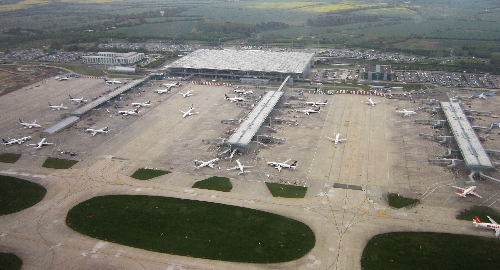

London Stansted (STN) is London's primary hub for low-cost airlines like Ryanair and Jet2, situated 40 miles (64 km) northeast of Central London. 

> 💡 **Quick Verdict: Stansted to London (2026)**  
> - **Fastest & Most Reliable:** **Stansted Express** train. Takes **37 mins** to Tottenham Hale (Victoria line interchange) and **48 mins** to London Liverpool Street (The City & Elizabeth line). Fares start from **£9.45 advance** (or ~£21.90 walk-up/contactless).  
> - **Cheapest Budget Option:** **National Express / Airport Bus** (from **£5.00** advance). Takes 50–100 mins depending on traffic to Stratford, Victoria, or Baker Street.  
> - **Contactless vs. Oyster:** Contactless bank cards and Apple/Google Pay ARE accepted on Stansted Express, but **Oyster cards are NOT accepted**!

---

## Stansted Transport Options Compared

*Fares and times checked on **2 August 2026**.*

| Transport Option | Central London Station | Journey Time | Single Adult Fare | Best Used For |
| --- | --- | --- | --- | --- |
| **Stansted Express (Train)** | London Liverpool Street | 48 mins | From **£9.45** *(Advance)* / **£21.90** *(PAYG)* | **Fastest direct route** into the City & Elizabeth Line |
| **Stansted Express (Train)** | Tottenham Hale | 37 mins | From **£9.45** *(Advance)* / **£19.90** *(PAYG)* | **Best interchange** for Victoria Line & West End |
| **National Express Bus** | Stratford / Liverpool St / Victoria | 50–100 mins | From **£5.00** *(Advance)* | Budget travel & 24/7 overnight transfers |
| **Taxi / Uber / Private Transfer** | Door-to-door anywhere in London | 60–100 mins | **£90.00 – £140.00+** | Groups, families & heavy luggage |

---

## Which route is best for your hotel area?

| Hotel Area or Landmark | Recommended Train / Bus Route | Why Take This Route? |
| --- | --- | --- |
| **Liverpool Street, The City, Shoreditch** | **Stansted Express to Liverpool Street** | Direct train in 48 mins. |
| **Victoria, Soho, Oxford Circus, West End** | **Stansted Express to Tottenham Hale ➔ Victoria Line** | Tottenham Hale interchange saves 15 mins over travelling via Liverpool Street. |
| **King's Cross, St Pancras (Eurostar), Euston** | **Stansted Express to Tottenham Hale ➔ Victoria Line** | Direct Victoria line connection to King's Cross (2 stops). |
| **Stratford & Canary Wharf** | **National Express Bus** OR **Train to Liverpool St ➔ Elizabeth Line** | Direct bus to Stratford or fast Elizabeth line transfer. |
| **Paddington, Bayswater, Kensington** | **Stansted Express to Liverpool St ➔ Elizabeth Line** | Fast cross-city Elizabeth line connection across London. |
| **Baker Street, Marble Arch, Victoria Station** | **National Express Bus (A6 / A7)** | Direct coach option avoiding Tube line changes. |

---

## Book Airport Transfers & Experiences

Powered by <a target="_blank" rel="sponsored" href="https://www.getyourguide.com/s/%3Fq=London&amp;lc=57&amp;et=292175&amp;searchSource=3&amp;src=search_bar">GetYourGuide</a>

---

## Detailed Transport Breakdown

### 1. Stansted Express Train
* **Station Location:** Train station is located directly beneath the single main passenger terminal (a 2-minute signed escalator/lift walk from arrivals).
* **Frequency:** Departs every 15 minutes.
* **Payment Rules:** Tapping a **contactless bank card or device** at station turnstiles is accepted, but **Oyster cards are NOT valid** to Stansted Airport!
* **Advance Discount:** Booking tickets 2–4 weeks early online at *stanstedexpress.com* drops the fare to **£9.45 single** (vs ~£21.90 walk-up).

### 2. National Express & Airport Coaches
* **Station Location:** Stansted Coach Station is directly opposite the terminal main entrance (2-minute walk).
* **24/7 Service:** Operates 24 hours a day with direct routes to Stratford, Liverpool Street, Baker Street, and Victoria Coach Station.
* **Advantage:** Great for late-night flight arrivals when trains are suspended overnight.

---

## Single Terminal Layout & Flight Times

Stansted has **one single main terminal building**, making navigation straightforward.

*Stansted Airport terminal. Photo: [My another account](https://commons.wikimedia.org/wiki/File:London_Stansted_Airport.JPG), [CC0 1.0](https://creativecommons.org/publicdomain/zero/1.0/).*

> ⚠️ **Gate Distance Tip:** While Stansted has one main terminal for check-in and security, departure gates are located across satellite buildings connected by an automated transit train or walkways. Allow **15–20 minutes** after security to reach your specific gate!

---

## 6 Common Stansted transit mistakes to avoid

1. **Trying to use an Oyster card:** Oyster cards are **NOT valid** on trains to Stansted Airport (contactless bank cards or paper tickets are required).
2. **Staying on the train to Liverpool Street when going to West End:** Change at **Tottenham Hale** for the Victoria Line—it is much faster!
3. **Paying full walk-up train fares (£21.90):** Book Stansted Express online in advance for fares as low as **£9.45**.
4. **Underestimating coach traffic delays:** Road congestion on the M11/A12 during rush hours can add 30–60 minutes to coach journeys.
5. **Leaving gate transit too late:** Stansted's satellite gates require a 15-minute transit ride from the main terminal departure lounge.
6. **Hailing illegal cabs:** Always use official airport taxi desks or pre-booked private hire.

---

## Related London Transport Guides

* ✈️ [Heathrow Airport to London Transport Guide](/articles/heathrow-airport-to-london/)
* ✈️ [Gatwick Airport to London Transport Guide](/articles/gatwick-airport-to-london/)
* 🚊 [Getting Around London: Complete Transport Overview](/articles/getting-around-london-transport-guide/)
* 💷 [London Transport Fares and Costs 2026](/articles/london-public-transport-costs-and-fares/)
* 💳 [Oyster Card vs. Contactless Guide](/articles/oyster-card-guide-london/)

---

*Fares and travel times checked on 2 August 2026. Always verify live timetables with [Stansted Express](https://www.stanstedexpress.com/).*
