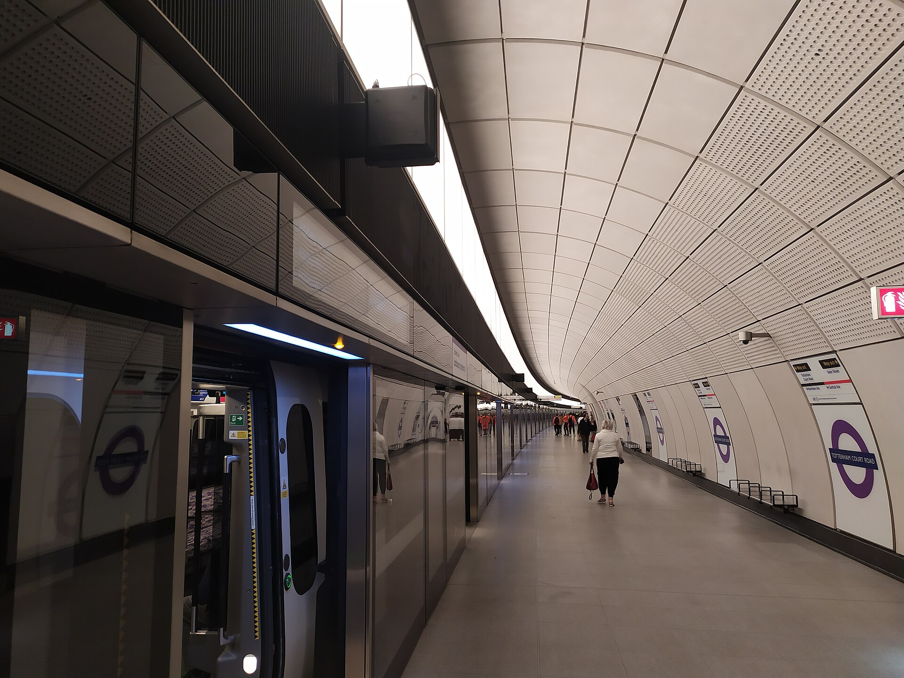
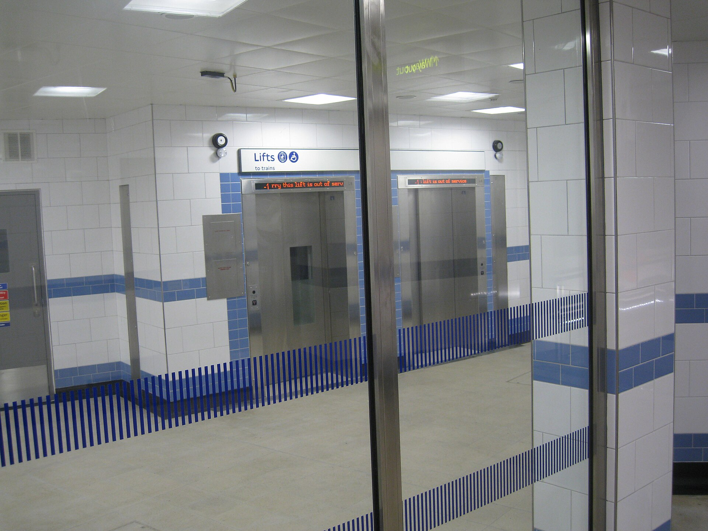
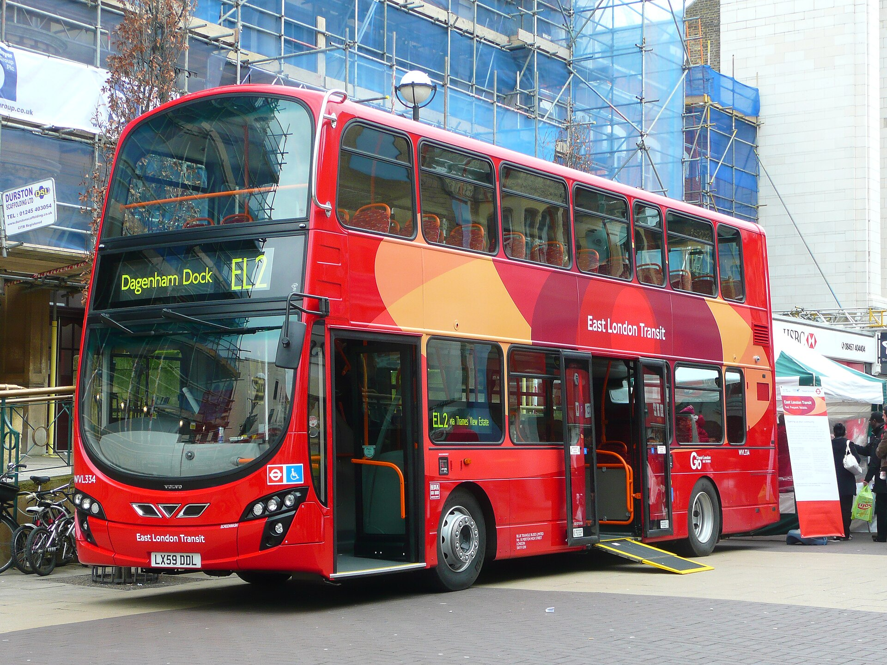
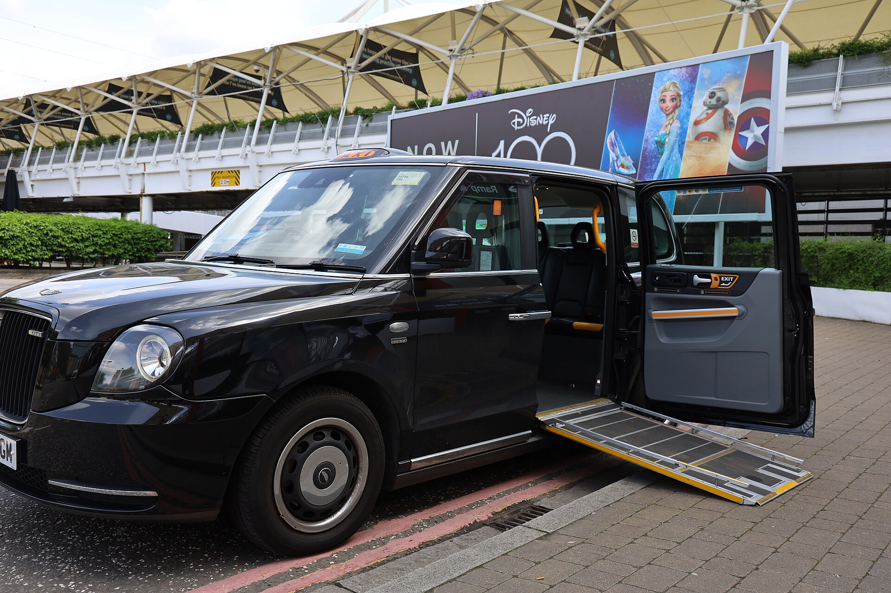
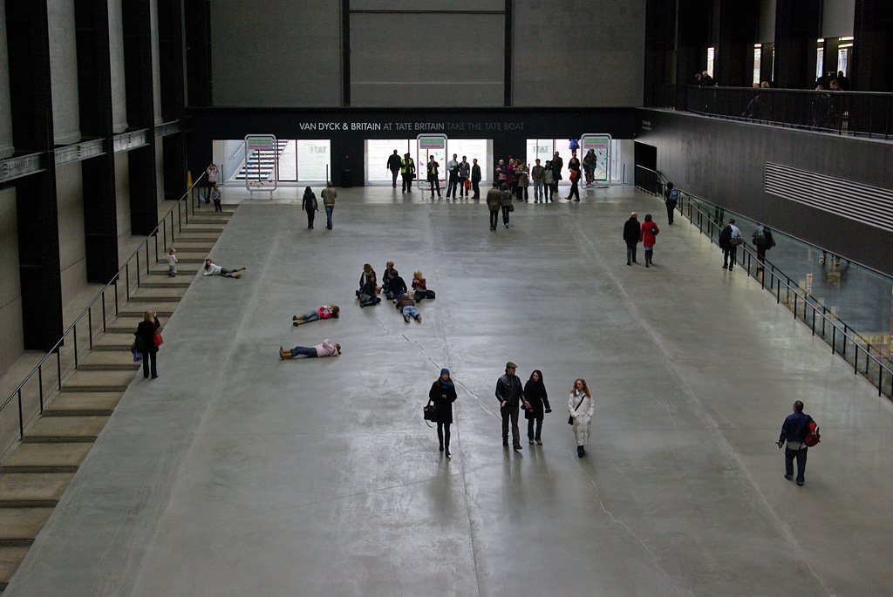

Step-free means no stairs and no escalators between the street and the train. It does not always mean you can get onto the train. A station can be step-free to the platform and still leave a step and gap wide enough to need a ramp that only a member of staff can lay. That distinction decides more London journeys than anything else, and TfL publishes it station by station, down to the millimetre.

> 💡 **The Short Version:** **95 Tube stations are step-free**, more than a third, against **all 41 Elizabeth line stations, every DLR station and every tram stop**. **Every London bus** has a ramp, a wheelchair space and a driver who can kneel the vehicle, and **wheelchair and mobility scooter users travel free on buses and trams** — which is why the bus answers a lot of journeys the Tube cannot. Assistance on the Tube, Overground and Elizabeth line is **turn up and go, no booking**, and **if a lift is out of service TfL will pay for an accessible taxi** to a station you can use. The thing to check on any route is whether each station is **step-free to the platform** (a ramp and a member of staff) or **step-free to the train** (you board yourself).

---

## Two symbols, and what they actually mean

*An Elizabeth line platform: level with the train, with platform-edge doors. This is what the blue symbol means — street to train, no ramp needed. Photo: [ShoreditchHighStreet](https://commons.wikimedia.org/wiki/File:Eastbound_Elizabeth_line_platform_Tottenham_Court_Road.jpg), [CC BY-SA 4.0](https://creativecommons.org/licenses/by-sa/4.0/).*

On the Tube map, a **blue wheelchair symbol means step-free from street to train** — a small step or gap that most people including wheelchair users can cross. A **white symbol means step-free from street to platform**: the lift gets you down, but the step and gap to the train are large and you will need a boarding ramp. TfL's own wording is blunt about it: at a street-to-platform station "there is a large step or gap and you will need a boarding ramp to get on and get off the train."

The [step-free Tube guide](https://tfl.gov.uk/cdn/static/cms/documents/step-free-tube-guide-map.pdf) goes further and prints the measurement for every step-free station. The step is banded at 0–50mm, 51–120mm and over 120mm; the gap is lettered **A** for 0–85mm, **B** for 86–180mm and **C** for over 180mm. A station marked A is the smallest of both. A station marked C is where a ramp is not optional.

Two kinds of ramp bridge the difference. **Mini ramps** cover the small remaining gap at step-free-to-train platforms and are available at [69 Tube stations](https://tfl.gov.uk/transport-accessibility/ramps-at-stations), several of them on specific lines only — Bond Street on the Jubilee platforms, Waterloo on the Jubilee, Westminster on the Jubilee, Tottenham Court Road on the Northern. **Boarding ramps** are the bigger ones used at street-to-platform stations on the Tube, Overground and Elizabeth line. Both take a maximum of **300kg**, and that figure covers you, your mobility aid and anyone helping you.

Where you wait matters, because level boarding usually exists at one point on the platform rather than along it. Look for the **"Board here"** sign on the platform's back wall, with matching ceiling and floor markings. The carriage varies by line: the Central line's point is carriage 7, first double door, in both directions; the Victoria line's is carriages 4 and 5; the Jubilee's is carriage 5, second double door, and carriage 6, first double door; the Northern and Piccadilly lines move it between carriage 5 and carriage 2 depending on direction. On the **Elizabeth line it is always carriage 5**, which holds four wheelchair spaces with alarm buttons at a reachable height, plus ten multi-use spaces.

## What is step-free, mode by mode

Counts are TfL's own, checked 21 September 2026.

| Mode | Step-free coverage | What still decides the journey |
| --- | --- | --- |
| **Elizabeth line** | All 41 stations, street to platform | Level access onto the train only from Paddington to Woolwich and at Heathrow; at Custom House only at carriage 5. Elsewhere staff lay a boarding ramp, which you can pre-book on 0343 222 1234 |
| **DLR** | Every station, street to train, by lift or ramp | Most stations are unstaffed. Passenger Service Agents ride the trains, and staffed help is pre-booked through Access DLR |
| **Trams** | Every stop | Staffed by the driver only |
| **Buses** | Every route and every bus, and the majority of stops | One wheelchair space per bus, not one per deck, and wheelchair and mobility aid users have priority in it |
| **London Overground** | More than 60 stations | Boarding ramps at street-to-platform stations; Passenger Assist can be booked two hours ahead. A step-free entrance opened at Surrey Quays in September 2026 |
| **London Underground** | 95 stations, more than a third | Some are step-free on one line and not another, and a few only in one direction. Check the station, not the interchange |
| **London Cable Car** | Both terminals and the cabins | Level access; carers travel free with proof bought at the ticket office |
| **River piers** | Most; Uber Boat by Thames Clippers says all but three of its own | Boarding is by ramp, and at three piers the brow gets too steep on some tides |

TfL's most recent Tube additions were **Northolt in September 2026**, Colindale in December 2025 and Knightsbridge in April 2025, and a new Paddington ticket hall gave the Bakerloo line step-free access for the first time in September 2024. **Leyton is due in summer 2027 and Burnt Oak by early 2028**, with South Kensington and Elephant & Castle planned as part of wider rebuilds. Everything else on TfL's [step-free access programme](https://tfl.gov.uk/travel-information/improvements-and-projects/step-free-access) is still at feasibility or design stage.

## The central London gap

*Green Park, one of the step-free stations in the middle of the gap. Photo: [AsparagusTips](https://commons.wikimedia.org/wiki/File:Green_Park_station_-_lifts_to_platforms.JPG), [CC BY-SA 3.0](https://creativecommons.org/licenses/by-sa/3.0/).*

The cluster of stations a first-time visitor reaches for is the weakest part of the network. **Charing Cross, Embankment, Covent Garden, Leicester Square, Piccadilly Circus, Holborn, Chancery Lane and Temple do not appear in TfL's step-free Tube guide at all.** **South Kensington** and **Monument** appear only as step-free interchanges between platforms — useful if you are already underground, no help from the street. **Bank** is step-free, but the lifts reach the Northern line and DLR platforms only, not the Central or Waterloo & City.

What does work in the middle:

- **Green Park** — Jubilee, Piccadilly and Victoria lines, all three with mini ramps. The most useful single station in the West End for a step-free journey.
- **Westminster** — Jubilee line with mini ramps; Circle and District platforms need a boarding ramp.
- **Tottenham Court Road** — the National Gallery names it, with Westminster, as its nearest step-free Tube station.
- **King's Cross St Pancras, Euston, Victoria, Waterloo, Paddington, Liverpool Street, Farringdon, London Bridge, Southwark, Blackfriars, Tower Hill** — all step-free, all with ramp provision.

For Trafalgar Square, the National Gallery's own [access page](https://www.nationalgallery.org.uk/visiting/access) points to Charing Cross **National Rail** station, 200 metres away, which is step-free even though the Tube station beneath it is not. For South Kensington's three museums, the V&A names **Knightsbridge**, 0.6 miles away, as the nearest step-free Tube.

## Getting help: turn up and go, and what to do when a lift fails

**Turn up and go needs no booking** and covers the Tube, London Overground and the Elizabeth line. Make yourself known to staff when you arrive and they will check your route for disruption, take you from the ticket hall to the platform, lay a mini ramp or boarding ramp, tell your interchange and destination stations you are on your way, meet you off the train, and push a manual wheelchair if you want. Staff will walk you to a lift but do not travel in it with you; they meet you at the other end.

If there is a queue outside a Tube station, TfL's own instruction is that customers who identify themselves as disabled should be let in without queueing, and that this covers personal assistants, support workers and carers with them.

**Passenger Assist** is the bookable version, part of the National Rail scheme. It runs at all London Overground and Elizabeth line stations and at [30 named Tube stations](https://tfl.gov.uk/transport-accessibility/passenger-assist) where TfL manages a National Rail interchange — Farringdon, Moorgate, Old Street, Stratford, Highbury & Islington, West Ham and Kentish Town among them. Book at least **two hours ahead** on **0343 222 2000**, open 24 hours every day except Christmas Day, or through the Passenger Assistance app. For a journey starting outside London, [National Rail's line](https://www.nationalrail.co.uk/help-and-assistance/passenger-assist/) is **0800 022 3720**, on the same two-hour rule.

**Luggage assistance is the narrow part.** It is available on the Elizabeth line and London Overground, and at those 30 Tube stations when you are changing to or from National Rail, Overground or Elizabeth line services. It is not available anywhere else on the Underground and is not part of turn up and go. National Rail staff will handle up to three items one person can manage.

**The DLR is mostly unstaffed.** [Access DLR](https://tfl.gov.uk/modes/dlr/access-dlr) is a free, pre-booked service, 07:00–20:00 seven days a week, in 30-minute slots, booked on **0808 281 6655** or online. Staff in pink vests meet you at an agreed point and will help with boarding, up to 10kg of handheld luggage or 23kg on wheels, and the walk to the gates of a connecting station or the nearest bus stop outside. **No proof of disability is required.**

> ⚠️ **If a lift is out, TfL pays for the taxi.** Where there is no reasonable step-free alternative, TfL will book you an **accessible taxi at its own cost**, to another step-free station or to your destination station anywhere in Greater London, whichever is quicker. This applies on the Tube, the Overground and the Elizabeth line, and it applies whether or not you booked assistance. Ask a member of staff or press the information button on a Help Point.

## Buses: the part of the network that works everywhere

*The ramp at the centre door. Every bus in London has one, and the driver lowers the bus to the kerb as well. Photo: [Spsmiler](https://commons.wikimedia.org/wiki/File:East-London-Transit-Demonstration-Bus1.jpg), public domain.*

**Every London bus route is run with low-floor vehicles**, each with an access ramp and one dedicated wheelchair space, and each able to kneel to cut the step up from the kerb. Every route, against 95 of the Tube's stations — for a lot of central journeys the bus is the better answer, not the fallback.

Drivers are trained to pull in close to the kerb, lower the bus, lower the ramp, **ask other passengers to make space** unless it is unreasonable for them to do so, and wait until you are seated or holding on before pulling away. If the bus has not knelt, ask. The ramp is at the middle exit door on a two-door bus; single-door buses have one at the front.

**Wheelchair and mobility aid users have priority in the wheelchair area.** A buggy may share it only if the driver judges there is room and the wheelchair or scooter user agrees. There is one space per bus, not one per deck, so an occupied space means waiting for the next one.

**Wheelchair and mobility scooter users travel free on buses and trams** — no ticket, no Oyster, no contactless. Companions and carers pay the ordinary fare. Before bringing a mobility scooter onto a bus, check it against TfL's Mobility Aid Recognition Scheme through the [travel mentoring service](https://tfl.gov.uk/transport-accessibility/fares-and-tickets); not every scooter qualifies.

Our [guide to using London buses and trams](/articles/how-to-use-london-buses-and-trams/) covers routes, fares and the Hopper transfer for everyone else in your party.

## River boats, the cable car and taxis

*Every licensed London taxi is wheelchair accessible and carries a ramp. Photo: [Turini2](https://commons.wikimedia.org/wiki/File:London_taxi_with_deployed_wheelchair_ramp.jpg), [CC BY-SA 4.0](https://creativecommons.org/licenses/by-sa/4.0/).*

**[Uber Boat by Thames Clippers](https://www.thamesclippers.com/plan-your-journey/accessibility) runs the river bus network**, and all of its piers are step-free and wheelchair accessible except three: **Cadogan, London Bridge City and Wandsworth Riverside Quarter**, where the boarding brow gets too steep at some states of the tide. The alternatives are Battersea Power Station for Cadogan, Bankside for London Bridge City, and Putney or Plantation Wharf for Wandsworth. Every boat is wheelchair, mobility scooter and pram accessible, boarding by ramp; the larger vessels take up to four wheelchairs plus three folded ones. Wheelchairs and scooters are not allowed on the back deck, which is a Maritime and Coastguard Agency escape-route rule rather than a house one. Every boat except Star, Storm and Sky Clipper has an accessible toilet.

Fares: **anyone with a disability pays 50%**, as does a Freedom Pass or 60+ Oyster photocard holder, and a **companion travels free** — choose "Concession + Carer" when booking, or ask at a staffed ticket office. Bring the physical pass; photos and screenshots are not accepted. Customer Service Assistants are on hand 10:00–18:00 at the London Eye, Westminster, Embankment, Bankside, London Bridge, Tower, Canary Wharf, Greenwich and North Greenwich piers. Our [river boats guide](/articles/how-to-use-london-river-boats/) covers the routes and the fare structure.

**The London Cable Car is step-free at both terminals and in the cabins.** A carer travels free with a paying adult or child, on production of a Blue Badge, a DWP letter, a Carer's Card, an Access Card or other recognised evidence, bought at the ticket office rather than online. TfL also issues a free [London Cable Car Digital Access Pass](https://tfl.gov.uk/transport-accessibility/nimbus-access-card-scheme) through Nimbus Disability, valid three years, which records what you need — a companion ticket, queue priority, level access, urgent toilet access — without you having to explain it each time. A general Nimbus Access Card, accepted by a wide range of UK venues, costs £15 for three years.

**Every London black cab has a wheelchair ramp.** Most also have an intermediate step and a seat that swivels out; ask the driver for either. Mobility scooters cannot be taken in a taxi. Some private hire vehicles have step-free access, but it is not standard, so specify it when you book.

## The big attractions, in their own words

*The Turbine Hall ramp at Tate Modern — the main entrance is the step-free one, which is rarer than it should be. Photo: [Robin Webster](https://commons.wikimedia.org/wiki/File:Tate_Modern_Turbine_Hall_entrance_ramp_-_geograph.org.uk_-_6712317.jpg), [CC BY-SA 2.0](https://creativecommons.org/licenses/by-sa/2.0/).*

| Place | Step-free way in | What decides the visit |
| --- | --- | --- |
| **British Museum** | Montague Place, or the lifts either side of the 12 steps at the Great Russell Street entrance | Rooms 16, 67, 69 and 95 have no lift or level access. No Changing Places toilet on site; the nearest is a 15-minute walk. Staff cannot push wheelchairs |
| **National Gallery** | Sainsbury Wing, the main entrance for everyone | Two Changing Places toilets, RADAR key from staff. One bookable Blue Badge bay on Orange Street, 48 hours' notice on 020 7747 2885, with five more in St Martin's Street |
| **Tate Modern** | The Turbine Hall ramp, or the Blavatnik Building from Park Street | Changing Places on Level 0 of the Natalie Bell Building, RADAR key from the Level 0 ticket desk. Accessible parking is bookable; two RADAR-operated lifts link it to the Turbine Hall |
| **Natural History Museum** | Queen's Gate (ramp) or Cromwell Road (steep ramp) | The Exhibition Road entrance is not step-free, though a lift runs from its lobby to the galleries. Changing Places on the ground floor of the North Wing |
| **V&A** | Cromwell Road or Exhibition Road, both step-free | The Tunnel entrance from South Kensington station is not wheelchair accessible. 13 accessible toilets; nearest Changing Places is the Science Museum. 12 Blue Badge bays on Exhibition Road, four hours, 08:30–18:30 |
| **Tower of London** | Level access to the Jewel House and the Crown Jewels | No lift or ramp to the Battlements, the Bloody Tower or the Imprisonment exhibition. The White Tower lift reaches only the basement shop, one wheelchair at a time. Changing Places in the New Armouries lobby, RADAR key from café staff |
| **St Paul's Cathedral** | The North Transept entrance, ramped, straight onto the cathedral floor | Crypt by lift with 1,400mm x 1,300mm of usable space; Quire by a stair lift with a 1.0m x 0.76m platform. Changing Places in the Crypt |
| **Westminster Abbey** | North Door, the only wheelchair-accessible door, or the Great West Door | The Lady Chapel is 12 steps up, plus three more into each royal tomb. From inside, the Cloisters are five steps down; leave by the Great West Door and re-enter step-free from Dean's Yard instead |
| **Buckingham Palace** | A separate entrance at the front, pre-booked on 0303 123 7324 | The standard route runs 47 steps up the Grand Staircase and 41 down the Ministers' Staircase. Lifts are 148cm x 94cm and 145cm x 110cm — check your chair fits. Changing Places at the Royal Mews |
| **Churchill War Rooms** | Horse Guards Road, by St James's Park | One lift covers the 15 steps to the basement. The narrowest point of the route is **68cm** and the tightest corner is 90 degrees; staff suggest transferring to a museum wheelchair |
| **London Eye** | Wheelchair time slots, booked in advance | **Two wheelchair users per pod and eight on the wheel at once.** Slots sell out at peak times. The London Eye River Cruise takes three wheelchairs |
| **Tower Bridge** | Lifts in both towers to the high-level walkways, plus an external lift to the Engine Rooms | No Changing Places; the nearest are the Tower of London at 700m and London Bridge station at 750m. The two quiet spaces in the South Tower are not step-free |
| **Sky Garden** | Philpot Lane, with lifts from street level and more inside | Step-free throughout the visitor route, and free with a booked ticket |
| **Sir John Soane's Museum** | An internal and an external platform lift, staff-operated | Call **020 7405 2107** at least 24 hours ahead so someone is there to work the lift. Corridors take chairs no wider than 41cm; the museum lends narrow ones, and some rooms are too tight for a walking frame |

Three of those need planning rather than a ticket. **The Tower of London** is a medieval fortress with spiral staircases, cobbles and low doorways, and its own page says wheelchair access is limited — the Crown Jewels are reachable, much of the rest is not. **Buckingham Palace** is accessible, but only by telling them in advance; turning up on the day and asking puts you at the foot of 47 steps. **St Paul's** galleries are 257 steps to the Whispering Gallery, another 119 to the Stone and another 152 to the Golden, stairs the whole way, and the Triforium tour adds 141 more.

Our [Tower of London](/articles/tower-of-london-guide/), [Westminster Abbey](/articles/westminster-abbey-guide/), [London Eye](/articles/london-eye-guide/) and [Churchill War Rooms](/articles/churchill-war-rooms-guide/) guides cover tickets, queues and timing for each.

## Free companion and carer tickets

These are the ones the operator publishes outright:

- **Westminster Abbey** — free admission for a disabled visitor and one essential companion, who need not be a professional carer.
- **St Paul's Cathedral** — a free sightseeing ticket for a disabled visitor and an accompanying carer or assistant, bookable ahead or asked for on arrival. Worship is free to everyone.
- **Tower of London** — one free carer or companion ticket per disabled visitor, added online. More than one, and you email the booking reference or show documents at the ticket office; Historic Royal Palaces keeps capacity aside for them.
- **Buckingham Palace** — a free Access Companion ticket with every visit, concessionary rates for disabled visitors, and **no proof of disability required**.
- **British Museum, National Gallery, Tate, Natural History Museum and V&A** — concession exhibition tickets with a free companion ticket alongside. The Natural History Museum asks for no ID.
- **London Eye** — a free carer ticket added at booking, with a Blue Badge, a DLA or PIP letter, a CVI, an Access Card with the +1 symbol or an international equivalent shown on arrival.
- **Uber Boat by Thames Clippers** and the **London Cable Car** — a free companion ticket, from a staffed ticket office.

Free wheelchair loans are common, but the notice each place wants is not the same. The British Museum asks for two working days and takes bookings only on weekdays; Buckingham Palace pre-books through its Specialist Sales team; the V&A and Tate Modern suggest 24 hours; and the Natural History Museum, Tower of London, Tower Bridge and Westminster Abbey hand them out first come, first served on the day. A complimentary wheelchair is also available at every Elizabeth line station except Bond Street, Tottenham Court Road, Farringdon, Liverpool Street and Whitechapel, and at some National Rail stations — but at no Tube, Overground or DLR station.

## Changing Places toilets

A Changing Places toilet is a larger room with a height-adjustable adult changing bench and a hoist, on top of what an ordinary accessible toilet has. These are the ones registered with the [Changing Places Consortium](https://www.changing-places.org/find) in central London and the places visitors actually go, checked 21 September 2026:

- **Museums and galleries** — Tate Modern, Tate Britain, the National Gallery (two, in the Sainsbury Wing and the Roden Centre), the National Portrait Gallery, the Imperial War Museum, the Science Museum, the National Army Museum, the Postal Museum, the National Maritime Museum, Museum of London Docklands.
- **Landmarks** — the Tower of London, St Paul's Cathedral, the Houses of Parliament, City Hall, ZSL London Zoo, Madame Tussauds, the Royal Mews at Buckingham Palace.
- **Arts venues** — the Barbican Centre, the Royal Festival Hall, the Roundhouse, Woolwich Works, The O2.
- **Stations** — King's Cross, Euston, Paddington, Victoria and London Bridge.
- **Shopping and parks** — Battersea Power Station, Westfield London, Westfield Stratford City (two floors), Regent's Park, Greenwich Park, and a public block on Victoria Embankment.

Several need a RADAR key you ask staff for rather than carry: the Tower of London's is opened by café staff in the New Armouries, and Tate Modern's and the National Gallery's come from their ticket desks. The **British Museum has no Changing Places toilet**, and points visitors to Great Ormond Street Hospital, 15 minutes' walk from the Montague Place entrance. The **V&A** sends visitors next door to the Science Museum.

For ordinary accessible toilets on the transport network, TfL publishes a [station-by-station list](https://tfl.gov.uk/help-and-contact/public-toilets-in-london) that marks which are accessible, which need a RADAR key and when each is open. Our [public toilets guide](/articles/public-toilets-london/) covers the rest of the city, including where to buy a RADAR key.

## Driving: Blue Badge and the Congestion Charge

**The Blue Badge scheme does not fully apply in four central London boroughs** — the City of Westminster, the City of London, Kensington and Chelsea, and part of Camden. The England-wide concession that lets a badge holder park on single or double yellow lines for up to three hours does not hold in any of them. What replaces it:

- **Westminster** — a Blue Badge bay gives **four hours free** during controlled hours and unlimited time outside them. A paid bay gives one extra hour free after the purchased time. Single yellow lines are out during controlled hours, double yellows at all times.
- **City of London** — **over 200 designated bays**, free with badge and clock, **four hours on weekdays** (six around St Bartholomew's Hospital) and no time limit at weekends. A paid bay gives an extra free hour. Yellow lines, bus lanes, pavements and suspended bays are all out.

On **TfL red routes** — the main roads TfL owns and maintains, marked with red lines rather than yellow ones — a badge lets you use bays reserved for Blue Badge holders, short-term parking boxes during their operational period, and loading boxes that show the badge symbol. A vehicle displaying a badge may enter a bus lane on a red route to set you down or pick you up, but not on a bus-only route.

**The Congestion Charge is £18 a day** as of September 2026 (£21 if you pay by midnight on the third day after), 07:00–18:00 Monday to Friday and 12:00–18:00 at weekends and on bank holidays. **A Blue Badge holder gets a 100% discount** and does not need to own or drive a car to claim it: register up to two vehicles you would normally travel in, send a copy of both sides of the badge plus one proof of identity, and pay a **£10 registration fee** that renews with the badge. Pay the charge in the meantime — the discount is not backdated.

**ULEZ is separate and a Blue Badge alone does not exempt you.** Three grace periods run to **24 or 25 October 2027**: vehicles registered with the DVLA in the "disabled" or "disabled passenger vehicle" tax class (automatic for UK-registered vehicles), converted wheelchair accessible vehicles, and drivers or passengers on qualifying disability benefits. Each of the last two must be applied for, and covers one vehicle. Outside those, a non-compliant vehicle pays.

## Fares, passes and what is actually free

**Wheelchair and mobility scooter users travel free on buses and trams**, with no pass needed. Everywhere else you pay, and the discount worth having is the **[Disabled Persons Railcard](https://www.disabledpersons-railcard.co.uk/)**: **£20 for a year, £54 for three**, a third off for you and one adult companion, with no time restrictions. In London it does something the other railcards do not — added to an Oyster card by station staff, it takes **a third off pay as you go fares at peak as well as off-peak**, and buys discounted Anytime and Off-Peak Day Travelcards for you and your companion. It has to go on an Oyster card; contactless will not carry it. Eligibility runs on UK documents — a PIP or DLA award letter, a Certificate of Visual Impairment, a Blue Badge, a Motability lease — so it is a resident's card in practice rather than a visitor's.

The **Freedom Pass** is free travel across TfL and it is for **London residents only**, applied for through London Councils. A Disabled Person's Freedom Pass is valid at any time, including before 09:00. An **English National Concessionary Pass** from any English council works on London buses from 09:00 on weekdays and all day at weekends.

TfL's free **"Please offer me a seat"** badge and card work on every mode and need no explanation to staff or other passengers. It is posted to UK addresses only. TfL staff also recognise the **Hidden Disabilities Sunflower**, as do Uber Boat by Thames Clippers.

## Before you travel

* **Check the lifts on the day, not the week before.** A step-free route is only step-free while its lifts are running. TfL's Journey Planner and the TfL Go app both carry live lift status, and TfL Go has a step-free mode — tap the wheelchair icon, and it separates step-free-to-platform from step-free-to-train results.
* **Check the return leg separately.** Some stations are step-free in one direction only, and a few need a specific entrance depending on which way you are going.
* **Allow 15 minutes for an interchange**, which is what TfL asks for when a Passenger Assist booking changes services.
* **Tell staff at the first station, not the last.** They will ring ahead so a ramp is waiting on the platform when you arrive.
* **Take a photograph of your Blue Badge, front and back, before you leave.** The Congestion Charge discount application wants both sides, and so do several attractions' carer-ticket desks.

---

## Continue planning your London trip

- 🏉 **[Twickenham Stadium Travel Guide](/articles/twickenham-stadium-travel-guide/)** — 62 wheelchair bays, a Changing Places room, and the accessible shuttle from Richmond
- 🚇 **[Getting Around London: Transport Guide](/articles/getting-around-london-transport-guide/)** — every mode compared, and which one suits which journey
- 🚈 **[How to Use the London Underground](/articles/how-to-use-the-london-underground/)** — lines, zones, etiquette and the map
- 🚌 **[How to Use London Buses and Trams](/articles/how-to-use-london-buses-and-trams/)** — routes, fares and the Hopper
- ⛴️ **[How to Use London River Boats](/articles/how-to-use-london-river-boats/)** — piers, timetables and what a river trip costs
- 💳 **[Oyster Card Guide](/articles/oyster-card-guide-london/)** and **[London Transport Costs and Fares](/articles/london-public-transport-costs-and-fares/)** — where a railcard discount gets loaded
- 🚻 **[Public Toilets in London](/articles/public-toilets-london/)** — the free ones, the paid ones and the RADAR key
- 👶 **[London with Children](/articles/london-with-children/)** — buggies on the network, and which attractions suit which age
- 🏛️ **[Best Museums in London](/articles/best-museums-london/)** — what is in each, and which are free
- 🏥 **[Healthcare in London for Visitors](/articles/healthcare-for-visitors-london/)** — pharmacies, GPs and A&E

---

*Station counts, assistance rules and ramp figures are from Transport for London's own accessibility pages and its step-free Tube guide; assistance booking from National Rail; parking rules from gov.uk, Westminster City Council and the City of London Corporation; and every attraction's access detail from its own site. Checked 21 September 2026. Step-free coverage changes as lifts open, so check your route on the day.*
