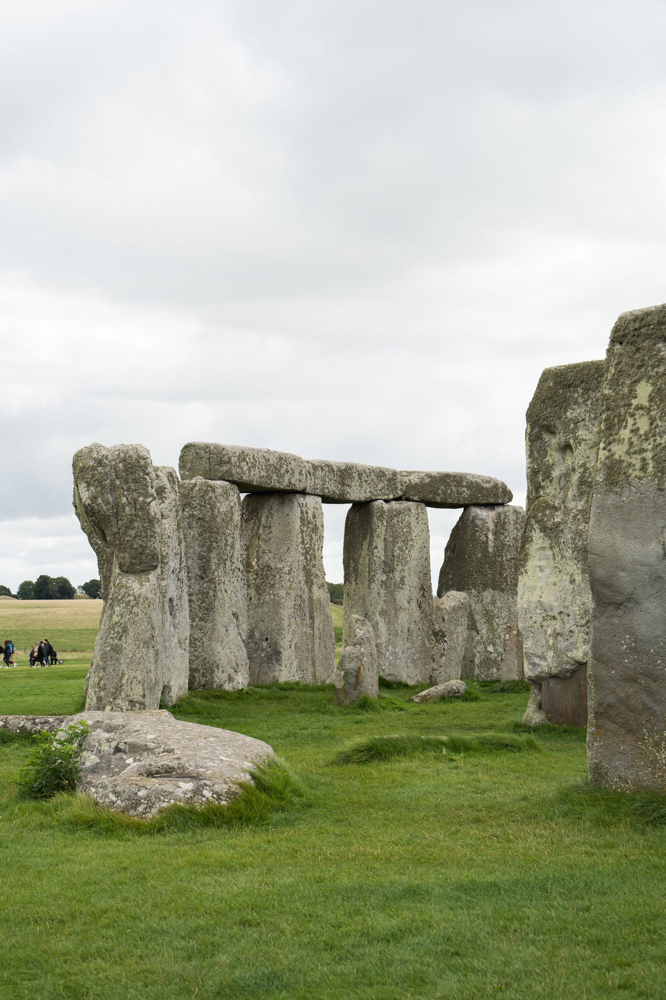

**Stonehenge admission is £27.20 to £32.30 for an adult booked ahead, and which of those you pay depends entirely on the date you pick.** English Heritage runs three price bands, and a Wednesday in late October costs £5 less than the Saturday before.

The harder question is how you get there. Stonehenge sits in a field off the A303 with no station anywhere near it, and the honest answer is that the public transport route works — it just hangs on one hourly bus from Salisbury that stops running mid-afternoon.

> 💡 **The Short Version:** **Adult advance £27.20–£32.30** by date, **15% more on the day**, children half price, **members free** — and **National Trust England members free too**. **Open 09:30–17:00 daily**, shut only on Christmas Day, **last ticket sold 14:30**. Train **Waterloo to Salisbury, 1h23, from £16.40**, then the **Stonehenge Tour bus, £43.50 including admission** — but only **five buses out in winter, the last at 14:05**. **Inside the circle is the Stone Circle Experience only, from £70.** **Free at the solstices and equinoxes** — next up **23 September 2026**. **Allow two hours** on site. Parking **£4**.

## What it costs

| Adult ticket | In advance | On the day |
| --- | --- | --- |
| **Super Saver** — weekdays, 28 Sep 2026 to 14 Mar 2027 | **£27.20** | £32.00 |
| **Saver** — weekdays to 27 Sep, weekends 28 Sep to 20 Dec | **£29.75** | £35.00 |
| **Standard** — weekends to 27 Sep 2026 | **£32.30** | £38.00 |

**Advance is exactly 15% below the door price in every band**, and you can book online until midnight the day before and still get it. Booking a later arrival time on the day you have chosen can knock a little more off again.

| Ticket, Super Saver band | In advance | On the day |
| --- | --- | --- |
| **Child (5–17)** | **£13.60** | £16.00 |
| Concession | £24.65 | £29.00 |
| **Family, 2 adults + up to 3 children** | **£68.00** | £80.00 |
| Family, 1 adult + up to 3 children | £40.80 | £48.00 |
| **Member** | **Free** | Free |

In the Standard band the same family ticket is £80.75, and the child is £16.15. **Children are simply half the adult price**, and the family ticket is a genuine saving on top — two adults and two children come to £68.00 rather than £81.60.

> 💡 **Every price above includes a voluntary 10% donation, because that is the figure English Heritage leads with.** You can decline it and pay less: the adult advance ticket is **£24.65 in the Super Saver band and £29.32 in the Standard band** without it. The donation lets the charity reclaim Gift Aid, so it is worth more to them than it costs you — but it is optional, and the checkout does not make that obvious.

**National Trust England members get in free**, booking online with the code **G03ANZ** and bringing the card plus photo ID. That is England only, not Scotland and not international National Trust bodies. People with refugee or displaced-person status also enter English Heritage sites free.

### Opening hours, and the one day it shuts

**09:30 to 17:00, seven days a week**, right through to the end of the published calendar in March 2027. In June, July and August the site runs to 19:00.

> ⚠️ **Last admission is two hours before closing, and the last ticket of the day is sold at 14:30** — 16:30 in June, July and August. That is much earlier than people expect, and it is the rule that catches out anyone planning a lazy start.

**The only closure is Christmas Day.** Christmas Eve, Boxing Day, New Year's Eve and New Year's Day are all normal 09:30–17:00 days. Hours on the solstices — 21 June and 22 December 2026 — are subject to change.

Tickets are valid all day, so you can arrive any time within opening hours and stay as long as you like. You are still given an arrival slot when you book, and if you turn up more than half an hour late you may be held to the next slot with space.

## Getting there without a tour

### The train

**London Waterloo to Salisbury is direct, twice an hour, and takes 1h23 to 1h30.** Checking a Tuesday in September, advance singles ran from **£16.40 to £36.60** depending on the departure, and the cheapest same-day return on any train was **£32.80**. Coming back, evening singles from Salisbury were £23.30 to £32.30.

Salisbury is **12 miles from the stones**, so the train only gets you two thirds of the way.

### The Stonehenge Tour bus

Operated by Salisbury Reds, hop-on hop-off from **Salisbury rail station forecourt** and **New Canal Stand U** in the city centre, out to Stonehenge and back via **Old Sarum**. Commentary in ten languages. About 35 minutes each way.

| Ticket | Adult | Child (5–15) | Family (2+3) |
| --- | --- | --- | --- |
| **Bus only** | £20.50 | £14.00 | £55.00 |
| **Bus + Old Sarum + Stonehenge** | **£43.50** | **£29.00** | **£131.00** |
| Bus + Old Sarum + Stonehenge + Salisbury Cathedral | £53.00 | £37.00 | £155.00 |

**The bus-only ticket does not include Stonehenge entry.** Buy the combined one: £43.50 against £20.50 plus a £27.20 admission is cheaper *and* throws in Old Sarum, and it covers the visitor centre shuttle and removes the need to book a time slot at all. Cathedral entry on the all-in ticket stays valid for 48 hours. Tickets are sold online, at Salisbury station, at the tourist information centre, or from the driver — anything over £100 has to be cash.

> ⚠️ **The winter timetable is the reason this trip fails.** From 7 September there are **five buses out of Salisbury: 10:05, 11:05, 12:05, 13:05 and 14:05**, and the last one back leaves Stonehenge at **17:15**, reaching the station at 17:35. In summer, 28 March to 6 September, you get a sixth at 15:05 and a last departure at 18:15. Miss a connection at Salisbury and there is no second option except a taxi.

### What it actually costs and takes

Catch the 09:00 from Waterloo, make the 11:05 bus, and you are at the stones by 11:40 and back in London by about 16:30. Google Maps puts the door-to-door trip at **2h36 from Charing Cross**; once you add the wait at Salisbury, **three hours each way is realistic**.

On money, one adult mid-week in winter is roughly **£33 to £40 for the rail return plus £43.50 for the bus and entry — about £80 all in**. A 6½-hour coach from London with admission included starts at £66.

**That is why most people end up on a coach.** Not cost: one booking, one vehicle, and a departure time that does not depend on a five-a-day bus.

### Driving

**88.7 miles and 2h11 from Charing Cross** via the M3 and A303. Sat nav **SP4 7DE**. **Parking is £4** for non-members, paid by app; members park free with the sticker displayed.

## Seeing it free, from the National Trust land

**The stones sit in 2,100 acres of National Trust downland, and that land is free and open all year.** Public byways and bridleways cross it, so you can walk to within a field of the circle without a ticket — the view from **King Barrow Ridge**, across the Avenue, is the one worth walking for.

The catch is parking. **There is no parking anywhere in the landscape**, and the only car park is English Heritage's at the visitor centre, which costs **£4** (free if you have a ticket or are a member). So the free version works best on foot: it is about **1½ miles from Amesbury**, using the underpass beneath the A303 roundabout, or a mile from Durrington and Woodhenge.

You also get a good look at the circle from the **A303** as you drive past, which is how most people in Britain have seen it. You cannot stop on that road, so treat it as a glimpse rather than a visit.

**Free is not the same as close.** Inside the fence you walk right up to the stones; from the byways you are a few hundred metres away and will want a zoom lens. If the point of the day is the stones themselves, pay.

## Inside the circle: the Stone Circle Experience

*The trilithons. On a normal ticket the visitor path brings you within about 5m of them. Photo: Daria Agafonova, Pexels.*

**During opening hours nobody goes inside the stones.** The archaeology sits just under the turf and the lichens on the stones are fragile, so the visitor path is the whole of it — a one-way circuit all the way round, hard-standing and grass, closest approach about 5m.

**The Stone Circle Experience is the exception.** One hour, early morning or evening, outside normal visiting hours, with a guide, and you stand inside the circle.

- **From £70 adult (18+), from £40 child 5–17**, under-5s free, with member discounts.
- **Maximum 52 people per session**, split into two groups of 26 at the stones. One group tours inside the circle while the other walks the landscape — the Slaughter Stone, the Heel Stone — then they swap.
- **Booking is open to March 2027**, and availability is described as very limited.
- **There are no sessions in October or November.**
- **Be ready to board the shuttle ten minutes before your start time.** Morning sessions: the café opens at 09:00 and the exhibition at 09:30. Evening sessions: you can be on site an hour before the site shuts to day visitors, so a 17:00 close means arriving by 16:00.
- You may photograph everything. You may not stand on or touch the stones. Meditation, yoga and handfasting need a private booking of the whole session — call 0370 333 1181.

## Free access at the solstices and equinoxes

English Heritage opens the monument field free four times a year, and you can walk among the stones.

**Autumn Equinox 2026 is Wednesday 23 September.** Car park entry from **05:15**, the field opens as soon as there is light, **sunrise at about 06:54**, open access ends at **08:30**, car park cleared by 10:00.

> ⚠️ **No public transport runs for the equinoxes at all.** Car, taxi, bike or on foot only, with the roads open as normal. For the **summer solstice** — 20 and 21 June — the opposite applies: car parking must be pre-booked and had sold out well ahead, vehicles without a booking were turned away, and Salisbury Reds laid on special buses from Salisbury station and New Canal instead. The tour bus itself finished early on the Saturday and did not run at all on the Sunday.

The conditions are the same every time: do not touch or climb the stones, no alcohol or drugs, no glass, no drones, no naked flames including incense, no tents or sleeping bags, no amplified music, bags no bigger than about 30 × 25 × 15cm, assistance dogs only. Acoustic instruments are fine. It is dark, the ground is uneven, and a torch matters.

**Winter solstice 2026 falls on 22 December.**

## On site: time, the shuttle and access

**Two hours covers it** — the exhibition, the shuttle out, a full circuit of the stones and back. English Heritage publishes a two-hour itinerary, a half-day and a full day taking in the wider Wiltshire landscape.

**The shuttle leaves from outside the shop, needs no booking, runs every few minutes and takes 5 to 10 minutes.** It is not tied to your ticket time. It also stops at **Fargo Plantation**, roughly halfway, so you can ride out and walk the second half.

**Walking instead** follows a marked route across National Trust open-access land past Bronze Age burial mounds, **25 to 40 minutes each way**, with a dedicated walker's lane beside the bus road on the return. The round trip from the visitor centre and back is about **2.6 miles (4km)**, much of it fields and unmade paths. There is no shelter and no toilet at the stones.

**Included in every ticket:** the shuttle, the exhibition — over 250 objects and the forensically reconstructed face of a man who died 5,500 years ago — the Neolithic houses with volunteers demonstrating Neolithic crafts, and an orientation leaflet. **The audio tour is a free download to your own phone**, so bring headphones. The guidebook costs extra.

**Accessibility:** 22 accessible parking bays, set-down 100m from the visitor centre, two wheelchairs and mobility scooters on free loan first-come at the admissions tills, and a fully accessible shuttle that takes Class 2 scooters up to 600 × 1000mm. The path from the bus stop to the circle is about 200m with a slight gradient, and the grass paths around the monument are wheelchair accessible weather permitting — **the wider landscape is not**. A carer or companion comes free; book their place online. There are braille guides and signage, induction loops on every audio exhibit and till, subtitles and BSL on the spoken exhibits, an audio-described tour, tactile objects in the exhibition plus two touching stones outside, and a Changing Places facility at the visitor centre — bring a RADAR key.

Bags may be searched and there is no cloakroom or left luggage, so travel light. Assistance dogs go everywhere; other dogs are limited to the visitor centre and cannot board the shuttle or enter the stone circle field.

## The coach tours, and the trap in their titles

Powered by <a target="_blank" rel="sponsored" href="https://www.getyourguide.com/london-l57/">GetYourGuide</a>

Three products, all checked against their own inclusions list: a **6½-hour morning trip with admission at £66**, departing from Cromwell Road in South Kensington; a **6-hour half-day at £69.30**; and an **11-hour Stonehenge-and-Bath day at £85** from Gloucester Road at 07:00, which includes Stonehenge entry but not the Roman Baths.

> ⚠️ **A headline price that looks too good usually is, because the admission is an optional extra.** Across this site's survey of day-trip listings, ten products named an attraction in the title and then buried its entry ticket in an "if option selected" clause — between them holding around 22,000 reviews. Stonehenge is the worst affected: the cheapest Stonehenge coach seat on the market advertises from £27, and that buys a ride to the car park and nothing else. **Read the inclusions list, not the title, and check that the words "entry" or "admission" appear without a condition attached.**

## Does anything else fit in the same day?

| Paired with | Travel time | Honest verdict |
| --- | --- | --- |
| **Salisbury** | 12 miles, ~25 min on the tour bus | **The natural one.** Old Sarum is on the bus route home, and the all-in ticket adds the Cathedral. The operator's own suggestion is five hours for all three. |
| **Bath** | 56 min by car, 1h55 by public transport | **Works, just about.** The standard 11-hour coach day. Bath gets around three hours, which is enough for the Roman Baths or a wander, not both. |
| **Windsor** | 1h17 by car from Stonehenge | **Too much.** Windsor Castle wants 1½ to 2 hours of its own and is shut Tuesdays and Wednesdays. |

**Salisbury to Bath Spa is direct, hourly and 54 to 57 minutes, from £23.50** — so doing the pair under your own steam is genuinely viable: Waterloo out, the bus to the stones, then the train on to Bath and home from Paddington. It makes for a long day, and it is the one itinerary where buying it as one coach ticket saves real effort. More on the Georgian end of it in our [Bath day trip guide](/articles/bath-day-trip/).

## What people get wrong

- **Arriving after 14:30.** The last ticket of the day is gone, even with hours of daylight left.
- **Buying the bus-only ticket** and discovering at the admissions desk that entry is not in it.
- **Missing the last bus back**, which leaves Stonehenge at 17:15 in winter.
- **Expecting to walk among the stones.** That is the Stone Circle Experience, and it is a separate booking from £70.
- **Booking the cheapest coach listing** whose admission turns out to be an optional paid extra.
- **Paying on the day.** It is 15% more, and the advance price is available until midnight the night before.
- **Picking a Saturday in September** when the Wednesday after is £5 less.
- **Driving to the solstice without pre-booked parking.** Cars without a booking are turned away and illegal parking gets towed.

## Continue planning your London trip

- 🗺️ **[Day trips from London](/articles/day-trips-from-london/)** — what the others cost, how long they take, and which days they are shut.
- 🛁 **[Bath day trip](/articles/bath-day-trip/)** — the other half of the classic coach day, and how to do it by train instead.
- 🏰 **[Windsor from London](/articles/windsor-day-trip/)** — the easiest big day out, and the two days a week it is closed.
- ⚡ **[Harry Potter Studio Tour](/articles/harry-potter-studio-tour/)** — the day trip where you genuinely cannot buy on the door.
- 🏛️ **[Historic houses in London](/articles/historic-houses-london/)** — grand interiors without leaving the city.
