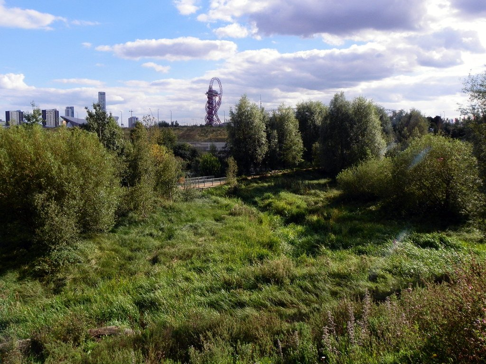
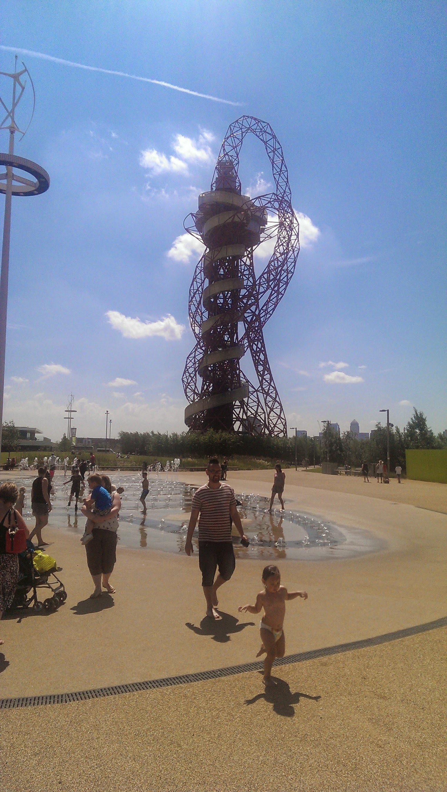
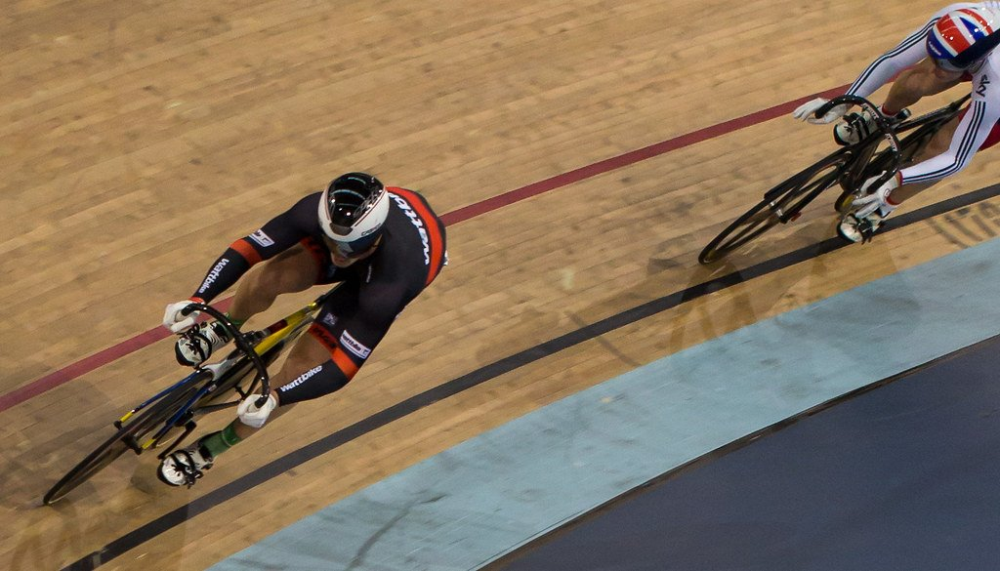

Stratford was a rail junction and a shopping centre until 2012, when the Olympics rebuilt 560 acres of contaminated industrial land into the Queen Elizabeth Olympic Park. Unlike most Olympic sites, it is genuinely used: the pool is a public pool, the stadium is a football ground, the velodrome takes bookings.

It is also one of the best-connected places in London — six lines meet at Stratford, and the Elizabeth line reaches Liverpool Street in nine minutes.

Stratford has its own share of the commemorative plaques marking where notable people lived or worked - see them on our [interactive map](/plaques/?area=stratford).

## Why visit — and who should skip it

**Come here if** you have children, or you want to swim in an Olympic pool, or you like modern landscape design. The park is free, large, full of waterways, and far less crowded than the royal parks.

**Skip it if** you want historic London. Almost nothing here predates 2012 and the older parts of Stratford were largely swept away. There is no old street pattern to explore.

## Top sights and activities

1. **Queen Elizabeth Olympic Park** — 560 acres, free and open daily. Waterways, wildflower meadows, play areas and the River Lea running through it.
2. **ArcelorMittal Orbit and The Slide** — Anish Kapoor's 114-metre sculpture, the tallest in Britain, with Carsten Höller's 178-metre tunnel slide wrapped around it. Forty seconds, and the longest slide in the world. Ticketed, with height limits.
3. **London Aquatics Centre** — Zaha Hadid's wave-roofed building. You can swim in the Olympic pool for the price of an ordinary session, which is the best-value thing in Stratford.
4. **London Stadium** — Now West Ham's ground, with tours on non-event days including the pitch and the dressing rooms.
5. **East Bank** — The cultural quarter: V&A East, Sadler's Wells East, BBC Music and university campuses, opening in stages.
6. **Lee Valley VeloPark** — The Olympic velodrome, open for taster sessions on the boards, plus BMX and mountain bike tracks.
7. **Hackney Wick and the canal** — West across the water. Warehouse studios and canal-side breweries, twenty minutes on foot.

*The planted river valley running through the Olympic Park. Most of the park is this rather than the venues. Photo: [Peter O'Connor aka anemoneprojectors](https://www.flickr.com/photos/58414938@N00/25121703793), [CC BY-SA 2.0](https://creativecommons.org/licenses/by-sa/2.0/).*

## Key streets and micro-districts

### The Olympic Park (south)
The busy half, built around the main waterways. **The ArcelorMittal Orbit** is here — Britain's tallest sculpture, with the world's longest tunnel slide wrapped around it — along with the **London Stadium**, the **Aquatics Centre**, and **East Bank**, the new cultural quarter bringing the V&A, Sadler's Wells and the BBC onto the park.

**The Aquatics Centre is open to the public to swim in**, in the actual Olympic pool, for the price of an ordinary leisure-centre session.

**The park itself is free and always open.** The Orbit and the slide are ticketed and seasonal, so check before making the trip for them.

### The Olympic Park (north)
Quieter parkland, and the half most visitors never reach. The **VeloPark** is here — the Olympic velodrome, open for public track sessions and taster rides — along with the **Copper Box Arena**.

The landscaping is deliberately wilder up here: reedbeds, meadow planting and the River Lea running through rather than the formal lawns to the south.

**Free, open at all times, and genuinely quiet on a weekday.** It is about twenty minutes' walk from Stratford station to the northern end, so allow for the distance.

*The ArcelorMittal Orbit and the park fountains. The fountains run through the summer and are free.*

### Westfield Stratford City
Between the station and the park, with around 250 shops — **and you have to walk through it to reach the park**, which is by design rather than accident.

It is one of the largest shopping centres in Europe, with a cinema, a casino and a bowling alley alongside the retail.

**Typically 10am to 9pm**, and the Sunday six-hour trading rule applies to the big units. Allow ten minutes to cross it, more at a weekend.

### Stratford town centre
East of the station, and **the Stratford that existed before 2012** — a covered market, an ordinary high street, and a completely different feel from the park side.

**Theatre Royal Stratford East** is the anchor: a Victorian producing house on Gerry Raffles Square with a long history of new and community work, and considerably cheaper tickets than the West End.

**Five minutes east of the station**, and the answer if the park and Westfield have started to feel like an airport.

### Hackney Wick
West across the canal, and reached from the park by footbridge in a couple of minutes. **Warehouse studios, breweries and taprooms**, with painted walls that change constantly.

It is a drinking and wandering destination rather than a sightseeing one, and much of the original studio space has been redeveloped — though enough remains to give it the character.

**Best on a summer afternoon**, and fairly bleak in the rain. Hackney Wick has its own Overground station if you would rather not walk back through the park.

*The velodrome from the 2012 Games. You can book taster sessions and ride the boards yourself. Photo: [kevin.gale](https://www.flickr.com/photos/52647449@N04/23204273471), [CC BY 2.0](https://creativecommons.org/licenses/by/2.0/).*

Powered by <a target="_blank" rel="sponsored" href="https://www.getyourguide.com/london-l57/">GetYourGuide</a>

## Where to eat and drink

| Spot | Style | Price | Why go |
| --- | --- | --- | --- |
| **Westfield food court** | Mixed | ££ | Around 70 options; the practical choice with children |
| **Crate Brewery** | Brewery and pizza | ££ | Canal-side at Hackney Wick, twenty minutes west |
| **The Cow** | Pub | ££ | In Westfield but genuinely pub-like, with outdoor seating |
| **Stratford covered market** | Market stalls | £ | East of the station; cheap and entirely local |
| **Barge East** | Restaurant on a barge | ££ | A restored Dutch barge moored on the River Lea |
| **Hackney Wick canal bars** | Various | ££ | Best on a summer afternoon |

## Getting there

**By Elizabeth line.** Nine minutes from Liverpool Street, about eighteen from Bond Street. The fastest way in and fully step-free.

**By Tube.** The **Central** and **Jubilee** lines both serve Stratford, plus the **DLR** and **Overground**. Six lines in total.

**By high speed.** **Stratford International** connects to St Pancras in seven minutes on Southeastern high speed — though the station is a ten-minute walk from Stratford proper, despite the name.

**Walking in.** From Stratford station the signed route goes **through Westfield**. It is unavoidable but well marked; follow signs for the Olympic Park.

## How long to spend, and when to go

| If you have | Do this |
| --- | --- |
| **Two hours** | The southern park, the Orbit and the waterways |
| **Half a day** | Add a swim at the Aquatics Centre or a stadium tour |
| **A full day** | Walk the canal west to Hackney Wick and on to Victoria Park |

**Best time:** Weekday mornings. The park is quiet and Westfield is bearable. Summer evenings are good for the waterways and the Hackney Wick bars.

**Check first:** East Bank venues have been opening in stages, and the London Stadium closes to tours on event days.

## Suggested half-day route

1. **Start:** Stratford station. Follow signs through **Westfield** to the park.
2. **The Orbit:** South into the park for the sculpture, and the slide if you are up for it.
3. **Aquatics Centre:** Next door — swim in the Olympic pool, or just look at the roof.
4. **The waterways:** North-west along the River Lea through the planting.
5. **Hackney Wick:** Cross the canal to the warehouse studios and breweries.
6. **Finish:** Hackney Wick Overground, or walk on to Victoria Park.

Powered by <a target="_blank" rel="sponsored" href="https://www.getyourguide.com/london-l57/">GetYourGuide</a>

## Common mistakes to avoid

1. **Confusing Stratford and Stratford International.** They are a ten-minute walk apart and serve different lines. International is domestic high speed, not Eurostar.
2. **Paying for a view at the Orbit without doing the slide.** The slide is what makes the ticket worth it.
3. **Turning up to swim without checking the timetable.** The Aquatics Centre runs club and school sessions that close lanes.
4. **Trying to avoid Westfield.** The signed route from the station goes through it.
5. **Expecting East Bank to be complete.** It has been opening in phases; check individual venues.
6. **Coming for old London.** There is essentially none here.

## Where to stay

Superbly connected and much cheaper than Zone 1, with the trade-off of a modern, retail-led setting.

- **Stratford and Westfield** — Large modern hotels beside the station and the mall.
- **Hackney Wick** — Warehouse conversions on the canal, quieter and more characterful.
- **Shoreditch** — Twenty minutes west, with far more to do in the evening.
