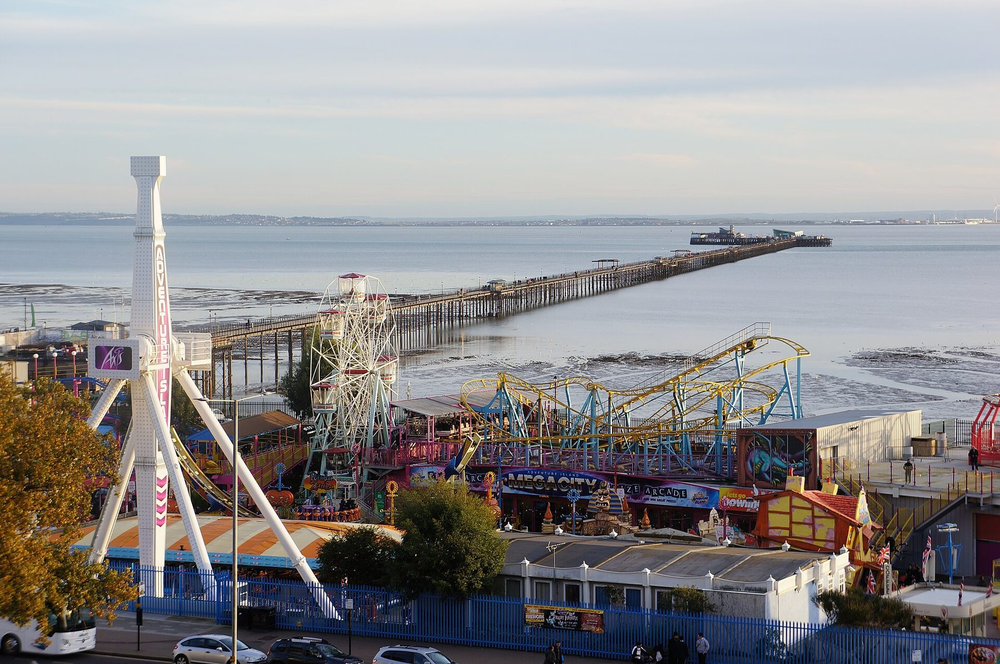
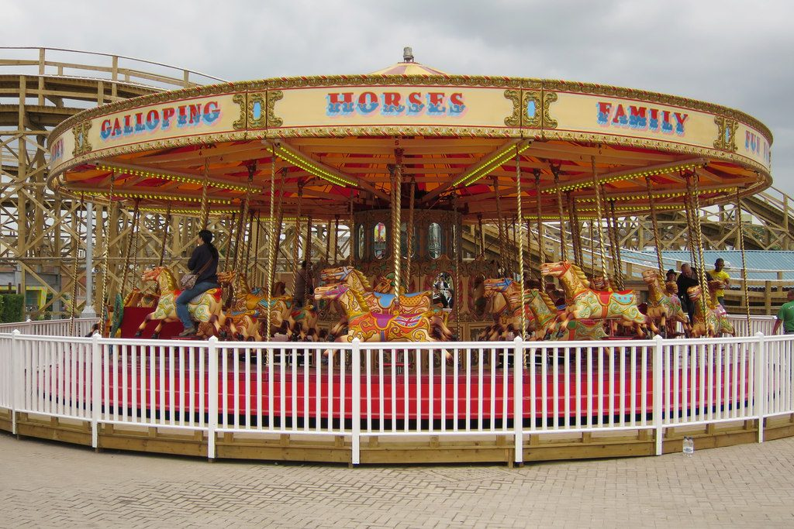

**Thorpe Park, Chessington and LEGOLAND Windsor all sell day tickets from £32 online and £68 on the day, and the train to each takes under an hour from a London terminus.** The choice between them is about the age of your children, not the price.

This page compares every park that works as a day trip from London: the train, the cheapest legitimate ticket, who it suits, and the dates in autumn and winter 2026 when it is shut.

> 💡 **The Short Version:** **Teenagers: [Thorpe Park](/articles/thorpe-park-day-trip/)**, where most coasters need 1.4m. **Ages 3 to 12: [Chessington](/articles/chessington-world-of-adventures-day-trip/)**, which has a zoo and is on Oyster in Zone 6, or **[LEGOLAND Windsor](/articles/legoland-windsor-day-trip/)**. **Toddlers and Peppa Pig fans: [Paultons Park](/articles/paultons-park-day-trip/)**, the longest trip of the four. **Book online**: at the Merlin parks the gate costs about twice as much. **Travelling by train as a group**, the Days Out Guide takes **a third off** at the three Merlin parks. **The thing that ruins the day is the calendar**: Thorpe Park shuts for the winter after 1 November 2026, and the parks close on some weekdays in October. **Or book through GetYourGuide**: it sells the official <a href="https://www.getyourguide.com/activity/-t111550?partner_id=WWP7I0R&amp;cmp=theme-parks-near-london" target="_blank" rel="sponsored nofollow noopener" data-affiliate="gyg">Thorpe Park</a> and <a href="https://www.getyourguide.com/activity/-t112474?partner_id=WWP7I0R&amp;cmp=theme-parks-near-london" target="_blank" rel="sponsored nofollow noopener" data-affiliate="gyg">Chessington</a> day tickets with **free cancellation up to 24 hours before**, and a <a href="https://www.getyourguide.com/activity/-t645578?partner_id=WWP7I0R&amp;cmp=theme-parks-near-london" target="_blank" rel="sponsored nofollow noopener" data-affiliate="gyg">LEGOLAND ticket with a coach from Victoria</a>.

## The parks, compared

| Park | Train from London | Journey | Ticket | Season, autumn and winter 2026 |
| --- | --- | --- | --- | --- |
| **[Thorpe Park](/articles/thorpe-park-day-trip/)** | Waterloo to Staines, then the 950 bus | **34–38 min**, then 15 min | **From £32 online**, £68 on the day | Fright Nights to 1 November, then **closed for the winter** |
| **[Chessington](/articles/chessington-world-of-adventures-day-trip/)** | Waterloo to Chessington South, Zone 6 | **36 min**, then a 10-min walk | **From £32 online**, £68 at the gate | Howl'o'ween to 1 November; Christmas dates 21 November to 3 January |
| **[LEGOLAND Windsor](/articles/legoland-windsor-day-trip/)** | Paddington or Waterloo to Windsor, then the 702 or 703 bus | **28–53 min** to Windsor, then 15 min | **From £32 online**, £68 on the day | Brick or Treat to 1 November; Christmas dates 28 November to 2 January; reopens 11 February 2027 |
| **[Paultons Park](/articles/paultons-park-day-trip/)** | Waterloo to Southampton Central, then the X7 bus or a taxi | **75–77 min**, then 23–26 min by bus | £46.75 online for October 2026 dates, £61.50 on the day | Halloween to 2 November; November weekends; Christmas 5 December to 3 January |
| Gulliver's Land | Euston to Milton Keynes Central, then a bus or taxi | **32–41 min** | About £26 online, £29 on the day | Weekends in October and daily from 24 October; Christmas 22 November to 23 December |
| Adventure Island | Fenchurch Street to Southend Central | **59 min**, then a short walk | **Free entry**; day wristband £30 | Weekends and half term in October; Christmas event on selected days from 28 November |
| Dreamland Margate | St Pancras to Margate | **89 min**, then a short walk | **Free entry**; Mega Wristband £24.99 | Weekends in October and daily 24 October to 1 November, then closed for the winter |
| Diggerland Kent | St Pancras to Strood, then the 151 or 170 bus | **33 min** to Strood | £39.50 on the day, less online | Weekends in October and daily 24 October to 1 November, then closed for the winter |

**The child prices are where the parks differ.** Thorpe Park lets anyone **under 1.2m** in free and charges everyone else the same. Chessington and LEGOLAND let **under-90cm** children in free; Paultons, **under-1m**.

### Which park for which family

- **Teenagers and adults:** Thorpe Park. Hyperia, Stealth, The Swarm, Colossus and the rest need 1.3m to 1.4m, and Fright Nights adds scare mazes for 13 and over.
- **Ages 3 to 12, with a day of rides and animals:** Chessington. Only one ride needs 1.4m, the zoo and SEA LIFE are in the ticket, and Oyster gets you there.
- **Ages 2 to 12, LEGO fans:** LEGOLAND Windsor. It needs a whole day; [Windsor itself](/articles/windsor-day-trip/) is a second one.
- **Under-5s:** Paultons Park for Peppa Pig World, or Chessington's World of PAW Patrol, where all four rides take children from 0.9m.
- **A mixed-age family:** Chessington. Thorpe Park leaves under-1.2m children with a handful of rides.

## Booking through GetYourGuide

GetYourGuide sells the parks' own tickets, so the price matches the from-price direct. What changes is the small print. The <a href="https://www.getyourguide.com/activity/-t111550?partner_id=WWP7I0R&amp;cmp=theme-parks-near-london" target="_blank" rel="sponsored nofollow noopener" data-affiliate="gyg">Thorpe Park</a>, <a href="https://www.getyourguide.com/activity/-t112474?partner_id=WWP7I0R&amp;cmp=theme-parks-near-london" target="_blank" rel="sponsored nofollow noopener" data-affiliate="gyg">Chessington</a> and <a href="https://www.getyourguide.com/activity/-t111115?partner_id=WWP7I0R&amp;cmp=theme-parks-near-london" target="_blank" rel="sponsored nofollow noopener" data-affiliate="gyg">LEGOLAND</a> day tickets can be **cancelled free up to 24 hours before**; booked direct, they are non-refundable. For a date chosen weeks ahead, that is worth having.

The only package with transport is the <a href="https://www.getyourguide.com/activity/-t645578?partner_id=WWP7I0R&amp;cmp=theme-parks-near-london" target="_blank" rel="sponsored nofollow noopener" data-affiliate="gyg">LEGOLAND Windsor ticket with a return coach from Victoria Coach Station</a>, £85, which saves the change at Slough and the bus from Windsor. Against a £32 ticket and the train, that is a premium of roughly £47 a seat; our [LEGOLAND guide](/articles/legoland-windsor-day-trip/) compares the two.

Powered by <a target="_blank" rel="sponsored" href="https://www.getyourguide.com/london-l57/">GetYourGuide</a>

## The cheapest way into the Merlin parks

Thorpe Park, Chessington and LEGOLAND Windsor all belong to Merlin Entertainments, and two discounts cover all three.

**The Days Out Guide offer** takes **a third off the online advance price, for up to six people**, at all three parks, from 1 June 2026 to 31 May 2027. The rules:

- You need a **National Rail ticket** to the park's station. **Oyster and contactless do not count**, even though contactless works on all three routes.
- **Book through the [Days Out Guide](https://www.daysoutguide.co.uk/)** by 23:00 the night before, with the code you get when you book the train.
- **Main season only.** It does not cover Thorpe Park's Fright Nights scare mazes, Chessington's Zoo Days or its winter event, short breaks or Fastrack.
- **On the busiest days Merlin guarantees as few as six discounted tickets** per park, so book early for a weekend.

It pays for a group: on a £32 day, a third off for four people is about £43. Full rules in our guide to [National Rail 2FOR1](/articles/national-rail-2for1-london-attractions/).

**The Merlin Annual Pass** starts with the **Essential Pass at £139**, which covers all three parks, the London Eye, SEA LIFE and Alton Towers, but is barred on 25 busy days, including 17, 24, 25 and 31 October 2026. **Gold, £239**, is barred only from Alton Towers on 6–8 November 2026 and adds free parking. If you will only go to one park twice, the single-park passes are cheaper: **Thorpe Park and Chessington each sell one from £64**.

## Thorpe Park

*Chertsey, Surrey · Waterloo to Staines, then the 950 bus · from £32 online, under-1.2m free · season ends 1 November 2026*

The thrill park. **Hyperia**, which Thorpe Park bills as the UK's tallest and fastest coaster, needs 1.3m; Stealth, The Swarm, Colossus, Nemesis Inferno and SAW need 1.4m. Children under 1.2m go free, but they have only a handful of rides. **Contactless works to Staines, Oyster does not**, and the 950 bus takes cash or contactless. **Fright Nights** runs on set dates to 1 November 2026, from £39.

→ **[The full Thorpe Park guide](/articles/thorpe-park-day-trip/)**

## Chessington World of Adventures

*Chessington, Greater London · Waterloo to Chessington South, Zone 6 · from £32 online, under-90cm free · Christmas dates to 3 January 2027*

A theme park, a zoo and a SEA LIFE aquarium on one ticket, for children of about 3 to 12. Only Rattlesnake needs 1.4m; **World of PAW Patrol**, opened in 2026, takes children from 0.9m. It is the one big park on Oyster. **It is closed on Tuesdays and Wednesdays in early October 2026** and on most days in November, and the car park is inside the ULEZ. **Minecraft World** opens in 2027.

→ **[The full Chessington guide](/articles/chessington-world-of-adventures-day-trip/)**

## LEGOLAND Windsor

*Windsor, Berkshire · Paddington via Slough or Waterloo direct to Windsor, then the 702 or 703 bus · from £32 online, under-90cm free · Christmas dates to 2 January 2027*

Built for children of about 2 to 12. Trains from Paddington take 28 to 38 minutes with a change at Slough, or 53 minutes direct from Waterloo, then the 702 or 703 bus from Windsor Parish Church takes about 15 minutes for £3; the 702 also runs from Victoria to the gate in about two hours. **The park is open on most days to 1 November 2026**, then on selected dates in November and for Christmas, and is **closed from 3 January to 10 February 2027**. Tickets bought on the day cost £68.

→ **[The full LEGOLAND Windsor guide](/articles/legoland-windsor-day-trip/)**

## Paultons Park

*Ower, Hampshire, on the edge of the New Forest · Waterloo to Southampton Central, then the X7 bus or a taxi · £46.75 online for October 2026 dates, under-1m free · free parking*

Home of **Peppa Pig World**, which is aimed at ages 1 to 6, in a park built for families with children under 14; the Valgard coasters, opened in May 2026, give older children something bigger. It is also the hardest to reach: there is no station, so it is the train to Southampton Central, then the **X7 bus**, £3 and 23 to 26 minutes, or a taxi, which Radio Taxis will do for a fixed **£20** if booked ahead. **The X7 does not run on Sundays.** It is not a Merlin park, so the Merlin passes and Merlin's Days Out offer do not apply. **Dates can sell out**, so book before you buy the train ticket, and note that the park is **closed from 4 January to 5 February 2027**.

→ **[The full Paultons Park guide](/articles/paultons-park-day-trip/)**

## The smaller parks

These four work as a day out from London without needing a page of their own. Each runs its own season, and three of them close for the winter at the start of November 2026.

### Gulliver's Land, Milton Keynes

*Livingstone Drive, Milton Keynes MK15 0DT · Euston to Milton Keynes Central, 32–41 min, then a bus or taxi · about £26 online, £29 on the day · free parking*

A park aimed at **children aged 2 to 13**. Day tickets are about £26 online and **£29 on the day**, and under-90cm children go free. From the station, the **No. 8 bus** to Woolstone Roundabout or the **No. 3** to Pagoda Roundabout leaves a short walk. **In October 2026 it opens at weekends and every day from 24 October**, with **Fright Fiesta** from 10 October to 1 November, fireworks on Saturday 7 November, and **Christmas at Gulliver's** from 22 November to 23 December. Check the [opening calendar](https://www.gulliverslandresort.co.uk/plan-your-visit/opening-times-prices/) before you travel.

### Adventure Island, Southend

*Southend seafront, beside the pier · Fenchurch Street to Southend Central, 59 min · free entry, day wristband £30*

*Adventure Island and Southend Pier. Photo: [Leon Wallis](https://commons.wikimedia.org/wiki/File:Southend_pier_and_adventure_island.jpg), [CC BY-SA 4.0](https://creativecommons.org/licenses/by-sa/4.0/).*

A seafront park beside Southend Pier, and the cheapest day out here. **Entry is free**; rides are **£4 a ticket** or **£30 for a day wristband**, cheaper booked online, and a day wristband comes with a free annual pass, activated on the day (for bookings activated by 31 December 2026). **Under its Go On Together rule, anyone 14 or over riding with a child under 1.2m rides free.** c2c trains from Fenchurch Street take 59 minutes and **contactless works, £10.80 off-peak each way**; Greater Anglia runs from Liverpool Street to Southend Victoria. Both stations are a walk down the High Street from the seafront. In October 2026 it opens at weekends and every day of half term, and its **Christmas Wonderland**, with Father Christmas, runs on 28–29 November, 5–6, 12–13 and 19–24 December 2026, at £40 for a child with one adult.

### Dreamland, Margate

*Marine Terrace, Margate CT9 1XJ · St Pancras to Margate, 89 min · free entry, Mega Wristband £24.99*

*The Gallopers, Dreamland. Photo: [Oast House Archive](https://commons.wikimedia.org/wiki/File:Gallopers,_Dreamland_Margate_-_geograph.org.uk_-_4531318.jpg), [CC BY-SA 2.0](https://creativecommons.org/licenses/by-sa/2.0/).*

A seaside amusement park of vintage rides, a roller disco and street food, a short walk from Margate station. **Entry is free**; rides are **£3 a token**, or unlimited on a **£24.99 Mega Wristband** (£12.99 for the Tiny Tots band, for children 0.8m to 1.2m), and **wristbands are half price on its October 2026 open days**. It opens at weekends in October and every day from 24 October to 1 November 2026, rides 11:00 to 16:00, **then the amusement park closes for the winter**. The **Scenic Railway**, the Grade II* listed wooden coaster behind the carousel, no longer runs as a ride. Margate also makes a day trip without the rides; it is on the list in our [day trips guide](/articles/day-trips-from-london/).

### Diggerland Kent

*Medway Valley Leisure Park, Strood · St Pancras to Strood, 33 min, then the 151 or 170 bus · £39.50 on the day · free parking*

A park where visitors of any age ride, drive and operate real diggers. **£39.50 on the day** for everyone over 90cm, cheaper online, though **online tickets must be booked by midnight the day before** and carry a £5 booking fee; under-90cm children go free. High-speed trains from St Pancras reach Strood in 33 minutes, and the 151 and 170 buses pass the park; Rochester and Chatham stations are on the same routes. **It opens at weekends in October and every day from 24 October to 1 November 2026, then closes for the winter from 2 November.**

### Further afield

**Alton Towers**, Merlin's park in Staffordshire, is covered by the Days Out Guide offer and the Merlin passes above; from London it is a trip to plan with a night away. In London itself, **Babylon Park** in Camden is an indoor park with a rollercoaster; it is in our guide to [London in the rain](/articles/london-in-the-rain/).

## Halloween and Christmas, 2026

| Park | Halloween | Christmas |
| --- | --- | --- |
| **Thorpe Park** | **Fright Nights**: 2–4 and 9–11 October, then 15 October to 1 November, from £39 | None; closed from 2 November |
| **Chessington** | **Howl'o'ween**: 3–4 and 10–11 October, then 17 October to 1 November, from £34 | **Christmas at Chessington**: selected dates 21 November to 24 December, from £32 with the Christmas Village |
| **LEGOLAND Windsor** | **Brick or Treat**: 10–11 October, then 17 October to 1 November, from £37 | **LEGOLAND at Christmas**: selected dates 28 November to 2 January, from £34 |
| **Paultons Park** | **Halloween Spooktacular**: 9 October to 2 November, in the normal ticket | **A Celebration of Christmas**: selected dates 5 December to 3 January, from £41 |
| Gulliver's Land | **Fright Fiesta**: 10 October to 1 November, from £19 | **Christmas at Gulliver's**: 22 November to 23 December |
| Adventure Island | Open weekends and half term | **Christmas Wonderland**: weekends from 28 November, then 19–24 December |

Fright Nights is for teenagers and adults, with scare mazes for 13 and over; the others are pitched at families. Our [Halloween in London](/articles/halloween-london/) guide covers them alongside the city's scare attractions, and [Christmas in London](/articles/christmas-in-london/) has the rest of the season.

## What people get wrong

- **Buying on the day.** The three Merlin parks charge £68 on the day, against from £32 online, and Paultons £61.50 against £46.75.
- **Tapping in with Oyster to Staines or Windsor.** Contactless works on both routes; Oyster works only to Chessington South.
- **Planning a November trip to Thorpe Park.** It closes after Fright Nights on 1 November 2026.
- **Turning up at Chessington on a Tuesday or Wednesday in early October**, when it is shut.
- **Taking a child between 1.2m and 1.4m to Thorpe Park.** They pay full price and miss most of the big coasters.

## Continue planning your London trip

- 🌀 **[Thorpe Park](/articles/thorpe-park-day-trip/)** — tickets, the train and the 950 bus, height limits and Fright Nights.
- 🦁 **[Chessington World of Adventures](/articles/chessington-world-of-adventures-day-trip/)** — the zoo, the rides and the Zone 6 train.
- 🧱 **[LEGOLAND Windsor](/articles/legoland-windsor-day-trip/)** — tickets, the train and bus from London, and what suits which age.
- 🐷 **[Paultons Park](/articles/paultons-park-day-trip/)** — Peppa Pig World and how to reach it without a car.
- 👨‍👩‍👧 **[London with kids](/articles/london-with-children/)** — free farms, zoos and family days out in the city.
- 🎃 **[Halloween in London](/articles/halloween-london/)** — Fright Nights, Howl'o'ween and the city's own scare attractions.
- 🎟️ **[National Rail 2FOR1](/articles/national-rail-2for1-london-attractions/)** — the Days Out Guide rules, and why contactless does not qualify.
- 🗺️ **[Day trips from London](/articles/day-trips-from-london/)** — castles, cities and coast, with fares, journey times and closing days.
