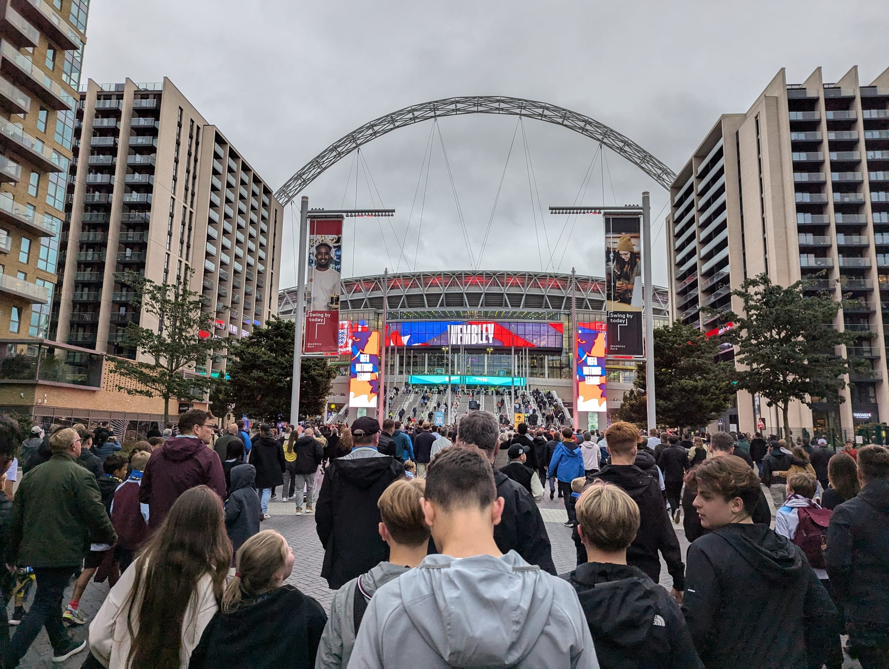

For the first three weeks of October the summer crowds have gone and the autumn exhibitions and festivals open one after another. In the last week the clocks go back, half term starts and the evenings are dark by five.

> 💡 **The Short Version:** **Frieze Week, 14 to 18 October**, puts five art fairs on the same days, and the free **Frieze Sculpture** in Regent's Park runs to 1 November. The **BFI London Film Festival** runs 7 to 18 October, with held-back tickets released at **10am on 1 October**. The **NFL** plays three Sundays in a row from 4 October. The **clocks go back on 25 October**, half term starts the next day, and **Halloween falls on a Saturday**. **Bayeux Tapestry** tickets are sold out to 31 December, but the free opening festival on 9 to 11 October is open to all, without entry to the Tapestry itself.

**Five ticketed art fairs run in the same city on the same days, in the middle of the month.** Frieze London and Frieze Masters take opposite ends of Regent's Park; PAD occupies Berkeley Square; 1-54 fills Somerset House; the Affordable Art Fair sets up in Battersea Park — and all of it lands inside the BFI London Film Festival's closing weekend. In 2026 that means Thursday 15 to Sunday 18 October carries all five fairs plus the festival's last four days at once. The counterweight is Frieze Sculpture — the free outdoor half of Frieze — which sits in the same park from mid-September to the start of November, no ticket required.

**Then the month has a hinge, and everything after it plays by different rules.** The clocks go back at 2am on the last Sunday of October — in 2026 that's the 25th — and an hour of evening disappears overnight: sunset drops from about 5.50pm on the Saturday to about 4.48pm on the Sunday. That same Sunday, MCM Comic Con finishes its run at ExCeL and Diwali on the Square fills Trafalgar Square. School half term starts the next morning, and Halloween falls on the Saturday that ends it. If you can choose your dates, the first ten days of October are the easier trip.

## The story that carries over from September

### The Bayeux Tapestry: your own tickets are gone, but there's a free way in

*British Museum, Room 30 · exhibition runs to 11 July 2027*

[September's guide](/articles/things-to-do-in-london-in-september/) told you the Bayeux Tapestry had arrived in London for the first time in nearly a thousand years. The update: **if you are visiting in October, you cannot buy a ticket for your own trip.** Every ticket for 10 September to 31 December 2026, including the members' priority allocation, is sold out.

What you can do instead is free. The **Bayeux Tapestry Opening Festival** runs across the second weekend of the month: **Bayeux Late: medieval making** on **Friday 9 October, 5.30pm to 8.30pm**, drop in any time, non-ticketed; and the **Big Bayeux Bash** on **Saturday 10 and Sunday 11 October**, a weekend of free family activities inspired by the medieval world, first-come first-served. Contributors to the Friday session include Matilda Ngute of The Textile Club, Olivia Swarthout of Weird Medieval Guys, and master embroidery artist Bella Lane.

**Neither event includes entry to the Tapestry itself** — the museum says so explicitly on both listings. If you want priority entry during the festival's busy periods, book a free timed museum-entry ticket in advance; the main entrance is on Great Russell Street and there is a security and bag check.

For your own visit, the two dates to know are **6 October**, when members' priority booking reopens, and **21 October**, the next general release — both covering visits from **1 January to 31 March 2027**. The exhibition's hours are unchanged: **Sunday to Wednesday 10am to 6pm, Thursday to Saturday 10am to 9pm.**

## The collision in the middle of the month

The fairs share the week on purpose — it is known as Frieze Week — and the film festival's closing weekend lands on top of them.

### Frieze London and Frieze Masters — Regent's Park, 14 to 18 October

Two ticketed fairs at opposite ends of the park: **Frieze London**, contemporary work, off Park Square West, NW1 4LL; **Frieze Masters**, antiquity to the late twentieth century, on Gloucester Green, NW1 4HA, near London Zoo. A free shuttle runs between them roughly every fifteen minutes.

**Wednesday is invitation-only at both fairs.** Thursday morning is a members-and-invitation preview; general admission starts Thursday afternoon. Friday, Saturday and Sunday are open to anyone with a ticket — so the public fair is really three and a half days, not five.

Pricing is tiered steeply by day: **Thursday's first preview runs £130 to £150** (£210–£250 for both fairs), **Friday's preview £63 to £95** depending on entry time, and **weekend day tickets £38 to £59**, or £76–£92 for both fairs. Children aged 2 to 17 pay £6–£10, and a student ticket for both fairs is £32. Tickets are online only, and a weekend ticket is about a third of the Thursday preview price.

### Frieze Sculpture — the free one, and the one to actually plan around

*The Regent's Park, English Gardens · free, no ticket, 16 September to 1 November 2026*

**Frieze Sculpture is a free outdoor exhibition of large-scale work by the same organiser, in the same park, but it is not part of the ticketed fairs** — you can walk straight in. The 2026 edition is curated for a fourth year by Fatoş Üstek, in its fourteenth edition since the series began, with 11 international artists showing in the English Gardens.

It opened **16 September** and runs to **1 November**, either side of the fairs.

### PAD London — Berkeley Square, 13 to 18 October

The UK's only fair dedicated exclusively to historical and contemporary design, in a pavilion in Mayfair, sister fair to PAD Paris. It opens a day ahead of Frieze and closes on the same Sunday.

### 1-54 Contemporary African Art Fair — Somerset House, 15 to 18 October

Contemporary art from Africa and the African diaspora, at the fair that describes itself as the first international one dedicated to it: a Thursday VIP and press preview on **15 October**, then public days **16 to 18 October**, 11am to 7pm (6pm on Sunday). Somerset House is on the Strand, which makes this the easiest of the fairs to combine with something else in central London.

### Affordable Art Fair Battersea (Autumn edition) — Battersea Park, 14 to 18 October

Contemporary work from more than a hundred galleries, priced between **£100 and £10,000**. Wednesday is a private view; general admission runs Thursday to Sunday, with late "Art After Dark" sessions to 9pm on Thursday and Friday and family mornings at the weekend. A free shuttle bus runs from Sloane Square. There is a spring edition in the same park, so specify "autumn" when you search for it.

### BFI London Film Festival — the closing weekend lands in the same fortnight

*7 to 18 October 2026, the 70th edition*

The festival closes on the same Sunday Frieze Week ends. General booking opened at 10am on 17 September, and the Opening and Closing Night Galas are sold out, but a second chance opens at **10am on 1 October**, when the festival releases a batch of held-back tickets. Standard tickets start at £10, or **£6 if you are 16 to 25** through the free BFI 25 & Under scheme. The free **LFF for Free** programme of talks and events at BFI Southbank includes Cate Blanchett presenting short films from the Displacement Film Fund. Full dates, prices and the routes into a sold-out screening are in our [BFI London Film Festival guide](/articles/london-film-festival/).

*BFI Southbank, the festival's centre of gravity: its box office is where returns and the standby queue are handled.*

Powered by <a target="_blank" rel="sponsored" href="https://www.getyourguide.com/london-l57/">GetYourGuide</a>

## The rest of October's annual fixtures

### Black History Month — the whole of October

A UK-wide observance — unlike the United States, which marks it in February. London's programme runs across museums, galleries, libraries and boroughs all month; 2026's national theme is "Honouring Our Communities."

### Bloomsbury Festival — 1 to 31 October, 40-plus venues

The festival's 20th edition runs the whole month: more than 150 events of music, performance, exhibitions, talks, walks and workshops across more than forty venues in [Bloomsbury](/articles/bloomsbury-area-guide/), from its squares and churches to museums, laboratories and university buildings. Many events are free and walk-in; the rest are ticketed on the [festival's site](https://www.bloomsburyfestival.org.uk/).

### New Scientist Live — ExCeL, 10 to 12 October

Talks across four stages plus a show floor, ticketed, with **Saturday 10 and Sunday 11 October open to the public from 10am to 5pm** and **Monday 12 a Schools' Day** from 9.30am to 3pm. Speakers include Helen Sharman, the first British astronaut, Chris Packham, Alice Roberts, Jim Al-Khalili and Tim Spector. Child tickets cover ages 6 to 17, and under-6s go free. The talks are streamed live and can be watched on demand afterwards with an online ticket, so you can skip the DLR out to Custom House. October is the month the whole science calendar wakes up: [science events in London](/articles/science-events-london/) has the Royal Institution's autumn Discourses, the free Royal Society prize lectures and the pumping stations that steam on published dates.

### Dance Umbrella — three weeks from 7 October

London's international dance festival, running **7 to 27 October** across Sadler's Wells East, the Barbican, Somerset House, Rich Mix and The Place. A digital strand of dance films runs on past the live festival, to **30 November**, for anyone who cannot get to a theatre.

### London Literature Festival — late October into November

The Southbank Centre's literature festival runs **20 October to 1 November 2026**, curated this year by **Dua Lipa** with writers picked through her Service95 Book Club. Events include **Malorie Blackman marking 25 years of *Noughts & Crosses*** in the Queen Elizabeth Hall on **28 October**, and a free afternoon of activities in the Clore Ballroom on **24 October**.

### London Restaurant Festival — across the month

The autumn edition of the American Express-backed restaurant festival runs across October, with festival menus at participating restaurants throughout the month rather than in one fixed week, plus separately ticketed one-off dining events. Some series, such as its ten-chef global cuisine dinners, are for Amex Cardmembers only.

### Asian Art in London — opens 29 October

The 29th edition of the dealers' and auction houses' programme of selling exhibitions, auctions and lectures runs **29 October to 10 November**. Its first late-night gallery openings fall on Halloween: **South Kensington and Belgravia on Saturday 31 October**, then St James's on 1 November and Mayfair on 2 November.

## Sport: three NFL Sundays and England at Wembley

**The NFL plays three games in London this month, on consecutive Sundays.**

| Date | Game | Stadium |
| --- | --- | --- |
| Sunday 4 October | Indianapolis Colts v Washington Commanders | Tottenham Hotspur Stadium |
| Sunday 11 October | Philadelphia Eagles v Jacksonville Jaguars | Tottenham Hotspur Stadium |
| Sunday 18 October | Houston Texans v Jacksonville Jaguars | Wembley Stadium |

The Jaguars play London twice, a week apart, at two different stadiums. Match-day transport and parking for the Tottenham Hotspur Stadium games are in our [Tottenham Hotspur Stadium guide](/articles/tottenham-hotspur-stadium-travel-guide/).

**England play Czechia at Wembley on Tuesday 6 October**, a 7.45pm Nations League kick-off two days after the first NFL game.

**The Royal Parks Half Marathon runs on Sunday 11 October**, the same day as the second NFL game: 13.1 miles on closed roads from Hyde Park past Buckingham Palace, along The Mall and Whitehall, to a finish in Kensington Gardens. Entries have closed, but the event village in Hyde Park is open to all, and anyone crossing central London that morning should expect road closures.

*Fans walking up Olympic Way to Wembley Stadium on a Nations League match night.*

Match-day transport, the bag rules and the hotels that treble in price on event nights are in our [Wembley guide](/articles/wembley-stadium-arena-guide/).

Tickets, prices for both venues, the clear bag rule and what a 2.30pm kick-off does to your Sunday are in our [NFL London Games guide](/articles/nfl-london-games/).

## The last eight days: dark, full of children, and Halloween on a Saturday

### The clocks go back — 2am, Sunday 25 October

British Summer Time ends at 2am on the last Sunday of October. Clocks go back an hour, and the effect is not gradual: sunset is about **5.50pm** on the Saturday before, and about **4.48pm** on the Sunday after. By the 31st it is nearer **4.37pm**. Anything you want to see outdoors in the last week of October — a park, a view, a river walk, a rooftop — has to happen before mid-afternoon.

### Diwali on the Square — Trafalgar Square, the same Sunday

The Mayor of London's Diwali celebration: an opening dance sequence with 200 dancers, a main stage of music and dance from London's Hindu, Sikh and Jain communities, sari and turban tying, yoga and dance workshops, and vegetarian and vegan food stalls. **It is not held on Diwali itself**, which moves with the lunar calendar and falls in November in 2026. It runs **1pm to 7pm**, free with no ticket, on the day the clocks go back, so with sunset at about 4.48pm the last two hours are after dark. There is an accessible viewing area on the north terrace.

### MCM Comic Con London — ExCeL, 23 to 25 October

A three-day comics, gaming, anime and pop culture convention, closing on the same Sunday as Diwali and the clock change. General entry is **£29 on Friday or Sunday and £38 on Saturday**, and opens at midday (11am on Saturday); a child ticket is £7, and under-5s go free. Some VIP and bundle tickets have sold out. The crowds travel on the DLR and the Elizabeth line to Custom House, so expect both to be busy if you are doing anything else in Docklands that weekend.

### School half term — Monday 26 to Friday 30 October

Most London boroughs break up for the week beginning the last Monday of October — academies and free schools can set their own dates, so treat this as "most schools" rather than all of them. It is an attraction spike rather than a hotel spike: timed-entry slots at the paid attractions go first, so **book before the week starts** — the free museums are the fallback for anyone who didn't, not the plan.

Family options land squarely in the week. **Absurd City** opens at Westfield London, Shepherd's Bush, on **15 October** — an immersive art experience across 80,000 sq ft, billed by its operator, Wake The Tiger, as Europe's largest, with general admission family-friendly and separate 18+ "After Hours" evenings. **Larger Than Life: Starring Wallace & Gromit, Shaun and More** opens at Lightroom in King's Cross the day before, on **14 October**; both are described below. **Wildlife Photographer of the Year** opens at the Natural History Museum on **16 October**. At Shakespeare's Globe, **MakeBeth** — an interactive retelling of Macbeth in recycled cardboard, for ages 7 and up — runs **24 October to 1 November**, and a **Ghosts & Ghouls** family tour of the theatre runs from 3 October, through half term and Halloween. More ideas for the week are in [London with children](/articles/london-with-children/).

### Halloween — Saturday 31 October

*Full guide: [Halloween in London](/articles/halloween-london/)*

31 October 2026 falls on a **Saturday**, so scare attractions, club nights, ghost walks and one-off parties run on the night itself rather than on the nearest weekend. Our Halloween guide has the scare attractions worth a train fare, the ones that don't need one, and where you can still hire a proper costume this late.

## Exhibitions closing this month

### The first weekend: two free closers

**John Constable: views of nature** at the British Museum closes **4 October**, free, with nothing to book. The Royal Academy's **Charlie Billingham**, a free selling display rather than an exhibition, ends the same day.

### Herbert Smith Freehills Kramer Portrait Award 2026 — National Portrait Gallery, closes 7 October

Free, on Floor 2. The award's exhibition of the year's shortlisted and winning portraits closes the first full week of the month, two days before the gallery's next headline show opens.

### Serpentine Pavilion and its neighbour both close 25 October

The **Serpentine Pavilion 2026**, this year's commission by LANZA atelier — Isabel Abascal and Alessandro Arienzo, titled simply "a serpentine" — closes in Kensington Gardens on **25 October**, free. Steps away, **Jesús Rafael Soto's *Pénétrable BBL Jaune***, a public sculpture from Soto's Pénétrable series, closes the same day, so the two make one walk.

**Richard Dadd** at the Royal Academy also closes **25 October**.

### A National Portrait for the National Portrait Gallery — closes 26 October

A free display in Room 33, on Floor 0: a collective digital portrait of the nation by Es Devlin with Google Arts & Culture Lab, which visitors take part in. It ends the day after half term begins.

Powered by <a target="_blank" rel="sponsored" href="https://www.getyourguide.com/london-l57/">GetYourGuide</a>

## Exhibitions opening this month

### Korea — British Museum, from 1 October

Ticketed, filed under the museum's special exhibitions, running to **31 January 2027**.

### Painting the French Riviera — Royal Academy, from 2 October

A major ticketed exhibition running to **31 January 2027**, with a curator's talk on **9 October** and a related film season, *Screening the French Riviera*, from November. It sits alongside a free selling display, *In Provence and Southern France*, already running at the RA since **29 September**.

### Renoir and Love — National Gallery, from 3 October

Forty paintings, including *Bal du moulin de la Galette* from the Musée d'Orsay, shown in the UK for the first time, and Renoir's *La Grenouillère*, which hung beside Monet's version of the same scene in the gallery's free display until September. Tickets are **£20 Sunday to Thursday and £25 on Fridays, Saturdays and every day of the first two weeks**; under-18s go free. Runs to **31 January 2027**.

### The 90s: Art and Fashion — Tate Britain, from 8 October

Ticketed, free for Tate Members, running to **14 February 2027**. Curated by Edward Enninful, drawing on photography by Juergen Teller, David Sims and Corinne Day, art by Steve McQueen, Damien Hirst, Sarah Lucas and Yinka Shonibare, and collections by Vivienne Westwood, Alexander McQueen and John Galliano. There is a Relaxed Hours slot on the third Wednesday of the month, 10 to 11am.

### Justin Caguiat: Change Ringing — Serpentine South Gallery, from 8 October

Free, running to **10 January 2027**: Caguiat's first UK institutional exhibition, with painting, sculpture, printmaking, sound and film in a site-responsive installation.

### Tim Walker's Fairyland: Love and Legends — National Portrait Gallery, from 9 October

Queer identity, community and love, in new portraits of activists, performers, artists and writers that Walker has spent five years making. Tickets are **£23 Monday to Thursday and £25 Friday to Sunday**, and it runs to **7 February 2027**. The same day, a free display of **Issy Wood's self-portraits** opens in Room 32.

### Light and Magic: The Birth of Art Photography — Tate Modern, from 14 October

The first major exhibition to explore pictorialism as a global movement — more than 200 rare prints by over 80 artists, from Seoul to Sydney, New York to Cape Town, alongside works from Tate's own collection. Ticketed, free for Tate Members, running to **21 February 2027**.

### Yinka Shonibare and Thomas Gainsborough: A Conversation — National Gallery, from 15 October

Shonibare's *Mr and Mrs Andrews without their Heads* (1998) hangs beside the Gainsborough portrait it answers, together for the first time, in Room 1, marking 300 years since Gainsborough's birth. Runs to **7 February 2027**.

### Wildlife Photographer of the Year — Natural History Museum, from 16 October

The year's winning pictures, open in time for half term and running to **11 July 2027**. Adults from **£17** off-peak, children aged 4 to 17 **£10.50**, under-4s free.

Also worth knowing: **Declaring Independence: USA 250** at the British Museum has been running free since the summer and continues right through October.

## Theatre: what's closing, and what's opening

### What's closing

The first weekend of the month clears out three shows at once: **My Son's A Queer (But What Can You Do?)** at the Apollo, **The Children** at the Lyric Hammersmith, and **The Last Ship** at Theatre Royal Drury Lane — a twelve-day run, so the first weekend of October is the whole window if you want it. **Holy Fool**, a play about Shostakovich under Stalin, at the Park Theatre, and **Flamenc-Oh!!** at the Peacock both end **10 October**.

The Globe's open-air season closes in the same week half term begins: **Much Ado About Nothing** plays its last performance on **24 October**, and **As You Like It**, co-directed by Sean Holmes and Charlie Josephine, closes the following day, **25 October**. Standing tickets in the yard are £10. The same week also closes **Darkling** at the Bush, **Table 17** at the Kiln, and **Tartuffe (Remixed)** at the Marylebone Theatre, all on the **24th**.

**From The Heart** at the Garrick opens and closes entirely inside the month, **8 to 18 October**. On **31 October**, four runs end together: **Angel's Bone** at the Coliseum, **The Hungry Ghost** at the Bush, **Stories – The Tap Dance Sensation** at the Peacock, which opened on the 14th, and **Cirque Berserk!** at the Garrick, which had only opened ten days earlier as a half-term booking.

### What's opening

**The Cherry Orchard** opens at the Harold Pinter Theatre on **3 October**, running to 9 January. **High School Musical** opens at Troubadour Wembley Park on **12 October**, running to **3 January**. **Jesus Christ Superstar** takes the Drury Lane stage from **16 October**, two weeks after The Last Ship vacates it, also running into January — as does **The Lives of Others** at the Adelphi from **14 October**.

*Kristin Scott Thomas leads Conor McPherson's new version of Chekhov, directed by Ian Rickson, at the Harold Pinter Theatre from 3 October. Artwork: Sonia Friedman Productions.*

At the London Coliseum, English National Opera stages **Angel's Bone** from **16 October** and **Tosca** from **30 October**. **Cirque Berserk!** takes the Garrick for half term from **21 October**, and **Ceilidh** opens at Shoreditch Town Hall on **22 October**. The cheapest opening of the month is **The Bridge** at the Bush from **28 October**, from £13.

One naming note still worth carrying: the **Duke of York's Theatre is now the Tom Stoppard Theatre**, and you will see both names in circulation for a while yet.

## New this month

### Absurd City — Westfield London, from 15 October

*Shepherd's Bush, W12*

Billed by its operator, Wake The Tiger, as Europe's largest immersive art experience: 80,000 sq ft over two floors, five "districts," and upwards of three hours of exploring, with an immersive bar and kitchen inside. General admission is family-friendly; "After Hours" evenings are 18+.

### Larger Than Life: Starring Wallace & Gromit, Shaun and More — Lightroom, King's Cross, from 14 October

A new Aardman show on Lightroom's walls, booking now to **4 January 2027**. It runs about 50 minutes on a loop, in half-hour entry slots; adults from **£25**, students and under-18s from **£15**. Both this and Absurd City are in our [immersive experiences guide](/articles/immersive-experiences-london/).

### Blue Note London's first full month

The New York jazz club's first UK venue, which opened on St Martin's Lane in September, plays its first complete month in October, two sets a night (7pm and 9.30pm) in a 300-seat main room. **Baaba Maal plays three nights, 4 to 6 October**; only the early set on the 4th has sold out. **Jamie Cullum's two nights, 8 and 9 October, have sold out**, as has **Masego on 21 October**. **Erykah Badu's IMEHO, An Intimate Experience runs 10 to 11 October**, with the late set on the Saturday already gone. **Nubya Garcia plays three nights, 15 to 17 October**, and **Shabaka follows on 19 and 20 October**. The club's full entry is in our [guide to London's live music venues](/articles/best-live-music-venues-london/).

## Gigs worth planning around

Alexandra Palace carries the second half of the month: **Beth Orton on 22 October** in the Alexandra Palace Theatre, **Fat Freddy's Drop on 23 October** in the Great Hall, the **Crouch End Festival Chorus performing Mozart's Requiem at 5pm on 25 October**, **Overmono on 28 October**, and **Skindred on Halloween night, 31 October**.

**Angine de Poitrine play two nights at the Troxy, Monday 19 and Tuesday 20 October, and both have sold out.** The anonymous Quebec duo, Khn de Poitrine on guitar and bass and Klek de Poitrine on drums, perform in oversized papier-mâché masks and polka-dot suits and play microtonal math rock: music built from the notes that fall between the frets of an ordinary guitar. The band began as a gag for a local venue in Saguenay; a live set KEXP released in February passed millions of views and turned it into an international tour. Over-14s, doors 7pm.

## What's on this October

One evening pick a day: music, comedy, theatre, classical and dance, each at a different venue.

## New restaurants and bars

Where a restaurant has not named its opening day, treat the month as a guide rather than a booking.

**Cloth Cornhill** (38½ Cornhill, EC3V 9DR) opens **1 October**, the second site from the Cloth restaurants group, taking over the building that was Simpson's Tavern — the City's oldest chophouse, trading on the site since 1757, closed since 2022 — with some dishes paying homage to it. It opens **Monday to Friday only**, closed at weekends and on bank holidays. The first-floor restaurant, reached by stairs only, takes bookings up to 90 days ahead; the ground-floor pub is walk-in only.

**Dishoom Borough**, inside the Hop Exchange on Southwark Street by Borough Market, has a soft launch from **Monday 12 to Tuesday 20 October with 50% off all food**. The bookings have gone, but walk-ins are welcome. **The Talli Queen** takes over the former Queen Adelaide pub at 412 Uxbridge Road in Shepherd's Bush this October, on a day not yet announced, under ex-Pahli Hill and Bandra Bhai chef Avi Shashidhara, built around what the kitchen calls "traditional drinking establishments of India." **Bamboo Mat**, the Nikkei (Japanese-Peruvian) restaurant in Stratford's East Village, has a second site at 1 North Lane, Canary Wharf, listed as opening soon.

Powered by <a target="_blank" rel="sponsored" href="https://www.getyourguide.com/london-l57/">GetYourGuide</a>

## Looking ahead to November and December

A few things worth knowing about now, even though none of them happen in October.

**Bonfire Night** is Thursday **5 November**, but most of the big displays, Alexandra Palace and Battersea Park among them, are on **Saturday 7 November**, and both are on sale now. Every display, which of them need tickets, the free viewpoints and which famous ones no longer run are in our [Bonfire Night guide](/articles/bonfire-night-london/).

**Hyde Park Winter Wonderland** runs **19 November 2026 to 3 January 2027**, and booking is already open: advance entry is **£1** for off-peak slots and **£8.25** at peak, with everything inside — rides, the ice rink, the circus — charged separately. Full prices, gates and what's new for 2026 are in our [Winter Wonderland guide](/articles/hyde-park-winter-wonderland/).

**The EFG London Jazz Festival** runs **13 to 22 November 2026** across 82 venues, from the Royal Festival Hall to basement clubs in Dalston and Chelsea. Nineteen of its concerts are free and tickets otherwise start at £5, but eleven shows had already sold out by late September, so it is worth booking before you arrive. Dates, prices, the free programme and how to get into a full show are in our [London Jazz Festival guide](/articles/london-jazz-festival/).

**Christmas in London** starts earlier than most people expect: Trafalgar Square's market opens on **6 November** and its Norway spruce is lit on **3 December**. Our [Christmas in London guide](/articles/christmas-in-london/) tracks the other markets and light switch-ons as their dates are announced, and what has quietly stopped running.

**November is the big month for international sport.** England's men play three Nations Championship matches at Allianz Stadium, Twickenham: **Australia on Sunday 8 November** and **Japan on Saturday 14 November**, with tickets from £79 and £51, then **New Zealand on Saturday 21 November**, which has sold out. England's footballers play **Croatia at Wembley on Thursday 12 November**.

## Practical: October in London

**Weather.** Around 16°C by day at the start of the month, falling to 12–13°C by the end, with nights down to 8–10°C — wetter than September, and the first month where a jacket alone is not enough. Assume rain and assume dark rather than packing for an average day. It's also the month the parks turn — our guide to [where to see autumn leaves in London](/articles/best-places-autumn-leaves-london/) has the named trees and the peak weeks.

**Daylight.** The defining fact of the month. Sunset moves from about 6.40pm on the 1st to about 5.50pm on the Saturday before the clocks change — then, overnight, to about 4.48pm the next day, because BST ends at 2am on the last Sunday of October. By the 31st it is about 4.37pm. Plan outdoor time for the first half of the day once you're in the back half of the month.

**Crowds.** Two different months, split by half term. The first three weeks are among the easiest of the year in the big museums — summer has gone and the schools are in. Frieze weekend, 15 to 18 October, is the exception. Then half term refills every museum, aquarium and family attraction at once from the 26th.

**Prices.** Two spikes, for two different reasons. Frieze week is the hotel spike — five ticketed fairs and an international trade audience push rates up for five days. Half term is an attraction spike rather than a hotel one: timed-entry slots go first, and turning up on spec is how a day gets wasted. The value in October is the first ten days, and — if you don't mind the dark — the very end of the month.

**Working out which month suits you best?** [Best Time to Visit London](/articles/best-time-to-visit-london/) compares October's weather, crowds and hotel rates against the rest of the year.
