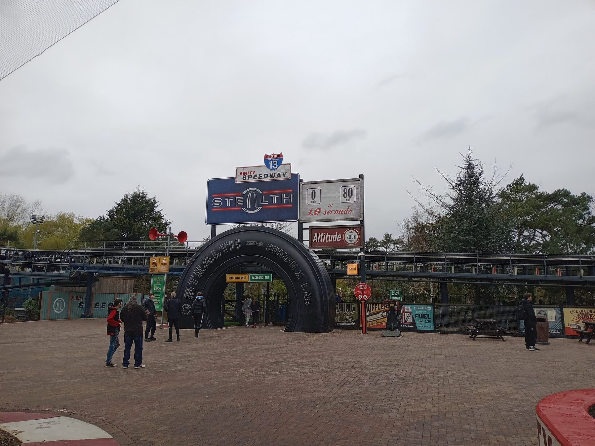
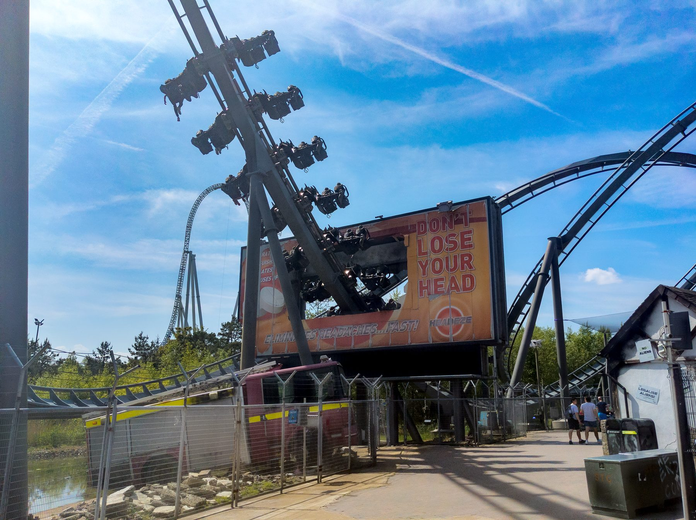
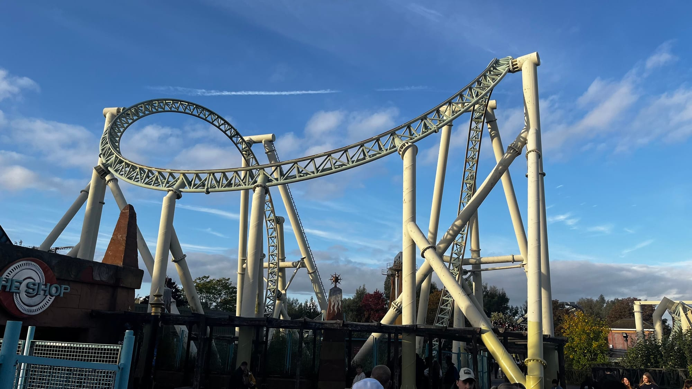

**Thorpe Park tickets are from £32 booked online and £68 at the gate, and anyone under 1.2m gets in free.** There is no child price: everyone 1.2m and over pays the same, which makes it cheap for a family with small children and dear for one with tall ten-year-olds.

It is a thrill park on a set of lakes outside Chertsey in Surrey, about 20 miles from central London, built around six big coasters. The family rides are a corner of it, not the point.

> 💡 **The Short Version:** **Teenagers and adults** get the most from it; most of the big rides need **1.4m**. **Book online**: from **£32**, against **£68** on the day, and **under-1.2m free**. **Waterloo to Staines, 34–38 minutes, £7.40 off-peak on contactless (not Oyster)**, then the **950 bus, cash or contactless only**. Driving, park for **£13**. **The 2026 season ends on Sunday 1 November**, and in early October the park is shut on most weekdays. **Fright Nights** runs to 1 November 2026, from £39. For a group, the **Days Out Guide takes a third off** with a National Rail ticket. **Or book through GetYourGuide**: the <a href="https://www.getyourguide.com/activity/-t111550?partner_id=WWP7I0R&amp;cmp=thorpe-park-day-trip" target="_blank" rel="sponsored nofollow noopener" data-affiliate="gyg">official day ticket</a> costs the same from-price but can be **cancelled up to 24 hours before**, which a ticket bought direct cannot.

## What tickets cost

| Ticket | Online | On the day |
| --- | --- | --- |
| **Day ticket, anyone 1.2m or over** | **From £32** | **£68** |
| Fright Nights day ticket, October 2026 | From £39 | £66 |
| Fright Nights plus four scare mazes | From £71 | £98 |
| **Under 1.2m** | **Free**, booked with a paid ticket | Free |
| Thorpe Park Annual Pass | £64 a year | — |

**The price moves with the date.** £32 is the floor on quiet days; school holidays, weekends and Fright Nights cost more. Thorpe Park's own [price table](https://www.thorpepark.com/price-table/) puts the on-the-day price at £68 against from £32 in advance.

**The under-1.2m ticket has rules.** Book it during your online booking, up to four per booking and only alongside at least one paid ticket. Every child on one has to be at the Island Ticket Centre on the day to be measured, in flat shoes, before a barcode is issued. Anyone who measures 1.2m pays.

**Nobody gets in without a ticket**, and there is no spectator rate: a parent who will not ride pays the same as one who will. **Under-12s must be with someone aged 18 or over.**

**Tickets bought direct are non-refundable.** You can move the date in the booking portal for a revalidation fee, to another date in the same year.

### The cheapest way in

- **Book online, early, for a weekday in term time.** That is where the £32 days are.
- **Travelling as a group by train?** The [Days Out Guide](https://www.daysoutguide.co.uk/thorpe-park) offer takes **a third off the online advance price for up to six people** on one National Rail ticket, from £23 a head. Contactless and Oyster do not count, so buy a rail ticket to Staines instead, and book by 23:00 the night before. It does not cover the Fright Nights scare mazes. Full rules in our guide to [National Rail 2FOR1](/articles/national-rail-2for1-london-attractions/).
- **Going twice?** The **Thorpe Park Annual Pass is £64**, which is two £32 days. A **Merlin Essential Pass, £139**, adds [Chessington](/articles/chessington-world-of-adventures-day-trip/), [LEGOLAND Windsor](/articles/legoland-windsor-day-trip/), the London Eye and more, but is barred on 25 busy days, including 17, 24, 25 and 31 October 2026; the £239 Gold Pass adds free parking.

## Booking through GetYourGuide

GetYourGuide sells Thorpe Park's own <a href="https://www.getyourguide.com/activity/-t111550?partner_id=WWP7I0R&amp;cmp=thorpe-park-day-trip" target="_blank" rel="sponsored nofollow noopener" data-affiliate="gyg">day ticket</a>, issued by the park, from the same £32. **What it buys you is the cancellation**: free up to 24 hours before, against no refund at all on a direct booking. On a date picked weeks ahead in a British spring, that is worth having. Children under 1.2m still go free and collect their ticket on arrival.

There is no coach or transfer package from London. The train and the 950 bus are the only public route.

Powered by <a target="_blank" rel="sponsored" href="https://www.getyourguide.com/london-l57/">GetYourGuide</a>

## Getting there

| | Train and the 950 bus | Driving |
| --- | --- | --- |
| **From** | London Waterloo | Central London, about 20 miles |
| **Journey** | **34–38 min** to Staines, then about 15 min on the bus | M25 junction 11 or 13, then the A320 |
| **Cost** | **£7.40 off-peak**, £10.90 peak, each way on contactless; bus fare extra | Parking **£13** online, Priority **£20** |
| Pay with | Contactless or a rail ticket, **not Oyster** | — |

### Train and the 950 bus

**Trains from Waterloo to Staines run about every 15 minutes** on South Western Railway and take 34 to 38 minutes. **Contactless works to Staines; Oyster, Travelcards and Freedom Passes do not.** Peak fares apply Monday to Friday, 06:30–09:30 and 16:00–19:00.

**The 950 Thorpe Park Express** leaves from outside the ticket office at Staines station, stops at Staines bus station (Elmsleigh Shopping Centre, five minutes' walk from the trains) and runs non-stop to the park in about 15 minutes. Buses run from about 08:00, every 15 minutes through the morning, and only on days the park is open. Buses back keep going until about an hour after closing. **Pay cash or contactless on the bus**: Oyster, Travelcards and bus passes are not accepted.

**The back-up route** is a train from Waterloo to Chertsey, twice an hour (hourly on Sundays), then the 446 bus from Heriot Road. The 446 also runs from Heathrow Terminal 4 and from Hatton Cross on the Piccadilly line.

### Driving

The postcode is **KT16 8PN**, but some sat navs send you to Norlands Lane. Look for the rollercoaster track over the main entrance on **Staines Road**. Come off the M25 at **junction 11 or 13**; the road layout means you cannot reach the park from junction 12.

**Parking is £13 booked online and £20 for Priority**, which is closer to the entrance with a faster exit. Drop-off is free for 30 minutes. You can go back to the car during the day: get a hand stamp at the turnstiles.

## When it is open

*Stealth. Photo: [HotMess](https://commons.wikimedia.org/wiki/File:Thorpe_Park_Stealth_2024-03-25.jpg), [CC0](https://creativecommons.org/publicdomain/zero/1.0/).*

**The park opens at 10:00.** Rides usually close between 17:00 and 19:00 depending on the season, and **only the ride queues close at the advertised time**: join your favourite one minute before and you still ride.

**The 2026 season ends on Sunday 1 November**, the last night of Fright Nights, and the park is closed through the winter. The 2026 season opened on 27 March. Check the [opening calendar](https://www.thorpepark.com/plan-your-visit/before-you-visit/opening-times/) before booking a train.

> ⚠️ **Thorpe Park is shut on most weekdays in early October.** In 2026 it is closed Monday 5 to Thursday 8 October and Monday 12 to Wednesday 14 October, then open every day from 15 October to 1 November.

### Fright Nights 2026

**2–4 and 9–11 October, then every day from 15 October to 1 November 2026, 10:00 to 21:00.** Day tickets are from £39 online (£66 at the gate) and include the scare zones and shows. The **Fearsome Four** package, from £71, adds four scare mazes: DeadBeat, Stitches, Trailers and Survival Games. The new maze, **Tenement**, is not in it and needs its own ticket. The mazes are for 13 and over. Saturday 31 October is the date to book first. Our [Halloween in London](/articles/halloween-london/) guide sets it against the other scare attractions.

There is no Christmas event: the park is closed from 2 November 2026.

## The rides, and the height you need

*The Swarm. Photo: [Suntooooth](https://commons.wikimedia.org/wiki/File:The_Swarm_2024-05-08_02.png), [CC BY-SA 4.0](https://creativecommons.org/licenses/by-sa/4.0/).*

**The six big coasters** are the reason to go. Thorpe Park bills **Hyperia**, opened in 2024, as the UK's tallest and fastest coaster: 236ft high, 81mph, with 14.8 seconds of airtime. **Stealth** launches from 0 to 80mph in 1.8 seconds up a 205ft hill. **The Swarm** seats you on the wings of the train, out in the open either side of the track. **Colossus** turns riders upside down ten times, **Nemesis Inferno** hangs them below the track, and **SAW – The Ride** drops 100ft at 100 degrees, past vertical.

| Ride | Minimum height | What it is |
| --- | --- | --- |
| **Hyperia** | **1.3m** | The tallest coaster in the park, 236ft and 81mph |
| **Stealth** | **1.4m** (max 1.96m) | Launch coaster, 0–80mph in 1.8 seconds |
| **The Swarm** | **1.4m** (max 1.96m) | Winged coaster, seats either side of the track |
| **Colossus** | **1.4m** (max 1.96m) | Ten inversions |
| Nemesis Inferno | 1.4m | Inverted coaster, feet dangling |
| SAW – The Ride | 1.4m, and 13 or over | Horror-themed coaster with a 100-degree drop |
| The Walking Dead: The Ride | 1.4m, and 13 or over | Indoor coaster |
| Samurai | 1.4m | Spins riders 360 degrees, 60ft up |
| Vortex | 1.4m | Swinging, spinning arm, up to 65ft |
| Rush | 1.3m | Giant swing, 75ft |
| Detonator | 1.3m | 100ft drop tower |
| Ghost Train | 1.3m, and 13 or over | Walk-and-ride horror attraction with live actors |
| Tidal Wave | 1.2m | Water ride with an 85ft drop; you get soaked |
| Quantum | 1.2m | Magic carpet ride |
| Storm Surge | 1.1m; under 1.2m with someone 16+ | Spinning raft down a 64ft water slide |
| Zodiac | 1.1m; under 1.4m with someone 16+ | Spinning ride that turns riders upside down |
| Big Easy Bumpers | 1.1m; under 1.3m with someone 16+ | Dodgems |
| Dobble Tea Party | 1.1m | Teacups |
| Depth Charge | 0.9m; under 1.2m with someone 16+ | Four-lane racing slide |
| Mr Monkey's Banana Ride | 0.9m; under 1.2m with someone 16+ | Swinging ship |
| Flying Fish | 0.9m; under 1.1m with someone 16+ | First rollercoaster for small children |
| High Striker | 0.9m; under 1.1m with someone 16+ | Small drop tower |

The heights come from Thorpe Park's [ride restrictions guide](https://www.thorpepark.com/plan-your-visit/before-you-visit/accessibility-information/rider-requirements/), which also lists chest, thigh and torso limits for the coasters. Stealth, The Swarm and Colossus have a **maximum height of 1.96m**.

*Colossus, with its ten inversions. Photo: [Bryn Holmes](https://commons.wikimedia.org/wiki/File:Colossus_cobra_rolls,_Thorpe_Park_-_geograph.org.uk_-_7398896.jpg), [CC BY-SA 2.0](https://creativecommons.org/licenses/by-sa/2.0/).*

### What suits which age

- **Under 1.2m (free):** Flying Fish, Depth Charge, Mr Monkey's Banana Ride, High Striker, the Amity Beach pool and The Playground. A handful of rides, so it works for a younger sibling tagging along, not as the day's main event.
- **1.2m to 1.3m:** add Tidal Wave, Quantum, Storm Surge, Zodiac, the dodgems and the teacups.
- **1.3m:** Hyperia, Rush and Detonator open up. Hyperia is the one exception to the 1.4m rule on the big coasters.
- **1.4m:** everything, apart from the three attractions that also require riders to be 13 or over.

## Queues and Fastrack

**Weekdays in term time are the quietest days**; school holidays, weekends and Fright Nights are the busiest. **Arrive before 10:00**: the security search takes time.

**The order that works:** go to the back of the park first, because most people start at the front, and do SAW, Nemesis Inferno and Colossus before midday. **Hyperia** sits in the back left corner beside Samurai. Eat before 12:30 or after 14:00, and use the Thorpe Park app for live queue times.

| Fastrack, October 2026 prices | From | What it covers |
| --- | --- | --- |
| Bronze | £9 | Three skips on a choice of nine rides, none of them the six big coasters |
| **Silver** | **£35** | **One skip each on Colossus, Nemesis Inferno, Stealth, SAW and The Swarm** |
| Gold | £115 | All day on 14 rides, not Hyperia |
| **Platinum** | **£135** | **All day on 15 rides including Hyperia** |
| One Shot | £6 | One skip on one ride, bought in the app or by QR code at the ride |

Every Fastrack is for one person, can be scanned once every three minutes, sells out, and does not include park entry. Book entry first.

**Accessibility:** the **Ride Access Pass has to be pre-booked online** before your visit; on the day you show the reservation and ID at the Accessibility Kiosk. **Parent Swap**, collected from Guest Services in the Lower Dome, lets one adult queue while the other waits with a child too small to ride; the second adult then goes through the Fastrack entrance.

## Food, lockers and bags

**You can bring a picnic**, as long as it is sealed: anything opened has to be finished before the security check, and **alcohol is confiscated**. Water bottles can be refilled at points by Tidal Wave, Rush, Swarm Island and opposite Detonator. On site there is a KFC and a Burger King among the food stalls.

**Lockers are £5 for a large one and £10 for a jumbo**, outside the Megastore and in the Lower Dome. You will need one: loose items are not allowed on the rides.

**Leave the big bag at home.** Everyone goes through a screening tent. Large suitcases are refused unless you are staying at the Shark Cabins, and skateboards, scooters, glass bottles and drones are banned.

## Staying over

**[Thorpe Shark Cabins](https://www.thorpepark.com/short-breaks/accommodation/thorpe-shark-cabins/)** is the park's own hotel: cabins beside the lake, each with a double bed and a bunk bed and an en-suite wet room. It is sold as a short break with **two days' park entry, buffet breakfast, parking and an hour of Fastrack on the second day**, from **£77 a person** for four sharing a standard cabin on selected Monday to Thursday dates in 2026. Themed cabins for Hyperia, The Swarm, Stealth, Colossus and Nemesis Inferno add a Coasters Fastrack on day two, and for 2026 there is a Fright Nights cabin too. Packages with nearby hotels are sold on the same page.

## What people get wrong

- **Buying a child ticket.** There is no child price; anyone under 1.2m is free and anyone over pays in full.
- **Tapping in with Oyster.** It does not work to Staines. Use contactless, and have a card or cash for the 950.
- **Turning up on a weekday in early October**, when the park is shut on most of them, or after 1 November, when it is shut for the winter.
- **Paying for Gold Fastrack to skip Hyperia.** Only Platinum includes it.
- **Bringing a six-year-old who is just under 1.4m** and expecting them to ride the coasters with an older sibling.

## Continue planning your London trip

- 🎢 **[Theme parks near London](/articles/theme-parks-near-london/)** — every park within a day trip, compared on price, journey and season.
- 🦁 **[Chessington World of Adventures](/articles/chessington-world-of-adventures-day-trip/)** — the family park in Zone 6, with a zoo in the ticket.
- 🧱 **[LEGOLAND Windsor](/articles/legoland-windsor-day-trip/)** — for children under about 12.
- 🐷 **[Paultons Park](/articles/paultons-park-day-trip/)** — Peppa Pig World, on the edge of the New Forest.
- 🎃 **[Halloween in London](/articles/halloween-london/)** — Fright Nights against the city's other scare attractions.
- 🎟️ **[National Rail 2FOR1](/articles/national-rail-2for1-london-attractions/)** — the Days Out Guide rules, and why contactless does not qualify.
- 🗺️ **[Day trips from London](/articles/day-trips-from-london/)** — what the others cost, how long they take, and which days they are shut.
