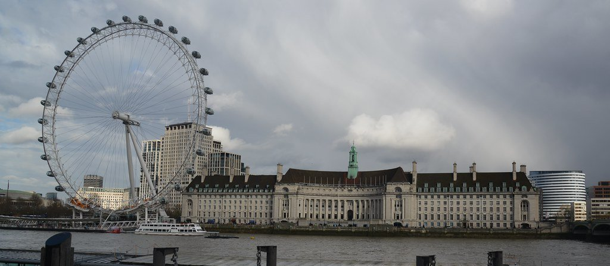
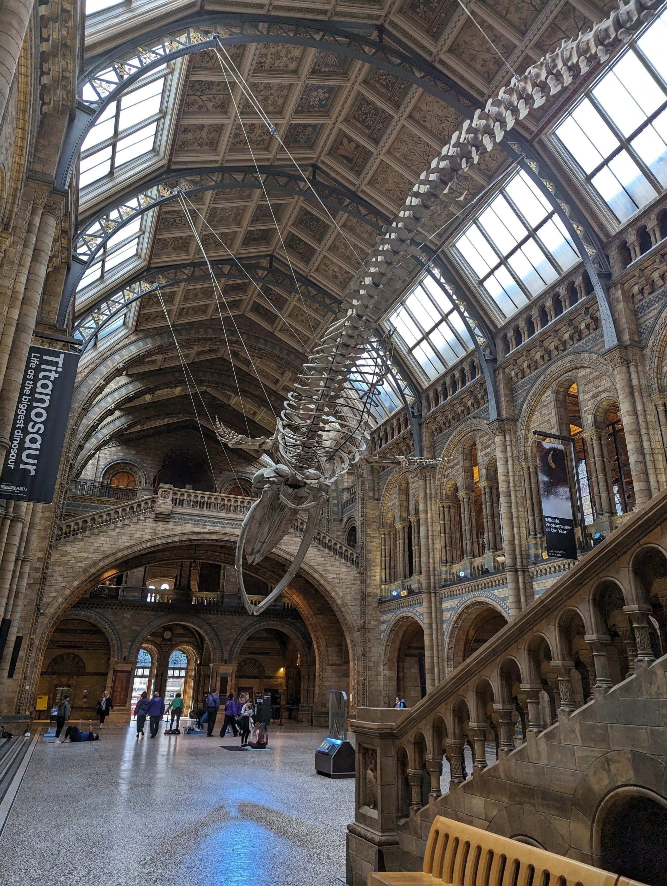

Most three-day London plans list famous things without checking whether they sit near each other, and you end up on the Tube four times a day.

This plan groups by geography. Days 1 and 2 are walkable end to end. Every walking time below is the one [TfL's journey planner](https://tfl.gov.uk/plan-a-journey/) gives, which runs a little slower than most people actually walk, so treat them as the outside figure. Prices and opening hours are the operators' own, read on 21 September 2026.

> 💡 **The Short Version:** **Day 1** is Westminster and the West End on foot — the Abbey (£31, and shut to sightseers on Sundays), the Churchill War Rooms (£34, timed entry), St James's Park, Buckingham Palace and the free National Gallery, ending at a show or in Soho. **Day 2** is the Tower (£37, allow two to three hours) then the South Bank as one continuous river walk to the London Eye. **Day 3** is one free museum district — South Kensington or Bloomsbury, never both. Book the Tower, the Abbey, the War Rooms and any show before you fly.

## Book these before you leave

| Book | How far ahead | What it costs, and why it sells out |
| --- | --- | --- |
| **[Tower of London](/articles/tower-of-london-guide/)** | 2–3 weeks in peak season | £37 adult, £18.50 child (5–15) and young person (16–17), £29.50 concession. Timed entry, and the slots go before the day does |
| **[Westminster Abbey](/articles/westminster-abbey-guide/)** | 1–2 weeks | £31 adult, £28 over-65s and students, £14 children 6–17. Timed entry, and it is closed to sightseers every Sunday |
| **[Churchill War Rooms](/articles/churchill-war-rooms-guide/)** | 1–2 weeks | £34 adult. IWM sells admission as a timed slot and does not guarantee walk-ups |
| **Sky Garden** | Tickets release weekly, up to three weeks ahead | Free, 35 floors up, and they go |
| **A West End show** | 2–4 weeks for anything popular | Cheaper direct from the theatre than through a reseller. See our [theatre guide](/articles/london-theatre-guide/) |

The free museums are the exception. The [National Gallery](https://www.nationalgallery.org.uk/visiting), [Tate Modern](https://www.tate.org.uk/visit/tate-modern), the [British Museum](https://www.britishmuseum.org/visit) and the [V&A](https://www.vam.ac.uk/visit) all take walk-ups; the [Natural History Museum](https://www.nhm.ac.uk/visit.html) and [Science Museum](https://www.sciencemuseum.org.uk/visit) ask for a free booked ticket but admit walk-ups too.

> ⚠️ **Westminster Abbey is closed to sightseers every Sunday.** It opens for worship only, which anyone may attend free of charge. If your Day 1 lands on a Sunday, run Day 3 first and move Westminster to the Monday.

---

## Day 1: Westminster and the West End

*Just over two miles of point-to-point walking on TfL's routes, almost entirely flat, plus whatever you do inside. You can stop at any point and get a bus.*

**[We have the Westminster half stop by stop →](/articles/westminster-walk/)** — eleven numbered stops with a map and a Google Maps walking link. Use that for the daytime; the evening below picks up where it finishes.

### Westminster Abbey, on the first slot

**[Open 9.30am to 3.30pm Monday to Friday and 9.30am to 3.00pm on Saturday](https://www.westminster-abbey.org/visit-us/prices-and-entry-times).** That Saturday close is 30 minutes earlier than people plan for. **Admission is £31 for an adult, £28 for over-65s and students, £14 for children aged 6 to 17, and free under 6** — the Abbey's standard rate; a government VAT reduction cut it to £27.13 between 25 June and 1 September 2026. Every ticket includes a handheld multimedia guide.

**Allow 90 minutes to two hours.** It is denser than it looks, and Poets' Corner, the royal tombs, the Lady Chapel and the Cosmati Pavement are the four things people walk past at speed.

Two upgrades are worth knowing about before you arrive, because neither can be bought later:

- **The verger tour costs your entry price plus £10** and is the only way the public reaches the Shrine of Edward the Confessor. It runs [Monday to Saturday](https://www.westminster-abbey.org/visit-us/guided-tours/), lasts about 90 minutes and is capped at 20 people. **It cannot be booked online or by phone** — you sign up in person on arrival, so book your entry slot 30 minutes before you want the tour to start.
- **The Queen's Diamond Jubilee Galleries are £5 extra for adults and free for under-18s**, on a timed ticket bought together with your entry ticket. They sit in the 13th-century triforium, high above the Abbey floor, and they close at 3pm — earlier than the Abbey itself.

**Choral Evensong is free and needs no ticket at all.** It is sung at [5.00pm on weekdays](https://www.westminster-abbey.org/worship-and-music/services-and-times/) in the Quire — the Abbey's own line is that everyone is welcome, free of charge. You get the building and the choir but not the tombs, which makes it the right answer for anyone who baulks at £31.

> ⚠️ **The National Rail 2FOR1 offer at the Abbey cannot be used with a pre-booked ticket.** Two adults go in for the price of one, with a free child per adult, but only if you buy at the ticket office on the door with a valid rail ticket and an e-voucher. Turning up with an online booking voids it. The rules are in our [2FOR1 guide](/articles/national-rail-2for1-london-attractions/).

### Churchill War Rooms

*Seven minutes' walk, 480 metres, to the Clive Steps entrance on King Charles Street.*

**[Open 9.30am to 6pm with last entry at 5pm](https://www.iwm.org.uk/visits/churchill-war-rooms), every day except 24 to 26 December. £34 for an adult, £17 for a child aged 5 to 15, £30.60 concession, and under-5s free.** IWM adds no donation surcharge.

This is the underground bunker the Cabinet ran the war from, left as it was in 1945, plus the Churchill Museum. **Admission is a timed slot booked online and walk-ups are not guaranteed** — of everything on Day 1, this is the one that turns people away at the door. The handheld audio guide is included in the ticket in thirteen languages, so ignore any reseller charging for an "exclusive audio tour". [Our full guide has the rest](/articles/churchill-war-rooms-guide/).

### Lunch

Not on the bridge approaches, where the prices are set for people who will never come back. Walk into St James's or ride two stops to Covent Garden. Our [cheap eats guide](/articles/cheap-eats-london/) covers both, and [best sandwiches](/articles/best-sandwiches-london/) has the queue-and-go options.

### St James's Park and Buckingham Palace

*Fifteen minutes, one kilometre, from the Clive Steps across the lake.* The bridge over the lake gives you the view of the palace that ends up on postcards, with the London Eye behind you the other way.

**Changing the Guard at Buckingham Palace is at 11am on Monday, Wednesday and Friday**, per the Household Division's own [calendar](https://www.householddivision.org.uk/changing-the-guard-calendar). Two variations most guides miss: **there is a Sunday Parade at 10am**, and on Tuesday, Thursday and Saturday the palace runs a **Captain's Inspection at 3pm** instead — shorter, much less crowded, and with a band on most days.

It only fits alongside the Abbey if you do the Abbey second. The view worth having is from the Victoria Memorial steps.

### The Mall to Trafalgar Square

*Twenty-one minutes, 1.3km,* under the plane trees and through Admiralty Arch.

**The National Gallery is free and open daily 10am to 6pm, and until 9pm on Fridays.** Closed 24 to 26 December and 1 January. **Enter through the Sainsbury Wing** — that is the main free entrance. A free general-admission ticket gets you fast-track; walk-up is fine too.

By this point in the day nobody has the legs for the whole collection. Pick three rooms, take the Friday late if your Day 1 is a Friday, and note that **the cloakroom is £3 an item and will not take wheeled luggage or suitcases of any size**.

### Evening

*Covent Garden is nine minutes from Trafalgar Square, Chinatown ten.* Dinner in [Soho](/articles/soho-area-guide/), [Covent Garden](/articles/covent-garden-area-guide/) or Chinatown — our [dim sum guide](/articles/best-dim-sum-london/) is the one to use for the last of those — then a show if you booked one. Give dinner two hours before curtain-up and tell the restaurant the time.

If you would rather drink than watch, the [cocktail bars guide](/articles/best-cocktail-bars-london/) covers Soho thoroughly.

---

*Where Day 2 finishes. The South Bank walk is flat, continuous and free.*

Powered by <a target="_blank" rel="sponsored" href="https://www.getyourguide.com/london-l57/">GetYourGuide</a>

## Day 2: The Tower and the whole South Bank

*About 4 miles on TfL's walking routes. The longest day, but it is one continuous riverside walk and there is a pier, a Tube station or a bus stop every ten minutes.*

We have the same ground as a [numbered South Bank walk](/articles/south-bank-walk/), which runs the other way — Westminster Bridge to Tower Bridge. Read it backwards, or do Day 2 in reverse and finish at the Tower.

### Tower of London

**£37 for an adult, £18.50 for a child aged 5 to 15 and for a young person aged 16 to 17, £29.50 for seniors, students and disabled visitors, free under 5.** Historic Royal Palaces prices by age band with one optional 10% donation on top, and there is no family ticket. **Anyone on Universal Credit, Pension Credit, ESA, Income Support, Jobseeker's Allowance or Working Tax Credit pays £1 a head for up to four people, booked online in advance.** Tower Hamlets residents pay £1 all year. Those are HRP's own prices, published 19 September 2026; the [full price list is in our Tower guide](/articles/tower-of-london-guide/).

**Allow two and a half to three hours.** It is much bigger than people expect, and the Crown Jewels, the White Tower and the ramparts are three separate visits inside one wall.

> 💡 **Historic Royal Palaces' own advice is that the Tower is quieter after midday.** That contradicts the standard first-slot advice, and it is worth following — but only if you are through the gate with three hours left. Last admission is an hour before closing, and on 19 September 2026 the last **Yeoman Warder tour included in the ticket left at 15:15**. That free tour is the part of the ticket that explains the buildings, so an entry slot of 12:00 to 13:00 is the sweet spot: past the morning crush, still in time for a Beefeater.

Never pay a third party for an "exclusive Beefeater tour". The Yeoman Warder tour is included with every ticket, runs roughly every half hour from near the entrance, and needs no separate booking.

### Tower Bridge

*Six minutes, 470 metres, from the Tower gate.*

**Walking across is free.** The Tower Bridge Exhibition — the high-level walkways with the glass floor, and the Victorian engine rooms — is ticketed and **[open daily 09:30 to 18:00 with last entry at 17:00](https://www.towerbridge.org.uk/plan-your-visit)**. Its ticket office is on the north-west side and everyone queues on arrival, so pre-book if you want it. On the **second Saturday of every month it runs a low-capacity Relaxed Opening from 09:30 to 11:30**, last entry 11:10, built for neurodivergent visitors.

### Borough Market

*Twenty-three minutes, 1.3km, from the south end of Tower Bridge along the river past HMS Belfast.* Longer than it looks on a map, because the Thames Path zigzags around Hay's Galleria and City Hall.

> ⚠️ **Borough Market is closed on Mondays.** The rest of the week it runs [Tuesday to Friday 10am–5pm, Saturday 9am–5pm and Sunday 10am–4pm](https://boroughmarket.org.uk/visit-us/), and Saturday is both the fullest day and the only one that opens at nine. Entry is free. If your Day 2 is a Monday, swap Days 2 and 3 — Tate Modern and the Globe are open and Borough is not.

Go early in the window rather than at one o'clock, when the office lunch trade arrives. Our [markets guide](/articles/best-london-markets/) has what to actually eat there, and [best street food](/articles/best-street-food-london/) covers the stalls worth the queue.

### The river walk west

There is no navigation involved from here. The Thames Path is continuous and signposted, and every stop is minutes from the last.

- **Shakespeare's Globe** — *nine minutes, 680 metres, from Borough Market.* The reconstructed open-air theatre. The **[guided tour is £31 for adults and £14 for under-16s](https://www.shakespearesglobe.com/whats-on/globe-theatre-guided-tour/)** and runs about **1 hour 30 minutes**, of which 50 minutes is the guided part and the rest is the exhibition. Pre-booking is essential, the theatre is roofless so tours go ahead in all weather, and **there is no luggage storage on site**.
- **Tate Modern** — *five minutes, 400 metres.* **Free**, in the old Bankside power station. **Open Sunday to Thursday 10.00–18.00 and Friday to Saturday 10.00–21.00**, so Friday and Saturday evenings are live options when everything else on this walk has shut. The Turbine Hall costs nothing and is worth the detour on its own.
- **St Paul's, over the Millennium Bridge** — *thirteen minutes, 980 metres, from the Tate door to the cathedral steps.* Looking at it is free. **[Sightseeing costs £27 an adult and £10.50 a child, Monday to Saturday only](https://www.stpauls.co.uk/visits/visits/visiting-information)**, from 8.30am with last entry usually 4pm and sightseeing ending half an hour after that. **The Dome Galleries open at 9.30am with last entry at 4.15pm** — [528 steps and no lift at any point](/articles/city-of-london-area-guide/). **There is no sightseeing on Sundays**, when the cathedral is open for services.
- **Onward to the London Eye** — *twenty-four minutes, 1.8km, from Tate Modern*, past Gabriel's Wharf, the National Theatre and the Southbank Centre. Walk-up tickets for the Eye are £39 an adult and £35 a child; booked online in advance they start at £29 and £26. The [London Eye guide](/articles/london-eye-guide/) has the Fast Track arithmetic and the sunset timing.

### The free view instead

The Eye is the paid way to get above London on this day, and two free ones sit within a quarter of an hour of the Tower. **[Sky Garden](https://skygarden.london/visit/getting-here-hours/) is free**, on the 35th floor of 20 Fenchurch Street, **open Monday to Friday 10am–6pm and Saturday, Sunday and bank holidays 11am–9pm**. Free tickets are released weekly and bookable up to three weeks ahead, and they go. *Thirteen minutes, 870 metres, from the Tower.* On a weekday it shuts at six, so take it before the river walk rather than after; at a weekend it runs to nine and you can come back for the dark.

**[Horizon 22](https://horizon22.co.uk/) is also free**, higher, and on Level 58 of 22 Bishopsgate: its own description is London's highest free viewing gallery, reached in 41 seconds by lift. **Open weekdays 10.00–18.00, Saturday 10.00–17.00 and Sunday 10.00–16.00.** Our [views guide](/articles/best-views-london/) compares all of them.

> **If the weather turns, this is the day to move.** Tate Modern, the Globe's exhibition and Borough's covered sections absorb a wet afternoon; the two miles of open riverside do not. See [London in the rain](/articles/london-in-the-rain/).

---

## Day 3: One museum district

**Three days is enough for one museum district and not two.** The temptation is the British Museum in the morning and South Kensington after lunch. The result is two rushed hours in each and half an hour underground between them. Pick one, and stop when you are tired rather than when you have seen everything — nobody sees everything.

Both options below are free. Only temporary exhibitions charge.

### Option A — South Kensington

*The blue whale skeleton in the Hintze Hall. Free, and open until 17:50.*

Three national museums within a few minutes of each other, all free.

| Museum | Hours | Last entry | What it is for |
| --- | --- | --- | --- |
| **Natural History Museum** | Daily 10:00–17:50 | 17:30 | Specimens and the building itself. Book a free ticket; walk-ups admitted. **Closed 9 October 2026** |
| **V&A** | Daily 10.00–17.45, **Friday to 22.00** | — | Design, fashion and objects. The Friday late runs four hours past the other two |
| **Science Museum** | Daily 10.00–18.00 | 17.15 | Engineering you can press. Its own figure for an average visit is **around two hours**. **Closed 11 November 2026** |

**Choose two, not three.** The Science Museum's own note is that galleries begin closing 30 minutes before the museum does, so a 4pm arrival gets you about an hour of it against the two hours it says an average visit takes.

*South Kensington station to the Natural History Museum is thirteen minutes, 870 metres, on TfL's street route* — or use the pedestrian subway from the station, which is shorter and dry. The **Exhibition Road entrances** to the Natural History Museum and the Science Museum are consistently quieter than the grand ones on Cromwell Road. *The V&A to the Science Museum is five minutes, 370 metres.*

Then walk into Hyde Park, or south to [Chelsea](/articles/chelsea-area-guide/). The [South Kensington guide](/articles/south-kensington-area-guide/) has where to eat that is not the museum café.

### Option B — Bloomsbury

- **British Museum** — **free, open daily 10.00–17.00 and Fridays to 20.30, last entry 16.45 (20.15 on Fridays).** A free ticket gets you priority entry at busy times; walk-ups are admitted every day. Completeness is not on offer here. Pick three things — the Sutton Hoo ship burial, the Egyptian mummies, the Islamic world galleries — and leave while you still like it. **The museum closes at 16.00 on 28 and 30 September 2026** for events, and Room 41, which holds Sutton Hoo, is partially closed from 12 to 23 October 2026.
- **Lunch on Lamb's Conduit Street** — *sixteen minutes, 1.1km, north-east.* A pedestrianised Georgian street of independent shops, pubs and a bookshop, and the closest thing to a high street the museum has.
- **British Library** — *twenty-six minutes, 1.5km, from the British Museum, or one stop from Russell Square.* **[The Treasures Gallery is free and needs no booking.](https://events.bl.uk/exhibitions/treasures-of-the-british-library)** Magna Carta and *Beowulf* are in the same room as Shakespeare and Monty Python. **It opens Monday to Thursday 09.30–17.45, Friday 09.30–16.15 and Saturday 09.30–16.45 — and closes entirely on Sundays**, which catches out more people than any other closure on this page. It is kept cool and dark to protect the manuscripts, so take a layer.
- **Coal Drops Yard and King's Cross** — *fifteen minutes, 1.1km, from the British Library.* See our [King's Cross guide](/articles/kings-cross-area-guide/).

> ⚠️ **The British Library's Treasures Gallery is shut on Sundays**, and so are its Reading Rooms. The building itself opens 11.00–17.00 on a Sunday, so you can get in and see nothing you came for.

### Evening

Go back to whichever neighbourhood you liked most rather than somewhere new. Three days is enough to have a favourite.

---

## What three days actually costs

Day 3 is free. Almost all the cost sits on Days 1 and 2.

| | Adult | Child | Note |
| --- | ---: | ---: | --- |
| Tower of London | £37.00 | £18.50 | 5–15 and 16–17 both £18.50; £1 a head on qualifying benefits |
| Westminster Abbey | £31.00 | £14.00 | Children 6–17; under-6s free. Verger tour adds £10 |
| Churchill War Rooms | £34.00 | £17.00 | Children 5–15; under-5s free. Timed entry only |
| St Paul's sightseeing | £27.00 | £10.50 | Monday to Saturday only |
| Tower Bridge Exhibition | Ticketed | Ticketed | Crossing the bridge on foot is free |
| **Every museum on Day 3** | **Free** | **Free** | British Museum, National Gallery, Tate Modern, V&A, Natural History, Science Museum, British Library Treasures |
| Sky Garden and Horizon 22 | **Free** | **Free** | Both need a booked slot; Sky Garden's release weekly |

**Transport is the part this plan is built to minimise.** Tapping in with the same contactless card or device every time triggers the daily cap, which beats a Travelcard for most visitors — the arithmetic is in [transport costs and fares](/articles/london-public-transport-costs-and-fares/) and the [Oyster guide](/articles/oyster-card-guide-london/).

**Before you buy a [London Pass](/articles/london-pass-guide/)**, check it against this list. On a three-day plan with two big paid sights and a free Day 3, it usually loses.

More free options: [free things to do in London](/free/) and [London on a budget](/articles/london-on-a-budget/).

---

## What to leave out, and why

**Greenwich, Camden, Notting Hill and Windsor are all worth doing, and none of them fits.** Each costs about an hour of travel round trip, and three days does not have three spare hours to give away.

If one of them matters more to you than the plan above, swap it for Day 3 rather than squeezing it in. [Greenwich](/articles/greenwich-area-guide/) in particular only works as a full day, reached by river — the boat from Westminster takes 56 to 60 minutes on the weekend timetable, which is the point of it and also why it does not fit in an afternoon.

Add them on a longer trip: see [five days in London](/articles/five-days-in-london-itinerary/), which gives Greenwich a day of its own and splits this plan's Day 2 across two.

---

## Common mistakes

1. **Planning Westminster Abbey on a Sunday.** Closed to sightseers. St Paul's too.
2. **Planning Borough Market on a Monday.** Closed.
3. **Planning the British Library on a Sunday.** The Treasures Gallery is closed even though the building is open.
4. **Arriving at the Tower after 3pm.** Last admission is an hour before closing and the last included Yeoman Warder tour goes mid-afternoon, so you pay £37 for the buildings without the thing that explains them.
5. **Turning up at the Churchill War Rooms without a slot.** IWM does not guarantee walk-up entry.
6. **Waiting until you land to try for Sky Garden.** Free tickets release weekly and go.
7. **Doing all three South Kensington museums.** Two is as much as most people get anything out of.
8. **Eating beside the sights.** Ten minutes' walk in any direction changes the prices and the cooking completely.
9. **Booking dinner too close to curtain-up.** Give it two hours and tell the restaurant the curtain time.
10. **Tapping in with a phone and out with the card it lives on.** That is two maximum fares, not one journey.

---

Powered by <a target="_blank" rel="sponsored" href="https://www.getyourguide.com/london-l57/">GetYourGuide</a>

## Where to stay for this plan

**Zone 1 is not automatically the answer.** You pay a premium for a postcode you walk out of every morning. What matters is a direct line to the middle and a station you are happy walking back to at midnight.

For maximum walking, base yourself in [Covent Garden](/articles/covent-garden-area-guide/), [Soho](/articles/soho-area-guide/) or on the [South Bank](/articles/south-bank-area-guide/) — all three put Days 1 and 2 on your doorstep. For better value with a fast line in, the Jubilee line between London Bridge and Canary Wharf, or the Victoria line north through Highbury and Finsbury Park, both put you fifteen minutes from the centre.

[King's Cross](/articles/kings-cross-area-guide/) and [Bloomsbury](/articles/bloomsbury-area-guide/) are the compromise, and they set up Day 3 Option B on foot. Our [where to stay guide](/articles/best-areas-to-stay-in-london/) compares the lot.

**Check the airport transfer at each end before you book a bargain in Zone 4** — it is usually what makes the cheap room expensive.

---

## Continue planning your London trip

- 🗓️ **[Five Days in London](/articles/five-days-in-london-itinerary/)** — Greenwich by river, and the South Bank at half this pace
- 🧭 **[How to Plan a London Itinerary](/articles/london-itineraries-by-days-and-interests/)** — how many days you actually need
- 🎯 **[One-Day Plans by Interest](/articles/one-day-london-itineraries-by-interest/)**
- 🏘️ **[Best London Areas to Visit](/articles/best-areas-to-visit-london/)**
- 🚇 **[Getting Around London](/articles/getting-around-london-transport-guide/)**
- 👀 **[The Best Views in London](/articles/best-views-london/)**
- 🏛️ **[The Best Museums in London](/articles/best-museums-london/)**
- 🎪 **[Free Things to Do in London](/free/)**
- 🧳 **[Luggage Storage in London](/articles/luggage-storage-london/)** — where to leave a bag between checking out and flying home

---

*Prices and opening hours are the operators' own, read on 21 September 2026. Walking times are TfL's. Attractions close for ceremonies and services at short notice, and hours move around public holidays.*
