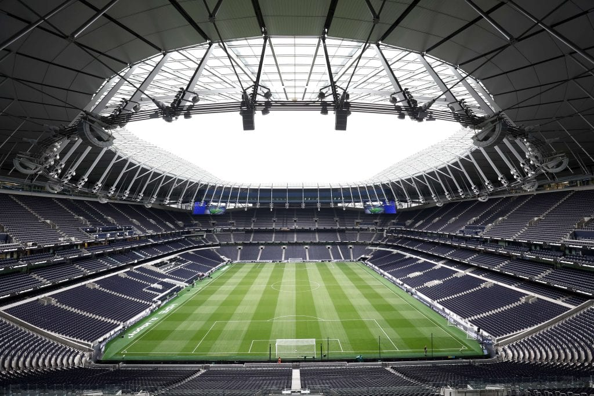

Tottenham Hotspur Stadium sits on the High Road in the middle of a residential stretch of N17, and it's built around a fact the club states plainly on its own site: **there is no public car park at the ground**. Up to 62,850 people arrive almost entirely by train, bus and coach, through four stations that aren't all on the network you'd expect, into a borough that closes its side streets to non-residents for events far smaller than a sell-out.

> 💡 **The Short Version:** Come by train. **White Hart Lane** is the closest station at **5 minutes' walk** and is step-free — use it whether you're going to the football, an NFL game or a concert. It runs on the **London Overground**, not the same network as **Northumberland Park** (10 minutes), which is **Greater Anglia only**. If you're coming from central London, the Victoria line gets you to **Seven Sisters** (30 minutes) or **Tottenham Hale** (25 minutes, step-free, and the more reliable of the two on a matchday). **There is no stadium car park** — the only on-site parking is booked Blue Badge bays. Drive anyway and park on the street in one of Haringey's **seven event-day zones** and the penalty is **£160**, halved if you pay within 14 days. Going home, the **Victoria line runs all night on Friday and Saturday**, but the Overground through White Hart Lane does not. **NFL games close the roads for far longer** — 10 hours before kick-off, not two.

---

## Getting there by train

| Station | Line(s) | Walk to the stadium | Best for |
| --- | --- | --- | --- |
| **White Hart Lane** | **London Overground (Weaver)**, some Greater Anglia | **5 minutes** (~500 steps) | Everyone — the default, for home and away fans alike |
| **Northumberland Park** | **Greater Anglia only** — not the Overground | **10 minutes** (~1,000 steps) | The overflow, approaching from the east |
| **Tottenham Hale** | **Victoria line**, Greater Anglia | **25 minutes** (~2,500 steps) | Central London and airport arrivals — step-free, and steadier than Seven Sisters on a matchday |
| **Seven Sisters** | **Victoria line**, Greater Anglia, Overground (Weaver) | **30 minutes** (~3,000 steps) | Anyone who'd rather walk further than change again — not step-free |

Figures are the club's own, published on its matchday getting-here guide.

### White Hart Lane: the one the club tells everyone to use

Sitting hard against the stadium's west side, off the High Road by Worcester Avenue, White Hart Lane reopened rebuilt alongside the new stadium and is the station Tottenham Hotspur directs both home and away supporters to. It's on the **Weaver** line of the London Overground, with direct trains to and from **Liverpool Street** and onward services to **Enfield Town** or **Cheshunt** — TfL's own live departure boards show trains roughly every few minutes through the evening peak. The station has boarding ramps for step-free access but no ticket hall, no toilets and no car park of its own; it's a walk-through station, not a destination.

> ⚠️ **Don't assume it's the same network as Northumberland Park.** White Hart Lane is Overground. Northumberland Park, the next-closest station, is Greater Anglia only — a different operator, different apps for live running, and not part of the Overground map at all. Tottenham Hotspur's own travel page spells this out: "Use London Overground for direct trains to White Hart Lane, or Greater Anglia for direct trains to Northumberland Park."

### Northumberland Park: the eastern approach

A 10-minute walk in via Northumberland Park Road and Park Avenue Road to Park Lane on the stadium's east side. It has step-free access, according to the club, but no TfL live-departures data — a sign of how separate its Greater Anglia service really is from the Overground next door. Treat it as the release valve for the crowd leaving White Hart Lane, not a first choice.

### Seven Sisters and Tottenham Hale: the Victoria line options

Both give you the Victoria line, both are roughly 25–30 minutes' walk, and the honest answer to "which is better" is **Tottenham Hale**, for two reasons verified directly from the club's own supporter guidance rather than assumption. First, it's step-free to the Victoria line and to the northbound Greater Anglia platform; Seven Sisters has no lifts on any part of its site. Second, and less obvious: **some Victoria line trains skip Seven Sisters entirely on a midweek matchday** to manage congestion further down the line, which can turn a 30-minute walk into a much longer diversion if your train sails past. Tottenham Hotspur's own advice to visiting supporters is to travel early and expect the Victoria line to be busy, "particularly midweek."

Seven Sisters does have one thing Tottenham Hale doesn't: it's also served by the Overground Weaver line, the same one that runs through White Hart Lane — of no real benefit here, since White Hart Lane is so much closer on the same line.

---

## Buses, coaches and bikes

Local bus routes **149, 259, 279 and 349** run along the High Road but are diverted around the ground on event days; the club advises building in extra time rather than relying on them to get close.

For coach travel, **Big Green Coach** runs direct return services from more than 20 towns for **£17 return**, with a season option covering every home Premier League match for **£289**. A second operator, First Travel Solutions, also runs services to the ground. Coaches are directed to designated zones on **West Road** and **Brantwood Road**, in the industrial estate northeast of the stadium — the same streets that pick up bus-parking permissions under Haringey's event-day traffic orders — and drivers need a permit arranged in advance through the club.

The club also runs a **free, pre-booked shuttle bus** from **Alexandra Palace** (Great Northern) and **Wood Green** (Piccadilly line) stations, roughly every 15 minutes from three hours before an event until two hours after. Registration and an e-ticket are required, and the club's own advice is not to board any service less than 50 minutes before kick-off.

Cyclists get **ample parking** at the ground, and **Cycle Superhighway 1** begins on Church Road directly opposite the stadium.

---

Powered by <a target="_blank" rel="sponsored" href="https://www.getyourguide.com/london-l57/">GetYourGuide</a>

## Driving: Haringey's event-day zone

Unlike a car park you can book, the streets around Tottenham Hotspur Stadium fall under an **event-day parking scheme** that applies to home men's and women's games, and to any other event, expected to draw **more than 10,000 people** — which covers essentially every Spurs fixture, both NFL games and any concert.

Seven controlled parking zones carry additional match-day hours:

| CPZ | Monday–Friday | Saturday, Sunday and bank holidays |
| --- | --- | --- |
| Northumberland Park West | 5pm–8.30pm | Noon–8pm |
| The Hale | 5pm–8.30pm | Noon–8pm |
| Tottenham Hale North | 5pm–8.30pm | Noon–8pm |
| Tottenham Event Day | 5pm–8.30pm | Noon–8pm |
| Tower Gardens | 5pm–8.30pm | Noon–8pm |
| White Hart Lane | 5pm–8.30pm | Noon–8pm |
| Willoughby Lane | 5pm–8.30pm | Noon–8pm |

A visitor **cannot buy their own permit** to park in these zones on an event day. Residents in four of the zones — Northumberland Park West, The Hale, Tower Gardens and White Hart Lane — have an event-day permit built into their normal resident permit automatically. Residents of Tottenham Event Day and Tottenham Hale North can apply for a free resident or business permit. A visitor to a resident's house can still park, but only by arriving before the road closures start and using a visitor permit the resident applies for on their behalf. **Blue Badge holders can park as usual** in these zones without any of this.

> ⚠️ **The penalty is steep.** Parking in a suspended bay or a permit bay without a valid permit is a **higher-band Penalty Charge Notice of £160**, cut to **£80** if paid within 14 days — Haringey's current rate since April 2025. Cars left in suspended spaces can be relocated to the council pound; London Councils' TRACE service will tell you if yours has been towed and where to collect it.

### The road closures, phase by phase

Haringey publishes the closure sequence in detail, and it's worth knowing if you're driving anywhere nearby, even without stopping:

- **From 8am**, Worcester Avenue closes for security checks on the stadium's basement car park; Park Lane closes **three hours before kick-off**.
- **Two hours to one hour before**, the northern High Road (from White Hart Lane to Bromley Road) closes to general traffic, with buses diverted around it. Residents can still reach their homes via a vehicle permit checkpoint.
- **One hour before to 15 minutes after kick-off**, nothing but emergency vehicles moves on the roads immediately around the ground, and the southern High Road (down to Lordship Lane/Lansdowne Road) closes too.
- **During the event**, the southern High Road reopens for residents; the northern section stays shut as an emergency evacuation route.
- **From 15 minutes before the final whistle to an hour after**, the High Road closes again in full. Love Lane and Whitehall Street, by White Hart Lane station, stay closed for **up to 90 minutes** to manage the station queue, and Leeside Road and Willoughby Lane run one-way for an hour or two to help the crowd disperse.

---

## Where to actually park

There isn't a Wembley-style menu of official car parks here, because there isn't one to build a menu from.

### The only on-site parking is for Blue Badge holders

**74 enlarged accessible bays** sit in the stadium's basement, reached from **Worcester Avenue**, in three zones — Yellow (North/West Stand), White (East Stand) and Grey (South Stand) — with a **2.1m height limit**. You need to be registered with the club's Disability Access Scheme, and booking opens online at 7pm once tickets for a fixture go on sale, allocated first come, first served. Arrive at least **two hours before kick-off**.

Two overflow options exist for Blue Badge holders without a basement space: **Sainsbury's, Northumberland Park** (no dedicated bays, open from an hour before kick-off) and **St Francis de Sales**, for oversized vehicles, booked by email two hours ahead.

### Non-event days: free parking at Sainsbury's

On any day **without** an event, **Sainsbury's Tottenham** offers free parking, including Blue Badge bays, for up to three hours — a five-minute walk from the club's Tottenham Experience building. It's not available on a matchday, which is exactly when you'd want it.

### For everyone else: don't drive

The club's own guidance for general admission fans is unambiguous: there's no public parking at the stadium, and the surrounding streets are inside a Controlled Parking Zone with additional event-day rules on top. Unlike Wembley, there's no published list of nearby station car parks to leave a car in and ride the last stop or two — Haringey and Tottenham Hotspur simply don't offer that option here, so the only realistic advice is to travel by train, bus or coach.

If you do need to be dropped off, the club recommends a taxi or private-hire drop-off and pickup point at least **half a mile away** — about a 10 to 15 minute walk — rather than trying to get close to the ground. An **event-day black taxi rank** operates at **Scotland Green**, off the High Road.

---

## Getting home

### Managed queues at the stations

Post-match queuing systems run at all four stations, with stewards directing the flow. At **White Hart Lane** and **Northumberland Park**, northbound and southbound platforms are queued separately, and at White Hart Lane there's **no entry onto Moselle Street from the High Road** while the crowd clears.

### The Night Tube reaches two of the four stations — not the closest one

The **Victoria line runs all night on Friday and Saturday**, end to end between Walthamstow Central and Brixton, calling at both **Seven Sisters** and **Tottenham Hale**. If your event finishes late on a weekend and you don't mind the walk, that's genuinely useful.

> ⚠️ **White Hart Lane has no equivalent.** The Weaver line of the London Overground — the one serving the closest, most-recommended station — runs a normal timetable only, with no Friday/Saturday night extension. However late a match, NFL game or concert finishes, the last train from White Hart Lane keeps to its ordinary weekday last-train time. Check the timetable for your specific date before you rely on it, rather than assuming a big event buys you a later train.

### Coaches

Coach parking sits in the same streets used for buses on an event day — **West Road** and **Brantwood Road** — with services from Big Green Coach and First Travel Solutions offering a guaranteed seat home without needing to fight for a train.

---

## The NFL London Games

Tottenham Hotspur Stadium is the **only stadium in Europe purpose-built for American football**, with its own retractable pitch concealing a dedicated NFL playing surface underneath the grass, plus NFL-specific locker rooms, broadcast and medical facilities. The club and the NFL extended their partnership through the 2029–30 season, guaranteeing at least two games a year, and Tottenham now carries official status as a "Home of the NFL in the UK." Two games are confirmed for 2026:

- **Indianapolis Colts v Washington Commanders** — Sunday 4 October 2026, 14:30 BST
- **Philadelphia Eagles v Jacksonville Jaguars** — Sunday 11 October 2026, 14:30 BST

Everything above still applies on an NFL Sunday — the same four stations, the same lack of a public car park, the same Victoria line for central London arrivals. Two things are genuinely different.

**The road closures start much earlier.** Haringey has a separate traffic order specifically for NFL event days, running from **10 hours before kick-off to 90 minutes after the final whistle** — against roughly two hours either side for a football match. For a 2.30pm kick-off, that means restrictions from the early hours of the morning, reflecting the longer pre-game build-up an NFL game brings to the site.

**The crowd is different, and much of it doesn't know London.** NFL London Games draw a large contingent of American visitors for whom this may be their first UK away trip, unfamiliar with buying a ticket for the Tube or the idea that a match can mean the roads close before breakfast. The practical advice: get an Oyster card or use a contactless bank card before you travel — there's no paper ticket booth queue to fall back on at a modern London station — download the TfL Go app for live disruption, and treat the club's four-station, White-Hart-Lane-first guidance as applying to you just as much as to a home fan. The bag policy, the tour timetable and the accessibility provisions covered elsewhere in this guide are the stadium's standard rules for every event, NFL games included.

---

Powered by <a target="_blank" rel="sponsored" href="https://www.getyourguide.com/london-l57/">GetYourGuide</a>

## Where to stay, and why this isn't Wembley

**There's no cluster of stadium hotels here** the way there is at Wembley or Stratford — this part of Tottenham is residential streets and a high road, not a hotel district. The honest advice for most visitors is to **stay central and travel out** on the Victoria line.

The nearest chain hotel is **Premier Inn London Tottenham Hale**, on Station Road, **1.5 miles — about 25 minutes' walk — from the stadium**, and the hotel markets itself explicitly on that proximity ("at the heart of the football action, with both Emirates and White Hart Lane nearby"). It has no parking of its own; the nearest option is Hale Village Car Park, an 8-minute walk away, at £10 a day.

**Is there a genuine price spike?** Checked directly on the hotel's own booking engine, for one adult, one room:

| | Sunday 4 October 2026 (NFL: Colts v Commanders) | Tuesday 6 October 2026 (ordinary night) |
| --- | --- | --- |
| Standard (non-refundable) | **£184** | £143 |
| Semi-Flex | £190 | £150 |
| Flex (fully refundable) | £202 | £170 |
| Availability | Only 3 rooms left | 7 rooms left |

*Premier Inn direct-booking rates for one room, one adult, checked on 13 September 2026.*

That's a real jump — roughly **29% on the cheapest rate** — and genuinely tighter availability, but nowhere near the multiples a big Wembley date produces. If you'd rather not think about it at all, Premier Inn also has hotels further out at **Edmonton** (N18 3AF) and **Enfield** (EN3 7XY), both on retail parks built around driving rather than walking to a station, so they only make sense if you have a car.

For everyone else, our [guide to the best areas to stay in London](/articles/best-areas-to-stay-in-london/) covers the Victoria line neighbourhoods that put you one change from Seven Sisters or Tottenham Hale.

---

## The hours before doors

*The stadium bowl, roof open, before a crowd of up to 62,850 arrives.*

### The stadium tour, and the separate one for matchdays

The regular **Stadium Tour** is **from £25** for an adult, with kids going free alongside a paying adult and a 15% discount for booking ahead — but, checked against the club's own live booking calendar, it **does not run on any day the stadium has a fixture**, football or NFL; those dates simply show no availability rather than a sold-out notice.

In its place, a separate **Matchday Tour** (from £50, 10% off booked ahead) runs in the hours before kick-off on event days themselves, going behind the scenes into the home changing room, the tunnel and the media mixed zone, with a seat in the manager's dugout chair and a pitch-side photo with the match ball — and, distinctively, a look at the **NFL away dressing room and press auditorium** on an NFL day.

Beyond the two tours, the site also runs **The Dare Skywalk** (a harnessed walk 46.8 metres above the pitch), **F1 Drive London** (an outdoor go-kart circuit, seasonal), Legends Tours and VIP Tours.

---

## Eating and drinking

**Beavertown Brewery** still operates inside the stadium, in the South Stand at Level 1, brewing on-site — a claim worth checking on an older stadium guide, since it dates back to the ground's 2019 opening, but it remains accurate today. Its beer, alongside Pravha, Madri and Coors, is served at the **Goal Line Bar**, which the club markets as **Europe's longest bar at 65 metres**.

Across more than **58 outlets** on the general admission concourses, named vendors include **The Linesman** (fish and chips), **N17 Grill** (burgers, with gluten-free and plant-based options), **Seoul Birdie** (Korean food), **Smashed Olive** (stone-baked pizza), **Chicken House** (halal fried chicken) and **Tap Inn**, which has 29 separate locations selling pies and sausage rolls made on-site. The stadium is **fully cashless** — contactless, mobile payment or a gift card only, no cash accepted anywhere on the campus.

Outside the ground, the options are the ordinary shops and takeaways along the High Road rather than a single food destination everyone heads to first — there's no equivalent here of a Wembley-style Boxpark to plan an evening around.

---

## Drinking on event days

Haringey's **borough-wide Public Spaces Protection Order** bans drinking alcohol in an anti-social manner anywhere in the borough — Tottenham included — and runs until **1 May 2028**. Breach it and the fixed penalty is **£100**, rising to a maximum of **£1,000** if it isn't paid and goes to court.

Inside the stadium, alcohol sales follow standard rules: it's a criminal offence to serve anyone under 18, including non-alcoholic beer, and the whole site is cashless, so bring a card.

---

## The bag problem

| | Tottenham Hotspur Stadium |
| --- | --- |
| **Personal bag limit** | A4 size or smaller — **21cm × 30cm** |
| **Clear bag alternative** | Up to **30cm × 30cm** |
| **Club drawstring bag** | Sold at the ground for £1, PVC, complies automatically |
| **Laptop sleeves** | Up to **37cm × 31cm** |
| **Bag drop on site** | **None** |
| **Medical exemption** | A form is available in advance for anyone who needs to bring a bag or equipment beyond these limits |

Bags over the limit are simply not permitted in — there's nowhere on site to check them, so plan around your hotel's storage or leave bulkier bags behind entirely before you travel. These are the published limits for every event at the ground, NFL games included.

---

Powered by <a target="_blank" rel="sponsored" href="https://www.getyourguide.com/london-l57/">GetYourGuide</a>

## Step-free access and the Sensory Suite

The stadium was designed around accessibility from the start: **five lifts** run the full height of the concourse from street level, there are **more than 250 wheelchair bays** and **over 500 additional accessible seats**, **66 accessible toilets** with RADAR key access, and **three Changing Places** facilities (two in the stadium, one in the club's Tottenham Experience building). Four home entrances (1, 5, 13 and 17) and one away entrance (11a) have lift access and are stocked with audio-commentary headsets, wheelchairs, induction loops and a water bowl for assistance dogs.

A dedicated **Sensory Suite** in the North Stand (block 416) offers a lower-stimulation space for up to three supporters plus one personal assistant each, with a tactile wall and bubble tube — booking requires completing a profile form in advance. The club issues a **Personal Assistant (PA) ticket** rather than what other venues call a companion ticket, arranged through an Access Requirement Form with supporting evidence (such as DLA, PIP or a specialist letter) sent to access@tottenhamhotspur.com.

**By station:** White Hart Lane and Northumberland Park both have step-free access, and the club says all routes from any of the four stations to the ground are wheelchair-friendly. Tottenham Hale is step-free to the Victoria line and the northbound Greater Anglia platform only. **Seven Sisters has no lifts at all**, on any part of the site — not the best choice if step-free matters to your journey.

Visiting (away) supporters use entrances 11 and 12, in blocks 114–118 in the stadium's north-east corner, approached via Worcester Avenue.

---

## Small print that catches people out

- **Sat-nav:** use **N17 0BX** for the stadium.
- **Everyone needs their own ticket**, including babies in arms — there's no lap-ticket option, and the club suggests thinking carefully about whether a stadium environment suits a very young child. Ear defenders are recommended for under-5s at their seat.
- **Each ticket works once** at the turnstile; it cannot be passed on to someone else after you've entered.
- **Gates open early:** three hours before kick-off for premium ticket holders, two hours before for general admission.
- **No pushchair storage** is provided inside the stadium.
- **Coach drivers** need a permit arranged in advance through the club before using the West Road or Brantwood Road coach zones.

---

## Continue planning your London trip

- 🚇 **[How to Use the London Underground](/articles/how-to-use-the-london-underground/)**
- 💷 **[London Transport Costs and Fares](/articles/london-public-transport-costs-and-fares/)**
- 🛏️ **[Best Areas to Stay in London](/articles/best-areas-to-stay-in-london/)**
- 🏟️ **[Wembley Stadium and OVO Arena Travel Guide](/articles/wembley-stadium-arena-guide/)**
- 🚌 **[How to Use London Buses and Trams](/articles/how-to-use-london-buses-and-trams/)**
- 🎾 **[How to Get Wimbledon Tickets](/articles/wimbledon-tickets-guide/)**
- 💰 **[Money in London: Cash, Cards and ATMs](/articles/money-in-london/)** — including which London venues take no cash at all

---

*Figures come from Tottenham Hotspur's own matchday and accessibility guides, the Tottenham Hotspur Stadium attractions site, TfL's station and line data, Haringey Council's parking and traffic orders, and Premier Inn's own booking engine, checked the week of 13 September 2026. Hotel prices are a sample from the operator's own booking engine and will move. Parking and traffic restrictions are set per event, so check the council's page for your specific date.*
