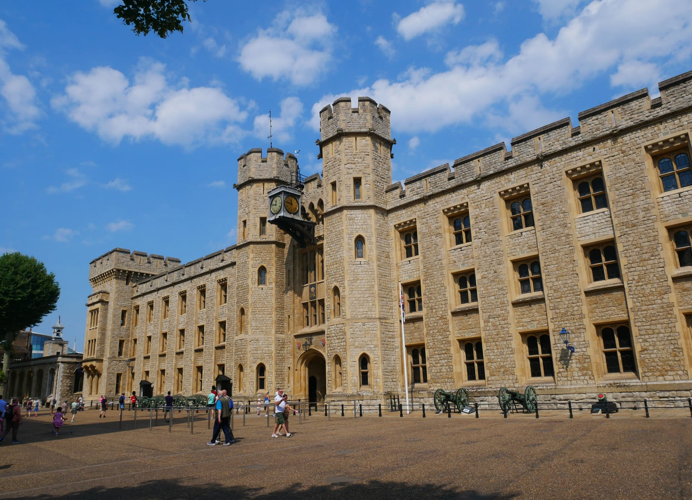
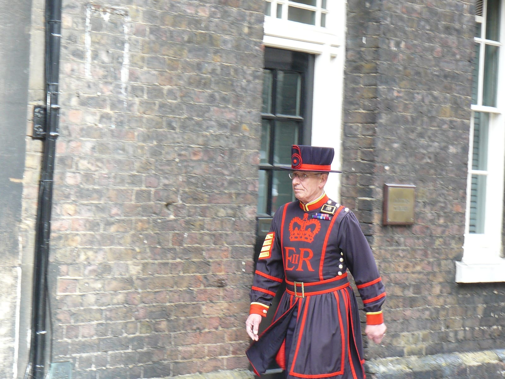
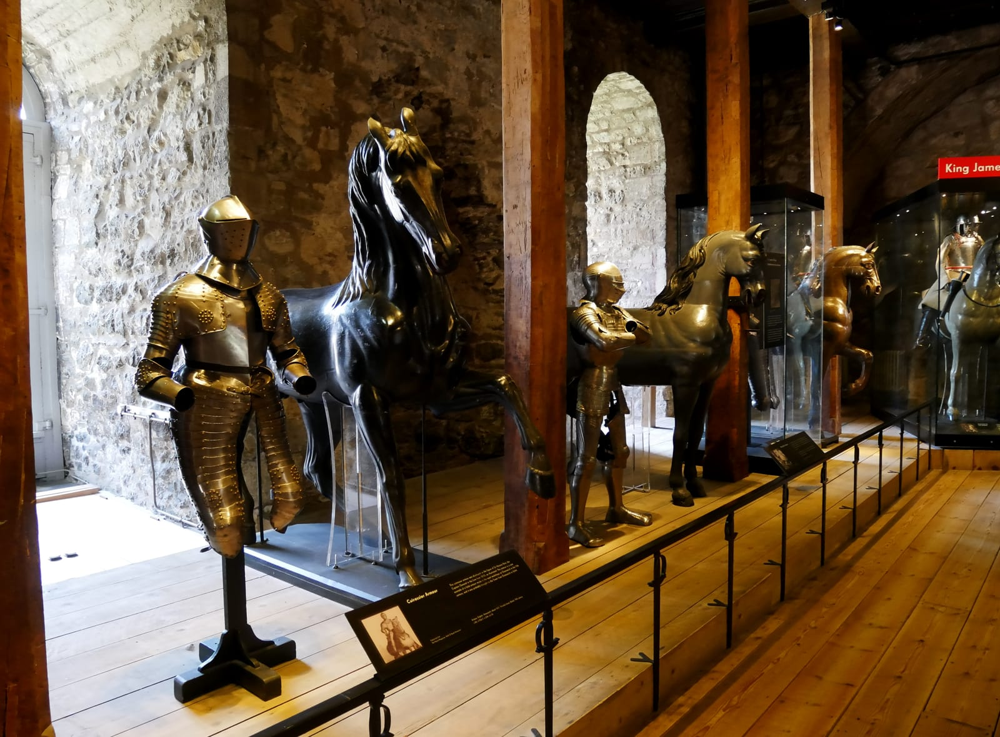
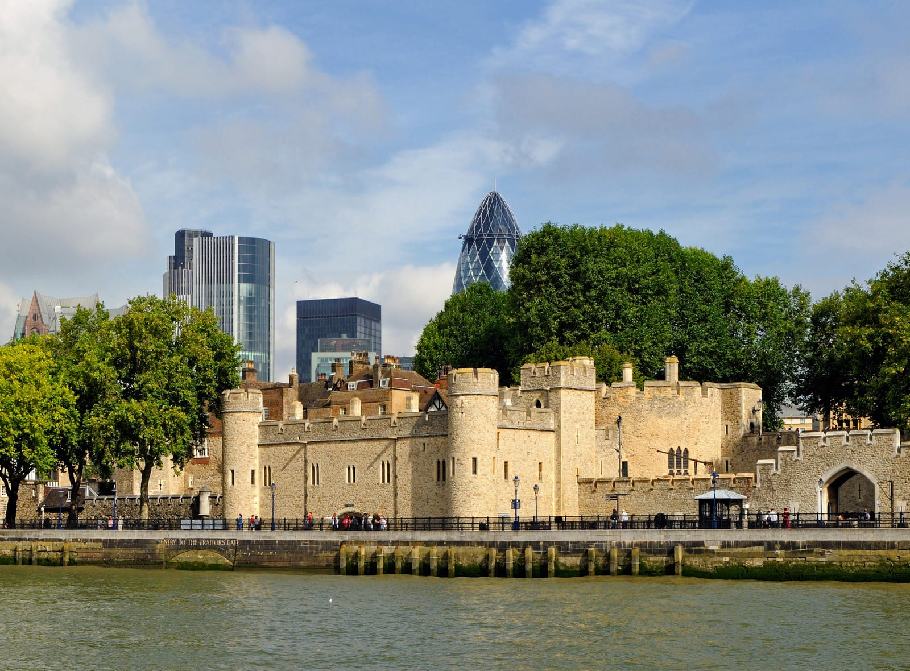
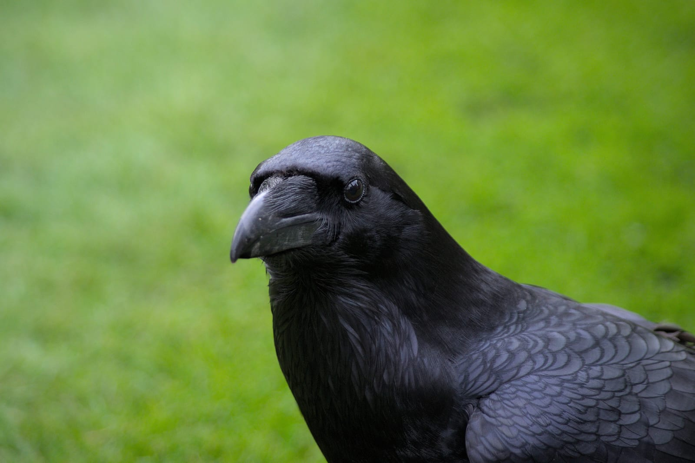

The Tower of London has stood on the Thames since the 1070s. Historic Royal Palaces, the independent charity that runs it, receives no government funding and prices tickets by age band with one optional 10% donation on top — there's no peak-and-off-peak split, and no family ticket.

> 💡 **The Short Version:**
> - **Price:** Adult £37.00 (£40.70 with the optional 10% donation). Young person (16–17) and child (5–15) £18.50 (£20.40 with the donation); under 5s free. Senior, student and disabled concession £29.50 (£32.50 with the donation). No family ticket — book each person separately, or as an <a href="https://www.getyourguide.com/activity/-t21253?partner_id=WWP7I0R&amp;cmp=tower-of-london-guide" target="_blank" rel="sponsored nofollow noopener" data-affiliate="gyg">official timed entry ticket on GetYourGuide</a>, which matches the gate price and includes free cancellation up to 24 hours before.
> - **Hours:** Historic Royal Palaces publishes times date by date. On 19 September 2026 the Tower opened 09:00–17:30, last entry 16:30. Check [HRP's opening times](https://www.hrp.org.uk/tower-of-london/visit/opening-and-closing-times/) for your date.
> - **When to go:** HRP's own guidance is that the Tower is quieter after midday. Allow two to three hours.
> - **The Yeoman Warder (Beefeater) tour** is free with admission — never pay a third party for an "exclusive" version.
> - **The Ceremony of the Keys** is pay-what-you-choose (HRP suggests £30, from £10 to £50), booked online only, in advance.
> - **If you have The London Pass**, entry is included — show your digital pass at the ticket office.

---

## Tickets and prices

Prices below are Historic Royal Palaces' own, published 19 September 2026, and hold whatever day you visit — one rate with an optional donation, not separate peak and off-peak prices.

| Ticket | Price | With 10% donation | Notes |
| --- | ---: | ---: | --- |
| Adult (18–64) | £37.00 | £40.70 | |
| Young person (16–17) | £18.50 | £20.40 | ID may be asked for |
| Child (5–15) | £18.50 | £20.40 | Must be with an adult |
| Under 5 | Free | Free | No ticket needed |
| Senior (65+) | £29.50 | £32.50 | |
| Full-time student (18+) | £29.50 | £32.50 | Valid student card |
| Disabled concession | £29.50 | £32.50 | Carer or companion goes free |
| Groups (15+) | £34.10 a head | — | No donation option |

Anyone on Universal Credit, Working Tax Credit, Pension Credit, Employment and Support Allowance, Income Support or Jobseeker's Allowance pays **£1 a head**, for up to four people in the household, booked online in advance. Tower Hamlets residents pay £1 all year. **Historic Royal Palaces membership** starts at £65 a year and covers the Tower, Hampton Court and Kensington Palace.

Book direct through [Historic Royal Palaces](https://www.hrp.org.uk/tower-of-london/visit/tickets-and-prices/) or as an official <a href="https://www.getyourguide.com/activity/-t21253?partner_id=WWP7I0R&amp;cmp=tower-of-london-guide" target="_blank" rel="sponsored nofollow noopener" data-affiliate="gyg">timed entry ticket on GetYourGuide</a>, which matches the gate price and includes free cancellation up to 24 hours before. If you have The London Pass, entry is included — show your digital pass at the ticket office.

Powered by <a target="_blank" rel="sponsored" href="https://www.getyourguide.com/london-l57/">GetYourGuide</a>

---

## What to see

Historic Royal Palaces' own guidance is that the Tower is quieter after midday; allow two to three hours to see the Crown Jewels, the White Tower and a Yeoman Warder tour. What follows is a sensible order to see it in, not a clock to race.

*The Waterloo Barracks. The Jewel House, home to the Crown Jewels, is on the ground floor.*

### The Crown Jewels

The Crown Jewels are displayed in the Waterloo Barracks, through the Bloody Tower archway and across the Inner Ward. Moving walkways carry visitors past the working ceremonial regalia: the Imperial State Crown, the Sovereign's Sceptre with the Cullinan I diamond, and St Edward's Crown, used at the 2023 Coronation.

### The Yeoman Warder tour

Free with standard admission, with no separate booking needed. Tours run roughly every 30 minutes from near the Middle Tower through the day; on 19 September 2026 the last one included in the ticket was at 15:15. They cover Traitor's Gate, the execution site on Tower Green, and the Chapel Royal of St Peter ad Vincula, where Anne Boleyn, Catherine Howard and Lady Jane Grey are buried.

*A Yeoman Warder addressing visitors in the outer ward.*

### The White Tower and the Line of Kings

Commissioned by William the Conqueror in the 1070s, the White Tower is the original Norman keep.

*The Line of Kings, the White Tower's display of royal armour.*

- **First floor:** St John's Chapel, an 11th-century Norman chapel in white Caen stone.
- **Second floor:** the Line of Kings, with armour linked to Henry VIII and Charles I.
- **Basement:** the torture chamber, with an execution block and axe.

### The battlements, Traitor's Gate and the ravens

The southern ramparts look out over the Thames. Below them, **Traitor's Gate** sits beneath St Thomas's Tower, built by Edward I as a private river entrance to the royal apartments.

*Traitor's Gate beneath St Thomas's Tower. Prisoners arrived by barge through this water gate from Westminster.*

By tradition dating to the reign of Charles II, the Tower keeps at least six ravens, cared for today by the Ravenmaster.

*One of the Tower's resident ravens, kept on the South Lawn.*

---

## Other ways to visit

Historic Royal Palaces sells a few ways to see more than standard admission covers, each booked through its [ticket page](https://www.hrp.org.uk/tower-of-london/visit/tickets-and-prices/):

- **Keys Club** — a small-group upgrade with a Yeoman Warder, on Tuesdays and Thursdays.
- **The Ravens experience** — an early-morning session with the ravens, on Wednesdays and Fridays.
- **The Opening Ceremony ticket** — entry before the Crown Jewels open to other visitors.
- **The official River Tour combination** — Tower admission combined with a river tour.

Powered by <a target="_blank" rel="sponsored" href="https://www.getyourguide.com/london-l57/">GetYourGuide</a>

## The Ceremony of the Keys

The Ceremony of the Keys is the formal locking of the Tower's gates, held every night without interruption for more than 700 years.

> *"Halt! Who comes there?"*
> *"The Keys."*
> *"Whose Keys?"*
> *"King Charles's Keys."*
> *"Pass, King Charles's Keys, and all's well."*

It runs from 21:30 to 22:05: visitors are let into the closed fortress under torchlight to watch the Chief Yeoman Warder and the military escort lock the Middle and Byward Towers, followed by the Last Post.

> ⚠️ **There's no door sale.** Tickets are booked online only, always in advance, through [HRP's Ceremony of the Keys page](https://www.hrp.org.uk/tower-of-london/whats-on/ceremony-of-the-keys/) — you cannot buy one at the gate on the night.

It's pay-what-you-choose: Historic Royal Palaces suggests £30 a ticket, and you can pick anywhere from £10 to £50. Tickets for a given month go on sale at **13:00 on the first working day of the month before** — October dates release on the first working day of September, for instance — moving to the following Monday at 13:00 if that first working day falls on a Friday. HRP members book on their own separate dates.

---

## Practical information

### Getting there

- **Tube:** Tower Hill (District and Circle lines), five minutes' walk, step-free to street level.
- **DLR:** Tower Gateway, seven minutes' walk, connecting from Docklands and Canary Wharf.
- **River bus:** Tower Pier sits outside the riverside wharf gates; Uber Boat by Thames Clippers calls every 20 minutes from Westminster, Embankment and Greenwich. See our [guide to London river boats](/articles/how-to-use-london-river-boats/) for piers and fares.
- **Mainline:** Fenchurch Street, six minutes' walk; London Bridge, a ten-minute walk.

### Bag rules and accessibility

There's no cloakroom or luggage locker inside the Tower, and oversized bags aren't permitted through security. Leave large luggage before you arrive — see our [luggage storage in London guide](/articles/luggage-storage-london/) for points near Tower Hill and London Bridge.

The grounds are cobbled, with steep ramps and narrow spiral stairs. The Jewel House and lower grounds are reachable by lift; the upper levels of the White Tower and the Medieval Palace battlements are not wheelchair accessible.

### Common mistakes to avoid

- **Buying on the day.** Book online in advance rather than queuing at the ticket booths.
- **Paying a third party for an "exclusive" Beefeater tour.** Every standard ticket already includes the official Yeoman Warder tour.
- **Allowing less than two to three hours.** That's what it takes to see the Crown Jewels, the White Tower and a Yeoman Warder tour properly.

---

Powered by <a target="_blank" rel="sponsored" href="https://www.getyourguide.com/london-l57/">GetYourGuide</a>

## Continue planning your London trip

- 🏛️ **[City of London Area Guide](/articles/city-of-london-area-guide/)** — Roman ruins, Leadenhall Market, and historic pubs surrounding the Tower.
- 🗺️ **[Three Days in London Itinerary](/articles/three-days-in-london-itinerary/)** — where the Tower fits into an efficient Zone 1 walking plan.
- 🎟️ **[The London Pass Guide](/articles/london-pass-guide/)** — when the pass saves money on Tower admission and when it does not.
- 🎖️ **[Churchill War Rooms Guide](/articles/churchill-war-rooms-guide/)** — Churchill's underground wartime bunker, a short trip away near Westminster.
- 💷 **[London on a Budget](/articles/london-on-a-budget/)** — free sights and booking hacks across Central London.
- 🚤 **[How to Use London River Boats](/articles/how-to-use-london-river-boats/)** — scenic boat routes from Tower Pier to Greenwich and Westminster.

---

*Prices, opening hours and Ceremony of the Keys details are Historic Royal Palaces' own, checked 19 September 2026.*
