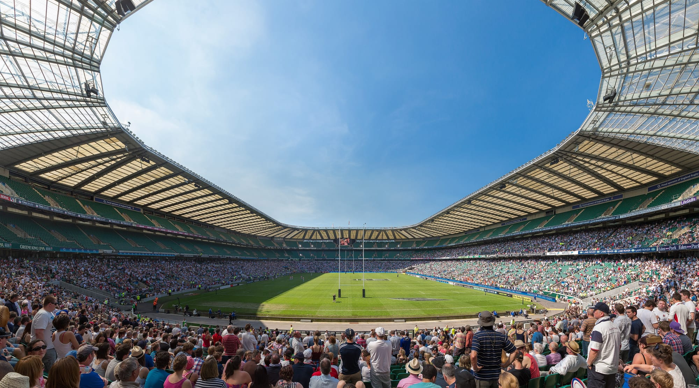

Allianz Stadium seats **82,000**, which the RFU calls the largest dedicated rugby union venue in the world. Most of that crowd arrives through a suburban station in Zone 5, into a mile-wide parking zone run by two different councils, down roads that close to traffic 90 minutes before kick-off. The travelling part of a Twickenham day is not hard. It is just slower than the numbers on the stadium's own page suggest.

> 💡 **The Short Version:** Come by train. **Twickenham station** is **four trains an hour from Waterloo in 22 to 23 minutes**, and the stadium is a **1.3km walk** — the stadium says 10 minutes, TfL says 17, and in a full-house crowd it is more. If that queue looks bad, **Whitton is 20 minutes' walk** on the Hounslow loop. Parking on the street is out: a **one-day controlled parking zone** covers about **a mile** around the ground from **11am to 11pm** on event days, visitors **cannot buy a permit**, and the penalty is **£140 to £160**, halved within 14 days. Every stadium car park must be **pre-booked** and they **close five hours after kick-off**. Going home, the crowd takes **two to three hours** to clear and the **last train to Waterloo is 00:11**. The only all-night service is the **Piccadilly line from Hounslow East** on Friday and Saturday — a 30 to 35 minute walk, about every 10 minutes, 37 minutes to Green Park.

---

## Getting there by train

| Station | Zone | Walk | Best for |
| --- | --- | --- | --- |
| **Twickenham** | 5 | **10 min** (1.3km) | Everyone. Waterloo, Reading and Windsor & Eton Riverside trains, and the only station with the crowd designed into it |
| **Whitton** | 5 | **20 min** | The Hounslow loop, and the shorter queue going home. No ticket gates, step-free to both platforms |
| **St Margarets** | 4 | **20 min** | A Zone 4 fare and the same walk as Whitton, on the Richmond side. Only part step-free |
| **Strawberry Hill** | 5 | **32 min** | The Shepperton and Kingston loop lines, from Teddington and south-west |
| **Hounslow** | 5 | **30 min** | The other end of the Hounslow loop |
| **Hounslow East** | 4 | **30–35 min** | The Piccadilly line, Heathrow, and the only train that runs all night |
| **Richmond** | 4 | **45 min** | District line, London Overground and South Western Railway — and the free shuttle after the match |

*Walk times are the stadium's own except Strawberry Hill, which it does not list; TfL's journey planner walks that one in 32 minutes over 2.4km.*

### Twickenham: the default, and the pinch point

Twickenham station is on London Road, **TW1 1BD**, in **Zone 5**, so Oyster and contactless work. It has ticket gates, toilets on every platform, a cash machine in the booking hall, taxi ranks at both the north and south entrances and **168 sheltered cycle spaces** on the mezzanine. The ticket office opens 06:40 to 20:20 Monday to Saturday and 07:40 to 19:10 on Sunday.

From **Waterloo** there are **four trains an hour**, at roughly :03, :18, :33 and :48, taking **22 to 23 minutes** and calling at Clapham Junction and Richmond. Coming back there are **six an hour**, taking **24 to 33 minutes** depending on whether your train runs direct or the long way round the Hounslow or Kingston loop. Twickenham also has direct trains to **Reading** and **Windsor & Eton Riverside**.

The station you use today opened on **28 January 2020**, rebuilt by Network Rail and Kier as the first phase of the Twickenham Gateway scheme: step-free access to all platforms, a bigger ticket hall, a public plaza outside about half the size of the pitch, and — in South Western Railway's own words — "an enhanced queuing system for match days at Twickenham stadium". SWR put the station's annual passenger count at **5.5 million** when it opened. It is still one suburban station taking the larger part of an 82,000 crowd.

> ⚠️ **The 10-minute walk is not 10 minutes.** [The stadium's travel page](https://allianzstadiumtwickenham.com/getting-here) puts Twickenham station at a 10-minute walk. TfL's journey planner makes the same route **17 minutes over 1.3km**, and the stadium's figures for Whitton (20 minutes) and Hounslow (30) match TfL to the minute — it is only the Twickenham number that is brisk. Budget 20 minutes each way, and more once the pavements fill.

### Whitton: the one to walk to when the queue is long

Twenty minutes on foot, west of the ground, on the **Hounslow loop** — the circular route that runs Waterloo–Richmond–Twickenham–Whitton–Hounslow–Barnes–Waterloo, so trains from Whitton reach Waterloo either way round. It takes **29 minutes** direct, twice an hour. The station has **no ticket gates** and is **step-free to both platforms**. Twenty minutes of walking against a two-hour crowd is a trade most people should take.

### St Margarets and Strawberry Hill

**St Margarets** is a 20-minute walk and in **Zone 4**, one stop closer to town, with ticket gates and no car park. Step-free access is partial: South Western Railway rates it **category B3**, step-free only for trains towards Twickenham and Strawberry Hill, with steps for trains towards Richmond, and not step-free at all when the station is unstaffed.

**Strawberry Hill** is further, 32 minutes, but it puts you on the **Shepperton branch and the Kingston loop** — useful from Teddington, Hampton and Kingston, and 38 minutes to Waterloo the long way round. It is **category B1**: ramps to both platforms, one of them at about 1:10, and a full-barrier level crossing between them.

### Richmond and Hounslow East: the shuttle stations

Both are too far to walk comfortably — **45 minutes** and **30 to 35 minutes** — and both are where the RFU puts its shuttle buses, which is the point of them. **Richmond** is **Zone 4** and gives you the District line, the London Overground and South Western Railway in one place, and it is step-free to every platform. **Hounslow East** is **Zone 4** on the **Piccadilly line**, which matters more after dark than before it.

---

## The RFU shuttle bus

On **any event day with a crowd over 35,000** — which is every international, the Nations Championship finals and Harlequins' Big Game — the RFU runs [electric shuttle buses](https://help.englandrugby.com/support/solutions/articles/103000350104-event-day-shuttle-buses) on two routes.

| Route | Fare | Going home from | Coming in from |
| --- | --- | --- | --- |
| **Richmond** | **£5** before, **free** after | **Rugby Road**, beside the stadium | The **A316 by Pools in the Park**, a 5–10 minute walk from Richmond station |
| **Hounslow East** | **£5** before, **free** after | **Whitton Dene**, north of the stadium | **Hounslow East station, Kingsley Road** |

They start **three hours before kick-off** and run until **three hours after the final whistle**. Check the destination board when you board: the two routes leave from different streets going home.

---

## Buses

Four routes stop within a minute of the ground — **281** (Hounslow to Tolworth), **481** (from Kingston's Cromwell Road bus station), **681** (Hounslow to Teddington) and **110** (Hounslow to Hammersmith). The **H20** stops five minutes away and the **267** eight. The **R68, R70, 33, 290, H22** and **490** stop in Twickenham, 10 to 15 minutes' walk.

Two are worth knowing about specifically. The **110 and 267 both run to Hammersmith bus station**, on the Piccadilly and District lines — a slow way back into town that keeps you out of the railway station altogether. The **490** runs from Richmond to **Heathrow Terminal 5**.

> ⚠️ **The 281 and 481 get diverted.** The stadium flags both as subject to diversion once the match-day road closures go in, which is about 90 minutes before kick-off. The 681 and 110 are not flagged.

---

Powered by <a target="_blank" rel="sponsored" href="https://www.getyourguide.com/london-l57/">GetYourGuide</a>

## Driving: a parking zone run by two boroughs

The stadium is off the **Whitton Road roundabout** on the **A316**, next to the Lexus and Toyota dealership, six miles from Heathrow. Sat-nav postcode **TW2 7BA**; the ground rules give the address as 200 Whitton Road. The whole area is inside the **Ultra Low Emission Zone**, so a non-compliant vehicle costs [£12.50 a day](https://tfl.gov.uk/modes/driving/ultra-low-emission-zone), midnight to midnight.

Around it, on event days only, is the **Twickenham Event (R) Zone**, a one-day controlled parking zone operated jointly by **Richmond upon Thames and Hounslow**. The RFU describes it as covering roughly **a mile** around the stadium.

| | |
| --- | --- |
| **When** | **11am to 11pm** on event days |
| **Trigger** | Crowds of **25,000 or more**. Over 30,000 gets the [full zone](https://www.richmond.gov.uk/services/parking/event_day_parking); around 30,000 gets a smaller sub-zone covering the streets immediately opposite the ground |
| **Can a visitor buy a permit?** | **No.** Residents and businesses inside the zone get free annual permits for themselves and their visitors |
| **Penalty** | **£160** in Hounslow; **£140 or £160** in Richmond depending on the street's band. Halved if you pay within **14 days** |
| **Removal** | Possible. The RFU's own wording is that vehicles "in some cases" are removed |

Every England international this autumn is an 82,000 crowd, so the full zone applies to all of them. Blue Badge holders may park inside the zone as usual.

**The roads close too.** Whitton Road and Rugby Road shut to traffic about **90 minutes before kick-off** and again afterwards; Richmond also lists London Road between King Street and Whitton Road. The RFU puts the post-match closures at **two to three hours**, the council at **one and a half to two**, both depending on how fast the crowd moves. Closures do not block access to the Cardinal Vaughan, North or Tesco car parks — but the stadium's advice is to be parked **90 minutes before kick-off** all the same.

---

## Where to actually park

Every RFU car park on a match day **must be booked in advance**, through the parking tab on the fixture's page at englandrugby.com. Prices vary by event. They generally **open five hours before kick-off and close five hours after it** — for the 14:10 kick-off against New Zealand on 21 November, that is 09:10 to 19:10. No camper vans, no overnight stays, and no barbecues, gazebos or generators in any of them.

| Car park | Sat-nav | Surface | Walk | Takes |
| --- | --- | --- | --- | --- |
| **North** | **TW1 1DZ** | Large gravel, uneven | On site, via Whitton Dene | Cars; a free **motorbike** area. Not suitable for impaired mobility |
| **Cardinal Vaughan** | **TW7 7LT** | Grass, some hard track | On site, via Whitton Dene | **Cars only** — no vans, minibuses or coaches. Height limit **6ft 1in** |
| **Rosebine Avenue** | **TW2 7PS** | Grass, limited hard track | **10–15 min**, off the A316 | Overflow. The RFU does not recommend it for anyone with impaired mobility |
| **Tesco, Mogden Lane** | **TW7 7JY** | **Hard standing** | **300m** from Gate D | **Blue Badge and Access Card holders only** |

Cardinal Vaughan is where the picnics happen, and there are now **turnstiles and security checks** on the footbridge from it into the British Airways West Fan Village, so allow extra time.

**The council car parks are the fallback.** Richmond's **Arragon Road multi-storey** (**TW1 3NG**, 437 spaces, 1.9m height limit) is in Twickenham town centre, 1.7km from the ground and a 22-minute walk on TfL's reckoning, and it charges a **special events tariff of £26.45** — the council's own published rate for exactly this, effective 6 July 2026. It is open 7am to midnight Monday to Saturday and 9.30am to 6pm on Sunday. In Whitton, **Nelson Road** (**TW2 7BB**, 64 spaces) is £2.90 for three hours and free outside 8.30am to 5pm Monday to Saturday, but three hours is the maximum stay while charges apply, which rules it out for an afternoon kick-off.

> ⚠️ **Don't drive to the station either.** Twickenham station's car park has **21 spaces**. Richmond's has 55, at £15.40 on a Saturday. Whitton, St Margarets and Strawberry Hill have none at all.

**Electric charging** at the stadium is five units in the media compound in the north-west corner, reached via Gate D on Rugby Road, paid through the Fuuse app or a QR code on the charger — **non-match days only**. Bike racks are in the **south-east corner by the ticket office**; bring your own lock.

---

## Getting home

This is the part that decides whether you enjoyed the day.

**The timetable does not change for the match.** Departures from Twickenham on Saturday 21 November are identical to those on an ordinary Saturday: **six trains an hour to Waterloo**, against a crowd of 82,000. The rebuilt station has a match-day queuing system, and the closures on Whitton Road and Rugby Road stay in place for **two to three hours** while it works through.

**The walk to Whitton is 20 minutes.** Two trains an hour, 29 minutes to Waterloo, and a station with no ticket gates to funnel through. The RFU's own guidance points the same way: the north side of the ground clears faster because the crowd is heading south to Twickenham and Whitton.

**The shuttles are free going home**, from **Rugby Road** for Richmond and **Whitton Dene** for Hounslow East, for **three hours after the whistle**. Richmond gives you the District line and the Overground as well as the train; Hounslow East gives you the Piccadilly.

**Taxis** do not come to the ground. Private hire pickups are at the **Twickenham Stoop**, Harlequins' ground on the other side of the A316. There is also a rank at Twickenham station, off London Road.

### The last trains, and the one that runs all night

| From | Last departure | Arrives | After that |
| --- | --- | --- | --- |
| **Twickenham** → Waterloo | **00:11** | 00:35 | Nothing until **06:51** |
| **Whitton** → Waterloo | 23:50 | 00:19 | — |
| **Richmond** → Waterloo | 00:15 | 00:35 | — |
| **Hounslow East** → Green Park | **No last train on a Friday or Saturday** | 37 minutes later | Night Tube, about every **10 minutes** |

*Times are for the night of Saturday 21 November 2026, England v New Zealand.*

> ⚠️ **There is no night train from Twickenham.** After 00:11 the station is shut until 06:51. The only all-night option anywhere near the ground is the **Piccadilly line Night Tube from Hounslow East**, on Friday and Saturday nights only, about every 10 minutes. It is a 30 to 35 minute walk and the shuttle bus will have finished, so decide before you leave the ground, not after.

That matters most on **Friday 27 November 2026**, when the Nations Championship finals weekend puts a second kick-off at **20:10** — a crowd of 82,000 leaving at about ten o'clock.

**Sunday trains are not a given.** Engineering work lands on this line some Sundays, and it makes a difference: on Sunday 18 October 2026 the Twickenham–Waterloo run becomes an hour with a change instead of 25 minutes direct. Check [South Western Railway's engineering calendar](https://www.southwesternrailway.com/plan-my-journey/planned-improvements/planned-engineering-works) against your date.

---

## What fills it

*The bowl holds 82,000, and empties into a Zone 5 suburb. Photo: [Diliff](https://commons.wikimedia.org/w/index.php?curid=22436784), [CC BY-SA 3.0](https://creativecommons.org/licenses/by-sa/3.0/).*

Twickenham Stadium has been **Allianz Stadium** since September 2024, when the RFU's naming-rights partnership with Allianz began. Its own pages still describe it as "Allianz Stadium, formerly known as Twickenham Stadium", and the postcode is unchanged. It is England's home ground, and what fills it is internationals, one Harlequins fixture a year and the occasional concert.

| Date | Event | Kick-off | Crowd |
| --- | --- | --- | --- |
| Sat 26 Sep 2026 | Red Roses v New Zealand (WXV) | 15:00 | 60,000 |
| **Sun 8 Nov 2026** | England v Australia | 15:10 | **82,000** |
| **Sat 14 Nov 2026** | England v Japan | 16:40 | **82,000** |
| **Sat 21 Nov 2026** | England v New Zealand | 14:10 | **82,000** |
| **Fri 27 Nov 2026** | Nations Championship finals | 16:40 & 20:10 | **82,000** |
| **Sat 28 Nov 2026** | Nations Championship finals | 13:10 & 16:40 | **82,000** |
| **Sun 29 Nov 2026** | Nations Championship finals | 13:10 & 16:40 | **82,000** |
| Mon 28 Dec 2026 | Harlequins Big Game 18 | 14:00 & 17:00 | — |
| **Sun 14 Feb 2027** | England v France, Six Nations | 15:10 | — |
| **Sat 20 Feb 2027** | England v Italy, Six Nations | 16:40 | — |
| **Sat 13 Mar 2027** | England v Scotland, Six Nations | 16:40 | — |

Crowd figures are Richmond Council's, published to warn residents which days the parking zone is on. England v New Zealand is sold out; tickets for the other autumn games started at £79 against Australia (£15 for children) and £51 against Japan.

**Concerts are occasional rather than a season.** The Rolling Stones and Eminem both played here in the summer of 2018, and Depeche Mode made it their only UK date in June 2023. Everything in this guide applies to a concert night too, except that the crowd comes out in the dark and much closer to the last train.

---

## Bags, entry and the rules that catch people out

The stadium's line on bags is blunt: ask yourself whether you need one at all.

| | Allianz Stadium |
| --- | --- |
| **Bag limit** | **A4 or smaller.** Every bag is searched |
| **Bigger than A4** | Refused entry "without refund or compensation", except where a larger bag is reasonably needed for accessibility or small children |
| **Bag drop** | **Webb Ellis House, Rugby Road** — **£10** for the September 2026 international |
| **Not allowed in** | Alcohol, glass, cans, knives, air horns, professional recording equipment, **pushchairs and buggies**, flagpoles of 1.5m or more, large quantities of food |
| **Re-entry** | **None.** One entry per ticket |

> ⚠️ **Turn up an hour early or you may not get in.** The ground rules say admission is only through the entrance printed on your ticket, and that entry **cannot be guaranteed to anyone arriving less than 60 minutes before kick-off**. Gates open **three and a half hours** before an England men's international — 10:40 for the 14:10 kick-off against New Zealand — so there is no reason to cut it fine.

A few more that surprise people:

- **The whole site is cashless.** Every bar and food unit is card only. There is **one cash machine**, in the south-west, to the right of the England Rugby Store.
- **Free tap water** is on request at any bar, and there are water stations at ground level in the **north-east and south-east corners**.
- **Non-smoking everywhere** inside the green perimeter fence, vapes included.
- **Alcohol-free seating blocks** are lower tier L15 and L16 and upper tier U14 and U15. You tick a box at the point of sale and it prints on the ticket. They are not in use for the finals weekend games.
- **Babes in arms** need a front carrier — prams and carry seats are not allowed. Under-2s need no ticket. The RFU advises against the upper tier for anyone with children under 8, because the rake is steep.
- **Drinks bought inside cannot be taken out**, and Eco Cup deposits are refunded only to the person who paid them.
- To report anti-social behaviour on a match day, **text HELP to 60886**. Lost property is **020 8831 6527**.

---

Powered by <a target="_blank" rel="sponsored" href="https://www.getyourguide.com/london-l57/">GetYourGuide</a>

## Step-free access and accessible travel

**By train**, Twickenham is South Western Railway's **category A** — step-free from street to every platform — with staff on hand 06:15 to 22:45 Monday to Saturday and 08:00 to 20:00 on Sunday, ramps, and a wheelchair to borrow. Richmond and Whitton are also category A. **St Margarets is category B3** and only part step-free, with steps for trains towards Richmond and no step-free access when it is unstaffed. Category A depends on the lifts working, so check the station page on the day.

**The shuttle buses are the accessible route from Richmond**, which the RFU singles out as fully accessible. They leave from **Rugby Road** going home.

**Parking** is the Tesco car park on **Mogden Lane, TW7 7JY**, the only hard standing, 300m from Gate D. It is limited, must be booked online, and is only offered to Access Card holders or people who have sent in a copy of both sides of a Blue Badge — which also unlocks a **50% concessionary parking rate** for future events. On arrival or before you walk over, **give your registration to the Horizon Parking steward** on site, or you may get a penalty notice after the event.

**Inside the ground:**

| | |
| --- | --- |
| **Wheelchair bays** | **62**, across three raised covered terraces reached by lift |
| **Accessible seats and bays** | **214** in uncovered pitch-side enclosures, for wheelchair users and ambulant guests |
| **Accessible toilets** | **70**, RADAR key — ask any steward |
| **Changing Places** | South-west corner by the Rugby Store, RADAR key, electric hoist and changing table. **Bring your own sling** |
| **Audio descriptive commentary** | Free receivers from the Ticket Office (SE corner) or the Accessible Support Booth (NE corner, by Gate D). First come, first served — they cannot be reserved |
| **Chaperone service** | Accessible Support Stewards will push or accompany you from the turnstile to your seat. Arrange in advance, or text HELP to 60886 on the day |
| **Wheelchair hire** | **None at the stadium** |
| **Assistance dogs** | Welcome, with a complimentary ticket — tell the Ticket Office when you apply |

Accessible seating is sold through a **[Nimbus Disability Access Card](https://help.englandrugby.com/support/solutions/articles/103000348442-how-do-i-apply-for-an-access-card-for-allianz-stadium-)**, which replaced the old Personal Assistant scheme in February 2025. There are two versions: a free one valid only here, and a paid one valid at every participating venue. If you cannot manage stairs but are not registered, the RFU's advice is to buy **lower tier, rows 4 to 15**.

Two ramped "drums" in the south-east and south-west corners climb from ground level to the middle and upper tiers without a lift. They are gradual, and they add time.

---

## Eating and drinking

Twickenham is a town rather than a retail park bolted to a stadium, so what you get is the pubs and restaurants the town already had, on the day they are busiest.

| Where | Walk from the station | What to know |
| --- | --- | --- |
| **[The Cabbage Patch](https://www.cabbagepatch.co.uk/)**, 67 London Road | **1 min** | A Fuller's pub that bills itself as the world's most famous rugby pub. Opens **11am on Saturdays**, midnight close Thursday to Saturday, kitchen until 9pm. Step-free, big screens |
| **[The William Webb Ellis](https://www.jdwetherspoon.com/pubs/the-william-webb-ellis-twickenham)**, 24 London Road | **2 min** | The Wetherspoon, in Twickenham's head post office of 1908, named after the schoolboy the origin myth credits. **Opens 8am** every day, so it is the breakfast option. Step-free |
| **[The Sussex Arms](https://www.thesussexarmstwickenham.co.uk/)**, 15 Staines Road | 12 min | A CAMRA award-winner with a big garden and an outdoor play area, known for its pies and Sunday roasts. Nearer the Stoop than the stadium. Kitchen until 10pm, bar until 11.30pm Friday and Saturday |
| **[The Huddle](https://thehuddletwickenham.co.uk/)**, 198 Whitton Road | 15 min, or 2 min from the gates | Independent Neapolitan pizza on the stadium's own postcode, and the one the RFU names on its site. Bookable, and does collection |

Inside the ground, the **British Airways West Fan Village** needs a valid match ticket and a security check of its own; on a 15:00 kick-off it stays open until 19:30. Bars open about **three and a half hours before an international** and about two before a club game.

---

## Where to stay

There is exactly one hotel at the stadium and then a gap.

**[Radisson RED London Twickenham](https://www.radissonhotels.com/en-us/hotels/london-twickenham-stadium)** is built into the **South Stand**, with suites that look onto the pitch and access to the TW2 Health and Fitness Club in the same building. Parking is complimentary for overnight guests on **non-event days**, monitored by number plate and registered at check-in; if your stay falls on an event day the hotel handles parking case by case, on **020 8891 8200**.

Otherwise, **Richmond** is the nearest place with a real choice of rooms, one free shuttle ride away after the match. **[Bingham Riverhouse](hotel:bingham-riverhouse)** is a restored Grade II Georgian townhouse directly on the Thames at 61–63 Petersham Road, TW10 6UT, with a well-regarded restaurant and a members' club sharing the building; lift access is limited, so ask about stairs if that matters. Our [Richmond area guide](/articles/richmond-area-guide/) covers what else is there, and [where to stay in London](/articles/best-areas-to-stay-in-london/) covers the central neighbourhoods if you would rather ride out and back on the day.

---

## Before the gates open

The **[World Rugby Museum](https://worldrugbymuseum.com/plan-your-visit)** is in the South Stand, with an interactive zone that has a scrum machine and a kicking machine. It runs shortened hours on a match day — 09:30 to 14:00 for a 15:00 kick-off — and normal hours are Tuesday to Saturday 10:00 to 17:00, Sunday 11:00 to 17:00, closed Mondays outside Richmond school holidays.

| | Museum only | With a stadium tour |
| --- | --- | --- |
| Adult (16–59) | **£12.50** | **£32.00** |
| Concession (60+, adults with a disability) | £10.00 | £27.00 |
| Student (16+, full-time) | £10.00 | £27.00 |
| Child (5–15) | £7.50 | £21.50 |
| Infant | Free | Free |

A **free carer ticket** can be added at the "Select Your Tickets" stage. The museum and the tour route are lift-served throughout, there is a Changing Places toilet on the concourse outside the Rugby Store, and sensory bags can be borrowed at the check-in desk.

The **stadium tour** takes in the England changing room, the players' tunnel, the Royal Box and pitchside, and includes museum entry. **Legends Tours** with an England player — Jason Leonard on 27 February 2027 — are **£149.50** a head, in a group of up to 25.

On a **non-match day** you can park free in the West or North car park if you register your number plate at the England Rugby Store on arrival. The short-stay bays at Gate A on Whitton Road are capped at **45 minutes**, Blue Badge included, so they are for drop-offs only.

---

## Continue planning your London trip

- 🚇 **[How to Use the London Underground](/articles/how-to-use-the-london-underground/)**
- 💷 **[London Transport Costs and Fares](/articles/london-public-transport-costs-and-fares/)**
- 🚌 **[How to Use London Buses and Trams](/articles/how-to-use-london-buses-and-trams/)**
- ♿ **[Step-Free London](/articles/step-free-london/)**
- 🏟️ **[Wembley Stadium and OVO Arena Travel Guide](/articles/wembley-stadium-arena-guide/)**
- 🏟️ **[Tottenham Hotspur Stadium Travel Guide](/articles/tottenham-hotspur-stadium-travel-guide/)**
- 🌳 **[Richmond Area Guide](/articles/richmond-area-guide/)**
- 🎾 **[How to Get Wimbledon Tickets](/articles/wimbledon-tickets-guide/)**
- 🧳 **[Luggage Storage in London](/articles/luggage-storage-london/)** — the A4 bag rule makes this the thing to sort first

---

*Figures come from Allianz Stadium's own travel, ticketing and ground rules pages, the RFU help centre, South Western Railway's station data, TfL's journey planner and station data, Richmond upon Thames Council's event-day parking and penalty charge pages, and the World Rugby Museum, checked the week of 21 September 2026. Parking prices and car park allocations are set per event, so check the fixture's own page for your date.*
