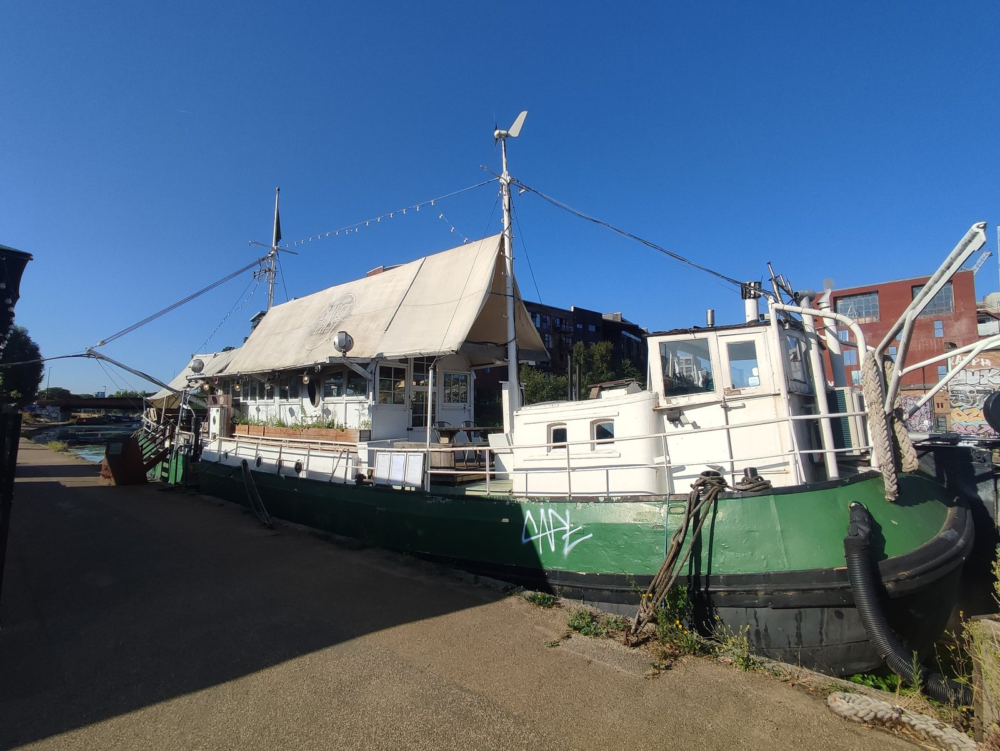

London has plenty of restaurants with a nice view and a good designer. This is not a guide to those. Everything here is somewhere the **premises are genuinely strange** — a tent, a boat, a lavatory, a bank vault, a courthouse nobody repaired.

The test we applied: a rooftop with a good view is not unusual in London, because London has hundreds. A restaurant in a yurt is.

> 💡 **The Short Version:** **The Yurt Café** is a working café inside a Mongolian yurt. **Feng Shang Princess** is a floating pagoda on the canal. **The Attendant** is a Victorian public lavatory with the urinals as the counter. **Rochelle Canteen** has no sign and a buzzer. **Redemption Roasters** roasts its coffee inside prisons. And **The Crosse Keys** is a Wetherspoons in a 1913 banking hall.

> 📘 **How we choose these (editorial note)**
> No paid placements. These are drawn from a wide spread of sources rather than any single list - the food and travel press, the big listings sites, independent blogs and specialists, video, and what Londoners recommend themselves - and cross-referenced against each other. The bar is that the building or the proposition is strange, not that the design is good — which is why Aqua Shard, the OXO Tower and several rooftops were considered and left off. A view is a view.

## Where they are

  

    Map of the unusual restaurants in London
  

  

    
Loading the interactive map…

  

  

    <i class="restaurant-map-key restaurant-map-key--editorial" aria-hidden="true"></i> Recommended in this guide
    <i class="restaurant-map-key restaurant-map-key--streetfood" aria-hidden="true"></i> Market stall & counter
  

  <noscript>
    
The interactive map requires JavaScript. Every entry below lists its area.

  </noscript>

| If you are near… | Where to eat |
| --- | --- |
| **Soho & Mayfair** | Bob Bob Ricard, Sketch |
| **Fitzrovia** | The Attendant |
| **The City** | Ye Olde Cheshire Cheese, Duck & Waffle, Darwin Brasserie, SUSHISAMBA, The Crosse Keys |
| **Shoreditch & Hackney** | Rochelle Canteen, Barge East, Campania & Jones, Planque |
| **King's Cross & Clerkenwell** | Coal Office, Sessions Arts Club |
| **Paddington & Regent's Park** | The Cheese Barge, Feng Shang Princess |
| **Wapping & Limehouse** | The Captain Kidd, The Yurt Café |
| **Elsewhere** | Kinz (Notting Hill), Redemption Roasters (Bloomsbury), The Ledger Building (Canary Wharf) |

**Price guide:** **£** under £15 · **££** £15–£35 · **£££** £40–£70 · **££££** £80+.

---

## Not buildings at all

### The Yurt Café, Limehouse

*£ · St Katharine's Precinct, 2 Butcher Row*

A working café **inside an actual Mongolian yurt**, in the grounds of a Limehouse charity that has been on the site since 1950. Full English, focaccias and Mission Coffee Works espresso, served under a felt roof.

Run as a social enterprise — profits go to the Royal Foundation of St Katharine's community work. Daytime service plus evenings Monday to Saturday with live music on Thursdays.

> ⚠️ Not to be confused with St Katharine Docks by Tower Bridge. This is St Katharine's **Precinct**, a mile and a half east.

### Feng Shang Princess, Regent's Park

*£££ · Cumberland Basin, Prince Albert Road*

A **three-tiered Chinese pagoda**, painted red and hung with lanterns, moored on the Regent's Canal. Hand-built in the 1980s as the first floating restaurant of its kind in London, ten minutes from London Zoo.

The boat is the reason to book rather than the kitchen — reviews of the food are mixed and we would rather say so.

### The Cheese Barge, Paddington

*£££ · Paddington Basin*

A **96-foot double-decker barge** on the canal, serving British cheese in small plates. Genuinely eating on the water rather than beside it.

### Barge East, Hackney Wick

*£££ · the River Lea*

A **125-year-old Dutch barge** sailed over from the Netherlands and permanently moored, with a garden alongside and the Olympic Park skyline behind it.

*A hundred-year-old Dutch barge dragged from Holland and moored on the Lea. The garden alongside it does most of the covers in summer. Photo: [Ewan-M](https://commons.wikimedia.org/w/index.php?curid=174581442), [CC BY-SA 4.0](https://creativecommons.org/licenses/by-sa/4.0/).*

---

## Buildings that used to be something else

### The Attendant, Fitzrovia

*£ · 7 min from Goodge Street*

Built inside a **restored Victorian public lavatory**, with the original porcelain urinals turned into the counter you sit at. Coffee and brunch.

### Rochelle Canteen, Shoreditch

*£££ · no sign*

Hidden behind a wall in a **former school bike shed**, with no signage at all — you ring a buzzer marked 'canteen' and walk through a gate. The hardest room in London to find on purpose.

### Sessions Arts Club, Clerkenwell

*££££ · the judges' dining room*

Not just a former courthouse — the **old judges' dining room** inside Sessions House on Clerkenwell Green, a **Grade II\*** listed building. Left deliberately unrestored: peeling plaster, enormous windows, no attempt to tidy any of it.

### Coal Office, King's Cross

*££££ · Coal Drops Yard*

Assaf Granit's kitchen in a converted **coal office**, built around an open grill in a room designed by Tom Dixon.

### Campania & Jones, Bethnal Green

*£££ · a converted dairy*

Campanian cooking in a converted dairy near Columbia Road, with pasta made by hand every day.

### Kinz, Notting Hill

*£££ · a 1930s bank*

A **1930s Lloyds Bank** on Notting Hill Gate turned Lebanese brasserie — triple-height ground floor, deli at the back.

### The Captain Kidd, Wapping

*££ · a warehouse as a ship*

A converted warehouse **laid out like a ship's hull**, named for the pirate hanged a few yards away.

---

## Extraordinary rooms, ordinary prices

### The Crosse Keys, City of London

*£ · 9 Gracechurch Street*

The former **HSBC headquarters**, opened 1913 — marble columns, a glass-domed ceiling, a banking hall the length of the room. It is a Wetherspoons.

### Hamilton Hall, Liverpool Street

*£ · the station concourse*

The former **ballroom of the Great Eastern Hotel**, Grade II listed, gilding intact. Also a Wetherspoons.

### Ye Olde Cheshire Cheese, City of London

*££ · rebuilt 1667*

A warren of dark panelled rooms and cellars down a Fleet Street alley, rebuilt immediately after the Great Fire.

---

## Unusual propositions rather than unusual rooms

### Redemption Roasters, Bloomsbury

*£ · coffee roasted in prisons*

The beans are **roasted inside prisons** by people the company then trains and employs on release — a coffee chain built entirely around reducing reoffending.

### Bob Bob Ricard, Soho

*££££ · Press for Champagne*

Booth-only, art deco throughout, and a **Press for Champagne button** at every table. The gimmick that launched a thousand imitations, and it still works.

### Sketch, Mayfair

*££££ · an art installation*

Afternoon tea **inside an art installation** — the pink Gallery room and the egg-shaped lavatories are as photographed as the food.

### Planque, Haggerston

*£££ · a members' cellar*

Built around a members' wine cellar you can drink from. The food follows the bottle rather than the other way round.

### Hunan, Pimlico

*££££ · no menu*

You say what you dislike and dishes keep arriving until you stop them. Hunanese cooking, and one of the most unusual ways to eat in London at any price.

---

## High up

Included only where the room does something a view alone does not.

### Darwin Brasserie, City of London

*£££ · inside the Sky Garden dome*

Inside the **Sky Garden's glass dome** at the top of the Walkie Talkie, surrounded by planting rather than just glass.

### SUSHISAMBA, City of London

*££££ · 39th floor*

An **orange tree growing through an open-air terrace** on the 39th floor — the highest outdoor dining in the City.

### Duck & Waffle, City of London

*££££ · open 24 hours*

Forty floors up and **open around the clock** — the only place in London where you can watch the sun come up over the City with a plate in front of you.

---

## What to know

* **Several of these are small.** Rochelle Canteen, The Attendant and The Yurt Café all fill quickly and some take no bookings.
* **The Yurt Café's yurt is at the end of its life.** The charity is running an **£80,000 appeal for a replacement, closing 30 September 2026**, and had raised roughly a third of it by late August. The café is open and the appeal is about the structure rather than the business, but check before making a special trip for it.
* **Feng Shang Princess is about the boat.** Go for the pagoda, not the cooking.
* **Duck & Waffle is genuinely 24 hours**, which makes it the answer to a very specific question.
* **Bob Bob Ricard's button** works and there is no minimum spend attached to pressing it.

Powered by <a target="_blank" rel="sponsored" href="https://www.getyourguide.com/london-l57/">GetYourGuide</a>

---

## Continue planning your London trip

- 🏛️ **[Historic Pubs and Dining Rooms in London](/articles/historic-pubs-dining-rooms-london/)**
- 💷 **[Cheap Eats in London](/articles/cheap-eats-london/)**
- 🍽️ **[Eat in London: Restaurants, Food Markets & Quick Food Hub](/articles/eat-in-london-guide/)**
- 🫖 **[The Best Afternoon Tea in London](/articles/best-afternoon-tea-london/)**
- 🎨 **[Shoreditch Area Guide](/articles/shoreditch-area-guide/)**
- 🏙️ **[City of London Area Guide](/articles/city-of-london-area-guide/)**
