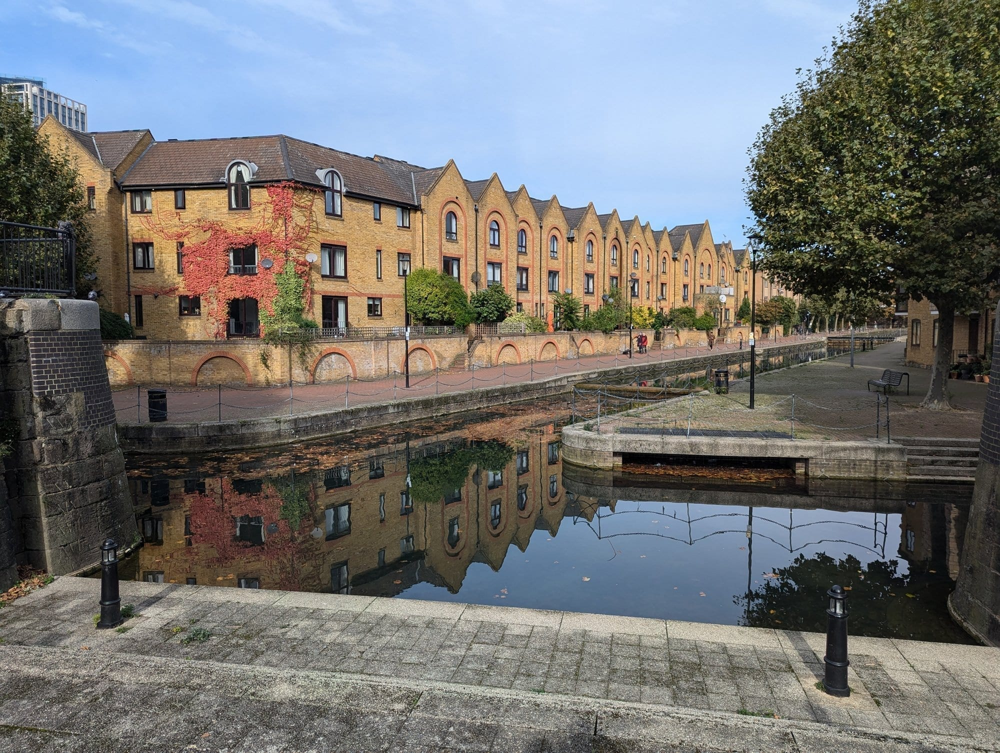
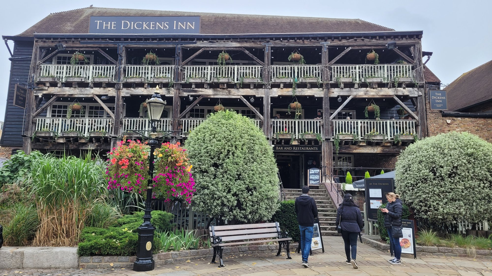

Wapping is a narrow strip between the Thames and the old dock walls, and for two centuries it was the roughest part of maritime London — sailors, press gangs and the Admiralty's own gallows on the foreshore.

The warehouses that replaced all that were converted into flats in the 1980s, and what is left is a cobbled, quiet, remarkably intact piece of riverside London with three very old pubs in it.

Wapping has its own share of the commemorative plaques marking where notable people lived or worked - see them on our [interactive map](/plaques/?area=wapping).

## Why visit — and who should skip it

**Come here if** you like old pubs and river walks. Wapping has the best concentration of genuinely historic riverside pubs in London, all with terraces over the water, and you can walk the whole area in an hour.

**Skip it if** you want things to do. There is no museum, no gallery and no market. Wapping is a walk and a pub, and it is best combined with the Tower or Bermondsey rather than visited alone.

## Top sights and activities

1. **The Prospect of Whitby** — Wapping Wall. A site claimed since 1520, with a pewter bar, flagstone floor and a replica gallows over the river commemorating Execution Dock.
2. **The Town of Ramsgate** — Wapping High Street, beside Wapping Old Stairs. A narrow, dark pub with a small river terrace and its own claim to the 1500s.
3. **Execution Dock** — On the foreshore near the Town of Ramsgate. Pirates were hanged here until 1830 with a shortened rope; Captain Kidd died here in 1701. There is no monument, only the replica noose along the river.
4. **Wapping High Street** — Barely a street: a cobbled canyon of converted warehouses with their original hoist beams and bridges still in place.
5. **St Katharine Docks** — Fifteen minutes west. A working marina beside the Tower, with yachts, a lock and a run of restaurants.
6. **Spirit Quay** — A terrace of gabled brick townhouses built around a still dock basin off East Smithfield, perfectly reflected in the water on a calm day. Residential rather than a sight with an entrance, but worth the two-minute detour from St Katharine Docks.
7. **Brunel's Thames Tunnel** — The first tunnel ever built under a navigable river, completed 1843. It now carries Overground trains between Wapping and Rotherhithe. The **Brunel Museum** on the far side opens the original shaft.
8. **Wapping Rose Garden and the Thames Path** — Small riverside gardens with clear views across to Rotherhithe and downstream to Canary Wharf.

*The Prospect of Whitby, claiming a licence back to 1520. The terrace over the water is the reason to come. Photo: [Christine Matthews](https://commons.wikimedia.org/w/index.php?curid=174127501), [CC BY-SA 2.0](https://creativecommons.org/licenses/by-sa/2.0/).*

*Spirit Quay, just off St Katharine Docks. No entrance and no ticket — just a quiet dock worth the short detour.*

*The quayside at St Katharine Docks, fifteen minutes west. The dock is free to walk round and the restaurants line one side of it.*

## Key streets and micro-districts

### Wapping High Street
The spine. Cobbles, warehouse conversions, hoist beams and the Town of Ramsgate.

### Wapping Wall
East. The Prospect of Whitby, the old hydraulic pumping station and Shadwell Basin.

### St Katharine Docks
West, beside the Tower. The marina, the lock and the restaurants around it.

*The Dickens Inn — an early-1700s warehouse moved bodily across the dock and opened as a pub in 1976 by Charles Dickens's great-grandson.*

### Shadwell Basin
North-east. A surviving dock basin, now used for watersports, ringed by red-brick housing.

### Tobacco Dock
North. A restored 1811 warehouse, now an events venue, with two replica sailing ships outside.

Powered by <a target="_blank" rel="sponsored" href="https://www.getyourguide.com/london-l57/">GetYourGuide</a>

## Where to eat and drink

| Spot | Style | Price | Why go |
| --- | --- | --- | --- |
| **The Prospect of Whitby** | Historic pub | ££ | The oldest claim in London, with a river terrace |
| **The Town of Ramsgate** | Historic pub | ££ | Narrow, dark and right beside Execution Dock |
| **The Captain Kidd** | Riverside pub | ££ | A converted warehouse with the best beer garden on this stretch |
| **Smith's of Wapping** | Seafood | £££ | A first-floor dining room with the river filling the windows |
| **St Katharine Docks** | Mixed | ££ | Marina-side restaurants, the reliable option for a meal |
| **Turner's Old Star** | Backstreet pub | £ | Named for the painter, who reportedly kept it for his mistress |

## Getting there

**By Overground.** **Wapping** station is the only one in the area, on the East London line through Brunel's tunnel. Two stops from Shoreditch High Street, one from Rotherhithe.

**On foot.** The best approach: walk east from **Tower Hill** along the Thames Path through **St Katharine Docks**, about 25 minutes.

**By DLR.** **Shadwell** is ten minutes north and connects to Bank and Canary Wharf.

**Note:** Wapping station has no step-free access. Shadwell or a walk from Tower Hill are the alternatives.

## How long to spend, and when to go

| If you have | Do this |
| --- | --- |
| **One hour** | Wapping High Street and one riverside pub |
| **Two to three hours** | The full walk from Tower Hill through St Katharine Docks to Wapping Wall |
| **Half a day** | Continue east along the river towards Limehouse and Canary Wharf |

**Best time:** A sunny afternoon, for the pub terraces over the water. Low tide exposes the foreshore at Wapping Old Stairs, which is when the Execution Dock site makes most sense.

**Note:** Wapping is genuinely quiet. Some pubs shut earlier here than elsewhere in London — check before a late evening.

## Suggested two-hour route

1. **Start:** Tower Hill station. East along the river into **St Katharine Docks**.
2. **Wapping High Street:** Continue east into the warehouse canyon.
3. **Town of Ramsgate:** Stop at **Wapping Old Stairs** for the Execution Dock foreshore.
4. **Wapping Wall:** East to **The Prospect of Whitby** and its river terrace.
5. **Shadwell Basin:** North for the surviving dock and the red-brick terraces.
6. **Finish:** Wapping Overground, or keep walking east towards Limehouse.

## Common mistakes to avoid

1. **Expecting a monument at Execution Dock.** There is none — just the foreshore and a replica noose at the Prospect of Whitby.
2. **Trying to walk through the Thames Tunnel.** It carries trains. The Brunel Museum at Rotherhithe is the way to see it.
3. **Coming for a full day.** Two to three hours is right. Pair it with the Tower or Bermondsey.
4. **Assuming Wapping station is step-free.** It is not. Use Shadwell or walk from Tower Hill.
5. **Arriving at high tide for the foreshore.** Wapping Old Stairs is only interesting when the tide is out.
6. **Missing St Katharine Docks.** It is on the way from the Tower and is the prettiest part of the walk.

Powered by <a target="_blank" rel="sponsored" href="https://www.getyourguide.com/london-l57/">GetYourGuide</a>

## Where to stay

Very quiet, riverside, and cheaper than the City across the water — but with limited transport and little open at night.

- **Wapping and Shadwell** — Warehouse conversions and serviced flats. Overground and DLR.
- **St Katharine Docks and Tower Hill** — Larger hotels beside the Tower, better connected.
- **Canary Wharf** — Twenty minutes east, with the Elizabeth line into central London.
