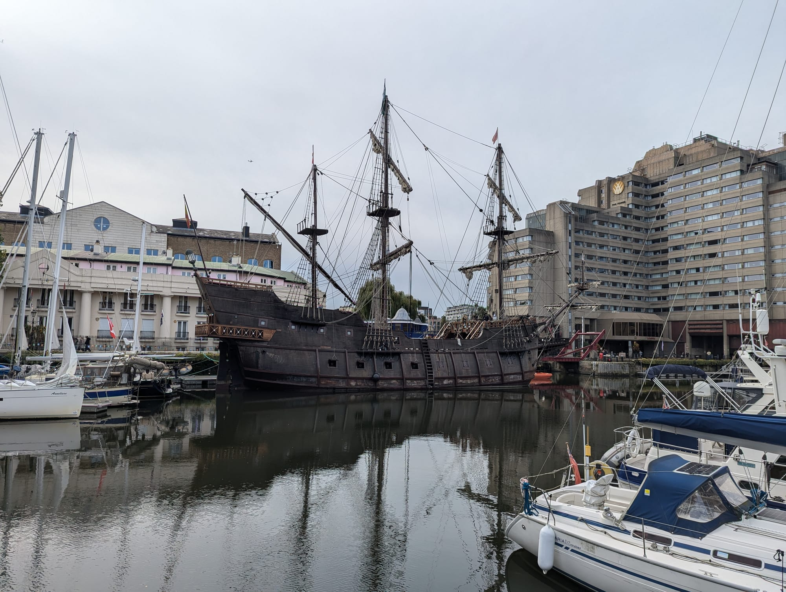
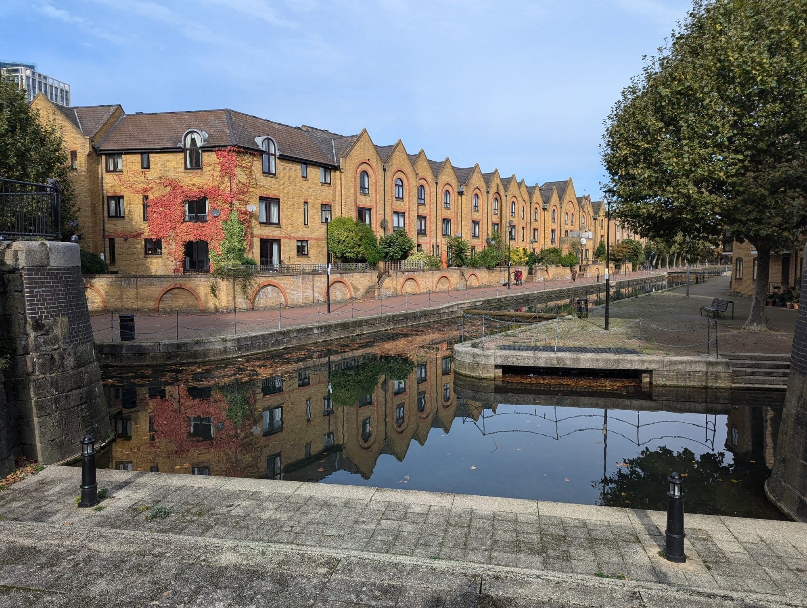
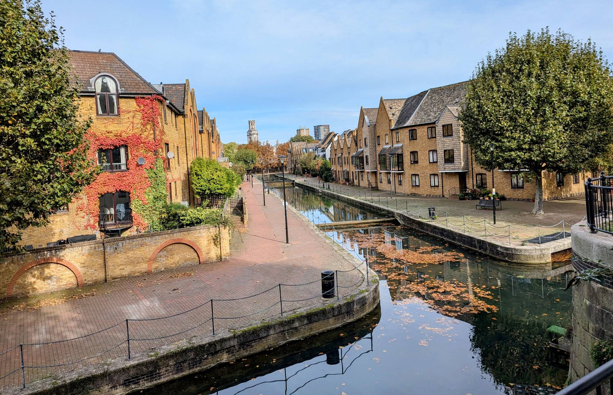
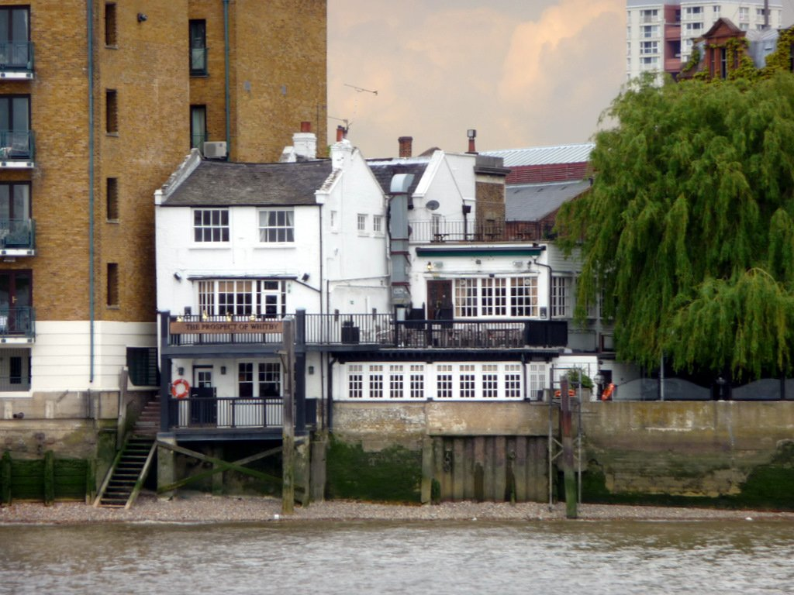
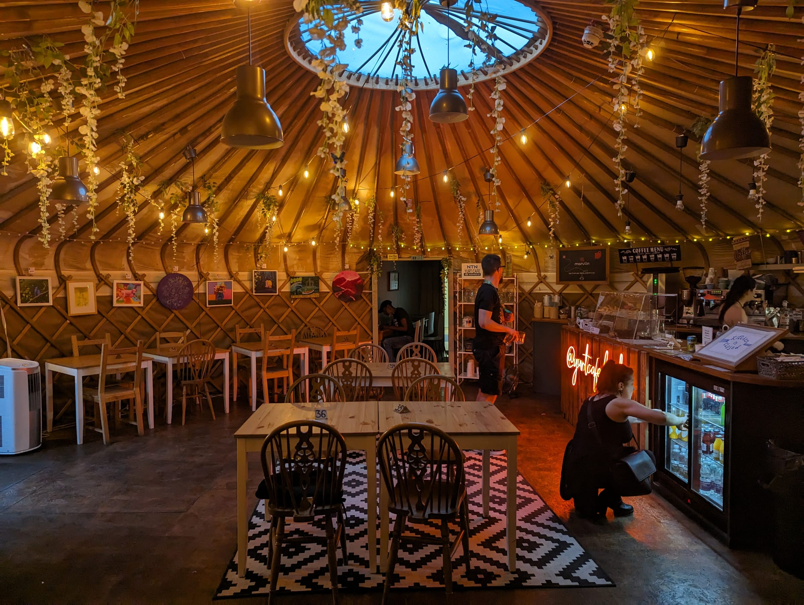
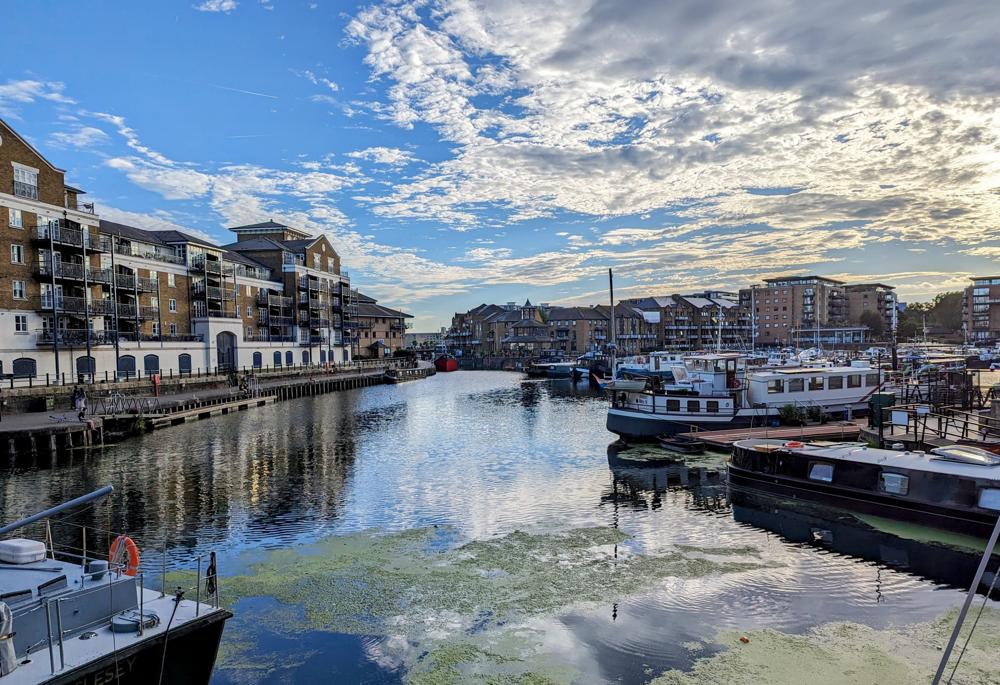
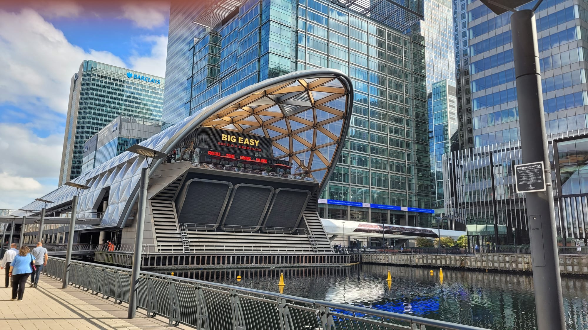

Most people get from Wapping to Canary Wharf on the DLR, and those who walk usually follow the Thames Path signs, which spend long stretches between blocks of flats with the river somewhere behind them.

**This route uses the water the docks left behind instead.** It starts at St Katharine Docks, follows the Ornamental Canal through the middle of Wapping, comes out on the river at Shadwell, where Tideway has just opened a new riverside park, and finishes along Narrow Street and into Canary Wharf. It is **just under 6km and takes three to four hours** with stops. None of it costs anything.

For the rest of both areas, see the [Wapping area guide](/articles/wapping-area-guide/) and the [Canary Wharf area guide](/articles/canary-wharf-area-guide/).

> 💡 **The Short Version:** Walk it on a **Saturday**, because **Wapping Docklands Market** at stop five runs that day only, 10am to 5pm. The best-kept secret is the **Ornamental Canal**, a quiet towpath through the middle of Wapping. The newest thing on the route is Tideway's **King Edward Memorial Park Foreshore**, open since the end of July 2026. **The Narrow is now Bread Street Kitchen & Bar**, and **The Grapes** takes no bookings.

## The route

  

    Map of the walk, numbered in walking order
  

  

    
Loading the map…

  

  

    <i class="route-map-marker" aria-hidden="true">1</i> On the route, in walking order
  

  <noscript>
    
The map needs JavaScript. Every stop below is numbered in walking order with its nearest station.

  </noscript>

**[Open the whole route in Google Maps →](https://www.google.com/maps/dir/?api=1&origin=51.507128,-0.069687&destination=51.506102,-0.017603&waypoints=51.505955,-0.063321%7C51.507507,-0.0595%7C51.508025,-0.056244%7C51.507965,-0.051713%7C51.507071,-0.051074%7C51.50835,-0.048%7C51.511594,-0.041488%7C51.5105,-0.0368%7C51.508835,-0.033975&travelmode=walking)** — all eleven stops in walking order, set to walking directions, which is the version to put on your phone.

| # | Stop | Cost | Open |
| --- | --- | --- | --- |
| **1** | St Katharine Docks | Free | Always |
| **2** | Spirit Quay | Free | Always |
| **3** | Tobacco Dock | Free to look | Outside only, except during public events |
| **4** | Ornamental Canal & Wapping Woods | Free | Always |
| **5** | Wapping Docklands Market | Free to browse | **Saturdays only**, 10am–5pm |
| **6** | The Prospect of Whitby | Pub | Daily from 11am, Sun from noon |
| **7** | King Edward Memorial Park Foreshore | Free | Always |
| **8** | The Yurt Café | £ | Breakfast to lunch; evenings Mon–Sat |
| **9** | Limehouse Basin | Free | Always |
| **10** | Narrow Street & Ropemakers Fields | Free | Pubs from noon daily |
| **11** | Canary Wharf | Free | Always |

---

## 1. St Katharine Docks

**A working marina two minutes from the Tower.** Thomas Telford built it in the 1820s; now it is yachts, a lock onto the Thames and a ring of restaurants.

It is free and never closes. Walk through the basins to the east side and leave by St Katharine's Way.

## 2. Spirit Quay

*The west end of the Ornamental Canal. On a still morning the whole terrace doubles in the water.*

**A row of gabled brick houses built in the 1980s along the filled-in London Docks**, facing a strip of still water where the docks used to be. It is where the canal starts, five minutes east of St Katharine Docks.

These are homes, not a sight, so there is nothing to enter. Keep to the towpath and follow the water north.

## 3. Tobacco Dock

**A Grade I listed warehouse built in 1812 for imported tobacco**, brick vaults below and a timber and iron roof above. It is now an events venue.

**You will see it from the outside.** It opens to the public only for public events, which it lists on its own site. The canal runs past its south side, so you lose nothing by not going in.

## 4. The Ornamental Canal and Wapping Woods

*Looking back towards Tobacco Dock, with Hawksmoor's St George in the East on the skyline.*

**The quietest fifteen minutes in east London.** The canal was laid out in the 1980s along the line of the London Docks, so it goes nowhere and exists only to be walked beside.

**Wapping Woods** runs alongside it: a wood planted on the filled-in dock, with paths through the trees and benches by the water. It is free, open at all times and almost always empty. The canal ends at **Shadwell Basin**, the last large piece of open dock water in Wapping.

Powered by <a target="_blank" rel="sponsored" href="https://www.getyourguide.com/london-l57/">GetYourGuide</a>

## 5. Wapping Docklands Market

Where the canal ends, on **Brussels Wharf** at the edge of Shadwell Basin.

**Saturdays only, 10am to 5pm.** Fresh produce, independent stalls, street food, drink and live music, with tables looking over the water. It is the reason to walk this route on a Saturday, and it comes at the right point for lunch.

## 6. The Prospect of Whitby

Across the red Glamis Road bridge from the market.

*Photo: [Christine Matthews](https://commons.wikimedia.org/w/index.php?curid=174127501), [CC BY-SA 2.0](https://creativecommons.org/licenses/by-sa/2.0/).*

**It claims a site dating to 1520, which would make it the oldest riverside pub in London.** Inside there is a flagstone floor and a pewter bar top; out the back, a terrace over the river and a replica gallows marking the executions that took place along this reach.

Open **11am to 11pm Monday to Saturday and noon to 10pm on Sunday**, with food from noon to 9pm every day.

## 7. King Edward Memorial Park Foreshore

**London's newest riverside space, opened by Tideway at the end of July 2026** on top of the super sewer works that replaced one of the river's worst sewage overflows.

It adds **2,600 square metres** to King Edward Memorial Park: terraces stepping down to the river, a long timber bench around the lowest one, planting and a wider Thames Path through the park. The views are south across the river, and six bronze boats by **Hew Locke**, a series called *Cargoes*, lead from the foreshore back into the park.

> ⚠️ **Part of it floods by design.** On higher tides the river overtops the wall onto the western end of the lower walkway. Tideway calls that the chance to dip your toes in the Thames; if you are here at high water, it means using the upper terrace.

## 8. The Yurt Café

**A café inside an actual Mongolian yurt**, in the grounds of the Royal Foundation of St Katharine on Butcher Row. The charity has been on the site since 1950, opened the café in 2016 and runs it as a social enterprise.

It does breakfast, brunch and lunch: a full English, focaccias, soups and Mission Coffee Works espresso. **From April it also opens in the evenings, 5 to 8pm, Monday to Saturday**: curry on Mondays, burgers on Tuesdays, pizza Wednesday to Saturday, and live music on the outdoor stage on Thursdays.

> ⚠️ **Not St Katharine Docks.** This is St Katharine's Precinct, the charity's site in Limehouse, a mile and a half east of stop 1.

## 9. Limehouse Basin

**Where the Regent's Canal reaches the Thames.** Once the busiest freight interchange in London, it is now a marina ringed with flats, with narrowboats and yachts side by side.

Walk the south side to the lock, where the basin drops to the river, and come out on Narrow Street.

## 10. Narrow Street and Ropemakers Fields

**The one stretch of old Limehouse street still standing on the river.** Three places to eat and drink, in walking order:

- **Bread Street Kitchen & Bar** at number 44, by the lock. This is the building that was **The Narrow**, and it now trades under the Gordon Ramsay brand. Open from 11.30am daily; it closes at 9pm Monday to Wednesday, 10pm Thursday to Saturday and **8pm on Sunday**.
- **La Figa** at 45, an Italian. Noon to 11pm on weekdays, from 1pm at weekends.
- **The Grapes** at 76, a narrow riverside pub. It opens **noon to 11pm Monday to Saturday and noon to 10.30pm on Sunday**, takes **no table reservations**, and has a heated deck over the river. Monday is quiz night, from 8pm.

**Ropemakers Fields** is the small park behind the Grapes, with play areas and tennis courts. Cut through it to leave Narrow Street for the last leg.

## 11. Into Canary Wharf

*Crossrail Place and the towers of Canary Wharf: the finish, and the first stop of the walk to Greenwich.*

About 1.5km: past Westferry Circus and along the dock edge to **Crossrail Place**, whose free roof garden sits on top of the Elizabeth line station.

It is also stop 1 of our **[Canary Wharf to Greenwich walk](/articles/canary-wharf-greenwich-walk/)**, which carries on south through the docks and under the Thames by the Greenwich Foot Tunnel. Walk both and you have gone from the Tower to the Prime Meridian.

---

## Where to eat

**Saturday: the market at stop 6.** Street food with seating over Shadwell Basin, at almost exactly halfway.

**Any other day:**

- **The Prospect of Whitby** (££) at stop 6. Food from noon to 9pm, seven days.
- **The Yurt Café** (£) at stop 8. The cheapest meal on the route.
- **Narrow Street** (££–£££) at stop 10. The Grapes for a pint on the river, Bread Street Kitchen & Bar for a proper meal, La Figa for pizza.

For more, the area guides cover both ends: [Wapping](/articles/wapping-area-guide/#where-to-eat-and-drink) and [Canary Wharf](/articles/canary-wharf-area-guide/#where-to-eat-and-drink).

## The best day to go

**Saturday.** The market only runs that day, and everything else is open too.

| Day | What you get |
| --- | --- |
| **Saturday** | Everything, including the market. The best day |
| **Mon–Fri** | Everything except the market. Quietest on the canal |
| **Sunday** | No market, and the Yurt's evening service is off. Narrow Street closes earliest |

**What closes:** **Wapping Docklands Market** runs on Saturdays only. The **Yurt Café's evening service** runs Monday to Saturday from April. **Bread Street Kitchen & Bar** shuts at 8pm on Sundays. **Tobacco Dock** is closed to the public except during public events.

**What does not care what day it is:** the docks, the canal, Wapping Woods, the new foreshore, Limehouse Basin, Ropemakers Fields and Canary Wharf, which make up most of the walk. The Prospect and the Grapes open every day.

**The case for a weekday:** the canal and the woods are quiet at weekends too, but on a weekday you will have the new foreshore almost to yourself, and you can get a table at the Grapes, which takes no bookings.

**On time of day:** start by 11am on a Saturday and you reach the market at lunchtime and Narrow Street mid-afternoon.

Powered by <a target="_blank" rel="sponsored" href="https://www.getyourguide.com/london-l57/">GetYourGuide</a>

## Getting there and back

**Start:** Tower Hill (District, Circle) or Tower Gateway (DLR), both about five minutes from St Katharine Docks.

**Finish:** Canary Wharf (Elizabeth line, Jubilee, DLR). The Elizabeth line is back in the City in about six minutes.

**Cutting it short:** Wapping (Overground) is a few minutes from stops 3 and 4; Shadwell (Overground, DLR) is north of stop 6; Limehouse (DLR, c2c) is by stops 8 and 9; Westferry (DLR) is on the last leg.

**Walked the other way**, it works just as well, but this direction finishes on the doorstep of the walk to Greenwich.

## What to do with the rest of the day

- **[Canary Wharf to Greenwich](/articles/canary-wharf-greenwich-walk/)**: eleven more stops, starting where this one ends.
- **[The Wapping area guide](/articles/wapping-area-guide/)**: Wapping High Street, the Town of Ramsgate and Execution Dock, which this route skips for the canal.
- **[The Canary Wharf area guide](/articles/canary-wharf-area-guide/)**: Eden Dock, the floating pool and Wood Wharf.
- **[Canal walks in London](/articles/best-canal-walks-london/)**: the Regent's Canal ends at stop 9, and you can walk it back to Little Venice.
- **[Walks along the Thames](/articles/london-walks-along-the-thames/)**: the river path the rest of the way.
- **[The South Bank walk](/articles/south-bank-walk/)**: Westminster to Tower Bridge, which ends five minutes from where this one starts.
