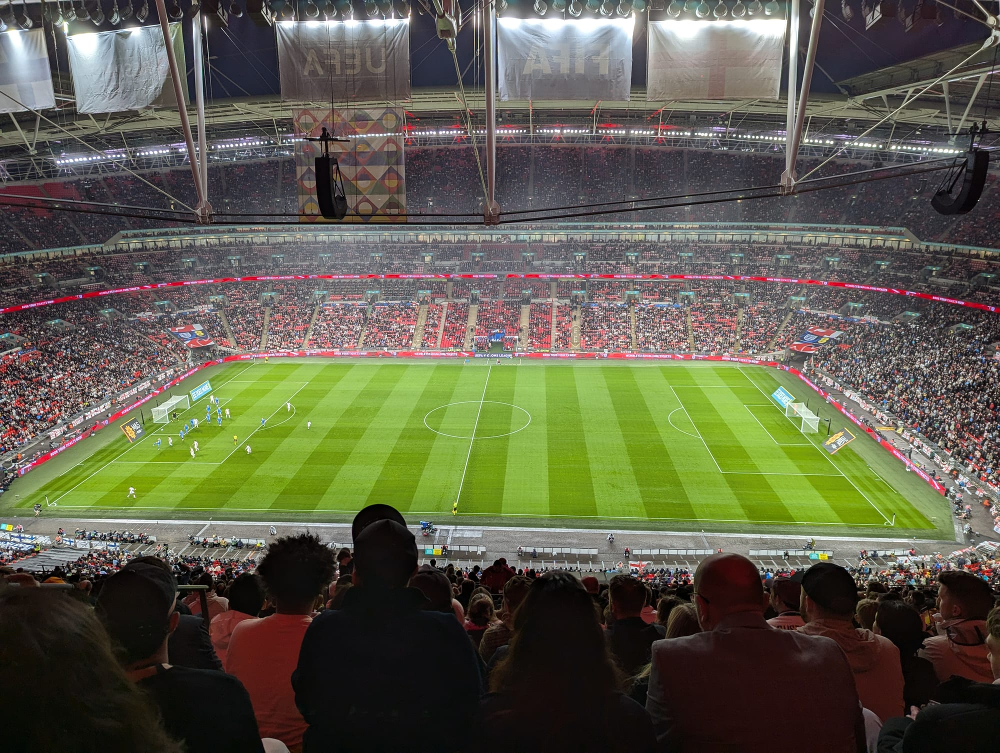
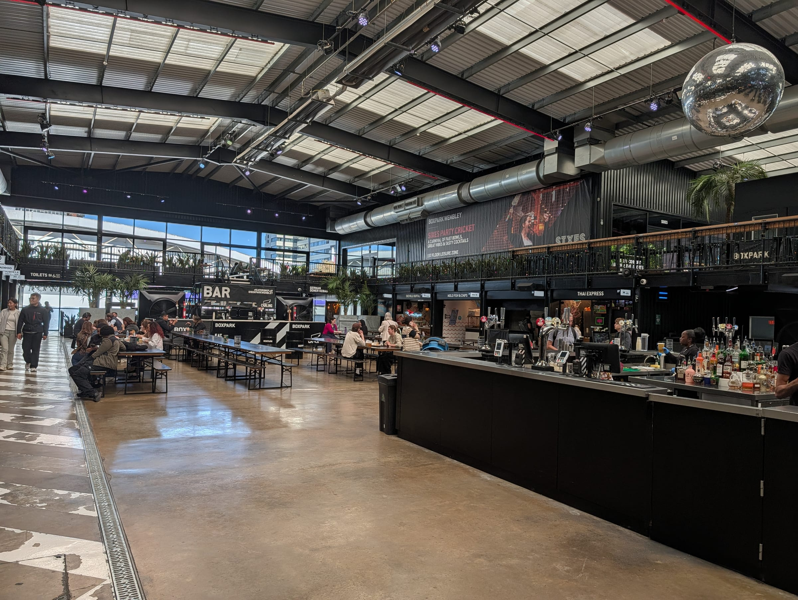
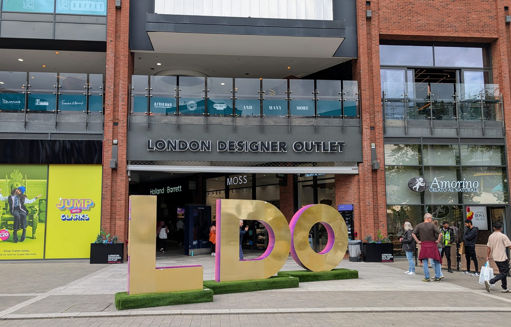

Wembley is easy to reach and easy to get wrong. Up to 90,000 people arrive through three suburban stations, the streets for up to two miles around are closed to visitors' cars from 8am, and the place you planned to eat may be ticketed and shut all day.

> 💡 **The Short Version:** Come by train — **Wembley Park** is ten minutes down Olympic Way and has **33 ticket gates**. If you drive, **do not park on the street**: Brent's event-day zone reaches **3.26km** from the ground, runs from **8am to midnight**, visitors **cannot buy a permit**, and the penalty is **£130**. Official parking is **£50 plus a £2.50 fee**. Cheaper: **park a stop out** in a car park — **Preston Road £10** all day, **Northwick Park £3** and free at weekends — but **not at Neasden or Stonebridge Park**. Going home on a **Friday or Saturday**, the **Jubilee Night Tube runs all night** and the car parks stay open until **03:00**. Any other night the last trains go around **midnight**. On a big night a Wembley hotel costs about **three times** a normal night; central London does not move.

---

## Getting there by train

| Station | Lines | Walk to the stadium | Best for |
| --- | --- | --- | --- |
| **Wembley Park** | **Jubilee, Metropolitan** | **10 minutes** down Olympic Way | Everything — the default, and the one for the arena |
| **Wembley Stadium** | **Chiltern**, from Marylebone | **5–10 minutes** across the White Horse Bridge | Seats in the **south and east** of the ground |
| **Wembley Central** | **Bakerloo**, Overground, Southern, LNR | **15–20 minutes** | The **west and south-west**, and anyone coming from Paddington, Euston, Watford or south London |

### Wembley Park: the one the stadium is designed around

Two stops from Baker Street on the Metropolitan, and on the Jubilee. You come out at the top of **Olympic Way** and walk straight down it to the Olympic Steps. It has **33 ticket gates across two ticket halls**, against 12 at Wembley Central and none at Wembley Stadium station, which is why it takes most of the crowd. It is also the station for the arena, Boxpark and the London Designer Outlet.

> ⚠️ **Lift works.** Until **autumn 2026** there is **no lift between the street and the ticket hall** on the Olympic Way side; step-free access is via the **Bridge Road entrance**. Lifts to the platforms are unaffected. The operators give different end dates for the work, so check TfL's station page on the day.

### Wembley Stadium station: an event station

One stop and about ten minutes from **Marylebone** on Chiltern. On event days it is staffed, with extra trains and colour-coded queues. Oyster and contactless work; it is Zone 4.

### Wembley Central: the long walk with the best connections

A **15 to 20 minute** walk (1.25km), or buses **18, 92 and 182**. It is on the **Bakerloo** and the **Overground** from Watford Junction to Euston, so from Paddington or Euston it can beat Wembley Park door to door. Step-free means street to platform only: there is a step up into the train on both lines.

### Buses and bikes

Routes **18, 83, 92, 182, 206, 223, 297 and 483** serve the area, and the **N18 and N83 run all night** — the fallback on a midweek night once the tube has stopped. Bikes can be parked in the **north-east corner of the stadium**, and there are 400+ cycle spaces across Wembley Park, with secure storage through the Spokesafe app.

---

## Driving: the zone that costs £130

Brent Council's **Wembley Stadium Event Day Protective Parking Scheme** is far bigger than anyone expects. Its furthest point is **3.26km from the stadium**, taking in Wembley Park, Wembley Central, Preston Road, Neasden, Stonebridge Park and Sudbury Town. On an event day **only residents and businesses with a permit may park on the street** — not even in a pay-and-display bay.

| | |
| --- | --- |
| **When** | **8am to midnight** on main roads; generally **10am to midnight** in residential streets |
| **Can a visitor buy a permit?** | **No** |
| **Penalty** | **£130**, halved if paid within 14 days |
| **Removal** | Possible **30 minutes** after a ticket is issued |

For a concert with 5pm doors, **road closures went in from 3pm and parking restrictions from 8am**.

The only legal way to park on a street in the zone is with one of a resident's **two paper visitor permits**; anything sold online is not a Brent permit. [Brent's CPZ map](https://www.brent.gov.uk/parking-roads-and-travel/parking/where-you-can-park/controlled-parking-zones/cpz-map) shows whether an address is inside the zone.

- **Private roads** inside the zone are outside Brent's enforcement, but the landowner can clamp or tow.
- **Pop-up car parks** are warned against by both venues.
- **Motorcycles** park free in bays, with no time limit, unless the bay is suspended.
- **ULEZ applies** at **£12.50 a day**, midnight to midnight, so a late exit can cost you two days. Wembley is outside the Congestion Charge zone.

---

## Where to actually park

### Official parking, at the ground

All event parking, Blue Badge included, is booked through **[Wembley Official Parking](https://www.wembleyofficialparking.com/)**. The car parks are barrierless: cameras read your plate and your confirmation has a QR code.

| | Stadium event | Arena event |
| --- | --- | --- |
| **Car** | **£50.00** | £22.50 |
| **Blue Badge / wheelchair** | **£25.00** | £18.50 |
| **Minibus or limo** | £75.00 | £40.00 |
| **Coach** | £120.00 | £40.00 |
| **Booking fee** | £2.50 car and Blue Badge, £1 motorbike, £3.50 minibus, £5 coach | as stadium |

Prices are set per event. Quintain advertises stadium parking from £40 and arena parking from £16.25, but expect £50 for a big stadium night.

| Car park | Postcode | Walk | Height limit | Takes |
| --- | --- | --- | --- | --- |
| **Blue** | HA9 0TU | **6 min** | 2.6m | Car, **Blue Badge**, wheelchair, EV (10 Pod Point bays, level 2) |
| **Pink** | HA9 0HX | 8 min | 2.10m | Car, minibus, **coach**, EV (levels 1–3) — **no Blue Badge bays** |
| **Red** | HA9 0FD | 9 min | 2.45m | Car, **motorbike** (level 2), **Blue Badge**, EV (6 bays, level 1) |
| **Gold** | — | 10 min | **2.00m** | Car, Blue Badge — the **Hilton's** car park, off Lakeside Way. No charging |

**Blue** has a bridge on level 3 straight onto the stadium concourse. **Red** is opposite the London Designer Outlet.

> ⚠️ **Book early.** Blue Badge and wheelchair bays can sell out **more than two weeks ahead**, and EV bays sell out too. Refunds are only for cancellations **more than 72 hours** before, and never cover the booking fee.

### Brent Civic Centre: the car park nobody mentions

A **council** car park on **Engineers Way, HA9 0FJ**, next to the arena and 370m from the stadium, booked separately from the official parking.

| Stay | Normal day | Stadium event day |
| --- | --- | --- |
| Up to 1 hour | £3 | **£3** |
| Up to 2 hours | £6 | **£6** |
| Up to 3 hours | £10 | **£10** |
| Whole day | £25 | **£50** |

The day rate matches the official £50, but **three hours is £10 even on an event day**, and **Blue Badge holders park free for three hours** in the designated bays.

### The London Designer Outlet's £40 loophole

LDO charges **£50 per car** on stadium event days and **£20** on arena days. Spend **more than £40** in its shops, restaurants or cinema that day and you pay the **normal tariff for the first six hours**, subject to space. Red car park only, not for pre-booked parking, and validate the ticket at the **Red Car Park Office** before you leave.

---

Powered by <a target="_blank" rel="sponsored" href="https://www.getyourguide.com/london-l57/">GetYourGuide</a>

## Park a stop out

Leave the car a stop or two down the line and take the tube in. It works **only in car parks**: the event-day zone bans street parking, not off-street parking.

| Station | Line | To Wembley Park | Car park | Event-day cost | Verdict |
| --- | --- | --- | --- | --- | --- |
| **Preston Road** | Metropolitan | **1 stop** | Brent, **164 bays** | **£10 all day** | **Best.** Brent opens an extra level for events. Not step-free, and it fills |
| **Northwick Park** | Metropolitan | 2 stops | Brent, 96 bays | **£3 all day — free evenings and weekends** | **Cheapest.** Outside the zone. 2m height limit, not step-free |
| **Kingsbury** | **Jubilee** | 3 stops | Brent, 48 bays | £7.50 all day, **free Sundays** | **Step-free**, and on the Night Tube. Only 48 spaces |
| **Harrow-on-the-Hill** | Metropolitan, Chiltern | 3–5 stops | **TfL, 113 spaces** | **£5** (£2 Sat and bank holidays, £1.50 Sun) | **Works.** Open 24 hours, 1.9m height limit, no Night Tube |
| **Neasden** | Jubilee | 2 stops | Brent, 38 bays | **Two-hour maximum** on event days | **Does not work** |
| **Stonebridge Park** | Bakerloo, Overground | — | **None** | — | **Does not work** |

Brent car parks take **RingGo** (Preston Road 5005, Northwick Park 5096, Kingsbury 5002) or cash, and **Blue Badge holders park free with no time limit**. Brent last updated these tariffs in March 2023, so check the machine.

### The safest version: the stadium's park-and-ride

Every car park on the stadium's own park-and-ride list is outside the event-day zone. The best are on the Jubilee:

| Station | Spaces | To Wembley Park |
| --- | --- | --- |
| **Stanmore** | **450** | **11 minutes** |
| **Canons Park** | 156 | 11 minutes |
| **Queensbury** | 73 | 11 minutes |

They are TfL car parks: **£5 a day, £2 on Saturdays and bank holidays, £1.50 on Sundays**, open 24 hours, with a **Night Tube** home on Fridays and Saturdays. Stanmore is the terminus, so you get a seat. The list also has Metropolitan line car parks further out, 20 to 35 minutes away.

---

## Getting home

### The queue windows

For a sell-out concert, TfL runs managed queues at:

| Station | Busy window | What changes |
| --- | --- | --- |
| **Wembley Park** | about **22:30–23:40** | **Bridge Road becomes exit-only.** Everyone enters via Olympic Way, including by lift |
| **Wembley Central** | about **22:40–23:30** | **The High Road entrance becomes exit-only.** Entry is via the London Road events entrance, which is not step-free |

At **Wembley Stadium station**, Chiltern sorts the crowd into colour-coded queues on the forecourt. **Blue is Marylebone only**; Pink, Yellow, Green and Orange are for stations towards Birmingham, Aylesbury, Oxford, Northolt and the Ruislips.

### The Night Tube changes the evening

On **Friday and Saturday nights the Jubilee line runs all night through Wembley Park, about every ten minutes** (the Metropolitan does not). You can skip the crush entirely: sit somewhere for two hours and walk onto a train at 1am.

### Last trains

| Night | Last Chiltern to Marylebone | Last tube from Wembley Park |
| --- | --- | --- |
| **Midweek concert night** | **00:06**, arriving Marylebone 00:17 | **00:32** to Baker Street, then nothing until 05:00 |
| **Saturday, 17:00 kick-off** | **23:44** | Night Tube — all night |
| Ordinary Thursday | 00:05 | — |
| Ordinary Sunday | 23:50 | — |

An event adds trains — fifteen Chiltern departures after 22:00 on a midweek concert night — but **not a later last train**. After a Saturday 17:00 kick-off the last train to Marylebone was **23:44**, earlier than on an ordinary Thursday. Weekend engineering can also cut Wembley Stadium station to a Marylebone-only shuttle: [Chiltern's Wembley events page](https://www.chilternrailways.co.uk/wembley-events-travel-information) has each event's timetable and queue colours.

### Car parks, taxis and coaches

**The official car parks stay open until 03:00 on event days**, so you can wait out the crowd before you move the car. The **event-day taxi rank** is on Engineers Way, inside the road closures. **National Express** runs direct coaches from over 50 UK locations, with a guaranteed seat home.

---

## Where to stay, and why Wembley is the trap on a match night

**Novotel London Wembley was £426.60 on the night of England v Czechia, Tuesday 6 October, and £131.40 on an ordinary Tuesday a week later.** On the match night there was one room type left. Novotel London Waterloo, on the Jubilee line direct to Wembley Park, barely moved:

| | Novotel Wembley | Novotel Waterloo |
| --- | --- | --- |
| **Event Tuesday, 6 Oct** | **£426.60**, one room type | **£300.60**, seven room types |
| Ordinary Tuesday, 13 Oct | **£131.40** | £315.90 |

*Accor member rates for one room, two adults, checked on 9 September 2026.*

**Wembley is the bargain on a normal night and the trap on an event night.** For England v Spain on Saturday 26 September the Novotel was sold out seventeen days before; the night after was **£91**.

- **For a big stadium fixture, book months ahead or stay central.**
- **Or stay the night after** and travel home the next day.
- **Luggage storage matters more than the room** — see [the bag problem](#the-bag-problem).

### The three hotels at the ground

**[Novotel London Wembley](hotel:novotel-london-wembley)** — 235 rooms at 5 Olympic Way, on the approach itself, with parking, a restaurant, a bar and a gym, two minutes from the arena. Check-in from 15:00, out by 12:00.

**[Hilton London Wembley](hotel:hilton-london-wembley)** — the four-star on Lakeside Way, with an indoor pool, an executive lounge and the rooftop **Sky Bar 9**. Parking is **£15 per 24 hours in the Gold car park** with **no in-out**, so you cannot take the car out and come back.

**[ibis London Wembley](hotel:ibis-london-wembley)** — the budget option, on South Way, a minute from Wembley Stadium station. Online prices are currently unavailable.

To stay central and travel out, our [guide to the best areas to stay in London](/articles/best-areas-to-stay-in-london/) covers the Jubilee line neighbourhoods.

---

## The hours before doors

*Ninety thousand people arrive over two hours and try to leave in twenty minutes.*

Everything here is a few minutes from both venues.

**The Wembley Park Art Trail** is free: 26 outdoor works across the estate, taking **30 minutes to an hour**. Start outside Wembley Park station; the free CityTrotter app guides you, and the route is step-free. The best:

- **The Bobby Moore Statue**, six metres of bronze in front of the stadium — the classic pre-match photo.
- **I'm Mr. Mercury**, a huge anamorphic Freddie Mercury on the Spanish Steps, beside the Taylor Swift tapestry that got them renamed the Swiftie Steps.
- **Shadow Wall** by Jason Bruges in the Royal Route Underpass, which mimics people walking past.
- **Flight**, a red kite mural above platform 1 at Wembley Stadium station, best seen from platform 2.

**The Square of Fame** on Arena Square has bronze handprints of performers who have played the arena, from Dolly Parton to Kylie — you stand on it while you queue.

**Brent Civic Centre** has Wembley Library and public toilets, the best wet-weather option.

> ⚠️ **No stadium tour on your match day.** The tour does not run on stadium event days, and in the days before it is cut down to an **Express Tour** without the player areas or dressing rooms. When it runs: **£28 adult, £19 child or concession, £75 family**, about 90 minutes, no cloakroom.

**PLAYBOX** in Boxpark is a glow-in-the-dark games room (18+ after 20:00), and **Sixes Social Cricket** has batting cages in the same building — both subject to Boxpark's event-day closures.

---

Powered by <a target="_blank" rel="sponsored" href="https://www.getyourguide.com/london-l57/">GetYourGuide</a>

## Eating and drinking, and the Boxpark trap

*On stadium event days Boxpark often becomes a ticketed Fanpark, closed to everyone else all day.*

**Boxpark Wembley often closes to the public on stadium event days**, becoming a ticketed **Fanpark** all day, not just in the evening. "We'll eat at Boxpark first" is the plan almost everyone makes, and it fails on the day you are going. Closures are listed only a few dates ahead, so **check [Boxpark's closures page](https://www.boxpark.co.uk/venues/wembley/blog/closures) against your event date.**

When it is open: **09:00 to 23:00 daily**, more than twenty kitchens — Zia Lucia, The Athenian, Neat Burger, Molo Fish & Chips and others — and a sports bar. The 17:00–20:00 weekday happy hour does not apply on Fanpark, arena or televised England nights.

*The London Designer Outlet, ten minutes from Wembley Park station: over 70 stores, plus Las Iguanas, JRC Global Buffet, Frankie & Benny's, Afrikana and Big Moe's Diner.*

### The London Designer Outlet keeps normal hours

**LDO opens as normal on event days.** The restaurants keep their own, later hours.

| Day | Centre hours |
| --- | --- |
| Monday, Tuesday, Wednesday | 10:00–20:00 |
| Thursday, Friday, Saturday | 10:00–21:00 |
| Sunday | 11:00–19:00 |

On Sundays, **Skechers, Next and M&S open 11:00–17:00**, and **Nike, Adidas, Tommy Hilfiger, Calvin Klein and Guess 12:00–18:00**.

### What is still open when you come out

A 19:45 kick-off finishes around 21:40; a concert curfew is usually 22:00 to 22:30.

| Friday or Saturday | Until |
| --- | --- |
| **Pizza Express** | **23:30** — the latest kitchen in LDO |
| Las Iguanas, Wagamama, Zizzi, You Me Sushi | 23:00 |
| TGI Fridays, Big Moe's Diner | 22:30 |
| **Boxpark** | 23:00 — **but only if it is not a Fanpark day** |

| Midweek | Until |
| --- | --- |
| **Las Iguanas** | **22:30** — the latest thing in LDO on a weekday |
| TGI Fridays, Nando's, Wagamama, Pizza Express, Zizzi, You Me Sushi | 22:00 |
| Big Moe's Diner | 21:45 |

> ⚠️ **On a midweek night, eat before, not after.** You reach the concourse at about 21:40 and most of LDO shuts at 22:00. Only Las Iguanas stays open later, until 22:30.

Also on the estate: **Bread Ahead**, **Pasta Remoli**, **Estadio Lounge**, **Five Guys** and **Choppaluna**. Check their own hours before relying on them after an event.

### Inside the arena

OVO Arena's kiosks do hot dogs, burgers, pizza and nachos, with bars for cocktails, wine and craft beer. It is **cashless, with no cash machines**, and there is **free water** on the concourses. You can bring sweets but no drinks or hot food, and you need photo ID for alcohol if you look under 25. Wembley Stadium is cashless too.

---

## Drinking on event days

**There is no blanket ban on shops selling alcohol on event days.** The Tesco Express, Sainsbury's Local and Co-op on the estate keep normal hours.

**But some shops will refuse you, because their licence says so.** Brent's [licensing policy](https://www.brent.gov.uk/-/media/files/business-documents/licencing/statement-of-licensing-policy---2025-2030.pdf?rev=18ceab9f9de6419badbee8d6ec57a872) sets event-day conditions for Wembley: "no sale of alcohol one hour before the event, and one hour after", no off-sales to anyone wearing "game day paraphernalia" (a team shirt, in other words), and no more than four cans a customer. They are written into individual licences, so one shop may serve you and the next may not.

> ⚠️ **You cannot drink it on the street.** A [Public Spaces Protection Order](https://www.brent.gov.uk/nuisance-crime-and-community-safety/public-spaces-protection-orders) covers Wembley Park, and the rest of Brent, at all times until January 2029. Officers can make you stop and hand over your alcohol, **sealed cans included**; refusing is a **£100 fixed penalty**, or up to £500 in court. A pub's own terrace or garden is exempt. Cans from the Tesco, drunk on Olympic Way, is the plan that gets your drink taken off you.

**Inside the stadium, it depends on the fixture.** At concerts, NFL and rugby league the bars serve as normal. At football nobody may drink in view of the pitch, and at competitive UEFA and FIFA games — including England's autumn 2026 Nations League matches against Spain, Czechia and Croatia — **alcohol is sold only in restaurants and hospitality, not on the level 1 and level 5 concourses**. You cannot bring any in: the only container allowed is one empty, clear plastic bottle of up to 500ml for the water points, and not in the pitch standing area at concerts. The arena has no readmission.

### Where to go for a drink

**On football days Brent allocates pubs to one set of fans or the other**, by the side of the stadium on your ticket, and pubs near the ground often admit only ticket holders for their team. The list changes each fixture and goes up on [Brent's event-days page](https://www.brent.gov.uk/parking-roads-and-travel/parking/wembley-event-day-parking/event-days). There are no allocations for concerts.

| Where | Walk to the stadium | What to know |
| --- | --- | --- |
| **The White Horse** (Fuller's), Arena Square | 5 min | Football: often one set of fans only, tickets checked at the door, **no alcohol from an hour before kick-off to 15 minutes after**, drinks in plastic, and the match is not shown. Concerts: no allocation and no cut-off |
| **Sky Bar 9**, ninth floor of the Hilton | 7 min | Rooftop bar, walk-in only. Normally open until midnight, 01:00 on Fridays and Saturdays, but hours can change on event days and the 2-for-1 cocktail hour is off |
| **Boxpark**, 18 Olympic Way | 9 min | A ticketed Fanpark on some event days, all day. 18+ after 20:00 with physical ID |
| **Feed the Yak**, 51 Olympic Way | 9 min | Craft-beer sports bar with 20 taps. Closed Mondays |
| **The Green Man**, Dagmar Avenue | 15 min | Pub and hotel at the top of Wembley Hill. Also sells event-day parking: £40 stadium, £20 arena, booked by phone |
| **The Torch** (Greene King), Bridge Road | 16 min | Beside Wembley Park station, handy if that is your way home |
| **J.J. Moon's** (Wetherspoon), High Road | 19 min | On the Wembley Central side |

---

## The bag problem

If your checkout is 12:00 and doors are at 18:30, you cannot carry a bag around with you.

| | Wembley Stadium | OVO Arena Wembley |
| --- | --- | --- |
| **Limit** | **One small bag per person, no bigger than A4** — 297mm × 210mm × 210mm | **30cm × 40cm × 20cm** — the stricter of the two figures its FAQ gives |
| **Storage on site** | — | **None. No cloakroom** |
| **Luggage** | — | **Refused entry** |

Bags over the stadium limit **will not be allowed in**, and folding a half-empty bag smaller does not count. A handbag is your one bag. The rules differ from the **NFL Clear Bag Policy**, so check before an NFL game. The arena points people to Stasher for storage nearby.

> 💡 **Use the hotel.** All three Wembley hotels offer luggage storage, which on an event day is worth more than the room.

---

Powered by <a target="_blank" rel="sponsored" href="https://www.getyourguide.com/london-l57/">GetYourGuide</a>

## Step-free access, Blue Badge parking and the shuttle

**Blue Badge parking at the ground is booked, not free**: **£25 plus a £2.50 fee** in the **Blue** and **Red** car parks for stadium events, £18.50 in Red for the arena. **Pink and Green have no Blue Badge bays.** They can sell out more than two weeks ahead, so book as soon as you have a ticket.

**Free Blue Badge parking:**

- **Brent Civic Centre**, Engineers Way HA9 0FJ — free for **three hours** in the designated bays.
- **All Brent Council car parks**, including Preston Road, Northwick Park and Kingsbury — free with **no time limit**.
- **Harrow Council** car parks and on-street bays — free with a Blue Badge.

**The free accessible shuttle** runs from **the lift entry at Wembley Park station, beside Olympic Way**, to Rutherford Way and Engineers Way, roughly **every 30 minutes**, from 30 minutes before gates open until an hour after the event. It takes up to ten people. There is also a pushing and chaperone service from the drop-off at every event, which cannot be booked.

**By station:** Wembley Park is step-free from street to train (see the lift works above); the Jubilee needs a boarding ramp, which staff at your starting station will arrange. Wembley Central is step-free to the platform only. Wembley Stadium station's step-free route between platforms goes via the street, and Chiltern needs two hours' notice for assistance.

**Inside the stadium:** four lifts from ground level to the concourse, lifts to every level, **147 accessible toilets** (RADAR key or ask a steward), wheelchairs to borrow, relief areas for assistance dogs by turnstiles B and M, and **free BSL interpretation at every concert**. Stadium access line **0800 093 0824**; arena accessible booking **020 8782 5629**.

---

## Small print that catches people out

- **Sat-nav:** use **HA9 0FA** for the stadium. Car parks: Red **HA9 0FD**, Pink **HA9 0HX**, Blue **HA9 0TU**, Brent Civic Centre **HA9 0FJ**.
- **Wrong plate on the booking?** You can change it up to an hour before the event (24 hours for a coach). Without a booking you pay the full daily rate.
- **Coaches** must be pre-booked and use Pink, with random security checks, **no alcohol on board** and **no hold luggage**. Coaches that fail are turned away without a refund.
- **No under-2s** are allowed inside the stadium.
- **The arena box office** opens on event days only, from an hour before doors, at the front right of the building on Arena Square.
- **The arena publishes doors and curfew, not stage times.**
- **Residents inside the event-day zone** can enter a ballot for free stadium tickets through Brent.

---

## Continue planning your London trip

- 🚇 **[How to Use the London Underground](/articles/how-to-use-the-london-underground/)**
- 💷 **[London Transport Costs and Fares](/articles/london-public-transport-costs-and-fares/)**
- 🛏️ **[Best Areas to Stay in London](/articles/best-areas-to-stay-in-london/)**
- 🎤 **[Best Live Music Venues in London](/articles/best-live-music-venues-london/)**
- 🚌 **[How to Use London Buses and Trams](/articles/how-to-use-london-buses-and-trams/)**
- 🎾 **[How to Get Wimbledon Tickets](/articles/wimbledon-tickets-guide/)**

---

*Figures come from the venues, TfL, Chiltern Railways, National Rail and Brent Council, checked the week of 9 September 2026. Hotel prices are samples from the operators' own booking engines and will move. Parking prices are set per event, so check the booking site for your date.*
