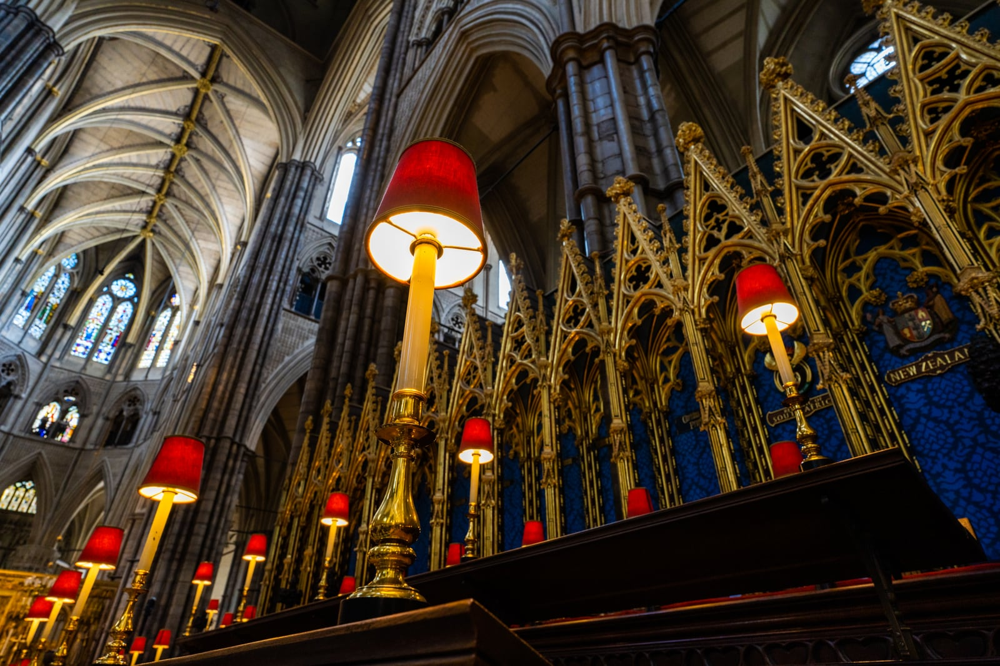
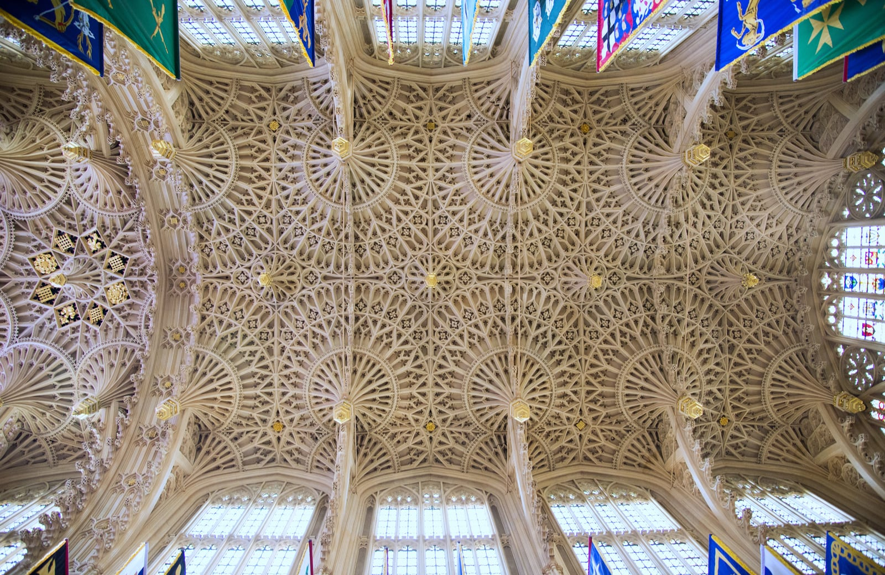
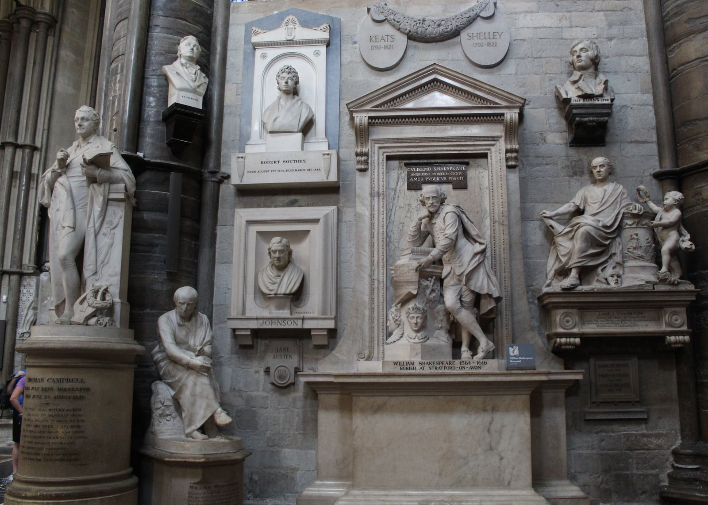
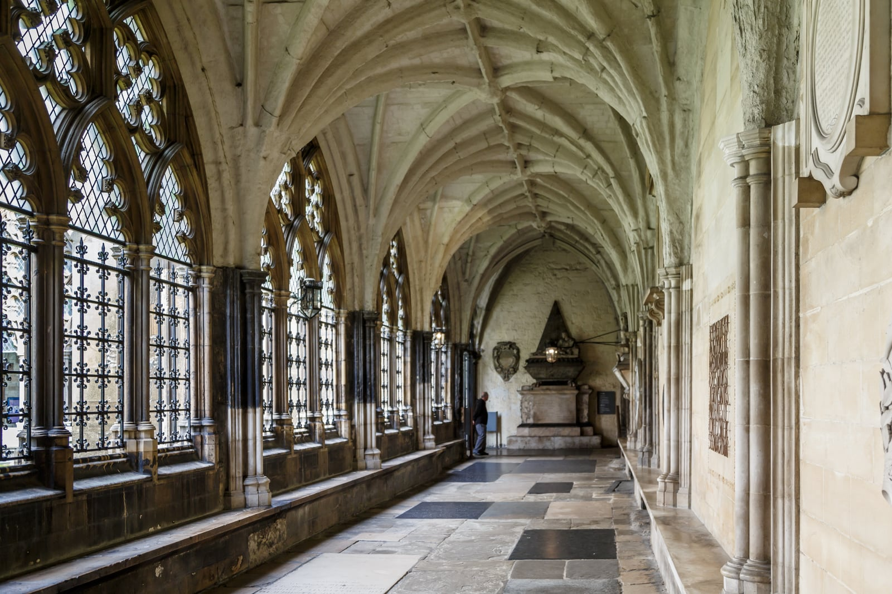

Westminster Abbey has served as the coronation church of the British monarchy since William the Conqueror in 1066, and holds the remains of 30 kings and queens. It's also a working church that closes to sightseers for services, so the ticket you need and the hours you can visit both depend on the day.

Prices and times below are read from the Abbey's own website, checked 19 September 2026.

> 💡 **The Short Version:**
> - **Arrive early.** Get there 15 minutes before opening — 09:15 for the 09:30 weekday start, 08:45 for the 09:00 Saturday start — and head straight to the **royal tombs and Henry VII Lady Chapel** before the ambulatory fills up.
> - **The verger tour** is the only way to reach the **Shrine of Edward the Confessor**. It costs the Abbey entry price plus **£10**, but you can only book it in person, on arrival, Monday to Saturday — not online or by phone.
> - **Choral Evensong is free**, no ticket needed. It's sung every day it runs: Monday to Friday at 17:00, Saturday and Sunday at 15:00. You sit in the Quire stalls, but touring the tombs before or after isn't permitted.
> - **The Abbey is closed to tourist sightseeing on Sundays** — it's open for worship only.
> - **Tickets and the London Pass.** Standard adult admission is **£31**, children (6–17) are **£14**, and concessions (65+ and students) are **£28**; under-6s go free. A government VAT reduction cuts those to £27.13 / £12.25 / £24.50 between 25 June and 1 September. Pre-book a <a href="https://www.getyourguide.com/activity/-t399163?partner_id=WWP7I0R&amp;cmp=westminster-abbey-guide" target="_blank" rel="sponsored nofollow noopener" data-affiliate="gyg">timed entry ticket on GetYourGuide</a>, or use **The London Pass**, which includes admission if you reserve a slot online.

---

## 2026 ticket prices and booking options

Westminster Abbey receives no government or Crown funding; by its own account it is "almost entirely dependent on visitor income for its survival."

| Ticket type | Adult (18–64) | Child (6–17) | Concession (65+ / student) | Notes |
| --- | ---: | ---: | ---: | --- |
| **Standard admission** | **£31.00** | **£14.00** | **£28.00** | Includes a handheld multimedia guide; under 6s go free. |
| **Family (1 adult + 1 child)** | **£31.00** | — | — | One ticket covers both; there's no larger family ticket. |
| **Great British Summer Savings** | **£27.13** | **£12.25** | **£24.50** | A government VAT cut the Abbey passed on, 25 June to 1 September 2026. |
| **Queen's Diamond Jubilee Galleries** | **£5.00** | **Free** | — | Under-18s go free; there's no separate concession rate. |
| **The London Pass** | **Included** | **Included** | — | Pre-book a timed entry slot online. |
| **Choral Evensong** | **Free** | **Free** | **Free** | Sung service; seated in the Quire; no touring access. |

### Other ways to visit

- **Highlights Tour:** on days the Abbey can't open in full, it runs a shorter tour instead, at £20 for adults and concessions, £8 for children 6–17 (under 6 free), and £20 for a family of one adult and one child. Tickets are sold on-site only.
- **National Rail 2-for-1:** buy one full-price adult ticket and get a second adult free, plus a free child (17 or under) with each adult, through National Rail's Days Out Guide. It's on-the-door only — pre-booked tickets aren't valid.
- **Free annual pass upgrade:** buy your ticket online through the Abbey's own website, then ask a Visitor Experience team member to upgrade it on arrival at no extra cost. It becomes a pass valid for three visits within a year. This doesn't apply to Highlights or Lates tickets, or to tickets bought through a third party.
- **£1 admission:** adults on Universal Credit, Pension Credit and several other means-tested benefits pay £1 (a £1 family ticket too), shown against proof of the benefit on arrival. It can't be booked online.

Pre-booking a timed entry slot online is recommended. Visitors buying on the day queue at the North Green kiosk for bag screening before entry.

You can reserve direct or book an official <a href="https://www.getyourguide.com/activity/-t399163?partner_id=WWP7I0R&amp;cmp=westminster-abbey-guide" target="_blank" rel="sponsored nofollow noopener" data-affiliate="gyg">timed entry ticket on GetYourGuide</a>, which locks in your preferred entry slot and includes full cancellation up to 24 hours in advance. Check live calendar availability below:

Powered by <a target="_blank" rel="sponsored" href="https://www.getyourguide.com/london-l57/">GetYourGuide</a>

---

## The walking route that avoids the crowds

The ground plan of Westminster Abbey is shaped like a Latin cross, with tourist entry passing through the **North Door** into the north transept. Most visitors immediately turn right down the central Nave, join the multimedia crowd looking at floor plaques, and only reach the royal tombs at the far east end an hour later—right as international tour groups arrive.

To experience the most congested sections without crowds, invert that order:

*The Quire stalls inside Westminster Abbey, showing the gilded Victorian stalls and high ribbed vaulting. Photo: Maksim Sokolov (CC BY-SA 4.0).*

### 1. 09:15 to 09:30: North Door entry and bag security
Arrive at the North Green gates 15 minutes before the stated opening time. Present your digital ticket barcode for scanning, pass through the bag check marquee, and collect your handheld multimedia guide inside the North Transept. 

If you want to take a **Verger Tour**, ask as soon as you arrive rather than heading off round the building — tours are first come, first served, run Monday to Saturday, and can't be booked ahead.

### 2. 09:35 to 10:15: Royal tombs and the Henry VII Lady Chapel
Walk straight past the crossing into the ambulatory encircling the High Altar. By reaching this eastern apse before 10:00, you will have uninterrupted space around the most architecturally intricate section of the building: the **Henry VII Lady Chapel**, consecrated in 1519.

*The fan-vaulted ceiling of the Henry VII Lady Chapel, completed in 1519. Photo: Jps3 (CC BY-SA 4.0).*

Key monuments in this section:
- **The Fan-Vaulted Ceiling:** Regarded as the climax of English Perpendicular Gothic masonry, featuring stone pendants hanging unsupported from ribbed tracery.
- **The Tomb of Elizabeth I and Mary I:** The half-sisters and bitter religious adversaries lie interred together in the north aisle beneath the inscription: *"Consorts in realm and tomb, here we sleep, Elizabeth and Mary, sisters, in hope of resurrection."*
- **Mary, Queen of Scots:** Resting in the south aisle beneath an elaborate white marble canopy commissioned by her son, James VI and I, deliberately constructed larger than Elizabeth's tomb across the aisle.
- **RAF Chapel:** At the far eastern end, featuring stained glass honouring the fighter squadrons of the 1940 Battle of Britain.

### 3. 10:15 to 10:45: The Quire, High Altar and the Cosmati Pavement
Move back towards the centre of the Abbey to inspect the theatre of coronation:
- **The Cosmati Pavement:** Located directly before the High Altar, this 1268 floor of marble, porphyry, and coloured glass was laid by Italian craftsmen for Henry III. It represents the universe and was uncovered for the 2023 Coronation of King Charles III.
- **The Coronation Chair:** Dating from 1300 and constructed by order of Edward I to enclose the Scottish Stone of Destiny (Stone of Scone), it stands protected behind glass in St George's Chapel near the Great West Door.

### 4. 10:45 to 11:15: Poets' Corner (South Transept)
Cross into the South Transept, known as **Poets' Corner**. Geoffrey Chaucer was the first writer buried here in 1400, not originally because of his poetry, but because he worked as Clerk of the King's Works in the Palace of Westminster.

*Poets' Corner in the South Transept, displaying memorials to Shakespeare, Keats, Shelley, and Burns. Photo: 14GTR (CC BY-SA 4.0).*

In the 16th and 18th centuries, the transept evolved into the national pantheon of English literature:
- **Burials:** Geoffrey Chaucer, Edmund Spenser, Charles Dickens, Alfred Lord Tennyson, Rudyard Kipling, and Thomas Hardy (his ashes; his heart was buried in his native Dorset).
- **Memorials:** William Shakespeare (standing pointing to a scroll from *The Tempest*), Jane Austen, the Brontë sisters, John Keats, Percy Bysshe Shelley, and George Eliot.

### 5. 11:15 to 11:45: The Nave and the Grave of the Unknown Warrior
Walk west down the soaring central nave. The Abbey's nave vaulting reaches 31 metres (102 feet), making it the highest Gothic vault in England.

Near the Great West Door sits the **Grave of the Unknown Warrior**, containing an unidentified British soldier brought from the battlefields of France in November 1920. It is the only floor tombstone in the entire building that nobody—not even visiting royalty—is permitted to walk upon. Beside it lie the memorial stones of Sir Isaac Newton, Charles Darwin, and Stephen Hawking.

### 6. 11:45 to 12:15: The Cloisters, Chapter House and Pyx Chamber
Most casual visitors exit through the gift shop and miss the monastic precinct entirely. Follow the signs leading through the south aisle into the **Great Cloisters**.

*The West Cloister of Westminster Abbey, dating to the 14th century. Photo: Uwe Aranas / CEphoto (CC BY-SA 3.0).*

- **The Chapter House:** Completed in 1250, this octagonal meeting chamber features 14th-century wall paintings of the Apocalypse and original medieval encaustic floor tiles. The House of Commons met here during the 14th century before relocating to St Stephen's Chapel.
- **Britain's Oldest Door:** In the vestibule of the Chapter House sits an oak door constructed from wood felled in an Anglo-Saxon forest between 1032 and 1065, predating the Norman Conquest.
- **The Pyx Chamber:** An 11th-century Norman vaulted undercroft that once served as the royal treasury and held the trial plates for verifying the purity of England's coinage.

---

Powered by <a target="_blank" rel="sponsored" href="https://www.getyourguide.com/london-l57/">GetYourGuide</a>

## The verger tour, and what it gets you

Standard general admission tickets do not grant access to the most sacred part of Westminster Abbey: **the Shrine of St Edward the Confessor**.

Located directly behind the High Altar on a raised earth mound, the shrine houses the golden tomb chest of the Anglo-Saxon king who founded the Abbey in 1065. Surrounded by the medieval tombs of Henry III, Edward I, Eleanor of Castile, and Henry V, the area is protected by heavy wooden screens and locked iron gates.

### Why book it
- **The only way in:** vergers hold the physical keys, and joining a verger tour is the only way general visitors can pass through the locked gate into the Confessor's chapel.
- **Small groups:** tours are capped at 20 people, a break from the crowded general aisles.
- **Commentary:** the tour covers history and architecture that the standard audio guide doesn't.

### How to book
1. A verger tour costs your Abbey admission price plus **£10** — there's no separate child or concession rate.
2. You can't book ahead, online or by phone. Sign up in person when you arrive; tours run Monday to Saturday. The Abbey's enquiry line, 020 7654 4832 (Monday to Friday, 9am to 5pm), can tell you what times are running but can't take a booking.
3. Arrive with the morning intake and ask as soon as you're inside. Tours are first come, first served, last around 90 minutes, and take up to 20 people.

---

## Choral Evensong, free to attend

You don't have to pay the £31 entrance fee to hear the Abbey's choir. Choral Evensong is sung every day it runs — Monday to Friday, and Saturday and Sunday — by the Choir of Westminster Abbey or, on Wednesdays, St Margaret's Choristers and Consort.

Evensong is free to attend, and open to people of all faiths and none.

### Evensong times
- **Monday to Friday:** 17:00
- **Saturday and Sunday:** 15:00

### How to attend
1. **Queuing:** enter via the **Great West Door** on Broad Sanctuary, not the tourist entrance at the North Door, and queue outside before the service — arrive earlier for popular dates such as bank holidays and Advent.
2. **Seating:** early arrivals are directed through the stone rood screen into the **Quire stalls** — the carved wooden seats occupied by the collegiate body and monarchs during state services. Late arrivals are seated in the open nave.
3. **What you can see:** the high Gothic nave, the organ, the choir screen, and the illuminated quire.
4. **What you cannot do:** Evensong is an act of religious worship, not a sightseeing tour. You cannot roam the church, visit the royal tombs, or enter Poets' Corner before or after the service. Security marshals escort the congregation out through the Great West Door at the end.
5. **Rules:** keep silent, and no photography or video during the service.

---

## Practical information and visitor policies

### Opening hours and the Sunday closure
- **Monday to Friday:** 09:30–15:30.
- **Saturday:** 09:00–16:00, last entry 15:00. As a working church, the Abbey sometimes closes earlier for weddings and other services — several Saturdays this autumn are ending as early as 13:00 — so check the Abbey's own [entry times calendar](https://www.westminster-abbey.org/visit-us/opening-times-and-prices/) for your date before you travel.
- **Sunday:** closed to tourist sightseeing. Open for worship only, at 08:00 (Holy Communion), 10:00 (Matins), 11:15 (Sung Eucharist) and 15:00 (Evensong).

### Nearest tube and rail stations
- **Westminster:** 4 minutes' walk (Jubilee, District and Circle lines).
- **St James's Park:** 6 minutes' walk (District and Circle lines).
- **Rail:** Charing Cross is the closest mainline station, 16 minutes' walk, followed by Waterloo (19 minutes) and Victoria (24 minutes). Charing Cross and Victoria both have left luggage facilities — see below.

### Bag policy and security checks
- **Size limit:** bags up to **40cm x 30cm x 20cm** are allowed. Suitcases, large rucksacks, and any bag or case with wheels — at any size — are not, whether you're entering the Abbey or just the precinct grounds.
- **No cloakroom:** there's no luggage storage or lockers on-site, and staff will turn away oversized or wheeled luggage at the gate.
- The nearest left luggage facilities are at **Charing Cross** and **Victoria** stations.

### Photography rules
- Personal photography is allowed in most of the Abbey. Flash, video recording, selfie sticks, tripods, monopods and drones are banned throughout, and photographing children needs a parent's consent.
- No photography before, during or immediately after a service — that includes Choral Evensong.
- Photography is banned at all times in the Shrine of St Edward the Confessor, St Faith's Chapel, and the Queen's Diamond Jubilee Galleries.

---

Powered by <a target="_blank" rel="sponsored" href="https://www.getyourguide.com/london-l57/">GetYourGuide</a>

## Common mistakes to avoid

1. **Turning up on a Sunday expecting tourist admission:** visitors turn up every Sunday morning with cameras, only to be told that sightseeing is closed and only worshippers attending services may enter.
2. **Missing the Cloisters and Chapter House:** the visitor route naturally directs people toward the shop exit in the South Transept. Look for the cloister archway; the Chapter House contains some of the oldest wall paintings and floor tiles in Britain.
3. **Skipping the verger tour if you want royal history:** it's the only way to the shrine of Edward the Confessor, the anchor the entire building was built around — and you can't book it ahead, only ask on arrival.
4. **Waiting until midday to visit:** coach tours and school groups fill the ambulatory through late morning and early afternoon, and the narrow passages around the royal tombs slow to a shuffle. Book the first slot of the morning, or aim for mid-afternoon instead.
5. **Paying for third-party audio guides:** your admission ticket already includes the handheld multimedia guide, available in multiple languages — there's no need to pay for a separate downloadable guide.

---

## Continue planning your London trip

- 🏛️ **[Tower of London Guide](/articles/tower-of-london-guide/)** — avoid the 90-minute Crown Jewels queue and see the Norman White Tower.
- 🗺️ **[Three Days in London Itinerary](/articles/three-days-in-london-itinerary/)** — how to combine Westminster Abbey with Whitehall, Covent Garden, and South Bank.
- 🎟️ **[The London Pass Guide](/articles/london-pass-guide/)** — an honest mathematical analysis of when the pass pays for itself and when it loses money.
- 💷 **[London on a Budget](/articles/london-on-a-budget/)** — free museums, off-peak transport fares, and cheap dining across Zone 1.
- 🚤 **[How to Use London River Boats](/articles/how-to-use-london-river-boats/)** — scenic boat travel from Westminster Millennium Pier to the Tower and Greenwich.
