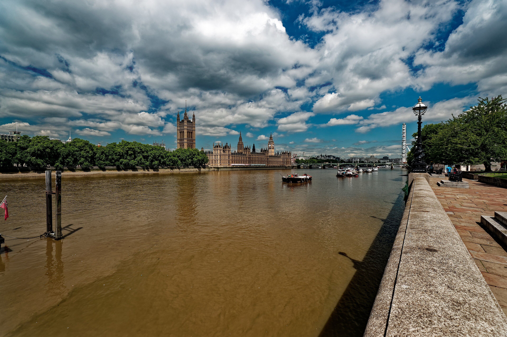

Westminster is the London of postcards: the Elizabeth Tower, the Palace of Westminster, the Abbey where every English monarch since 1066 has been crowned, and the long ceremonial run of Whitehall up to Trafalgar Square.

It is also the most concentrated sightseeing in the city. Almost everything worth seeing sits within a fifteen-minute walk, which is both the appeal and the problem.

## Why visit — and who should skip it

**Come here if** it is your first trip to London. This is the non-negotiable half day — the landmarks that make the city recognisable, all within walking distance of each other, most of them viewable for free from the street.

**Skip it if** you have done it before and are not going inside anything. Westminster rewards a visit when you have booked the Abbey or the War Rooms. Walking past the outside of buildings you have already photographed is a thin way to spend a morning, and the pavements are crowded all day.

## Top sights and activities

1. **The Elizabeth Tower and Palace of Westminster** — Best photographed from the far side of Westminster Bridge. UK residents can book a tower climb; everyone can tour Parliament on Saturdays and during recess.
2. **Westminster Abbey** — Nearly a thousand years of coronations, royal tombs and Poets' Corner. Closed to sightseers on Sundays. Allow two hours, and take the included audio guide.
3. **Churchill War Rooms** — The underground bunker left largely as it was in 1945, with the map room untouched. Book timed entry well ahead.
4. **Changing the Guard** — At Buckingham Palace at 11:00 on selected days. The **Horse Guards** ceremony on Whitehall at the same time is smaller, easier to see and far less crowded.
5. **St James's Park** — The best park in central London, with the pelicans and the view from the blue bridge back towards Whitehall.
6. **Trafalgar Square and the National Gallery** — At the top of Whitehall. The gallery is free and one of the great collections in Europe.
7. **Westminster Cathedral** — Not the Abbey. A striped Byzantine-style Catholic cathedral ten minutes south, with a lift up its tower for one of the cheapest good views in London.

## Key streets and micro-districts

*Westminster Bridge and the Palace of Westminster. Photo: [Txllxt TxllxT](https://commons.wikimedia.org/wiki/File:London_-_Albert_Embankment_path_-_Lambeth_Palace_Road_-_South_Bank_-_Jubilee_Walkway_-_View_NNW_towards_Houses_of_Parliament,_Westminster_Bridge_%26_London_Eye.jpg), [CC BY-SA 4.0](https://creativecommons.org/licenses/by-sa/4.0/).*

### Parliament Square
The green at the centre, ringed by statues — Churchill, Mandela, Millicent Fawcett — with the Abbey on one side and Parliament on the other.

### Whitehall
The government spine running north to Trafalgar Square. Downing Street's gates, the Cenotaph and Horse Guards Parade are all on it.

*The Horse Guards ceremony on Whitehall — the same 11:00 slot as Buckingham Palace, and far easier to see.*

### St James's Park and The Mall
The ceremonial route to Buckingham Palace. The park is the reason to walk it rather than take the Tube.

### Victoria Street and Westminster Cathedral
South-west of the Abbey. Offices and shops rather than sights, but the Cathedral at the end is worth the ten minutes.

### Millbank and the Thames path
South along the river towards Tate Britain, and the quietest walk in the area.

## Where to eat and drink

| Spot | Style | Price | Why go |
| --- | --- | --- | --- |
| **The Cinnamon Club** | Fine-dining Indian | £££ | In the old Westminster Public Library; book ahead |
| **Regency Cafe** | Traditional cafe | £ | 1940s tiled interior, full English, cash-friendly queues |
| **The Red Lion** | Historic pub | £ | Whitehall pub used by MPs; division bell on the wall |
| **Tate Britain Cafe** | Museum cafe | ££ | Fifteen minutes south along the river, and much calmer |
| **Seven Dials or Soho** | Anything | — | Genuinely: walk north for dinner |

## Getting there

**By Tube.** **Westminster** station sits directly beneath the bridge on the Jubilee, District and Circle lines. **St James's Park** is better for Buckingham Palace and the park. **Charing Cross** puts you at Trafalgar Square, at the top of Whitehall.

**Best exit.** From Westminster station, take **Exit 4** and you emerge at the foot of the Elizabeth Tower. **Exit 1** puts you on the bridge for the walk to the London Eye.

**By river.** Westminster Pier is right by the bridge, with Uber Boat services east to Tower Bridge and Greenwich. Often more pleasant than the Tube — see the [river boats guide](/articles/how-to-use-london-river-boats/).

## How long to spend, and when to go

| If you have | Do this |
| --- | --- |
| **Two hours** | Bridge, Parliament Square, Whitehall, Trafalgar Square |
| **Half a day** | Add Westminster Abbey and St James's Park |
| **A full day** | Add the Churchill War Rooms and the National Gallery |

**Best time:** Before 09:00 for photographs without crowds, and the best light on the Palace of Westminster from the east.

**Avoid:** Sundays if you want to go inside the Abbey. Also check for state occasions and remembrance events, which close roads across the whole area.

## Suggested three-hour walking route

1. **Start:** Westminster station, **Exit 4**, at the foot of the Elizabeth Tower.
2. **Westminster Bridge:** Walk halfway across and look back for the classic view.
3. **Parliament Square:** Return and circle the square to **Westminster Abbey**.
4. **St James's Park:** North-west through the park to the blue bridge, then up to **Buckingham Palace**.
5. **The Mall and Horse Guards:** East along The Mall to **Horse Guards Parade** and Whitehall.
6. **Finish:** **Trafalgar Square** and the National Gallery.

## Common mistakes to avoid

1. **Arriving at the Abbey on a Sunday.** Closed to sightseers. Monday to Saturday only.
2. **Not booking the Churchill War Rooms.** Timed slots sell out well in advance.
3. **Photographing Big Ben from directly underneath.** Cross to the far side of the bridge; you cannot fit the tower in from the station side.
4. **Standing at the Palace railings for the Guard.** By 10:30 you will see nothing. Watch from the Victoria Memorial steps, or use the Horse Guards ceremony instead.
5. **Eating beside Westminster Bridge.** The restaurants immediately around the bridge are the worst value in central London. Walk to Regency Cafe or head north.
6. **Taking the Tube one stop to Waterloo.** Walking across the bridge takes ten minutes and is the better experience.

## Where to stay

Convenient for sightseeing, quiet at night, and short on evening life — most of Westminster empties after office hours.

- **Victoria** — The main hotel cluster, ten minutes south-west, with good rail and coach connections.
- **Westminster and Whitehall** — A handful of large hotels near the river. Central and expensive.
- **Waterloo and the South Bank** — Across the bridge, better value, and much more open in the evening.
