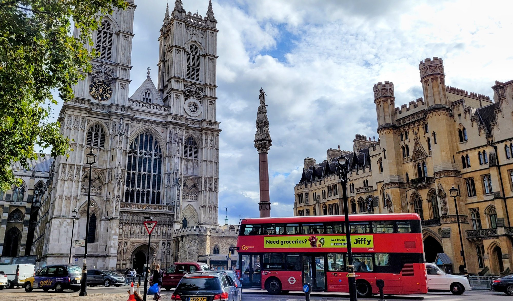
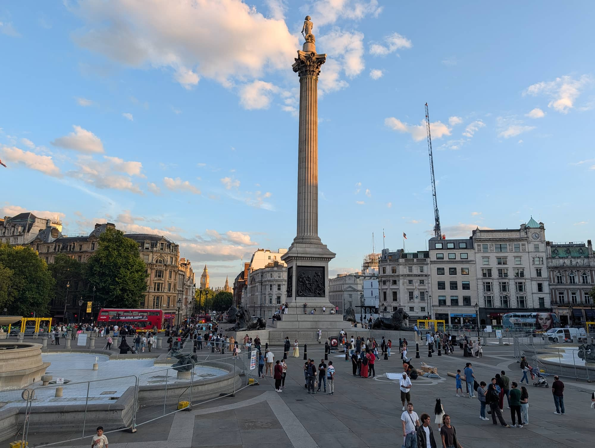
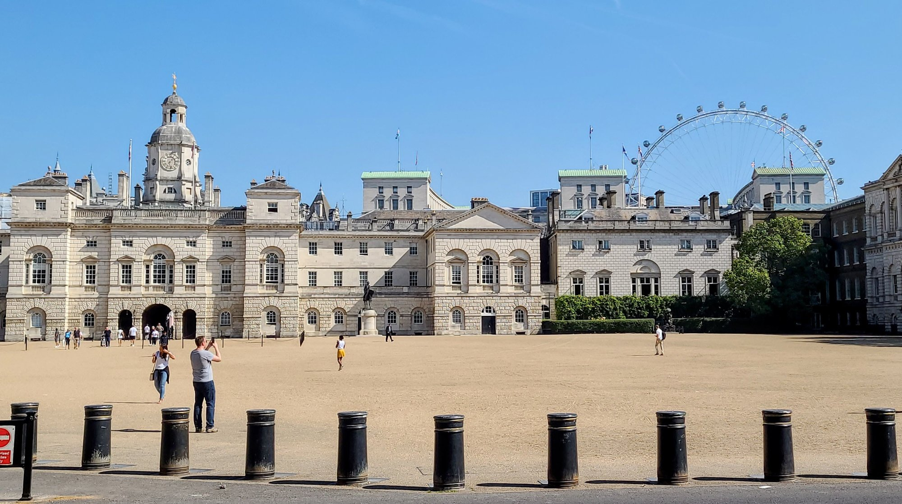

Westminster is the London of postcards: the Elizabeth Tower, the Palace of Westminster, the Abbey where every English monarch since 1066 has been crowned, and the long ceremonial run of Whitehall up to Trafalgar Square.

It is also the most concentrated sightseeing in the city. Almost everything worth seeing sits within a fifteen-minute walk, which is both the appeal and the problem.

Westminster has its own share of the commemorative plaques marking where notable people lived or worked - see them on our [interactive map](/plaques/?area=westminster).

## Why visit — and who should skip it

**Come here if** it is your first trip to London. This is the non-negotiable half day — the landmarks that make the city recognisable, all within walking distance of each other, most of them viewable for free from the street.

**Skip it if** you have done it before and are not going inside anything. Westminster rewards a visit when you have booked the Abbey or the War Rooms. Walking past the outside of buildings you have already photographed is a thin way to spend a morning, and the pavements are crowded all day.

## Top sights and activities

1. **The Elizabeth Tower and Palace of Westminster** — Best photographed from the far side of Westminster Bridge. UK residents can book a tower climb; everyone can tour Parliament on Saturdays and during recess.
2. **Westminster Abbey** — Nearly a thousand years of coronations, royal tombs and Poets' Corner. Closed to sightseers on Sundays. Allow two hours, and take the included audio guide.

*The Abbey's west towers, added in the 1740s - centuries after the rest of the building.*
3. **Churchill War Rooms** — The underground bunker left largely as it was in 1945, with the map room untouched. Book timed entry well ahead.
4. **Changing the Guard** — At Buckingham Palace at 11:00 on selected days. **Horse Guards** on Whitehall is smaller and far less crowded, but only runs the full mounted ceremony on **Monday, Wednesday and Friday at 11:00** — other days get a shorter inspection instead. There is also a free inspection **every day at 16:00** that almost nobody times a visit around.
5. **St James's Park** — The best park in central London, with the pelicans and the view from the blue bridge back towards Whitehall.
6. **Trafalgar Square and the National Gallery** — At the top of Whitehall. The gallery is free and one of the great collections in Europe.
7. **Westminster Cathedral** — Not the Abbey. A striped Byzantine-style Catholic cathedral ten minutes south, with a lift up its tower for one of the cheapest good views in London.

*The Household Cavalry passing the Palace gates. Arrive by 10:15 for a view that isn't three rows deep.*

## Key streets and micro-districts

*Westminster Bridge and the Palace of Westminster. Photo: [Txllxt TxllxT](https://commons.wikimedia.org/wiki/File:London_-_Albert_Embankment_path_-_Lambeth_Palace_Road_-_South_Bank_-_Jubilee_Walkway_-_View_NNW_towards_Houses_of_Parliament,_Westminster_Bridge_%26_London_Eye.jpg), [CC BY-SA 4.0](https://creativecommons.org/licenses/by-sa/4.0/).*

### Parliament Square

The green at the centre, ringed by twelve statues, with **Westminster Abbey** on one side and the **Palace of Westminster** on the other. It is free, always open and unfenced, and you can stand on the grass.

**The statues are the reason to linger.** Churchill scowling at Parliament, Mandela, Gandhi, Lincoln — and since 2018 **Millicent Fawcett**, the first woman commemorated here and the only statue in the square made by a woman.

**Big Ben is the tower, not the bell.** The Elizabeth Tower reopened after five years of restoration and the bell chimes on the hour; **tours are for UK residents only**, arranged through an MP.

> ⚠️ **The square is often partly fenced** for ceremonies, works or demonstrations, and the pavements around Parliament are subject to short-notice closures. A specific photograph is never guaranteed.

Westminster station comes up directly onto the corner, and the *Suffragette* and *Spectre* filming locations are both within five minutes.

### Whitehall

*Trafalgar Square sits at the top of Whitehall, a ten-minute walk from Parliament Square and free to wander.*

The government spine running north from Parliament Square to Trafalgar Square, about ten minutes end to end and free the whole way.

**Downing Street is gated and has been since 1989** — you see the entrance and the police, not the door. The **Cenotaph** stands in the middle of the road, and the **Banqueting House**, the only surviving part of the old Whitehall Palace, has a Rubens ceiling and is ticketed.

**Horse Guards is the free ceremony.** The full mounted **Changing of the King's Life Guard is at 11am, Monday to Saturday, and 10am on Sunday**, and it is far easier to see than the Buckingham Palace version — no crowd barriers, no railings, and you can stand a few feet away.

**There is also a free dismounted inspection at 4pm every day**, which almost nobody knows about and which takes about ten minutes.

**You can walk straight onto the parade ground**, which is not obvious from the street — go through the archway.

*The full mounted ceremony at Horse Guards — Monday, Wednesday and Friday at 11:00 only. Other days get a shorter inspection at the same time.*

*Horse Guards between ceremonies — you can walk right onto the parade ground, which is not obvious from the street. There's a free inspection here every day at 16:00, mounted or not.*

### St James's Park and The Mall

The ceremonial route to Buckingham Palace, and the park is the reason to walk it rather than take the Tube — it is the oldest of the Royal Parks and much the prettiest.

**The bridge over the lake is the best free view in the area**: Buckingham Palace at one end, the towers and turrets of Whitehall at the other, and the whole thing looks like a different city.

**There are pelicans**, descended from a gift to Charles II in 1664, and they are fed at the lakeside around 2.30pm each day.

**Buckingham Palace State Rooms open only in summer**, roughly July to September, and are ticketed and timed. The **Changing of the Guard at the Palace is free** but the crowd is deep — the Horse Guards version ten minutes away is the better watch.

**The park is free and open dawn to midnight.** St James's Park station is at the western end, Charing Cross at the eastern.

### Victoria Street and Westminster Cathedral

South-west of the Abbey, and mostly offices and chain shops rather than sights — but the cathedral at the end is worth the ten-minute walk and almost nobody makes it.

**Westminster Cathedral is not the Abbey.** It is the Roman Catholic mother church, finished in 1903 in striped red brick and Byzantine style, and it looks like nothing else in London. **Entry to the cathedral is free.**

**The bell tower is the hidden viewpoint.** £10 adult, £5 concession, £22 family, and **it has a lift rather than a staircase** — the only central London tower view that is not a climb. The gallery sits 210 feet above Victoria Street looking straight down it.

> ⚠️ **Tickets are sold in person at the Cathedral Shop, open 10.30am to 4.30pm Wednesday to Sunday**, so the shop's hours are the tower's hours. There is no online booking. The cathedral now calls it **The Campanile**.

Victoria station is five minutes further west.

### Millbank and the Thames path

South along the river from Parliament towards Tate Britain, and much the quietest walk in Westminster — most visitors turn north at Parliament and never come this way.

**Tate Britain is free and open daily 10am to 6pm.** It holds the national collection of British art and **the largest collection of Turner anywhere**, in the purpose-built Clore Gallery — if Turner is why you came to London's galleries, this is the building rather than the National.

**The Tate Boat runs from the pier outside to Tate Modern every 40 minutes**, taking about eighteen minutes, and it accepts contactless. It is a river bus rather than a tour and it is the best way to travel between the two.

**Millbank Tower and the Victoria Tower Gardens** are on the way, the latter holding the Burghers of Calais and the Buxton Memorial.

**Pimlico is the nearest station to Tate Britain**, five minutes, rather than Westminster — which is a fifteen-minute walk back along the river.

Powered by <a target="_blank" rel="sponsored" href="https://www.getyourguide.com/london-l57/">GetYourGuide</a>

## Where to eat and drink

| Spot | Style | Price | Why go |
| --- | --- | --- | --- |
| **The Cinnamon Club** | Fine-dining Indian | £££ | In the old Westminster Public Library; book ahead |
| **Regency Cafe** | Traditional cafe | £ | 1940s tiled interior, full English, cash-friendly queues |
| **The Red Lion** | Historic pub | £ | Whitehall pub used by MPs; division bell on the wall |
| **Tate Britain Cafe** | Museum cafe | ££ | Fifteen minutes south along the river, and much calmer |
| **Seven Dials or Soho** | Anything | — | Genuinely: walk north for dinner |

## Getting there

**By Tube.** **Westminster** station sits directly beneath the bridge on the Jubilee, District and Circle lines. **St James's Park** is better for Buckingham Palace and the park. **Charing Cross** puts you at Trafalgar Square, at the top of Whitehall.

**Best exit.** From Westminster station, take **Exit 4** and you emerge at the foot of the Elizabeth Tower. **Exit 1** puts you on the bridge for the walk to the London Eye.

**By river.** Westminster Pier is right by the bridge, with Uber Boat services east to Tower Bridge and Greenwich. Often more pleasant than the Tube — see the [river boats guide](/articles/how-to-use-london-river-boats/).

## How long to spend, and when to go

| If you have | Do this |
| --- | --- |
| **Two hours** | Bridge, Parliament Square, Whitehall, Trafalgar Square |
| **Half a day** | Add Westminster Abbey and St James's Park |
| **A full day** | Add the Churchill War Rooms and the National Gallery |

**Best time:** Before 09:00 for photographs without crowds, and the best light on the Palace of Westminster from the east.

**Avoid:** Sundays if you want to go inside the Abbey. Also check for state occasions and remembrance events, which close roads across the whole area.

## Suggested three-hour walking route

1. **Start:** Westminster station, **Exit 4**, at the foot of the Elizabeth Tower.
2. **Westminster Bridge:** Walk halfway across and look back for the classic view.
3. **Parliament Square:** Return and circle the square to **Westminster Abbey**.
4. **St James's Park:** North-west through the park to the blue bridge, then up to **Buckingham Palace**.
5. **The Mall and Horse Guards:** East along The Mall to **Horse Guards Parade** and Whitehall.
6. **Finish:** **Trafalgar Square** and the National Gallery.

## Common mistakes to avoid

1. **Arriving at the Abbey on a Sunday.** Closed to sightseers. Monday to Saturday only.
2. **Not booking the Churchill War Rooms.** Timed slots sell out well in advance.
3. **Photographing Big Ben from directly underneath.** Cross to the far side of the bridge; you cannot fit the tower in from the station side.
4. **Standing at the Palace railings for the Guard.** By 10:30 you will see nothing. Watch from the Victoria Memorial steps, or go to Horse Guards instead — but only Monday, Wednesday or Friday if you want the full ceremony rather than the shorter inspection.
5. **Eating beside Westminster Bridge.** The restaurants immediately around the bridge are the worst value in central London. Walk to Regency Cafe or head north.
6. **Taking the Tube one stop to Waterloo.** Walking across the bridge takes ten minutes and is the better experience.

Powered by <a target="_blank" rel="sponsored" href="https://www.getyourguide.com/london-l57/">GetYourGuide</a>

## Where to stay

Convenient for sightseeing, quiet at night, and short on evening life — most of Westminster empties after office hours.

- **Victoria** — The main hotel cluster, ten minutes south-west, with good rail and coach connections.
- **Westminster and Whitehall** — A handful of large hotels near the river. Central and expensive.
- **Waterloo and the South Bank** — Across the bridge, better value, and much more open in the evening.
