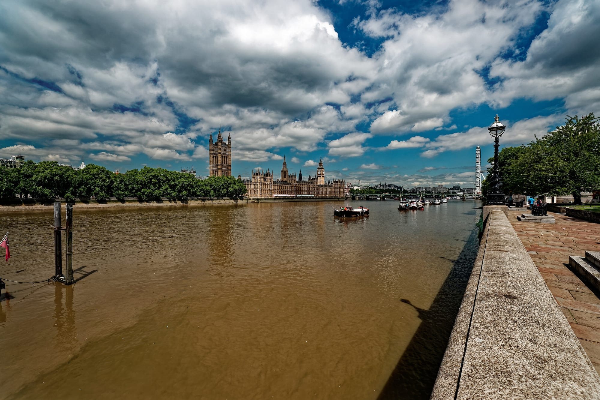
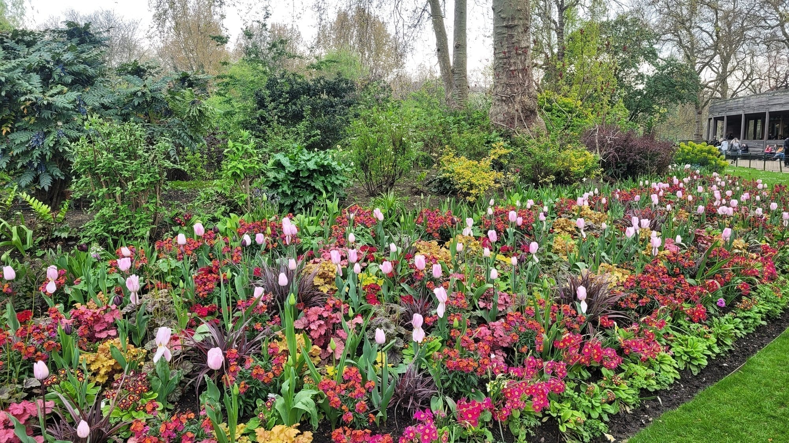
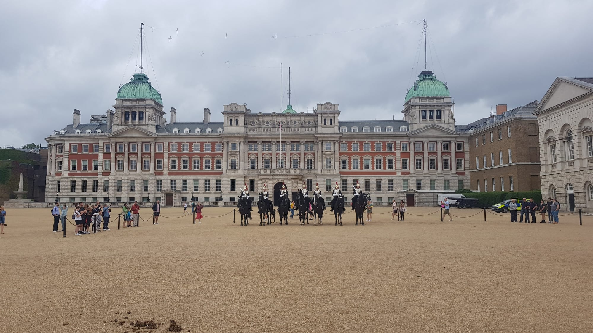

Nowhere in London gets photographed more and entered less. People come out at Westminster station, take the picture of the tower, walk up Whitehall past the gates of Downing Street, take the picture of Trafalgar Square and leave — having spent two hours looking at the outside of buildings.

**This walk is about the doors.** Half the good things in this postcode are free and require nothing but walking through one: a working supreme court opposite Parliament, the public galleries of the House of Commons, a park bridge with the best free view in central London, and a parade ground you can stand on.

It runs **Westminster Bridge to Trafalgar Square**, west through the park to Buckingham Palace and back east along The Mall. About **4km, two to three hours** with stops, flat the whole way. Nine of the eleven stops cost nothing.

It also has the sharpest day-of-the-week problem in London. **The guard only changes on Monday, Wednesday and Friday** — at the Palace and at Horse Guards both. Turn up on a Tuesday and you get an inspection instead.

For the wider area — the Cathedral, Millbank, where to eat, where to stay — see the [Westminster area guide](/articles/westminster-area-guide/). This is the walking route version of it.

> 💡 **The Short Version:** Go on a **Monday, Wednesday or Friday** — the only days the guard changes rather than being inspected. Start on **Westminster Bridge**, finish at **Trafalgar Square**. The thing almost nobody does is walk into the **Supreme Court**, which is free, open weekdays and directly across the square from Parliament. **Watching a Commons debate is free too.** And if you are walking in the afternoon, be at **Horse Guards for 4pm**: there is a dismounted inspection every single day and it is the least-known ceremony in London.

## The route

  

    Map of the walk, numbered in walking order
  

  

    
Loading the map…

  

  

    <i class="route-map-marker" aria-hidden="true">1</i> On the route, in walking order
    <i class="route-map-marker route-map-marker--alt" aria-hidden="true">+</i> Optional detour
  

  <noscript>
    
The map needs JavaScript. Every stop below is numbered in walking order with its nearest station.

  </noscript>

**[Open the whole route in Google Maps →](https://www.google.com/maps/dir/?api=1&origin=51.500854,-0.121785&destination=51.50845,-0.12845&waypoints=51.500694,-0.124575%7C51.500409,-0.128135%7C51.499399,-0.127391%7C51.502679,-0.126091%7C51.50221,-0.129252%7C51.502655,-0.135194%7C51.500835,-0.143005%7C51.506082,-0.130261%7C51.504662,-0.128262&travelmode=walking)** — all eleven stops in walking order, set to walking directions, which is the version to put on your phone.

| # | Stop | Cost | Open |
| --- | --- | --- | --- |
| **1** | Westminster Bridge | Free | Always |
| **2** | Parliament Square & the Palace of Westminster | Free; galleries free | Square always |
| **3** | The Supreme Court | **Free** | **Weekdays only** |
| **4** | Westminster Abbey | **Ticket** | Mon–Sat; **not Sundays** |
| **5** | The Cenotaph & Downing Street | Free | Always |
| **6** | Churchill War Rooms | **Ticket** | Daily, 9.30am–6pm |
| **7** | St James's Park | Free | 5am–midnight |
| **8** | Buckingham Palace | Free to watch | **Guard changes Mon, Wed, Fri** |
| **9** | The Mall | Free | Always |
| **10** | Horse Guards | Free | 11am ceremony; 4pm inspection daily |
| **11** | Trafalgar Square & the National Gallery | **Free** | Gallery daily 10am–6pm |
| **+** | Westminster Cathedral | Free; tower £10 | Cathedral daily; tower Wed–Sun |

---

## 1. Westminster Bridge

*The frame everyone comes for, and it only exists from a distance. Photo: [Txllxt TxllxT](https://commons.wikimedia.org/wiki/File:London_-_Albert_Embankment_path_-_Lambeth_Palace_Road_-_South_Bank_-_Jubilee_Walkway_-_View_NNW_towards_Houses_of_Parliament,_Westminster_Bridge_%26_London_Eye.jpg), [CC BY-SA 4.0](https://creativecommons.org/licenses/by-sa/4.0/).*

**Start halfway across and look back.** Westminster station comes up at the foot of the Elizabeth Tower, which is exactly the wrong place to photograph it from — stand underneath a 96-metre tower and you cannot get it in the frame.

Walk out onto the bridge instead. From the middle, and better still from the far end on the South Bank side, you get the tower and the full length of the Palace of Westminster in one shot, with the river underneath. It costs nothing, it is open at every hour of the year, and it is the only stop on this walk that is better in the dark.

Then turn round and walk back. Everything else on this route is on the north bank.

> 💡 **This is also where our [South Bank route](/articles/south-bank-walk/) begins**, running the other way — east along the river to Tower Bridge. If you have a whole day, the two join up here.

## 2. Parliament Square and the Palace of Westminster

The green at the centre of it all, ringed by statues — Churchill glowering across at the building he ran the war from, Mandela, Gandhi, Lincoln, and Millicent Fawcett, added in 2018. It is unfenced, free and always open, and you can stand on the grass.

But the useful thing here is not on the square. **Watching Parliament work is free.**

Visitors from the UK and overseas are welcome to watch debates and committee hearings in **both the Commons and the Lords, free of charge**, from the public galleries — [Parliament's own visiting pages](https://www.parliament.uk/visiting/visiting-and-tours/watch-committees-and-debates/) say so in as many words. **Prime Minister's Questions is on Wednesdays at 12 noon**, which is the one slot everybody wants; ordinary debates and committee sessions are far easier to get into and considerably more interesting than the shouting.

If you want the building rather than the business, tours are ticketed and **open to all visitors**, not just UK residents:

- **Self-guided audio tour** — from **£31** adult booked ahead, £34 on the day, in ten languages, with a children's version. One child free with each adult ticket.
- **Guided tour** — from **£40** adult booked ahead, £43 on the day. Ninety minutes, English only.
- **Big Ben tour** — **£55**, age 11 and over, and **300-plus steps** on foot. There is no lift.
- **Speaker's House** — **£23**, and best suited to over-16s.

> 💡 **The free tour exists but is not for visitors.** UK residents only can book a free 75-minute guided tour through their own MP. Everybody else pays. That is the opposite of what most guidebooks imply about Big Ben, where the paid climb is open to anyone and it is the *free* tour that is restricted.

## 3. The Supreme Court

**The best free thing in Westminster, and it is directly across the square from the thing everyone photographs.**

The United Kingdom's final court of appeal sits in the Middlesex Guildhall on the west side of Parliament Square. It is **open to the public Monday to Friday, 9am to 5pm, last entry 4.30pm**, and it is **free**. It closes at weekends and on bank holidays, which is the single strongest argument for walking this route on a weekday.

Three things are worth the twenty minutes:

**You can sit in on a hearing.** If the court is sitting, visitors are welcome in the courtrooms. The Justices sit as a panel on the same level as everyone else — no raised dais — and there is no witness box and no jury box, because this court hears arguments about law rather than facts.

**The exhibition on the lower ground floor** holds a set of ceremonial robes, a judicial letters patent and a large exemplification of Magna Carta rendered in modern English.

**There is a café and a shop**, and both are open to anyone who walks in, which makes this the only free indoor sit-down between the bridge and the park.

> ⚠️ **Airport-style security every time you enter**, and the court's own guidance is that queues build **between 9.30 and 10.30 and between 1.45 and 2.15**. Come at 11 or at 3.

Powered by <a target="_blank" rel="sponsored" href="https://www.getyourguide.com/london-l57/">GetYourGuide</a>

## 4. Westminster Abbey

*The west towers, added in the 1740s — centuries after the rest of the building.*

The coronation church since 1066, and the one stop on this walk that is a serious ticket.

**Open 9.30am to 3.30pm Monday to Friday and 9.30am to 3pm on Saturday.** On **Sunday it opens for services only**, and no amount of planning gets around that. Admission is **£31 adult, £28 for over-65s and students, £14 for children aged 6 to 17**, and under-6s are free. That covers the Cloisters, College Garden, the Chapter House and the Pyx Chamber; **the Queen's Diamond Jubilee Galleries are £5 more** on a timed ticket bought alongside, and free for children.

Two things about the price are worth knowing and are easy to miss:

**An online ticket upgrades to an annual pass for nothing.** Ask a member of the Visitor Experience team while you are inside and they will swap your ticket for a paper pass good for **three visits in a year**. It only works on tickets bought through the Abbey's own site.

**And you do not have to pay at all.** Attending a daily service is free, entry is through the Great West Door, and you are welcome to come in for private prayer during opening hours — the Abbey says so on its [prices and entry times page](https://www.westminster-abbey.org/visit-us/prices-and-entry-times), which is not where most people look.

**St Margaret's Church** stands in the Abbey's shadow on the same site, is free, and keeps its own shorter hours — the Abbey lists them on the same page as its own.

## 5. The Cenotaph and Downing Street

Walk north from Parliament Square and Whitehall opens up in front of you. Two hundred metres of it, and no ticket for any of it.

**The Cenotaph stands in the middle of the road**, on the white line, with traffic either side. Lutyens designed it as a temporary structure for a victory parade in 1919 and it was rebuilt in stone the following year because nobody could face taking it down. There is no religious symbolism on it anywhere, deliberately.

**Downing Street is gated**, and has been since 1989. What you see is a black iron gate, armed police and a slice of the street beyond it. It takes about ninety seconds and it is worth the ninety seconds, because the gate itself is the story: people used to walk up that street, and now nobody does.

This whole stretch is free, unticketed and never closed, which makes it the part of the walk that works at seven in the morning.

## 6. The Churchill War Rooms

Turn left off Whitehall down **King Charles Street** and keep going to the **Clive Steps** at the far end. The entrance is a door in the pavement.

**The underground bunker from which Britain ran the Second World War**, left substantially as it was on the day it closed in 1945 — the Map Room in particular, which was abandoned with the pins still in the wall.

Open **9.30am to 6pm, last entry 5pm, every day except 24 to 26 December**. Adult tickets are **£34**, with concessions at £30.60 and children at £17; members and under-fives go free. The Imperial War Museums' own advice is to **allow at least two hours**, because the Cabinet War Rooms and the Churchill Museum are two separate things under one ticket, and there are security checks on the way in.

There is a **café inside, open daily 10am to 5pm**, in the room the switchboard operators used.

> ⚠️ **This is a half-day attraction sitting at stop six of eleven.** Doing it properly ends the walk. If you want both, do the War Rooms on a separate morning and walk past the door today — or start here at 9.30 and pick the route up afterwards.

## 7. St James's Park

*The bedding along The Mall side changes with the season — this is late April.*

Out of the Clive Steps, across Horse Guards Road, and into the oldest of the Royal Parks. **Pedestrian gates are open 5am to midnight** and there is no charge.

**Walk to the bridge over the lake.** It is the best free view in central London and it works in both directions: Buckingham Palace framed at the western end, and at the eastern end a skyline of turrets and pinnacles above the trees that looks like nowhere in England. That is the back of Whitehall, and almost nobody recognises it.

**There are pelicans**, and they have been here since **1664**, when a pair was presented to Charles II by the Russian Ambassador. More than forty have lived in the park since. The Royal Parks feed them fish **daily, usually around 2.30pm**, and there are **extra feeds at the moment because of pelican chicks** — so an afternoon walk has a decent chance of catching one.

**St James's Café** sits by the lake and opens **8am to 6.30pm, seven days a week**. It is the mid-route lunch stop and it is the only one on this walk that never has a day-of-the-week problem.

## 8. Buckingham Palace

*The Household Cavalry passing the Palace gates on their way down from Knightsbridge.*

Out of the park at the western end, and the Victoria Memorial is in front of you with the Palace behind it.

**Changing the King's Guard happens on Monday, Wednesday and Friday**, and not on the other four days. The Household Division's own schedule puts the ceremony **in front of the Palace at 10.45**, running about **45 minutes**, with the soldiers gathering at St James's Palace and Wellington Barracks **from 10am**. On the days when there is no change, **the Guard is inspected by the Captain at 3pm** instead — a much shorter thing, and much less watched.

**Sunday is its own case.** The Colour is incorporated into the inspection and the ceremony moves to **10am**: the Sunday Parade, in which the Colour is trooped through the Guard while the national anthem plays and then marched back to St James's Palace. It is the only version of this you can see at the weekend.

> ⚠️ **It can be cancelled at short notice**, especially in wet weather, and the Household Division says the decision can be made **as late as 10.45 on the day**. Check before you build a morning around it.

**The State Rooms open only in summer.** The 2026 season is **9 July to 27 September**, and outside it the Palace opens on selected dates for Exclusive Guided Tours at £100 a head. Everything else about the Palace — the gates, the memorial, the ceremony — is free and needs no ticket at all.

## 9. The Mall

**A kilometre of processional road** running dead straight from the Victoria Memorial to Admiralty Arch, surfaced in red so that it reads as a carpet from the air. Plane trees down both sides, St James's Palace and Clarence House on the north side, and the park on the south.

It is not a stop so much as **fifteen minutes of walking that you should not shortcut**. There is no station on it, nothing to queue for, and the parallel street is Pall Mall, which is offices and clubs.

Two-thirds of the way along, look right through the trees: the lake, the bridge you were standing on twenty minutes ago, and the back of Whitehall again from the other side.

Powered by <a target="_blank" rel="sponsored" href="https://www.getyourguide.com/london-l57/">GetYourGuide</a>

## 10. Horse Guards

*The full mounted ceremony — Monday, Wednesday and Friday at 11am only.*

Turn off The Mall onto the gravel and you are on **Horse Guards Parade**, which is a public space you can simply walk across. This is the good ceremony, and it is free.

**The King's Life Guard is mounted here by the Household Cavalry Mounted Regiment**, and has been since the Restoration in 1660 — the building is named after them rather than the other way round. The Life Guards wear red tunics and white plumes; the Blues and Royals wear blue tunics and red plumes. When the King is in London the guard is a **Long Guard** of an officer, a corporal major carrying the Standard, two NCOs, a trumpeter and six troopers; when he is not, it drops to a **Short Guard** of two NCOs and six troopers.

**What happens on which day**, from the Household Division's own schedule:

| Day | What you get |
| --- | --- |
| **Mon, Wed, Fri** | **The full change at 11am.** The guard rides down from Hyde Park Barracks at 10.28, via Hyde Park Corner, Constitution Hill and The Mall |
| **Tue, Thu** | The Patrol, between **10.30 and 11.15** |
| **Sat, Sun** | The duty officer's inspection at **11am** — ten to fifteen minutes |
| **Every day** | **The dismounted inspection at 4pm**, after which the guard comes off duty |

**The 4pm inspection is the one to know about.** It happens seven days a week, in the front yard on the Whitehall side, it takes about ten minutes, and there is no crowd whatsoever — because it is not in any of the guidebooks. Two mounted sentries stand at the Whitehall entrance **from 10am until 4pm** and are changed every hour, so there is always a horse there in daylight.

*Horse Guards between ceremonies. You can walk straight onto the parade ground — go through the archway.*

**Inside is the [Household Cavalry Museum](https://householdcavalrymuseum.co.uk/visit/)**, where a glass screen looks into the working stables. **£11 adult, £8 students and children aged 5 to 15, £9.50 over-60s, £29 for a family** of two adults and up to three children, with a multimedia guide included in nine languages. Open **10am to 6pm April to October and 10am to 5pm November to March**, last admission an hour before closing, and closed on Marathon Day, Easter Friday, Remembrance Sunday, Christmas Eve to Boxing Day and New Year's Day.

**Straight across Whitehall is the Banqueting House**, the only surviving fragment of the old Whitehall Palace, with a Rubens ceiling painted for Charles I and the site of his execution in 1649 outside it. **It is barely open any more.** Historic Royal Palaces runs a summer season, **1 August to 20 September 2026**, and after that the only dates open to the general public are **Sunday 1 November and Sunday 20 December**. When it does open it is **£10 adult and free for children aged 5 to 15**, and pre-booking is recommended. Check the [Banqueting House visiting page](https://www.hrp.org.uk/banqueting-house/visit/) before you count on it — the rest of the year the building is given over to schools, community partners and private events.

## 11. Trafalgar Square and the National Gallery

North up Whitehall for four hundred metres and the road opens into the square. This is the end of the walk, and it is the right end — because it finishes at a free building you can go into and sit down in.

**The National Gallery is free and open daily, 10am to 6pm, and until 9pm on Fridays.** It closes on 24 to 26 December and 1 January. The **main free entrance is the Sainsbury Wing**; you can book a free general admission ticket for fast-track entry or simply walk up. Only the temporary exhibitions are ticketed. Some rooms are shut at the moment for building work, so a specific painting is not guaranteed.

Outside, **the Fourth Plinth** in the north-west corner carries a rotating contemporary commission chosen by public consultation and an independent panel. The work on it now is **Teresa Margolles's *Mil Veces un Instante* (A thousand times an Instant)**. It is free, it is at street level, and most people walk past it looking for the lions.

**St Martin-in-the-Fields** is on the north-east corner, and the **Café in the Crypt** underneath it is the sit-down at the end of this walk: brick vaults, gravestones for a floor, and food at a fraction of what anything with a view of the square charges. Its hours move week to week and it closes for private events on scattered days, so [check the church's site](https://www.stmartin-in-the-fields.org/visit/) before you fix a plan around it.

---

## The detour: Westminster Cathedral

Worth its own section because it is nothing like anything else on this walk, and because almost nobody makes the ten-minute walk south-west from the Abbey to see it.

**Westminster Cathedral is not Westminster Abbey.** It is the Roman Catholic mother church of England and Wales, finished in 1903 in striped red brick and Byzantine style, and it looks like nothing else in Britain — a campanile, domes and a colossal dark interior that was never fully decorated, so the upper walls are still bare brick.

**Entry is free and it is open every day.** The Cathedral Café opens **10am to 4pm, Tuesday to Saturday**.

**The tower is the reason to come.** The viewing gallery — the Cathedral calls it **The Campanile** — sits **210 feet above Victoria Street**, and it has **a lift rather than a staircase**, which makes it the only central London tower view that is not a climb. **£10 adult, £5 concession, £22 family.**

> ⚠️ **The tower's hours are the shop's hours.** Tickets are sold in person at the Cathedral Shop, open **10.30am to 4.30pm, Wednesday to Sunday**, and there is no online booking. On a Monday or Tuesday the cathedral is open and the tower is not.

## Where to eat

The area guide is blunt about this and it is right: **the restaurants immediately around Westminster Bridge are the worst value in central London.** They exist because everyone walks past them once and nobody comes back. Three better answers, and the choice is decided by where you are on the route rather than by the food.

**St James's Café — the middle of the walk.** By the lake at stop seven, **8am to 6.30pm seven days**, with outdoor seating and the park around it. It is the only eating stop on this route with no day-of-the-week catch at all, and it lands at roughly the halfway point.

**Café in the Crypt — the end of the walk.** Under St Martin-in-the-Fields at stop eleven, in the vaulted brick crypt with tombstones in the floor. Better setting than anything else here and reasonably priced for the postcode, with the caveat above: the hours move and it shuts for private events on scattered days.

**The Supreme Court café — the start of the walk.** Free to walk into, weekdays only, and almost nobody in it. Sandwiches, cakes and coffee rather than lunch, but it is a genuinely quiet room fifty metres from Parliament Square.

If you have a Churchill War Rooms ticket, its café runs **10am to 5pm daily** and is inside the security line, so it only works if you are going in anyway. For the sit-down restaurants — the Cinnamon Club, the Regency Cafe, the Whitehall pubs — the [area guide covers them](/articles/westminster-area-guide/#where-to-eat-and-drink).

## The best day to go

**Monday, Wednesday or Friday**, and it is not close. Those are the only days the guard changes rather than being looked at.

| Day | What you get |
| --- | --- |
| **Mon, Wed, Fri** | **The guard changes at 11am**, at both the Palace and Horse Guards. Everything else open. The best day |
| **Tue, Thu** | No change. Horse Guards runs the Patrol 10.30–11.15 and the Palace guard is inspected at 3pm. Everything else open |
| **Saturday** | No change. Duty officer's inspection at Horse Guards at 11am. Abbey shuts at 3pm. **Supreme Court closed** |
| **Sunday** | **Abbey closed to sightseers, Supreme Court closed.** But the Sunday Parade at the Palace at 10am is the weekend's best ceremony |
| **Bank holidays** | **Supreme Court closed.** Check the Household Division schedule before planning around a ceremony |

**Here is the thing nobody plans around.** Both 11am ceremonies happen at the same moment, a kilometre apart. You cannot see the Palace change and the Horse Guards change on the same day, and the choice is easy: **Horse Guards has no barriers and no crowd**, and it is where the route puts you anyway.

**What closes at the weekend:** the Supreme Court entirely, both days. That is the only outright loss — but it is the best free thing on the walk, which makes a weekday visit worth arranging.

**What does not care what day it is:** the bridge, Parliament Square, the Cenotaph, Downing Street's gate, the park from 5am to midnight, The Mall, Trafalgar Square, the National Gallery, St James's Café, and the two mounted sentries at Horse Guards between 10am and 4pm. That is still most of the walk.

**Make the case for Sunday, though.** Whitehall is a working government district and it empties completely at the weekend, so Sunday gives you the Cenotaph and Downing Street without the commuter tide, the park at its best, and two ceremonies the weekday visitor never sees: **the Sunday Parade at the Palace at 10am**, with the Colour trooped, and the duty officer's inspection at Horse Guards at 11. The National Gallery is open. And **the Abbey's Sunday services are free and open to anyone** — which is the only way through that door on a Sunday, and you see the building working rather than filing past it. You lose the Supreme Court and the Abbey's day tickets, and you gain a quieter version of everything else.

**On time of day**, there are three sensible starts:

- **9.30am.** You get the Supreme Court and the Abbey with time inside both, and you reach Horse Guards around lunchtime — after the 11am ceremony has gone.
- **Ceremony first, on a Mon, Wed or Fri.** Be at Horse Guards Parade for 11, watch the change, then start the walk at stop one and do it in order. It is the only way to get both the ceremony and the interiors.
- **1pm.** Nine stops in three hours puts you at Horse Guards for the **4pm dismounted inspection**, which runs every day of the week. The trade is that the Abbey will have closed — it shuts at 3.30pm on weekdays and 3pm on Saturday.

Powered by <a target="_blank" rel="sponsored" href="https://www.getyourguide.com/london-l57/">GetYourGuide</a>

## Getting there and back

**Start:** Westminster (Jubilee, District, Circle) — take **Exit 1** for the bridge, or Exit 4 to come up at the foot of the tower. **Finish:** Charing Cross (Northern, Bakerloo, rail) or Leicester Square (Northern, Piccadilly), both a couple of minutes from Trafalgar Square.

The route is **flat, paved and step-free throughout**, and the only stairs are optional ones inside ticketed buildings. St James's Park station sits at the midpoint if you need to cut it short, and the whole walk is never more than about five minutes from a Tube entrance.

**Westminster Pier is at stop one**, next to the bridge, with river services east to Tower Bridge and Greenwich — see the [river boats guide](/articles/how-to-use-london-river-boats/) if you would rather leave by water.

Walked in reverse — Trafalgar Square to Westminster Bridge — it works and ends on the better view. The reason we run it this way is the finish: Trafalgar Square gives you a free gallery open until six, and the bridge gives you a photograph and a road.

## Carry on walking

- **[Covent Garden: Seven Dials to the Piazza](/articles/covent-garden-walk/)** — Trafalgar Square is the edge of Covent Garden.
- **[South Bank: Westminster to Tower Bridge](/articles/south-bank-walk/)** — starts across Westminster Bridge, where this one begins.
- **[Fitzrovia to Mayfair](/articles/fitzrovia-mayfair-walk/)** — finishes at Green Park, across the Mall from Buckingham Palace.

## What to do with the rest of the day

- **[The Westminster area guide](/articles/westminster-area-guide/)** — the Cathedral, Millbank and Tate Britain, where to eat properly, and where to stay.
- **[The South Bank walk](/articles/south-bank-walk/)** — starts on the far side of Westminster Bridge and runs east to Tower Bridge. The two make a full day.
- **[Free things to do in London](/free/)** — nine of these eleven stops cost nothing.
- **[The best views in London](/articles/best-views-london/)** — including the Westminster Cathedral tower, which is on this page as a detour and is one of the cheapest good views in the city.
- **[Thames walks](/articles/london-walks-along-the-thames/)** — pick up the river at Westminster Pier and keep going in either direction.
