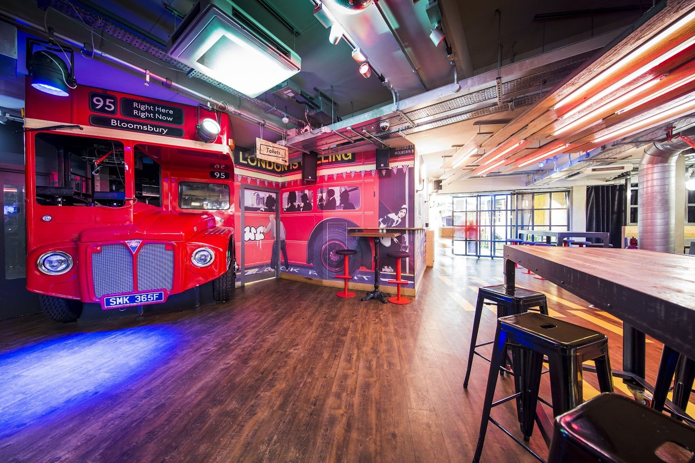
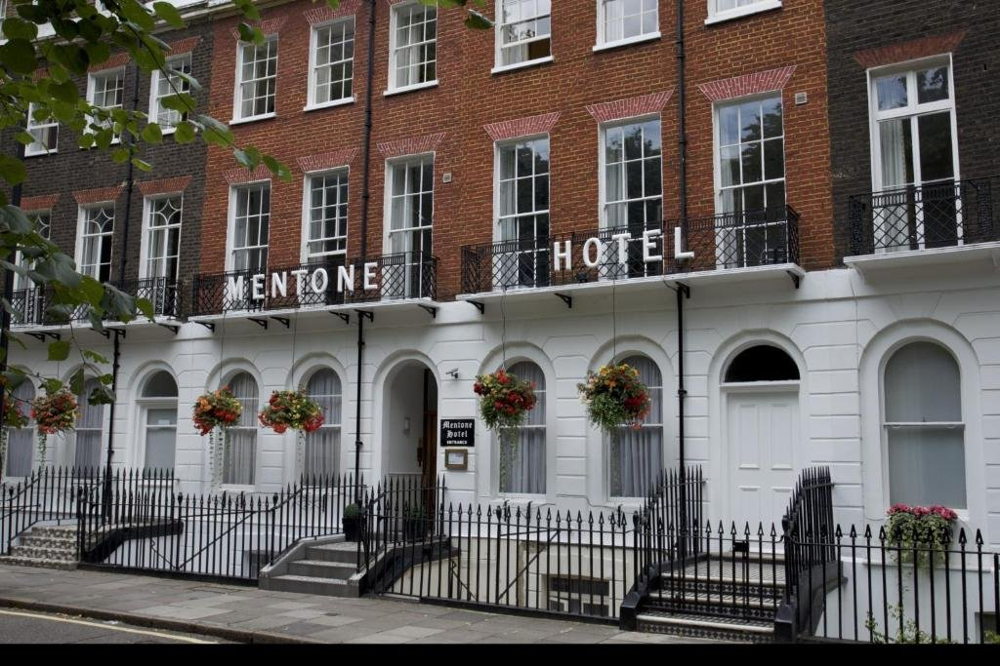
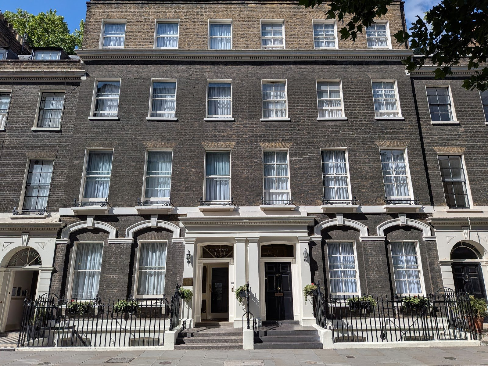
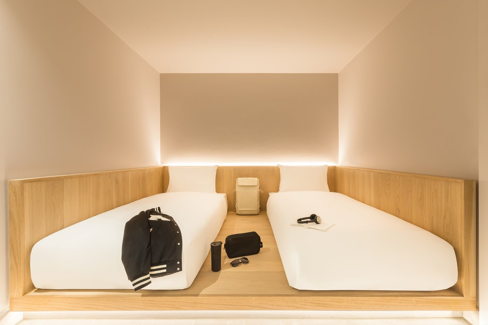
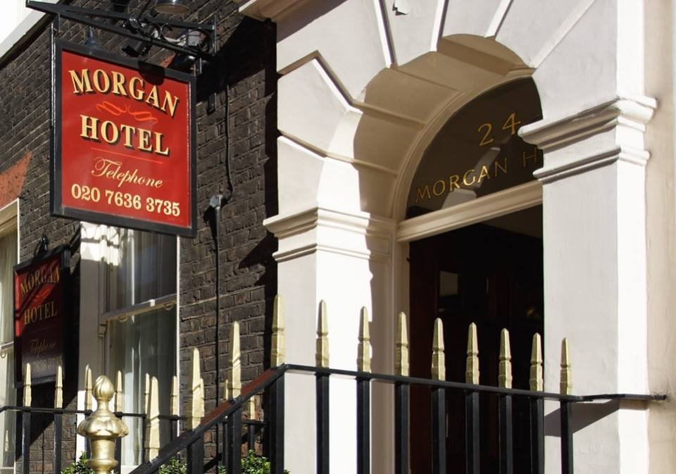
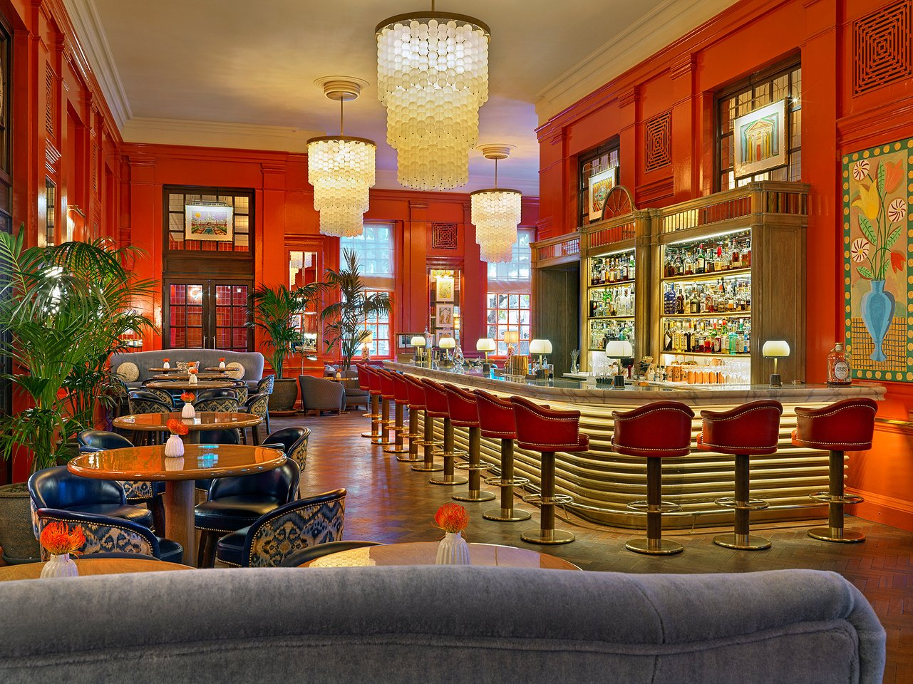
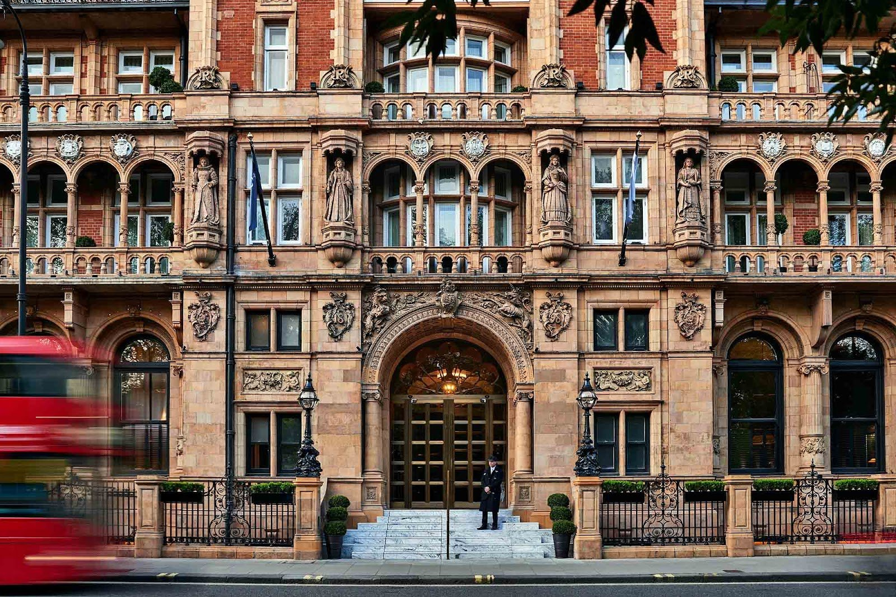
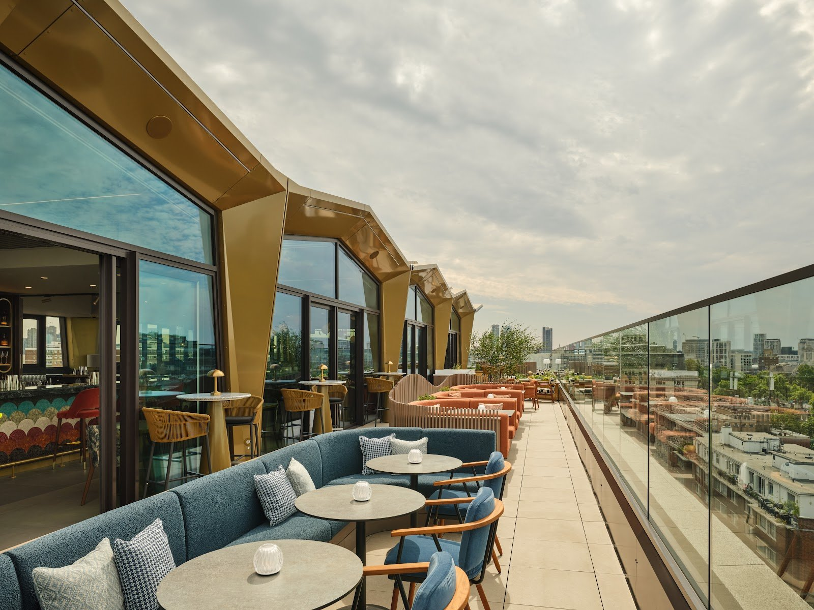

Most guides to Bloomsbury hotels describe the same two or three names — a hostel, a windowless underground room, one grand Victorian pile — because that handful is what turns up on every "best hotels near the British Museum" search. What those searches miss is the range sitting either side of them: a Georgian B&B strip family-run since the 1970s, and a 357-room hotel on Russell Square that has just finished rebuilding itself from the ground up.

**Bloomsbury runs from a shared dorm bed to a fully relaunched grand hotel inside about ten minutes on foot — a wider price spread on one walk than any other part of Zone 1 covers.** Generator London's cheapest dorm bed and Kimpton Fitzroy London's Russell Square suites sit roughly eight minutes apart. That is the fact worth booking around: which end of the walk you want, and what each end actually gets you.

**The area itself does the rest of the work.** Zedwell Tottenham Court Road and The Bloomsbury Hotel are both under two minutes from the British Museum. Russell Square station is on the Piccadilly line, which runs to Heathrow without a change. And the garden squares that give the area its name are genuinely quiet — quieter, at night, than anywhere else this close to the centre.

> 💡 **The Short Version:** **[Generator London](hotel:generator-london)** is a bed in a former police building, and it says outright that it is a party hostel — wrong choice before an early train. For a private room without the party, **[Mentone Hotel](https://www.mentonehotel.com/)** and **[Ridgemount Hotel](https://www.ridgemounthotel.co.uk/)** anchor the Cartwright Gardens and Gower Street B&B strip — check which rooms are en suite before you book either. **[Zedwell Tottenham Court Road](hotel:zedwell-tottenham-court-road)** sells a windowless private Cocoon two minutes from the Museum, and **[Morgan Hotel](hotel:morgan-hotel-bloomsbury)** does similar money in family apartments up to 51 sq m. At the top, **[The Bloomsbury Hotel](hotel:the-bloomsbury-hotel)**, **[Kimpton Fitzroy London](hotel:kimpton-fitzroy-london)** and the newly rebuilt **[The Imperial](https://www.imperialhotels.co.uk/hotels/the-imperial/)** all sit on or beside Russell Square.

## Which part of Bloomsbury

The name covers a genuinely large area, and where you land inside it changes the walk to everything else.

**Great Russell Street and the museum precinct**, in the south-west corner, is where the British Museum crowd is — Zedwell and The Bloomsbury Hotel are both here, a minute or two from the colonnade. Our [Bloomsbury area guide](/articles/bloomsbury-area-guide/) covers the street itself, including the quieter Montague Place entrance to the museum.

**Russell Square and Montague Street**, the middle of the area, is the grandest run: Kimpton Fitzroy London and The Imperial face each other across the square, and Montague on the Gardens and The Zetter Bloomsbury sit a street over. It is also the best-connected corner — Russell Square station is on the square itself.

**Cartwright Gardens and Gower Street**, running north-west toward Euston Road, is the budget strip: a run of family-run Georgian B&Bs behind a private garden square with its own tennis courts, plus a second cluster along Gower Street. **This is also the stretch where quality swings hardest between one address and the next** — stick to the well-attested names below rather than picking one off a map.

**The edges are genuinely fuzzy, in both directions.** Generator London's own website files the property under "London King's Cross" rather than Bloomsbury, despite an address on Tavistock Place that every independent guide calls Bloomsbury. Arosfa Hotel's own site does the opposite, giving its Gower Street address as Fitzrovia. Treat the boundary as a walk, not a line on a map.

Powered by <a target="_blank" rel="sponsored" href="https://www.getyourguide.com/london-l57/">GetYourGuide</a>

## Where to sleep

### Generator London — the hostel, and it says so itself

*Former police station · 37 Tavistock Place, WC1H 9SE · Russell Square 8 min, King's Cross St Pancras 10 min*

*The bar inside Generator London, built into the back half of a red double-decker bus.*

A former Bloomsbury police station turned into one of London's largest hostels: dorms of four to ten, female-only dorms, private rooms, a 24-hour reception and a bar built into the back half of an actual double-decker bus. **Generator's own booking site groups this property under "London King's Cross" rather than Bloomsbury** — a reminder that the two areas run into each other here, whatever the postcode says.

**It is an openly social party hostel, and does not soften that anywhere on its own site.** The right booking if meeting people on the trip is the point; the wrong one the night before an early train or for a light sleeper. Female-only dorms are bookable if that is the deciding factor.

### Mentone Hotel — Cartwright Gardens, and the garden has tennis courts

*Family-run since 1972 · 54-56 Cartwright Gardens, WC1H 9EL · King's Cross St Pancras about 8 min*

*Mentone Hotel's Georgian crescent frontage on Cartwright Gardens, facing the private gardens and tennis courts.*

Three connected Georgian townhouses on Cartwright Gardens, a private crescent with gated gardens and — genuinely — its own tennis courts, run by the same family since 1972. Every one of the forty-plus rooms is en suite, from a single with a three-foot bed up to a family room sleeping five, and the smallest doubles are on the top floor or lower ground rather than the street-facing floors.

**Two things decide whether this works.** Breakfast — a cooked English plus a Continental buffet — **is free only when you book directly**; book through a third party and it is not included. And **the building has no lift and no air conditioning**, a condition of the Grade II listing rather than an oversight, which the hotel states plainly on its own FAQ page. Free cancellation applies more than 48 hours out.

### Ridgemount Hotel — Gower Street, and not every room is en suite

*32 rooms · 65-67 Gower Street, WC1E 6HJ · Euston Square 5 min*

*The Gower Street townhouses of the Ridgemount Hotel, run by the same family for decades.*

Two Georgian townhouses on Gower Street, thirty-two rooms across four floors, run with the kind of returning-guest loyalty a family hotel earns over decades. Every room has fresh linen, a smart TV and tea and coffee making facilities, and hot and cold drinks are available in the lounge around the clock.

**Read the room grade before you book: only fifteen of the thirty-two rooms are en suite.** The hotel's own room list states the split directly, so it is worth asking which you are being offered rather than assuming from the photos. A full English breakfast is served in the dining room each morning.

**The wider Cartwright Gardens and Gower Street strip** carries several more of the same shape and era. **[Celtic Hotel](https://www.celtichotel.com/)**, on Guilford Street, is under a minute from Russell Square station and has been run by the same family for years. **[Arosfa Hotel](https://arosfalondon.com/)**, further along Gower Street, is part of the small Compass Hospitality group and keeps a guest-only bar. **[St Athans Hotel](https://www.stathanshotel.com/)**, on Tavistock Place, markets itself as one of London's earlier eco-conscious budget hotels and takes pets. All three serve a complimentary breakfast and sit within five minutes of Russell Square or King's Cross on foot.

### Zedwell Tottenham Court Road — windowless by design, not as a cut-price grade

*206 Cocoons · 112 Great Russell Street, WC1B 3NQ · Tottenham Court Road 3 min*

*A windowless Cocoon room at Zedwell Tottenham Court Road, with beds set into illuminated oak plinths.*

London's first entirely underground hotel, built inside a disused car park beneath Great Russell Street — two minutes from the British Museum and directly on the Bloomsbury/Fitzrovia line. Every one of the 206 rooms is windowless, soundproofed and filtered-air by design, not as the cut-price grade at the bottom of a longer list: **Cocoon 1 is 10 sq m for one, Cocoon 2 is 12 sq m for two, Cocoon 3 is 14 sq m for three, and Cocoon 4 is 16 sq m for up to four**, each with a rainfall shower and no television built in on purpose.

**There is no in-between grade here — every room is windowless, so the choice is only about size, not whether to accept the trade-off.** Our [windowless hotel rooms guide](/articles/windowless-hotel-rooms-london/) compares this format against the rest of the city.

### Morgan Hotel — the one with the 51 sq m family apartment

*Two buildings, no lift · 24 Bloomsbury Street, WC1B 3QJ · Goodge Street and Tottenham Court Road both a short walk*

*The entrance portico of the Morgan Hotel on Bloomsbury Street, two minutes from the British Museum.*

A family-run hotel spread across two buildings on Bloomsbury Street, a couple of minutes from the British Museum, with a published room list that runs from an 11 sq m single up to a 51 sq m Deluxe Family Apartment — roughly the floor area of a small flat, with its own kitchen-equipped living space, for a fraction of what a serviced apartment costs nearer Covent Garden.

**The building has no lift**, stated on the hotel's own site rather than left for guests to discover, so it is not a fit for anyone who cannot manage stairs with a case. Breakfast is included, with full English, vegan and vegetarian options, and the standard rooms — though not the apartments — are air conditioned.

### The Bloomsbury Hotel — the Doyle Collection's Bloomsbury house

*153 rooms · 16-22 Great Russell Street, WC1B 3NN · Tottenham Court Road and Holborn both about 9 min*

*The Coral Room at The Bloomsbury Hotel, designed by Martin Brudnizki in the Lutyens-designed building.*

A Lutyens-designed neo-Georgian building a minute along Great Russell Street from the museum, run by the Irish family-owned Doyle Collection and named among London's finest hotels in Condé Nast Traveller's Readers' Choice Awards 2025. Three separate bars carry the address further than most hotels bother: **the Coral Room**, a Martin Brudnizki-designed "Grand Salon Bar"; **the Bloomsbury Club Bar**, built around the 1930s Bloomsbury Set; and **Dalloway Terrace**, the flower-covered terrace restaurant already known to anyone who has read our [Bloomsbury area guide](/articles/bloomsbury-area-guide/) — booking a room here is the way to get a table there without the wait.

**It is genuinely set up for families as well as couples**: babysitting can be arranged, cookies and milk appear before bed, and play tents are part of the family-room offer, on top of a pet-friendly policy and complimentary gym access on every room type.

### Kimpton Fitzroy London — the one that takes any pet, any size, free

*334 rooms · 1-8 Russell Square, WC1B 5BE · Russell Square station under 2 min*

*Kimpton Fitzroy London's 1898 terracotta facade facing Russell Square, with a red double-decker bus passing in front.*

A full block down the eastern side of Russell Square, interiors by Tara Bernerd & Partners layered over the 19th-century building's original bones, with Fitz's Brasserie, Fitz's Bar, Fitz's Palm Court and a reimagined outdoor Terrace all trading under one roof.

**The pet policy is the reason this hotel turns up on every dog-friendly list going, and it is worth stating in full:** no charge, no deposit, no size or weight limit, and no cap on the number of pets — if the animal fits through the door, Kimpton takes it, with a loaner bed, bowls and a door hanger as standard. A dog-specific room-service menu runs through a partnership with Marleybones, and dog walking and day care can be booked through Paws Galore with 24 hours' notice. Afternoon tea in the Palm Court runs from £49 a head for anyone not staying.

### The Imperial — the one that rebuilt itself this year

*357 rooms · 61-66 Russell Square, WC1B 5BB · Russell Square station under 2 min*

*Arcus on the tenth floor of The Imperial, opened as part of the hotel's 2026 rebuild with skyline views over London.*

**Most guides to this hotel are now describing a building that no longer exists.** The Imperial spent years as a plain three-star option on Russell Square — patterned carpets, no design ambition, cheap because it looked it — and every source written before this year still says so. The operator's own site now opens with "we begin our Third Chapter": a full relaunch into 357 mid-century-modern rooms across nine new grades, from an entry Access room up to a 57 sq m Beacon suite and a two-bedroom Bloomsbury Beacon suite with panoramic views over the square.

**The new rooftop is the reason to know about this one before the wider guides catch up.** Arcus, a 324-seat bar and restaurant on the tenth floor themed around London's weather, opened as part of the relaunch, alongside Edit Bar & Lounge downstairs. The Imperial is part of the Imperial London Hotels group, which also runs the Bedford, Morton, President, City Sleeper and Tavistock hotels around the same square — the Tavistock is the group's budget end, and one of the more independently attested cheap beds on this list.

**Further options right around Russell Square and Montague Street**, each with real evidence behind it but not covered in full here: **[The Montague on the Gardens](hotel:montague-on-the-gardens)**, a Red Carnation house with a raised garden terrace and live jazz in the Leopard Bar; **[The Zetter Bloomsbury](hotel:the-zetter-bloomsbury)**, a 68-room townhouse hotel across six Georgian buildings that only opened in April 2026; **[The Hoxton, Holborn](hotel:the-hoxton-holborn)**, two minutes over the Holborn line with rooms from a genuine Shoebox grade; and **[Bertrand's Townhouse](hotel:bertrands-townhouse)** on Bedford Place, themed on Bertrand Russell with a cigar garden and jazz nights.

## Where to stay just outside

Bloomsbury already covers most price tiers on its own, so this is a shorter list than most of our where-to-stay guides carry — three directions worth knowing about rather than a full second guide. If you have not settled on an area at all, our guide to the [best areas to stay in London](/articles/best-areas-to-stay-in-london/) sorts the whole city by what the trip is for.

### Fitzrovia — west across Tottenham Court Road, and quieter again

Immediately west of Zedwell and Gower Street, Fitzrovia trades Bloomsbury's museum crowd for Charlotte Street's restaurant strip and a still-quieter run of streets. It has no dedicated where-to-stay guide of its own yet; our [Fitzrovia area guide](/articles/fitzrovia-area-guide/) covers the neighbourhood itself, and the [Soho and West End guide](/articles/where-to-stay-soho-west-end/) covers the hotels on its far side.

### Holborn — south over the boundary, for a kitchen or a courtyard

**[Rosewood London](hotel:rosewood-london)**, entered through a carriageway into a Belle Époque courtyard on High Holborn, is walkable to both Bloomsbury and Covent Garden and about as far from either as this guide's Russell Square hotels are from the museum. For a kitchen rather than a bar, **[SACO Holborn](hotel:saco-holborn)** on Lamb's Conduit Street puts serviced apartments on the best shopping street in Bloomsbury without technically being inside the area at all — our [Bloomsbury area guide](/articles/bloomsbury-area-guide/) covers the street itself. Our [Covent Garden guide](/articles/where-to-stay-covent-garden/) has the rest of the Holborn comparison, including the identical room sold for less than its Covent Garden counterpart.

### King's Cross — north, for an early train

Ten minutes north, King's Cross adds the Eurostar and the East Coast Main Line, at a real premium for the hotels closest to the concourse. If a train is the reason for the trip, our [King's Cross and St Pancras guide](/articles/where-to-stay-kings-cross/) works out exactly how early you need to be and which hotels are worth the extra for it — including the case, set out there in full, for walking the other way and sleeping in Bloomsbury instead.

Powered by <a target="_blank" rel="sponsored" href="https://www.getyourguide.com/london-l57/">GetYourGuide</a>

## What you are staying for

If the area itself is the unknown rather than the hotel, our [Bloomsbury area guide](/articles/bloomsbury-area-guide/) covers what is actually worth the walk: the British Museum via the quieter Montague Place entrance, the garden squares that give the hotels above their quiet, Lamb's Conduit Street for the best shopping in the area, and the small museums almost nobody visits. It is a half-day on foot, nearly all of it free, and none of it more than ten minutes from anywhere on this page.

*Addresses, room grades, floor areas and policies are from each hotel's own website, checked on 15 September 2026. Always check your own dates before booking.*
