Canary Wharf is a business district on the Isle of Dogs with three railways under it: the Elizabeth line, the Jubilee and the DLR. That makes it a practical base for Heathrow (about 48 minutes, no change), the City (seven minutes to Liverpool Street) and The O2 (one stop). The hotels are large, modern and air-conditioned, and several are aparthotels with kitchens.

What you give up is an old neighbourhood. The docks and a terrace of Georgian warehouses are the only things here older than the 1980s, and our [Canary Wharf area guide](/articles/canary-wharf-area-guide/) covers what there is to do.

> 💡 **The Short Version:** For a kitchen, **[Locke London Canary Wharf](hotel:locke-canary-wharf)** has 279 studios and suites, five minutes from the Jubilee; the studios have a kitchen and a washer-dryer. For the river, **[Canary Riverside Plaza](hotelscom:h519049)** has 141 rooms of 37 m² or more beside the Uber Boat pier. **[Novotel London Canary Wharf](hotel:novotel-canary-wharf)**, **£156 to £229** on five sampled nights, has a pool and the Bōkan bars on floors 38 and 39. On a budget, **[Premier Inn Canary Wharf (Westferry)](https://www.premierinn.com/gb/en/hotels/england/greater-london/london/london-canary-wharf-westferry.html)** is a minute from Westferry DLR, and **[Point A](hotelscom:h9080289)** includes breakfast when you book direct. **Sunday is the cheap night, not Saturday**: a Novotel double was £165 on Sunday 11 October and £227 the next Saturday.

## Which part of Canary Wharf

| Part | Stations | Hotels | What it's like |
| --- | --- | --- | --- |
| **West India Quay** | West India Quay DLR; Elizabeth line 3 min | Marriott and its apartments, Point A | Georgian warehouses, the museum and restaurants facing the dock |
| **Westferry** | Westferry DLR | Premier Inn | Residential streets north-west of the estate |
| **The estate** | Canary Wharf (Jubilee, Elizabeth line, DLR) | Canary Riverside Plaza | The towers, the malls and the roof garden; quiet on Sunday |
| **Wood Wharf** | Canary Wharf (Jubilee, Wood Wharf exit) | TRIBE, Locke | The newest quarter: flats, restaurants on the dock, busy at weekends |
| **South Quay and Marsh Wall** | Heron Quays and South Quay DLR | Novotel, Hilton, Britannia, Cove | A road of hotel and residential towers across South Dock; the quietest evenings |

**West India Quay**, over the footbridge north of the towers, is the terrace of sugar warehouses built in 1802. The free London Museum Docklands is in one of them and the others hold restaurants facing the water, open at weekends.

**The estate** is Canada Square, Cabot Square and the malls underneath them, with the Crossrail Place roof garden on top of the Elizabeth line station. The malls keep short hours on a Sunday. Westferry Circus, at its river end, is where the Uber Boat stops.

**Wood Wharf**, east of the towers, is residential rather than corporate, which is why it keeps going at weekends: Hawksmoor floats on the dock, Mercato Metropolitano's food hall is on George Street, and Eden Dock's planted islands are in Middle Dock.

**South Quay and Marsh Wall** is the strip across South Dock, reached by footbridge. Most of the big hotels are here, seven or eight minutes' walk from the Jubilee, with the DLR on the doorstep.

Further out, the Holiday Inn Express is at **Limehouse** to the north-west and the Radisson Blu at **Blackwall** to the east. East India and Canning Town, one stop from The O2, are in our guide to [where to stay near The O2](/articles/where-to-stay-near-the-o2/).

## Saturday is not the cheap night

The usual advice is that Canary Wharf, a business district, gets cheaper at weekends. Prices for a double on five nights between October and April bear that out for Sunday, not Saturday:

| Double for two | Sun 11 Oct 2026 | Sat 17 Oct 2026 | Sat 12 Dec 2026 | Wed 17 Feb 2027 | Sat 17 Apr 2027 |
| --- | --- | --- | --- | --- | --- |
| **Novotel London Canary Wharf** | £165 | £227 | £229 | £156 | £213 |
| **TRIBE London Canary Wharf** | £157 | £185 | £199 | £175 | £164 |

The saving comes on a Sunday night. For a Saturday, price Canary Wharf against central London rather than assuming it is cheaper.

What is open at the weekend: Wood Wharf's restaurants, the West India Quay restaurants, Eden Dock, the museum and the roof garden all run as normal; Fairgame, the fairground-games bar on Fisherman's Walk, stays open until 1am on Saturdays. The malls under Canada Square are the part that shuts early on Sunday.

## Aparthotels: a kitchen and a washing machine

### Locke London Canary Wharf

*Mid-range · 279 studios and suites · 1 Cartier Circle, E14 5HF · Canary Wharf (Jubilee) 5 min*

**[Locke London Canary Wharf](hotel:locke-canary-wharf)** is set high above the docks on the Wood Wharf side of the estate. The City Studio is 23 m² with a kitchen area, a table for two and a washer-dryer and dishwasher in the room; the Locke Studio is 25 m², sold by its river, marina or panoramic view. The One Bedroom Suite, about 31 m², has a separate kitchen and twin beds that can be made up as a double. The front desk is open 24 hours and keeps luggage free on your arrival and departure days. LUQA, on the ground floor, serves coffee through the day and drinks in the evening, and there is a gym and dogs are welcome.

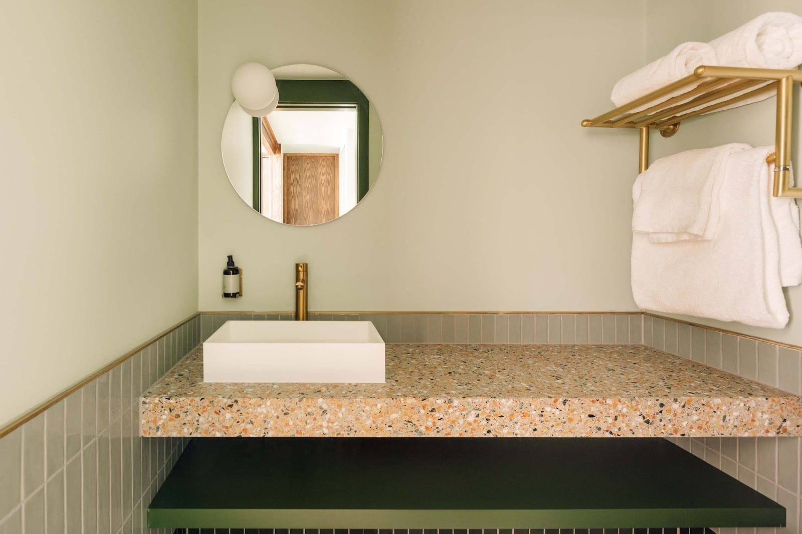

*The bed sits in a timber frame with a sofa alongside it, so the studio doubles as a sitting room.*

### Cove Landmark Pinnacle

*Mid-range · studios and apartments · 15 Westferry Road, E14 8FQ · Heron Quays DLR nearest, Jubilee 8 min*

**[Cove Landmark Pinnacle](hotel:cove-landmark-pinnacle)** is serviced apartments inside Landmark Pinnacle, a residential tower at the western end of Marsh Wall, so the neighbours live here and the ground floor is a lounge and coworking space. The basic Studio has a kitchenette; the Large Studio and the apartments have a full kitchen with a hob, dishwasher and washer-dryer. A One Bedroom is 48 m², and the One Bedroom with Internal Balcony is 55 m² and sleeps three. The building's 27th-floor lounge has an indoor playground and a garden (ask at the desk for access), and cots are available. Cleaning is weekly, and the 56th-floor gym is only for guests staying seven nights or more.

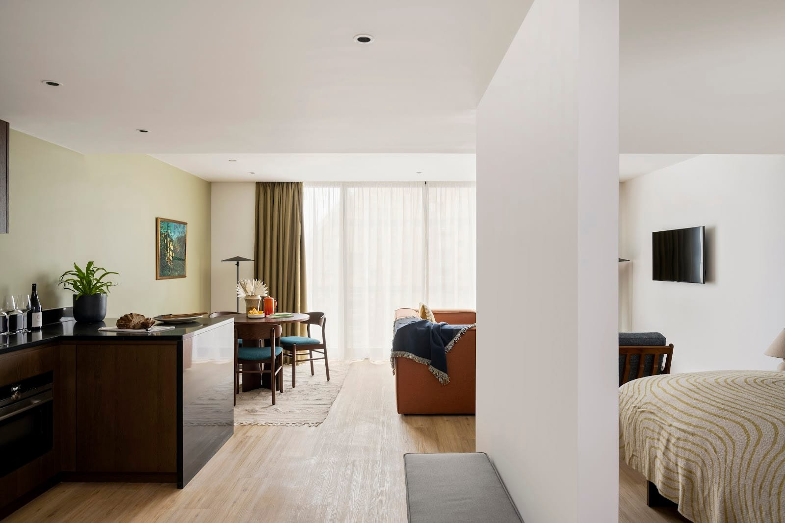

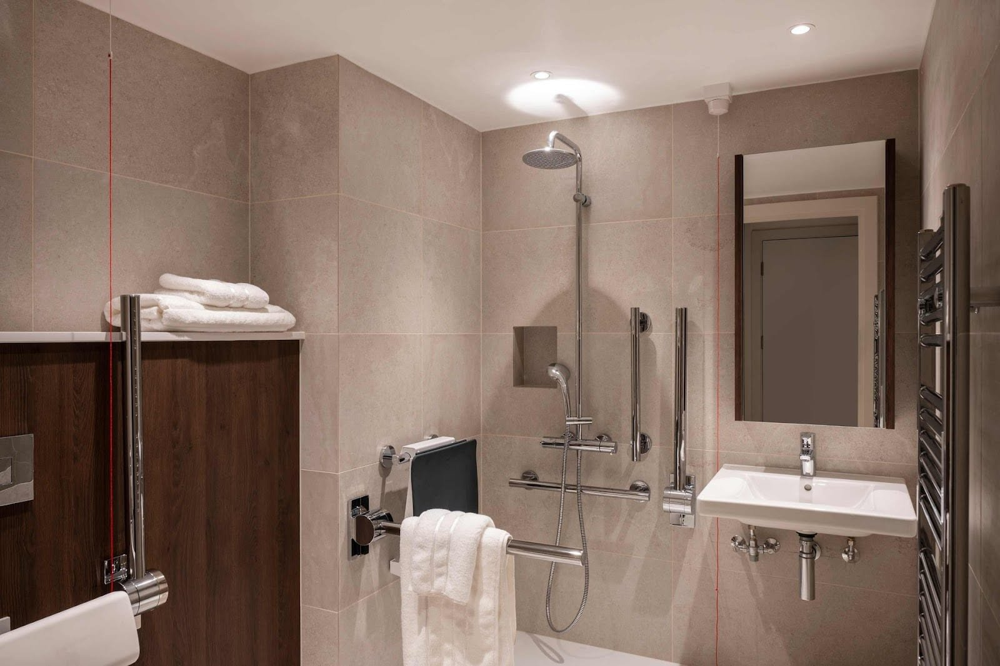

*Left: an open-plan Large Studio, with a full kitchen and oven; the basic Studio has only a kitchenette. Right: the wet room in an accessible apartment, with a fold-down seat and grab rails.*

### Marriott Executive Apartments London, Canary Wharf

*Studios to two-bedroom apartments · 22 Hertsmere Road, E14 4ED · West India Quay DLR 1 min*

**[Marriott Executive Apartments](hotelscom:h1088893)** share a building and front desk with the Marriott hotel on West India Quay. Every apartment, from a studio to a two-bedroom, has a full kitchen, a dining area and floor-to-ceiling windows. Housekeeping comes twice a week, there is a laundry on site, and guests use the hotel's 24-hour gym and sauna. You must be 18 to check in, and pets are not allowed.

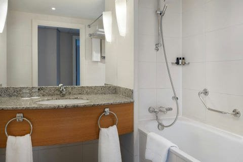

*An apartment bathroom: a bath with a shower over it and a grab rail.*

## Hotels on the estate and the docks

### Canary Riverside Plaza London, Vignette Collection

*141 rooms and suites · 46 Westferry Circus, E14 8RS · Heron Quays DLR 8 min, Jubilee 11 min*

**[Canary Riverside Plaza](hotelscom:h519049)** is the riverside hotel built as the Four Seasons Canary Wharf, now part of IHG's Vignette Collection. Rooms start at 37 m², each with a deep bath and a separate walk-in shower. **Which way the room faces is the thing to book on**: Standard rooms look over Canary Wharf, Premium rooms over the Thames. Guests use the adjoining health club and spa, which has an indoor pool, and the restaurant, Quadrato, is Italian, with a terrace and an afternoon tea. Interconnecting rooms, extra beds and cots are available for families. Canary Wharf Pier is next door: the Uber Boat takes 8 to 13 minutes to Greenwich and about 40 to the London Eye.

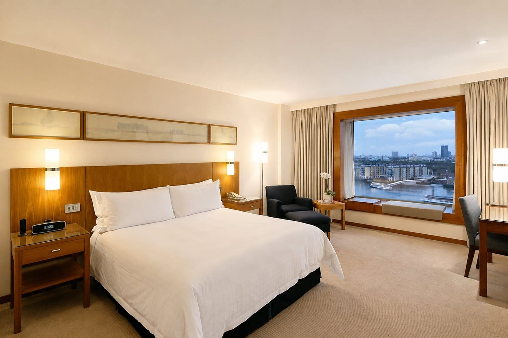

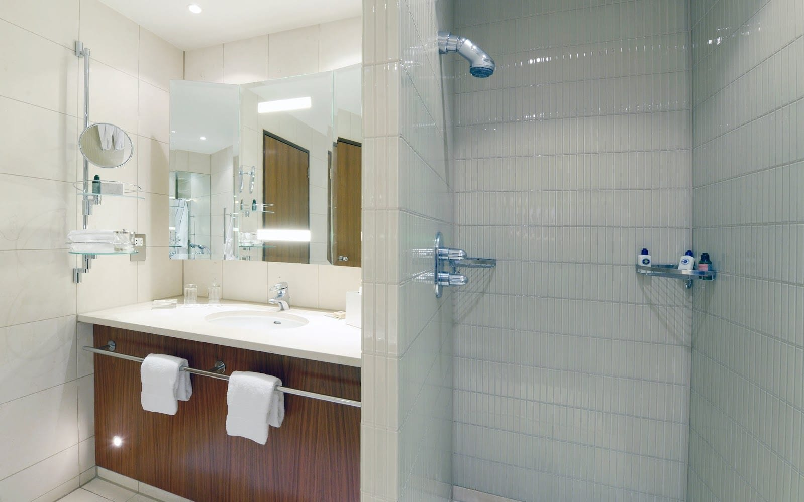

*A Thames-facing room with a window seat, the view a Premium room pays for, and the separate walk-in shower that comes with the bath.*

### London Marriott Hotel Canary Wharf

*About £200 · 22 Hertsmere Road, West India Quay, E14 4ED · West India Quay DLR 1 min, Elizabeth line 3 min*

**[London Marriott Hotel Canary Wharf](hotel:london-marriott-canary-wharf)** is the curved glass tower at the end of West India Quay, with floor-to-ceiling windows over the dock and the towers. G&Tea, its gin bar, serves afternoon tea, and the gym, with a sauna, is open 24 hours. Guests must be 18 to check in and pets are not allowed. There is no hotel car park; it points drivers to the Saba car park on West India Quay.

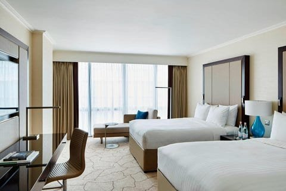

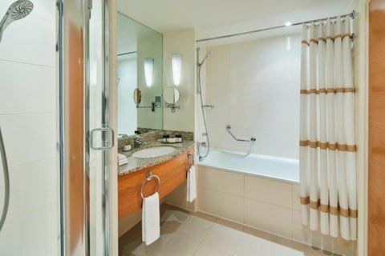

*Two double beds by the full-height windows, and a bathroom with both a bath and a separate shower.*

### Hilton London Canary Wharf

*South Quay, Marsh Wall, E14 9SH · South Quay DLR by the door, Jubilee 8 min*

**[Hilton London Canary Wharf](hotelscom:h1457899)** is on Marsh Wall beside South Quay DLR, with an executive lounge, connecting rooms and pet-friendly rooms. TwoRuba is its restaurant and bar, with a children's menu. For drivers, the on-site car park has 25 spaces and cannot be booked in advance.

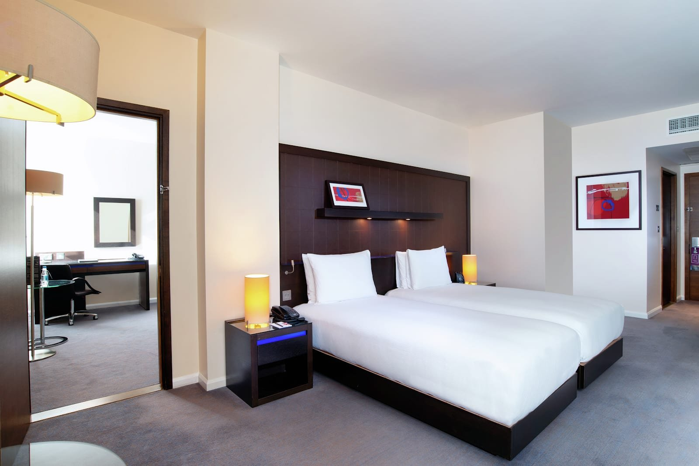

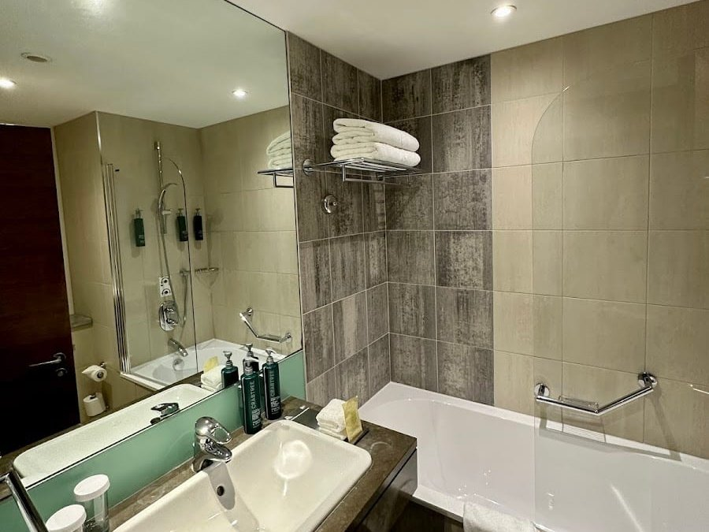

*Twin beds with a separate study through the doorway, and a bath with a shower over it.*

### Novotel London Canary Wharf

*£156–£229 · 313 rooms · 40 Marsh Wall, E14 9TP · Heron Quays DLR 2 min, Jubilee 7 min*

**[Novotel London Canary Wharf](hotel:novotel-canary-wharf)** is a 39-storey tower on Marsh Wall with an indoor pool and gym. The top three floors are Bōkan, open to non-residents: the restaurant on 37 (closed Sunday and Monday), the bar on 38 and a roof terrace on 39, all card only. A Superior Double is 21 m². **For a family, book the Studio Suite**: 40 m² with a king bed, for up to four.

*The bathroom is walled off from the bed by tinted glass, not a solid wall.*

### TRIBE London Canary Wharf

*£157–£199 · 15 Water Street, E14 5GX · Jubilee 4 min (Wood Wharf exit), Elizabeth line 8 min*

**[TRIBE London Canary Wharf](hotelscom:h83096424)** is an Accor brand, on Water Street in Wood Wharf. There are three room types, all with a king bed and a rainfall shower: **the Essential Atrium, the cheapest, looks onto the atrium rather than the city**; the Essential has a city view; the Extra is 21 m². Feels Like June, the all-day restaurant, has tables outside, and a grab-and-go counter sells coffee and meals 24 hours a day. For a gym, guests can buy a discounted day pass to Third Space, which has a pool and sauna, a short walk away.

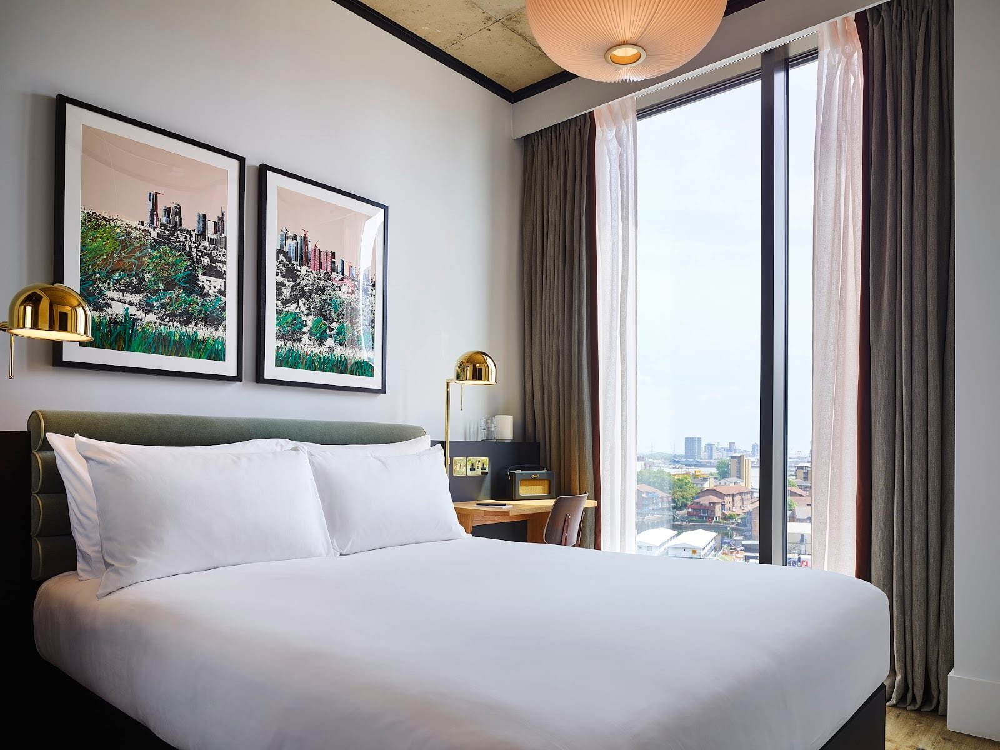

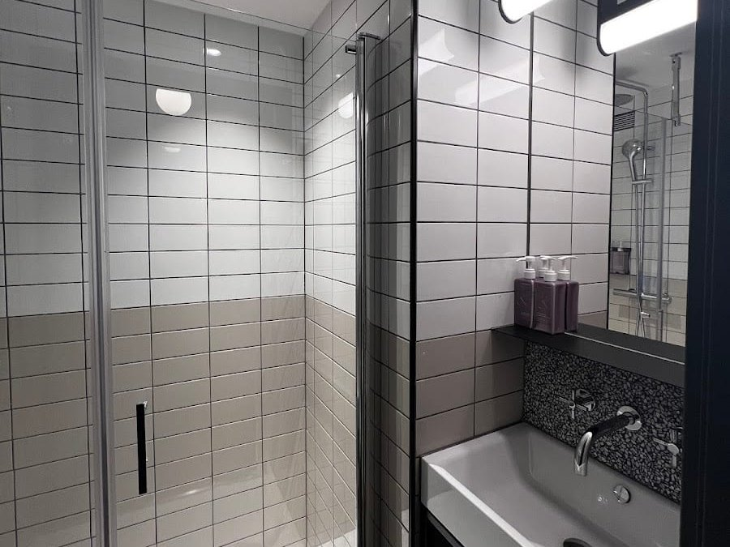

*A city-view room, the view the Essential Atrium lacks, and a glass-doored shower with no bath.*

### Radisson Blu Hotel, London Canary Wharf East

*New Providence Wharf, 5 Fairmont Avenue, E14 9JB · East India DLR 5 min*

**[Radisson Blu Hotel, London Canary Wharf East](hotelscom:h1658062)** is on the river at Blackwall, east of the estate and not in it. It has the East River Spa, with ESPA treatments, a sauna and steam room, and a 24-hour gym, and Scoff & Banter, a restaurant looking over the Thames. **The catch is the Jubilee**: it isn't walkable, so it's East India DLR, or the D3 bus, about eight minutes to Canary Wharf station.

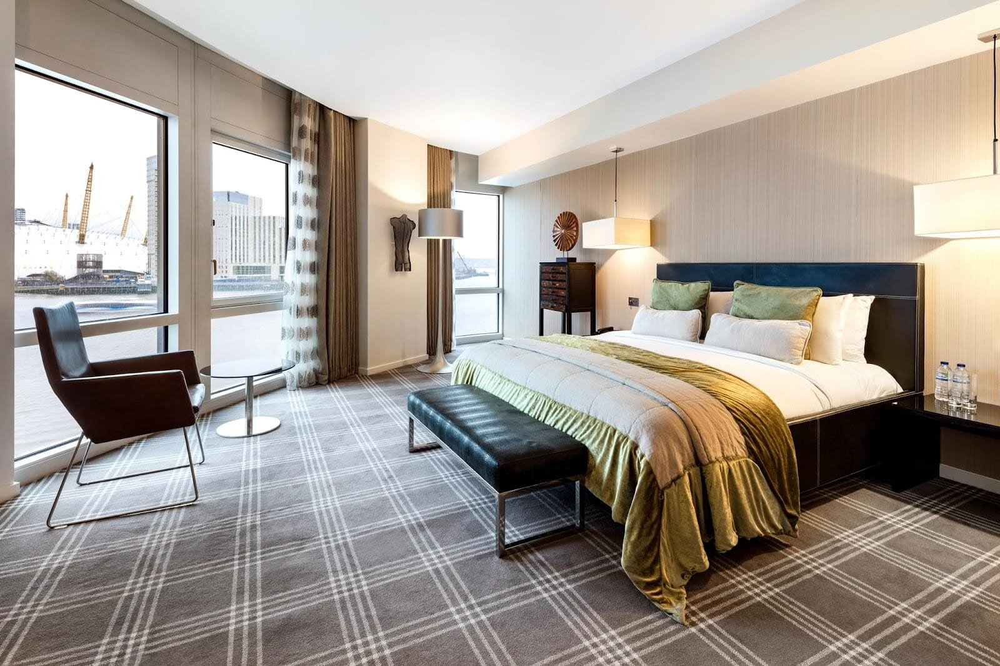

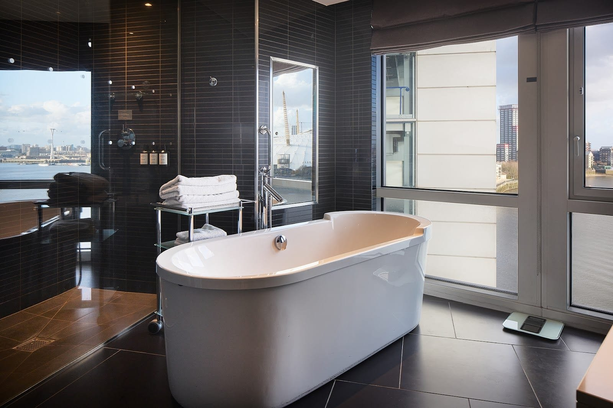

*The river side looks straight across the Thames to The O2. The bathroom shown has a freestanding bath at the window and a separate walk-in shower.*

## At the budget end

### Point A Hotel London Canary Wharf

*21 Hertsmere Road, E14 4AS · Westferry DLR 480 m, Canary Wharf station 600 m*

**[Point A](hotelscom:h9080289)** is two minutes' walk from the London Museum Docklands on West India Quay. Rooms are compact and sleep one or two, with air conditioning. **Book direct and a continental breakfast is included**: ham, cheese, fruit and pastries, with gluten-free options. Check-in is self-service in the lounge.

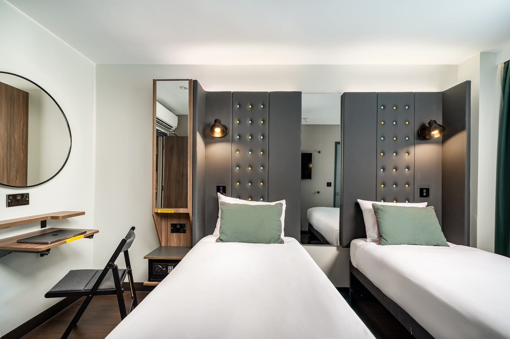

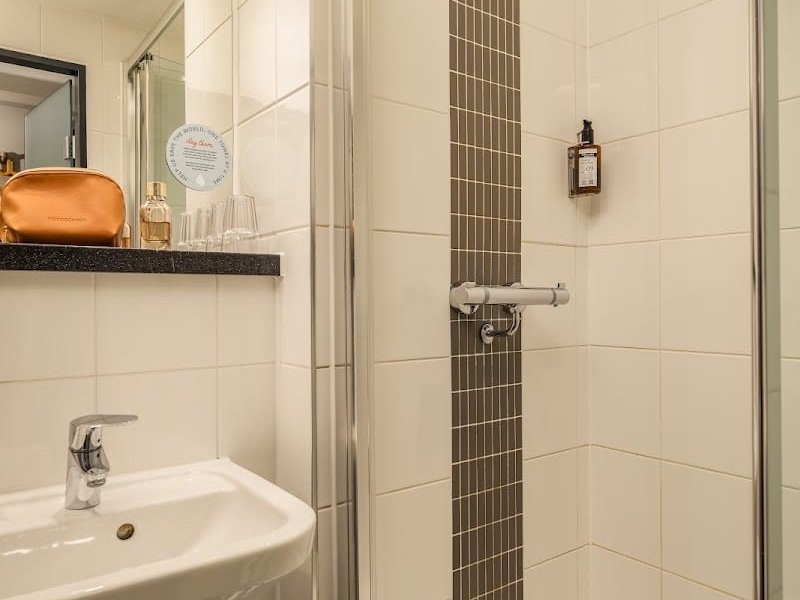

*A twin room with a fold-down desk, and a shower cubicle, no bath.*

### Premier Inn London Canary Wharf (Westferry)

*173 Limehouse Causeway, E14 8JD · Westferry DLR 1 min, West India Quay DLR 6 min, Elizabeth line 11 min, Jubilee 15 min*

**[Premier Inn London Canary Wharf (Westferry)](https://www.premierinn.com/gb/en/hotels/england/greater-london/london/london-canary-wharf-westferry.html)** sells double, twin, family and accessible rooms, all air-conditioned, and a "with a view" version of the double. Premier Plus rooms add a coffee machine and mini-fridge. Thyme, the restaurant, does breakfast and dinner, and up to two children eat breakfast free with each adult Premier Inn breakfast. There is no on-site parking; the West India Quay car park on Hertsmere Road charges £24 for 24 hours.

### Britannia International Hotel

*Marsh Wall, E14 9SJ · Canary Wharf (Jubilee) and South Quay DLR about 7 min*

**[Britannia International Hotel](hotelscom:h34182454)** is a glass-fronted block on the dock edge of Marsh Wall, with two restaurants, Jenny's and the Overstuffed Pizzeria, and two bars. The upper floors look over the Thames. It takes pets (£10 a pet for the first night, plus a £50 refundable deposit), and the on-site car park is £25 for 24 hours, first come, first served. **Check-out is 10am on weekdays**, 11am at weekends.

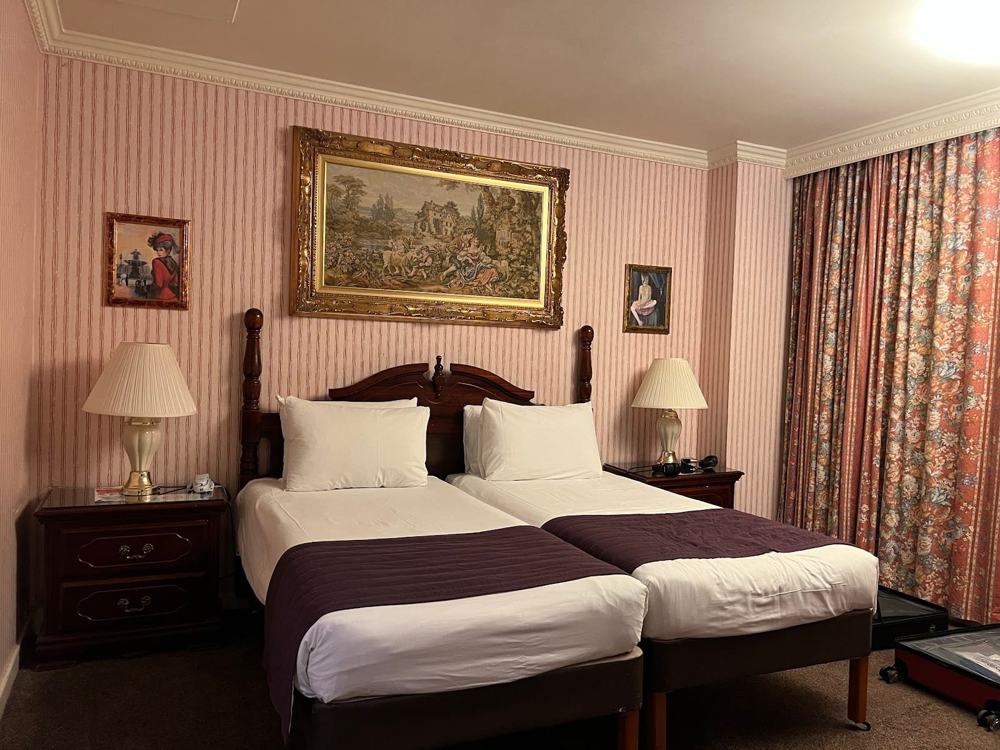

*Twin beds, striped wallpaper and a gilt-framed tapestry: traditional décor inside the glass block.*

### Holiday Inn Express London – Limehouse

*469–475 The Highway, E1W 3HN · Limehouse DLR under 5 min*

**[Holiday Inn Express London – Limehouse](hotelscom:h989491)** is outside Canary Wharf, on The Highway at Limehouse: five minutes on the DLR to Canary Wharf, and the Troxy concert venue is seven minutes' walk. **Breakfast is included.** There is no restaurant, only a lobby bar, and parking is £20 a day. You must be 18 to check in.

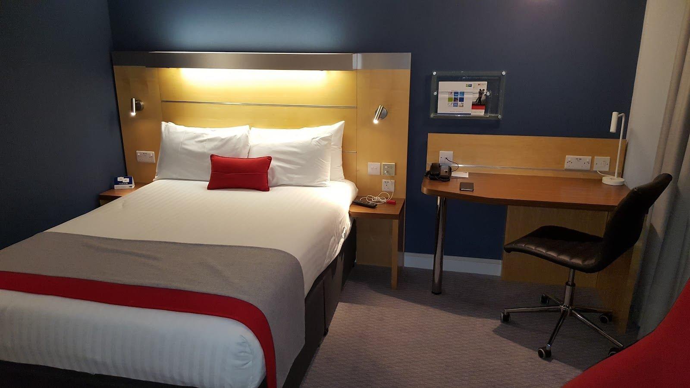

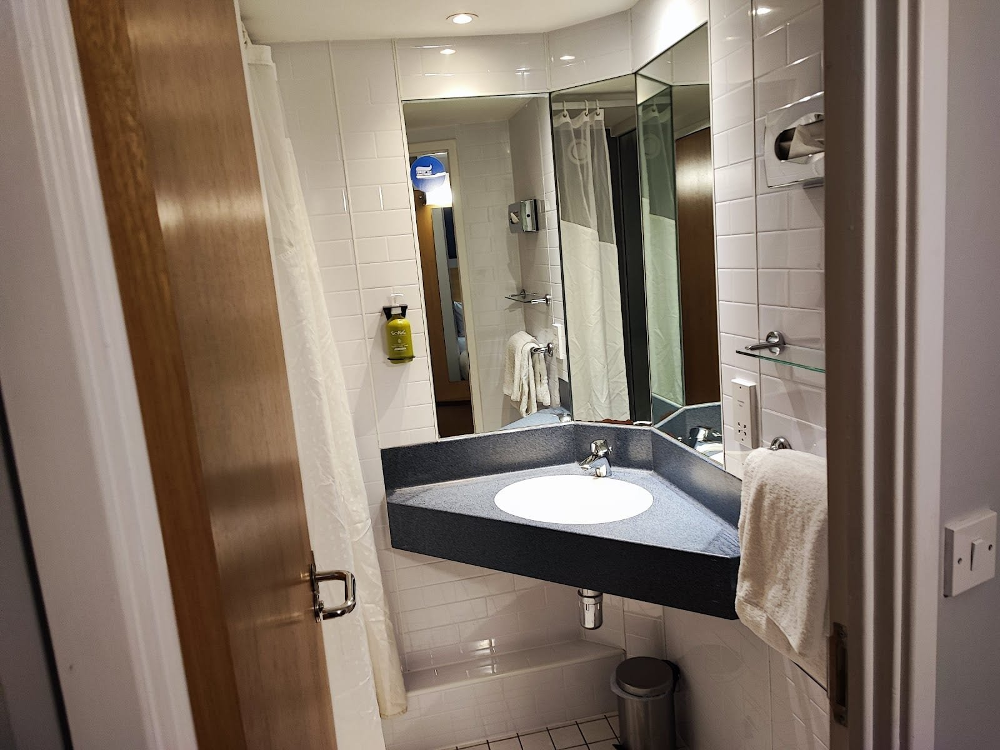

*A double with a desk, and a compact bathroom with a curtained shower.*

## Getting around

| From Canary Wharf to | Line | On the train |
| --- | --- | --- |
| **Liverpool Street** | Elizabeth line | 7 min |
| **Paddington** | Elizabeth line | 19 min |
| **Heathrow Terminals 2 and 3** | Elizabeth line | About 48 min |
| **London Bridge** | Jubilee | 6 min |
| **Westminster** | Jubilee | 11 min |
| **Bond Street** | Jubilee | 15 min |
| **North Greenwich (The O2)** | Jubilee | 2 min |
| **Stratford** | Jubilee | 10–12 min |
| **King's Cross St Pancras** | Elizabeth line, then Northern | About 23 min door to door |
| **Gatwick Airport** | Jubilee to London Bridge, then Thameslink | About 45 min door to door |
| **London City Airport** | Jubilee to Canning Town, then DLR | About 16 min door to door |

*From TfL's Journey Planner for a weekday morning, September 2026.*

The **Jubilee line and the Elizabeth line use separate stations** a few minutes' walk apart: the Jubilee under Canada Square, the Elizabeth line under Crossrail Place, north towards West India Quay. The **DLR** runs south to Greenwich and Lewisham, west to Bank and Tower Gateway, and north to Stratford. Our [Heathrow guide](/articles/heathrow-airport-to-london/) and [London City Airport guide](/articles/london-city-airport-to-london/) have the fares.

**On Friday and Saturday nights, only the Jubilee runs all night**; the DLR and the Elizabeth line stop. For a late weekend night out, the hotels a short walk from the Jubilee station (Locke, TRIBE, the Marriott) are the ones that get you home by Tube. The Radisson Blu, the Holiday Inn Express and the Premier Inn depend on the DLR, so after it stops it's a night bus or a taxi.

**By river**, the Uber Boat stops at Canary Wharf Pier, by Westferry Circus: [how the river boats work](/articles/how-to-use-london-river-boats/).

## Nearby, and the rest of the trip

For a show at The O2, one stop east, our guide to [where to stay near The O2](/articles/where-to-stay-near-the-o2/) compares Canary Wharf with Canning Town, Stratford and the peninsula. Two walks start or end here: the [Wapping to Canary Wharf pub walk](/articles/wapping-canary-wharf-walk/) arrives from the west, and the [Canary Wharf to Greenwich walk](/articles/canary-wharf-greenwich-walk/) goes under the Thames to the Cutty Sark. For a kitchen elsewhere in London, the [aparthotels guide](/articles/aparthotels-london/) compares the operators, and the [best areas to stay in London](/articles/best-areas-to-stay-in-london/) sorts the city by what the trip is for.

*Typical nightly rates for a double, checked September 2026. The dated prices are the cheapest double for two on that night, taxes included.*
