The City of London is the Square Mile, from St Paul's in the west to the Tower in the east; Spitalfields is just outside it, east of Liverpool Street. Its hotels are priced for business travellers from Monday to Thursday, so a **Friday or Saturday night is often cheaper than a Tuesday**. The cost is that some of the City shuts with the offices, so a weekend here needs a plan for dinner.

The range runs from a **£60 Z room on Fleet Street** and a hostel in St Paul's old choir school to **The Ned at about £400**. Seven of the eighteen places below are apartments with kitchens.

> 💡 **The Short Version:** On a budget, **[The Z Hotel City](hotelscom:h103089591)** on Fleet Street is £75 for a double with a window. For a family or a week, **[Locke at Broken Wharf](hotel:locke-at-broken-wharf)** has studios with kitchens by the Millennium Bridge at about £190, and **[Native King's Wardrobe](hotel:native-kings-wardrobe)** has apartments of up to three bedrooms by St Paul's. For the Tower, **[citizenM Tower of London](hotel:citizenm-tower-of-london)** is a minute from Tower Hill station with a ninth-floor rooftop bar. For a big night, **[The Ned](hotel:the-ned)** is a 1924 Lutyens bank with ten restaurants. Book Friday and Saturday nights, and eat in Spitalfields, Leadenhall Market or Shoreditch when the office streets close.

## Weekdays, weekends and the price

**Hotel prices follow the offices.** South Place Hotel's own autumn 2026 offer took up to 20% off Friday and Saturday nights and added breakfast. Price a Friday and Saturday against a Tuesday, and against the West End for the same weekend.

**What closes.** The Bank of England Museum opens Monday to Friday only. The Jamaica Wine House, off Cornhill since 1652, lists no Saturday or Sunday hours. St Paul's Cathedral is open for sightseeing Monday to Saturday; on Sundays it is open for services.

**What stays open.** Leadenhall Market says its restaurants, cafés and pubs now open through the weekend, and it runs free pop-up markets from 12 to 5pm, with SoLo Craft Fair on the second Saturday of each month. Old Spitalfields Market trades daily, Tower Hill is busy all weekend, and One New Change by St Paul's is the standby for food. Shoreditch is ten minutes' walk north of Liverpool Street.

**At night it is quiet**, especially around St Paul's and the river. The exceptions are the public rooftop bars on hotels at Tower Hill and Finsbury Square.

## Which part of the City

**St Paul's and the river** is the west: the cathedral, the lanes of Carter Lane behind it, and the Millennium Bridge to Tate Modern. Most of the apartment buildings are here, and Fleet Street runs west to the Royal Courts of Justice.

**Bank, Moorgate and Liverpool Street** is the middle and north: the Royal Exchange, Leadenhall Market and the towers, with the best train connections in the City.

**Tower Hill** is the south-east: the Tower of London, Tower Bridge and the Roman wall. It is the corner that stays busy at weekends.

**Aldgate and Spitalfields** is the east edge, where the City meets Whitechapel and Brick Lane, and where the weekends are livelier.

**Barbican and Smithfield** is the north-west: the Barbican Centre, Smithfield Market and Farringdon station.

Our [City of London area guide](/articles/city-of-london-area-guide/) covers what to see, and the [City of London walk](/articles/city-of-london-walk/) links St Paul's, Bank and the Tower in one route.

Powered by <a target="_blank" rel="sponsored nofollow noopener" href="https://www.getyourguide.com/london-l57/">GetYourGuide</a>

## Hotels around St Paul's and the river

### The Z Hotel City — the cheapest room in this guide

*£60 single, £75 double with a window · 113 rooms · 24 Fleet Street, EC4Y 1AA · Temple and Chancery Lane 7 min · [Hotels.com](hotelscom:h103089591)*

Compact rooms at the western end of Fleet Street, near the Royal Courts of Justice and Temple Church. Z publishes a from-rate for every grade: **Z Single £60, Z Inside Queen £65, Z Double £75, Z Queen £80**. The £65 Inside Queen has **no window**; the Z Double at £75 is the cheapest room with one.

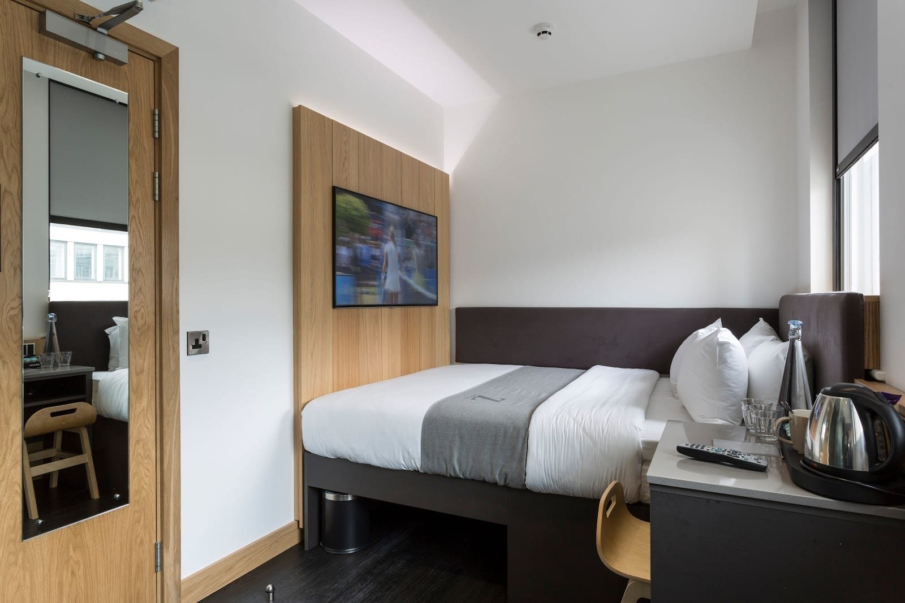

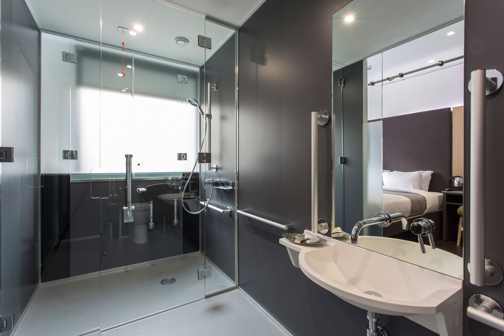

*Left: a double with a window beside the bed, which the Inside grades lack. Right: the accessible wet room, with grab rails and a red alarm cord.*

**The Z Family sleeps four in bunked queen or double beds from £100**, with its own stairs to the top bunk. There is air conditioning, a free cheese and wine hour, and Temple 24, the café, serves breakfast from 6.30 to 11am seven days a week. Our [windowless rooms guide](/articles/windowless-hotel-rooms-london/) explains the Inside grades.

### YHA London St Paul's — the hostel in the choir school

*Dorms and private rooms · 36 Carter Lane, EC4V 5AB · St Paul's Cathedral 1 min · [Hotels.com](hotelscom:h11535931)*

For nearly a hundred years this building was the school for St Paul's choirboys, and their graffiti survives in a wood-panelled former classroom. Most rooms are dormitories with bunk beds; private rooms are available too.

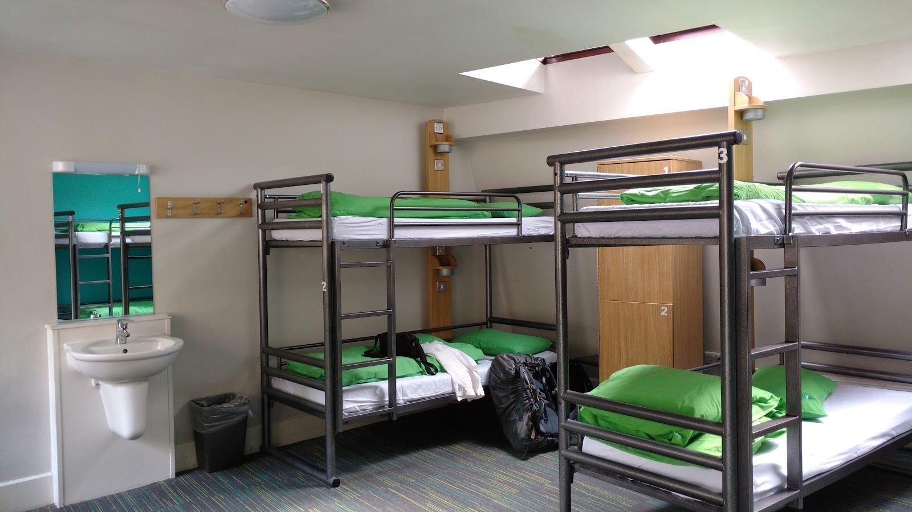

*A dormitory: numbered steel bunks under a skylight, with lockers and a washbasin in the room.*

**There is no self-catering kitchen.** Breakfast is served from 7.30 to 10am, there is a licensed bar and a 24-hour reception, and luggage lockers cost £2 or £3. Guests under 16 must be with an adult. Our [hostels guide](/articles/best-hostels-london/) compares it with the rest of London.

### Native King's Wardrobe — apartments up to three bedrooms

*£££ · Studios 36 sq m to three bedrooms 114 sq m · 53–55 Carter Lane, EC4V 5AE · St Paul's 3 min · [check prices](hotel:native-kings-wardrobe)*

Apartments in a Grade II listed building on the site of the Royal Wardrobe, where the king's state and ceremonial robes were kept from the fourteenth century. Native puts the cathedral three minutes' walk away, and St Paul's and Mansion House stations five.

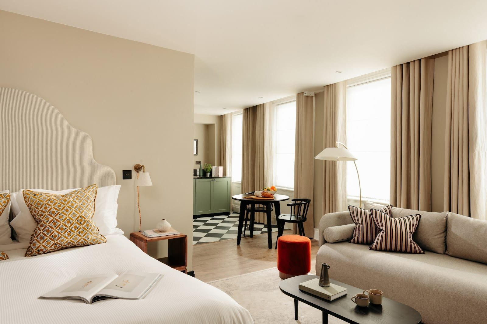

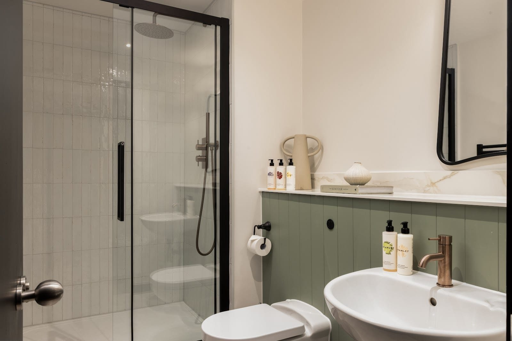

*A studio with its kitchen and a table for two beyond the bed, and a walk-in shower in the bathroom.*

**The sizes decide it.** Studios start at 36 square metres, one-bedrooms at 57, two-bedrooms at 75 and the three-bedroom at 114, so a large family or group can take one apartment. Each apartment has a kitchen and its own washer-dryer. Counter, the café-bar, is in the courtyard, and paid parking is underneath.

### Locke at Broken Wharf — studios on the river by the Millennium Bridge

*About £190 · 113 apartments · 2 Broken Wharf, EC4V 3DT · Mansion House, Blackfriars and Cannon Street all nearby · [Hotels.com](hotel:locke-at-broken-wharf)*

Studios with their own kitchens on the Thames, a short walk from the Millennium Bridge to Tate Modern and the Globe. Micro Studios are 19 square metres, City Studios 22 and Locke Studios 28; the 30-square-metre River Suites and the River View City Studios face the Thames.

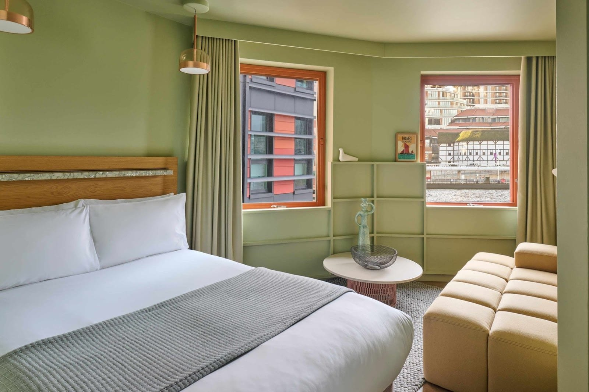

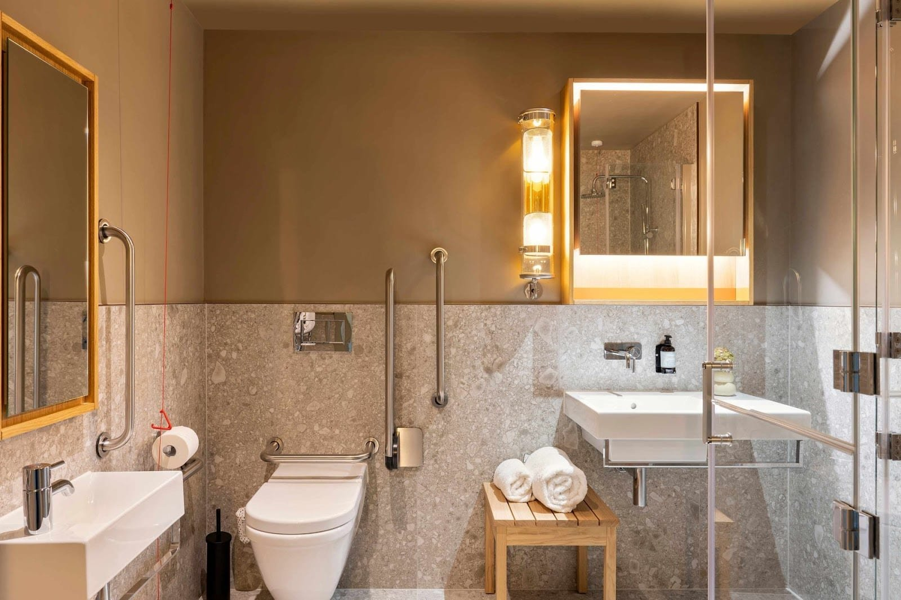

*Left: a river-facing room, with Shakespeare's Globe across the Thames. Right: an accessible bathroom with grab rails and a red alarm cord.*

Cleaning is weekly, laundry is shared, and there is a café and bar, a coworking space and a gym. Dogs are welcome at a £40 cleaning fee. Our [aparthotels guide](/articles/aparthotels-london/) compares it with the other Locke buildings.

### Cove Cannon Street — a one-bedroom with a view of St Paul's

*££ · 46 Cannon Street, EC4N 6JJ · Cannon Street and Mansion House stations nearby · [check prices](hotel:cove-cannon-street)*

Studios and one-bedroom apartments between St Paul's and Bank, all with king-size beds. The Studio has a kitchenette; the Large Studio and the one-bedrooms have full kitchens, and **the One Bedroom Apartment St Paul's View** looks at the dome.

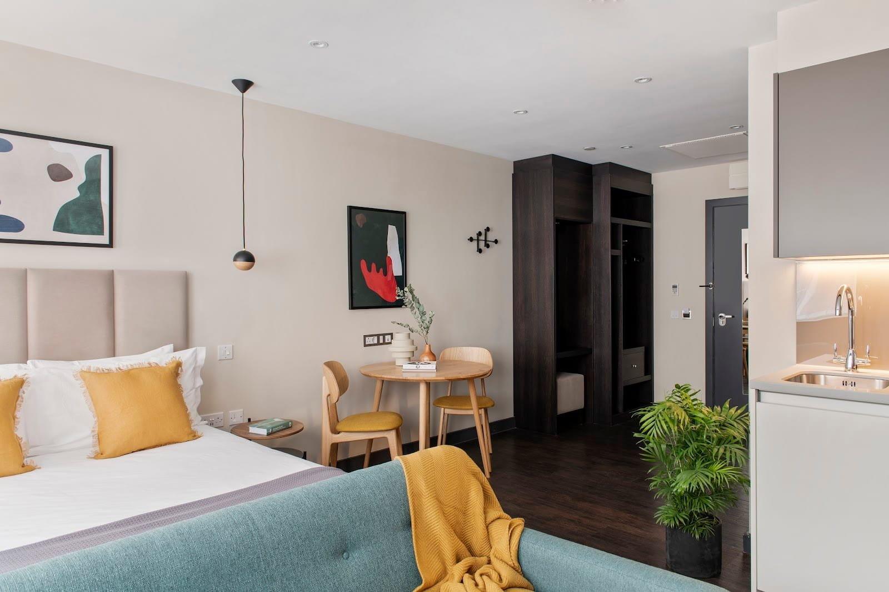

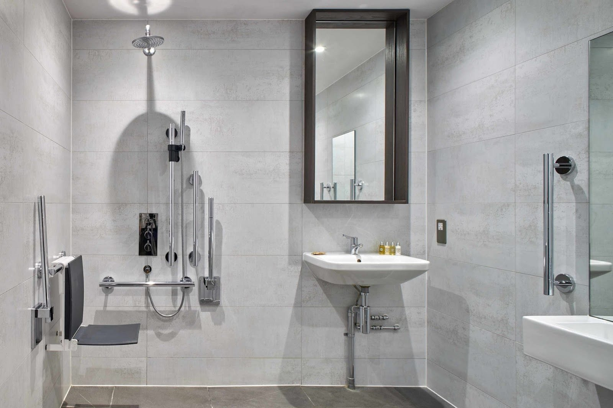

*Left: a studio, with the kitchenette on the right and a table for two. Right: an accessible wet room with a fold-down shower seat.*

Reception is 24 hours, there is a gym, a lounge and a courtyard, and cleaning is weekly. The laundry room is shared at £5 a wash and £5 a dry.

### Vintry & Mercer — the roof terrace between St Paul's and the Shard

*92 rooms · 19–20 Garlick Hill, EC4V 2AU · Beside Mansion House station · [Hotels.com](hotelscom:h19458363)*

A five-star named after two of the City's medieval trades, the wine merchants of the Vintry and the silk-selling Mercers, among the livery halls and lanes above the river.

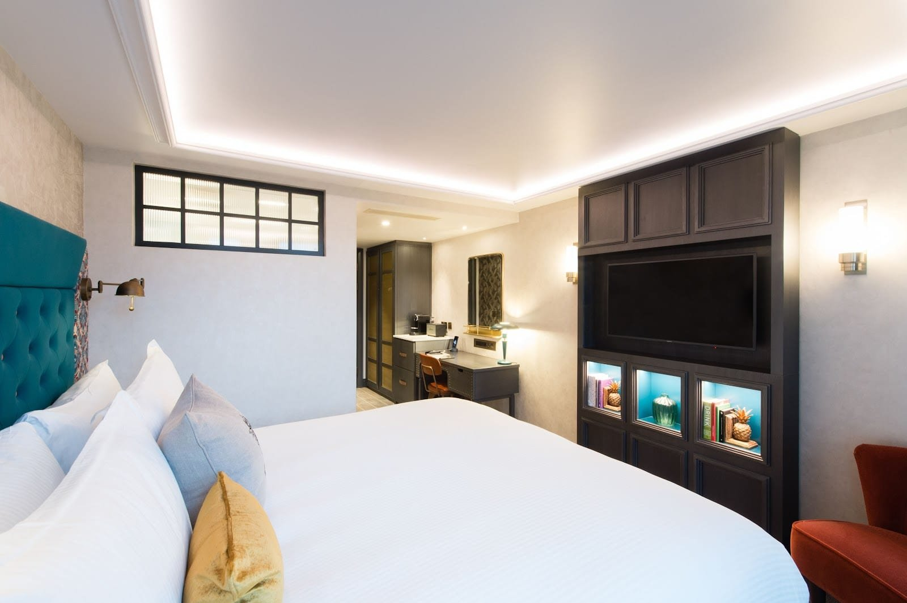

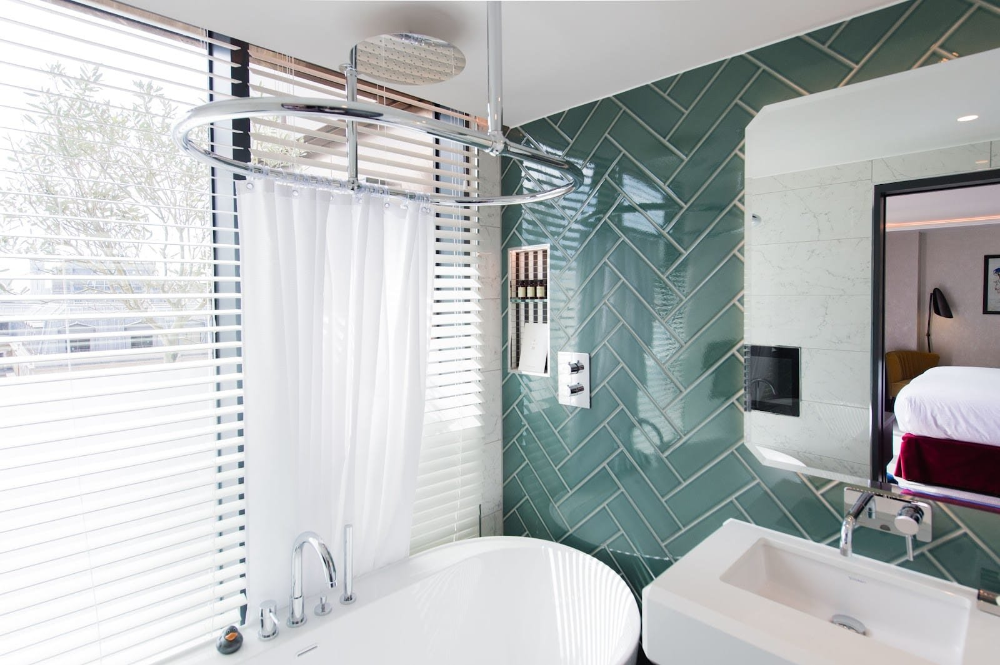

*Left: a bedroom with a teal velvet headboard and a desk by the door. Right: a bathroom with a freestanding bath under a rain shower, beside a window.*

**Mercer Roof Terrace takes in St Paul's dome and the Shard in one view**, with British cooking and a bar. Balcony Suites have their own outdoor terraces and Corner Suites floor-to-ceiling windows. DND, the basement bar, is dressed as a 1920s New York speakeasy, and Vintry Kitchen serves breakfast.

## Hotels at Bank, Moorgate and Liverpool Street

### The Ned — the bank with ten restaurants

*About £400 · 250 bedrooms · 27 Poultry, EC2R 8AJ · On the Bank junction · [check prices](hotel:the-ned)*

The Midland Bank's headquarters, built in 1924 to designs by Sir Edwin Lutyens, whose nickname gives the hotel its name, and reopened in 2017 after a four-year restoration. The **3,000-square-metre former banking hall** holds most of its ten restaurants and is open to anyone, hotel guest or not.

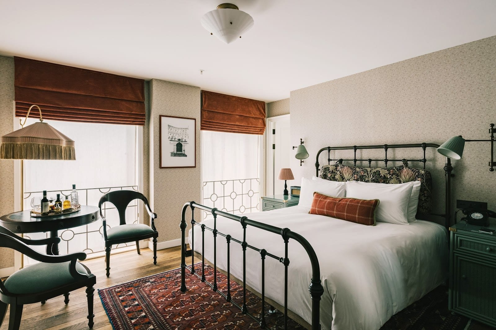

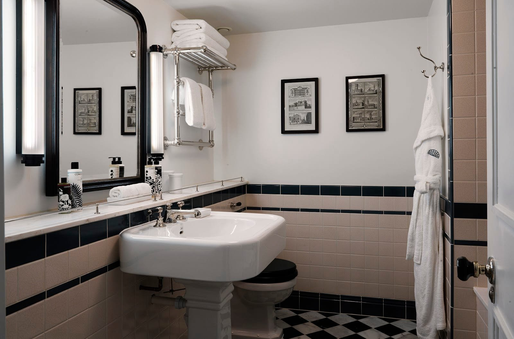

*Left: a double with an iron bedstead; there are no twins. Right: a bathroom in 1920s-style cream and black tiles, with a pedestal basin.*

**Every bedroom has a double bed; there are no twins.** Crash Pads are 17 to 19 square metres and Cosy rooms 20 to 30, and the Heritage rooms on the Grade I listed fifth floor keep their 1920s fittings. The **Two Bed Family Suite is 95 square metres**, and in-house children under six get a free main course in Millie's Lounge between 5 and 6pm.

**The rooftop pool and the Vault bar belong to Ned's Club**, which is for members and their guests; the hotel lets resident children use the rooftop pool from 7 to 10am. There is no parking.

### South Place Hotel — Angler, and a weekend offer

*£££ · 3 South Place, EC2M 2AF · Liverpool Street 5 min, Moorgate 6 min · [check prices](hotel:south-place-hotel)*

A five-star built for the City's working week, and the clearest example of weekend pricing in this guide: its own autumn 2026 offer took **up to 20% off Friday and Saturday nights, with breakfast**. Angler and the all-day Bluebird City are the two restaurants.

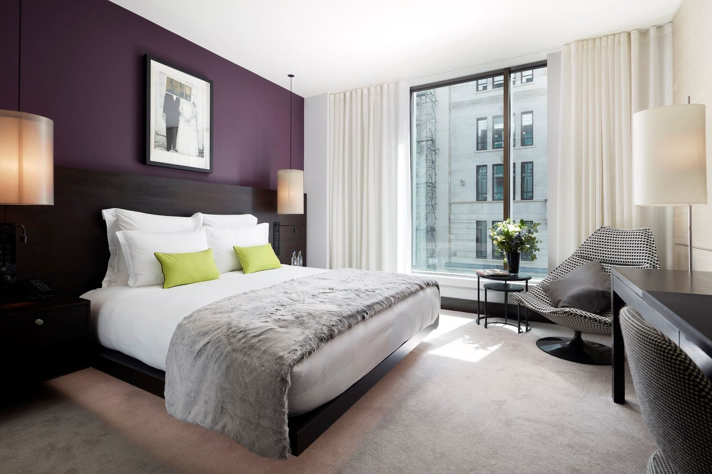

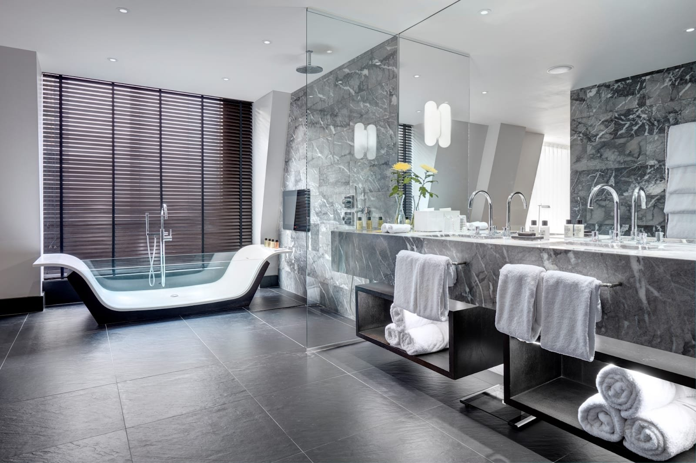

*Left: a double with a floor-to-ceiling window. Right: a suite bathroom with a walk-in shower and two basins; the glass bath comes only with the One Bedroom and Presidential Suites.*

The gym is open 24 hours, and the sauna, steam room and ice bath from 6am to 10pm. There are **two-bedroom family rooms**, and dogs stay free when booked direct.

### Montcalm Royal London House — a pool, and the Aviary on the roof

*£££ · 22–25 Finsbury Square, EC2A 1DX · Between Moorgate and Liverpool Street · [check prices](hotel:montcalm-royal-london-house)*

A five-star in a mid-century block on Finsbury Square, just north of the City boundary. **Aviary, the tenth-floor bar, restaurant and terrace, looks over the City skyline** and is open to non-residents.

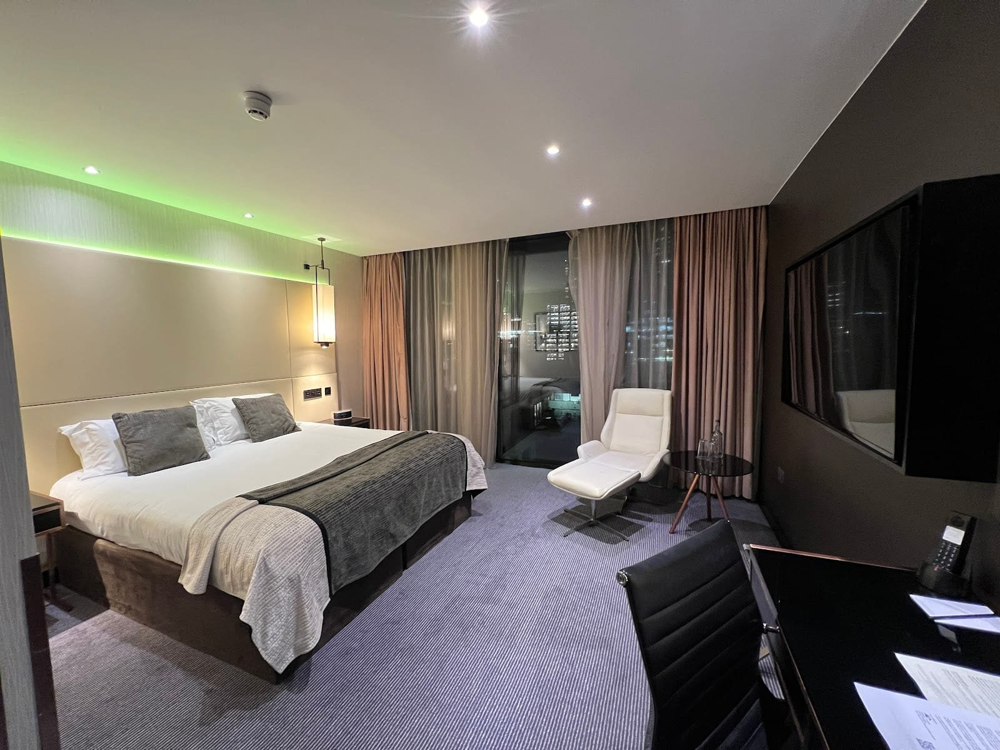

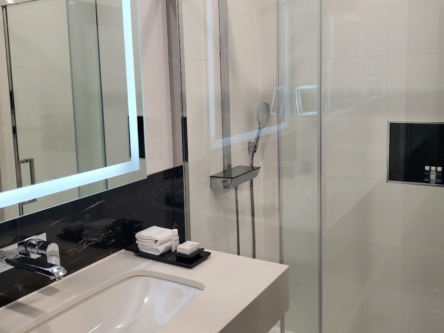

*A king room at night, its floor-to-ceiling window looking onto lit City office towers, and a walk-in shower behind a glass screen.*

The YĀTRĀ spa has **a swimming pool, a Jacuzzi, a sauna and a steam room**. Rooms start with 20-square-metre Superior Kings, Deluxe rooms come with a king or two single beds, and suites run to about 40 square metres.

### The Moorgate by Cove — apartments with a three-night minimum

*££ · 71 Moorgate, EC2R 6BH · By Moorgate station · [check prices](hotel:cove-moorgate)*

Serviced apartments on Moorgate itself, with air conditioning, king-size beds and a kitchen in every unit. **The minimum stay is three nights**, rising to four or seven on some dates, so it suits a week rather than a weekend.

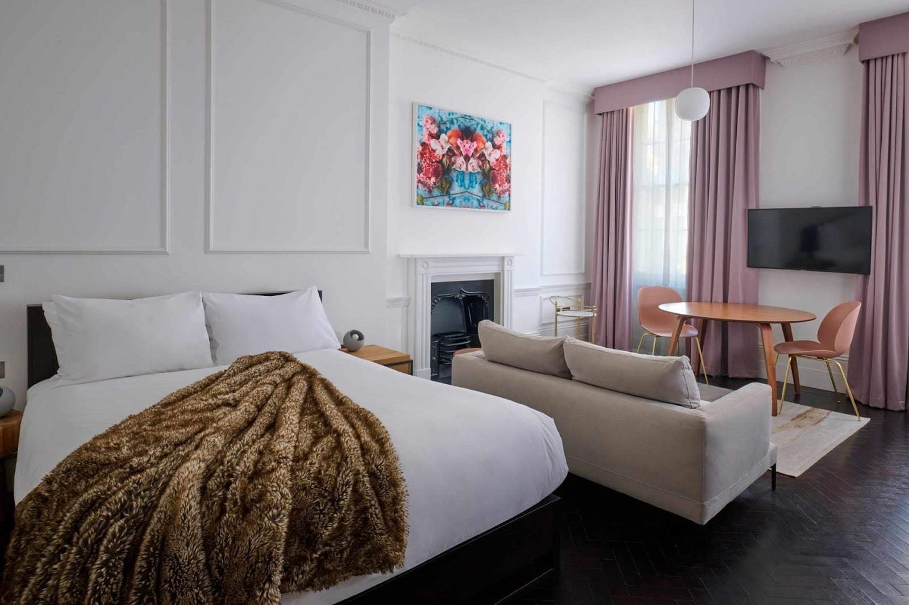

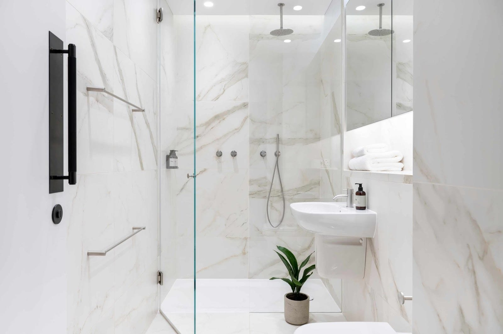

*An apartment with a period fireplace, a sofa and a table for two, and a walk-in rain shower in the bathroom.*

Check-in is self-service, around the clock. The One Bedroom Apartment with Washer/Dryer is the grade that has one in the flat.

## Hotels at Tower Hill

### Four Seasons Hotel London at Tower Bridge — the Port of London Authority's headquarters

*££££ · 89 rooms and 11 suites · 10 Trinity Square, EC3N 4AJ · Tower Hill · [check prices](hotel:four-seasons-tower-bridge)*

The 1922 Port of London Authority building by Edwin Cooper, facing the Tower across Trinity Square Gardens, opened as a Four Seasons in January 2017. It traded as Four Seasons Hotel London at Ten Trinity Square before its renaming, and many guides still use that name. Its UN Ballroom hosted the first reception of the United Nations General Assembly in 1946.

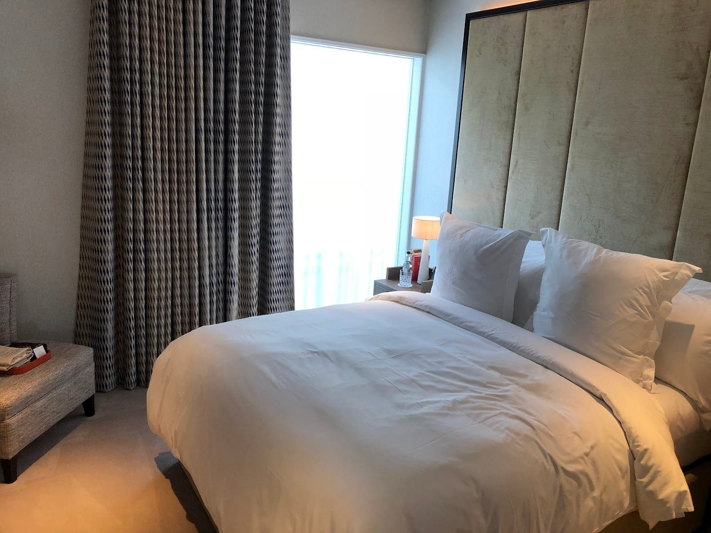

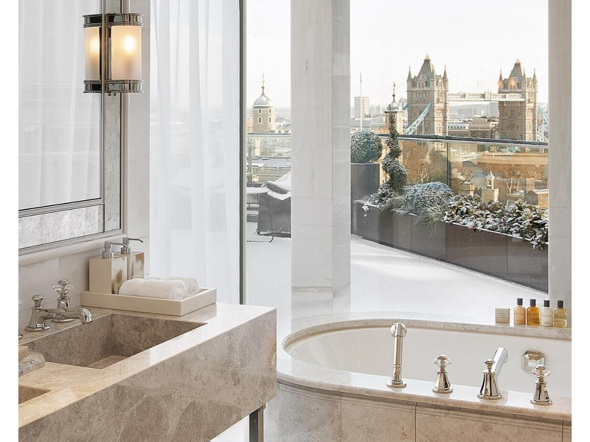

*Left: a double, with a headboard panelled almost to the ceiling. Right: a marble bathroom opening onto a terrace facing Tower Bridge, which not every room has.*

**There is a 14-metre indoor pool**, with a vitality pool, sauna, steam room and eight treatment rooms. The restaurants are Mei Ume and Cooper's Cut, and the bar is the Rotunda Bar and Lounge.

### citizenM Tower of London — 370 rooms and a rooftop bar

*££ · 40 Trinity Square, EC3N 4DJ · Tower Hill 1 min · Check-out 11am · [check prices](hotel:citizenm-tower-of-london)*

A large citizenM directly by Tower Hill station, now a Marriott brand, so **Bonvoy points apply**. Every room is the same: an XL king bed, a rain shower and a tablet that runs the blinds, lights and TV.

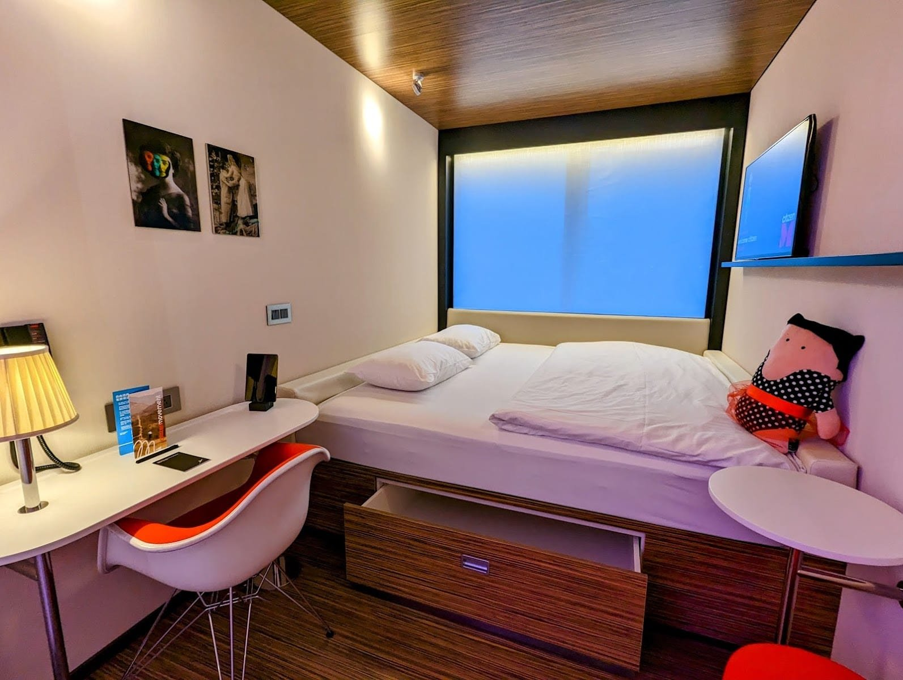

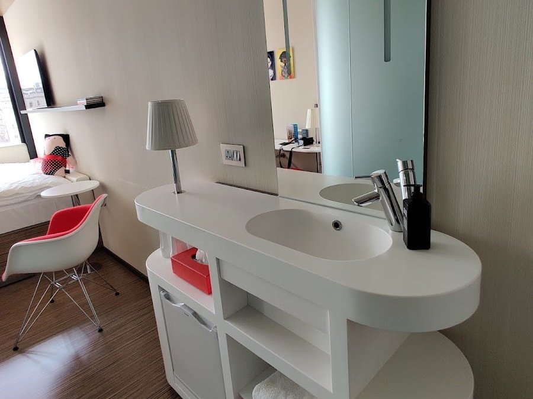

*The bed runs wall to wall under the window, and the basin stands in the bedroom, outside the frosted shower pod.*

**Rooms are for two adults**, so families need two. cloudM, the ninth-floor rooftop bar, looks over the Tower of London, and canteenM serves food and drink 24 hours a day.

### DoubleTree by Hilton London – Tower of London — Savage Garden on the twelfth floor

*£££ · 7 Pepys Street, EC3N 4AF · Tower Hill and Fenchurch Street a few minutes · [check prices](hotel:doubletree-tower-of-london)*

**Savage Garden, the twelfth-floor rooftop bar, faces the Tower and Tower Bridge** and runs a weekend brunch; it takes bookings from the public, not only guests.

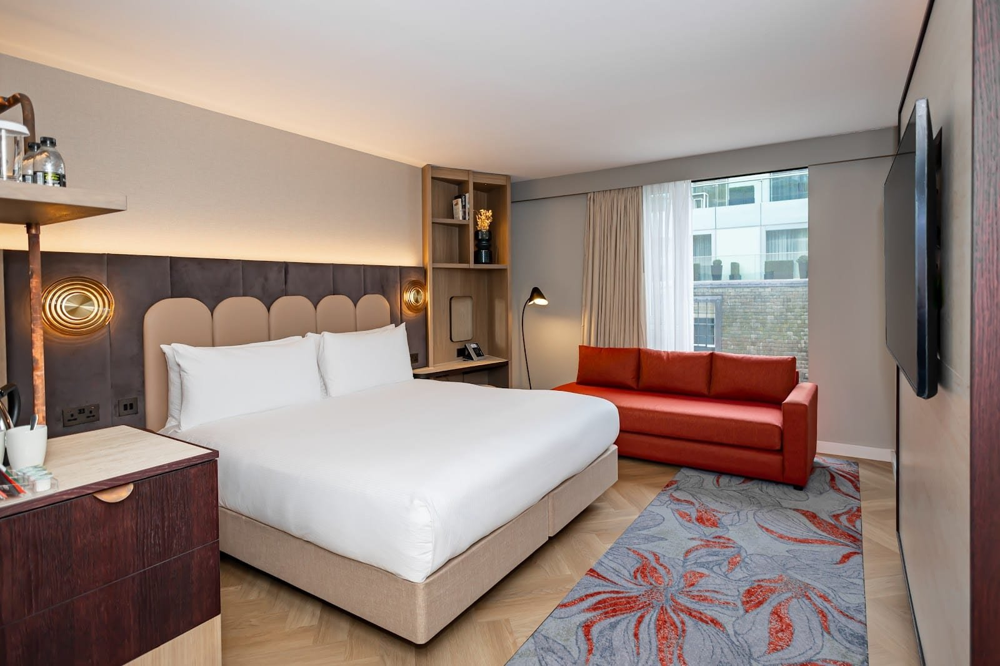

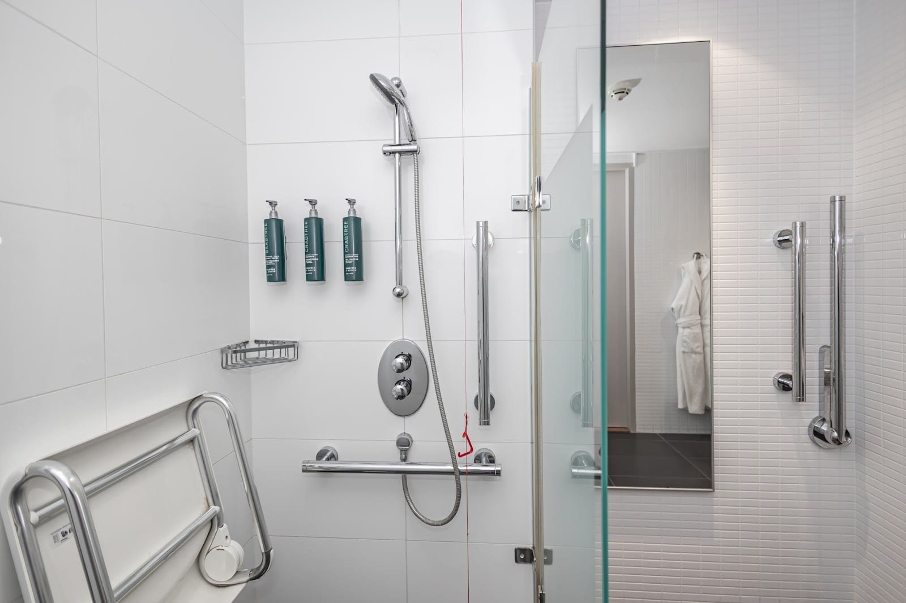

*Left: a king room with a sofa by the window. Right: an accessible shower with a fold-down seat and grab rails.*

Connecting rooms are available, and dogs are allowed in bedrooms but not in the café, the rooftop bar or the executive lounge.

### Cheval Three Quays — apartments looking at the Tower

*££££ · 159 apartments · 40 Lower Thames Street, EC3R 6AG · Tower Hill 350m · [check prices](hotel:cheval-three-quays)*

Serviced apartments on the river 75 metres from the Tower of London, from studios to two-bedroom apartments and penthouses, all with fully equipped kitchens. **The view is sold by grade**: Urban View, River View and Tower View, so book the name you want.

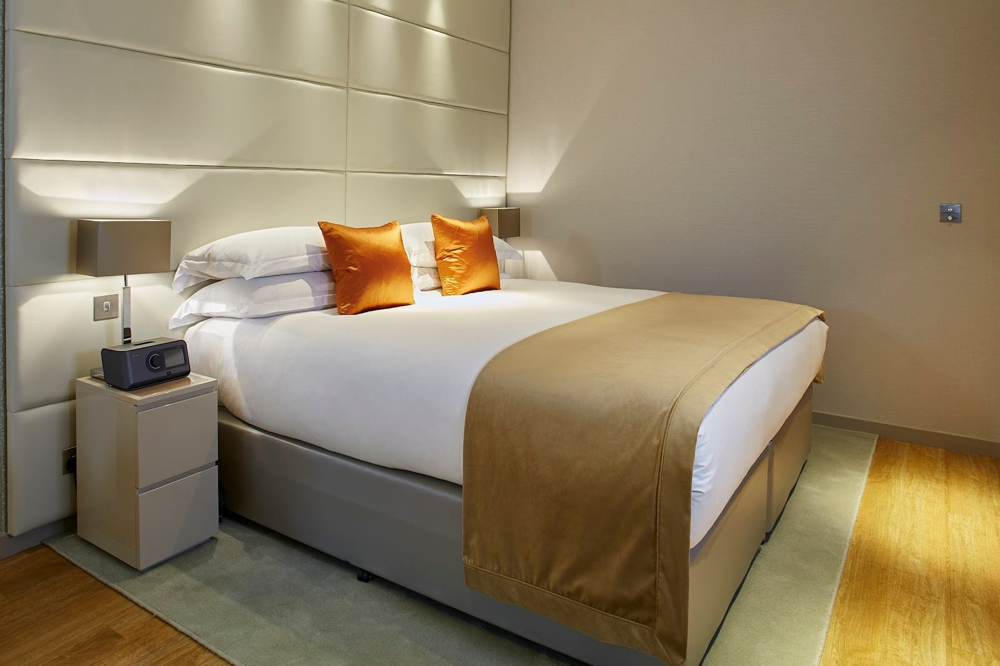

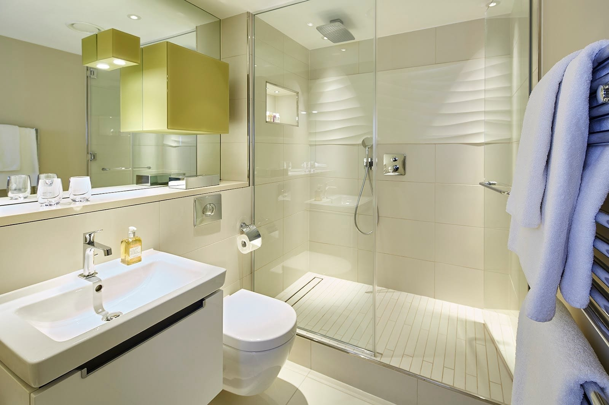

*An apartment bedroom, and a walk-in rain shower in the bathroom.*

Stays run from one night, although the Deluxe Two Bedroom River View Suite has a three-month minimum.

## Hotels in Aldgate and Spitalfields

### Leman Locke — studios a minute from Aldgate East

*££ · 171 studios and suites · 15 Leman Street, E1 8EN · Aldgate East 1 min, Liverpool Street 10 min · [Hotels.com](hotel:leman-locke)*

Studios with kitchens above Frequency, the ground-floor coffee shop and bar. **Micro Studios are 19 square metres, Locke Studios 30**, and One Bedroom Suites 39, including a twin and an accessible version. Sky Studios and Sky Level Suites are on the upper floors with the views.

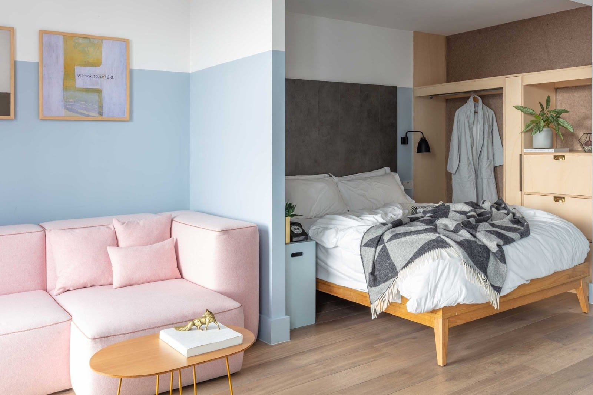

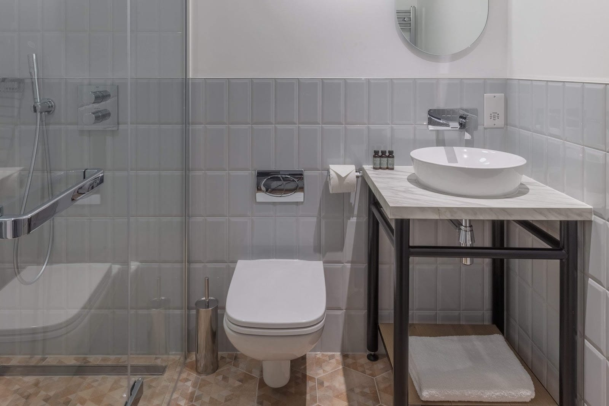

*A studio with the bed in an alcove and a pink sofa, and a walk-in shower in the bathroom.*

**Micro Studios have a hob, fridge and dishwasher; the 30-square-metre Locke Studios add a washer-dryer.** Interconnecting apartments are available, cleaning is weekly, and there is a gym, a yoga studio and parking. Brick Lane and the Whitechapel Gallery are a few minutes east.

### Buckle Street Studios by Locke — the smaller, cheaper Locke next door

*££ · 103 rooms · 21 Buckle Street, E1 8DB · Aldgate East a few minutes · [check prices](hotel:buckle-street-studios)*

Locke's second building in Aldgate, a minute from Leman Locke, whose gym and café its guests use. **Hotel Rooms are 16 square metres with no kitchen; Cosy Studios are 18 with a kitchenette**, and both come in interconnecting pairs. The laundry is shared. The **Two Bedroom Suite, 47 square metres, sleeps four** with a full kitchen and a washer-dryer, and cots and highchairs are available.

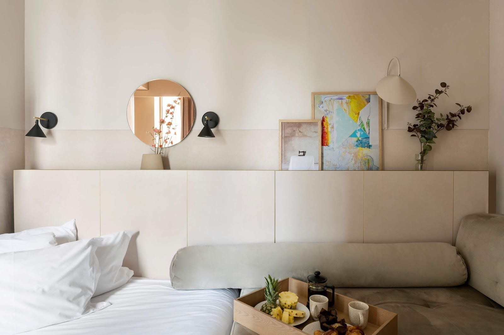

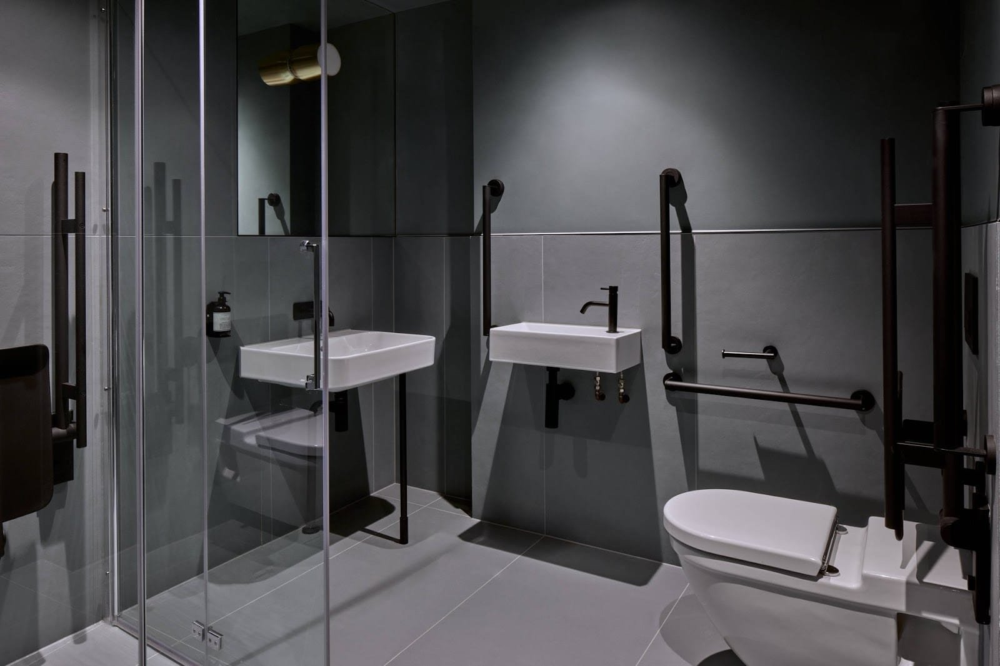

*Left: a room with the bed and a daybed under one headboard. Right: an accessible bathroom with grab rails and a fold-down shower seat.*

**Batty Langley's** on Folgate Street, the candlelit Georgian townhouse seven minutes from Liverpool Street, is the other hotel in Spitalfields. It is covered in our [Shoreditch guide](/articles/where-to-stay-shoreditch/), with the hotels north of Commercial Street. Our [Shoreditch and Spitalfields walk](/articles/shoreditch-spitalfields-walk/) ends at Petticoat Lane, a few minutes from both Locke buildings.

## Hotels at the Barbican and Smithfield

### Montcalm Brewery — Whitbread's brewery, by the Barbican

*235 rooms · 52 Chiswell Street, EC1Y 4SA · Barbican Centre a few minutes · [Hotels.com](hotelscom:h4269455)*

Whitbread's eighteenth-century brewery, now a hotel with Georgian sash windows onto Chiswell Street. **The Jugged Hare**, the restored pub in the building, serves a daily changing menu, and the Chiswell Street Dining Rooms serve modern British food and afternoon tea.

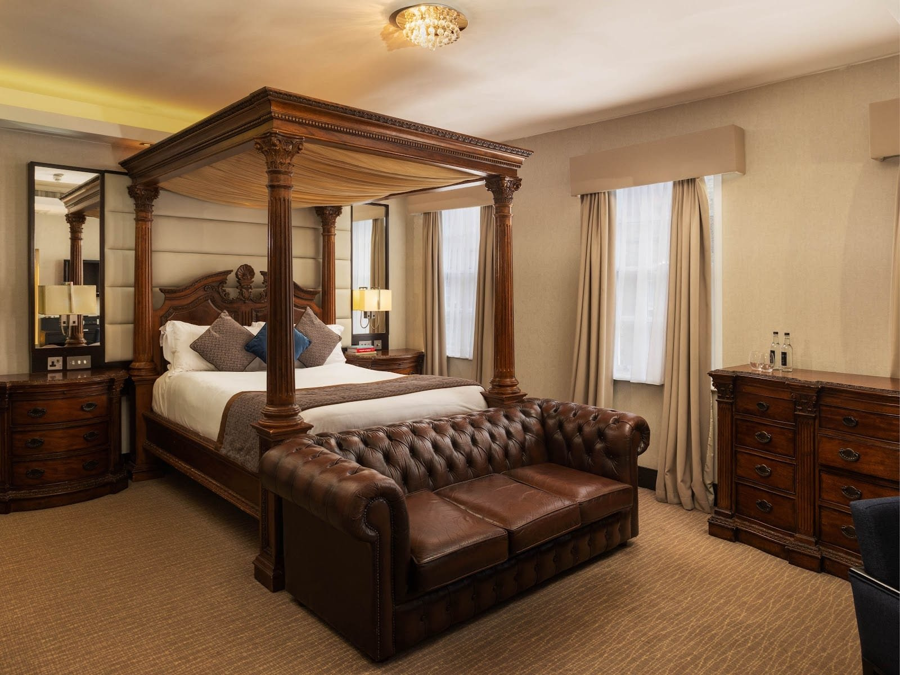

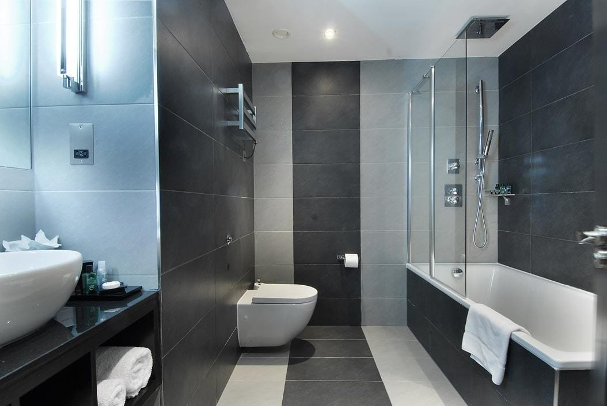

*Left: the Montcalm Residence, a 40-square-metre grade with a four-poster and Club Lounge access. Right: a bathroom with a shower over the bath.*

Rooms start at 15 square metres for a single and run to 45-square-metre suites, including family suites. The Barbican Centre is a few minutes' walk; our [Barbican guide](/articles/barbican-centre-guide/) covers the programme.

### The Fox and Anchor — six rooms above a Smithfield pub

*6 rooms · 115 Charterhouse Street, EC1M 6AA · Farringdon 4 min · Check-out 1pm · [Hotels.com](hotelscom:h21899561)*

A Young's pub on the edge of Smithfield Market with six bedrooms on the first floor, dressed in damask and velvet. Each has an ensuite shower, an honesty bar and a Nespresso machine. Several also have a freestanding roll-top bath, and **the feature room adds a private terrace and a copper roll-top**.

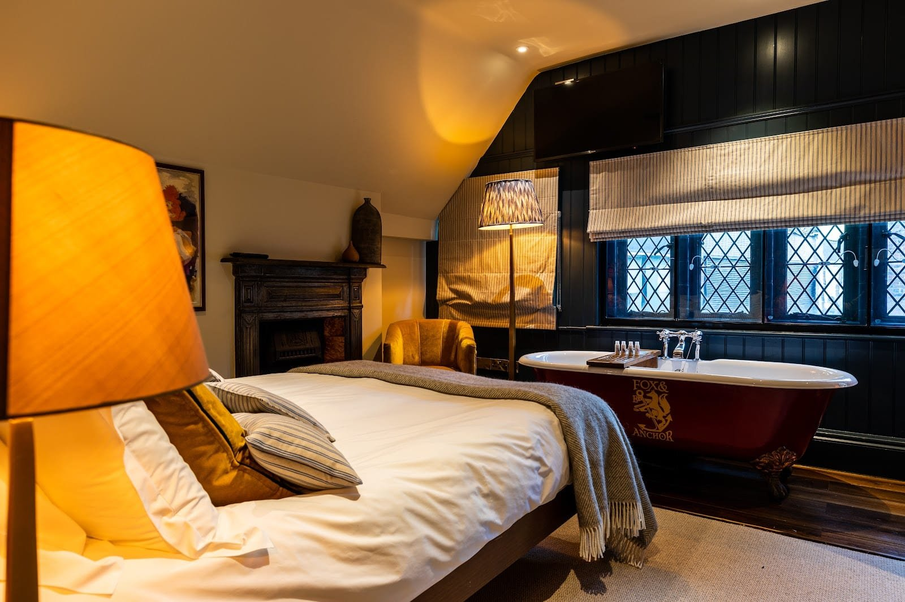

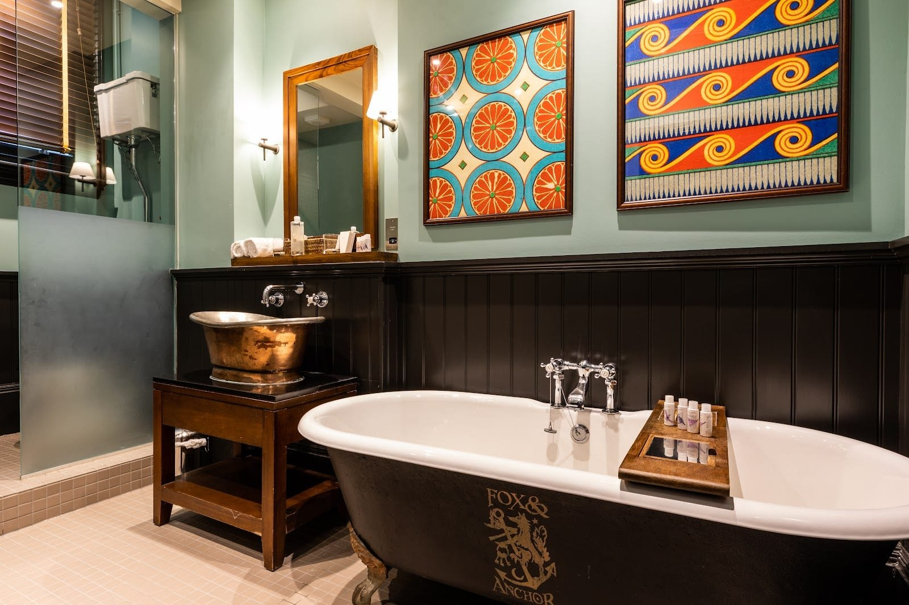

*Two of the six rooms: one with a roll-top bath beside the bed under leaded windows, the other with a roll-top in the bathroom and a copper basin.*

The pub opens at 7am for its City Boy Breakfast, the kitchen is known for steaks, and **check-out is 1pm**. Farringdon's Elizabeth line is four minutes away.

## Getting in and out

**Liverpool Street** has the Elizabeth, Central, Circle, Hammersmith & City and Metropolitan lines, the Overground, and the Stansted Express. Its Elizabeth line platforms connect underground to **Moorgate**, which adds the Northern line.

**Farringdon** has the Elizabeth line and Thameslink, which runs direct to Gatwick and Luton airports and to St Pancras for the Eurostar. **City Thameslink** and **Blackfriars** are on the same line.

**Bank and Monument** are one interchange: Central, Northern, Waterloo & City, District, Circle and the DLR to London City Airport and Canary Wharf. **Tower Hill** is District and Circle, with Tower Gateway on the DLR next door. **St Paul's** is Central; **Barbican** is Circle, Hammersmith & City and Metropolitan, the direct line to King's Cross St Pancras.

**Heathrow:** the Elizabeth line runs direct to Farringdon and Liverpool Street; our [Heathrow guide](/articles/heathrow-airport-to-london/) compares the routes.

**Across the river:** the Millennium Bridge leads to Tate Modern and Bankside, and London Bridge to Borough Market; our [South Bank guide](/articles/where-to-stay-south-bank/) and [Bermondsey guide](/articles/where-to-stay-bermondsey/) cover the hotels on that side. For how the City compares with the rest of London, see [the best areas to stay in London](/articles/best-areas-to-stay-in-london/).

*Typical nightly rates for a double, or each operator's own published from-rate where it gives one, checked 24 September 2026. The £ symbols mark a price band where a hotel publishes no rate. Walking times come from the hotels where they give them. Prices move nightly, so check your own dates.*
