Greenwich is a town of its own, in Zones 2 and 3: the Cutty Sark, the Old Royal Naval College, a covered market and a royal park with the Observatory on the hill, all within a few minutes' walk of each other. Staying here means the park before the coach parties arrive and the river at dusk; it also means a DLR ride or a train into central London every morning.

Where you sleep decides which station you use, how far you walk to the park, and how you get home after midnight. Our [Greenwich area guide](/articles/greenwich-area-guide/) covers the sights, the market and where to eat.

> 💡 **The Short Version:** For the sights, stay in the **town centre**: **[ibis London Greenwich](hotelscom:179227)** is on Stockwell Street, a few minutes from the park gates and the market. For a family of four, **Novotel London Greenwich** sells rooms for four beside Greenwich station, and **Staycity** has one-bedroom apartments with kitchens on the same road. On a budget, **Zedwell Greenwich** is **£66 to £145** for a windowless room. For a village and a heath rather than a high street, **The Clarendon** in Blackheath has free parking. For a show at The O2, see our guide to [where to stay near The O2](/articles/where-to-stay-near-the-o2/). And plan the late nights: **the DLR's last train from Bank leaves at 00:33**, and after that it is the 24-hour 188 bus.

## Which part of Greenwich

| Part | Stations | Hotels | What it's like |
| --- | --- | --- | --- |
| **Town centre and the Cutty Sark** | Cutty Sark DLR, Greenwich (DLR and rail), Greenwich Pier | ibis, Admiral Hardy, The Mitre, Novotel, Premier Inn, Travelodge, Staycity, Zedwell | The market, the pubs and the Naval College; the market trades daily, 10am to 5.30pm |
| **Blackheath and the park's edges** | Blackheath, Maze Hill and Westcombe Park (rail) | The Clarendon, The Pelton Arms, The Angerstein | A village on a heath, and residential East Greenwich; trains only, no DLR |
| **Greenwich Peninsula** | North Greenwich (Jubilee) | InterContinental, Holiday Inn Express, Radisson RED, The Pilot | The O2, new towers and the river; a bus ride from the sights |
| **Deptford Bridge** | Deptford Bridge DLR, Deptford (rail) | DoubleTree, Travelodge, Staycity | A working high street and railway-arch bars, 15 to 20 minutes' walk from the Cutty Sark |

**The town centre** runs from Greenwich station east along Greenwich High Road to the market, the Cutty Sark and the pier. The hotels by the station are on a busy main road, eight or nine minutes' walk from the Cutty Sark; the ones on Stockwell Street and College Approach are at the market.

**Blackheath** is a separate village on the far side of Greenwich Park, with its own station and a row of independent shops, bars and restaurants. The heath separates it from the park; the Observatory is about 20 minutes' walk across it. **Maze Hill** and **Westcombe Park** stations serve East Greenwich, the streets east of the park.

**The peninsula** is North Greenwich: The O2, the cable car and the Jubilee line, about two miles north of the Cutty Sark. There is no train between the two; the 188 bus links them.

**Deptford Bridge** is the next DLR stop after Greenwich towards Lewisham, on the A2 at the foot of Blackheath Road. Deptford Market Yard, under the railway arches by Deptford station, has food stalls and bars.

## Hotels in the town centre

### ibis London Greenwich — 38 rooms by the market and the park

*30 Stockwell Street, SE10 9JN · Cutty Sark DLR 5 min · Check-in 3pm, out noon · [Hotels.com](hotelscom:179227)*

An Accor economy hotel on Stockwell Street, between the market and the park, with 38 refurbished rooms and a lobby bar with a pool table and board games. Rooms sleep two, apart from **the family rooms, which sleep three on a double and a single sofa bed**, so a family of four needs two rooms. Breakfast is a continental buffet or a full English. **The hotel takes cards only, not cash.** There is a car park, and pets are welcome.

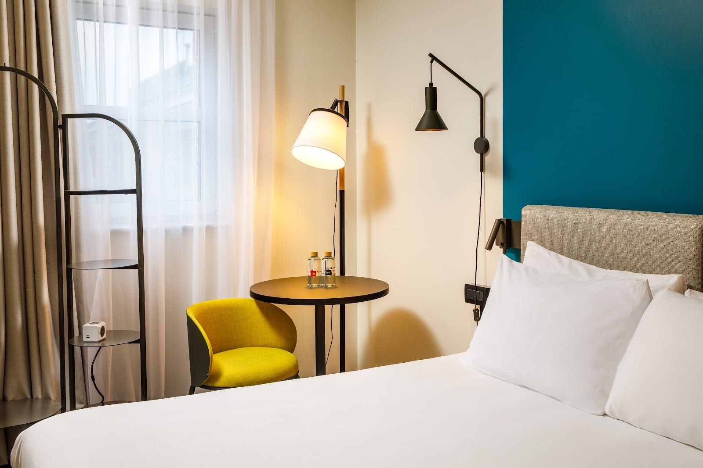

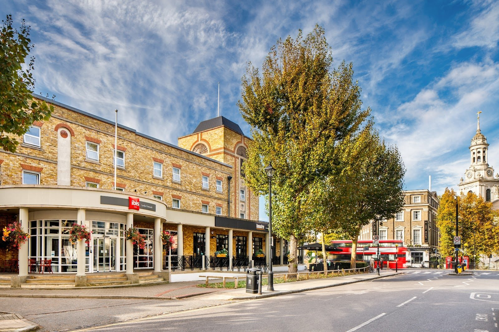

### The Admiral Hardy — seven rooms over a pub on the market

*7 College Approach, SE10 9HY · Cutty Sark DLR 2 min · [Hotels.com](hotelscom:1251944032)*

A pub on the edge of Greenwich Market, with seven bedrooms on its first and second floors: three Classic Doubles, two Classic Kings, a Superior King and **one Deluxe King that takes two adults and two children**. Rooms have a desk, a television and tea and coffee. Downstairs, the pub serves Sunday roasts and local beer and hosts weddings and parties in Clarence Hall.

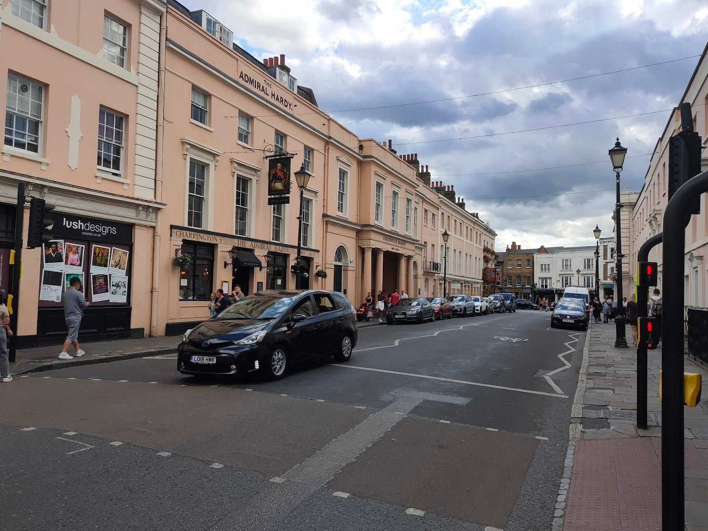

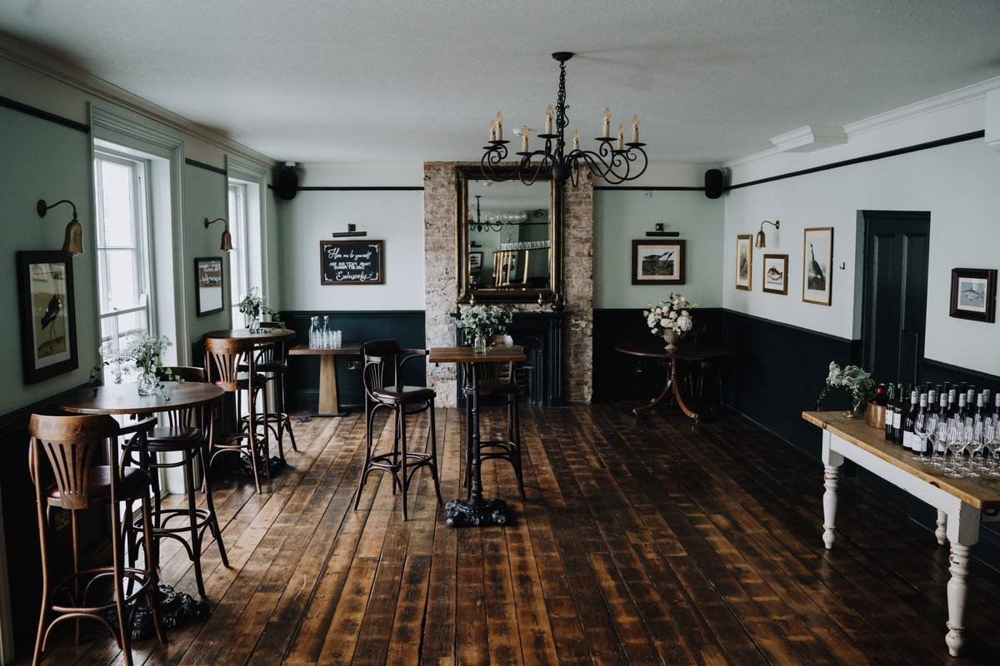

### The Mitre — 24 rooms in an 18th-century pub by St Alfege

*291 Greenwich High Road, SE10 8NA · Cutty Sark DLR 4 min, Greenwich station 4 min · [Hotels.com](hotelscom:3419932192)*

A corner pub beside Hawksmoor's St Alfege Church, halfway between Greenwich station and the Cutty Sark, with 24 bedrooms upstairs and a restaurant downstairs. **The bar is open until midnight on Fridays and Saturdays**, so ask for a room away from it if you sleep early.

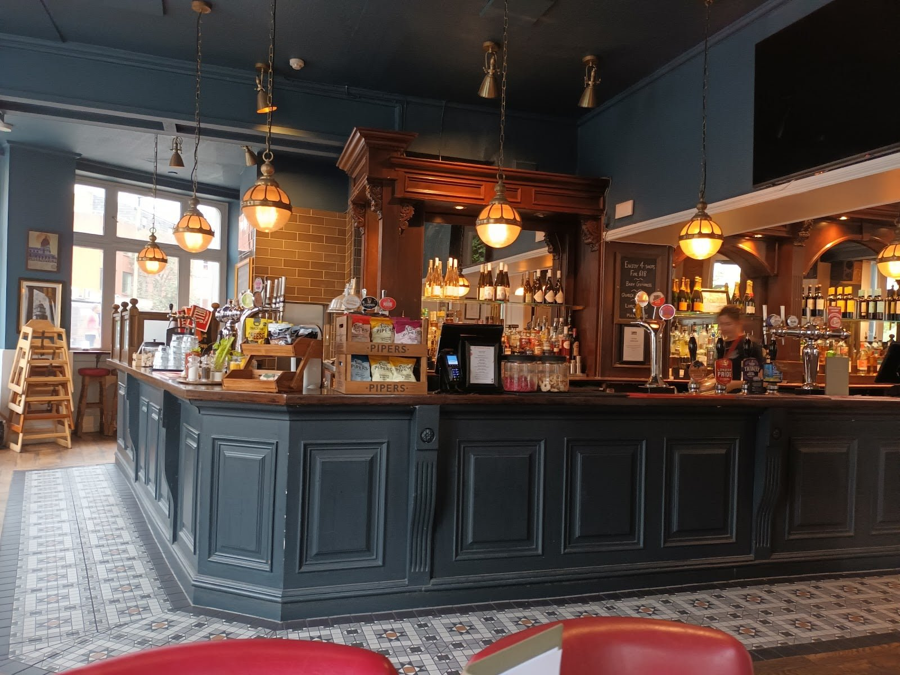

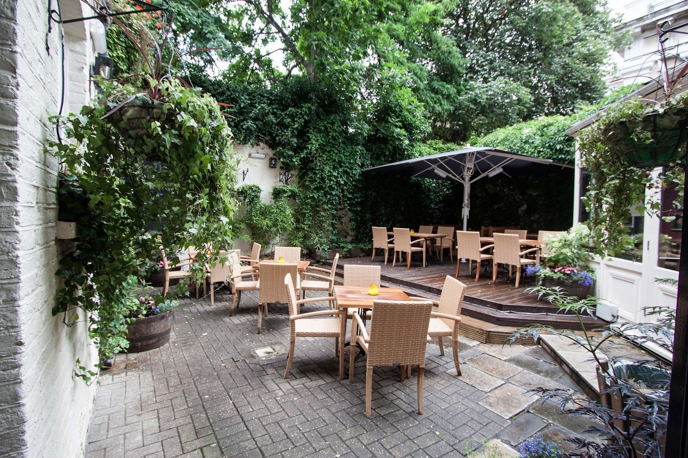

### Novotel London Greenwich — rooms for four beside the station

*173–185 Greenwich High Road, SE10 8JA · Greenwich station 1 min, Cutty Sark DLR 9 min · [Hotels.com](hotelscom:226467)*

A four-star Accor hotel next to Greenwich station, with a gym and sauna, a restaurant and a bar that serves afternoon tea. **The Superior Room has a queen bed and two single sofa beds for up to four**, and the Executive Suite is 49 square metres with a king bed and a double sofa bed, also for four. It has secure on-site parking and pet-friendly rooms. **It takes cards only, not cash.**

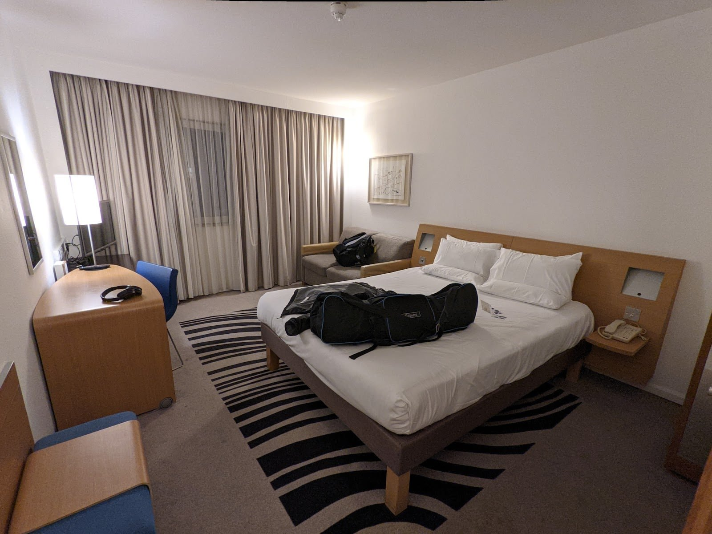

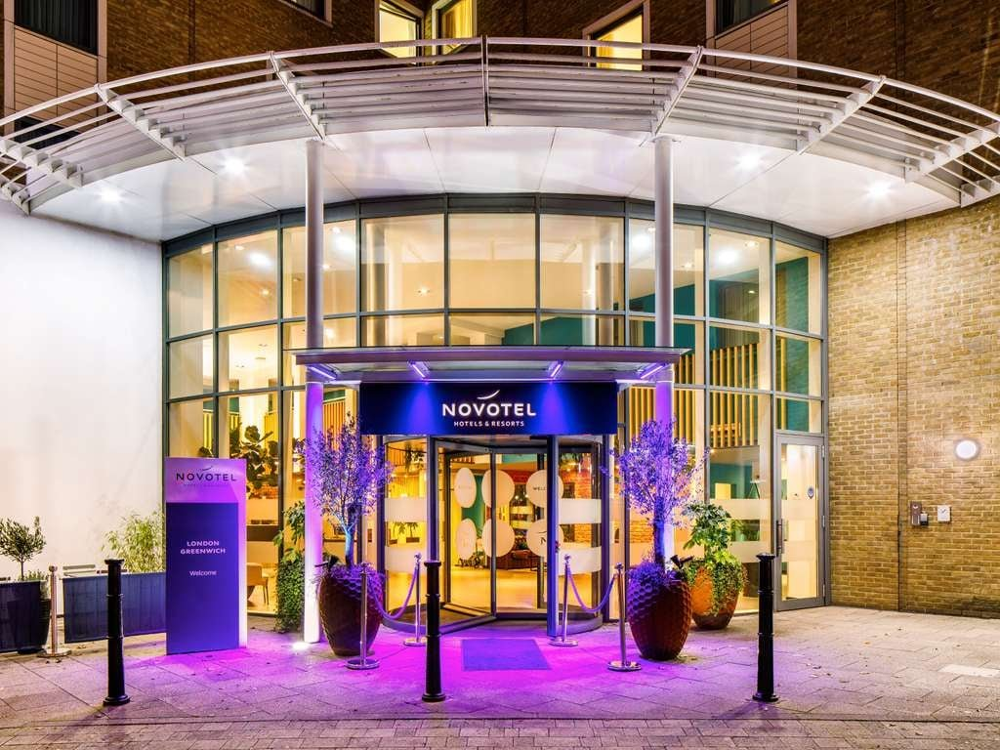

### Premier Inn London Greenwich — free children's breakfasts, five minutes from the station

*43–81 Greenwich High Road, SE10 8JL · Greenwich station 5 min · [premierinn.com](https://www.premierinn.com/gb/en/hotels/england/greater-london/london/london-greenwich.html)*

Double, twin, family and accessible rooms, all air-conditioned; the Premier Plus rooms add a coffee machine and a mini-fridge. Thyme, the restaurant, serves breakfast and dinner, and **up to two children eat breakfast free** with each adult Premier Inn breakfast. **There is no on-site car park**: a shared one at the same postcode, used by Staycity and residents, charges £12 a night, first come, first served.

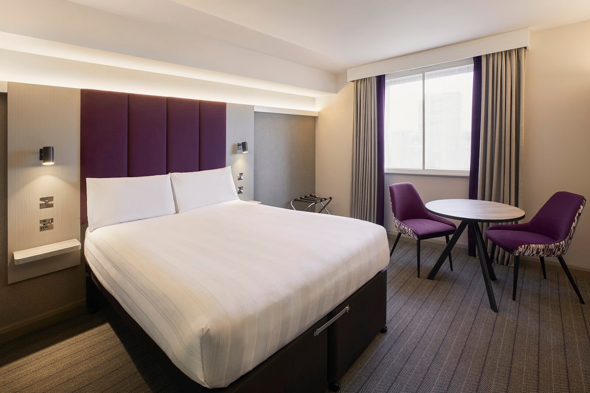

### Travelodge London Greenwich High Road — £1 children's breakfasts by the station

*Greenwich High Road, SE10 8JA · Greenwich DLR 2 min · Check-in 3pm, out noon · [Hotels.com](hotelscom:2348976640)*

A Travelodge a couple of minutes from Greenwich station, with king-size beds in the doubles, twin and family rooms, and a Bar Café for breakfast, dinner and drinks. **Up to two children under 15 eat breakfast for £1 each** with every full-paying adult. There is no hotel car park; Burney Street car park is £7.50 an hour from 8am to 6.30pm and free outside those hours.

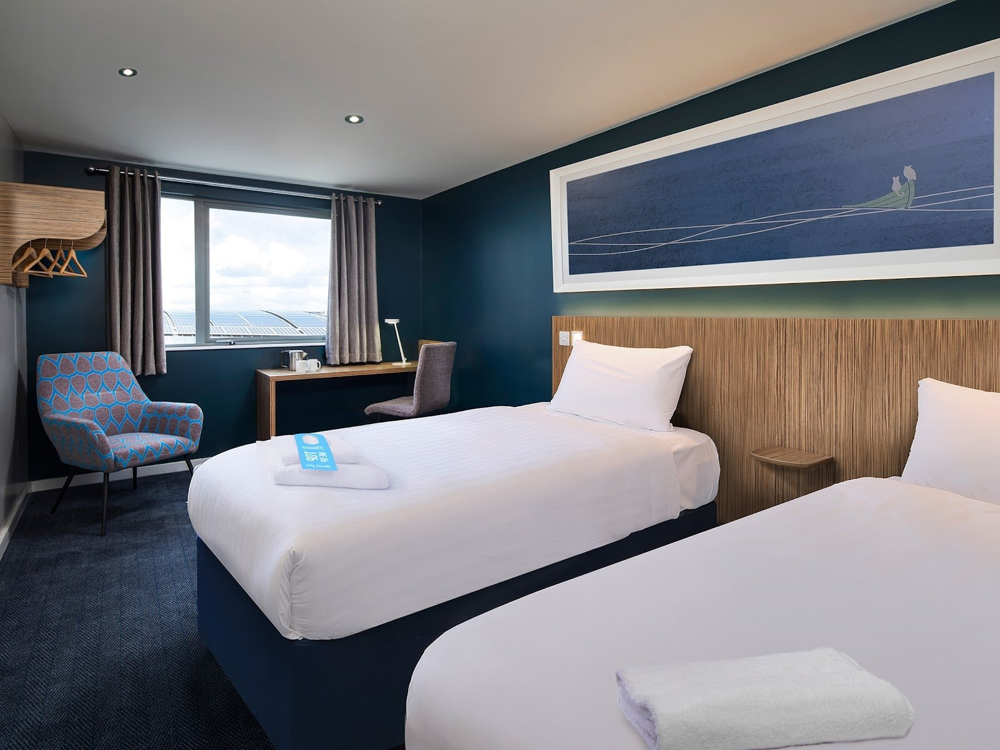

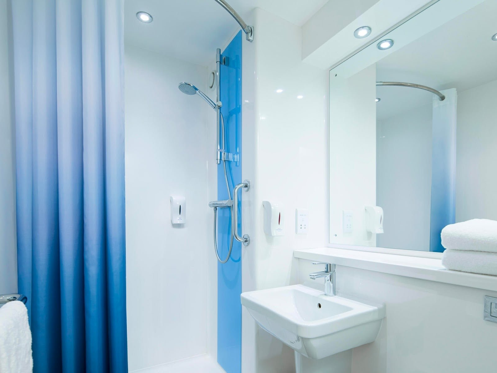

### Staycity Aparthotels Greenwich High Road — kitchens, and 20% off a week

*££ · 65 Greenwich High Road, SE10 8JL · Greenwich station 5 min, Deptford Bridge DLR 4 min · Check-in 3pm, out 11am · [Hotels.com](hotelscom:448739)*

Studios for two or three and **one-bedroom apartments for four**, each with a kitchen and air conditioning, a 24-hour reception and a laundry room. Check-in online before you arrive. **Stays of one to six nights get no scheduled clean**, though reception will arrange one for a small fee; from seven nights the apartment is cleaned on day four and then weekly. **Stays of 7 to 21 nights are 20% off, and longer ones 30% off.** Cots and high chairs are free, and the secure car park has to be booked ahead. Our [aparthotels guide](/articles/aparthotels-london/) compares it with London's other kitchens.

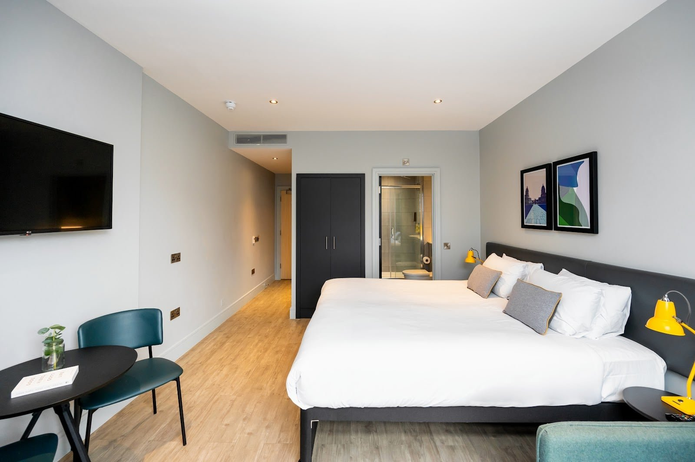

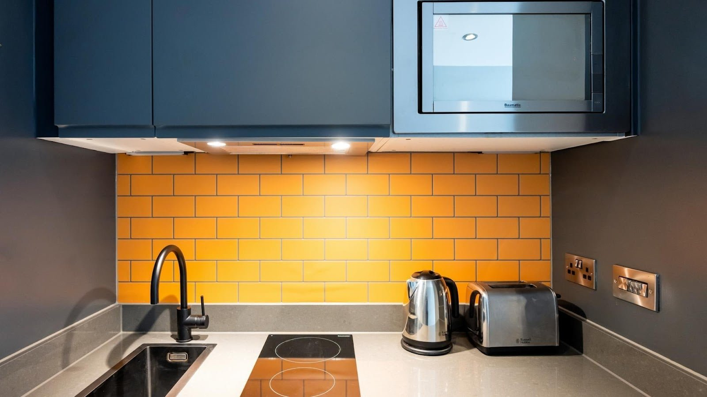

### Zedwell Greenwich — windowless rooms by Deptford Creek

*£66–£145 a Cocoon 2 · Cavatina Point, 7 Harmony Place, SE8 3FB · Cutty Sark DLR 11 min, Deptford station 12 min · [Hotels.com](hotel:zedwell-greenwich)*

A converted office block in the Creekside Village development by Deptford Creek. **Every room is windowless and soundproofed**, with no television, an en-suite shower and filtered air. The Cocoon 2 is 10 square metres for two; **the Cocoon 4, from £117, is 14 square metres with two double beds as a bunk**, which suits two couples better than a family. No breakfast is served, and early check-in costs £25.

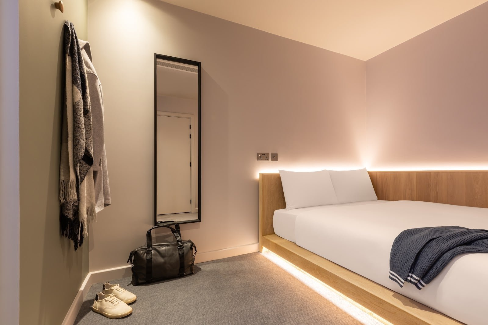

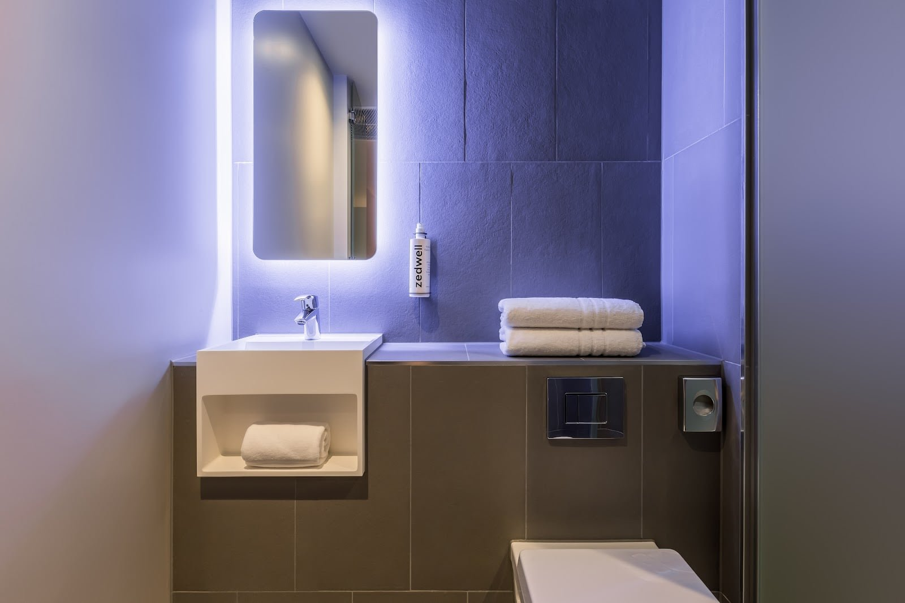

Powered by <a target="_blank" rel="sponsored" href="https://www.getyourguide.com/london-l57/">GetYourGuide</a>

## Hotels in Blackheath and on the park's edges

### The Clarendon Hotel — a Georgian hotel on the heath, with free parking

*Montpelier Row, Blackheath, SE3 0RW · Blackheath station 6 min, Greenwich Park's Blackheath Gate 14 min · [Hotels.com](hotelscom:30320640)*

An independently owned Georgian hotel of more than 100 rooms, looking across the heath towards Greenwich Park. Classic and Crown rooms come as singles, twins and doubles, many of the Crown rooms facing the heath or the garden; the Executive and Honeymoon Suites have a separate lounge. **Families get triple and quad rooms, and five can sleep in two adjoining rooms.** **Parking is free**, first come, first served. The Meridian Restaurant serves afternoon tea and a Sunday roast, and dogs can stay. Trains from Blackheath reach London Bridge in 12 to 17 minutes and Charing Cross in about 22.

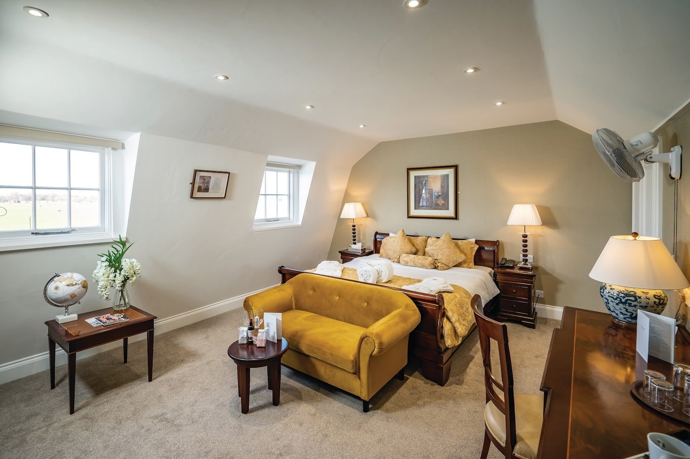

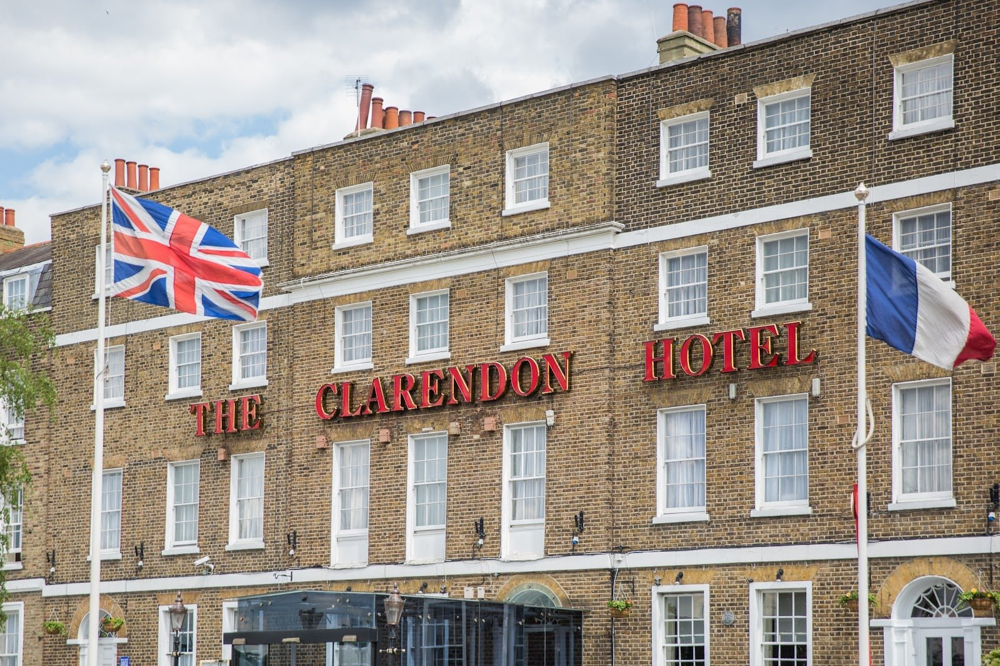

### The Pelton Arms — four rooms over a corner pub, with shared bathrooms

*23–25 Pelton Road, SE10 9PQ · Maze Hill station 10 min, Cutty Sark DLR 17 min · [peltonarms.com](https://www.peltonarms.com/stay.php)*

A corner pub in East Greenwich, just off the Thames Path, pulling pints since 1844, with wood-fired pizza and free live music several nights a week. Upstairs are three doubles and a twin, simply furnished. **The bathrooms and showers are shared**, there is no breakfast, and the pub is open until 1am on Fridays and Saturdays, so the rooms come with earplugs. Rooms are booked by enquiry form, not instantly.

### The Angerstein Hotel — a Victorian pub hotel by Westcombe Park station

*108 Woolwich Road, SE10 0LE · Westcombe Park station 2 min · [theangerstein.com](https://www.theangerstein.com/en)*

A family-run pub hotel from 1888, with pool and Sky Sports in the bar, on the main road east of Greenwich Park. Rooms run from singles to doubles, twins, triples and family rooms, and several types come with a shared bathroom; check which you are booking. **Check-in closes at 10.30pm**, there is no lift to its three floors of rooms, cots and extra beds are not available, and you must be 18 to check in. Westcombe Park has trains to London Bridge in about 15 minutes, and a bus reaches North Greenwich in about ten.

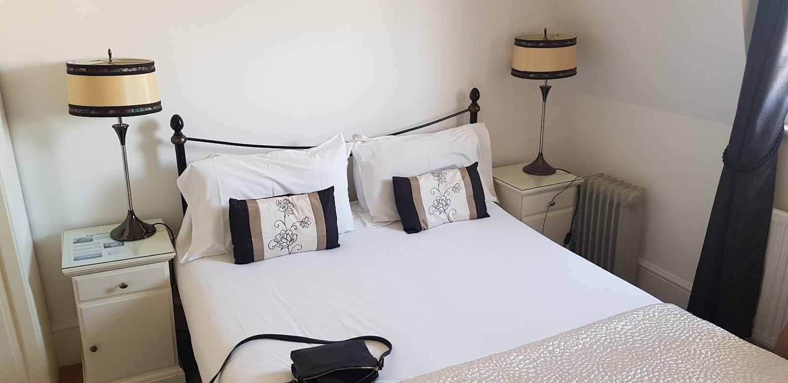

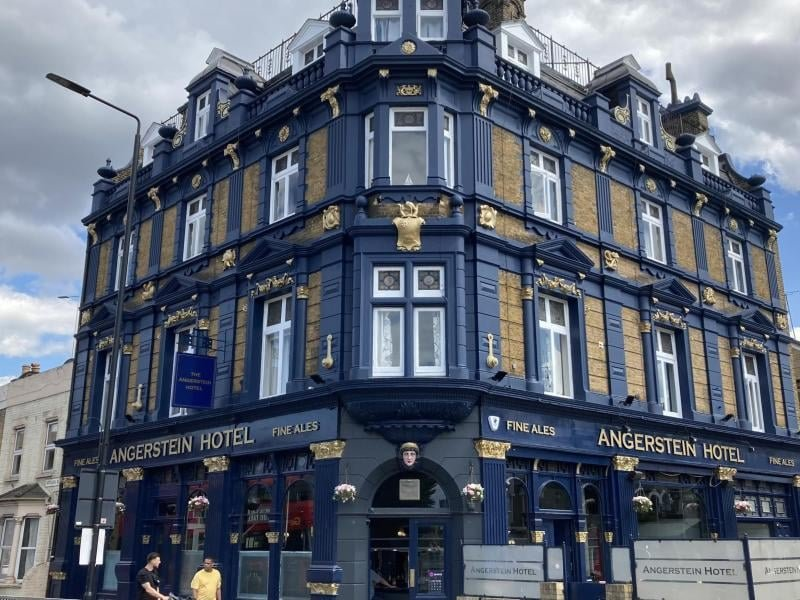

## Greenwich Peninsula, by The O2

The peninsula hotels are a walk from The O2 and a bus ride from the Cutty Sark and the Observatory. **They reprice on show nights**, sometimes several times over: our guide to [where to stay near The O2](/articles/where-to-stay-near-the-o2/) has the figures, and compares the peninsula with Canary Wharf, Canning Town and Stratford.

### InterContinental London – The O2 — a 17-metre pool and a walkway into The O2

*About £280 · 1 Waterview Drive, SE10 0TW · Private walkway into The O2 · [Hotels.com](hotel:intercontinental-the-o2)*

A glass tower on the river facing Canary Wharf: 493 rooms, suites and apartments, a spa with a 17-metre pool, three restaurants and two bars. On-site parking is £52 a day.

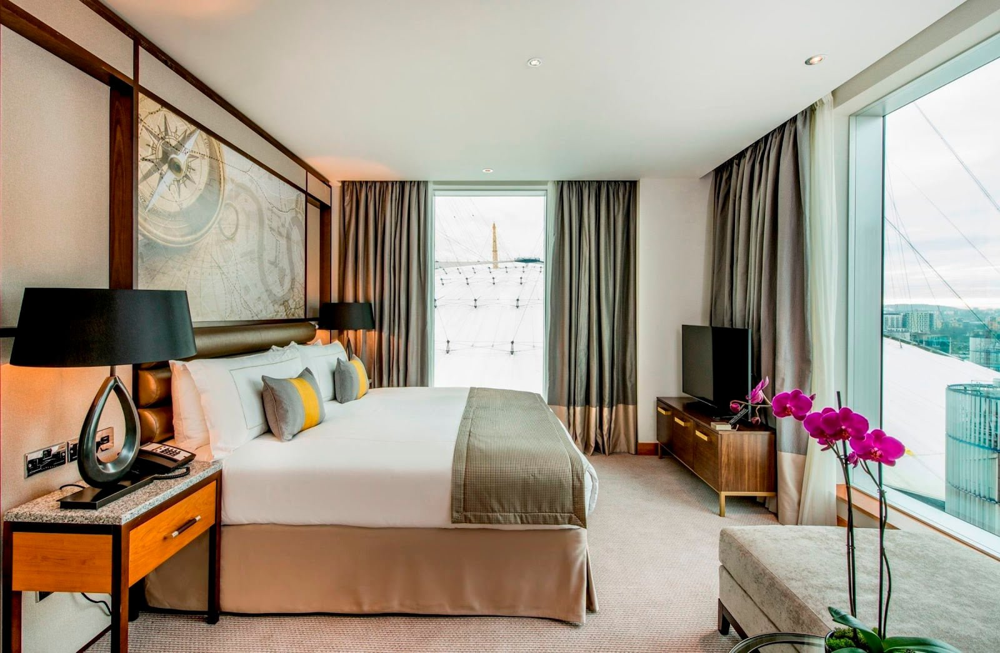

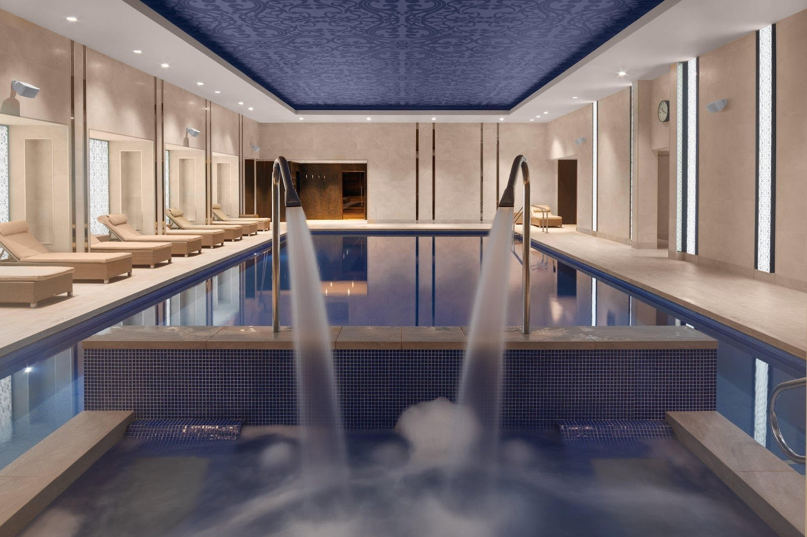

### Holiday Inn Express London – Greenwich — breakfast included, family rooms for four

*About £95 · Bugsby's Way, SE10 · North Greenwich and The O2 15 min · [Hotels.com](hotel:holiday-inn-express-greenwich-peninsula)*

At the south end of the peninsula, with **breakfast included**, family rooms for four, and parking at £35 a day.

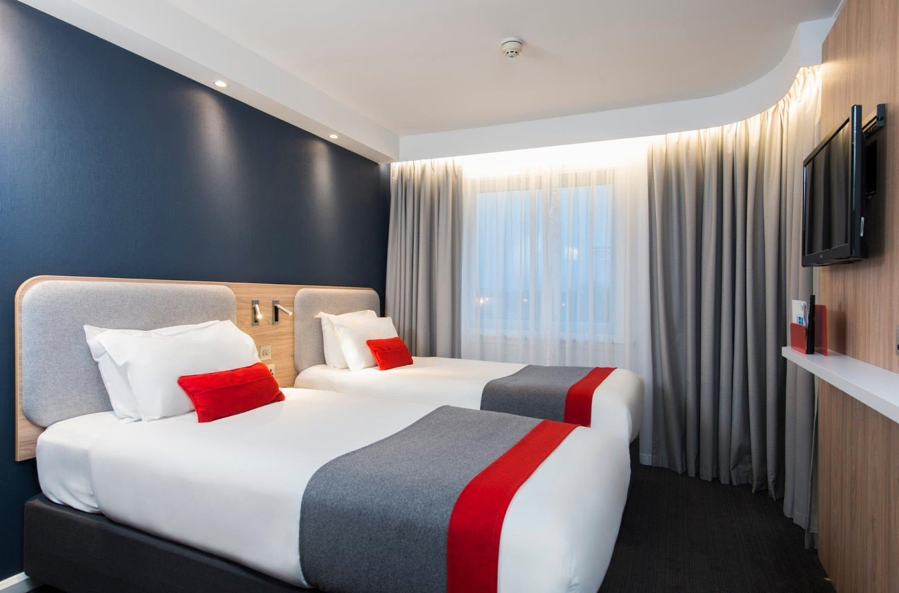

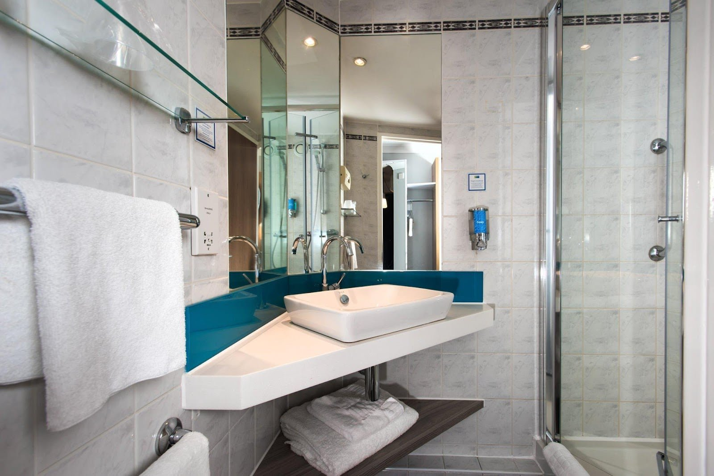

### Radisson RED London Greenwich The O2 — rainfall showers, and the bus to The O2

*228 Tunnel Avenue, SE10 0PL · North Greenwich 25 min on foot, or the 422 bus · Check-in 3pm, out noon · [Hotels.com](hotelscom:1837404672)*

The first Radisson RED in London, with rainfall showers, an all-day restaurant and a street-level bar. Cots are available on request. It is at the south end of the peninsula, so for The O2 the bus is quicker than the walk.

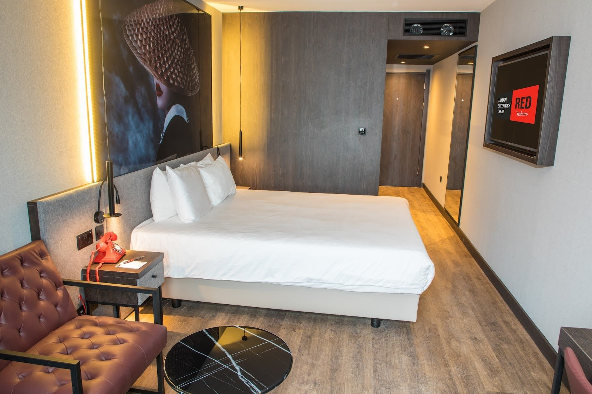

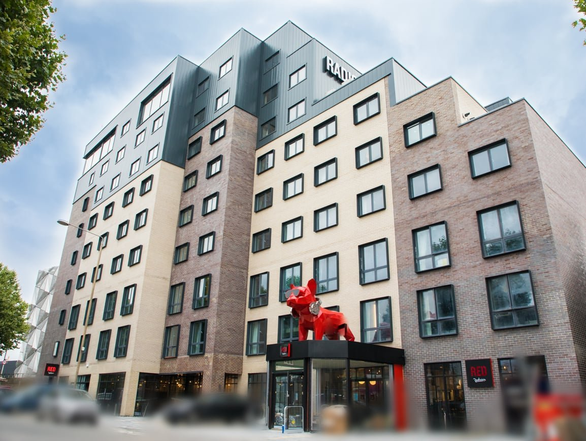

### The Pilot — ten rooms in a Fuller's pub

*68 River Way, SE10 0BE · North Greenwich 12 min · [Hotels.com](hotelscom:445547)*

A Fuller's pub among the peninsula's new flats, with ten air-conditioned en-suite bedrooms, from the Standard Double to the Captain's Cabin, and **breakfast included**. **Book early for a big O2 night**: the pub says its rooms go well in advance.

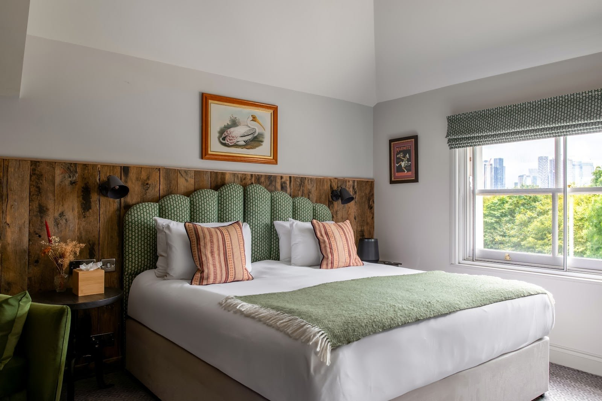

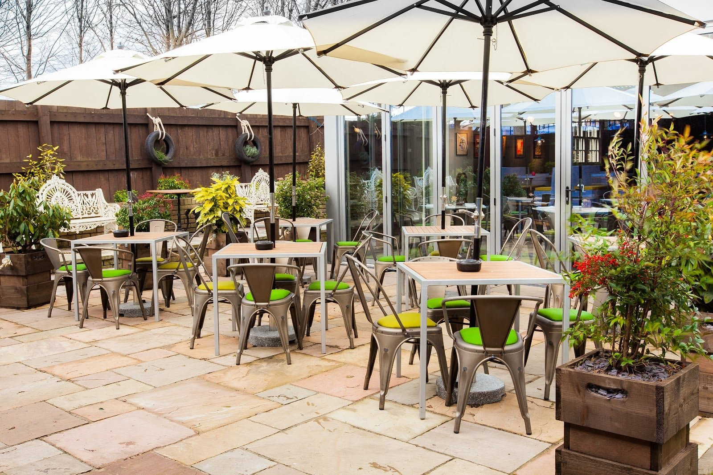

Powered by <a target="_blank" rel="sponsored" href="https://www.getyourguide.com/london-l57/">GetYourGuide</a>

## Hotels at Deptford Bridge

### DoubleTree by Hilton London Greenwich — a 1940s police section house

*About £160 · Catherine Grove, SE10 8FR · Deptford Bridge DLR 4 min, Greenwich station 9 min · Check-in 3pm, out noon · [Hotels.com](hotel:doubletree-greenwich)*

A former Metropolitan Police section house from the 1940s, converted into a hotel that won a RIBA award. O1, the restaurant, is in the old firearms shooting gallery and serves afternoon tea, and there is a viewing deck on the eighth floor. **Children up to 18 stay free on a room-only rate** in their parents' room, using the existing beds, under-fives eat breakfast free, and there are connecting rooms. Parking is £25 a day and has to be booked with the hotel. No pets. The Cutty Sark is about 18 minutes' walk.

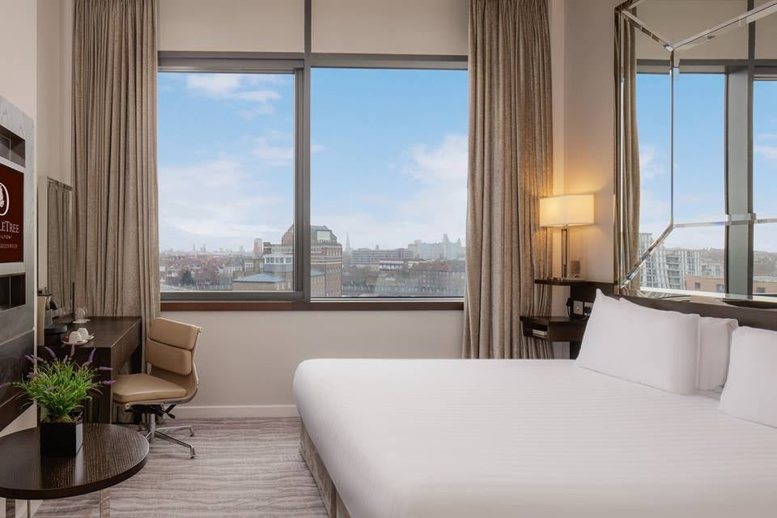

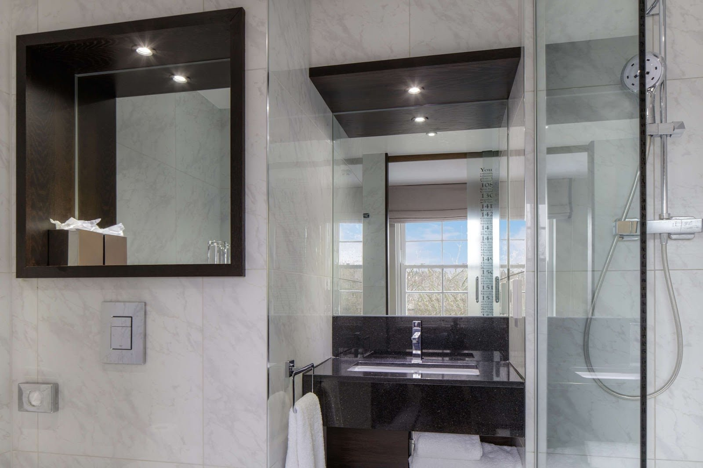

### Travelodge London Greenwich — at Deptford Bridge, not Greenwich

*Blackheath Road, SE10 8DA · Deptford Bridge DLR 4 min, Greenwich station 10 min · Check-in 3pm, out noon · [Hotels.com](hotelscom:158578208)*

**Despite the name, this Travelodge is by Deptford Bridge DLR**, on the A2 where it meets Greenwich High Road. Doubles have king-size beds, there are family and accessible rooms, and the Bar Café serves an unlimited breakfast from 7 to 10am on weekdays and 8 to 11am at weekends, with **children's breakfast at £1** for up to two under-15s per adult. Some rooms take pets. The nearest parking is the Burney Street car park.

### Staycity Aparthotels London Deptford Bridge — opening in October 2026

*18–20 Deptford Bridge, SE8 4HH · Deptford Bridge DLR 1 min · [Hotels.com](hotelscom:448740)*

Staycity's second aparthotel in the area opens in October 2026 beside the DLR, with studios for two, **one-bedroom apartments for four**, and hotel rooms for two. The apartments have kitchens, there is a lift to every floor, a 24-hour gym and a breakfast from 7 to 10am on weekdays and 7.30 to 10.30am at weekends. Parking is at the Greenwich High Road building, five minutes' walk, at £13 a night, booked ahead. The Cutty Sark is about 15 minutes' walk.

## Getting into central London

| From | Route | To | On the train or boat |
| --- | --- | --- | --- |
| **Cutty Sark** | DLR | Bank | 21 min |
| **Cutty Sark** | DLR | Canary Wharf | 10 min |
| **Greenwich** | Southeastern or Thameslink | London Bridge | 9–10 min |
| **Greenwich** | Southeastern | Cannon Street | 15–16 min |
| **Greenwich Pier** | Uber Boat | Tower | 21–24 min |
| **Greenwich Pier** | Uber Boat | Embankment | 38–42 min |
| **Blackheath** | Southeastern | London Bridge | 12–17 min |
| **Blackheath** | Southeastern | Charing Cross | About 22 min |
| **Maze Hill** | Southeastern or Thameslink | London Bridge | 12–13 min |
| **Deptford Bridge** | DLR | Bank | 25 min |
| **North Greenwich** | Jubilee | London Bridge | 6–9 min |
| **North Greenwich** | Jubilee | Waterloo | 10–12 min |
| **North Greenwich** | Jubilee | Bond Street | 15–18 min |

*From TfL's Journey Planner for a weekday morning, September 2026.*

**Greenwich station** has both the DLR and mainline trains; **Cutty Sark**, the DLR stop in the middle of the town, is the one for the market, the Naval College and the park. The Uber Boat is slower than the train and costs more, with river fares outside the daily cap (an <a href="https://www.getyourguide.com/activity/-t413091?partner_id=WWP7I0R&amp;cmp=where-to-stay-greenwich" target="_blank" rel="sponsored nofollow noopener" data-affiliate="gyg">Uber Boat single river ticket</a> bought ahead on GetYourGuide is from £9.80), but it is the way to see the river: [how the river boats work](/articles/how-to-use-london-river-boats/), and the [Thames river cruises guide](/articles/thames-river-cruises-london/) for a boat with commentary. **For Heathrow**, the DLR to Canary Wharf and the Elizabeth line take about 66 to 68 minutes from Cutty Sark; London City Airport is about half an hour on the DLR with one change. Our [Heathrow](/articles/heathrow-airport-to-london/) and [London City Airport](/articles/london-city-airport-to-london/) guides have the fares.

> 🌙 **Getting back after midnight.** The last DLR from Bank to Cutty Sark leaves at **00:33 Monday to Saturday and 23:33 on Sunday**, and Southeastern trains do not run through the night. After that, take a night bus from the West End, about 45 minutes:
>
> - **188**, 24 hours a day: Tottenham Court Road, Aldwych, Waterloo, Deptford, Greenwich town centre, North Greenwich.
> - **N1**: Tottenham Court Road, Aldwych, Waterloo, Greenwich town centre, Trafalgar Road for Maze Hill.
> - **N199**: Trafalgar Square, Aldwych, Greenwich station, Cutty Sark.
> - **N89**: Trafalgar Square, Deptford Bridge, Blackheath station.
> - **N53**: Whitehall, Deptford Bridge, Greenwich Park, Maze Hill.
>
> On **Friday and Saturday nights** the Jubilee line runs all night to North Greenwich, and the 188 covers the last stretch into Greenwich. The last Uber Boat east leaves Embankment at **23:25 on weekdays and 00:08 at weekends**.

*Last DLR and night bus routes from TfL, September 2026; Uber Boat times from the timetable in force from 27 June 2026.*

Powered by <a target="_blank" rel="sponsored" href="https://www.getyourguide.com/london-l57/">GetYourGuide</a>

## Nearby, and the rest of the trip

Across the river, our [Canary Wharf hotel guide](/articles/where-to-stay-canary-wharf/) covers the aparthotels on the Elizabeth line, ten minutes from Cutty Sark on the DLR. The [Canary Wharf to Greenwich walk](/articles/canary-wharf-greenwich-walk/) crosses under the Thames through the foot tunnel and finishes on Greenwich hill, and the [O2 travel guide](/articles/the-o2-travel-guide/) covers the cable car and event-night transport. For a family trip, our [family hotels guide](/articles/best-family-hotels-london/) compares London's family rooms, the [budget hotels guide](/articles/best-budget-hotels-london/) the cheapest beds, and the [best areas to stay in London](/articles/best-areas-to-stay-in-london/) sorts the city by what the trip is for.

**Older lists still name De Vere Devonport House**, beside the National Maritime Museum. It is now University of Greenwich accommodation for postgraduate students, not a hotel.

*Typical nightly rates for a double, checked September 2026. The £ symbols mark a price band where we hold no typical rate. Prices move nightly, so check your own dates.*
