Marylebone is the grid of Georgian streets directly north of Oxford Street, running up to Regent's Park. It has a village high street, the free Wallace Collection, and stations on every side, including the Elizabeth line at Bond Street.

Where you sleep in it matters more than which hotel. **The Marble Arch corner** is for Hyde Park and the Central line. **The village** is the quiet middle, a few minutes from the Elizabeth line at Bond Street. **Baker Street and Marylebone Road** are for Regent's Park, Wembley trains and the cheapest rooms. **Langham Place** is the West End edge, five minutes from Oxford Circus.

Most of the hotels below are four- and five-star. The cheapest room in this guide with a window is **£75 at the Z Hotel on Gloucester Place**; the grand end is **about £550 at The Langham**.

> 💡 **The Short Version:** On a budget, **The Z Hotel Gloucester Place** is £75 for a 14-square-metre room with a window, or £65 without one. In the village, **The Mandeville** starts at £200 booked direct, two minutes from Marylebone High Street. With children, **[The Landmark London](hotel:the-landmark-london)** has family rooms with two double beds and a 15-metre pool with children's hours, and **Durrant's** has a family room with a separate bunk room for three. For a Wembley event, **[Dorset Square Hotel](hotel:dorset-square-hotel)** is five minutes from Marylebone station, nine minutes by train from the stadium. For the grand hotel, **[The Langham](hotel:the-langham-london)** at about £550, with afternoon tea in the Palm Court.

## Which part of Marylebone

**Marylebone Village** is Marylebone High Street, the curve of Marylebone Lane, Manchester Square and the streets east to Welbeck Street. Daunt Books, the Wallace Collection and the Sunday farmers' market are here, and Bond Street station is five to eight minutes' walk south. The Marylebone, Durrant's, The Mandeville and The Welbeck are in this part.

**Portman Square and Marble Arch** is the south-west corner, where most of the big hotels are. Hyde Park is across the road, Selfridges and the west end of Oxford Street are a few minutes away, and Marble Arch station is on the Central line. The traffic is heavy where Oxford Street, Park Lane and Edgware Road meet.

**Baker Street, Dorset Square and Marylebone Road** is the north: Regent's Park, the Sherlock Holmes Museum, Madame Tussauds, and the widest choice of trains. Marylebone Road is four lanes and loud; Dorset Square, just behind it, is a residential garden square. Chiltern Street is here too; the Chiltern Firehouse hotel on it has been closed since a fire.

**Langham Place and Portland Place** is the eastern edge, opposite BBC Broadcasting House. Oxford Circus is five minutes' walk and Soho ten.

Our [Marylebone area guide](/articles/marylebone-area-guide/) covers what to see and where to eat.

Powered by <a target="_blank" rel="sponsored nofollow noopener" href="https://www.getyourguide.com/london-l57/">GetYourGuide</a>

## Hotels in Marylebone Village

### The Marylebone — the one with a pool

*Cosy Rooms from £405 · 47 Welbeck Street, W1G 8DN · Bond Street 7 min · [Hotels.com](hotelscom:h469914)*

The Doyle Collection's five-star, just east of the high street. The deciding fact is downstairs: guests get free use of the on-site **Third Space health club, with a gym and a swimming pool**.

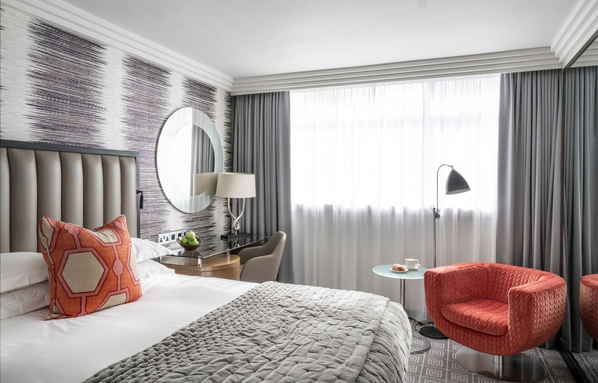

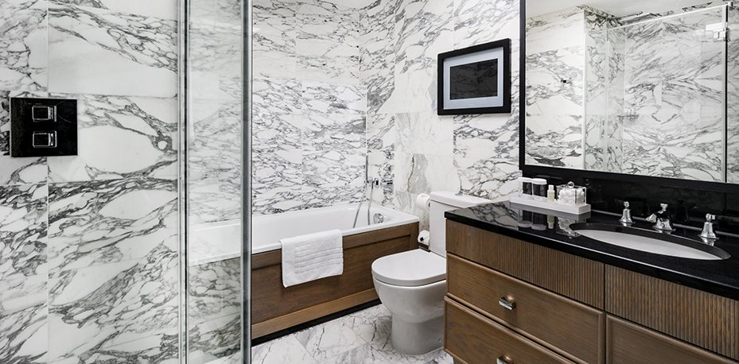

*The bathroom has a bath and a separate glass shower; the bedroom window runs almost the width of the wall.*

Rooms run from Cosy Rooms, listed from £405, to terrace suites and a two-bedroom suite; a breakfast-inclusive offer on the hotel's own site starts at £325. 108 Brasserie has tables out on Marylebone Lane, and dogs are welcome.

### Durrant's Hotel — a family-owned townhouse behind the Wallace Collection

*92 rooms and suites · George Street, W1H 5BJ · Bond Street 500m · Check-out 11am · [Hotels.com](hotelscom:h1408397)*

A Georgian former coaching inn, owned by the Miller family since 1921, with the Wallace Collection as its nearest neighbour. There are 88 rooms and 4 suites, and the old layout means no two are quite the same.

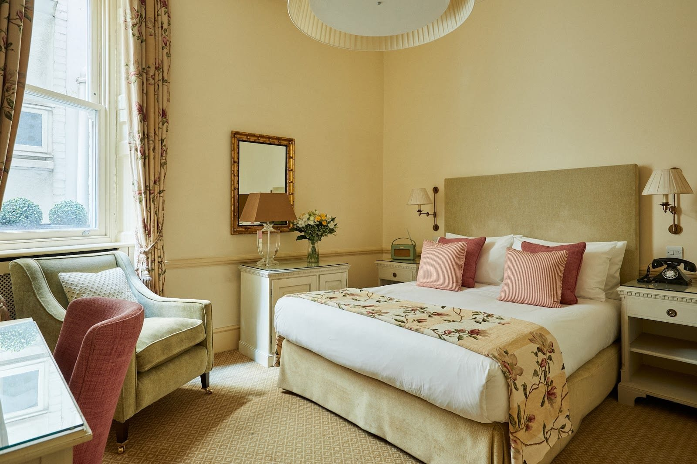

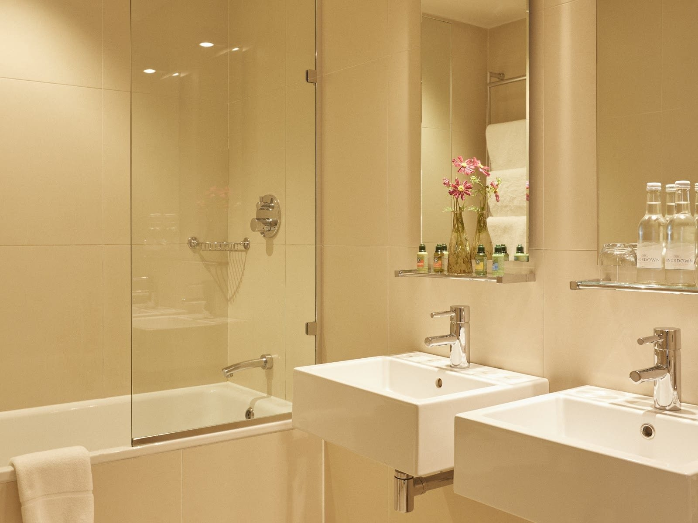

*A double with a tall sash window, and a bathroom with a shower over the bath and two basins.*

**The Family Room is the one to book with children**: a double bedroom and, beyond it, a bunk room with beds for up to three children. There are no interconnecting rooms. Cots are £25 a night; extra beds are £50 and fit only the studios and suites. There is no spa or gym, and on-site parking is £40 a day with a 1.70m height limit.

### The Mandeville — Christian Lacroix on the fifth floor

*From £200 direct · 142 rooms · Mandeville Place, W1U 2BE · Bond Street 5 min · [Hotels.com](hotelscom:h6983)*

A four-star two minutes from the high street and the Wallace Collection. Its own site quotes rates from £200 a night booked direct, and booking there also takes 25% off the buffet breakfast.

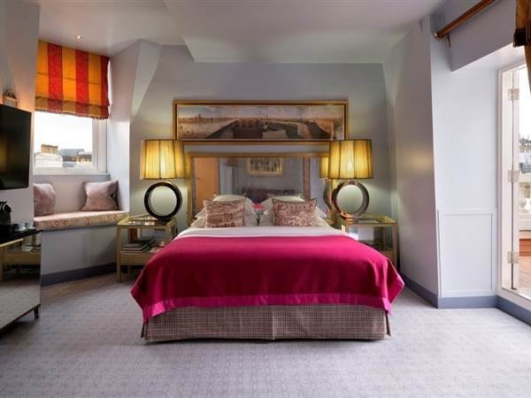

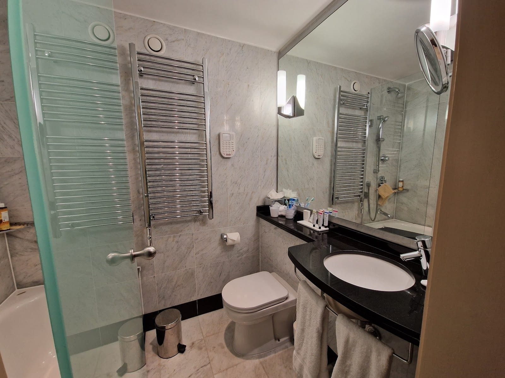

*A room under the roof with a window seat and its own door out to a terrace; the bathroom has a bath with a hand shower.*

Room sizes spread widely, from a **Tiny Single of 11 square metres** to Executive Doubles of 31 to 34. The fifth floor is the **Riviera Rooms, 22 to 26 square metres, each designed by Maison Christian Lacroix**, and the Terrace Suite takes the top two floors with its own roof terrace. There is a lift, a ramp at the entrance and accessible rooms. **Only two pairs of rooms interconnect**, so families should book early.

### The Welbeck Hotel — Edwardian, with rooms of two double beds

*57–59 Welbeck Street, W1G 9BL · Bond Street 5 min · [Hotels.com](hotelscom:h8769)*

Built in 1907–09 to designs by Boehmer & Gibbs as the Welbeck Palace Hotel, on a street where doctors have practised since 1800. Its basement ballroom was a dance hall between the wars.

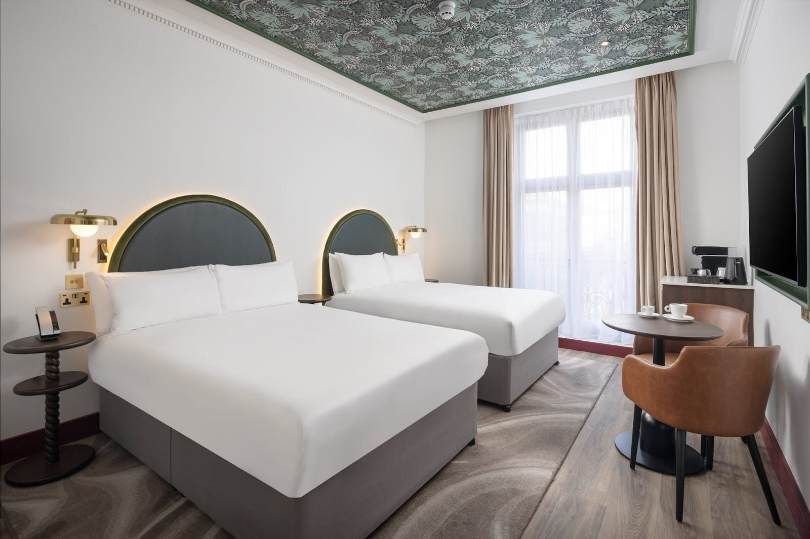

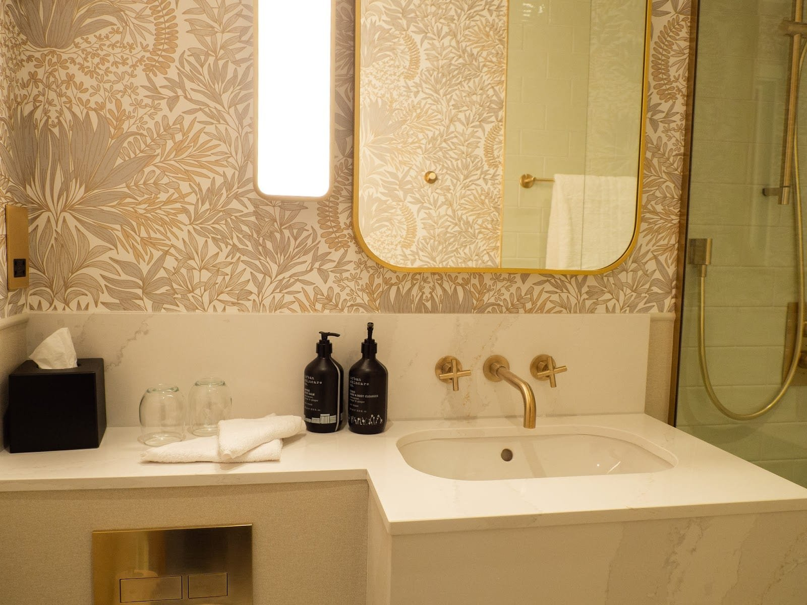

*Two double beds, as in the Grand Family rooms; the bathroom has brass taps and a glass-screened shower.*

Rooms are graded by size: **Cosy doubles of 15 to 17 square metres**, Standard 18 to 22, Premium 23 to 24 with some taking a third guest on a sofa bed, and **Grand Family rooms of 26 square metres with two double beds**. Massages and facials can be booked in your room. The Welbecker is the bar.

## Hotels around Portman Square and Marble Arch

### The Cumberland — Hell's Kitchen downstairs, Hyde Park across the road

*££ · Great Cumberland Place, W1H 7DL · Marble Arch 1 min · Check-out 11am · [check prices](hotel:the-cumberland-london)*

A large hotel on the corner where Oxford Street meets Hyde Park, and the only one in this guide at the ££ level. **Gordon Ramsay chose it for the first UK branch of Hell's Kitchen.**

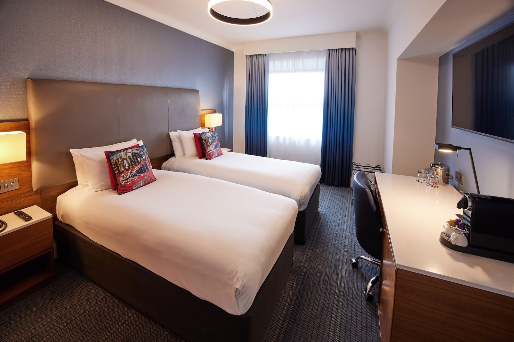

*A twin room: two single beds side by side, with the desk and coffee machine along the opposite wall.*

Grades run from Classic singles to Park View rooms and suites; the **Family Room has two double beds**, and interconnecting rooms can be requested. There is no parking; the hotel sends drivers to the Marble Arch car park, two minutes away.

### Montcalm Mayfair — the Marble Arch hotel with Mayfair in its name

*£££ · 2 Wallenberg Place, W1H 7TN · Marble Arch 3 min · Check-out noon · [check prices](hotel:montcalm-mayfair)*

The Montcalm group's flagship, in a Grade II listed Georgian crescent on Great Cumberland Place. It trades as Mayfair, but the address is north of Oxford Street, in Marylebone; this is the former Montcalm London Marble Arch.

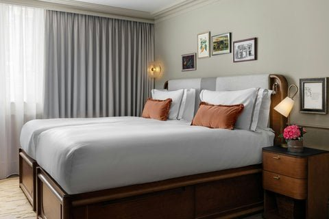

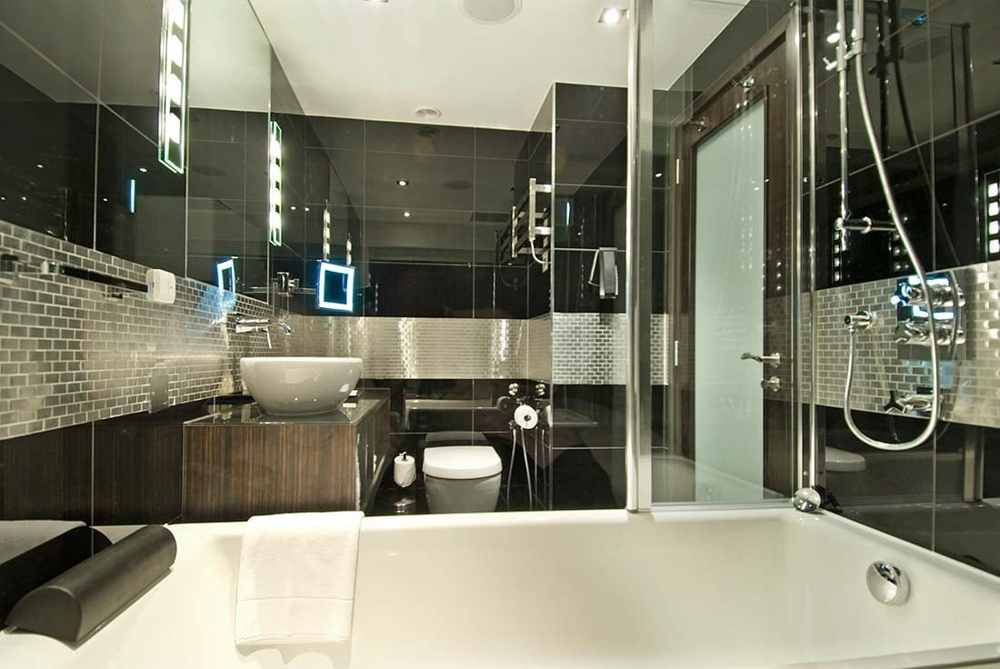

*The bathroom photographed has a bath with a shower over it and a bowl basin on the counter.*

It is part of Marriott's Autograph Collection, so **Bonvoy points apply**. Lilli, the building's restaurant, is Akira Back's only London restaurant, and the YĀTRĀ spa is in the building. Pets are allowed.

### The Zetter Marylebone — a cocktail parlour with rooms above

*About £230 · 28–30 Seymour Street, W1H 7JB · Marble Arch 3 min, Bond Street 8 min · [Hotels.com](hotel:the-zetter-townhouse-marylebone)*

A Georgian townhouse, formerly called the Zetter Townhouse, decorated like an eccentric relative's home. The ground-floor bar, **The Parlour, fills with non-residents in the evening**, which is the point of staying here for some guests and a reason to ask for an upper floor for others.

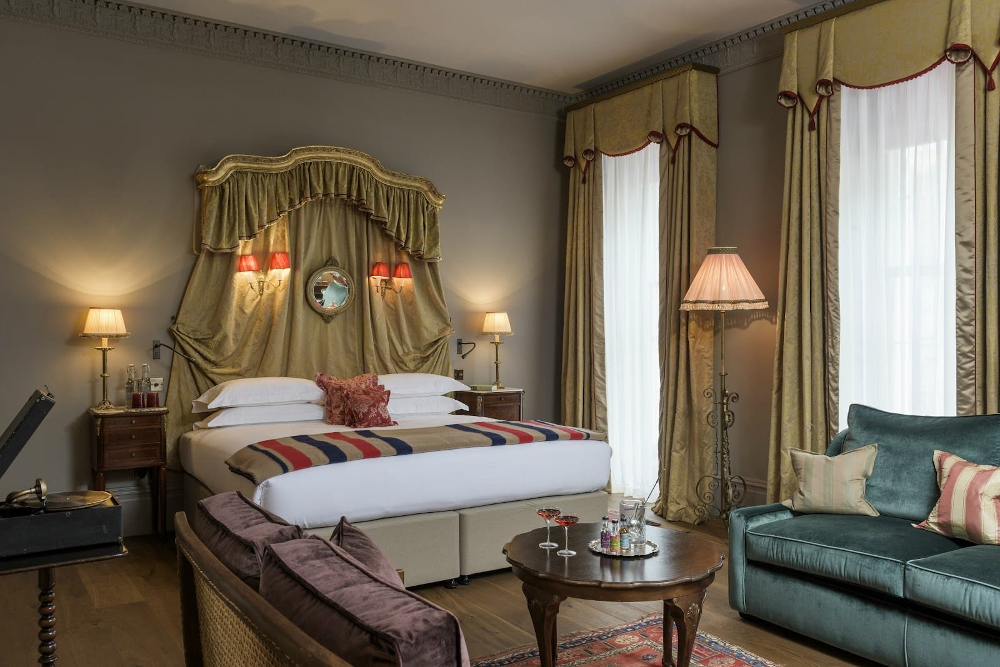

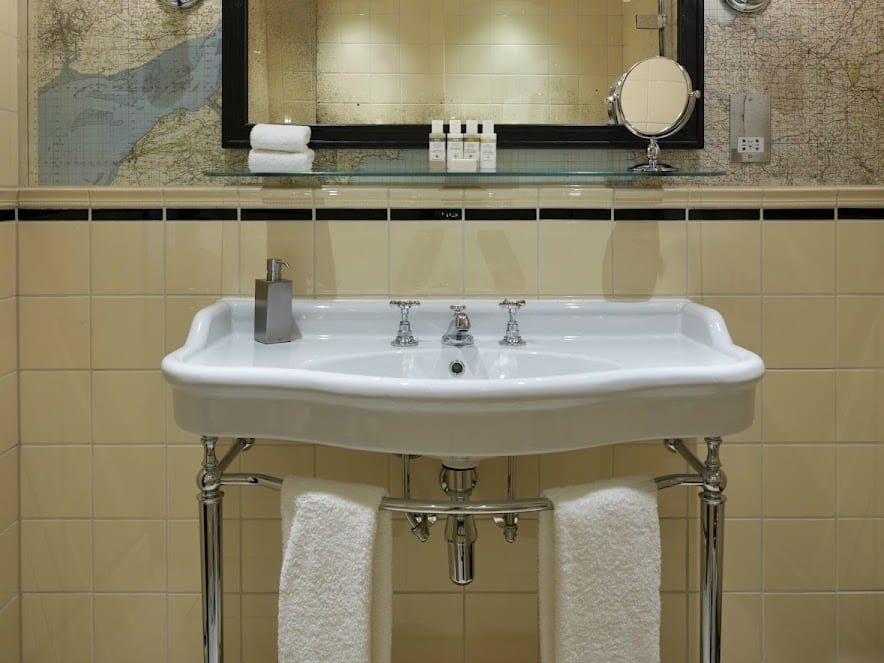

*Drapes behind the bed, a gramophone and velvet sofas; the washstand basin sits under a wall papered with old maps.*

Deluxe Doubles are 19 square metres and Deluxe Kings 27. **Each of the four Junior Suites sleeps four in 30 square metres**, and Lear's Loft, at 45 square metres, has an outdoor bath on its terrace. There is a lift, but parts of the house are still stairs. Breakfast is extra.

### Nobu Hotel London Portman Square — family rooms with balconies

*££££ · 22 Portman Square, W1H 7BG · Marble Arch 5 min · [check prices](hotel:nobu-portman-square)*

Not to be confused with Nobu's Shoreditch hotel. The hotel is built around the Nobu restaurant, which has a terrace, a bar, Sunday brunch and an afternoon tea as well as the main room.

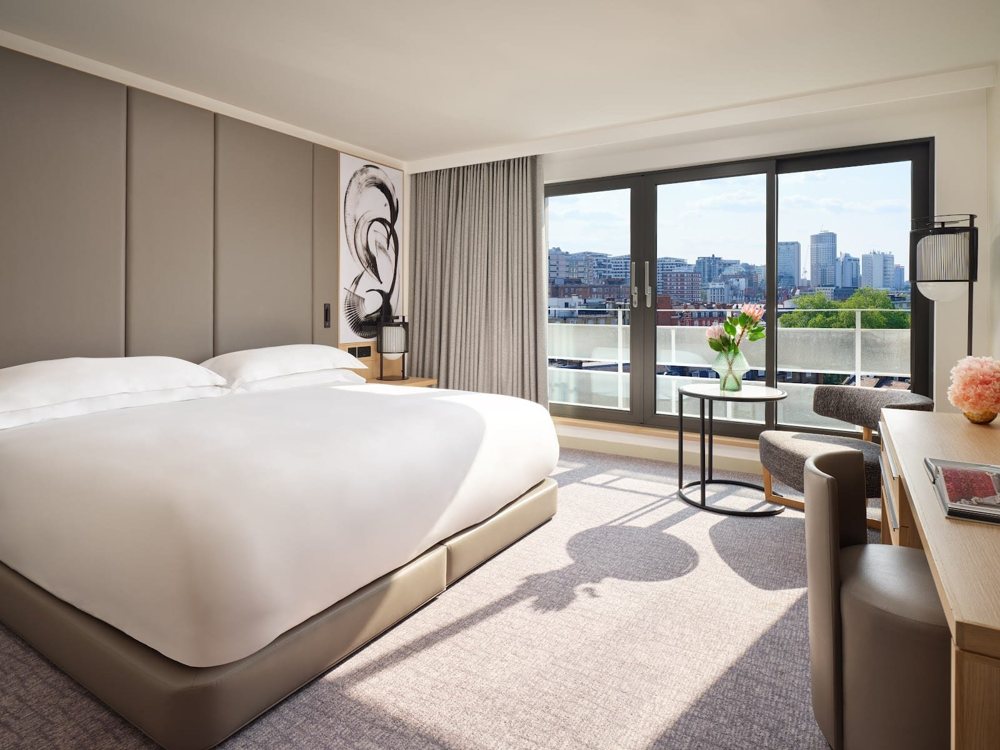

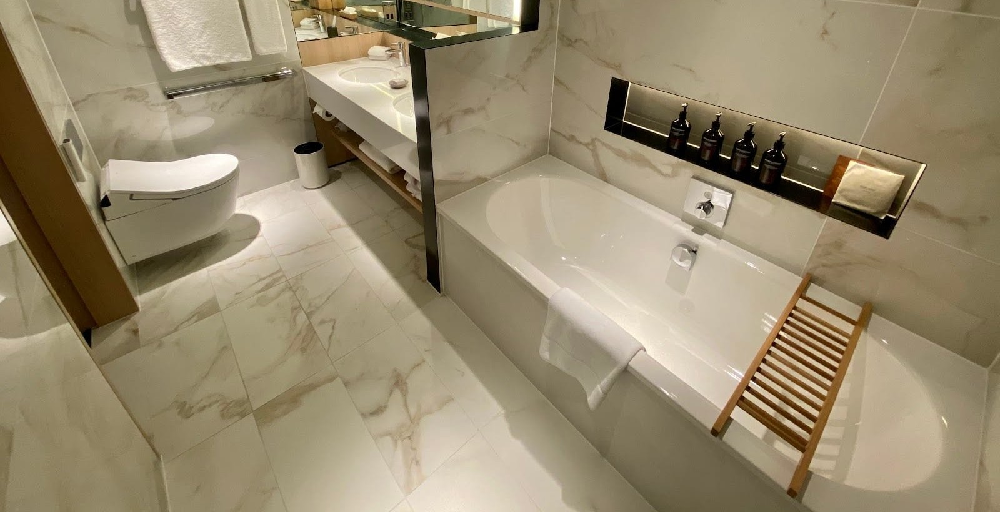

*This room opens on to a balcony through glass doors; the bathroom has a bath and two basins.*

Entry-level Cosy Kings are 18 to 20 square metres. The family rooms are large: **the Family Deluxe Balcony room is 42 square metres for two adults and two children**, and the Two Bedroom Family Suite is 44 square metres for two adults and three. There is a Reformer Pilates studio.

### Hyatt Regency London – The Churchill — 440 rooms on the square

*30 Portman Square, W1H 7BH · Marble Arch 4 min · [Hotels.com](hotelscom:h7613)*

Opened in 1970 on Portman Square, with 440 rooms including 50 suites. It is a Hyatt Regency, so **World of Hyatt points apply**.

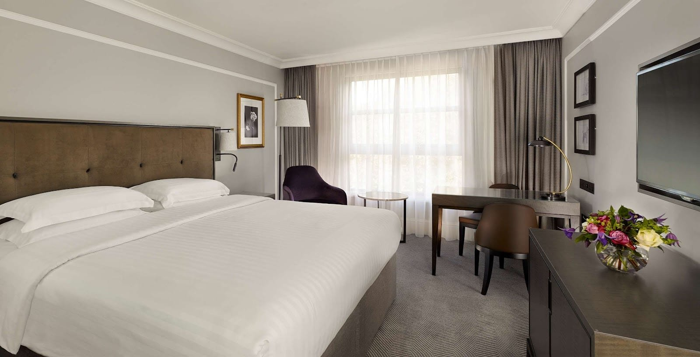

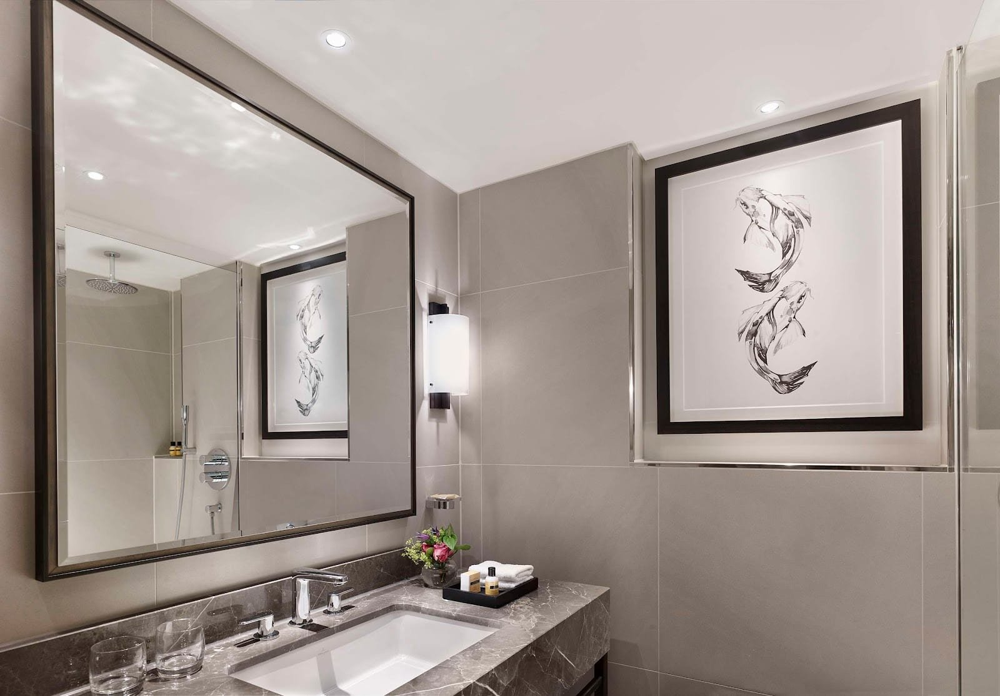

*A king room with a desk by the window; the bathroom mirror shows a walk-in shower with a rain head.*

## Hotels around Baker Street, Dorset Square and Marylebone Road

### The Z Hotel Gloucester Place — the cheapest room in this guide

*£65 windowless, £75 with a window · 114 rooms · 51 Gloucester Place, W1U 8JF · Baker Street 5 min · [Hotels.com](hotelscom:h109287658)*

Six Georgian townhouses turned into 114 rooms, with Baker Street five minutes' walk, Marylebone station six and Marble Arch seven. Air conditioning is standard.

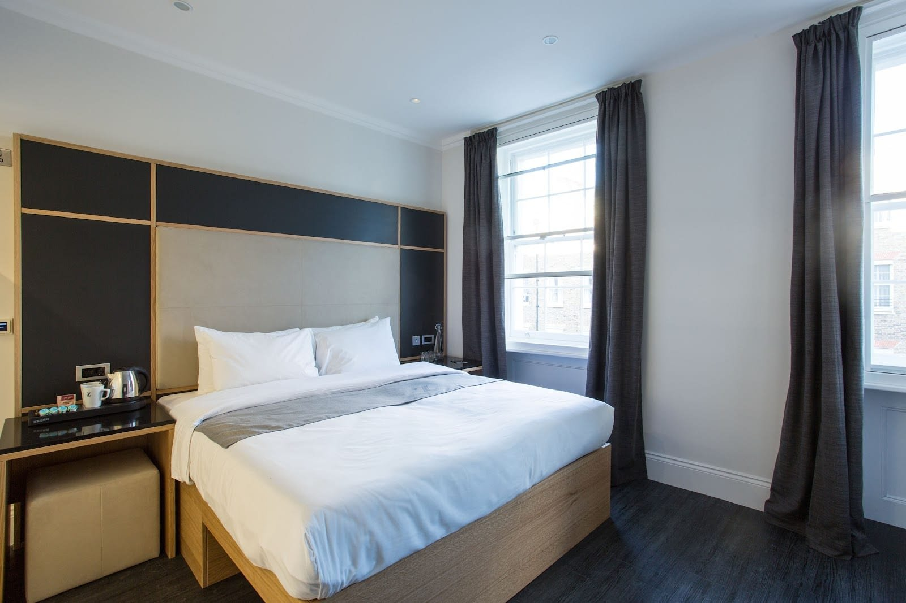

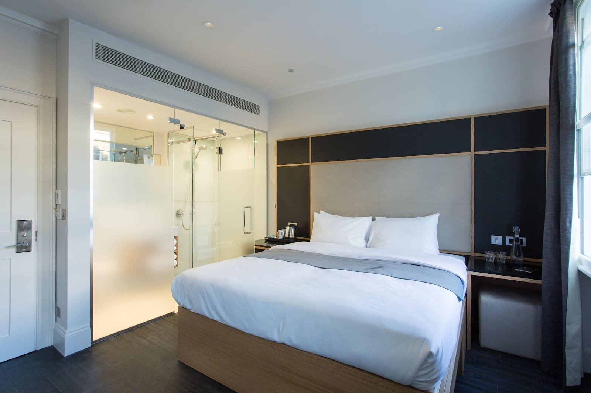

*The bathroom is a glass box inside the bedroom, not behind a solid wall: part frosted to about head height, with the shower behind clear glass.*

**The cheapest grade, the Z Inside Queen at £65, has no window.** The Z Queen at £75 has one and is the same 14 square metres, which is larger than the 9-square-metre Z Double at Z Covent Garden. Above that are the Z King at 20 square metres from £85, a grade only this branch sells, the Junior Suite at 26 square metres from £95, and the Z Club from £110 with breakfast included. Our [windowless rooms guide](/articles/windowless-hotel-rooms-london/) explains what the Inside grade is like to sleep in.

### Park Avenue Baker Street — townhouses on both sides of the street

*173 and 154–156 Gloucester Place, NW1 6DX · Marylebone station 4 min, Baker Street 5 min · [Hotels.com](hotelscom:h521008)*

Eighteenth-century Georgian houses on both sides of Gloucester Place, with a 24-hour reception and a glass-roofed breakfast room. **Some rooms are on the lower ground floor**, so ask which floor you are on, and a party booking several rooms may be split across the road: the hotel says only that it will try to keep a booking in one building. Members registered on its site get 15% off.

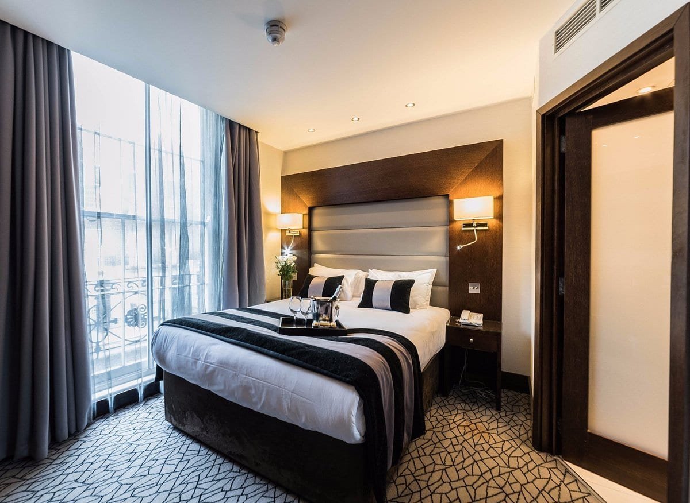

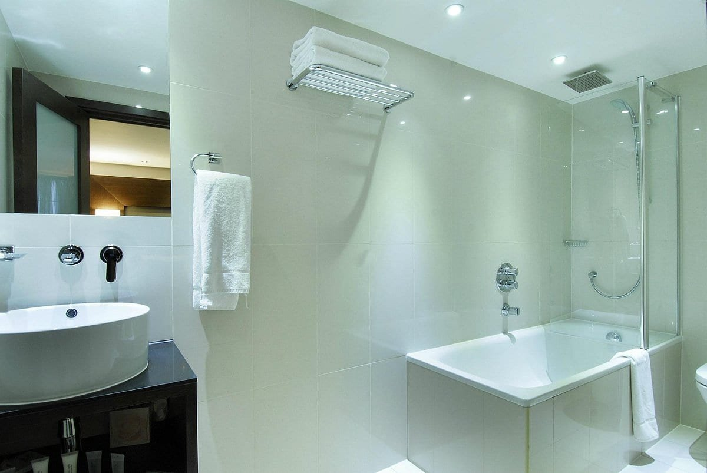

*A double with a full-height window, and a bath with a rain shower over it.*

### Holmes Hotel London — where children under 12 stay and eat free

*118 rooms · 83 Chiltern Street, W1U 6NF · Baker Street 2 min · [Hotels.com](hotelscom:h6473)*

Four restored Georgian buildings on Chiltern Street, one of them the former Bedford College for Women, themed lightly on Baker Street's fictional resident. The restaurant, Kitchen at Holmes, holds two AA rosettes, and the Duplex Loft Suites are 50 square metres over two floors. There is a gym, and dogs are welcome.

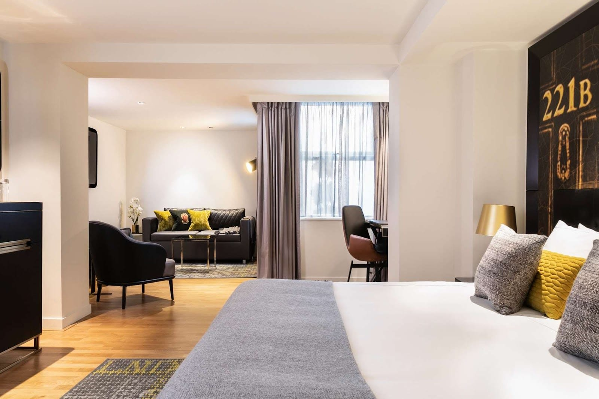

*A suite with a separate sitting area; the headboard is printed with the 221B front door.*

**The Family Experience package** covers two adults and up to two children aged 12 and under: the children stay and eat free, breakfast is included for everyone, and it takes up to 25% off the best available rate. Sofa beds and interconnecting rooms are available. Our [Sherlock Holmes in London](/articles/sherlock-holmes-london/) guide covers the museum up the road at 221b.

### Dorset Square Hotel — Firmdale's first, on Thomas Lord's first cricket ground

*££££ · 38 rooms · 39–40 Dorset Square, NW1 6QN · Marylebone station 5 min, Baker Street 10 min · [check prices](hotel:dorset-square-hotel)*

Tim and Kit Kemp's first hotel, in a Regency building facing the garden square that was Thomas Lord's original cricket ground. The 38 bedrooms carry cricket artwork, the Drawing Room has an honesty bar and a fire, and The Potting Shed names its cocktails after the same history. It is on a residential square rather than a shopping street.

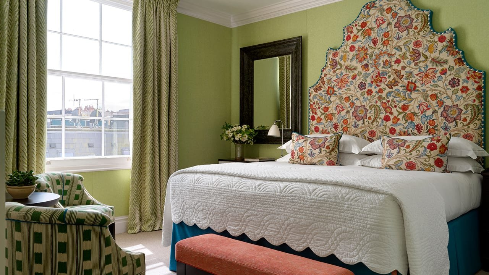

*Firmdale's look: a tall embroidered headboard, patterned fabrics and a large sash window.*

**It is the closest hotel in this guide to a Wembley train.** Marylebone station is five minutes' walk, and the hotel times the Chiltern Railways run to Wembley Stadium at nine minutes. Our [Wembley guide](/articles/wembley-stadium-arena-guide/) covers getting back after a concert.

### The Landmark London — the pool and the palms

*££££ · 222 Marylebone Road, NW1 6JQ · Opposite Marylebone station, Baker Street 5 min · Check-out noon · [Hotels.com](hotel:the-landmark-london)*

Open since 1 July 1899, opposite Marylebone station. The Winter Garden is a glass-roofed atrium planted with palm trees, home to the restaurant and an afternoon tea served beneath the palms.

**For families it has two things**: an Executive Family Room with two double beds and a lounge area, plus family suites and studios, and a **15-metre chlorine-free pool with children's hours of 9 to 11am and 3 to 5pm**. Cots are free for under-twos. Marylebone Road outside is four lanes of traffic. At weekends breakfast is for residents only. Our [family hotels guide](/articles/best-family-hotels-london/) compares it with the other family hotels in London.

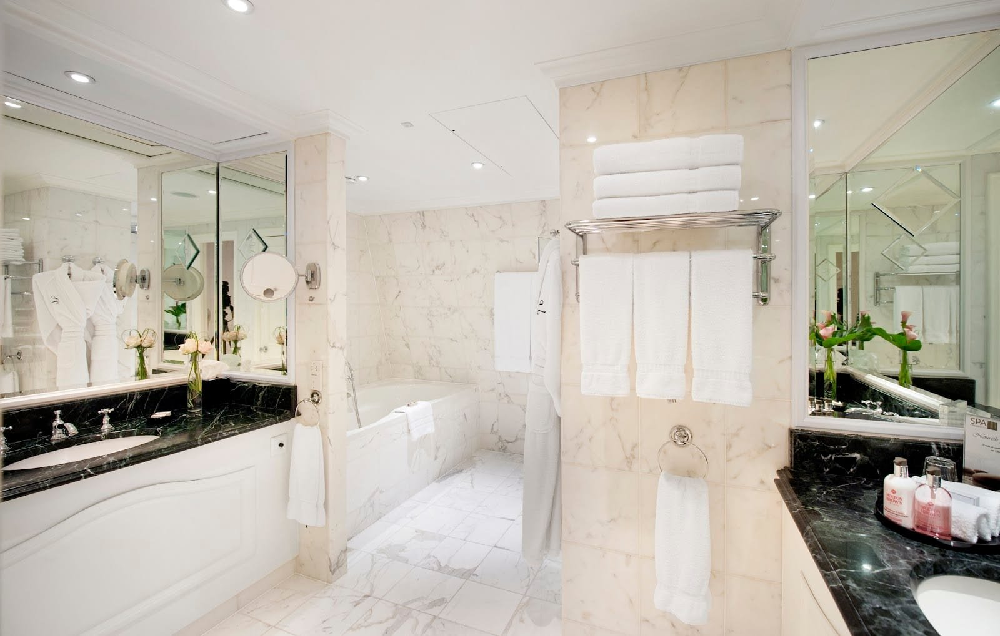

*A room with two double beds, and a marble bathroom with a bath and two basins.*

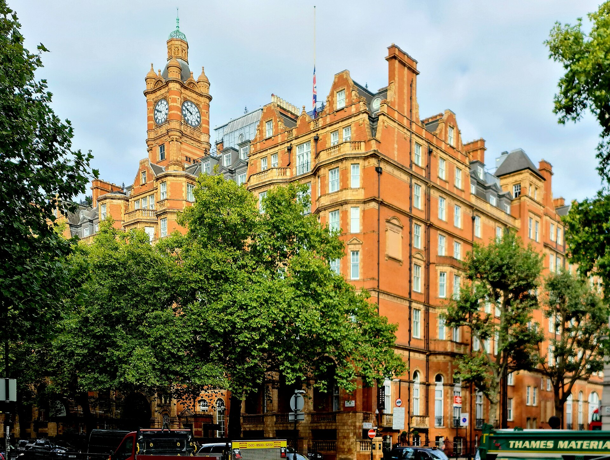

*The Landmark's clock tower and red-brick frontage on Marylebone Road. Photo: [Ricardalovesmonuments](https://commons.wikimedia.org/wiki/File:Landmark_Hotel_London_%281%29.jpg), [CC BY-SA 4.0](https://creativecommons.org/licenses/by-sa/4.0).*

## Hotels on Langham Place, by Oxford Circus

### The Langham, London — the grand hotel, since 1865

*About £550 · 1c Portland Place, W1B 1JA · Oxford Circus 5 min · Breakfast extra · [check prices](hotel:the-langham-london)*

Opened in 1865 as Europe's first grand hotel, opposite BBC Broadcasting House. **The Palm Court claims to be where British afternoon tea began**, and it books out weeks ahead, so reserve a table when you book the room; our [afternoon tea guide](/articles/best-afternoon-tea-london/) covers the sittings.

Artesian is the cocktail bar, Chuan Body + Soul is the spa, and there is a swimming pool. The Wigmore, the hotel's British tavern, is the cheap way to eat in the building. There are family rooms as well as suites.

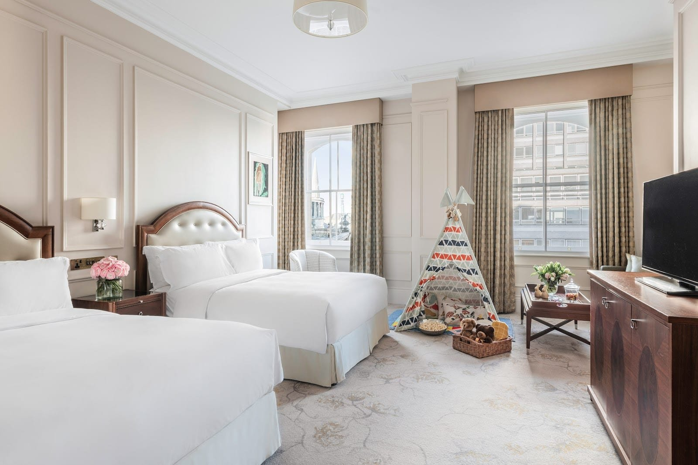

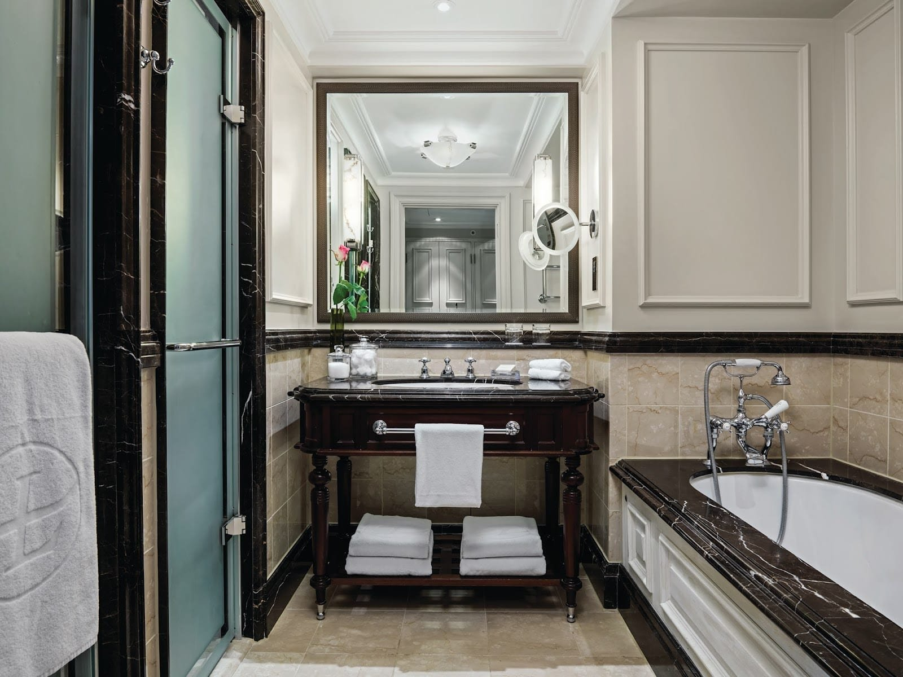

*A family room with two double beds and a teepee set up for children; the bathroom has a bath with a hand shower and a wooden washstand.*

### Treehouse Hotel London — the top floors, with a view from every room

*About £250 · 14–15 Langham Place, W1B 2QS · Oxford Circus 4 min · Breakfast extra · [Hotels.com](hotel:treehouse-hotel-london)*

The hotel occupies the top floors of a building next to Broadcasting House, so the rooms look out over the city rather than into a light well. The Nest, the rooftop bar, looks across to Regent's Park and the Shard, and Madera serves Californian-Mexican food.

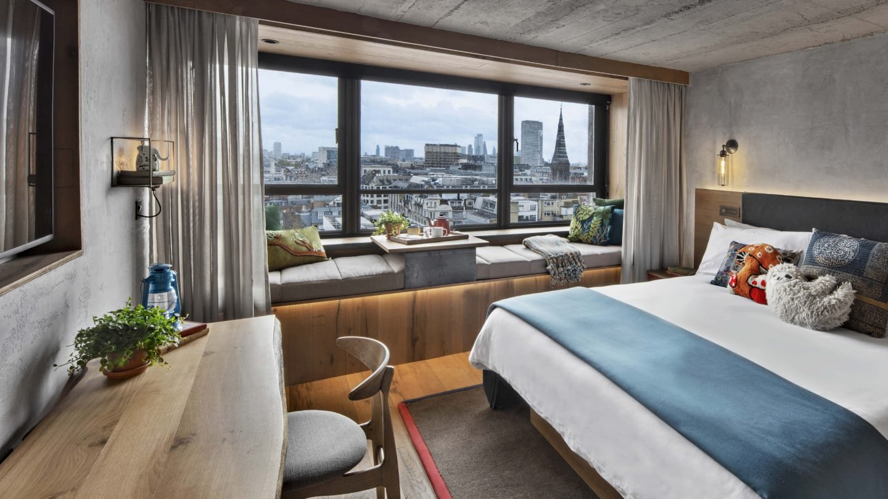

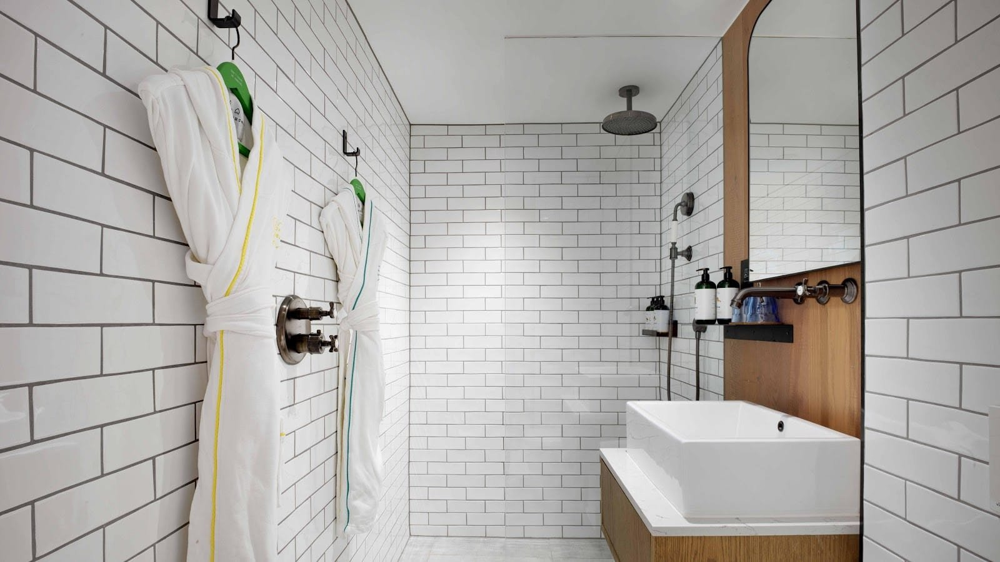

*The window seat runs the width of the room; the bathroom photographed has a walk-in rain shower.*

Rooms are 21 to 24 square metres. **The Lookout Two Twin Doubles sleeps four in 24 square metres**, and connecting pairs such as the Connecting Skyline Queens give a family 42. A Family Tree package adds breakfast and a teepee set up for the children. Dogs are welcome.

## Where to stay just outside Marylebone

**Cheaper, by Regent's Park:** [YHA London Central](hotel:yha-london-central) on Bolsover Street is a purpose-built hostel with dorms and private rooms, six minutes from Great Portland Street and just over the line in Fitzrovia. Our [budget hotels guide](/articles/best-budget-hotels-london/) covers the cheap options across London.

**For the airport:** [Paddington](/articles/paddington-area-guide/) is fifteen minutes' walk west of The Landmark, with the Heathrow Express and the Elizabeth line.

**For evenings out:** Fitzrovia and Soho start on the far side of Langham Place. Our [Soho and West End guide](/articles/where-to-stay-soho-west-end/) covers the hotels there, and our [Mayfair guide](/articles/where-to-stay-mayfair/) covers the hotels south of Oxford Street. For how Marylebone compares with every other base in the city, see [the best areas to stay in London](/articles/best-areas-to-stay-in-london/).

## Noise, and the quiet streets

**Marylebone's crowds are daytime crowds.** The high street winds down in the early evening, and there are no late-night bars of the Soho kind.

**The noise is traffic.** Marylebone Road carries four lanes past The Landmark and the Baker Street end; Baker Street and Gloucester Place are one-way through routes; and the Marble Arch junction, at the end of Oxford Street, is busy all night. At The Cumberland, Montcalm Mayfair and the Z, ask for a room at the back.

**Away from the traffic** are Dorset Square, the streets around Manchester Square behind the Wallace Collection, and the side streets off the high street. Our [walk from Baker Street through Regent's Park](/articles/regents-park-marylebone-walk/) passes most of them.

## Getting in and out

**Baker Street** has five lines: Bakerloo, Circle, Hammersmith & City, Jubilee and Metropolitan. The Circle, Hammersmith & City and Metropolitan run direct to King's Cross St Pancras for the Eurostar.

**Bond Street** has the Elizabeth, Central and Jubilee lines. The Elizabeth line runs direct to Heathrow, Paddington and Liverpool Street.

**Marble Arch** is Central line only. **Oxford Circus** has the Bakerloo, Central and Victoria lines, and the Victoria line goes direct to Euston, King's Cross and Victoria. **Regent's Park** is Bakerloo; **Great Portland Street** is Circle, Hammersmith & City and Metropolitan.

**Marylebone station** has the Bakerloo line and Chiltern Railways mainline trains to Wembley Stadium, Bicester Village and beyond.

**Heathrow:** the Elizabeth line from Bond Street, no change, or the Heathrow Express from Paddington. Our [Heathrow to London guide](/articles/heathrow-airport-to-london/) compares the fares.

*Typical nightly rates for a double, or each hotel's own published from-rate where it gives one, checked 24 September 2026. The £ symbols mark a price band where a hotel publishes no rate. Walking times come from the hotels where they give them. Prices move nightly, so check your own dates.*
