Mayfair is where London keeps its grand hotels. **The Ritz, Claridge's, The Connaught, The Dorchester and Brown's** all sit in the grid of streets between Oxford Street, Regent Street, Piccadilly and Park Lane, and a double at the best known of them typically runs from **about £600 to £850** a night.

So the useful questions are narrower: which grand hotel suits the trip, and is there anything in Mayfair that isn't £500 or more? There is an underground hotel on Park Lane from £90, and there are apartments with kitchens that make sense for a group or a long stay.

> 💡 **The Short Version:** **[Zedwell Park Lane](hotel:zedwell-park-lane)** is the cheapest bed in this guide at **£90 to £207**, and it is **windowless and entirely underground**. With a group or for a week, **[Native Mayfair](hotel:native-mayfair)** and **[No.5 Maddox Street](hotel:no5-maddox-street)** give you a kitchen. Among the grand hotels, choose on what you will use: **[The Connaught](hotel:the-connaught)** for its bar and Mount Street, **[Claridge's](hotel:claridges)** for the art deco rooms and the tea, **[45 Park Lane](hotel:45-park-lane)** if every window should face Hyde Park, **[Brown's](hotel:browns-hotel)** for family suites, and **[The Ritz](hotel:the-ritz-london)** only if you are happy to wear a jacket and tie to tea.

## Which part of Mayfair

Mayfair's four edges feel different and use different stations.

**Park Lane**, the western edge, is a dual carriageway facing Hyde Park. The Dorchester, 45 Park Lane and the Four Seasons are here, with Hyde Park Corner at the southern end and Marble Arch at the northern. You get the park across the road and the traffic under the window.

**Grosvenor Square and Mount Street**, the north-west, is the quiet, residential heart: Mount Street's pink terracotta terraces, Mount Street Gardens and small, very expensive shops. The Connaught, Claridge's, The Chancery Rosewood, The Beaumont and The Twenty Two are all within a few hundred metres of each other, and Bond Street station, with the Elizabeth line, is about five minutes' walk.

**Piccadilly and Green Park**, the south, is the busiest edge. The Ritz and the Athenaeum face the park, Brown's is on Albemarle Street by the Royal Academy, and Half Moon Street and Curzon Street lead into **Shepherd Market**, a pocket of pubs and small restaurants where Mayfair's evening crowd drinks outside.

**Hanover Square and Regent Street**, the east, is closest to Oxford Circus and a ten-minute walk from Soho. Mandarin Oriental Mayfair and No.5 Maddox Street are here.

Our [Mayfair area guide](/articles/mayfair-area-guide/) covers what to see once you are here: the arcades, Cork Street's galleries and the Royal Academy. The [Fitzrovia to Mayfair walk](/articles/fitzrovia-mayfair-walk/) finishes down Mount Street and through Shepherd Market to Green Park.

## Choosing a grand hotel by what you will use

What separates the five-star hotels is the building, the room and one or two things downstairs.

| If you want | Book | Why |
| --- | --- | --- |
| Hyde Park from bed | 45 Park Lane | Every one of its 45 rooms and suites overlooks the park |
| A pool | The Chancery Rosewood | A 25-metre pool in its spa; 45 Park Lane guests get a subterranean pool, the Four Seasons a rooftop spa |
| The bar | The Connaught | The Connaught Bar, which our cocktail bars guide covers |
| Afternoon tea | Claridge's or The Ritz | Claridge's has served tea for more than 120 years; The Ritz's is from £95, in jacket and tie |
| Children | Brown's | Interconnecting rooms of 105 sq m, babysitting and half-price children's menus |
| A kitchen | The Athenaeum's residences | Eighteen of them, with the hotel's staff on call |
| Something unusual | The Beaumont | You can book a bedroom inside an Antony Gormley sculpture |

## The cheaper end, and the kitchens

### Zedwell Underground Hotel Park Lane: a Park Lane address from £90

*£90–£207 a Cocoon 2 · 77 Park Lane, W1K 7TP · Marble Arch 7 min · Breakfast extra*

**[Zedwell Park Lane](hotel:zedwell-park-lane)** is built in the space beneath Park Lane, and every room is **windowless by design and soundproofed**. The standard Cocoon 2 is 7 square metres and sleeps two; there is an accessible Cocoon 2 of 10 square metres and a **Cocoon 4 of 14 square metres that sleeps four**. Rooms have a rainfall shower and no television.

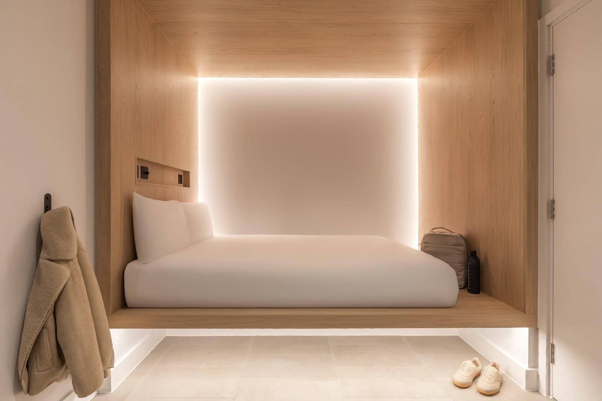

*A Cocoon: the bed is a platform in a lit oak alcove, with a ledge beside the mattress for a bag, and there is no window anywhere in the room.*

The rate moves a lot with the night: a Cocoon 2 was £90 on an October Sunday and a February Wednesday, and £207 on an October Saturday. Hyde Park Corner is an 11-minute walk. Our [windowless hotel rooms guide](/articles/windowless-hotel-rooms-london/) explains what the format is like to sleep in.

### Native Mayfair: a kitchen on a Grosvenor Estate mews

*Over £350 · 11 apartments · 10 Lees Place, W1K 6LN · Bond Street and Marble Arch under 10 min*

**[Native Mayfair](hotel:native-mayfair)** is eleven apartments in a Victorian mews house of 1890 on Lees Place, a quiet passage a block from Grosvenor Square. Each has a kitchen, which saves more here than elsewhere because eating out in Mayfair costs Mayfair prices. Our [aparthotels guide](/articles/aparthotels-london/) compares Native with the other apartment operators.

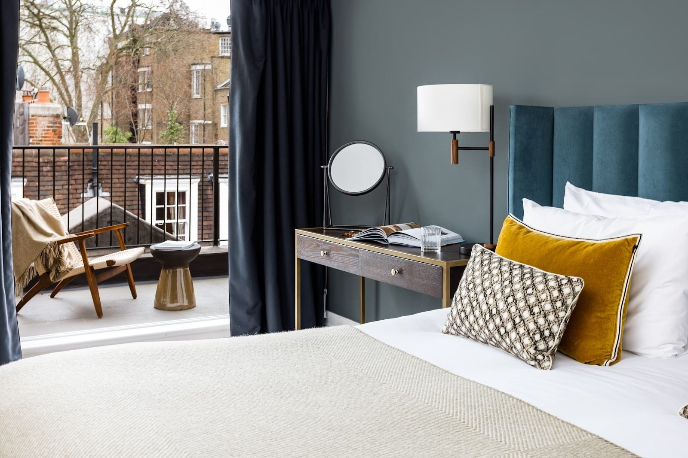

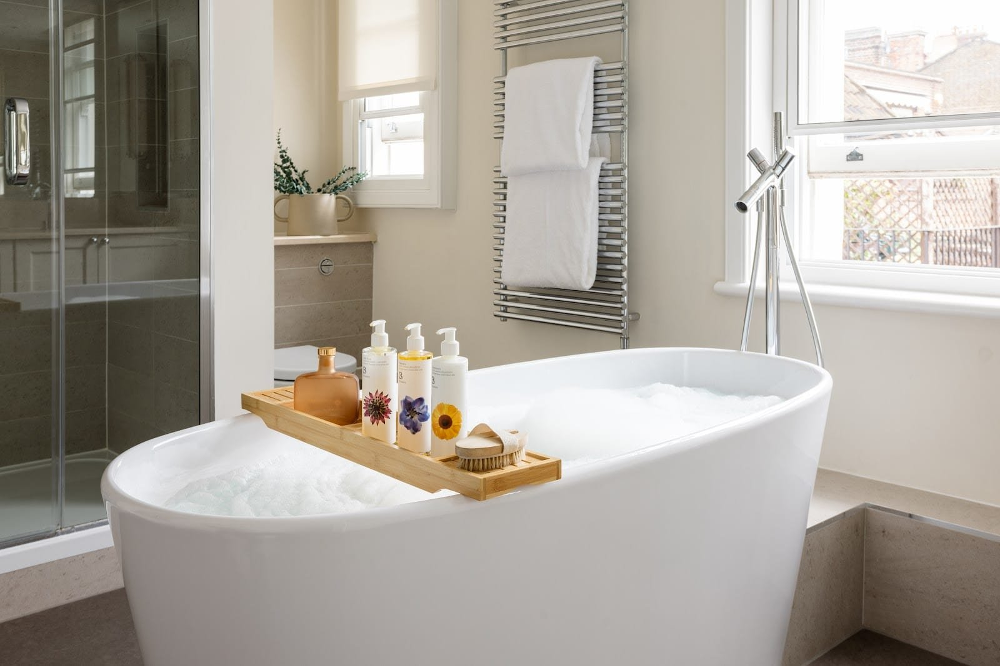

*The apartment shown has a roof terrace off the bedroom, and a bathroom with a freestanding bath and a separate walk-in shower.*

### No.5 Maddox Street: one to three bedrooms off Regent Street

*Over £350 · 12 apartments · 5 Maddox Street, W1S 2QD · Oxford Circus nearest*

**[No.5 Maddox Street](hotel:no5-maddox-street)** is twelve serviced apartments on a side street a minute off Regent Street, from a 27-square-metre one-bedroom to a **three-bedroom, two-bathroom flat of 79 square metres with outdoor space**. Some have private terraces and the operator marks which. Every one has a full kitchen and air conditioning, with regular housekeeping and a concierge team. It sells short stays as well as long ones of 30, 60 or 90 days.

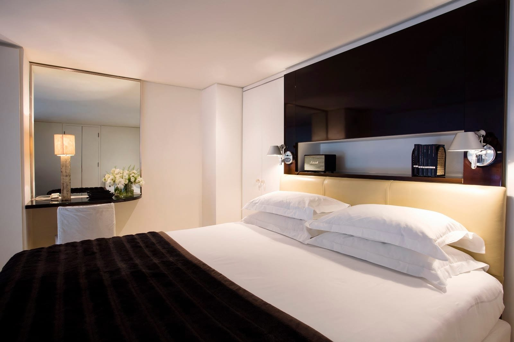

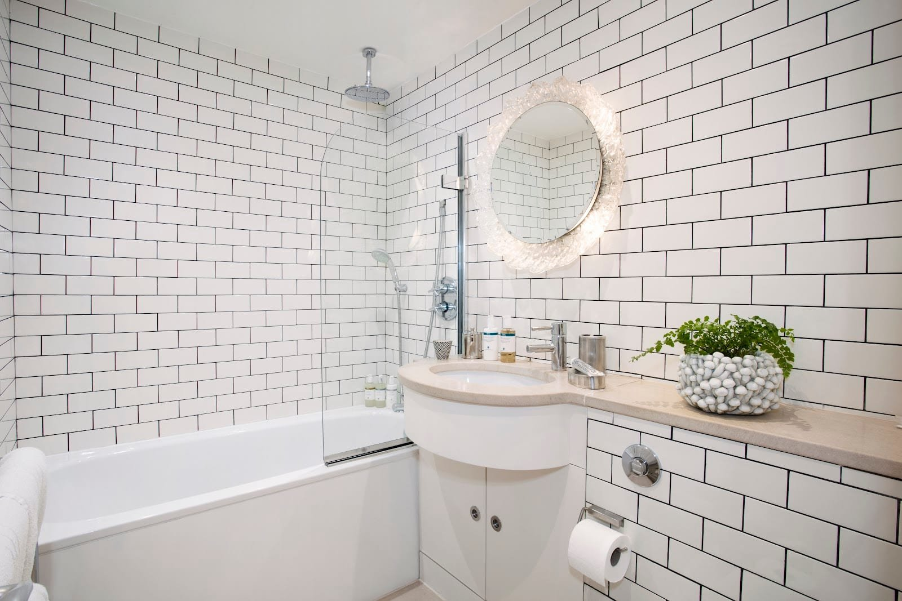

*A bedroom with a built-in dressing table, and a bath with a rainfall shower over it rather than a separate cubicle.*

## Park Lane: the big hotels on Hyde Park

### The Dorchester: newly renovated, facing the park

*About £800 · 173 rooms and 68 suites · 53 Park Lane, W1K 1QA · Breakfast extra*

**[The Dorchester](hotel:the-dorchester)** faces Hyde Park halfway between Hyde Park Corner and Marble Arch, and finished **a four-year renovation of its rooms and public spaces in 2026**. Ask for a Deluxe or Executive Park View room if the view is the point; the others look over Mayfair or a courtyard.

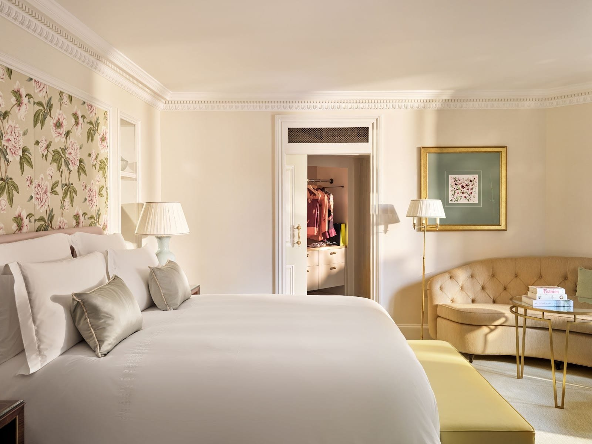

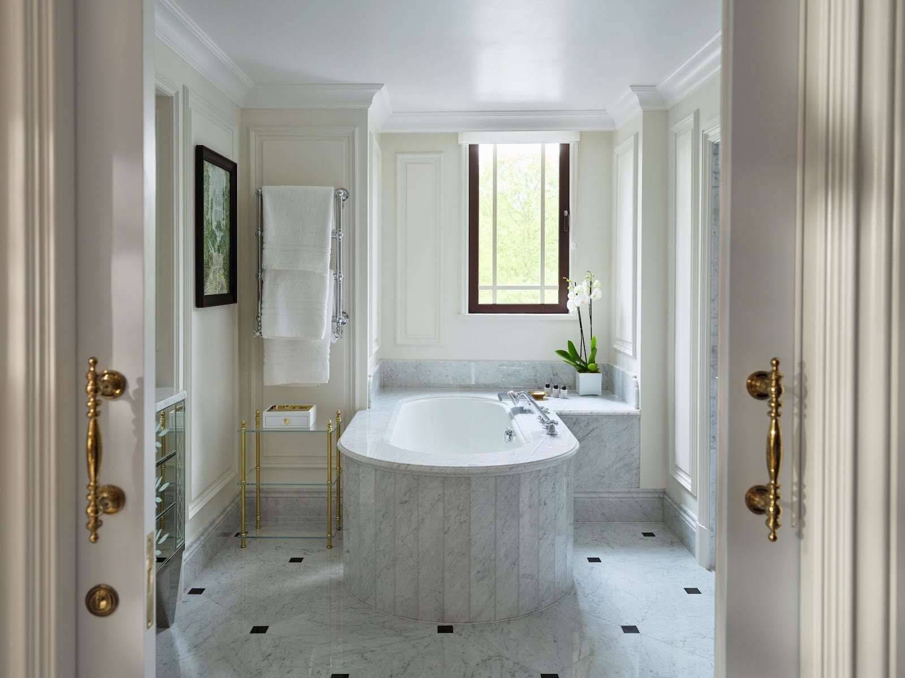

*A walk-in wardrobe off the bedroom, and a marble bathroom with the bath set under the window.*

Downstairs are Alain Ducasse at The Dorchester, The Grill, China Tang, Vesper Bar, the Artists' Bar and **afternoon tea in The Promenade**, where shorts and sportswear are not allowed. For families it sells connecting rooms, and some suites join into a five-bedroom suite; an extra bed for anyone 13 or over is £84 a night.

### 45 Park Lane: 45 rooms, all facing the park

*Over £350 · 45 rooms and suites · 45 Park Lane, W1K 1PN*

**[45 Park Lane](hotel:45-park-lane)** is The Dorchester's small sister: 45 art deco rooms and suites and a penthouse, **every one overlooking Hyde Park**, with the higher floors looking over London as well. Downstairs is CUT, Wolfgang Puck's steakhouse (in our [steak guide](/articles/best-steak-restaurants-london/)), and BAR 45. Guests use a subterranean spa with a pool and gym. Extra beds are free for children under 13.

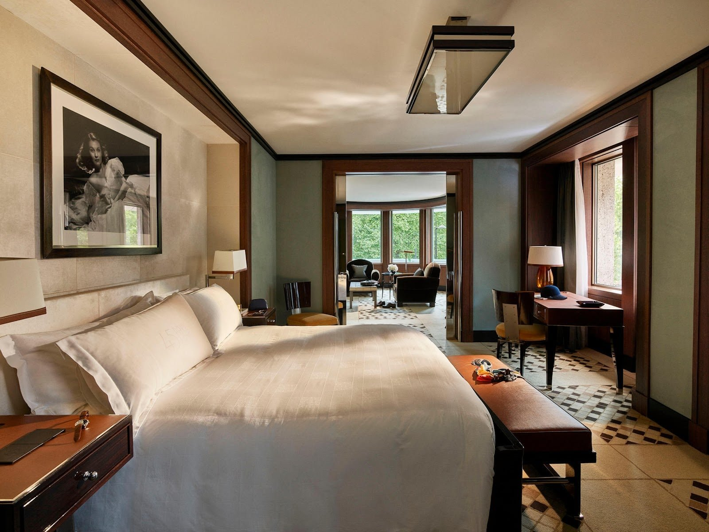

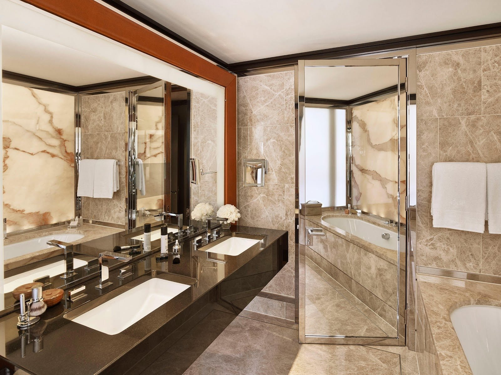

*A suite, with the sitting room's bay windows onto Hyde Park beyond the bedroom, and a marble bathroom with twin basins and a bath.*

### Four Seasons Hotel London at Park Lane: eleven storeys at Hyde Park Corner

*Over £350 · 153 rooms and 43 suites · Hamilton Place, W1J 7DR*

**[The Four Seasons](hotel:four-seasons-park-lane)** is an eleven-storey block directly opposite Hyde Park Corner, with Buckingham Palace a ten-minute walk through Green Park. Its **spa is on the roof**, with a vitality pool, sauna and steam room, and its restaurant is Pavyllon London by Yannick Alléno, where **children up to five eat free** from the kids' menu. Connecting rooms are available, and standard rooms take two adults and one child up to 14.

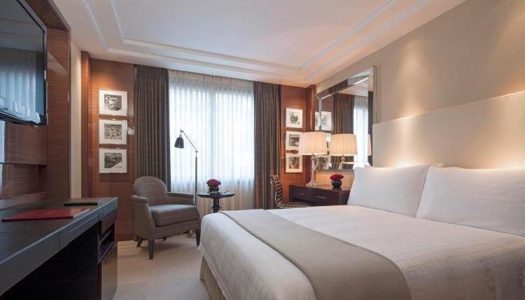

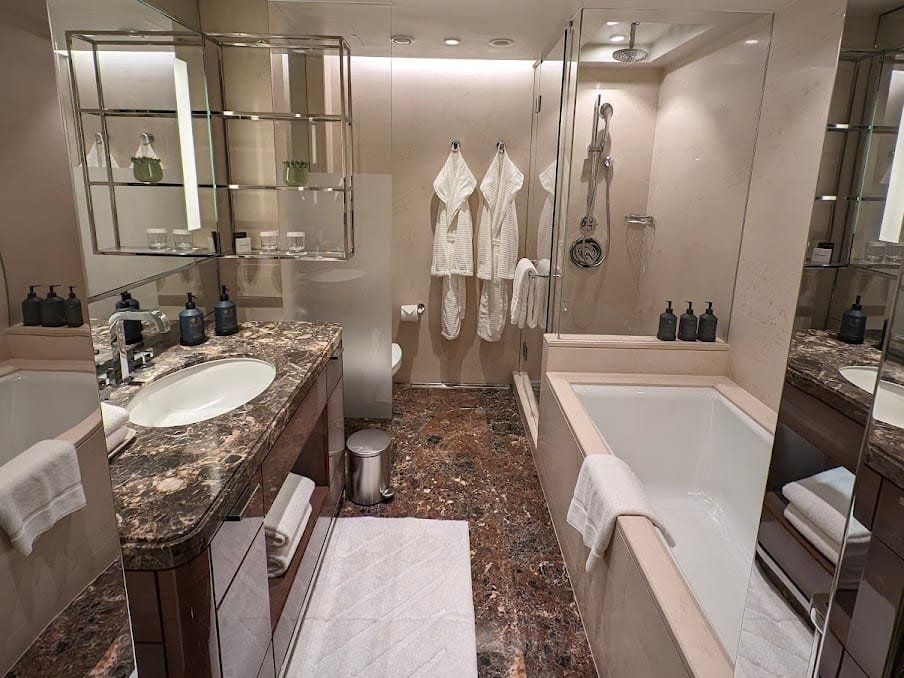

*A double room, and a bathroom with a separate bath and walk-in shower.*

## Grosvenor Square and Mount Street

### The Connaught: the bar, on Mount Street

*About £850 · Carlos Place, W1K 2AL · Bond Street 5 min, Green Park 10 min*

**[The Connaught](hotel:the-connaught)** sits where Mount Street meets Carlos Place, the part of Mayfair its owners call Mayfair Village. Most non-residents come for **the Connaught Bar** (in our [cocktail bars guide](/articles/best-cocktail-bars-london/)); residents also get Hélène Darroze's restaurant, the Connaught Grill, the Aman Spa in the basement and, in the suites, a personal butler. The afternoon tea is smaller and calmer than Claridge's.

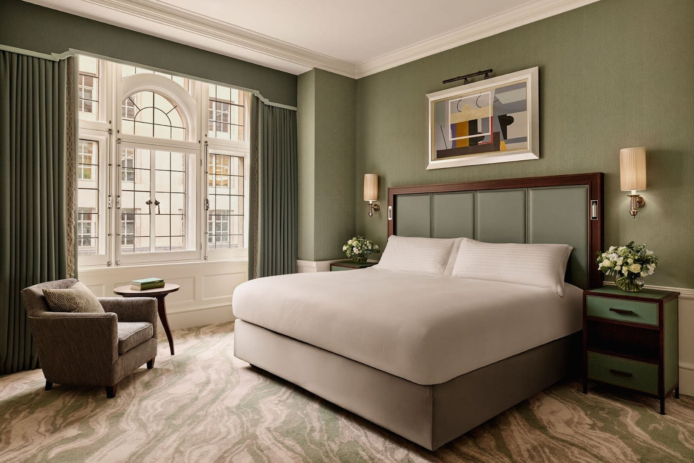

*A bedroom with a tall leaded window and space for an armchair and side table beside the bed.*

### Claridge's: the art deco one

*About £750 · Brook Street, W1K 4HR · Bond Street 5 min, Oxford Circus 10 min · Breakfast extra*

**[Claridge's](hotel:claridges)** is a red-brick Victorian building that became an art deco landmark in the 1920s, and its rooms span both: Victorian, art deco and contemporary. The afternoon tea has been served for more than 120 years and books well ahead. The newest arrival is **Dante Mayfair**, a permanent branch of the Greenwich Village cocktail bar. Our [family hotels guide](/articles/best-family-hotels-london/) covers what Claridge's does for children.

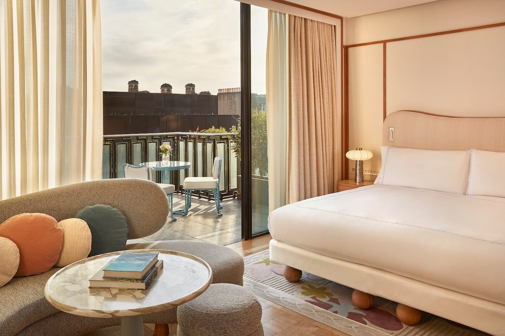

*A Balcony Room, one of the contemporary designs. The Victorian and art deco rooms look nothing like it, so check the photos for the room type you book.*

### The Chancery Rosewood: 144 suites in the old US Embassy

*Over £350 · 144 suites · 30 Grosvenor Square, W1K · Bond Street 5 min*

Eero Saarinen designed the American Embassy on Grosvenor Square in 1960, and **[The Chancery Rosewood](hotel:the-chancery-rosewood)** is that Grade II-listed building converted by David Chipperfield Architects into **an all-suite hotel**. Theodore Roszak's aluminium eagle is still in place. It has **eight restaurants and bars**, including Tobi Masa, a Japanese counter from the chef behind New York's Masa, and the Eagle Bar on the roof, with terraces over the square and Hyde Park. The spa has **a 25-metre pool**. There are **no fixed check-in or check-out times**. Its tea room, Jacqueline, is in our [afternoon tea guide](/articles/best-afternoon-tea-london/).

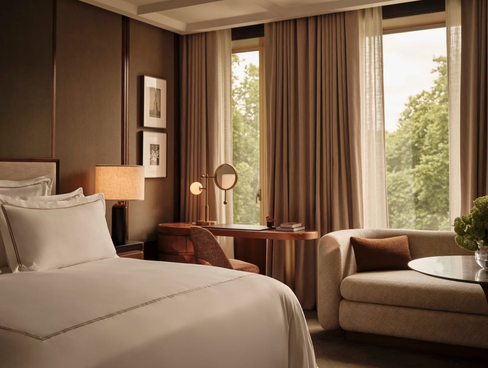

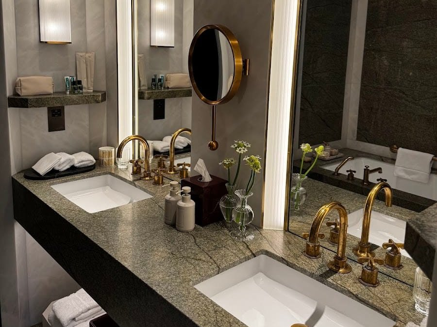

*Tall windows onto trees, and twin basins in green stone with the bath beyond.*

### The Beaumont: art deco, with a Gormley you can sleep in

*About £600 · 101 rooms · 8 Balderton Street, Brown Hart Gardens, W1K 6TF · Bond Street nearest*

**[The Beaumont](hotel:the-beaumont-mayfair)** is an art deco building on Brown Hart Gardens, a raised public garden just south of Oxford Street. The entry-level Classic rooms are **30 square metres**, twice the Mayfair Townhouse's smallest. Its oddity is **ROOM by Antony Gormley**, a sculpture on the facade with a bedroom inside, 4 metres square and 10 metres high. Rosi is the restaurant, Le Magritte the bar, and tea is in The Gatsby Room, with no formal dress code. Dogs are welcome.

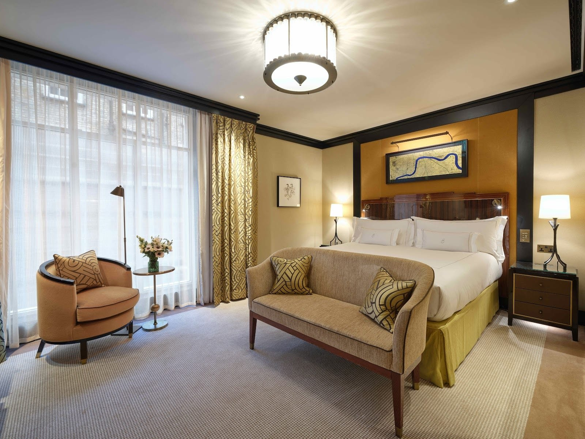

*Deco furniture throughout and a full-height window; this one looks onto the building next door.*

### The Twenty Two: a members' club with bedrooms

*Over £350 · 22 Grosvenor Square, W1K 6LF · Check-in 3pm, out at noon*

**[The Twenty Two](hotel:the-twenty-two)** is an Edwardian house on Grosvenor Square that is both a members' club and a hotel. Guests become temporary members for their stay, but **the club is over-21s only** and the Living Room admits children until 5pm, so it suits couples far better than families. There is no gym on site; guests get free use of BXR Marylebone, a 12-minute walk. The hotel pre-authorises **£300 a night for incidentals** on top of the room.

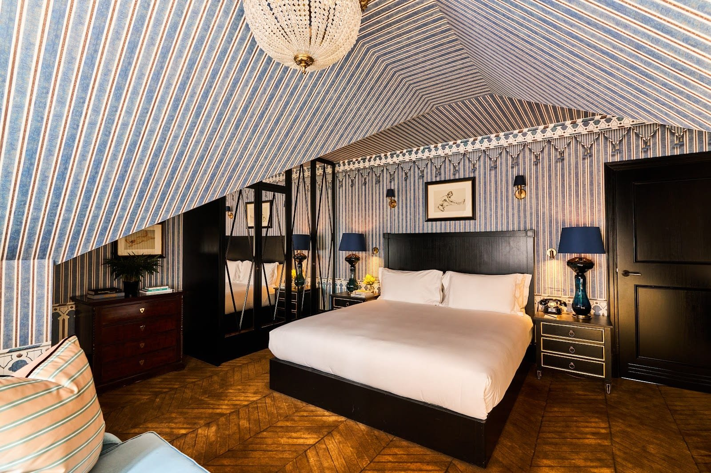

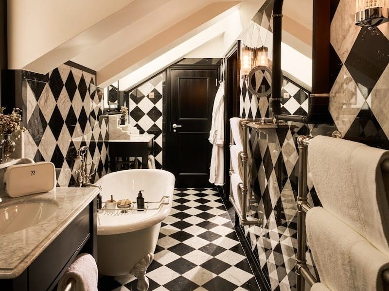

*A room under the eaves with a tented striped ceiling, and a claw-foot bath; the sloping ceiling cuts the headroom on one side.*

## Piccadilly and Green Park

### The Ritz: the dress code decides it

*Over £350 · 150 Piccadilly, W1J 9BR · Green Park next door*

**[The Ritz](hotel:the-ritz-london)** opened in 1906 and overlooks Green Park, with Green Park station beside it. **Men must wear a jacket and tie for afternoon tea and for lunch and dinner in The Ritz Restaurant, and jeans and sportswear are banned there for everyone**; smart jeans are allowed at breakfast and in the Rivoli Bar. Children under 16 are exempt at tea, which costs from £95 for adults and £73 for children. It sells family rooms, and suites overlooking the park.

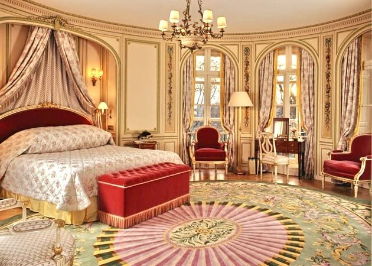

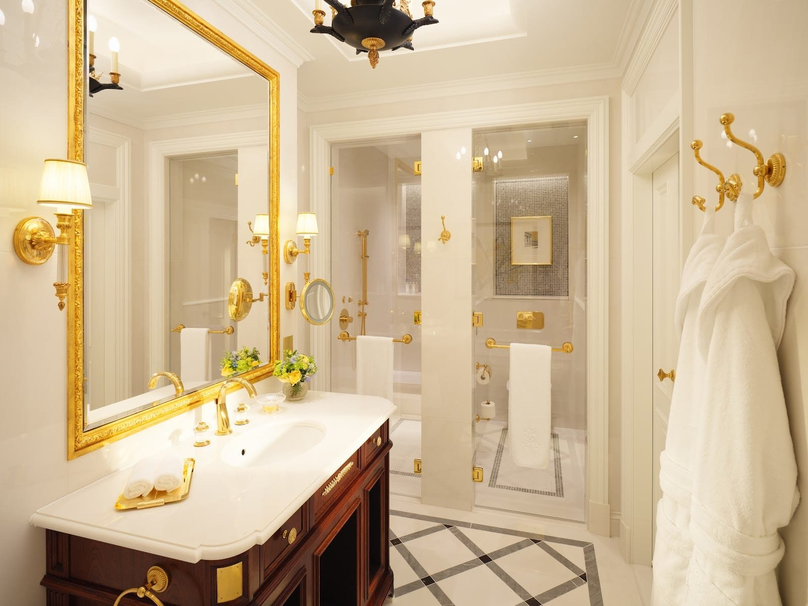

*A suite bedroom in Louis XVI style, and a bathroom with gilt fittings and a walk-in shower.*

### Brown's Hotel: the family pick

*About £650 · 33 Albemarle Street, W1S 4BP · Green Park 3 min · Breakfast extra*

**[Brown's](hotel:browns-hotel)** has been on Albemarle Street since the 1830s and sells two rooms built for families. The **Interconnecting Family Room is 105 square metres and the Two Bedroom Family Suite 155**, and the Rocco Forte Kids programme adds 24-hour babysitting on request and half-price children's menus. Standard Executive rooms are 30 square metres. Tea is in The Drawing Room, which has no dress code, and on Thursday evenings it becomes a jazz room.

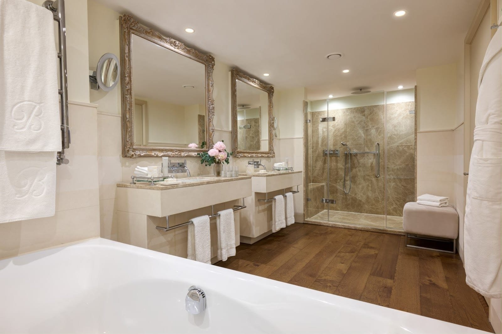

*A Deluxe Suite bathroom, with two separate basins, a walk-in shower and a bath.*

### 1 Hotel Mayfair: plants, and whole family wings

*Over £350 · 3 Berkeley Street, W1J 8DL · Green Park a moment's walk*

**[1 Hotel Mayfair](hotel:1-hotel-mayfair)** is two existing buildings refitted with **1,300 plants, shrubs and trees** and filtered-water taps instead of plastic bottles. The restaurant is Dovetale, by Tom Sellers, and the spa is Bamford's. For a large family it sells **private wings of up to six connecting bedrooms** over a single floor. Bed linen is changed every third day unless you ask.

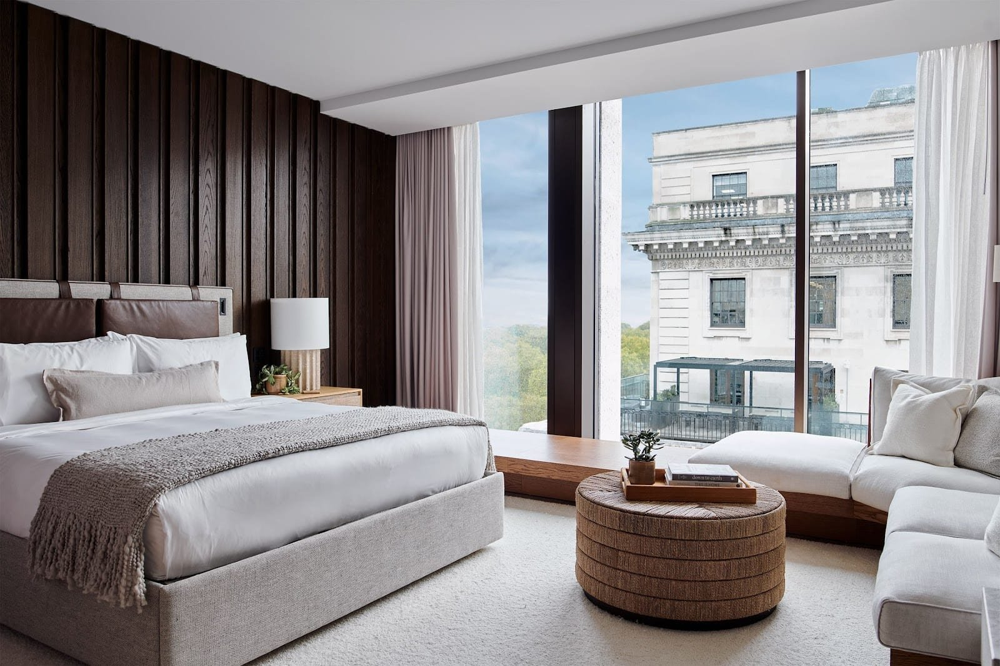

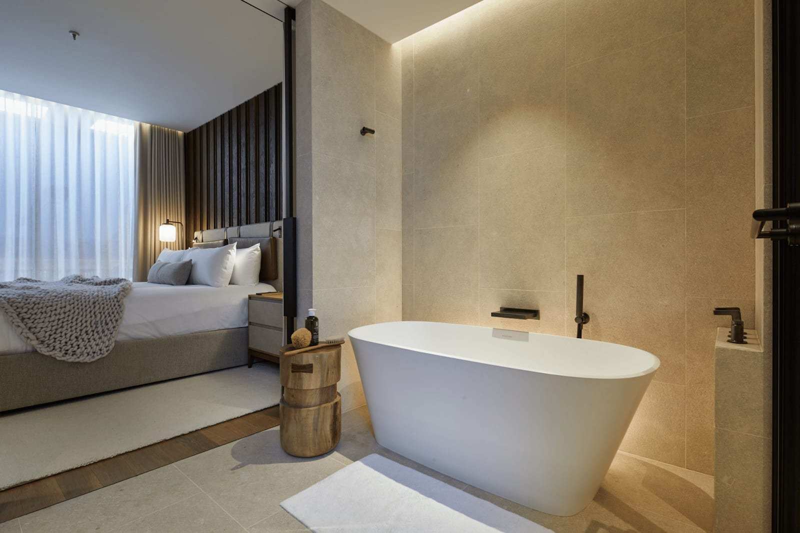

*Floor-to-ceiling glass with a built-in window seat, and a bath open to the bedroom, which suits a couple better than friends sharing.*

### The Athenaeum Hotel & Residences: residences with kitchens, facing Green Park

*116 Piccadilly · Green Park 2 min · [Hotels.com](hotelscom:175165)*

An independent hotel on a Piccadilly corner it has occupied in one form or another since 1850; the building became an art deco apartment block in the 1930s and faces Green Park across the road. Superior rooms are 19 square metres and interconnecting rooms are available; the draw for families is **18 townhouse residences with a kitchen and separate sitting room**, and a concierge who keeps kites and bikes for the park. There is a 24-hour gym and a spa with cedar hot tubs, and an afternoon tea with no ceremony. Cancellation on the residences closes seven days before arrival.

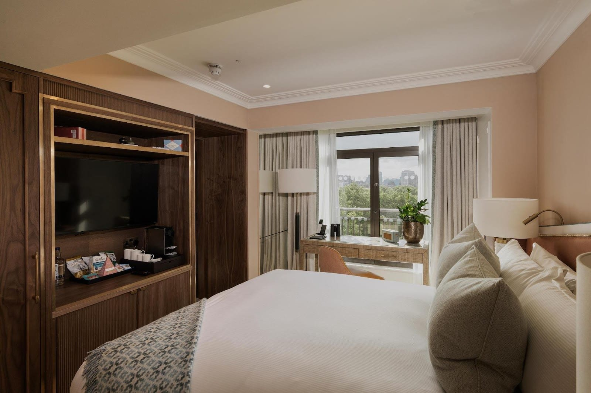

*A room with a desk at the window and a balcony door over Green Park.*

### The May Fair: 404 rooms by Green Park

*Stratton Street, W1J 8LT · Green Park 2 min · Check-in 3pm, out at noon*

**[The May Fair](hotelscom:h7606)** opened in 1927 and, at **404 rooms and suites**, is the largest hotel in this guide, which makes it the likeliest to have a room when the smaller houses are full. It has May Fair Kitchen (Japanese and Italian), a bar that often has live music, a spa and 24-hour gym, and a casino in the old art deco ballroom. Lifts work by room key only. Pets are not accepted apart from assistance dogs.

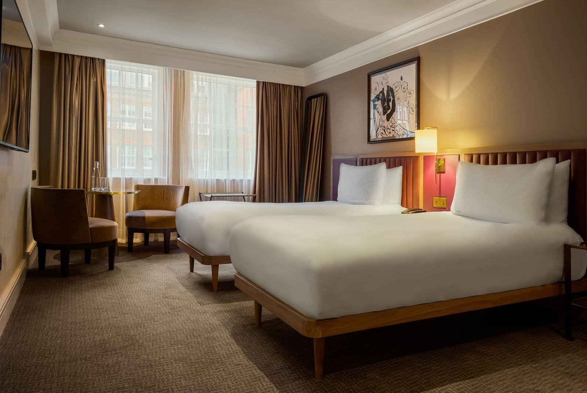

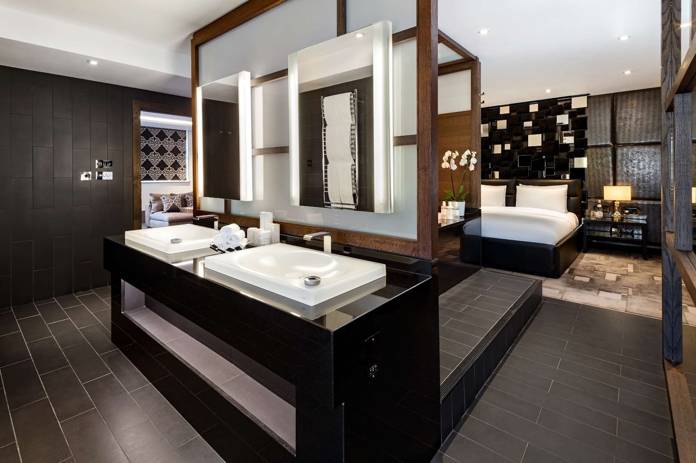

*A twin room with two separate beds, and a suite bathroom open to the bedroom behind a double vanity.*

### Flemings Mayfair: thirteen Georgian houses, and ten apartments

*7–12 Half Moon Street, W1J · Green Park nearest*

Robert Fleming opened his hotel on Half Moon Street in 1851, and it now fills **thirteen Georgian townhouses**, some from 1731. **[Flemings](hotelscom:h5614)** has 129 rooms and suites, including **ten serviced apartments of one to three bedrooms**. The restaurant is Ormer Mayfair, the bar Manetta's, and tea is served in the Drawing Room.

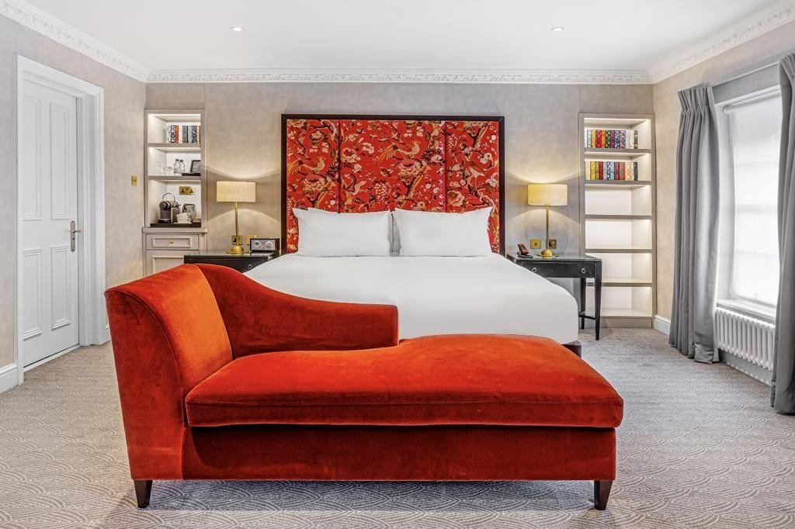

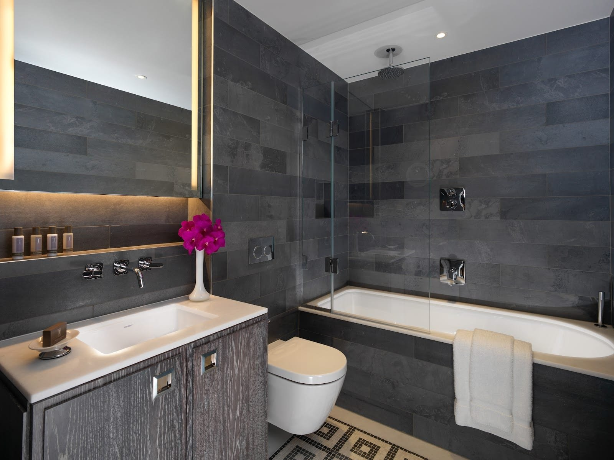

*A bedroom in one of the suites, and a slate bathroom with the shower over the bath.*

### The Mayfair Townhouse: Wilde's street, and small rooms

*Over £350 · Half Moon Street, W1J 7BG · Green Park nearest*

**[The Mayfair Townhouse](hotel:the-mayfair-townhouse)** joins **fifteen Georgian townhouses**, seven of them Grade II listed, on the street where Oscar Wilde set *The Importance of Being Earnest*. The design leans into it: foxes, a dandy theme and The Dandy Bar. **The smallest rooms average 14 square metres**, so read the grade before booking; some rooms and suites interconnect, and a corner of the building overlooks Shepherd Market.

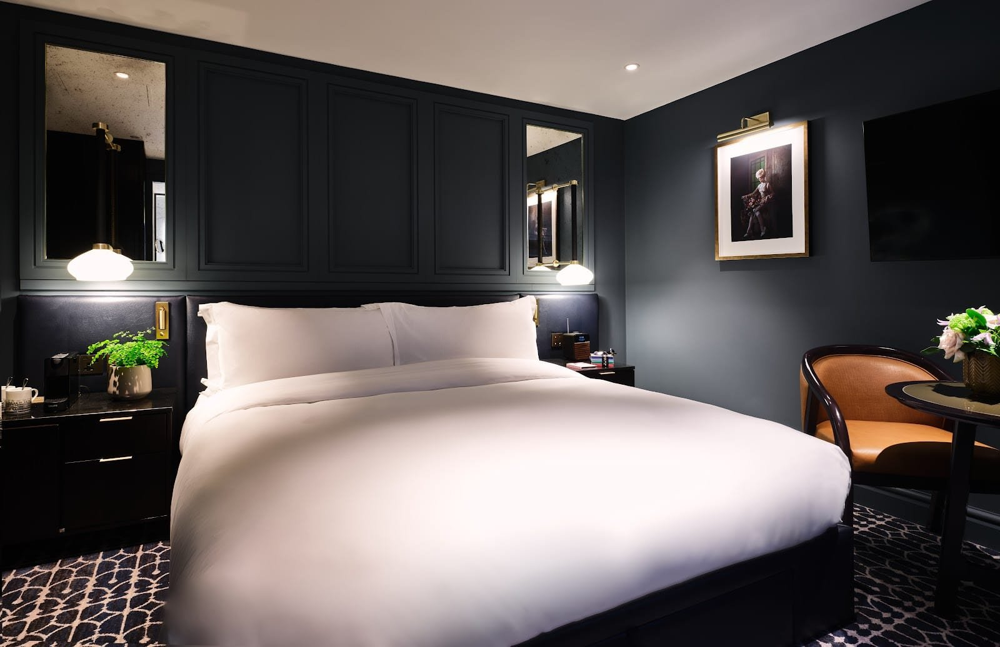

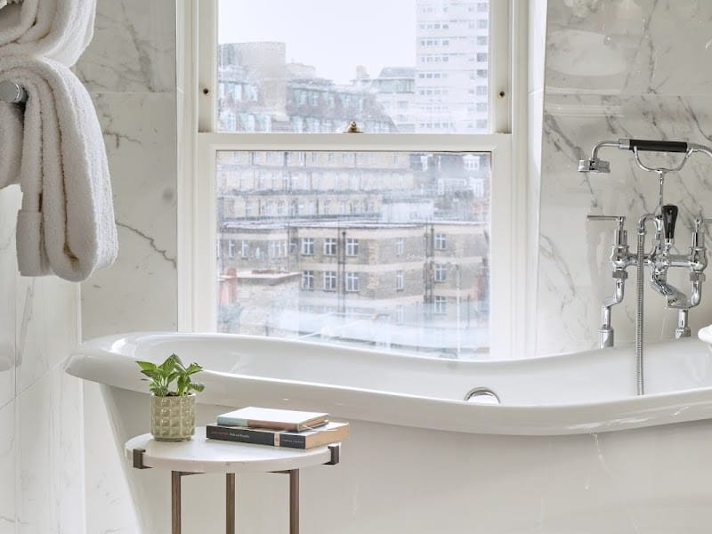

*Dark panelled walls in the bedroom, and a slipper bath under a sash window in the bathroom.*

### The Chesterfield Mayfair: tea for children, and live music every night

*94 rooms and 14 suites · 35 Charles Street, W1J 5EB*

Three houses on Charles Street, and Red Carnation's first hotel. **[The Chesterfield](hotelscom:h2276)** is known for its **Sweetshop Afternoon Tea**, which has a children's version for under-12s, and for **Sem's of Mayfair, the bar, which has live music every evening**. There is also a rooftop bar, Stanley's. The hotel arranges babysitting through a nanny service.

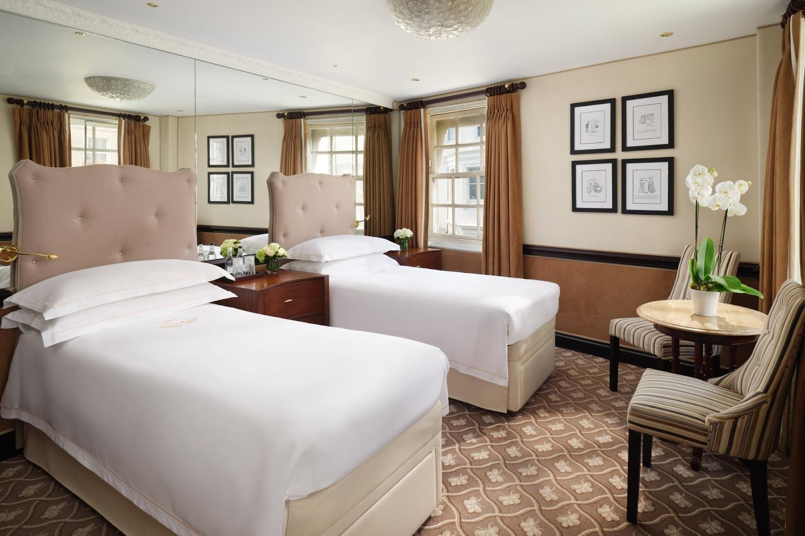

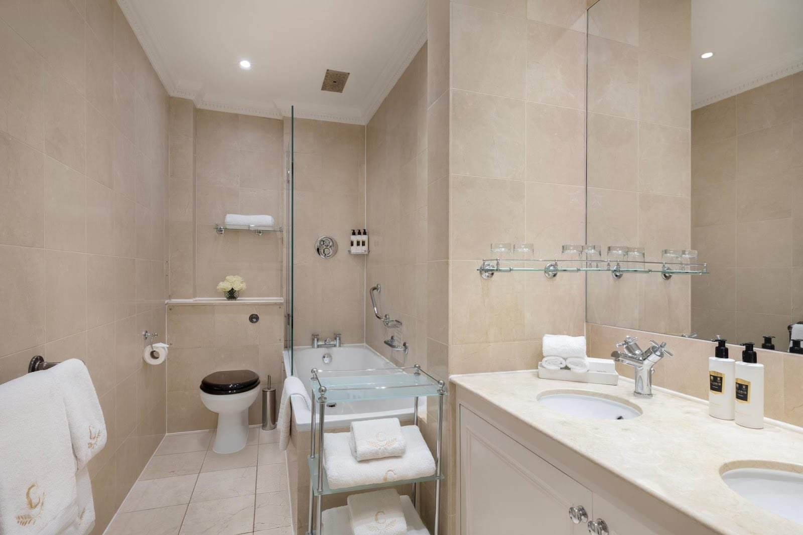

*A twin room with two single beds, and a marble bathroom with twin basins and the shower over the bath.*

## Hanover Square

### Mandarin Oriental Mayfair: the Oxford Circus end

*About £850 · 22 Hanover Square, W1S 1JP · Oxford Circus nearest · Breakfast extra*

**[Mandarin Oriental Mayfair](hotel:mandarin-oriental-mayfair)** is on Hanover Square at Mayfair's eastern edge, the grand hotel closest to Oxford Circus, Regent Street and Soho. Each room has a panel of hand-painted de Gournay wallpaper based on the magnolias in Hanover Square outside. It sells connecting and family rooms. The restaurants are **A.Wong**, Mazarine and the Atrium, and there is a rooftop bar. It is a separate hotel from Mandarin Oriental Hyde Park in Knightsbridge, so check which one you are booking.

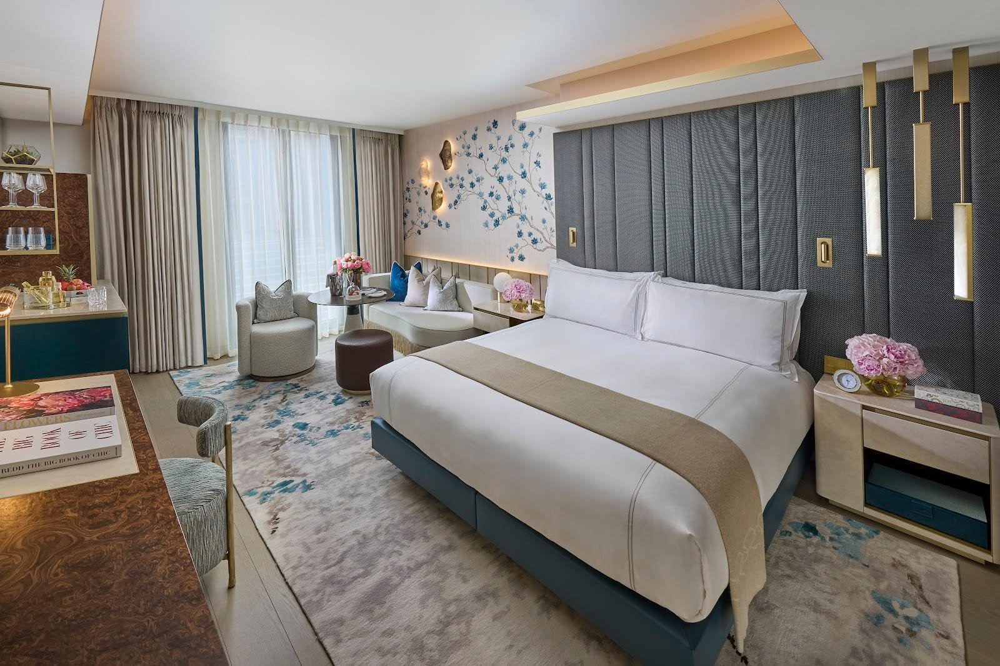

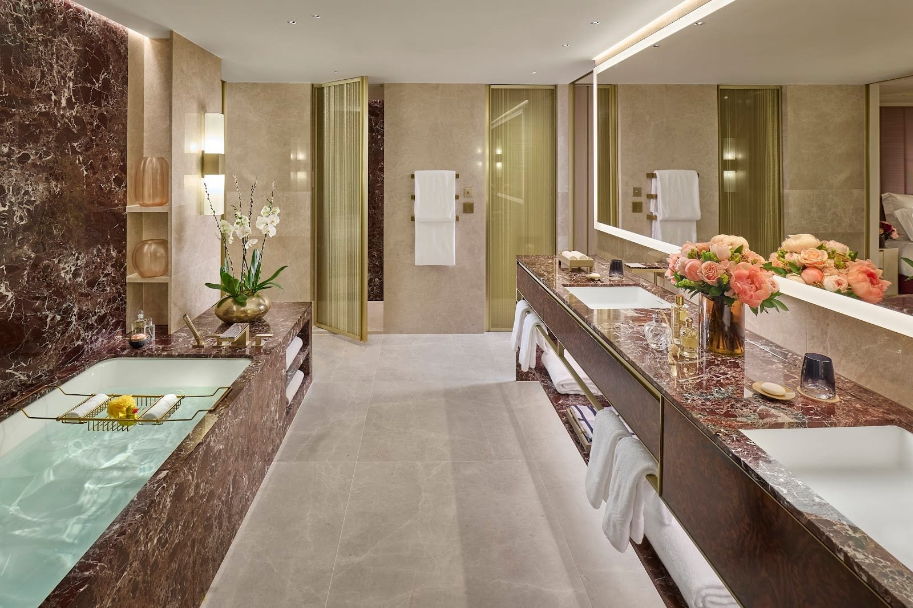

*The magnolia panel sits behind the sofa, with a bar opposite the bed; the bathroom has a bath and twin basins in red marble.*

## If none of these fits

**Marylebone**, north across Oxford Street, shares Bond Street station, and [The Zetter Townhouse Marylebone](hotel:the-zetter-townhouse-marylebone) is about £230, and our [Marylebone stay guide](/articles/where-to-stay-marylebone/) compares the rest. **Soho and the West End**, ten minutes east, is where the evenings are, and our [Soho and West End stay guide](/articles/where-to-stay-soho-west-end/) compares its hotels. For the wider choice, [best areas to stay in London](/articles/best-areas-to-stay-in-london/) sets Mayfair against the rest.

## Getting in and out

**Green Park** is on the Piccadilly, Victoria and Jubilee lines, **Bond Street** on the Elizabeth, Central and Jubilee lines, **Hyde Park Corner** on the Piccadilly, **Marble Arch** on the Central and **Oxford Circus** on the Central, Victoria and Bakerloo.

**Heathrow** has two direct lines: the Piccadilly runs to Green Park and Hyde Park Corner, and the Elizabeth line reaches Bond Street in about 35 to 40 minutes. Our [Heathrow guide](/articles/heathrow-airport-to-london/) compares the options.

**The rail terminals**: Victoria is one stop from Green Park on the Victoria line, King's Cross St Pancras four, and Paddington one stop from Bond Street on the Elizabeth line.

*Typical nightly rates for a double, checked September 2026. Mayfair prices change by the night, so check your own dates.*
