The O2 has one station, North Greenwich, on one Tube line, the Jubilee. So the useful question is not which hotel is nearest but which one is on the Jubilee close enough that the last train and the queue at the gates don't decide how your night ends. The same applies to indigo at The O2, the smaller venue on the same site. Our [O2 travel guide](/articles/the-o2-travel-guide/) covers parking, the cable car and the boat.

> 💡 **The Short Version:** **Canary Wharf** and **Canning Town** are the bases for most people: one stop either side of North Greenwich, two minutes on the train. The cheapest beds are at **[ibis London Canning Town](hotelscom:h19692814)**, opposite the station at a typical **£106**, and **[Travelodge London Docklands Central](https://www.travelodge.co.uk/hotels/697/London-Docklands-Central-hotel)**, **£34.99** on an October Sunday. The central base is **London Bridge**, nine minutes on the Jubilee. The trap is sleeping on the peninsula on a show night: the **InterContinental** was **£465** on a Sunday concert night and **£261** a week later. On Fridays and Saturdays the Jubilee runs all night; other nights the last train west leaves North Greenwich at **00:19**, or **23:45** on a Sunday.

## The bases compared

| Base | On the train | Door to door | The catch |
| --- | --- | --- | --- |
| **Canning Town** | Jubilee, 2 min | 17–18 min | Budget chains beside a road interchange |
| **Canary Wharf** | Jubilee, 2 min | 18–22 min | Hotels fill Monday to Thursday with business guests |
| **Royal Docks (ExCeL)** | DLR 2–5 min, then Jubilee 2 min | 20–27 min | A change at Canning Town, and the DLR stops before 01:00 |
| **Stratford** | Jubilee, 7–9 min | 23–29 min | The furthest of the east-side bases |
| **London Bridge and Southwark** | Jubilee, 8–11 min | 25–36 min | The last train west on a Sunday is 23:45 |
| **Greenwich town** | Bus 188 or 129, 11–25 min | 22–42 min | No train at all |
| **Greenwich Peninsula** | On foot | 5–15 min walk | Prices can quadruple on a show night |

*Door-to-door times include the walk from the hotel and from North Greenwich to The O2's doors, for a Saturday evening arrival and a 23:00 weekday departure, from TfL's Journey Planner, September 2026.*

## Where to stay, base by base

### Canary Wharf: one stop west

Canary Wharf is two minutes from North Greenwich, the first stop on the westbound Jubilee; our [Canary Wharf hotel guide](/articles/where-to-stay-canary-wharf/) has the full list. It's a business district, so its hotels fill Monday to Thursday and are cheapest on a Sunday night, which suits a Sunday show; Saturdays are not reliably cheaper. Our [Canary Wharf area guide](/articles/canary-wharf-area-guide/) covers where to eat before the show.

**[Novotel London Canary Wharf](hotel:novotel-canary-wharf)** is about **£160** at 40 Marsh Wall, E14 9TP, six minutes' walk from the Jubilee station and 22 minutes door to door. Bōkan, the restaurant and bar on its top floors, is open to non-residents.

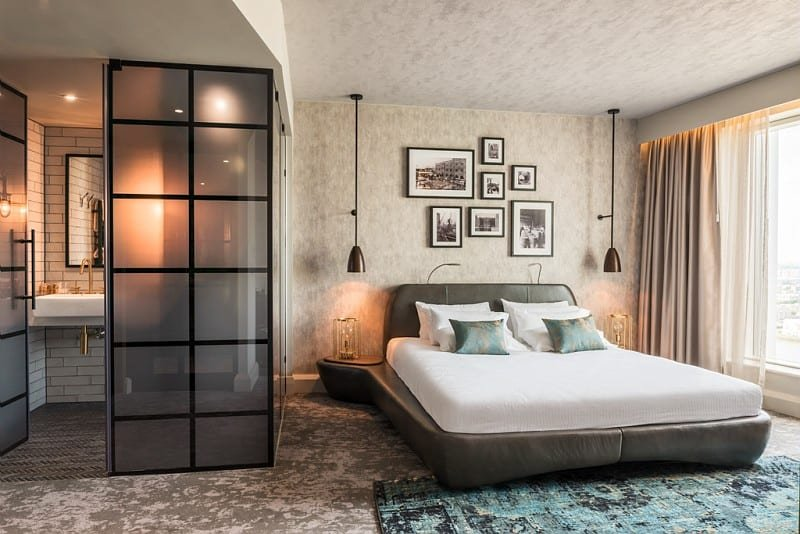

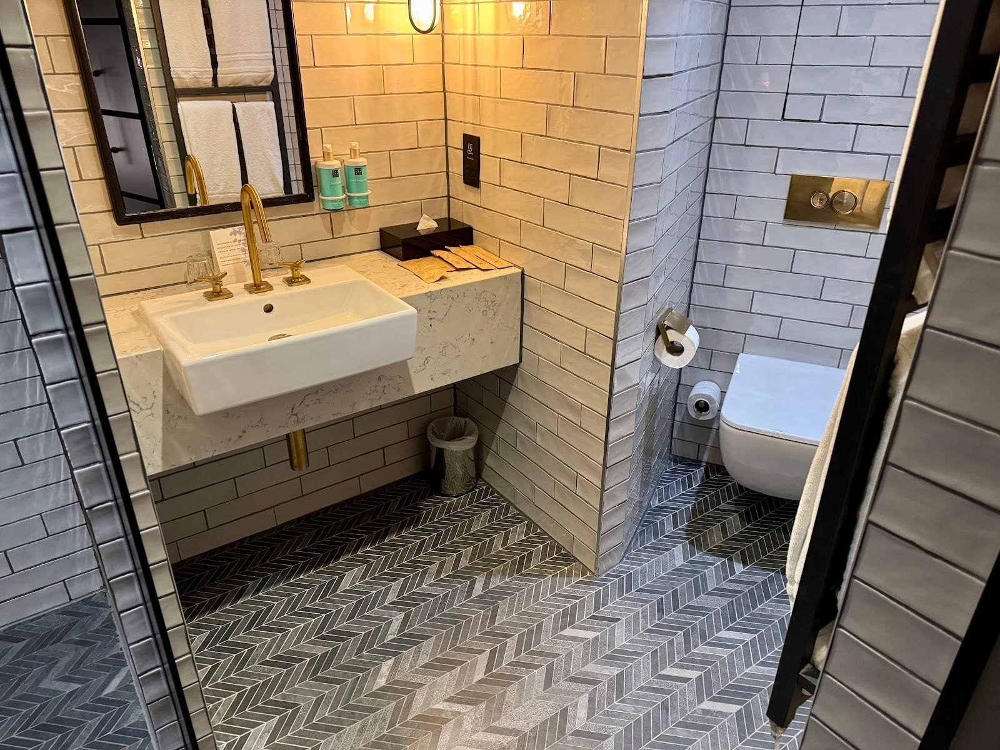

*This room's bathroom sits behind a glass partition rather than a solid wall, and the room has a floor-to-ceiling window.*

**[Locke London Canary Wharf](hotel:locke-canary-wharf)** has 279 studios and suites at 1 Cartier Circle, E14 5HF, five minutes' walk from the station, each with a kitchenette, at a mid-range rate. The front desk is open 24 hours and keeps luggage free on your arrival and departure days, which matters here: The O2 admits nothing bigger than an A4 bag. LUQA, its restaurant, serves from morning coffee to evening drinks.

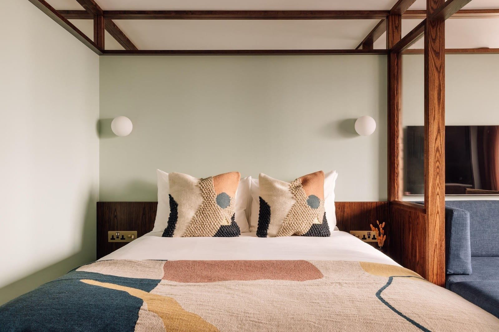

*A studio with the bed framed in timber and a sofa alongside, so there's somewhere to sit that isn't the bed.*

### Canning Town and East India: one stop east, the cheapest beds

Canning Town is two minutes the other way, and it's the DLR interchange for the Royal Docks and for London City Airport, three stops away.

**[ibis London Canning Town](hotelscom:h19692814)** has 196 air-conditioned rooms at 8 Silvertown Way, E16 1ED, opposite the station, and a café-bar, Chill #08. Across the five nights our [budget hotels guide](/articles/best-budget-hotels-london/) priced, it was a typical **£106**: **£84** on a February Wednesday, **£153 and £168** on an October and a December Saturday. Door to door, 18 minutes.

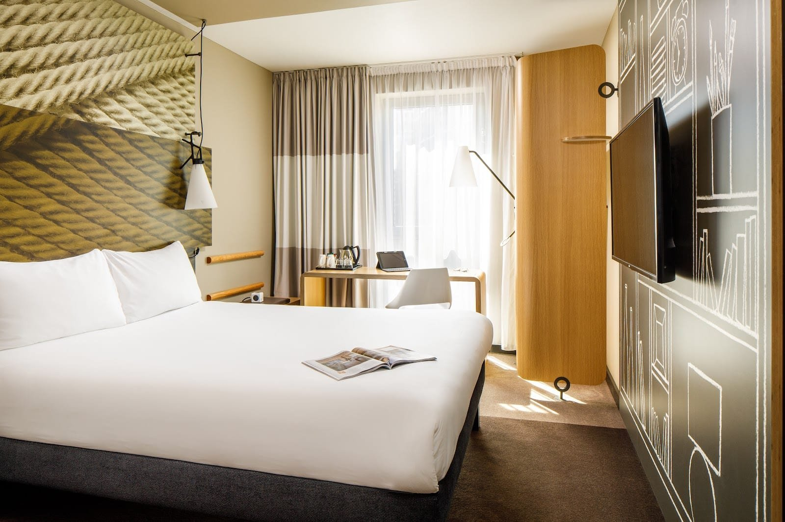

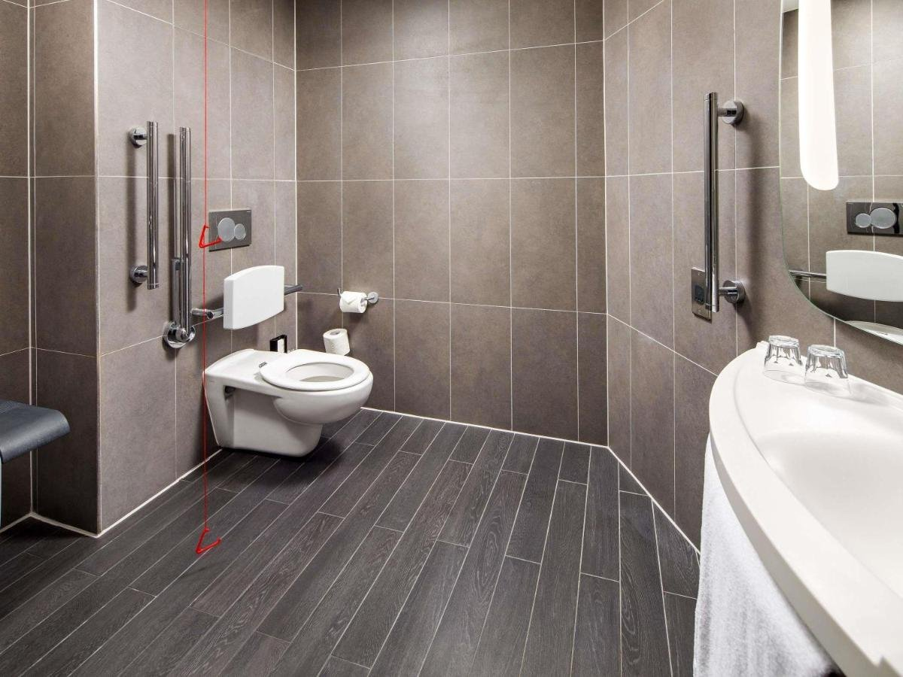

*A standard double, and the step-free wet room with grab rails and a fold-down seat from one of the accessible rooms.*

**[Travelodge London Docklands Central](https://www.travelodge.co.uk/hotels/697/London-Docklands-Central-hotel)** is a new-build tower at 1 Oregano Drive, E14 2AE, six minutes' walk from East India, one DLR stop from Canning Town. It was the cheapest hotel in our budget guide, **£34.99** on an October Sunday and **£81.99 to £111.99** on Saturdays. Parking is **£13 for 24 hours**, if you're driving and would rather not use The O2's car park. Door to door, 24 minutes.

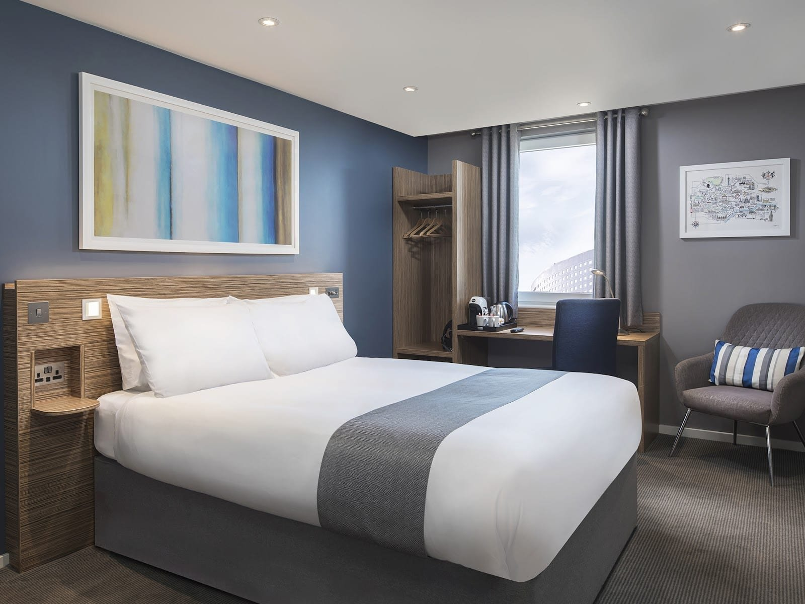

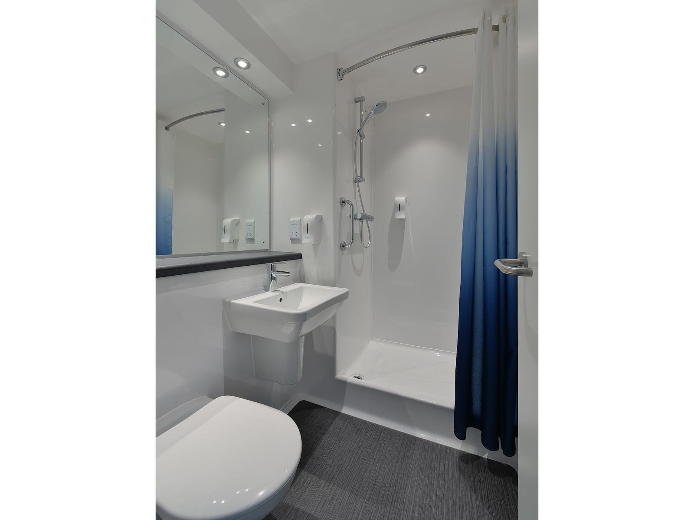

*A double with a desk and armchair, and a shower tray with a curtain rather than a bath.*

### Royal Docks and ExCeL: across the water, with a change

The Royal Victoria Dock hotels sit around ExCeL. The DLR takes two to five minutes to Canning Town, then it's one stop on the Jubilee. The [cable car](/articles/the-o2-travel-guide/) crosses from the Western Gateway end in about ten minutes, and O2 ticket holders pay half the walk-up fare on the day, but it closes at 21:00 Sunday to Thursday, 22:00 on Friday and 23:00 on Saturday, before most shows end. Prices here follow ExCeL's exhibition calendar, so check what's on there before you book.

**[Good Hotel London](hotel:good-hotel-london)** is a floating hotel moored at Western Gateway, E16 1FA, three minutes from Royal Victoria DLR and 20 minutes from The O2's doors. Its typical night was **£150**, and **£75** on an October Sunday. The standard room is 13 m², with no television or minibar, and every room sleeps two. The roof bar looks across the dock to the dome.

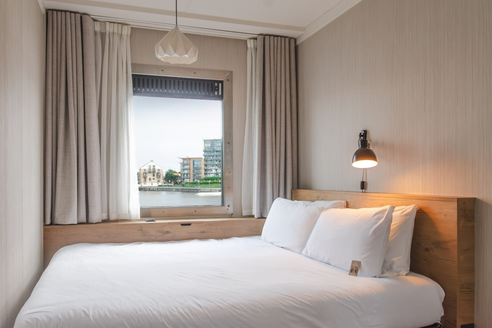

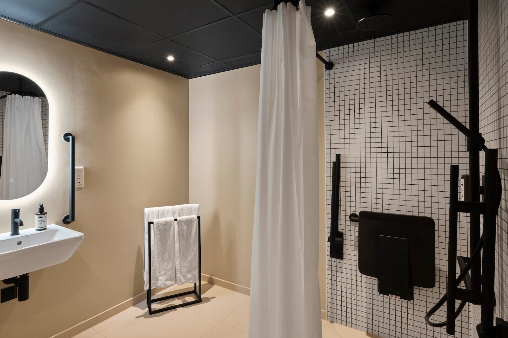

*The standard room is barely wider than its bed, with the window over the dock alongside it; the bathroom shown is from an accessible room.*

**[Aloft London ExCeL](hotel:aloft-london-excel)** is about **£115**, at Eastern Gateway, E16 1FR, the far end of ExCeL from the cable car. Prince Regent DLR is two minutes away and The O2 23 minutes door to door. It has an indoor pool.

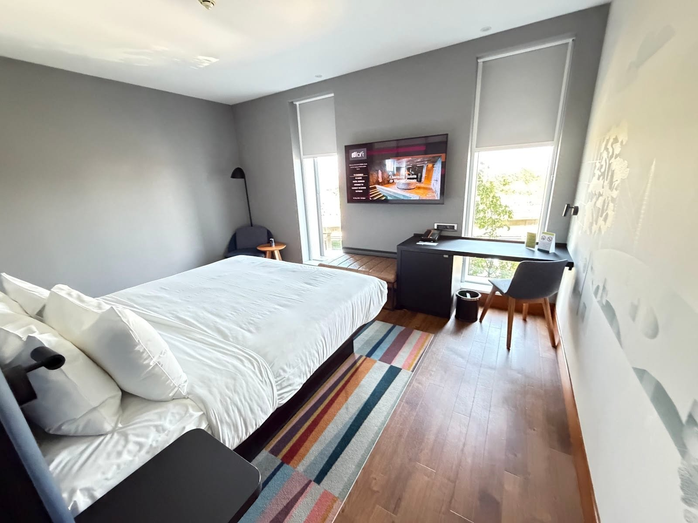

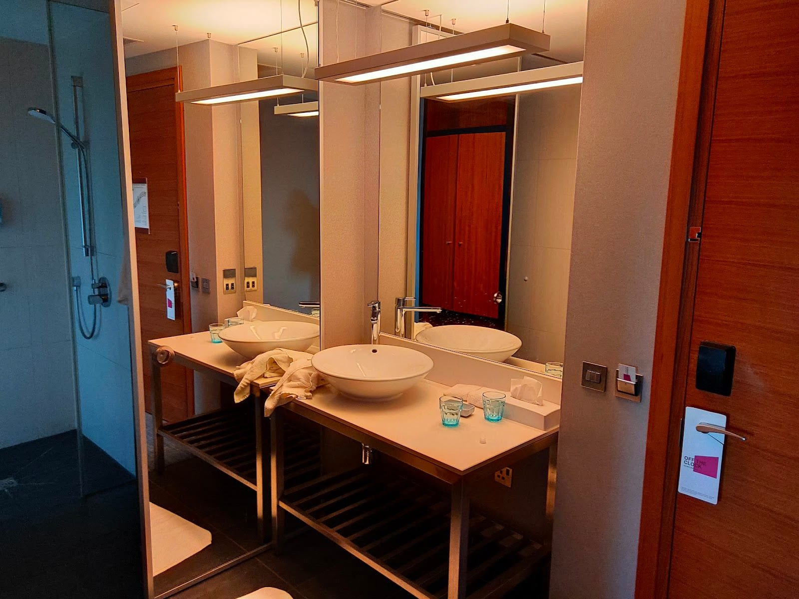

*Two tall windows and a wood floor in the room; the basin sits in the open by the door, outside the glass-screened shower.*

### Stratford: where the Jubilee starts

Stratford is the Jubilee's eastern terminus, three stops and seven to nine minutes from North Greenwich, so you board where the trains start. It's also on the Central, Elizabeth and Overground lines, with Westfield and the Olympic Park beside the station. Our [Stratford area guide](/articles/stratford-area-guide/) covers the neighbourhood, and the [London Stadium guide](/articles/london-stadium-travel-guide/) the other big venue here.

**[Hyatt Regency London Stratford](hotel:hyatt-regency-stratford)** is about **£170**, built into Westfield Stratford City at E20 1GL, about ten minutes' walk to the Jubilee platforms and 26 minutes to The O2.

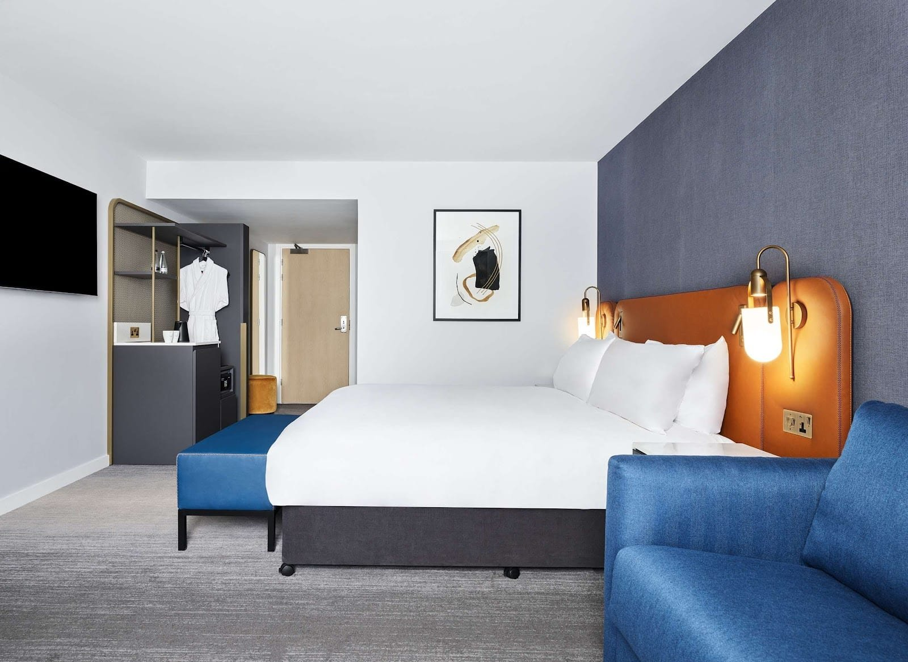

*A king room with a sofa at the bedside and a bench at the foot of the bed.*

**[Moxy London Stratford](hotelscom:h19544649)** is Marriott's Moxy brand at 86 Great Eastern Road, E15 1GR, three minutes from Stratford station. It was a typical **£143**: **£99** on an October Sunday, **£143 to £199** on Saturdays. Door to door, 25 minutes.

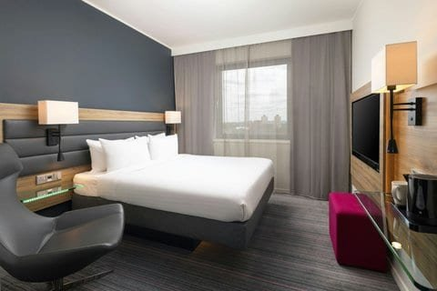

*A double with a window and a swivel armchair.*

**[Premier Inn London Stratford](https://www.premierinn.com/gb/en/hotels/england/greater-london/london/london-stratford.html)** is at 9 International Square inside Westfield, E20 1EE, five minutes from the station. It was a typical **£134**, from **£71** on an October Sunday to **£203** on a December Saturday. The Social, its bar and restaurant, is open 24 hours a day. There's no hotel parking; Westfield's car park charges £25 for 24 hours.

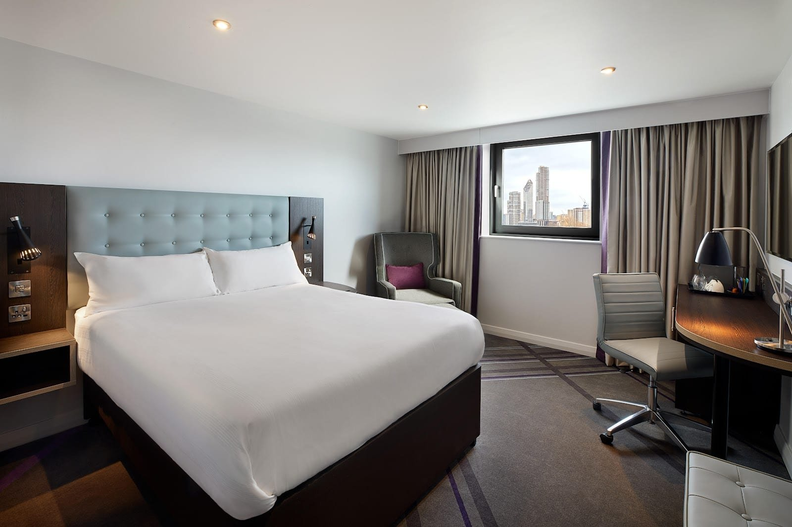

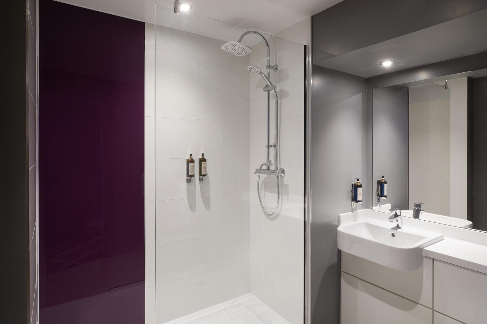

*A double with a desk and armchair, and a walk-in shower with a rainfall head rather than a bath.*

### Greenwich town: the historic base, and bus only

There is no train between Greenwich and North Greenwich. The **188** and **129** buses take 11 to 25 minutes, 22 to 42 minutes door to door, and the 188 runs 24 hours a day, so a late finish never strands you. What you get for the slower trip is the Cutty Sark, the Royal Observatory and the park on your doorstep; see our [Greenwich area guide](/articles/greenwich-area-guide/).

**[DoubleTree by Hilton London Greenwich](hotel:doubletree-greenwich)** is about **£160**, by Deptford Bridge DLR at SE10 8FR, fifteen minutes' walk from the Cutty Sark, the Old Royal Naval College and the National Maritime Museum. The 129 stop on Greenwich South Street is eight minutes away; allow 30 to 40 minutes to The O2.

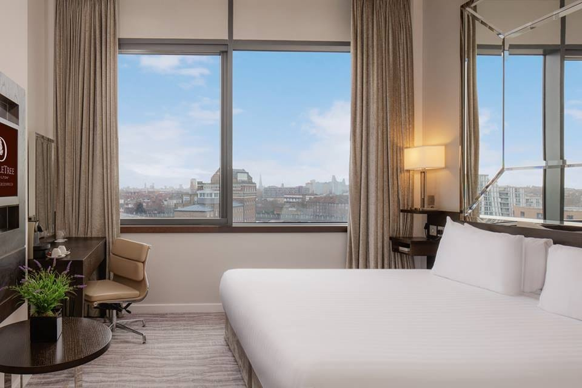

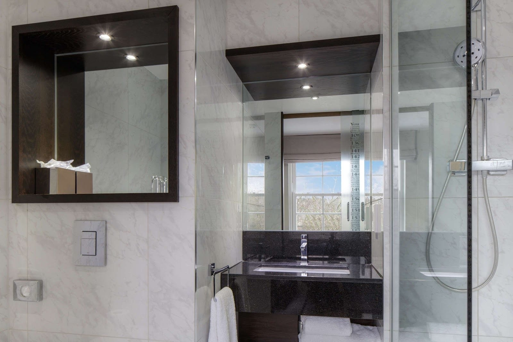

*A king room with two tall windows over the rooftops; this bathroom has a glass-walled shower, not a bath.*

**[Zedwell Greenwich](hotel:zedwell-greenwich)** is **£66 to £145** for a Cocoon 2, a soundproofed room with its own bathroom and no window. A Cocoon 4 starts at **£117**, with two double beds as a bunk, so it suits two couples rather than a family of four. A 188 stop is three minutes' walk from its SE8 3FB address, and the ride back from The O2 is about 22 minutes. Early check-in costs £25.

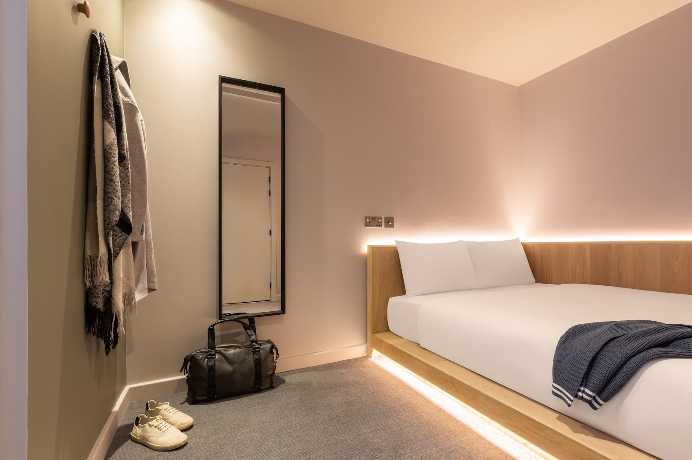

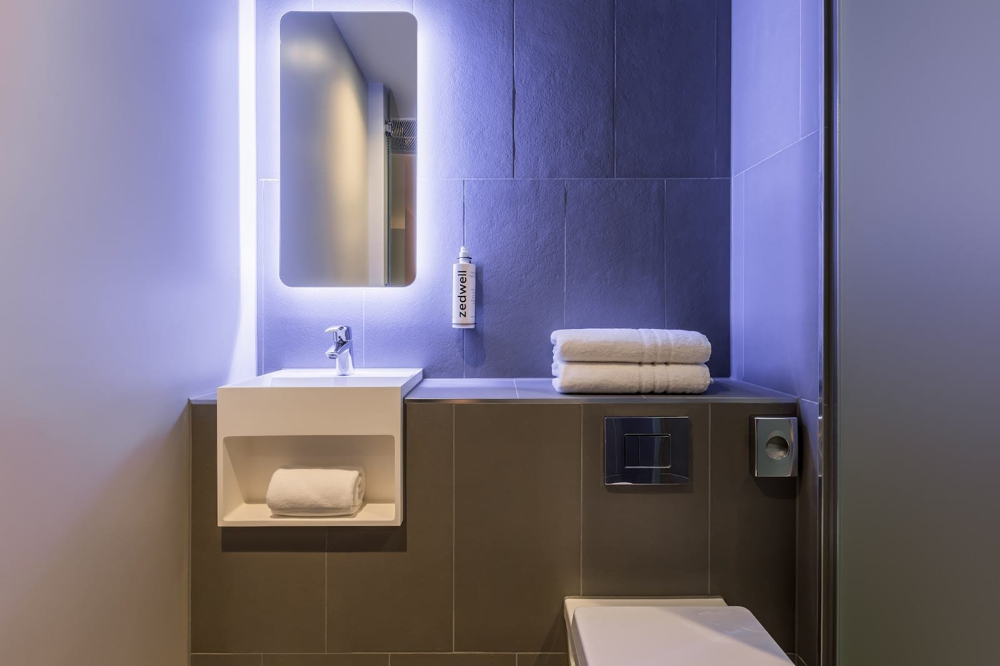

*No window, just soft strip lighting round the bed; the ensuite is compact but private.*

### London Bridge and Southwark: the central fallback

London Bridge is four stops and eight or nine minutes west of North Greenwich, about 25 minutes door to door, and Southwark one stop further. Both have the Night Tube on Fridays and Saturdays. Our [South Bank](/articles/where-to-stay-south-bank/) and [Bermondsey](/articles/where-to-stay-bermondsey/) guides cover more hotels on this stretch of the Jubilee.

**[Shangri-La The Shard](hotel:shangri-la-the-shard)** is about **£550**, with 202 rooms from level 34, two minutes from London Bridge station. The entry-level Superior rooms face south, away from the river; the City View grades face the Thames and St Paul's.

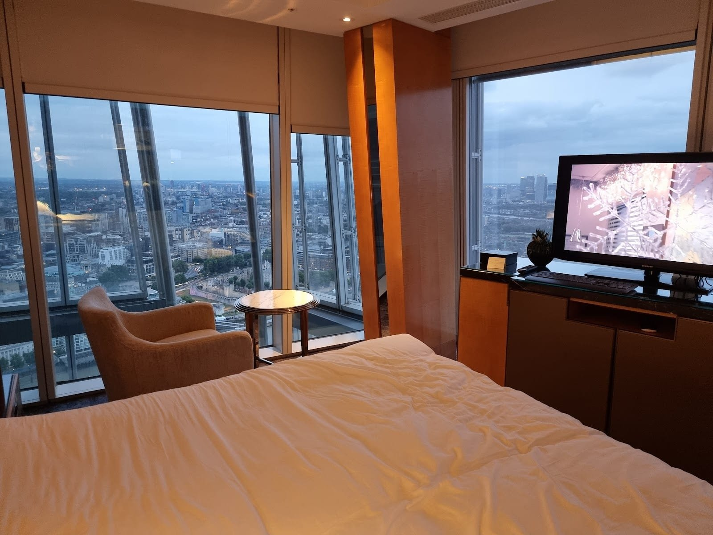

*This room looks north-east over the Tower of London to Canary Wharf, not the south view of the entry-level Superiors.*

**[citizenM London Bankside](hotel:citizenm-bankside)** is about **£160**: 192 identical rooms at 20 Lavington Street, SE1 0NZ, each with a wall-to-wall bed, for up to two adults. Southwark station is six minutes' walk away and The O2 about half an hour door to door.

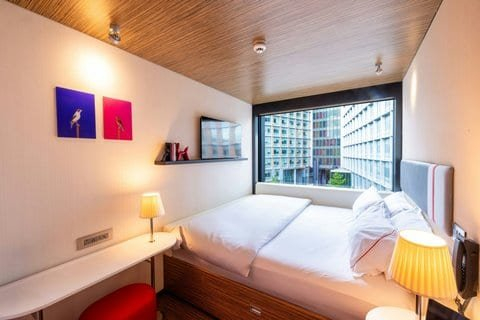

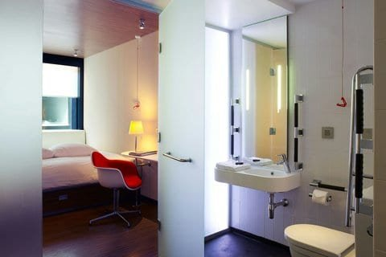

*The bed fills the window end wall to wall; the bathroom shown is from an accessible room.*

**[St Christopher's Village](hotel:st-christophers-village)** is a hostel at 161–165 Borough High Street, SE1 1HR, where a private Double Capsule for two runs **£53 to £166**. Check-in is open until 2am, which suits a late show, and Belushi's bar is downstairs. Door to door, about 30 minutes.

## Getting home after the show

### The queue at North Greenwich

After a big event, TfL doesn't let the whole crowd into the station at once. Its answer to a Freedom of Information request describes staff holding event crowds outside and letting them in gradually, working with The O2's security and the police under a local event plan. Expect to queue outside or on the concourse before you reach the gates. If you'd rather let the crowd go first, The Stargazer, the Wetherspoon inside The O2, is open until 00:15 with food until 23:00. On a Sunday to Thursday, keep an eye on the last train while you wait.

### Last trains from North Greenwich

| Route | Monday–Thursday | Friday and Saturday | Sunday |
| --- | --- | --- | --- |
| **Jubilee west** (Canary Wharf, London Bridge, Southwark) | 00:19 | All night | 23:45 |
| **Jubilee east** (Canning Town, Stratford) | 01:01 | All night | 00:16 |
| **DLR from Canning Town** to Royal Victoria, Custom House and Prince Regent | 00:54 | 00:54, then none | 23:54 |
| **DLR from Canning Town** to East India | 00:52 | About 00:52, then none | 23:53 |
| **Bus 188** to Greenwich and Waterloo | 24 hours | 24 hours | 24 hours |

*From TfL's timetables, 24 September 2026. Sunday times are for Sunday evening.*

The Jubilee is one of six Night Tube lines, running all night on Friday and Saturday nights only. The DLR and the Elizabeth line do not run through the night. So on a Friday or Saturday, the Royal Docks and East India are the only bases here without an all-night train: after the last DLR, take the Night Tube to Canning Town and then a night bus from there (the 474 towards ExCeL's eastern end, the N15 towards East India) or a taxi. There's a taxi rank at North Greenwich bus station.

TfL doesn't add late trains for O2 events. If your show is due to finish after 23:30 on a Sunday, the last westbound train is 23:45, so the eastern bases are the safer bet.

## Staying next to The O2

There are two hotels on the peninsula, and both reprice on a show night. These figures, from our [O2 travel guide](/articles/the-o2-travel-guide/), were taken on the operators' own booking engine in September 2026 for a standard single-headliner arena show on a Sunday:

| | Show night (Sunday) | Same Sunday, one week later |
| --- | --- | --- |
| **InterContinental London – The O2** (Classic Room) | **£465** | **£261** |
| **Holiday Inn Express London – Greenwich** (Double Standard, breakfast included) | **£276** | **£68** |

For a three-day international sporting event at the arena, the same InterContinental room came out at **£610 to £615** a night.

**The peninsula is the right call** when there's no big show that night, when you're here for a matinee or Up at The O2, or with young children who need to be in bed soon after the encore. On a big night, the same money buys a room in Canary Wharf or Stratford and change.

**[InterContinental London – The O2](hotel:intercontinental-the-o2)** has 493 rooms, suites and apartments at 1 Waterview Drive, SE10 0TW, with a spa and 17-metre pool, three restaurants and two bars. A private walkway leads straight into The O2. On-site parking is £52 a day.

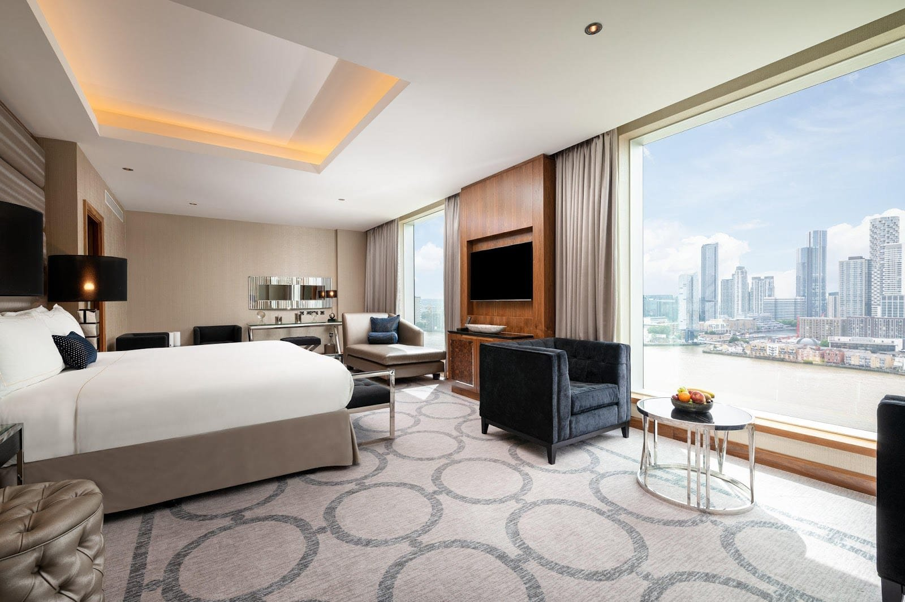

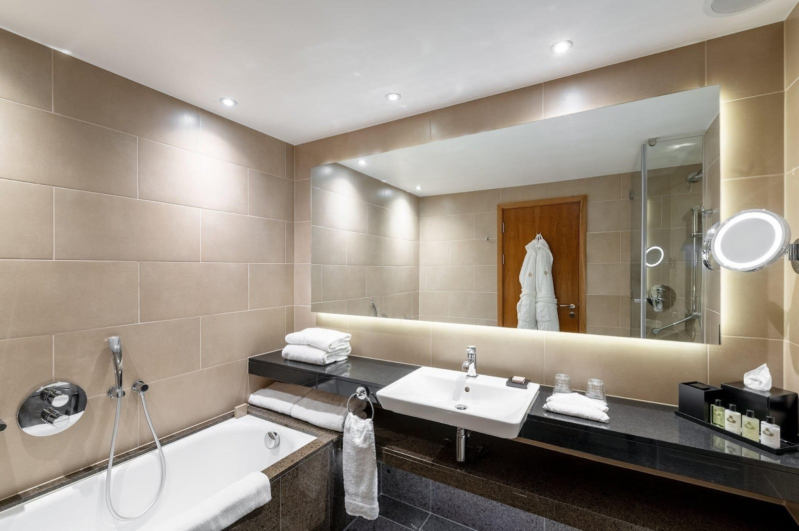

*A river-facing room looking straight across the Thames to Canary Wharf; this bathroom has both a bath and a separate shower.*

**[Holiday Inn Express London – Greenwich](hotel:holiday-inn-express-greenwich-peninsula)** is on Bugsby's Way at the south end of the peninsula, about 15 minutes' walk from The O2 and North Greenwich station, or a short ride on the 161 or 180 bus. Breakfast is included, it has family rooms, and parking is £35 a day.

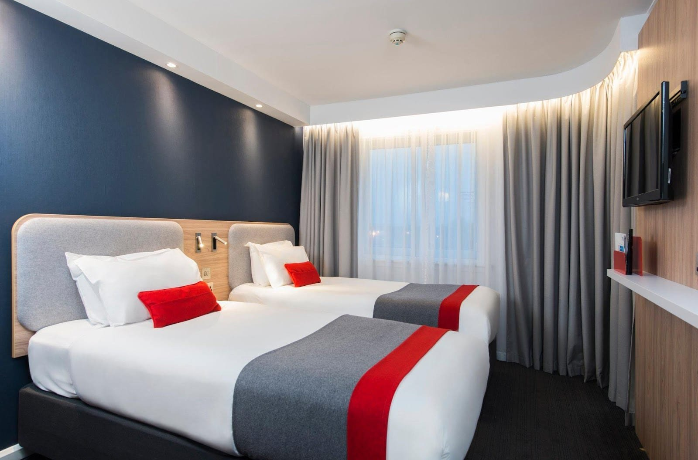

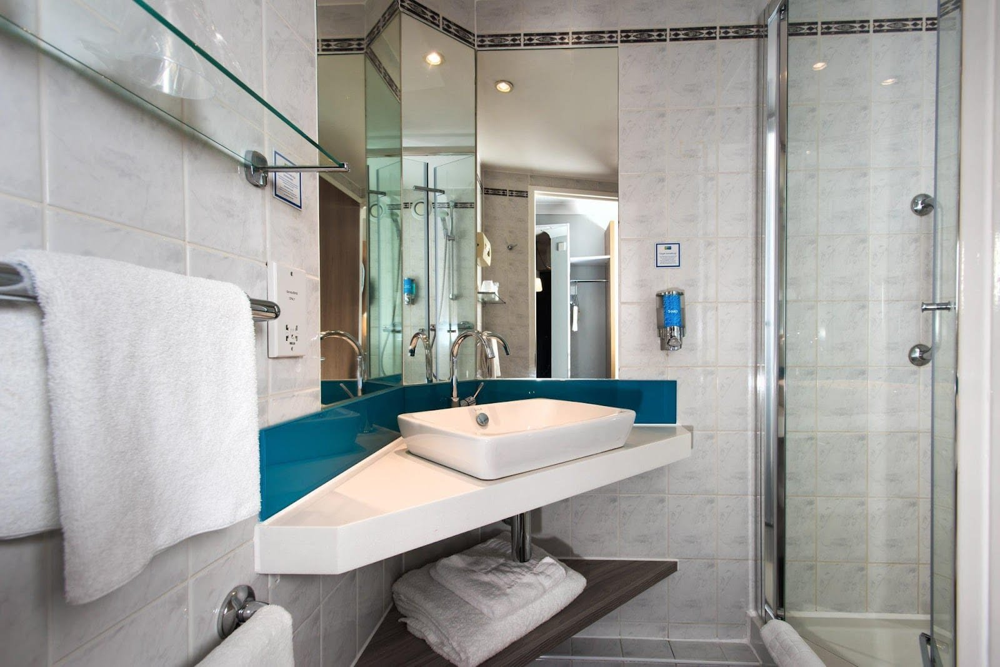

*A twin with two single beds, and a shower cubicle rather than a bath.*

Powered by <a target="_blank" rel="sponsored" href="https://www.getyourguide.com/london-l57/">GetYourGuide</a>

## Airports, and the rest of the trip

Canary Wharf, Custom House and Stratford are all on the Elizabeth line, and London City Airport is three DLR stops from Canning Town. From Heathrow, the Elizabeth line reaches Canary Wharf in about 48 minutes; our [Heathrow guide](/articles/heathrow-airport-to-london/) has the fares.

Still deciding between areas for the rest of the trip? Our guide to the [best areas to stay in London](/articles/best-areas-to-stay-in-london/) sorts the city by what the trip is for, and the [Wembley travel guide](/articles/wembley-stadium-arena-guide/) covers London's other big arena, also on the Jubilee line.

*Typical nightly rates for a double, checked September 2026; the sampled figures are the cheapest double for two on five nights between October 2026 and April 2027, taxes included.*
