If you have a ticket for Wembley Stadium or OVO Arena Wembley and need a bed, what decides the base is the train home once 90,000 people are leaving at the same time. Our [Wembley Stadium and OVO Arena guide](/articles/wembley-stadium-arena-guide/) covers the stations, parking, bags and food; this page covers where to sleep.

> 💡 **The Short Version:** For most people, stay around **Baker Street or Marylebone**: **35 minutes** door to door on the **Metropolitan line**, Chiltern trains from Marylebone in **under ten minutes**, and the **Jubilee Night Tube** on Fridays and Saturdays. The cheaper base is **Harrow-on-the-Hill**, where the Met is **7 minutes** from Wembley Park, **29 minutes** door to door, with a last train back at **00:56**. **Finchley Road** is just as quick and keeps the Night Tube. **Watford is no quicker than Waterloo.** The trap is a Wembley hotel on an event night: the **Novotel was £426.60 on an England match night and £131.40 a week later**. Stay next to the venue the night *after*, or on a night with nothing on.

## The bases compared

The Metropolitan line is the fastest way to Wembley Park. **Every Met train calls at Wembley Park, fast and semi-fast ones included**, and it runs non-stop from Finchley Road, skipping the five Jubilee stops in between. So a Met station seven minutes out is a better base than a Jubilee station in the West End.

| Base | Train | Door to door | The catch |
| --- | --- | --- | --- |
| **Wembley Park** | None: walk | **5–15 min** | A room costs about **three times** as much on an event night |
| **Harrow-on-the-Hill** | Metropolitan, **7 min** | **29 min** | No Night Tube. Last train back **00:56**, Sunday **00:33** |
| **Finchley Road / Swiss Cottage** | Metropolitan, **7 min** | **29 min** | Last Met back **00:32**, but the Jubilee runs all night Fri–Sat |
| **Marylebone** | Chiltern to Wembley Stadium station, **9 min** | **33 min** | Last train about **midnight**; an event does not push it later |
| **Baker Street** | Metropolitan, **13 min** | **35 min** | Last Met back **00:32**, but the Jubilee runs all night Fri–Sat |
| **King's Cross / Euston** | Metropolitan, **18 min** | **41–44 min** | The last direct train is **23:32**; later ones terminate at Baker Street |
| **Rickmansworth** | Metropolitan, **24 min** | **45 min** | Last train back **00:36** |
| **Watford (Met station)** | Metropolitan, **27 min** | **48 min** | The station is about 2km from the town-centre hotels. Last train **00:25** |
| **Watford Junction** | Southern to Wembley Central, **12 min**, then a bus | **45 min** there, **48–56 min** back | A change each way |
| **Waterloo / London Bridge** | Jubilee, change to the Met at Finchley Road | **49 min** | The longest ride, but it has the Night Tube |

*Door-to-door times are from TfL's Journey Planner for Saturday and Tuesday evening events, checked on 24 September 2026. They include the walk down Olympic Way from Wembley Park, which TfL puts at up to 17 minutes to the stadium. Last trains are Monday-to-Saturday departures from Wembley Park.*

## Wembley Park: walking distance

On an ordinary night a Wembley room is cheap by London standards: the Novotel was £131.40 on a Tuesday in October against £315.90 at Novotel Waterloo. On an event night it triples (see [staying next to the venue](#staying-next-to-the-venue) below).

**Novotel London Wembley** · [Hotels.com](hotel:novotel-london-wembley). 235 rooms at 5 Olympic Way, on the stadium approach itself, 480 metres from the OVO Arena. About **£120** on an ordinary night, with a car park, restaurant, bar and gym. Check-out is 12:00. It sells out months ahead for big fixtures: for England v Spain on 26 September it had nothing left 17 days before.

**Hilton London Wembley** · [Hotels.com](hotel:hilton-london-wembley). The four-star on Lakeside Way, beside the OVO Arena and about eight minutes from the stadium. About **£130**. It has an **indoor pool** and the rooftop **Sky Bar 9** (walk-in only). Parking is **£15 per 24 hours** in the Gold car park, with **no in-out**: once you have parked, the car stays there.

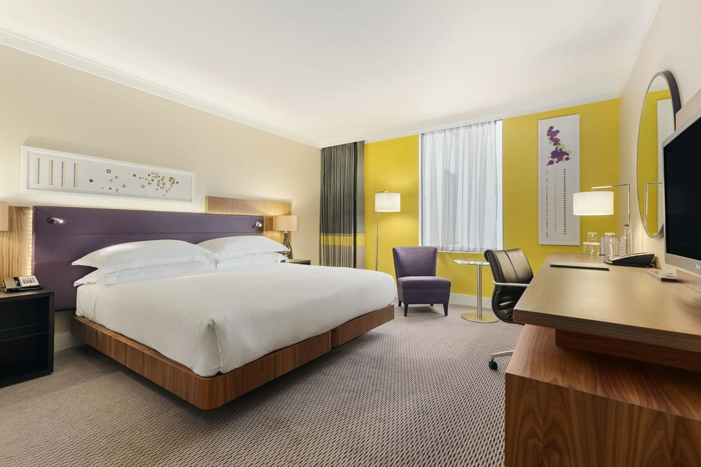

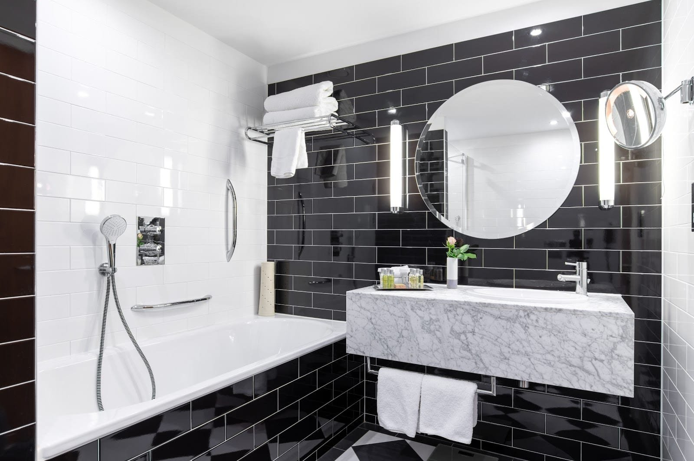

*A king room with a desk and armchair, and a bath with a hand shower.*

**Premier Inn London Wembley Stadium** · [premierinn.com](hotel:premier-inn-london-wembley-stadium). At 1 Wembley Park Boulevard, by the London Designer Outlet, which Premier Inn puts **ten minutes' walk** from the stadium and the arena. Air-conditioned, with a restaurant and a "double with a view" room type. **No car park of its own**; the nearest is the stadium's Red car park, which is priced per event.

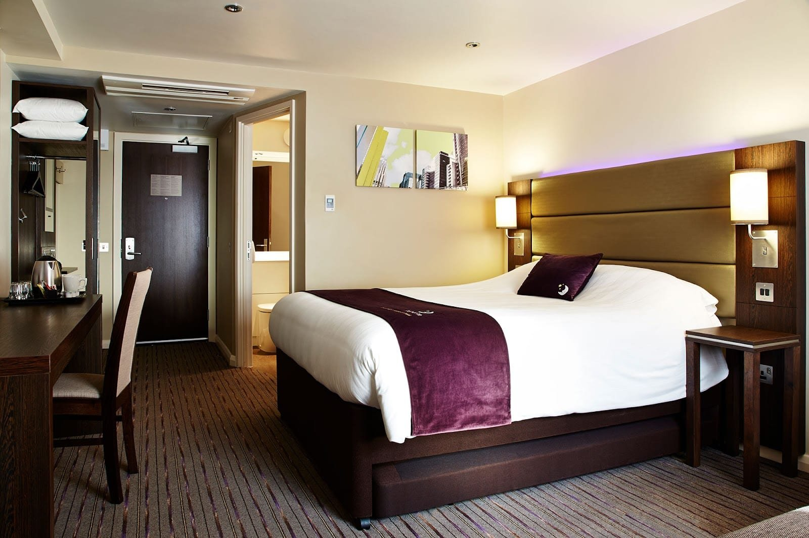

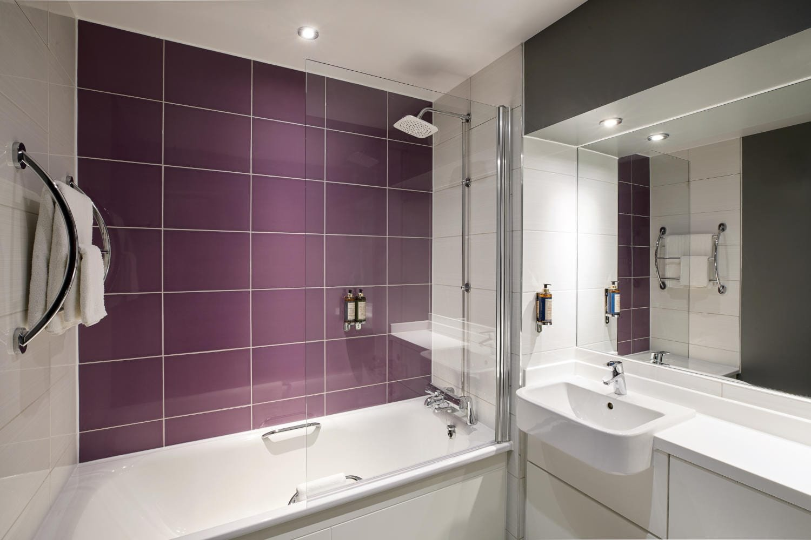

*A double with a desk, and a bath with an overhead shower behind a glass screen.*

**Premier Inn London Wembley Park** · [premierinn.com](https://www.premierinn.com/gb/en/hotels/england/greater-london/london/london-wembley-park.html). A different hotel, at 151 Wembley Park Drive, HA9 8HQ, **180 metres from Wembley Park station**, so after the show you walk to it instead of queueing for a train. It has its own car park: **£15 per 24 hours** for guests, more on event days, first come first served. Not to be confused with the Wembley Stadium branch above.

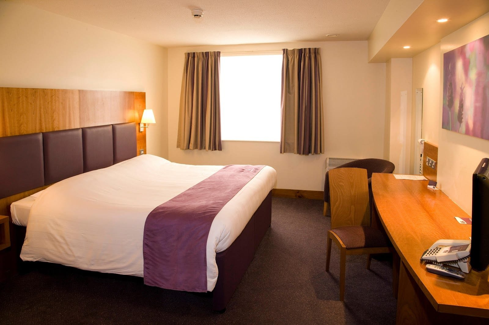

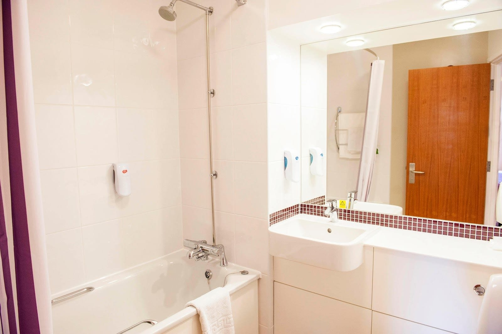

*An older-style Premier Inn double with a curved desk and an armchair, and a bath with a shower curtain.*

**Wembley International Hotel** · [Hotels.com](hotelscom:h890560). An independent with 165 rooms on Empire Way (HA9 0NH), about 12 minutes' walk from the stadium. **Continental breakfast and parking are free**, the parking first come first served, and the rooms are air-conditioned with triple glazing.

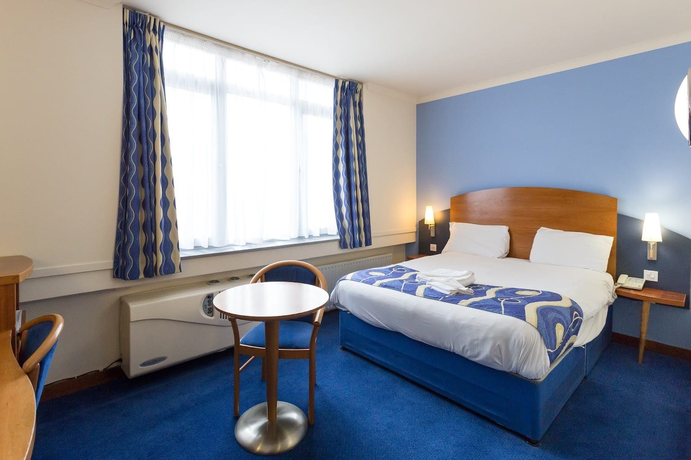

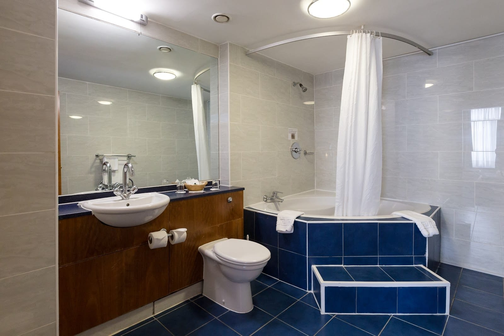

*A double with the air-conditioning unit under the window, and a corner bath with a step up.*

The **ibis London Wembley**, on South Way by Wembley Stadium station, is temporarily closed.

## Harrow-on-the-Hill: the cheaper base

Every Met train, fast or stopping, calls at Harrow-on-the-Hill: **7 minutes to Wembley Park, 29 minutes door to door**, with no change.

**Travelodge London Harrow** · [travelodge.co.uk](https://www.travelodge.co.uk/hotels/632/London-Harrow-hotel). At 1 Greenhill Way, HA1 1LE, under ten minutes' walk from Harrow-on-the-Hill station. It has a Bar Café for breakfast, evening meals and drinks, and up to two children eat breakfast for £1 each per full-paying adult.

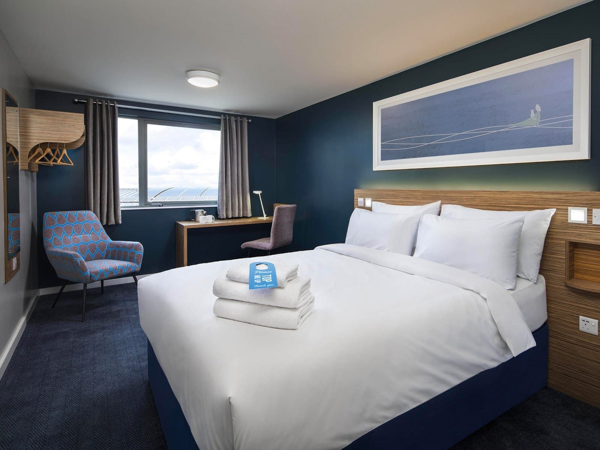

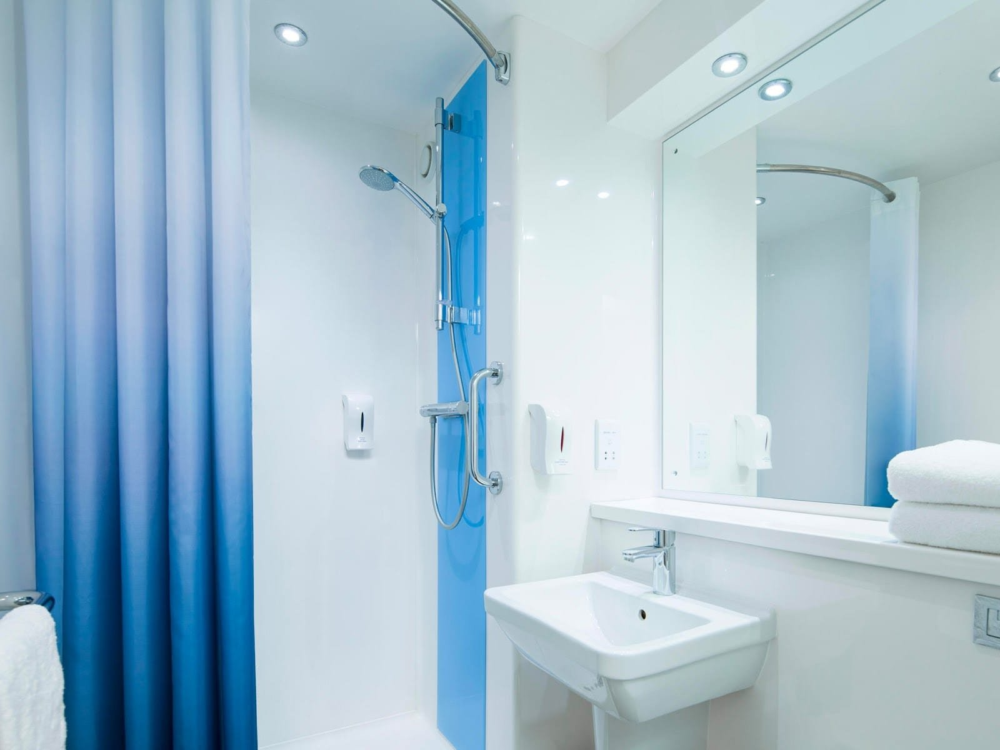

*A double with an armchair and desk, and a shower with a curtain rather than a bath.*

**Premier Inn London Harrow** · [premierinn.com](https://www.premierinn.com/gb/en/hotels/england/greater-london/london/london-harrow.html). Despite the name it is on Kenton Road (HA3 8AT), opposite **Kenton** station (Bakerloo and Overground) and about a six-minute walk from **Northwick Park** on the Met, two stops from Wembley Park. Air-conditioned, with guest parking at **£9.40 a night**. Northwick Park is served by the stopping trains only, so check the train calls there before you get on.

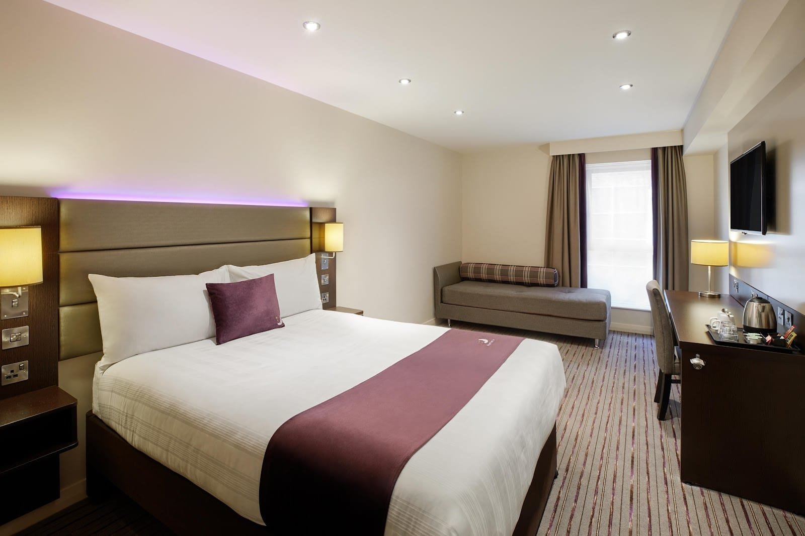

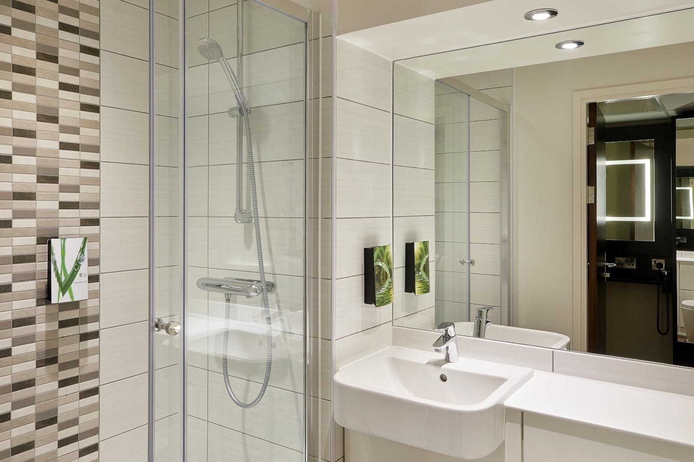

*A double with a chaise longue by the window, and a glass-doored shower.*

**Getting back:** the last Met train from Wembley Park to Harrow-on-the-Hill and Northwick Park leaves at **00:56** Monday to Saturday and **00:33** on Sunday. There is no Night Tube on the Metropolitan line, so if you miss it, you are on a night bus or in a taxi.

## Finchley Road and Swiss Cottage: as quick, with the Night Tube

Finchley Road is the Met's last stop before Wembley Park: **7 minutes, 29 minutes door to door**. It is on the Jubilee too, as is Swiss Cottage, under ten minutes' walk away, and on a Friday or Saturday the Jubilee runs all night.

**Palmers Lodge Swiss Cottage** · [Hotels.com](hotel:palmers-lodge-swiss-cottage). A hostel in an 1882 Victorian mansion at 40 College Crescent, NW3 5LB, a short walk from Swiss Cottage and Finchley Road. Dorm beds from **£18** and private rooms from **£48**, sleeping one to four, with continental breakfast included, a self-service kitchen, laundry and car parking. More in our [hostels guide](/articles/best-hostels-london/).

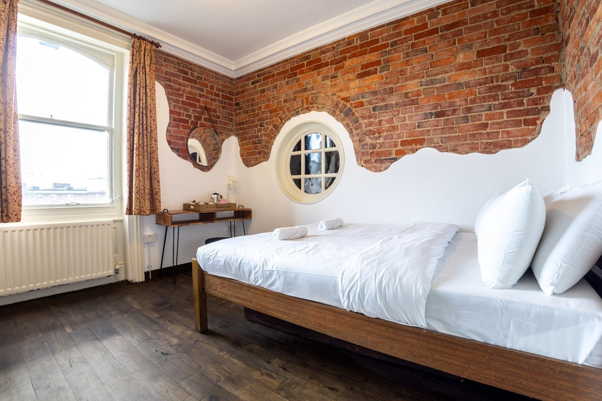

*A private double in the Victorian mansion: exposed brick, a porthole window and a tall sash window.*

**Quality Hotel Hampstead** · [Hotels.com](hotelscom:h802085). At 5 Frognal, NW3 6AL, five minutes' walk from Finchley Road station. It has a lift, a bar and a 24-hour front desk, plus **triple rooms** of 22 square metres.

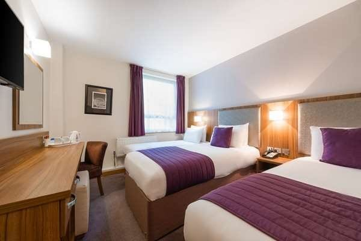

*A twin room with a long desk under the TV and an armchair by the window.*

**Best Western Swiss Cottage** · [Hotels.com](hotelscom:h461513). A 59-room Victorian townhouse at 4 Adamson Road, NW3 3HP, on a residential street 200 yards from Swiss Cottage station. The Jubilee from Swiss Cottage is the slower train to Wembley. For the Met, walk about ten minutes to Finchley Road.

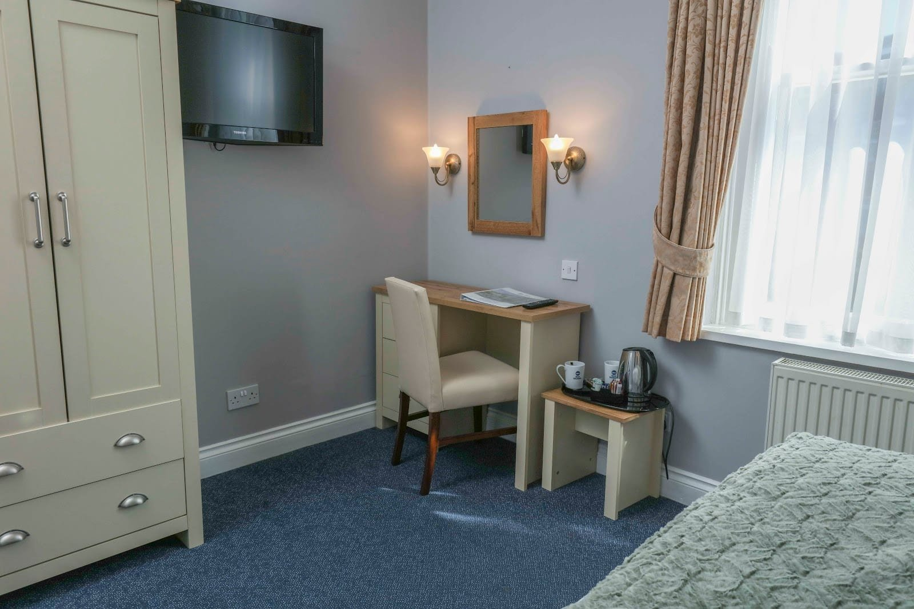

*A cream wardrobe, a small desk and a tall window with net curtains.*

**Getting back:** the last Met to Finchley Road leaves Wembley Park at **00:32** and the last Jubilee at **00:24** Monday to Thursday. On Friday and Saturday nights the Jubilee runs all night, so you can wait out the queue.

## Baker Street and Marylebone: the best base for most people

This is the base with the most ways back. The Met is **13 minutes** from Baker Street to Wembley Park, the Jubilee runs through Baker Street too, and from Marylebone **Chiltern** trains reach Wembley Stadium station in **under ten minutes**. Our [Marylebone stay guide](/articles/where-to-stay-marylebone/) covers the wider area.

**The Landmark London** · [Hotels.com](hotel:the-landmark-london). At 222 Marylebone Road, opposite Marylebone station. It is a former railway hotel, with an eight-storey glass atrium full of palm trees, and large rooms by central London standards. The spa has a vitality pool, sauna, steam room and 24-hour gym. It is the shortest walk to a Chiltern train in this guide.

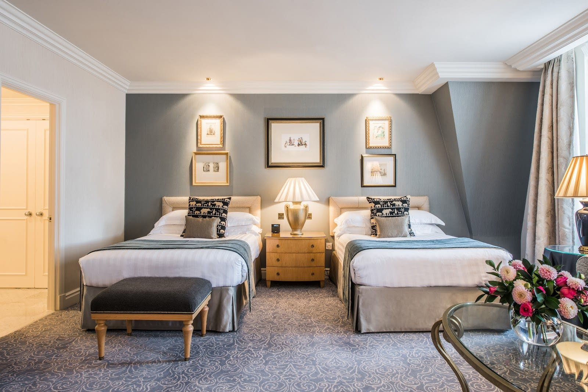

*A room with two double beds, and a marble bathroom with two basins and a bath.*

**Dorset Square Hotel** · [Hotels.com](hotel:dorset-square-hotel). Kit and Tim Kemp's first hotel: 38 rooms in a Regency house on the square that was Thomas Lord's first cricket ground, decorated with cricket memorabilia. Five minutes from Marylebone station, ten from Baker Street, on a quiet residential square.

*A crewelwork headboard, green walls and a striped armchair by a big sash window.*

**Travelodge London Central Marylebone** · [travelodge.co.uk](https://www.travelodge.co.uk/hotels/312/London-Central-Marylebone-hotel). On Harewood Row, NW1 6SE, beside Marylebone station. The budget answer for the Chiltern route. Its SuperRooms add blackout curtains, a coffee machine and a rain shower.

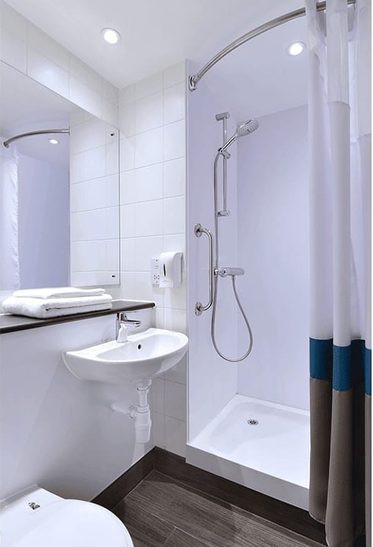

*A double with a coffee machine on the desk, and a shower cubicle with a curtain.*

**hub by Premier Inn London Marylebone** · [premierinn.com](https://www.premierinn.com/gb/en/hotels/england/greater-london/london/hub-london-marylebone.html). On Old Marylebone Road, NW1 5DZ, near Edgware Road and about five minutes from Marylebone station. The rooms are compact: **11 square metres** as standard and 14 for a Bigger room with a king-size bed. No car park.

**Getting back:** the last Met to Baker Street leaves Wembley Park at **00:32**, and the Jubilee runs all night on Fridays and Saturdays. The last Chiltern train to Marylebone leaves around midnight: after a midweek concert it was **00:06**; after a Saturday 17:00 kick-off, **23:44**. Chiltern adds trains on event days, but not a later last one.

## King's Cross, Waterloo and the rest of central London

**King's Cross and Euston** (Euston Square on the Met) are one Met train from Wembley Park, **18 minutes** from King's Cross St Pancras and about 41 minutes door to door. The catch is late at night: the last train through to King's Cross leaves Wembley Park at **23:32**, and after that the Met terminates at Baker Street. Our [King's Cross stay guide](/articles/where-to-stay-kings-cross/) has the hotels.

**Waterloo and London Bridge** are on the Jubilee, but the quick way is to change to the Met at Finchley Road: about **49 minutes** door to door. It is one of the longest rides on this list, but on a Friday or Saturday the Jubilee Night Tube runs straight back, and the Novotel Waterloo's price did not rise on a match night (see below). Our [South Bank stay guide](/articles/where-to-stay-south-bank/) covers the area.

For the cheapest hotel rooms across London, see our [budget hotels guide](/articles/best-budget-hotels-london/).

## Watford and Rickmansworth: further out, and no quicker

Watford is often suggested for a cheap room near Wembley. On the train times it does not work. The Met from **Watford** is **27 minutes** to Wembley Park and about **48 minutes** door to door, no quicker than Waterloo. The Met station is in Cassiobury, about 2km from the town-centre hotels. The last train back leaves Wembley Park at **00:25**, or **00:05** on Sunday.

**Watford Junction** is quicker to reach Wembley: Southern trains take **12 minutes** to Wembley Central, about 45 minutes door to door with the bus or walk at the end. Coming back it is **48 to 56 minutes** with a change, after the Wembley Central queue.

**Premier Inn Watford Central** · [premierinn.com](https://www.premierinn.com/gb/en/hotels/england/hertfordshire/watford/watford-central.html) is on Water Lane (WD17 2NJ) in the town centre, closer to Watford High Street and Watford Junction than to the Met.

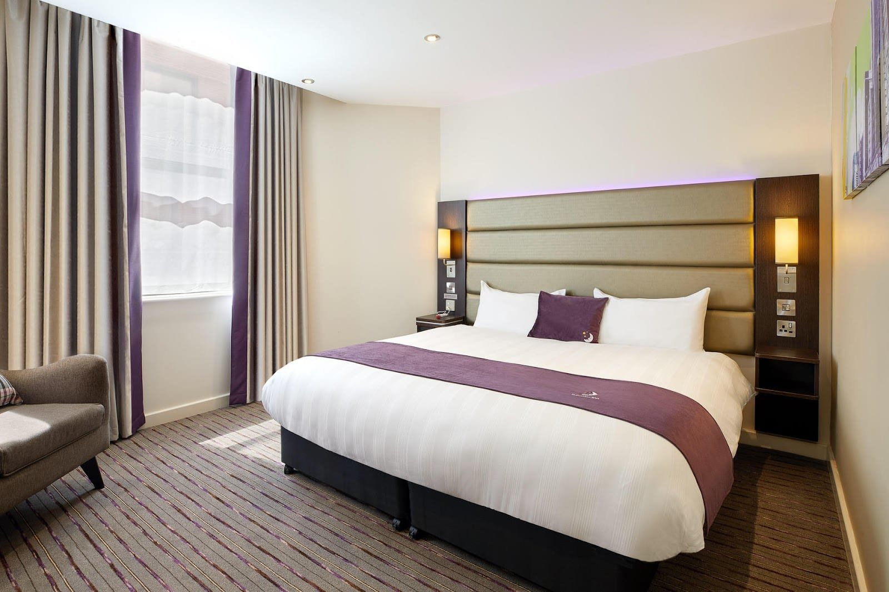

*A king room with an armchair by the window.*

**Rickmansworth**, on the Met's Amersham branch, is **24 minutes** from Wembley Park and 45 door to door, with a last train back at **00:36**. Harrow-on-the-Hill is 29.

## Getting home after the event

**The queue.** For a sell-out concert, TfL runs a managed queue at **Wembley Park from about 22:30 to 23:40**. Bridge Road becomes exit-only and everyone enters from Olympic Way. At **Wembley Central** the busy window is about **22:40 to 23:30**. At **Wembley Stadium station** Chiltern sorts the crowd into colour-coded queues on the forecourt: **Blue is Marylebone only**. Chiltern publishes each event's queue colours and timetable on its [Wembley events page](https://www.chilternrailways.co.uk/wembley-events-travel-information).

**The Night Tube.** On **Friday and Saturday nights the Jubilee line runs all night** through Wembley Park, about every ten minutes, calling at Finchley Road, Swiss Cottage, Baker Street, Bond Street, Waterloo and London Bridge. **The Metropolitan does not run all night**, and neither does Chiltern. If you are staying on the Jubilee, you can sit out the crowd for an hour and still get home.

**Last trains from Wembley Park, Monday to Saturday:**

| To | Last departure | Sunday |
| --- | --- | --- |
| **Harrow-on-the-Hill** (Met) | **00:56** | 00:33 |
| **Rickmansworth** (Met) | **00:36** | 00:23 |
| **Baker Street and Finchley Road** (Met) | **00:32** | 00:12 |
| **Watford** (Met) | **00:25** | 00:05 |
| **Waterloo and London Bridge** (Jubilee) | **00:24** Mon–Thu, **all night** Fri–Sat | about 23:40 |
| **King's Cross** (Met, direct) | **23:32** | 23:22 |

*From TfL's published timetable, checked on 24 September 2026. Weekend engineering work changes these, so check TfL's journey planner for your date.*

After a Sunday event, the last Jubilee south leaves Wembley Park at about **23:40**, so on a Sunday the Met is the later way home.

## Staying next to the venue

A Wembley hotel is the right call when **there is no stadium event that night**: the night after, or the night before an early start. It suits families with young children, who can walk back to the room rather than queue.

On a stadium event night it costs far more:

| | Novotel Wembley | Novotel Waterloo |
| --- | --- | --- |
| **Tuesday 6 Oct, England v Czechia** | **£426.60**, one room type left | **£300.60**, seven room types |
| Tuesday 13 Oct, nothing on | **£131.40** | £315.90 |

*Accor member rates for one room, two adults, checked on 9 September 2026.*

On the match night the only room left at the Novotel was a suite, while Novotel Waterloo, one change from Wembley Park, barely moved. After England v Spain on Saturday 26 September, the Sunday night was **£91**.

- **For a big stadium date, book a Wembley room months ahead or stay on the Met line.**
- **Or stay the night after**, when the price falls back.
- **For the NFL game on Sunday 18 October** (14:30 kick-off), our [NFL London Games guide](/articles/nfl-london-games/) has the tickets and bag rules.

If you check out at noon and doors are at 18:30, the bag is a problem: the stadium admits nothing bigger than A4, and the arena has no cloakroom. The Novotel and Hilton both store luggage for guests. Our [luggage storage guide](/articles/luggage-storage-london/) covers the rest.

*Hotel prices are typical ordinary-night rates for a double unless a date is given, checked September 2026. Event-night rates move daily, so check your own date.*
