Notting Hill and Bayswater are one stretch of stucco streets along the north side of Kensington Gardens, from Lancaster Gate in the east to Portobello Road in the west. Notting Hill is where the boutique hotels are. Bayswater, ten minutes' walk east, is where most of the rooms are and where the prices drop.

The Central line runs under the whole strip, stopping at Notting Hill Gate, Queensway and Lancaster Gate, and Paddington, for Heathrow, is one stop from Bayswater on the Circle line. What decides where you sleep is the market, the park and one weekend in August.

> 💡 **The Short Version:** For Notting Hill itself, **[The Laslett](hotel:the-laslett)** is about £240 in five listed townhouses a minute from Notting Hill Gate station. **[The Portobello Hotel](hotel:the-portobello-hotel)** is about £260 for the round beds and freestanding baths, but every room takes two people only. On a budget, **Vancouver Hotel and Studios** on Prince's Square lists studios with kitchenettes from £97. With children, **[Royal Lancaster London](hotel:royal-lancaster-london)** sells interconnecting family rooms opposite Kensington Gardens. For the top end, **Six Senses London** is about £700 inside the old Whiteleys department store. And check the calendar: **Notting Hill Carnival is on 29 and 30 August 2027**.

## Which part of Notting Hill and Bayswater

**Notting Hill Gate and Pembridge** is the main road and the streets just north of it. The station is here, Portobello Road starts at its top end, and The Laslett, Ruby Zoe and The Lost Poet are all within five minutes of the platforms.

**Portobello and the Ladbroke estate** is the grid of garden squares either side of Portobello Road. It is residential and quiet at night; the market fills the road on Fridays and Saturdays. The Portobello Hotel is here.

**Westbourne Grove and the Bayswater squares** runs east from Portobello to Queensway: Prince's Square, Kensington Gardens Square and Hereford Road. This is where the hostels, the studios and the small independent hotels are, three to six minutes from Bayswater station.

**Queensway and Inverness Terrace** is Bayswater's high street, with restaurants open late, the rebuilt Whiteleys at the top and Kensington Gardens at the bottom. Queensway and Bayswater stations are three minutes apart on different lines.

**Lancaster Gate** is the eastern edge, facing the park across Bayswater Road. It is the nearest part to Paddington and the furthest from Portobello Road, about twenty minutes' walk.

Our [Notting Hill area guide](/articles/notting-hill-area-guide/) covers the market days and where to eat, and the [colourful houses walk](/articles/notting-hill-colourful-houses/) maps the pastel streets.

## Hotels by Notting Hill Gate

### The Laslett — five listed townhouses by the station

*About £240 · 8 Pembridge Gardens, W2 4DU · Notting Hill Gate 1 min · Breakfast extra · [Hotels.com](hotel:the-laslett)*

Five Grade II-listed Victorian townhouses on the street beside the station. It is named after Rhaune Laslett, the community activist whose street festival helped start the Carnival, and the bar, The Henderson, after Russell Henderson, the Trinidadian steel pan player who led the band through it. The walls carry work by local artists, including Brian David Stevens's photographs of Carnival sound systems.

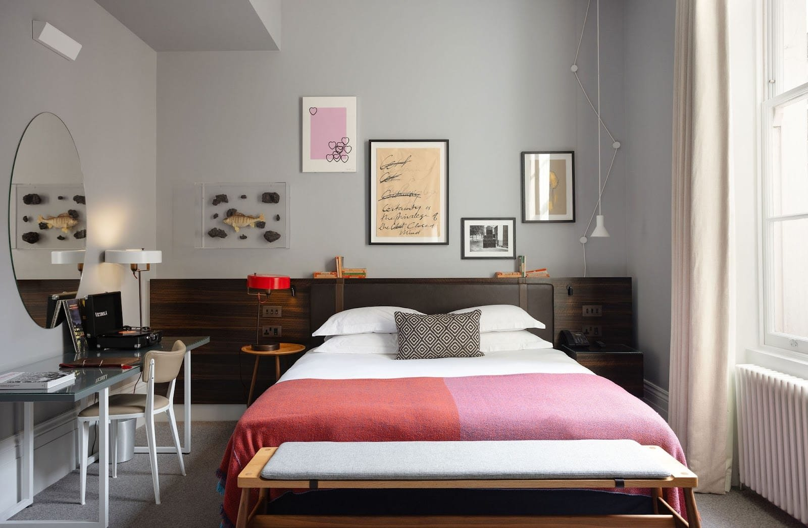

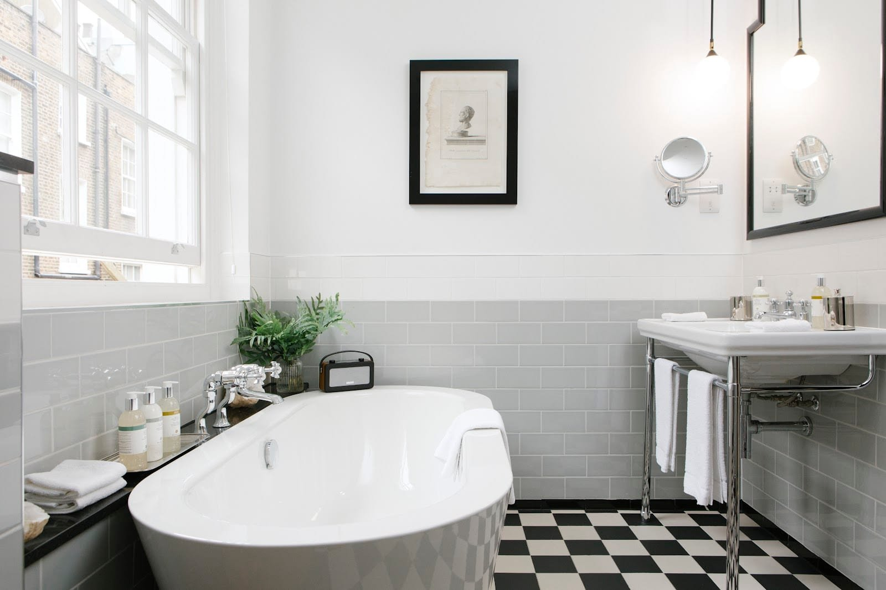

*A double with a tall sash window and a record player on the desk, and a bathroom with a freestanding bath under a window of its own.*

Rooms are named like a house's: **Spare Room Singles of 16 square metres**, Spare Room Doubles of 18 to 19, Doubles of 19 to 22, and Master Bedrooms and Suites of 22 to 34. Connecting rooms can be booked, and a cot or single bed fits the Master Bedroom Double or Suite. Reception is 24 hours. Dogs are £30, donated to charity. There is no parking.

### Ruby Zoe — the carnival-themed one on the main road

*££ · 146–164 Notting Hill Gate, W11 3QG · Notting Hill Gate 4 min · Check-in 3pm, out 11am · [check prices](hotel:ruby-zoe)*

Ruby calls its format Lean Luxury: compact rooms, with the money spent on the bed and the bar. Here the decoration is Caribbean colour and carnival costume, with instruments and speakers placed around the building. It is sold through IHG, so **IHG One Rewards points apply**. The minimum check-in age is 18.

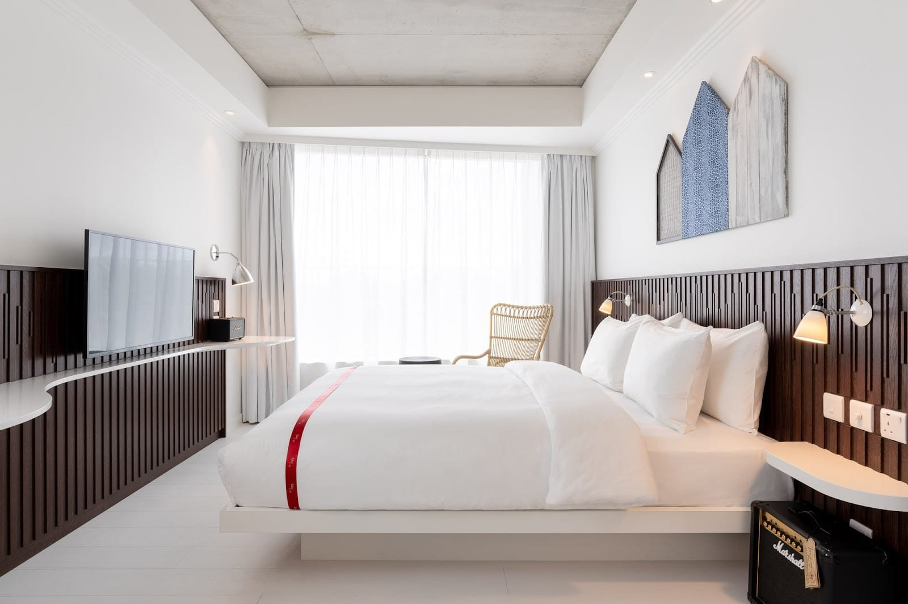

*A double with a Marshall amp beside the bed and a rattan chair at the window: the music theme reaches the rooms, not just the bar.*

### The Lost Poet — four rooms at the top of Portobello Road

*£££ · 6 Portobello Road, W11 3DG · Notting Hill Gate 4 min · Breakfast included · [check prices](hotel:the-lost-poet)*

A Victorian townhouse at the Notting Hill Gate end of the market, with four rooms done in bold wallpapers, modern art and wood panelling reclaimed from school science labs. Breakfast comes from local cafés and patisseries, in a "naughty" or a vegan and gluten-free "nice" version.

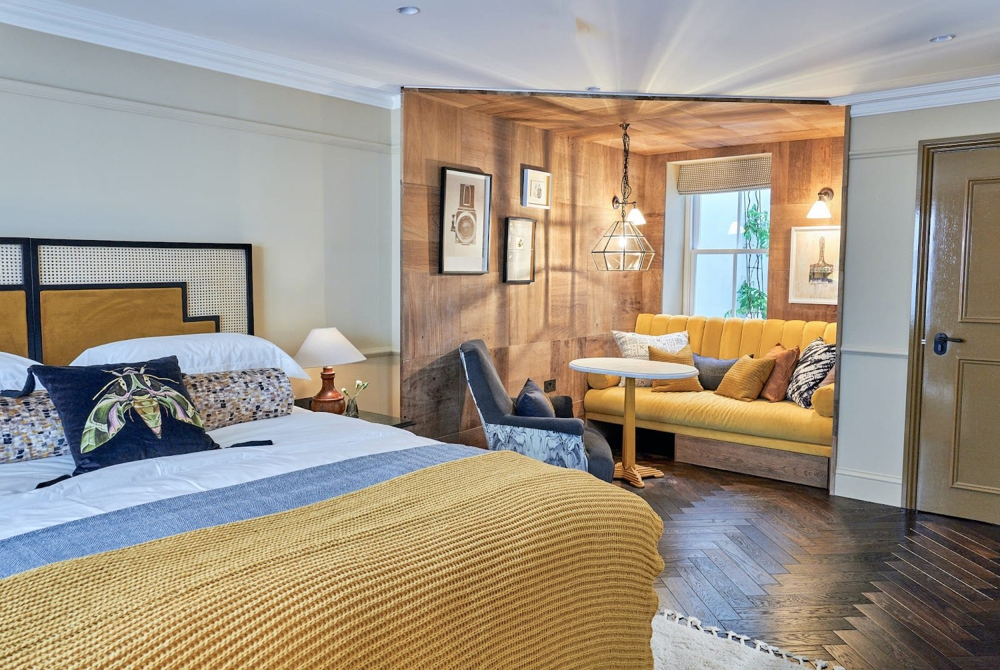

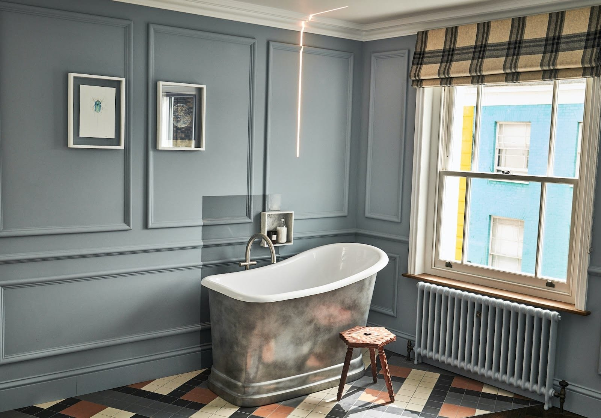

*The reclaimed lab panelling lines a seating nook with a velvet banquette; the bathroom shown has a freestanding slipper bath under a sash window.*

It runs like a guest house: **check-in is online with keyless entry, and staff are on site from 8am to 6pm only**, with phone support outside those hours. The stairs are narrow and there is no lift; The Quarters, on the ground floor facing Portobello Road, is the room for anyone who can't manage them. The Suite is on the lower level, 20 square metres with its own patio. **Children must be 12 or over.**

## Hotels by Portobello Road

### The Portobello Hotel — the round bed in Room 16

*About £260 · 22 Stanley Gardens, W11 2NG · Notting Hill Gate 10 min · [Hotels.com](hotel:the-portobello-hotel)*

Open since 1971 on a residential street of the Ladbroke estate, west of Portobello Road, and long used by musicians. The hotel repeats the story that Johnny Depp and Kate Moss once filled the bath in Room 16 with champagne.

Rooms are graded Good (15 square metres, at the front on the ground and second floors) through Better, Great, Marvellous and Outstanding to the **Best Room, 36 square metres with a round bed and a freestanding Victorian bath**. There is an honesty bar in the drawing room, and breakfast runs 7.30 to 10.30am, until 11 at weekends, downstairs or in your room.

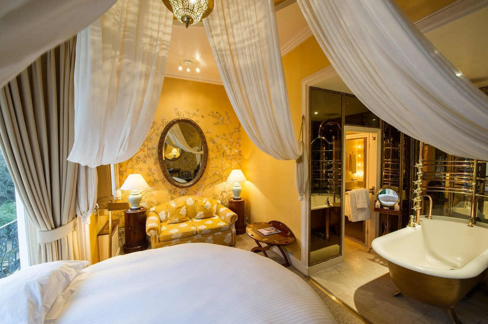

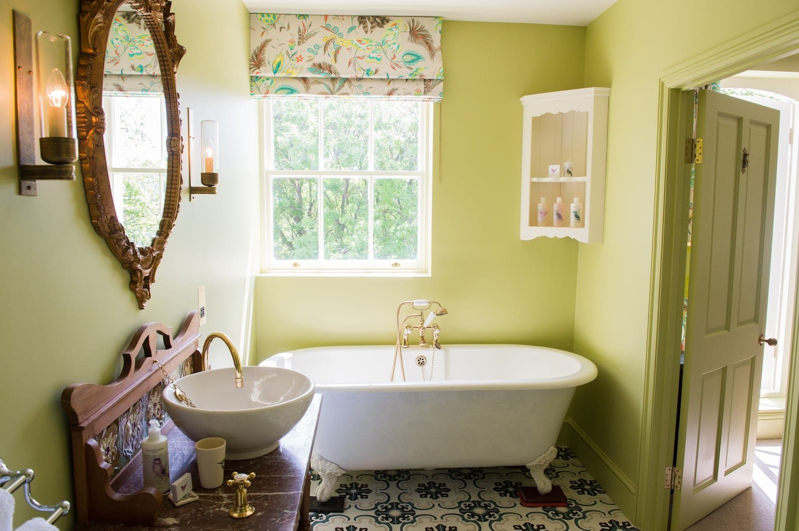

*The Best Room, the hotel's top grade, with the round bed and its bath in the bedroom. The bathroom photo is from another room.*

Two rules decide it:

- **Every room sleeps two people at most, and a child of any age counts as one.** Families need two rooms.
- **A Saturday night means a two-night minimum**, and the hotel may ask for three over a bank holiday, including Carnival weekend.

## Hotels on the Bayswater squares

### The Princess Royal — four bedrooms above a pub

*£££ · 47 Hereford Road, W2 5AH · Bayswater 9 min · [check prices](hotel:the-princess-royal-notting-hill)*

A Cubitt House pub off Westbourne Grove, with four bedrooms upstairs named after princesses, sold as doubles and cosy doubles. Downstairs there is a conservatory, two terraces planted by the garden designer Jinny Blom, a raw bar and a kitchen serving from 8am. It is a working pub with two private dining rooms: book it for the pub, not for early nights.

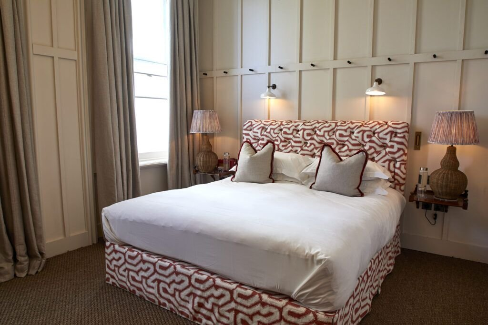

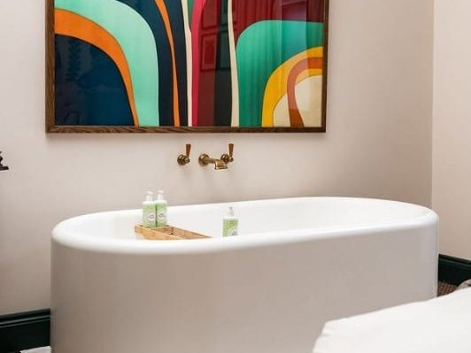

*A double with a buttoned headboard, and a bath that stands in the bedroom, a step from the bed.*

### Vancouver Hotel and Studios — a 1920s family hotel with kitchenettes

*Studios from £97, doubles from £149 · 30 Prince's Square, W2 4NJ · Bayswater 4 min · [Hotels.com](hotelscom:h520898)*

Opened in the 1920s by two Canadian sisters, who named it after their home city, and in only its second family's hands since. Every room has an en-suite and a kitchenette. The Standard Double Studio is listed from £149 and the Garden Double Studio, opening onto the private garden, from £185.

For a group, the **three-bedroom, two-bathroom garden apartment sleeps six from £350 a night**. There is a bar, a gym, a guest laundry and a 24-hour reception, and continental breakfast is served in the bar or the garden. **There is no lift**, only the original staircase. No pets.

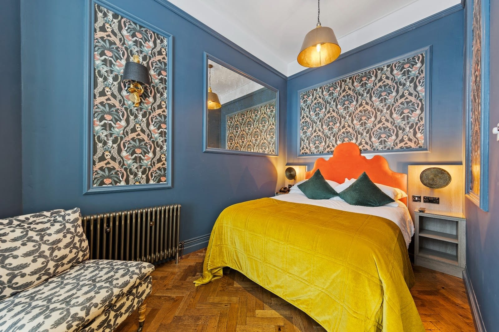

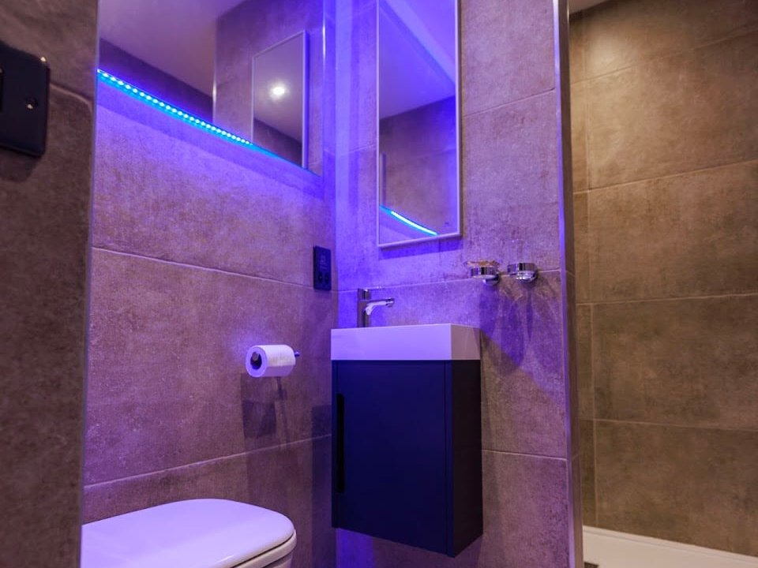

*A double with a daybed, and a compact tiled en-suite.*

### Space Apart Hotel — studios with kitchens, two nights minimum

*From about £140 · 36–37 Kensington Gardens Square, W2 4BQ · Bayswater 6 min · [Hotels.com](hotelscom:h2357691)*

Serviced studios on a garden square, each with a kitchen. Rates are published before VAT: **Standard from £116.67 plus VAT (£140), Premium from £137.50 (£165), and Triple or Quadruple studios from £162.50 (£195)**. There is a lift and air conditioning, and some studios are on the lower ground floor, so ask which you are getting. **The minimum stay is two nights.**

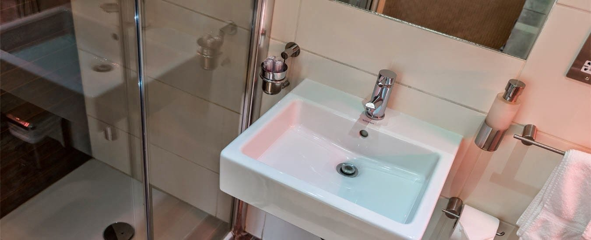

*A studio's shower room, with a walk-in shower behind a glass door.*

### Garden Court Hotel — a 1954 hotel with rooms for four

*30–31 Kensington Gardens Square, W2 4BG · Bayswater 5 min · [Hotels.com](hotelscom:h6836554)*

A hotel since 1954, in a listed Victorian house on the same square. It sells singles, including one whose private bathroom is outside the room, doubles, twins, and **triples and quadruples for families**. Continental breakfast and a 24-hour reception.

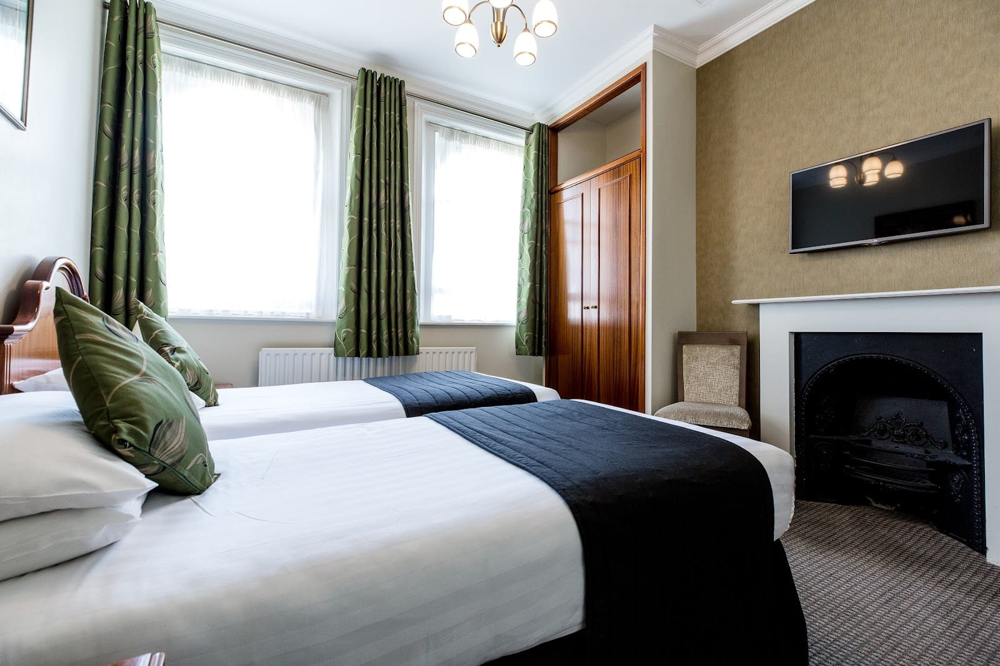

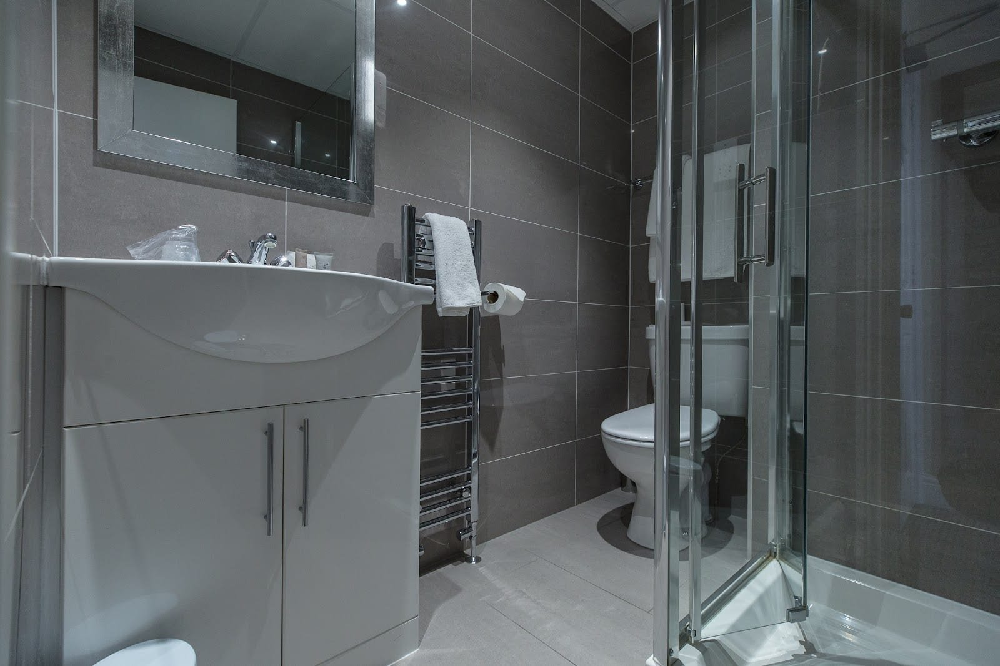

*A twin with a cast-iron fireplace, and a corner shower in the en-suite.*

### Onefam Notting Hill — the hostel with a free dinner

*Hostel · 63 Prince's Square, W2 4PX · Bayswater 6 min · [check prices](hotel:onefam-notting-hill)*

A hostel run around a **free family dinner every evening**, plus a daily outing and a night out. Dorms are four, six and eight-bed mixed rooms with curtained pod beds and a locker each, and there is a private twin and a private double, both with shared bathrooms. Sheets are included, towels rented, and there is no curfew. Our [hostels guide](/articles/best-hostels-london/) compares it with the rest of London's.

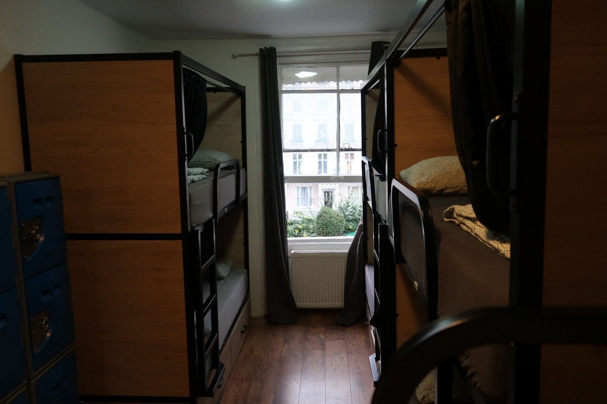

*A dorm of curtained bunks with a locker for each bed, looking onto the square.*

### Urbany Hostel London — ages 18 to 40 only

*Hostel · 48–49 Prince's Square, W2 4PX · Bayswater 6 min · [Hotels.com](hotel:urbany-hostel-london)*

On the same square as Onefam, from a Barcelona hostel group. **The London hostel takes guests aged 18 to 40 only**; anyone outside that has to contact it before booking. Dorms sleep four to eight, with a locker at every bed (bring your own padlock) and a plug and USB socket beside it. Every bathroom is outside the rooms, including for the private double and twin. Staff run free dinners, nights out and city walks.

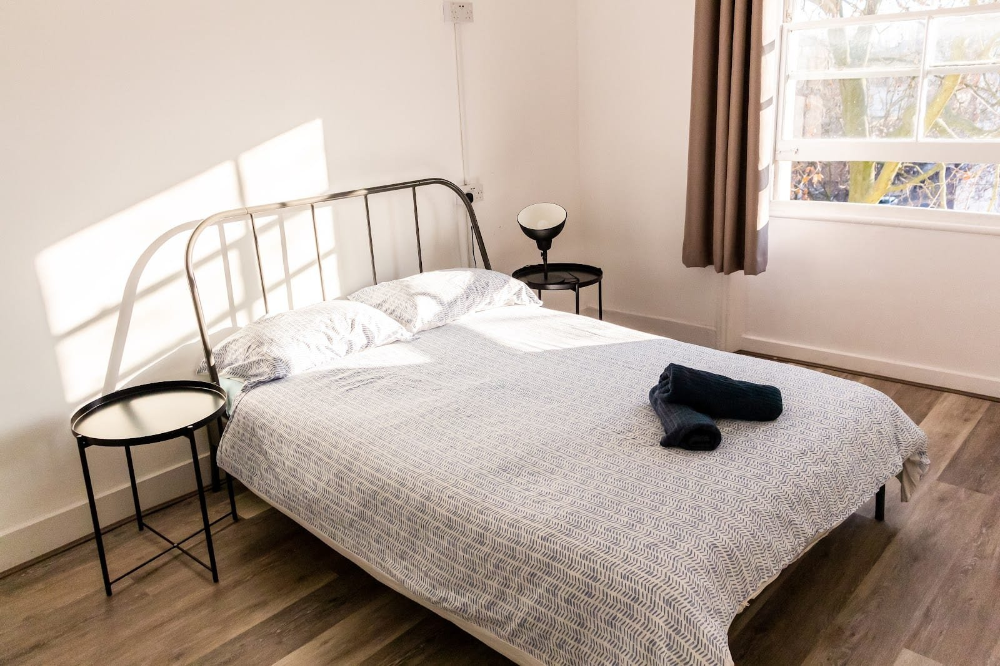

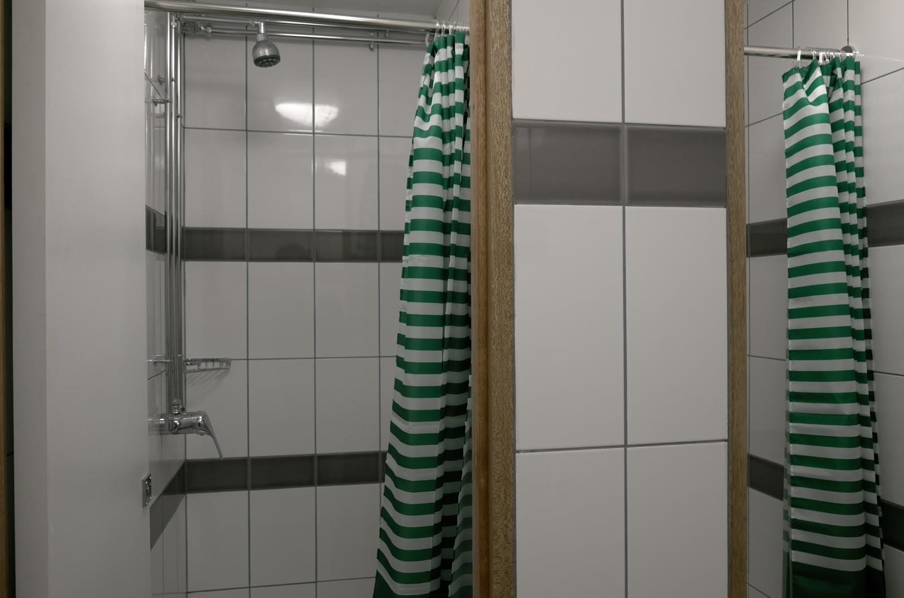

*The private double, and the shared showers that everyone uses, private rooms included: curtained cubicles rather than lockable rooms.*

## Hotels by Queensway and Inverness Terrace

### Six Senses London — the old Whiteleys

*About £700 · 1 Redan Place, W2 4SA · Bayswater 5 min · Breakfast extra · [check prices](hotel:six-senses-london)*

109 rooms and suites inside The Whiteley, the rebuilt Whiteleys department store at the top of Queensway. **The spa is the reason to pay this**: it is built underground, designed to recall an old Tube station, with cryotherapy and flotation alongside the treatment rooms. Whiteley's Kitchen, Bar and Café is the restaurant, and hotel guests can use Six Senses Place, the members' club in the building.

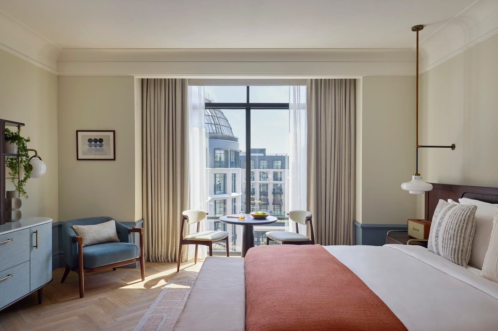

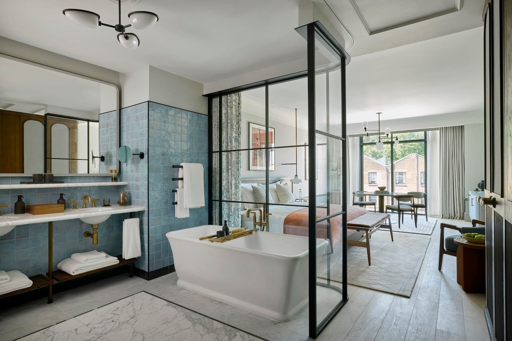

*A room looking out to the dome of the old department store. The bath photo is from a larger room, where the bath stands in the bedroom behind a glass screen.*

### Grand Royale Hyde Park — the Edwardian one on the corner

*1–9 Inverness Terrace, W2 3JP · Queensway 2 min · Check-in 3pm, out 11am · [Hotels.com](hotelscom:h1402870)*

A four-star from the Montcalm Collection at the Bayswater Road end of Inverness Terrace. The hotel says the building was commissioned by Edward VII for Lillie Langtry and designed by Charles Mewès, architect of the Ritz; the top suite carries her name. Rooms start at singles, and the public rooms keep their wood panelling and marble fireplaces.

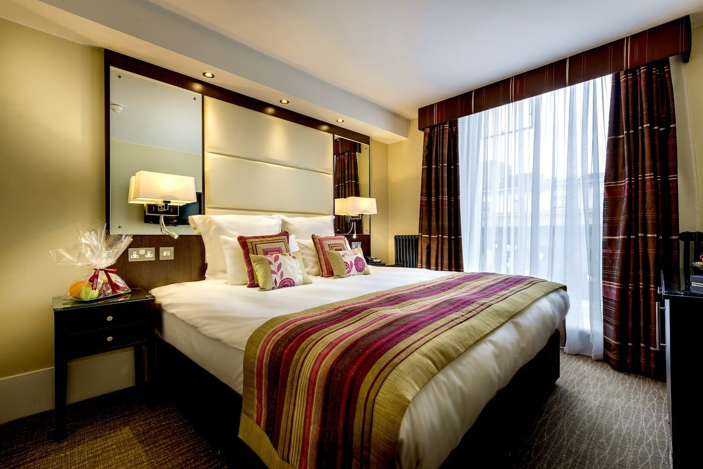

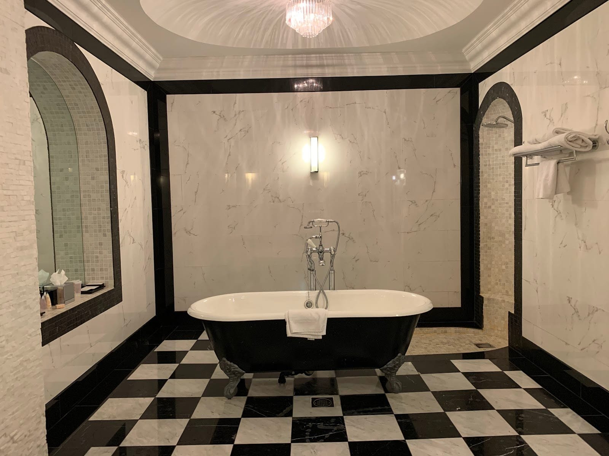

*A double. The bathroom photo is from a suite, with a claw-foot bath and an arched walk-in shower under a chandelier.*

### Blakemore Hyde Park — family suites on Leinster Gardens

*30 Leinster Gardens, W2 3AN · Queensway and Bayswater 5 min · [Hotels.com](hotelscom:h2607)*

A four-star on a residential street between Queensway and Paddington. Club Rooms are the entry grade, with single, double or twin beds. **The Family Suite takes two adults and two children** on a double and a pull-out sofa bed, and there is a Junior Triple. The Terrace restaurant has an outdoor terrace and serves afternoon tea, and there is a fitness room.

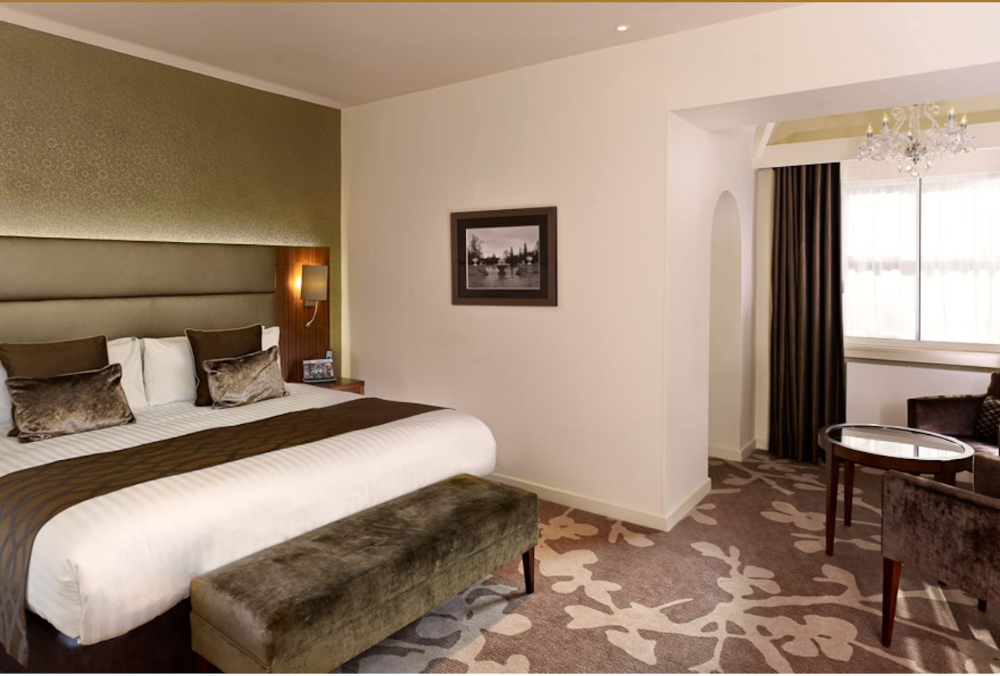

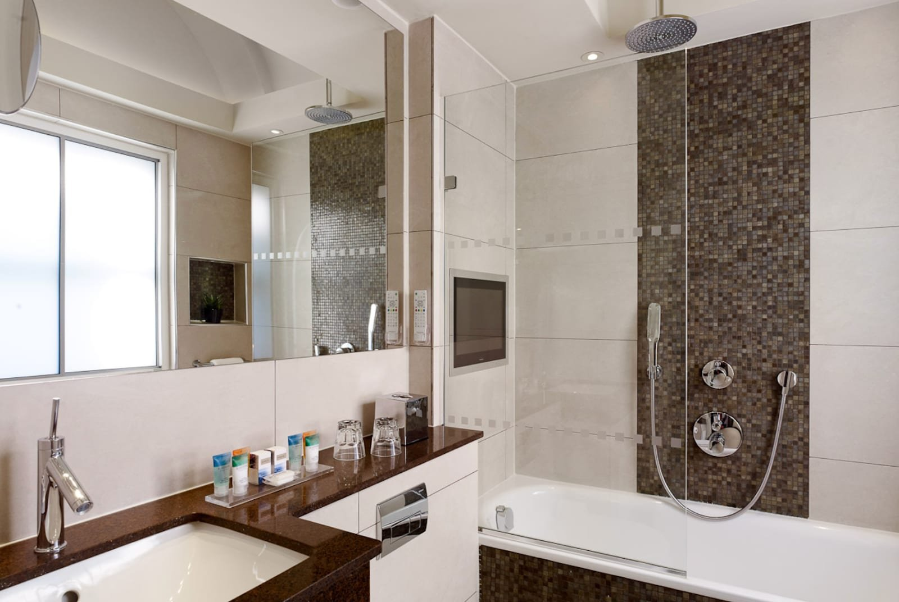

*A room with a seating area under a chandelier, and a bath with a rain shower over it and a TV in the wall.*

### Inhabit, Queen's Gardens — the wellness one

*1–2 Queen's Gardens, W2 3BA · Bayswater, Lancaster Gate and Paddington 8 min · [Hotels.com](hotelscom:h3087913)*

158 rooms in a crescent of mid-19th-century townhouses on a tree-lined square, with a spa and Yeotown, a meat-free restaurant. Rooms are small: the single Sleeper is 8 to 11 square metres and the standard Cosy double 12 to 15. **Family rooms sleep four in four single beds**, 20 to 24 square metres, and some interconnect.

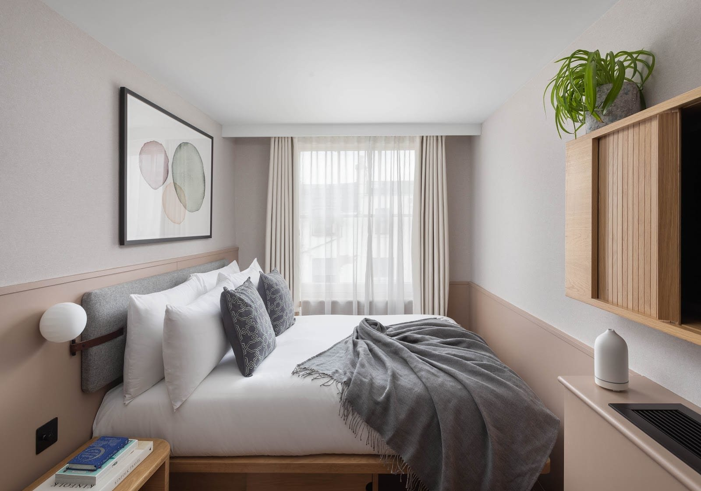

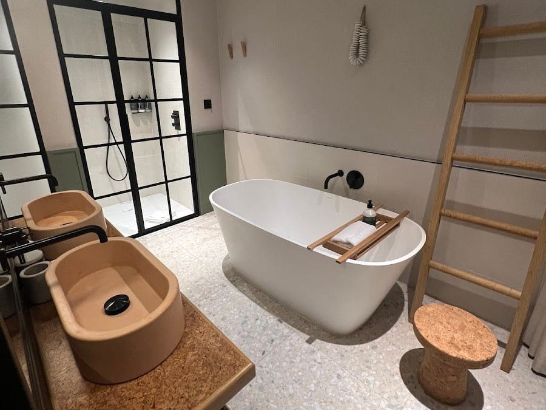

*A small double, where the bed runs wall to wall. The bath photo is from one of the larger rooms.*

## Hotels at Lancaster Gate

### The Columbia — 102 rooms and the avocado bathrooms

*95–99 Lancaster Gate, W2 3NS · Lancaster Gate 4 min, Paddington 7 min · [Hotels.com](hotelscom:h10546518)*

Five Grade II Victorian townhouses from 1856, opposite the park, that have been a Red Cross hospital and an officers' club and were later the hotel bands on the way up stayed in. **Every room keeps its original 1970s avocado bathroom suite.**

Rooms are small at the bottom and generous at the top: singles and small doubles of 10 to 12 square metres, doubles and twins of 14 to 16, **family rooms with two double beds** and triples of 18 to 20, and quads of 20 to 22. Booking direct gets free parking when a space is free and a noon check-out. Dogs are welcome.

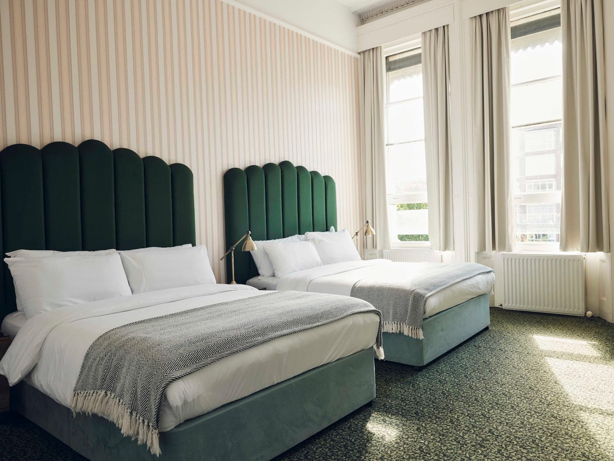

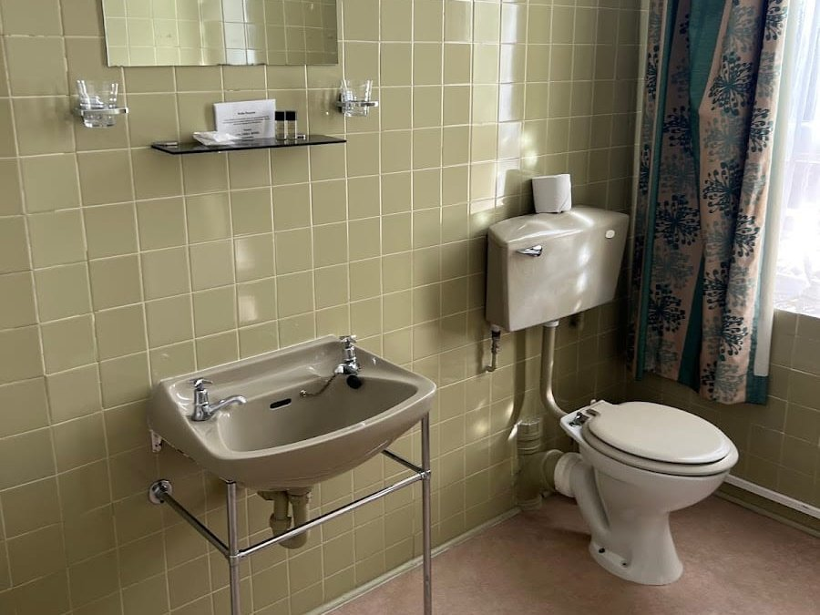

*A family room with two doubles and tall sash windows, and one of the 1970s bathrooms, avocado basin and all.*

### Royal Lancaster London — 411 rooms on the park edge

*£££ · Lancaster Terrace, W2 2TY · Lancaster Gate 1 min, Paddington 9 min · [Hotels.com](hotel:royal-lancaster-london)*

A tower opened in 1967 on the edge of the park, opposite the Italian Gardens, and still independently owned. The upper floors look over the park to the skyline. **Classic Family rooms are two rooms with an interconnecting door and two marble bathrooms**, and children's amenities come on request; our [family hotels guide](/articles/best-family-hotels-london/) compares it with the others. Nipa Thai, run by an all-Thai kitchen, is the restaurant, and there is afternoon tea; our [afternoon tea guide](/articles/best-afternoon-tea-london/) covers where else to book one.

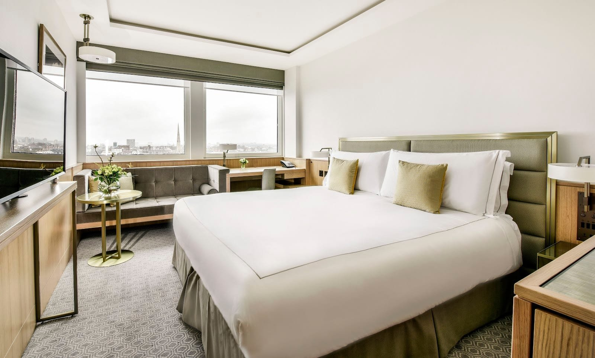

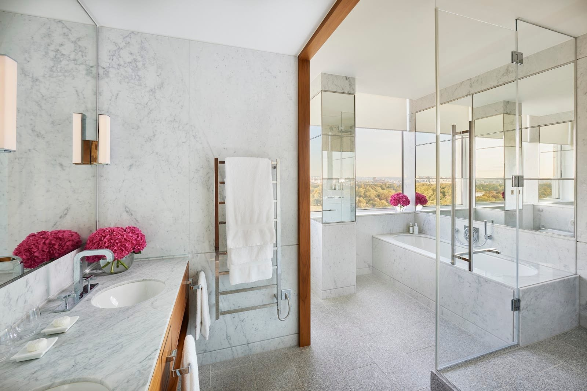

*A double with a city view from the tower. The bathroom photo is from a suite, with a bath, a separate shower and a view over the park.*

Powered by <a target="_blank" rel="sponsored nofollow noopener" href="https://www.getyourguide.com/london-l57/">GetYourGuide</a>

## Notting Hill Carnival

**Carnival 2027 is on Sunday 29 and Monday 30 August**, the August bank holiday weekend. The UK National Panorama steel band competition, which needs a ticket, is on Saturday 28 August. Sunday is the family day, with J'ouvert from 6am and the children's parade; Monday is the adults' parade. Sound systems play from noon to 7pm on both days. The [official Carnival site](https://nhcarnival.org/carnival-info) publishes the full schedule.

At the 2026 Carnival, TfL ran these station restrictions on both days:

- **Ladbroke Grove**: closed all day.
- **Notting Hill Gate**: no entry from 11am to 6pm.
- **Westbourne Park**: no entry from 11am.
- **Queensway**: exit only from 11am to 6pm.
- **Royal Oak**: no entry from 11am to 6pm, then closed.
- **Holland Park**: no entry from 11am to 3pm, then closed.

TfL pointed visitors to Paddington instead, with signed walking routes to the Carnival. Road closures ran until 6am on the Tuesday, with traffic diverted onto a ring route including Holland Park Avenue and Kensington Church Street.

For where to sleep, that means:

- **The Notting Hill hotels are in the crowd.** The Laslett, Ruby Zoe, The Lost Poet and The Portobello Hotel are minutes from the route, and their nearest station has no entry all afternoon.
- **For a quiet night, book Lancaster Gate.** The Columbia and the Royal Lancaster are about twenty minutes' walk from Portobello Road, and Lancaster Gate station was not on TfL's restriction list.
- **Book early and read the minimum stay.** The Portobello Hotel may require three nights over a bank holiday, and Space Apart takes two nights at any time.
- **If you are not coming for Carnival, avoid the weekend.** The streets close and shops board up.

## Budget rooms in Bayswater

The side streets between Queensway and Paddington are lined with small hotels in converted townhouses, and the rooms vary from building to building. Before booking on price, check three things:

- **The room size in square metres.** Singles at The Columbia start at 10 and at Inhabit at 8.
- **Whether there is a lift.** Vancouver has none, and neither does The Lost Poet.
- **Whether the bathroom is in the room.** Garden Court sells a single with its bathroom outside it, and at Urbany every bathroom is shared.

For a private room on a budget, Vancouver's studios start at £97 and Space Apart's at about £140, both with kitchens. Our [budget hotels guide](/articles/best-budget-hotels-london/) covers the cheapest options across London, and our [aparthotels guide](/articles/aparthotels-london/) compares studios with kitchens.

## Getting in and out

**Notting Hill Gate** has the Central, Circle and District lines. The Central line runs direct to Oxford Circus in five stops, and on to Tottenham Court Road, Bank and Liverpool Street.

**Queensway** and **Lancaster Gate** are Central line only; **Bayswater** is Circle and District. **Ladbroke Grove** and **Westbourne Park**, on the Circle and Hammersmith & City lines, serve the north end of Portobello Road.

**King's Cross St Pancras**, for the Eurostar, is direct on the Circle line from Notting Hill Gate and Bayswater.

**Heathrow:** the Heathrow Express, 15 minutes, or the Elizabeth line to Paddington, then the Circle or District line one stop to Bayswater or two to Notting Hill Gate. From Lancaster Gate, walk to Paddington. Our [Heathrow guide](/articles/heathrow-airport-to-london/) compares the fares, and the [Paddington area guide](/articles/paddington-area-guide/) covers the hotels beside the station.

For how Notting Hill compares with every other base in London, see [the best areas to stay in London](/articles/best-areas-to-stay-in-london/). South of the park, our [South Kensington guide](/articles/where-to-stay-south-kensington/) covers the museum end, and the [Kensington area guide](/articles/kensington-area-guide/) covers Kensington Palace and Holland Park.

*Typical nightly rates for a double, or each hotel's own published from-rate where it gives one, checked 24 September 2026. The £ symbols mark a price band where a hotel publishes no rate. Carnival dates from the Carnival organisers; 2026 station arrangements from TfL. Prices move nightly, so check your own dates.*
