Shoreditch has the best run of design hotels in London and it is **no longer the cheap option** — the least expensive room we have checked there is about £110, and most sit between £180 and £250. That is more than Bloomsbury or King's Cross, both of which are considerably more central.

It is also loud. Not "city noise" loud — the streets around Great Eastern Street and Curtain Road are a nightlife district, and on a Friday people are still on them at three in the morning.

So this covers two questions rather than one: **which Shoreditch hotel**, and **where to stay near Shoreditch** if you would rather not pay the premium or be woken by it.

> 💡 **The Short Version:** **[The Hoxton](hotel:the-hoxton-shoreditch)** is the best all-rounder at about £200. **[The Z Hotel](hotel:z-hotel-shoreditch)** is the cheapest at £110 — but its lowest rate is a windowless room and people book it by accident. **[art'otel Hoxton](hotel:artotel-london-hoxton)** has two rescued Banksys on the outside of the building, free to see. And if you want the area without the price, **Stratford** is fifteen minutes away from about £100, and **the City of London** is often cheapest of all at weekends.

## Which part of Shoreditch

The name covers about a mile, and the difference between its ends is the difference between a good night's sleep and a bad one.

**Great Eastern Street, Curtain Road and Old Street** are the nightlife core. Bars, clubs, queues, and street noise until the early hours at weekends. Several of the best hotels are here, which is not a coincidence — it is where the area's character is. Book a room off the street.

**Spitalfields and the Liverpool Street edge**, to the south, is Georgian, quieter, and a ten-minute walk from the Elizabeth line. This is where to stay if you want Shoreditch in the evening and sleep at night.

**Hoxton and the north end**, up towards Hoxton Square and Kingsland Road, is more residential, slightly cheaper, and a longer walk to a Tube station.

**There is no Tube station called Shoreditch.** Shoreditch High Street is Overground, Old Street is the Northern line, Liverpool Street is everything including the Elizabeth line. People book on the assumption that a station shares the name and find themselves further from a train than they planned.

## The hotels

### The Hoxton, Shoreditch — the best all-rounder

*About £200 · Breakfast included · Shoebox to Roomy · [check prices](hotel:the-hoxton-shoreditch)*

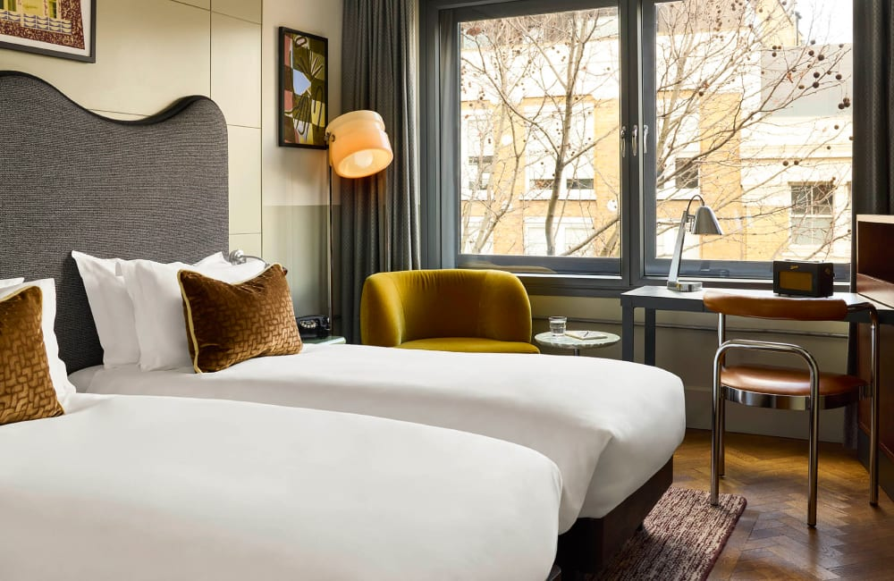

*Left: the lobby the format is named after, a bar and fireplace that fill up with people who are not staying here. Right: a twin room with a mustard velvet chair and warm parquet flooring.*

The hotel that made the open-lobby-as-workspace format normal, and still the best example of it. The ground floor is genuinely full of locals working and meeting rather than only guests, which is the thing most imitators never manage.

**Breakfast is a bag hung on your door**, included in the rate — a useful touch at a hotel where the lobby is busy from eight in the morning.

Room grades are named by size and the naming is honest: **a Shoebox is exactly what it says**, then Snug, Cosy and Roomy. Pick the grade on the number rather than the adjective.

### The Z Hotel Shoreditch — the cheapest, with a catch

*About £110 · Breakfast is charged separately · [check prices](hotel:z-hotel-shoreditch)*

The compact-room format on the Shoreditch edge of the City. At £110 it is the only room in Shoreditch under about £150. Breakfast is bought in the Z Cafe rather than included: the free Z Member scheme adds evening cheese and wine and 10% off food and drink, but it excludes breakfast, and only the pricier Z Club room grade has breakfast in the rate.

**The catch is real and worth spelling out.** The cheapest rate is an "Inside" room, which has **no window at all** — the same format as the Covent Garden branch — and people book it by accident because the booking page does not lead with it. Pay up a grade unless you genuinely do not mind, which some people do not.

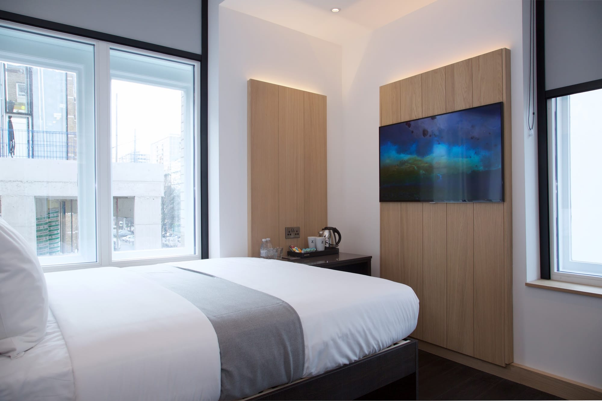

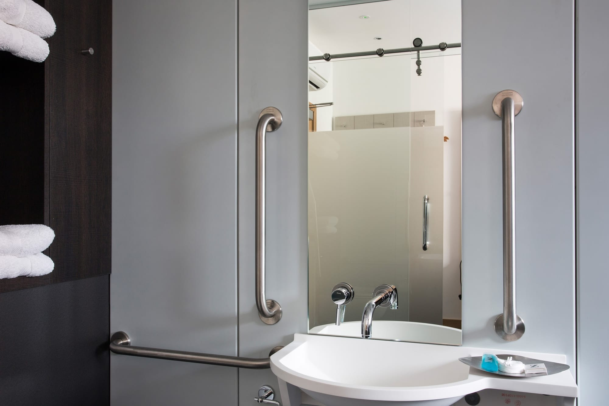

*A room and its ensuite — this grade has a window, unlike the windowless "Inside" rate described above.*

### One Hundred Shoreditch — the calm one

*About £180 · Six bars and restaurants · [check prices](hotel:one-hundred-shoreditch)*

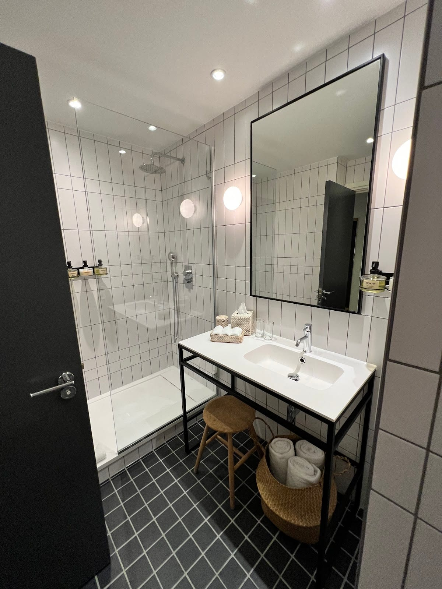

*Left: a twin room in the old Ace building — the murals are the part people photograph. Right: the bathroom, white subway tile with a walk-in shower.*

Rooms vary a lot for one hotel — whitewashed walls, tapestry hangings and pine in some, a wall-filling graphic mural and patchwork quilts in others — with cult DS & Durga toiletries throughout. Time Out described it as staying in the spare room of an impossibly fashionable friend, which is about right.

**This is the former Ace Hotel building**, which matters because the booking sites still file it under the old name. Six bars and restaurants including a rooftop, all open to non-residents — good for the area, less good for quiet.

### Redchurch Townhouse — Soho House without the membership

*About £220 · Thirty-seven rooms · Cecconi's downstairs · [Hotels.com](hotel:redchurch-townhouse)*

Soho House quality without needing to be a member — **Shoreditch House is round the corner and members only**. Thirty-seven rooms in a 1970s interior with Cowshed products and a ground-floor Cecconi's.

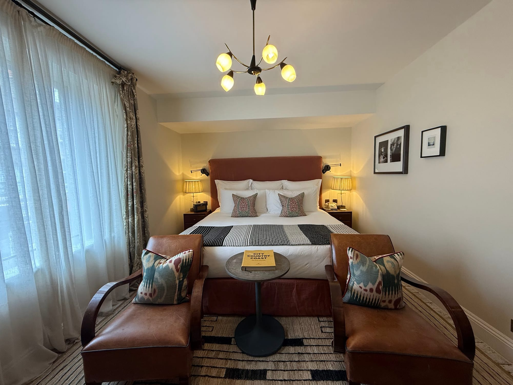

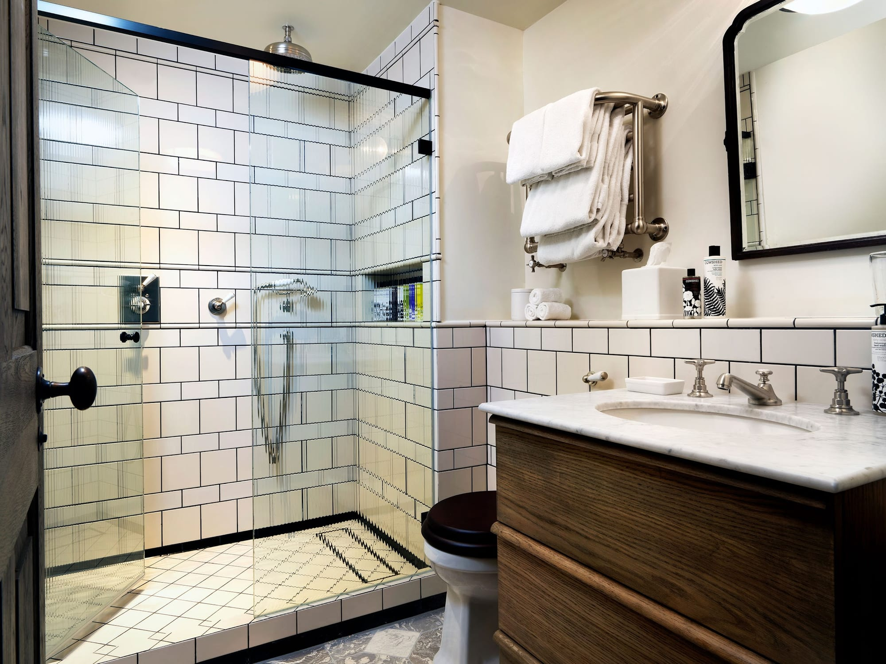

*Left: a room with a rust velvet headboard and a mid-century chandelier. Right: the bathroom, with the Cowshed toiletries used throughout.*

Small and quiet for the area, and the closest thing here to a hotel that does not want to be a scene. **Cecconi's on the ground floor is open to non-residents**, which is worth knowing both ways round: you can eat there without staying, and the restaurant is busy enough on a Friday that the lobby is not a quiet place to arrive into.

The practical catch is scale. **Thirty-seven rooms means it sells out before the big hotels do**, and it has no spare capacity when it does — there is no second room type to fall back on beyond the suites. Book earlier than you would for One Hundred or the Hoxton, and note that **breakfast is charged on top** of a rate that is already £220.

It sits on Whitby Street, a side turning off Redchurch Street rather than on it, which is the reason it is quieter than its address suggests.

### Batty Langley's — the period one

*About £230 · No lift, no air conditioning · Seven minutes from Liverpool Street · [check prices](hotel:batty-langleys)*

Dark walls, floor-to-ceiling silk curtains, antiques and oil paintings on a cobbled Spitalfields street. Closer to staying inside a Georgian house museum than a hotel, and next door to Dennis Severs' House, which is literally that.

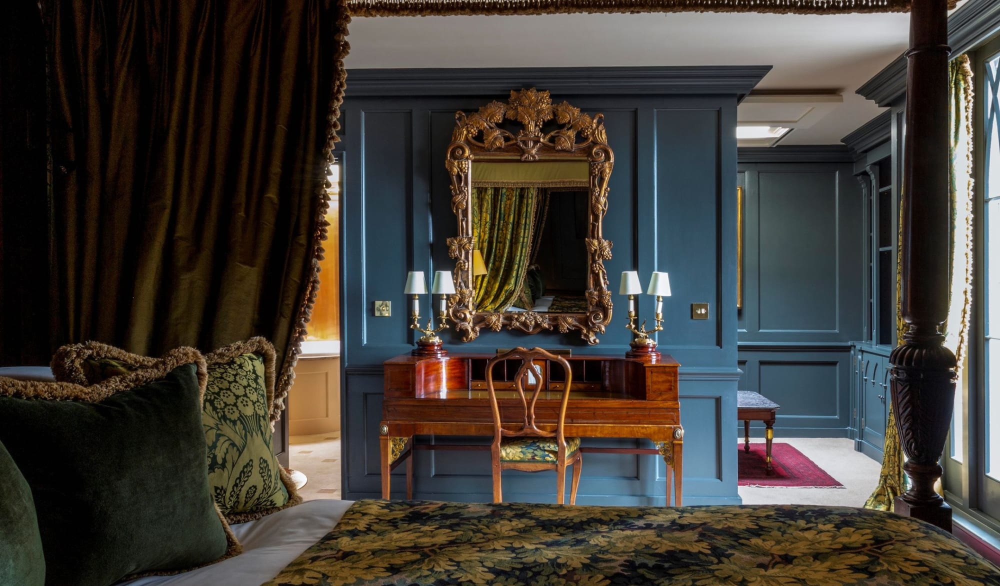

*One of the individually decorated rooms — dark panelling, an antique desk and a gilt mirror, with no two alike.*

**No lift and no air conditioning.** That is the trade for a genuine period building, and it is a real one in a July heatwave or with a heavy case — ask for a lower floor if either matters, because the staircase is Georgian and narrow.

**Rooms are individually decorated**, which here is literal rather than marketing: they are not variations on one scheme, so the room you see online is the room, and choosing matters more than usual. Doubles and suites only.

It is on Folgate Street in Spitalfields, **seven minutes from Liverpool Street**, which puts it on the quiet side of the area — Georgian terraces rather than nightlife, and a different proposition from the Curtain Road hotels even though it is ten minutes from them. **Breakfast is extra.**

### Aethos London Shoreditch — the wellness rebrand

*About £250 · Underground spa · Formerly Nobu Hotel · [check prices](hotel:aethos-london-shoreditch)*

A wellness-minded rebrand of the former Nobu Hotel Shoreditch, with floor-to-ceiling windows, a members'-club feel and an underground spa with steam and sauna, minutes from Brick Lane and Old Street.

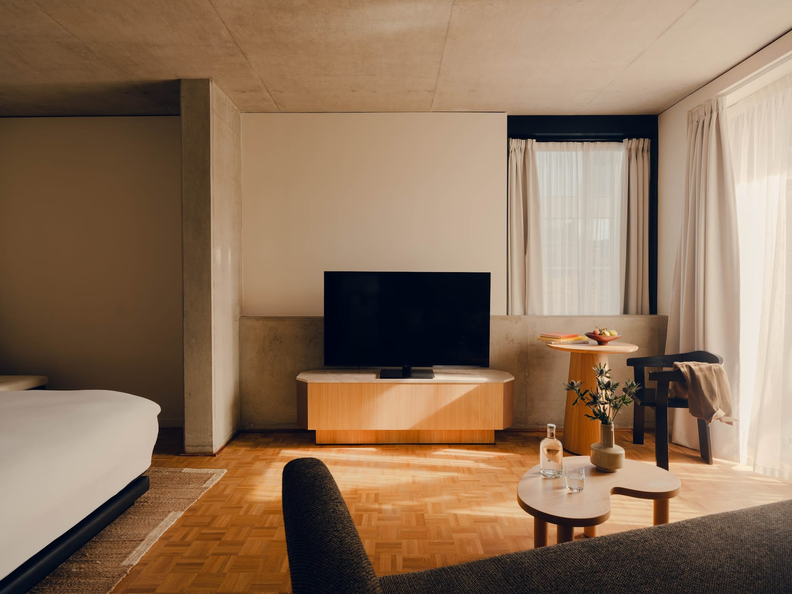

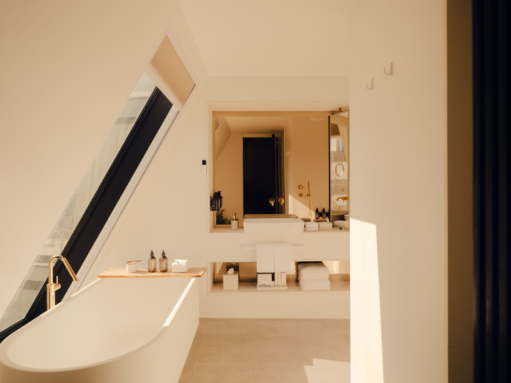

*Left: a room with a concrete accent wall and floor-to-ceiling windows. Right: the bathroom, with a free-standing tub under the roofline.*

**Rooms lean small for the price**, which is the Shoreditch trade-off in general. There are four grades — double, executive, premium and Skyline suite — and **the top-floor Skyline rooms have private balconies**, which are the ones worth booking ahead for and the only reason to pay the top of the range.

**The spa is the thing that justifies the £250**, and it is underground rather than a token treatment room: steam and sauna, and quiet in a way nothing else at street level in Shoreditch manages. Check whether your rate includes access when you book, because that is where the difference between this and One Hundred at £180 actually sits.

Willow Street is a side street off Great Eastern Street — **close enough to the nightlife core to hear it at weekends**, so ask for a room off the front. **Breakfast is extra.**

### Virgin Hotels London-Shoreditch — the rooftop pool

*About £250 · Heated rooftop pool, open all year · [check prices](hotel:mondrian-shoreditch)*

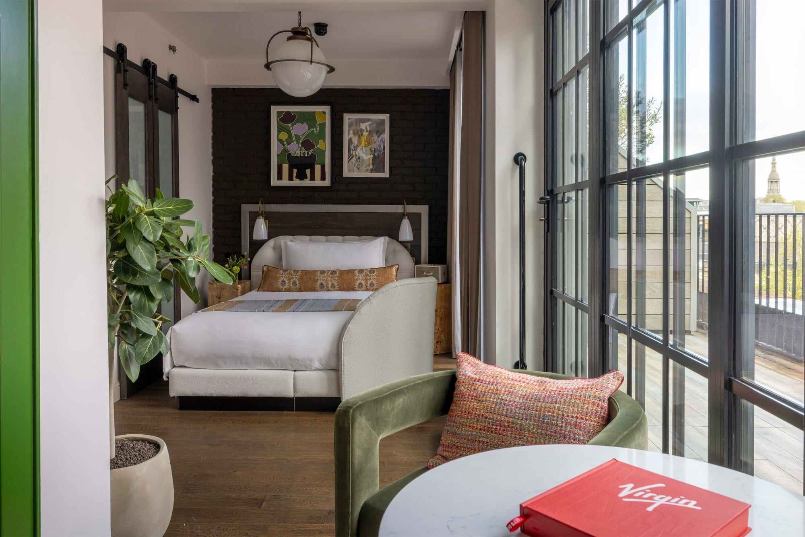

*Left: the heated rooftop pool, with the bar running alongside it behind glass. Right: a room with a dark brick wall and floor-to-ceiling windows onto a private terrace.*

A heated rooftop pool and terrace open year-round over Shoreditch, which is why guests pick this over the area's other design hotels.

**This building is on its third name.** It was The Curtain, then Mondrian Shoreditch, and has been Virgin Hotels London-Shoreditch since August 2024 — Virgin's first London property. Older guides and some booking listings still use the previous names.

**The rooftop draws a non-resident crowd at weekends.** Book a pool slot rather than assuming it will be quiet.

### nhow London — the loud one, deliberately

*About £150 · Punk-meets-high-tech · 2 Macclesfield Road, EC1V 8DG · [check prices](hotel:nhow-london)*

Project Orange's interior, complete with a Big Ben rocket sculpture in the lobby and graffiti throughout — British iconography played entirely for fun. Design-forward at a mid-range price, which is genuinely unusual.

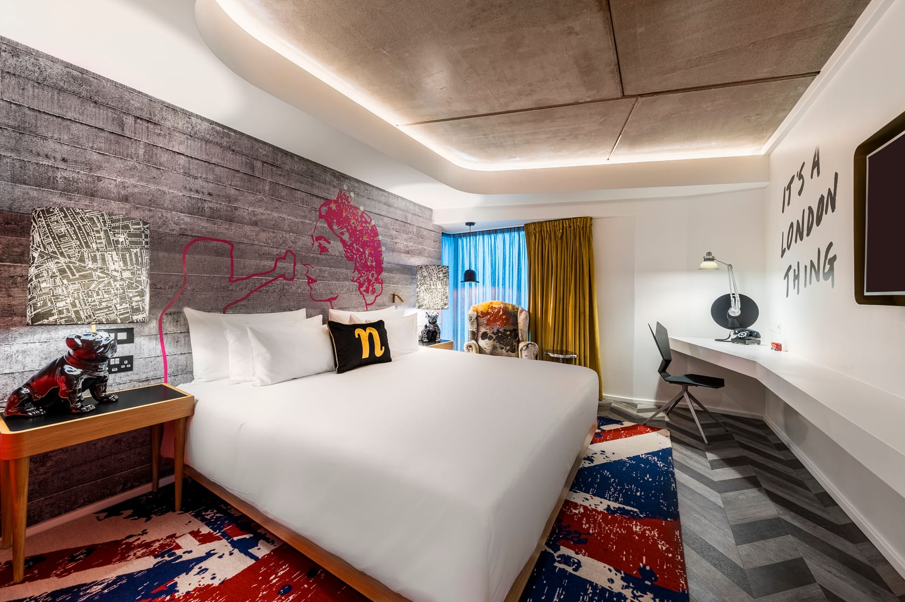

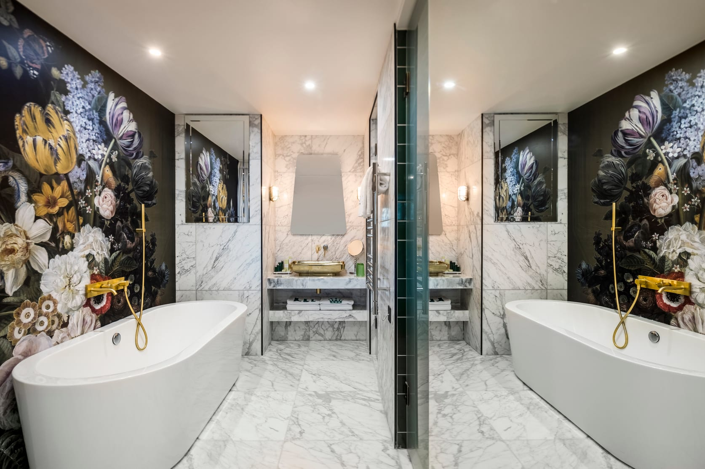

*Left: the graffiti and Union Jack rug that make the theme, in one of the rooms. Right: a bathroom in the same playful style, floral wallpaper and gold fixtures.*

**The theme is committed rather than tasteful, and that is the point.** If you want a calm room this is the wrong hotel; if you want the most fun per pound in the area it is the right one.

**It is also not quite in Shoreditch**, and that is worth having straight before you book. The address is Macclesfield Road, up by Old Street and the City Road basin — a ten-minute walk from Curtain Road rather than on it. For most people that is an advantage: **you get the mid-range price and none of the 2am street noise**, at the cost of walking home. Old Street is the nearest Tube, on the Northern line, which has no night service on this branch.

At about £150 it undercuts every other design hotel here by £30 to £100, and **breakfast is extra.**

### art'otel London Hoxton — the tower

*About £230 · 26 storeys · Two Banksys outside · [check prices](hotel:artotel-london-hoxton)*

A tower wrapped in twisted black fins with the street artist D*Face's work running through every room and public space. There is a public gallery, a 60-seat screening room, and an indoor pool non-residents can book.

**Two original Banksys are preserved on the outside of the building**, rescued from The Foundry which stood on this site, and they are free to look at from the street whether or not you stay.

Two practical notes. **Breakfast is about £56 extra**, which is a lot on top of £230. And Solaya, the 25th-floor restaurant, closes Sundays and Mondays — worth knowing if the view is why you booked.

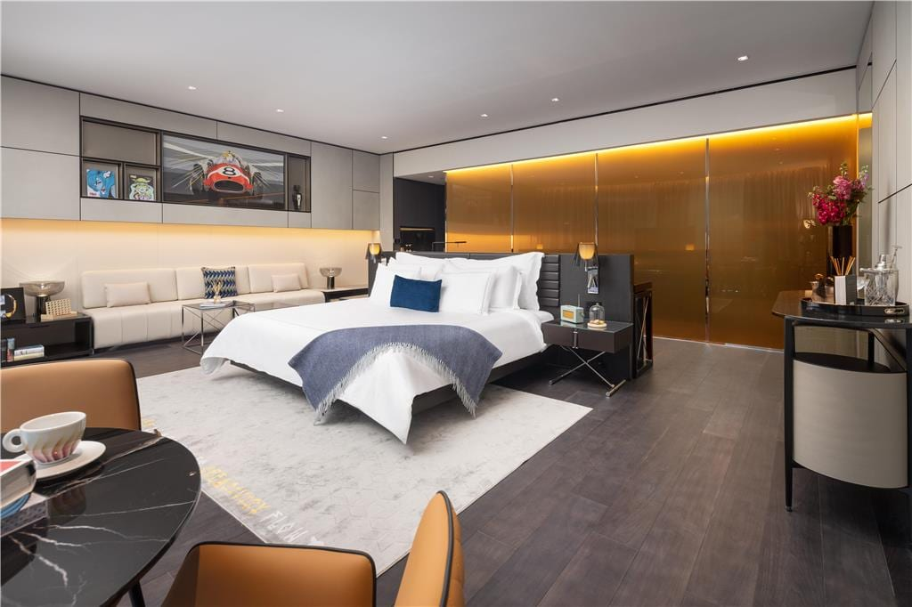

*A room at art'otel London Hoxton — D*Face's work on the wall, the amber glass panelling running through the tower.*

Powered by <a target="_blank" rel="sponsored" href="https://www.getyourguide.com/london-l57/">GetYourGuide</a>

## Where to stay near Shoreditch instead

This is the more useful half for most people, because Shoreditch's prices have moved and its noise has not.

If you have not settled on the area yet, our guide to the [best areas to stay in London](/articles/best-areas-to-stay-in-london/) sorts the whole city by what the trip is for — first visit, nightlife, museums, budget — and covers the thing that decides most of it, which is whether there is a train home at one in the morning.

### Liverpool Street and Aldgate — ten minutes south

Quieter at night, and the transport is better: **the Elizabeth line puts you at Bond Street in about twelve minutes and Heathrow without changing.** You are still a ten-minute walk from Shoreditch's bars, which is the right distance to be from them at midnight.

**The reason to choose this over Shoreditch proper is the night, in both senses.** The streets are commercial rather than residential, so they empty rather than fill after dark, and Liverpool Street is one of the best-connected points in London — the Elizabeth line, the Central line, the Circle, Hammersmith & City and Metropolitan, plus National Rail out to Stansted. **[Batty Langley's](hotel:batty-langleys)** and **[Leman Locke](hotel:leman-locke)** both sit in this pocket, the first a Georgian townhouse and the second an aparthotel with kitchens.

*Left: the open-plan studio at Leman Locke, sofa and bed in one room. Right: the bathroom.*

The trade is that it is dull on a Sunday. Aldgate in particular has very little open at the weekend, so plan to walk north for food.

### The City of London — cheapest at weekends

The counterintuitive one, and the best value in this guide. **The City empties out at weekends**, so hotels that charge business rates from Monday to Thursday discount hard on Friday and Saturday — the opposite of the pattern everywhere else in London.

**[Locke at Broken Wharf](hotel:locke-at-broken-wharf)** is about £190 midweek and worth checking against a Shoreditch room for the same Saturday. Ten minutes away by bus or twenty on foot, on the river between Blackfriars and the Millennium Bridge, and the rooms are studios with kitchens rather than hotel rooms — which matters more than the price if you are staying several nights.

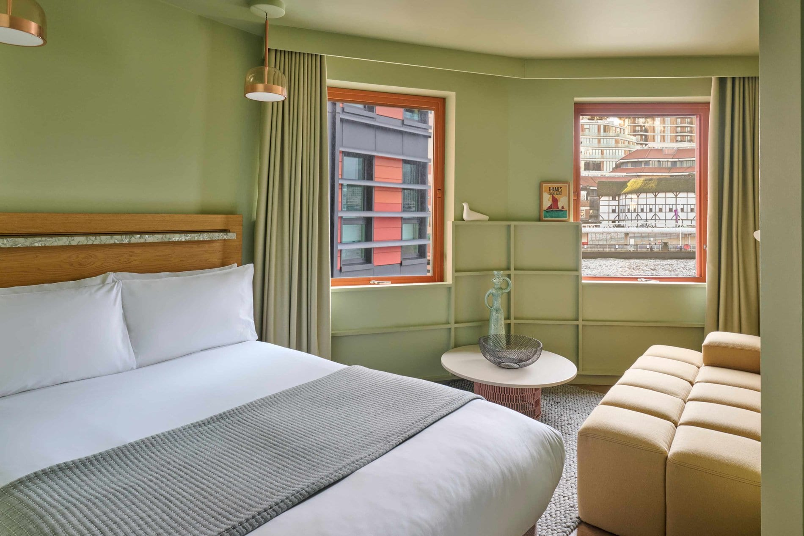

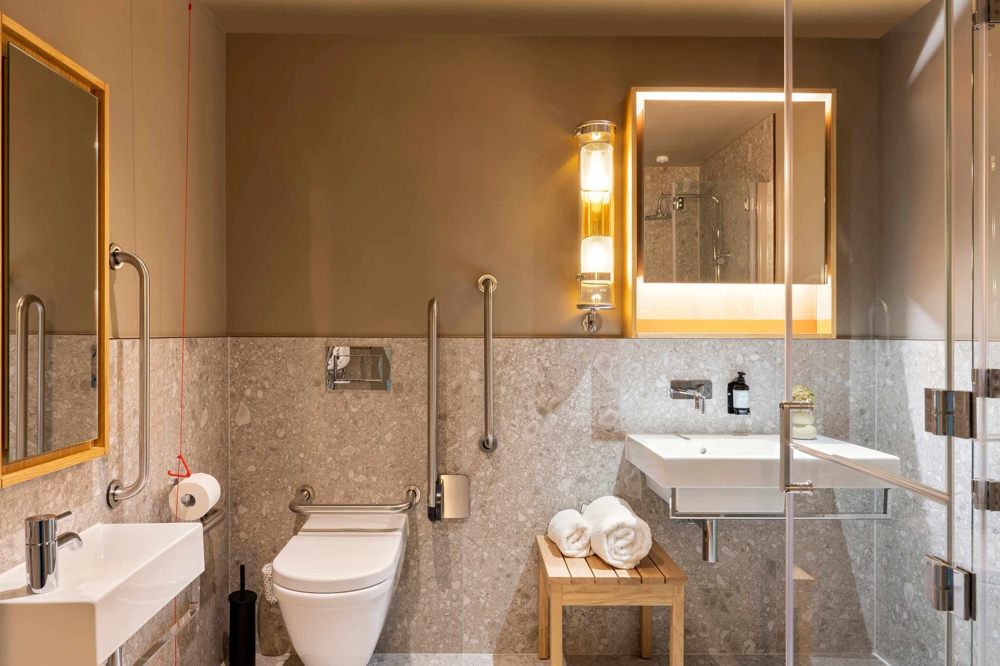

*Left: a studio at Locke at Broken Wharf, with green walls overlooking the river. Right: the bathroom.*

**The way to use this is to price the same Saturday twice**, once in Shoreditch and once in the City, and take whichever wins. There is no loyalty to be had here: the gap swings by more than £80 depending on the week, and it is the only area in this guide where the weekend is the cheap end.

The cost is atmosphere. **The City is genuinely dead on a Sunday** — many places do not open at all — so it works for a Friday and Saturday and badly for a week.

### Whitechapel — east and cheaper

East of Shoreditch, noticeably cheaper, and on both the Elizabeth line and the District line. Less to do on the doorstep, but you are two stops from everything, and the Elizabeth line makes the rest of London closer than it looks on a map — **Bond Street in about fifteen minutes, Heathrow without changing.**

What you get for the lower price is a working East End high street rather than a going-out district: **Whitechapel Market runs six days a week** along the main road, and the Royal London Hospital dominates the middle of it. It is busy by day and quiet by night, which is the opposite of Shoreditch and the reason it is cheaper.

**Check what the Elizabeth line actually saves you before booking here.** It is a genuine saving on a room rate, but the walk back from Shoreditch's bars is twenty-five minutes and the night bus is the realistic way home.

### Hackney and Dalston — north, better value

**Staycity Aparthotels Dalston** is about £130 for an apartment with a kitchen, which is the best value in this whole guide if you are staying more than two nights or travelling with family.

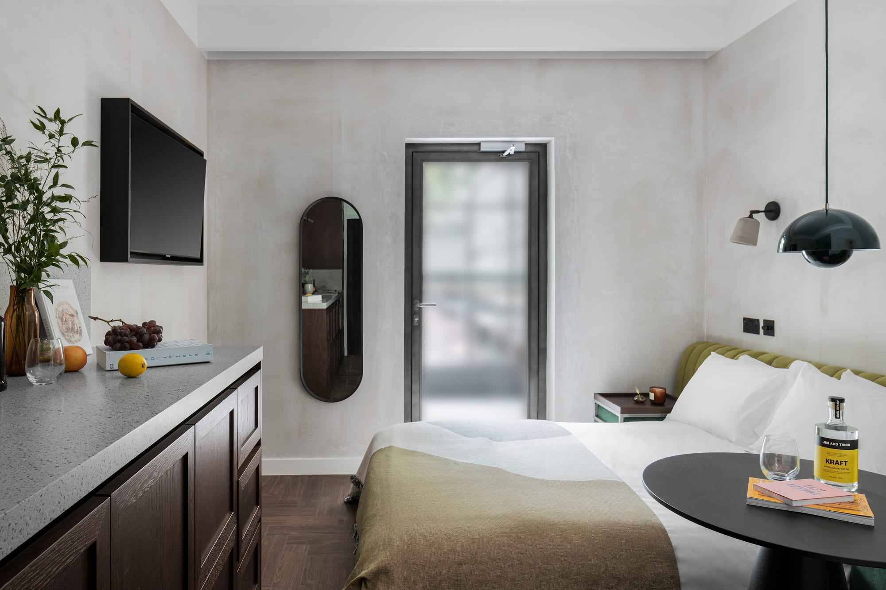

*One of the apartments, kitchenette and bed in the same room — the reason this is the best value in the guide for longer stays.*

**[The GreenHouse Capsules](hotel:greenhouse-capsules)** on Roman Road is £42 to £53 if you can sleep in a capsule — a range of eleven pounds across a whole year, which makes it the most predictable bed in this guide. It is dearer than Zone 1 on a quiet night and cheaper in December, which our [pod hotels guide](/articles/pod-hotels-london/) goes into properly. **[Town Hall Hotel](hotel:town-hall-hotel)** in Bethnal Green is about £220 and a genuinely special building — a 1930s town hall, with an Art Deco council chamber you can walk into.

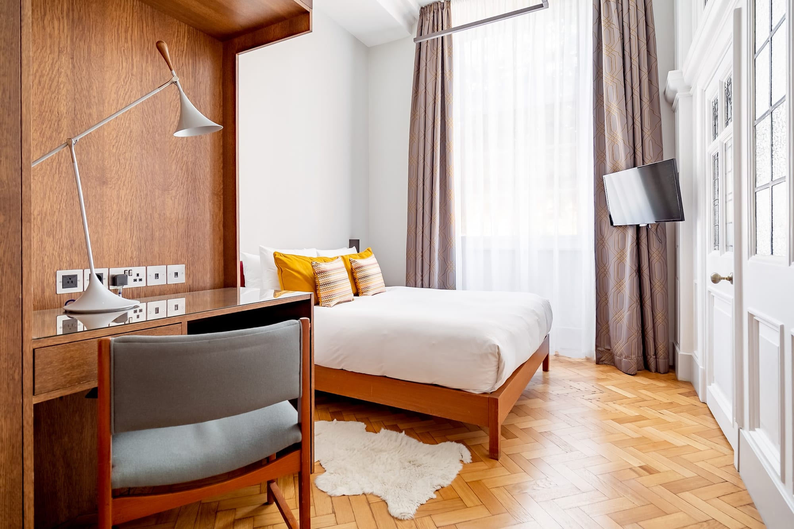

*One of the rooms at Town Hall Hotel, with warm wood tones and a herringbone parquet floor.*

### Stratford — fifteen minutes, from £100

**Premier Inn London Stratford** is about £100 and fifteen minutes from Liverpool Street on the Central line. **[Hyatt Regency London Stratford](hotel:hyatt-regency-stratford)** is about £170.

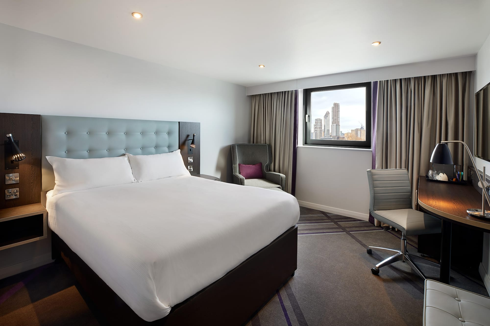

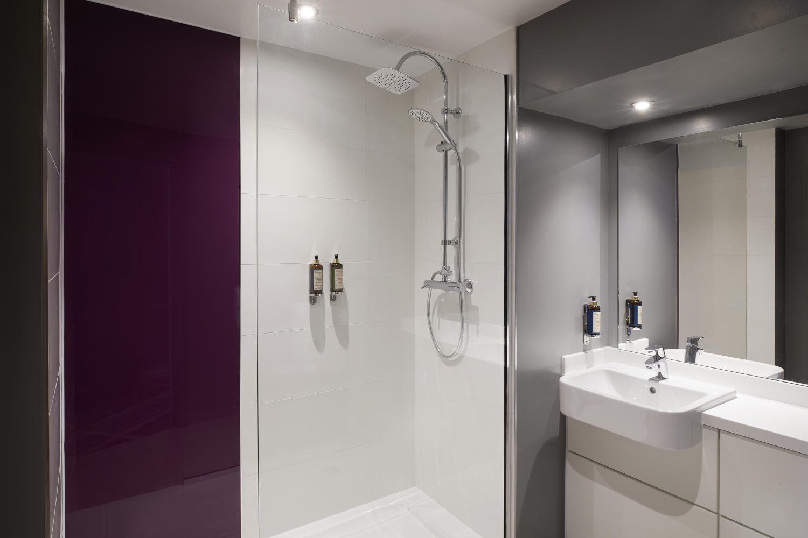

*A room at Premier Inn London Stratford, and its bathroom in the brand's signature purple.*

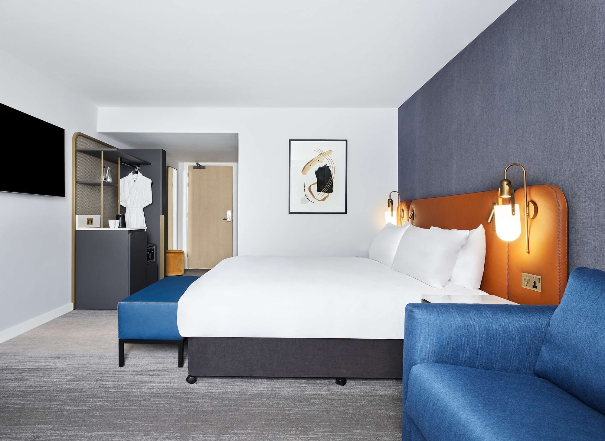

*A room at Hyatt Regency London Stratford.*

Stratford is not charming, but it is the answer if the priority is a decent room at a fair price with fast trains — and Westfield, the Olympic Park and the Elizabeth line are all on top of it.

**It is the best-connected place in this guide by some distance.** The Central line, the Jubilee, the Elizabeth line, the Overground and the DLR all meet at one station, plus National Rail, so almost nowhere in London needs a second change. **The Central line runs all night on Fridays and Saturdays**, which is the fact that decides it for anyone planning late evenings in Shoreditch — you can get home at 3am without a taxi.

The honest downside is that the area around the station is a shopping centre and a stadium, so evenings mean chains rather than the independents you came east for. Treat it as a base rather than a destination.

Powered by <a target="_blank" rel="sponsored" href="https://www.getyourguide.com/london-l57/">GetYourGuide</a>

## What you are staying for

If you have not spent time in the area yet, our [Shoreditch area guide](/articles/shoreditch-area-guide/) covers the markets, the bars and what is worth walking to. The single best free thing on the doorstep is the [street art](/articles/london-street-art/) — Shoreditch has the densest concentration in the city, and the walls change often enough that a guide is worth reading before you go looking.

## The noise question

If you take one thing from this guide, take this. **Shoreditch is a nightlife district and a residential one at the same time**, and the hotels sit in the middle of that.

Three things that actually help:

**Ask for a room away from the street**, by name, at booking rather than check-in. The design hotels here have deep floorplates and the internal rooms are genuinely quieter.

**Ask for a high floor.** Street noise falls off fast above the fourth.

**Treat Friday and Saturday as different products.** A hotel on Great Eastern Street that is calm on a Tuesday is not calm on a Saturday, and no amount of glazing changes that.

If none of that appeals, the answer is Liverpool Street or Spitalfields — close enough to walk back, far enough to sleep.

## Getting in and out

**Liverpool Street** is the one that matters: Elizabeth line, Central, Circle, Hammersmith & City, Metropolitan, and mainline trains to Stansted. Ten minutes on foot from most of Shoreditch.

**Old Street** is the Northern line, and closer to the north end.

**Shoreditch High Street** is Overground only, which is useful for Hackney, Dalston and south to Whitechapel and New Cross, and no use at all for the West End.

**For Heathrow**, walk to Liverpool Street and take the Elizabeth line — no changes, and it beats any route involving the Piccadilly line from here.
