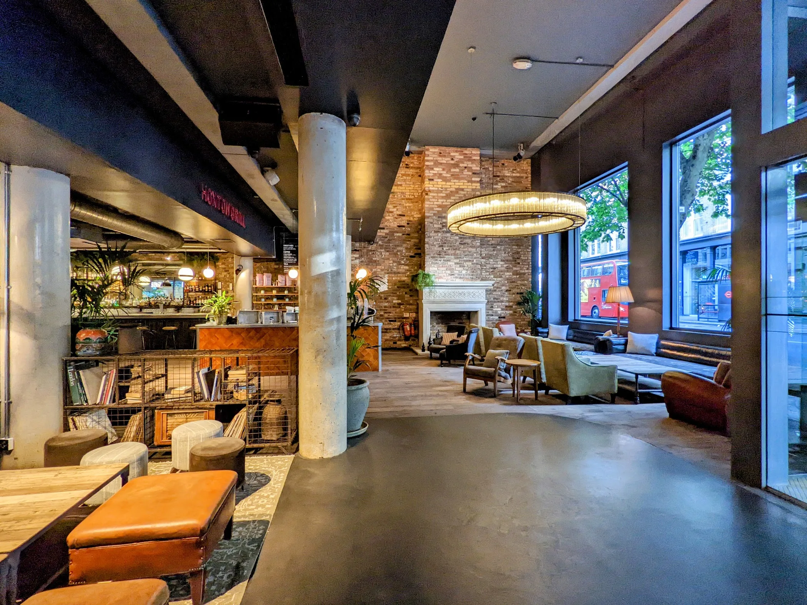
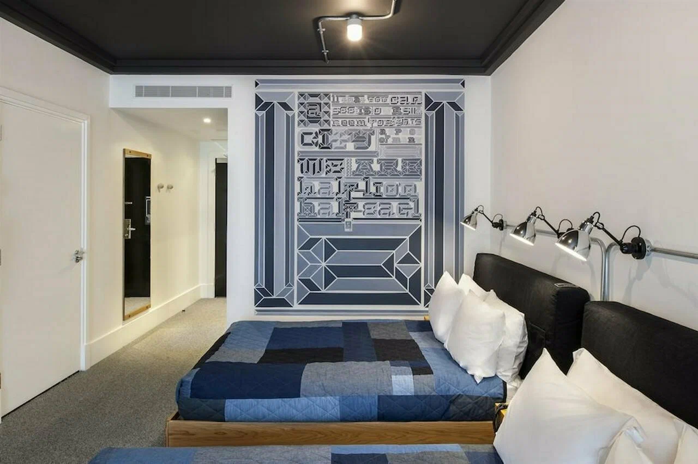

Shoreditch has the best run of design hotels in London and it is **no longer the cheap option** — the least expensive room we have checked there is about £110, and most sit between £180 and £250. That is more than Bloomsbury or King's Cross, both of which are considerably more central.

It is also loud. Not "city noise" loud — the streets around Great Eastern Street and Curtain Road are a nightlife district, and on a Friday people are still on them at three in the morning.

So this covers two questions rather than one: **which Shoreditch hotel**, and **where to stay near Shoreditch** if you would rather not pay the premium or be woken by it.

> 💡 **The Short Version:** **[The Hoxton](hotel:the-hoxton-shoreditch)** is the best all-rounder at about £200. **[The Z Hotel](hotel:z-hotel-shoreditch)** is the cheapest at £110 — but its lowest rate is a windowless room and people book it by accident. **[art'otel Hoxton](hotel:artotel-london-hoxton)** has two rescued Banksys on the outside of the building, free to see. And if you want the area without the price, **Stratford** is fifteen minutes away from about £100, and **the City of London** is often cheapest of all at weekends.

## Which part of Shoreditch

The name covers about a mile, and the difference between its ends is the difference between a good night's sleep and a bad one.

**Great Eastern Street, Curtain Road and Old Street** are the nightlife core. Bars, clubs, queues, and street noise until the early hours at weekends. Several of the best hotels are here, which is not a coincidence — it is where the area's character is. Book a room off the street.

**Spitalfields and the Liverpool Street edge**, to the south, is Georgian, quieter, and a ten-minute walk from the Elizabeth line. This is where to stay if you want Shoreditch in the evening and sleep at night.

**Hoxton and the north end**, up towards Hoxton Square and Kingsland Road, is more residential, slightly cheaper, and a longer walk to a Tube station.

**There is no Tube station called Shoreditch.** Shoreditch High Street is Overground, Old Street is the Northern line, Liverpool Street is everything including the Elizabeth line. People book on the assumption that a station shares the name and find themselves further from a train than they planned.

## The nine hotels

### The Hoxton, Shoreditch — the best all-rounder

*About £200 · Breakfast included · Shoebox to Roomy · [check prices](hotel:the-hoxton-shoreditch)*

*The lobby the format is named after: a bar, a fireplace and armchairs that fill up with people who are not staying here.*

The hotel that made the open-lobby-as-workspace format normal, and still the best example of it. The ground floor is genuinely full of locals working and meeting rather than only guests, which is the thing most imitators never manage.

**Breakfast is a bag hung on your door**, included in the rate — a useful touch at a hotel where the lobby is busy from eight in the morning.

Room grades are named by size and the naming is honest: **a Shoebox is exactly what it says**, then Snug, Cosy and Roomy. Pick the grade on the number rather than the adjective.

### The Z Hotel Shoreditch — the cheapest, with a catch

*About £110 · Breakfast included · Free evening cheese and wine · [check prices](hotel:z-hotel-shoreditch)*

The compact-room format on the Shoreditch edge of the City, with free cheese and wine in the lounge every evening and breakfast in the rate. At £110 it is the only room in Shoreditch under about £150.

**The catch is real and worth spelling out.** The cheapest rate is an "Inside" room, which has **no window at all** — the same format as the Covent Garden branch — and people book it by accident because the booking page does not lead with it. Pay up a grade unless you genuinely do not mind, which some people do not.

### One Hundred Shoreditch — the calm one

*About £180 · Six bars and restaurants · [check prices](hotel:one-hundred-shoreditch)*

*A twin room in the old Ace building. The murals are the part people photograph.*

Rooms vary a lot for one hotel — whitewashed walls, tapestry hangings and pine in some, a wall-filling graphic mural and patchwork quilts in others — with cult DS & Durga toiletries throughout. Time Out described it as staying in the spare room of an impossibly fashionable friend, which is about right.

**This is the former Ace Hotel building**, which matters because the booking sites still file it under the old name. Six bars and restaurants including a rooftop, all open to non-residents — good for the area, less good for quiet.

### Redchurch Townhouse — Soho House without the membership

*About £220 · Thirty-seven rooms · Cecconi's downstairs*

Soho House quality without needing to be a member, which is the entire point: **Shoreditch House is round the corner and you cannot get in.** Thirty-seven rooms in a 1970s interior with Cowshed products and a ground-floor Cecconi's.

Small and quiet for the area, and the closest thing here to a hotel that does not want to be a scene.

### Batty Langley's — the period one

*About £230 · No lift, no air conditioning · Seven minutes from Liverpool Street · [check prices](hotel:batty-langleys)*

Dark walls, floor-to-ceiling silk curtains, antiques and oil paintings on a cobbled Spitalfields street. Closer to staying inside a Georgian house museum than a hotel, and next door to Dennis Severs' House, which is literally that.

**No lift and no air conditioning.** That is the trade for a genuine period building, and it is a real one in a July heatwave or with a heavy case.

### Aethos London Shoreditch — the wellness rebrand

*About £250 · Underground spa · Formerly Nobu Hotel · [check prices](hotel:aethos-london-shoreditch)*

A wellness-minded rebrand of the former Nobu Hotel Shoreditch, with floor-to-ceiling windows, a members'-club feel and an underground spa with steam and sauna, minutes from Brick Lane and Old Street.

**Rooms lean small for the price**, which is the Shoreditch trade-off in general. The top-floor Skyline rooms have private balconies and are the ones worth booking ahead for.

### Virgin Hotels London-Shoreditch — the rooftop pool

*About £250 · Heated rooftop pool, open all year · [check prices](hotel:mondrian-shoreditch)*

*Heated, and open through the winter. The bar runs alongside it behind glass, which is where the weekend crowd sits.*

A heated rooftop pool and terrace open year-round over Shoreditch, which is why guests pick this over the area's other design hotels.

**This building is on its third name.** It was The Curtain, then Mondrian Shoreditch, and has been Virgin Hotels London-Shoreditch since August 2024 — Virgin's first London property. Older guides and some booking listings still use the previous names.

**The rooftop draws a non-resident crowd at weekends.** Book a pool slot rather than assuming it will be quiet.

### nhow London — the loud one, deliberately

*About £150 · Punk-meets-high-tech · [check prices](hotel:nhow-london)*

Project Orange's interior, complete with a Big Ben rocket sculpture in the lobby and graffiti throughout — British iconography played entirely for fun. Design-forward at a mid-range price, which is genuinely unusual.

**The theme is committed rather than tasteful, and that is the point.** If you want a calm room this is the wrong hotel; if you want the most fun per pound in the area it is the right one.

### art'otel London Hoxton — the tower

*About £230 · 26 storeys · Two Banksys outside · [check prices](hotel:artotel-london-hoxton)*

A tower wrapped in twisted black fins with the street artist D*Face's work running through every room and public space. There is a public gallery, a 60-seat screening room, and an indoor pool non-residents can book.

**Two original Banksys are preserved on the outside of the building**, rescued from The Foundry which stood on this site, and they are free to look at from the street whether or not you stay.

Two practical notes. **Breakfast is about £56 extra**, which is a lot on top of £230. And Solaya, the 25th-floor restaurant, closes Sundays and Mondays — worth knowing if the view is why you booked.

## Where to stay near Shoreditch instead

This is the more useful half for most people, because Shoreditch's prices have moved and its noise has not.

If you have not settled on the area yet, our guide to the [best areas to stay in London](/articles/best-areas-to-stay-in-london/) sorts the whole city by what the trip is for — first visit, nightlife, museums, budget — and covers the thing that decides most of it, which is whether there is a train home at one in the morning.

### Liverpool Street and Aldgate — ten minutes south

Quieter at night, and the transport is better: **the Elizabeth line puts you at Bond Street in about twelve minutes and Heathrow without changing.** You are still a ten-minute walk from Shoreditch's bars, which is the right distance to be from them at midnight.

### The City of London — cheapest at weekends

The counterintuitive one, and the best value in this guide. **The City empties out at weekends**, so hotels that charge business rates from Monday to Thursday discount hard on Friday and Saturday — the opposite of the pattern everywhere else in London.

**[Locke at Broken Wharf](hotel:locke-at-broken-wharf)** is about £190 midweek and worth checking against a Shoreditch room for the same Saturday. Ten minutes away by bus or twenty on foot.

### Whitechapel — east and cheaper

East of Shoreditch, noticeably cheaper, on both the Elizabeth line and the District line. Less to do on the doorstep, but you are two stops from everything and the Elizabeth line makes the rest of London closer than it looks on a map.

### Hackney and Dalston — north, better value

**Staycity Aparthotels Dalston** is about £130 for an apartment with a kitchen, which is the best value in this whole guide if you are staying more than two nights or travelling with family.

**[The GreenHouse Capsules](hotel:greenhouse-capsules)** on Roman Road is £42 to £53 if you can sleep in a capsule — a range of eleven pounds across a whole year, which makes it the most predictable bed in this guide. It is dearer than Zone 1 on a quiet night and cheaper in December, which our [pod hotels guide](/articles/pod-hotels-london/) goes into properly. **[Town Hall Hotel](hotel:town-hall-hotel)** in Bethnal Green is about £220 and a genuinely special building — a 1930s town hall, with an Art Deco council chamber you can walk into.

### Stratford — fifteen minutes, from £100

**Premier Inn London Stratford** is about £100 and fifteen minutes from Liverpool Street on the Central line. **[Hyatt Regency London Stratford](hotel:hyatt-regency-stratford)** is about £170.

Stratford is not charming, but it is the answer if the priority is a decent room at a fair price with fast trains — and Westfield, the Olympic Park and the Elizabeth line are all on top of it.

## What you are staying for

If you have not spent time in the area yet, our [Shoreditch area guide](/articles/shoreditch-area-guide/) covers the markets, the bars and what is worth walking to. The single best free thing on the doorstep is the [street art](/articles/london-street-art/) — Shoreditch has the densest concentration in the city, and the walls change often enough that a guide is worth reading before you go looking.

## The noise question

If you take one thing from this guide, take this. **Shoreditch is a nightlife district and a residential one at the same time**, and the hotels sit in the middle of that.

Three things that actually help:

**Ask for a room away from the street**, by name, at booking rather than check-in. The design hotels here have deep floorplates and the internal rooms are genuinely quieter.

**Ask for a high floor.** Street noise falls off fast above the fourth.

**Treat Friday and Saturday as different products.** A hotel on Great Eastern Street that is calm on a Tuesday is not calm on a Saturday, and no amount of glazing changes that.

If none of that appeals, the answer is Liverpool Street or Spitalfields — close enough to walk back, far enough to sleep.

## Getting in and out

**Liverpool Street** is the one that matters: Elizabeth line, Central, Circle, Hammersmith & City, Metropolitan, and mainline trains to Stansted. Ten minutes on foot from most of Shoreditch.

**Old Street** is the Northern line, and closer to the north end.

**Shoreditch High Street** is Overground only, which is useful for Hackney, Dalston and south to Whitechapel and New Cross, and no use at all for the West End.

**For Heathrow**, walk to Liverpool Street and take the Elizabeth line — no changes, and it beats any route involving the Piccadilly line from here.
