Four districts share the SW1 postcode here, and each suits a different trip. **Westminster and Whitehall** put the Abbey, Parliament and the Churchill War Rooms on the doorstep. **St James's**, south of Piccadilly, has the old-fashioned five-star hotels. **Victoria** is the railway and coach terminus. **Pimlico**, south of Victoria, is where the small, cheaper hotels are.

What they share is quiet evenings. Whitehall and the streets around St James's Park are government offices and empty after work and at weekends, which helps you sleep and doesn't help you find dinner.

> 💡 **The Short Version:** For **Gatwick or the coach station**, sleep at Victoria: **[The Clermont](hotelscom:h10939)** is next to the station, and the **[Lime Tree Hotel](hotel:lime-tree-hotel)** is a minute from the coach station. The cheapest beds are in Pimlico: **[Astor Victoria](hotel:astor-victoria)** dorms from £18, and **[The Georgian House](hotel:georgian-house-wizard-chambers)** at about £140, **with no lift**. For the sights on foot, **[St Ermin's](hotel:st-ermins-hotel)** at about £220 is 100 metres from St James's Park station. At the top, **[The Goring](hotel:the-goring)** (about £600) is the family-owned one by Buckingham Palace, **[Corinthia](hotel:corinthia-london)** (about £750) has a swimming pool in its spa, and **[Raffles at The OWO](hotel:raffles-london-owo)** (about £900) is the Old War Office.

## Which part of Westminster

**Victoria** is the station and the streets around it. Southern and Gatwick Express trains from Gatwick end here, **Victoria Coach Station** is a separate building about five minutes' walk down Buckingham Palace Road, and Buckingham Palace is about ten minutes' walk north. Most of the practical, mid-priced hotels are here.

**Pimlico** is the grid of white stucco terraces south of the station. **Belgrave Road, Warwick Way and St George's Drive** are lined with small hotels in converted houses, and Pimlico station on the Victoria line is one stop from Victoria. Tate Britain and the Thames are at the bottom of it.

**Westminster and St James's Park** is the government quarter between Victoria Street and the park: Westminster Abbey, Parliament Square and St James's Park station. Buckingham Gate and Caxton Street are a few minutes from all of them.

**Whitehall and Trafalgar Square** is the northern end: Downing Street, Horse Guards and the Churchill War Rooms, with Charing Cross and Embankment stations and the National Gallery. Covent Garden and Soho are a short walk north.

**St James's** is the grid between Pall Mall and Piccadilly, with Green Park station on its western edge. North of Piccadilly is Mayfair: The Ritz and the grand hotels there are in our [Mayfair stay guide](/articles/where-to-stay-mayfair/). The County Hall hotels facing Big Ben across Westminster Bridge are in our [South Bank stay guide](/articles/where-to-stay-south-bank/).

Our [Westminster area guide](/articles/westminster-area-guide/) covers what to see, and the [Westminster walk](/articles/westminster-walk/) links the sights in eleven stops from Westminster Bridge to Trafalgar Square.

## Victoria: for Gatwick, the coach and the palace

### The Clermont London, Victoria: next to the station

*101 Buckingham Palace Road, SW1W 0SJ · Beside Victoria station · Check-in 3pm, out 11am*

**[The Clermont](hotelscom:h10939)** opened in 1862 as The Grosvenor Hotel, built beside the station, so the Gatwick train is a short walk from reception. Classic Singles are 16 square metres, and a Classic Family room of 28 square metres takes two adults and a child, or one adult and two children. **The hotel says it cannot accommodate wheelchair users**, because of the building's layout.

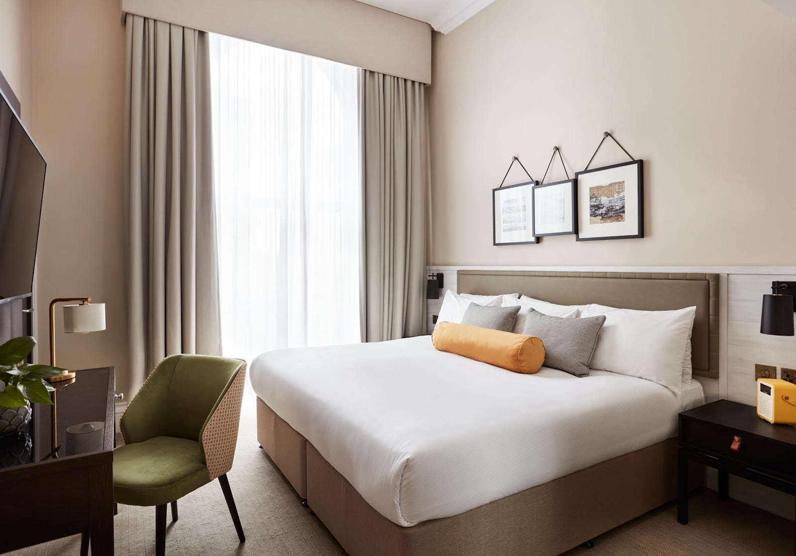

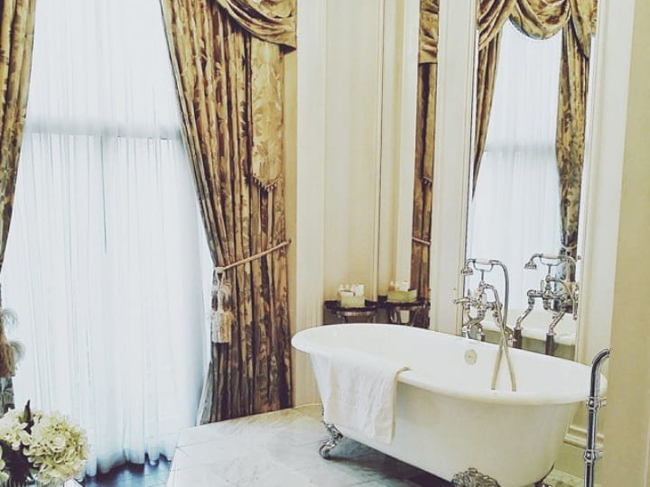

*Left: a double with a window the height of the wall. Right: a Victorian roll-top bath, which the hotel lists for its Signature Suites.*

### The Z Hotel Victoria: 9 square metres, two minutes from the station

*£135–£205 across five nights we priced · 5 Lower Belgrave Street, SW1W 0NR · Victoria 2 min*

**[The Z Hotel Victoria](hotelscom:199590624)** sells its double in two grades of 9 square metres: the cheaper Inside Double **has no window**, the Z Double has one. Our [windowless rooms guide](/articles/windowless-hotel-rooms-london/) compares its ladder of grades, and the [budget hotels guide](/articles/best-budget-hotels-london/) sets it against the rest of London.

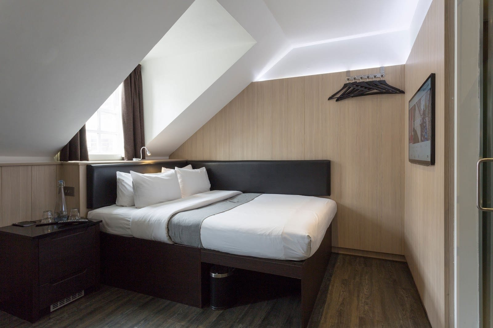

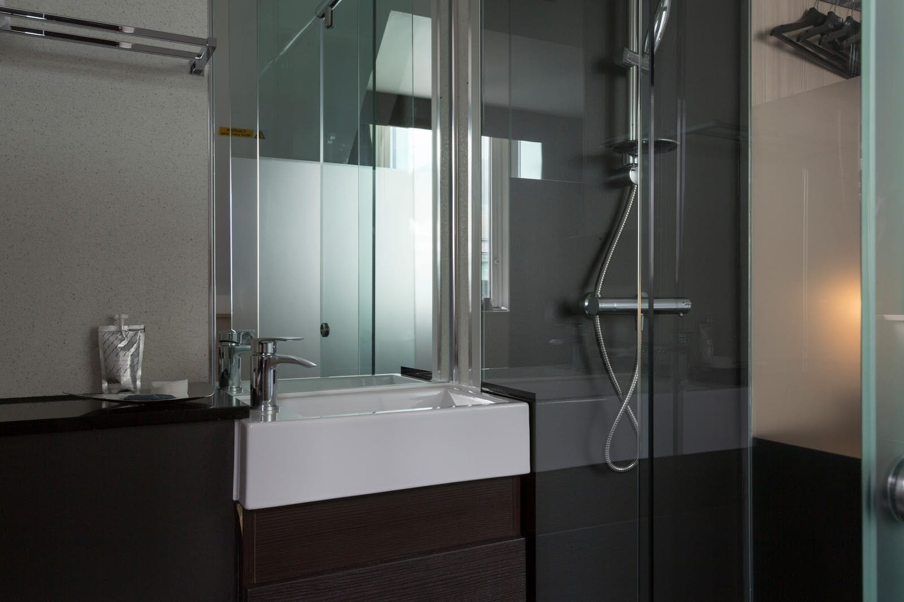

*A Z Double, the grade with a window: the bed runs wall to wall, and the shower is a glass cubicle beside the basin.*

### Lime Tree Hotel: a minute from the coach station

*££ · 137 Ebury Street, SW1W 9QU · Victoria Coach Station 1 min · Room only · No lift*

**[The Lime Tree](hotel:lime-tree-hotel)** is two houses of 1834, now a Grade II-listed small hotel at the junction of Ebury Street and Elizabeth Street. **There is no lift**, the Cosy Doubles are 10 square metres, the largest rooms sleep three, and the hotel advises against children under five. Air conditioning was added in May 2026. Rates are room only; breakfast is in The Buttery downstairs from 7.30am on weekdays and 8am at weekends. Check-out is 10.30am.

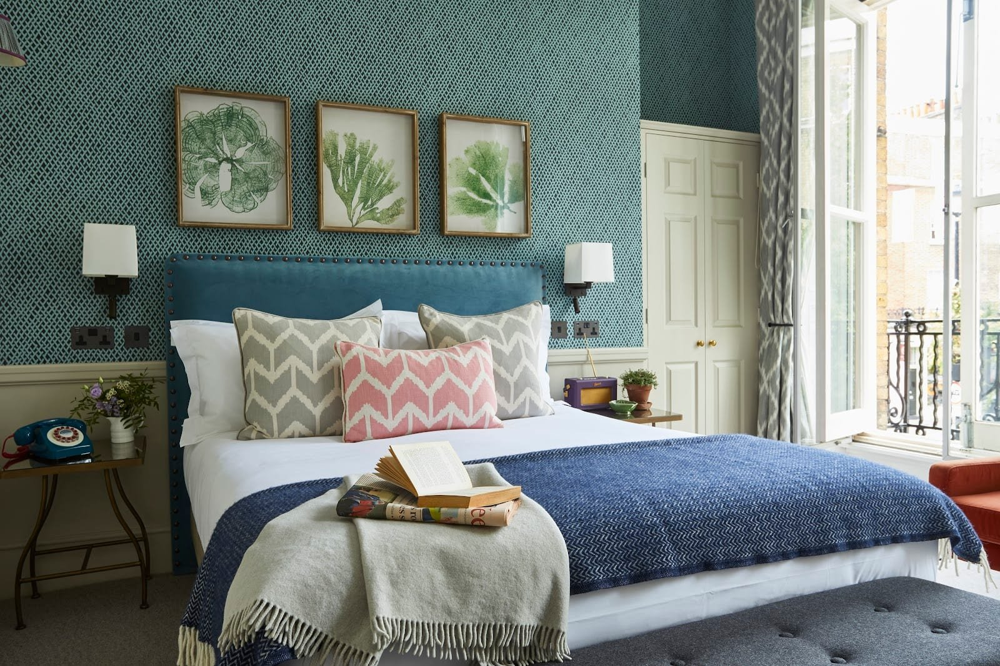

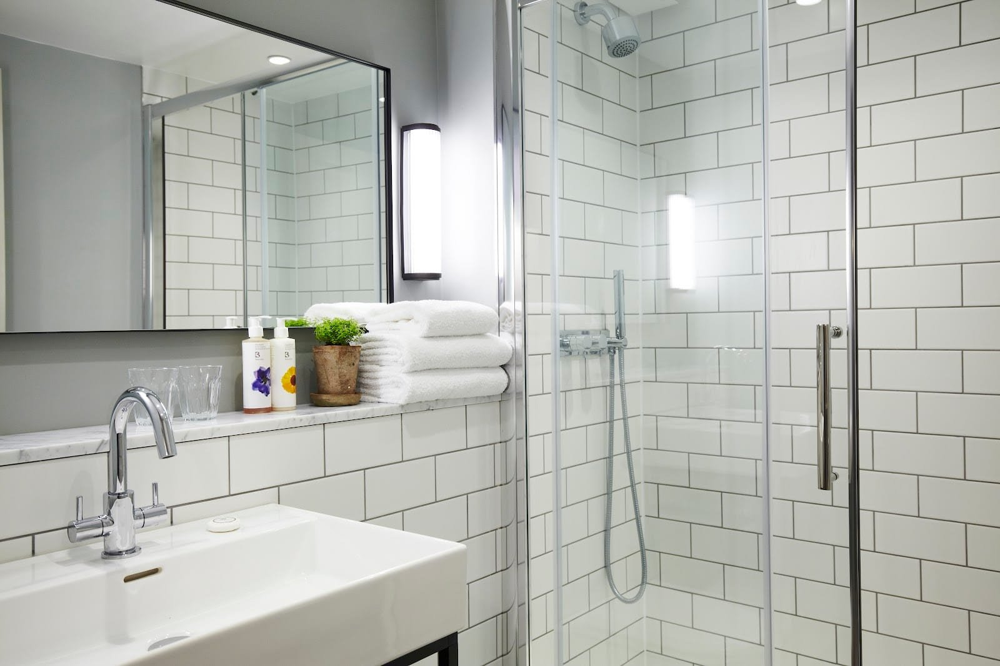

*A double with French windows onto a balcony, and a walk-in shower rather than a bath.*

### Premier Inn London Victoria: air conditioning and family rooms

*82–83 Eccleston Square, off Gillingham Street, SW1V 1PS · Near Victoria station*

**[Premier Inn London Victoria](https://www.premierinn.com/gb/en/hotels/england/greater-london/london/london-victoria.html)** is in a Grade II-listed building on Eccleston Square. Every room is air-conditioned, it sells family rooms, and the Premier Plus rooms add a mini-fridge and coffee machine. There is no car park.

*A bath with a shower over it, behind a curtain.*

### The July London Victoria: a kitchen in every apartment

*££ · Vauxhall Bridge Road, SW1V 1BB · Victoria 2 min*

**[The July](hotel:the-july-london-victoria)** is an apartment hotel where even the 19 to 22 square metre Studio has a full kitchen. The **Family Apartment is 47 to 51 square metres for two adults and two children**; the cheaper Cosy Family Apartment is two small apartments joined by a private hallway, not one big room. There is a wheelchair-accessible apartment with a lowered kitchen, and the building has a gym, sauna and cold room.

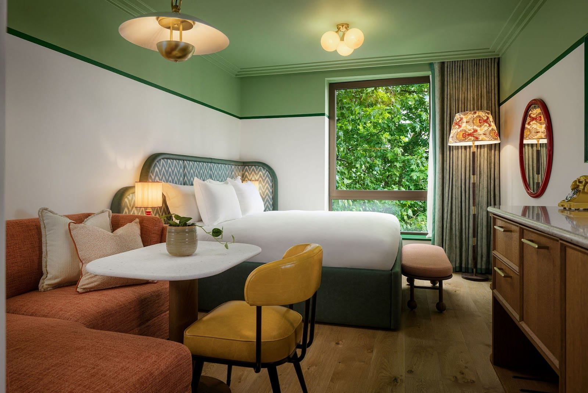

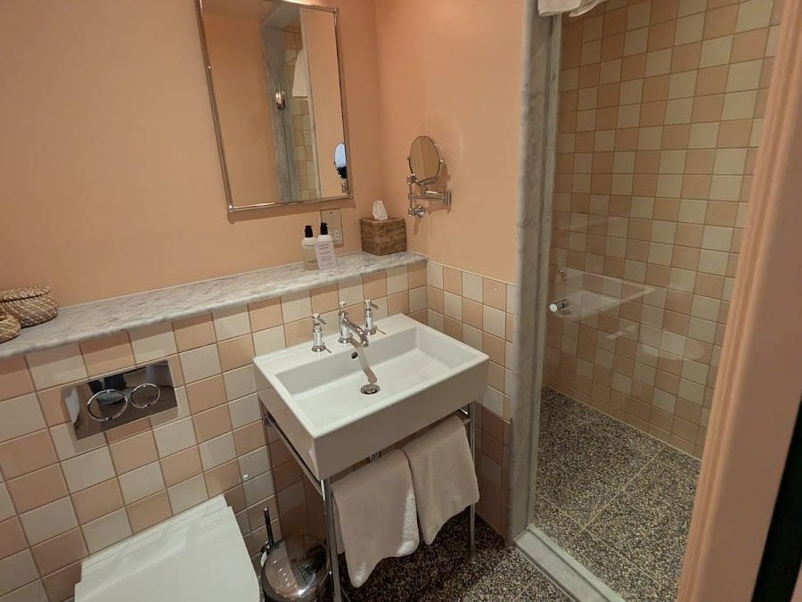

*A banquette and table for eating in the room, by a window onto trees, and a walk-in shower.*

### The Resident Victoria: a mini-kitchen in 73 rooms

*££ · 10 Palace Place, SW1E 5BW · Victoria a few minutes*

**[The Resident Victoria](hotel:the-resident-victoria)** is on a side street off Palace Street, between the station and Buckingham Palace. Each of its 73 rooms has a concealed mini-kitchen with a microwave, sink, kettle and fridge, and the hotel will stock the fridge with groceries if you order 24 hours ahead. **Doubles are 16 square metres**; the 23-square-metre Superior King takes a rollaway for a third person.

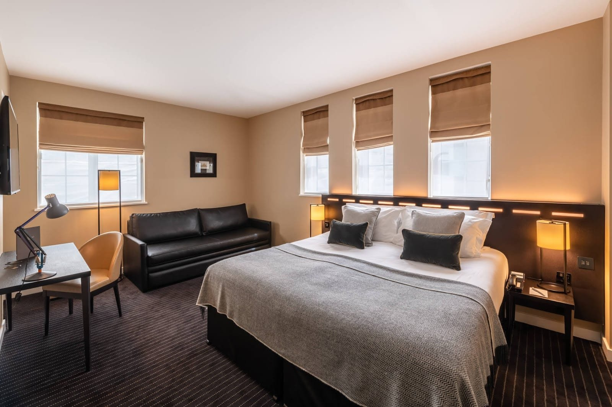

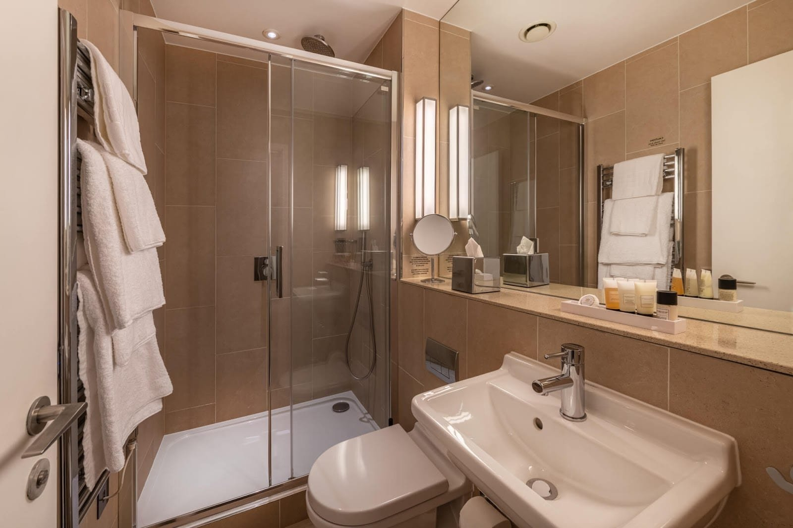

*A room with a sofa and windows on two walls; the shower sits behind sliding glass doors.*

### The Rubens at the Palace: opposite the Royal Mews

*About £230 · 39 Buckingham Palace Road, SW1W 0PS · Victoria 5 min · Breakfast extra*

**[The Rubens](hotel:the-rubens-at-the-palace)** faces the Royal Mews of Buckingham Palace and sells family rooms, and **children under 12 eat free with a full-paying adult**. The restaurants are The English Grill and The Curry Room, and afternoon tea is served in the Palace Lounge. Our [family hotels guide](/articles/best-family-hotels-london/) covers what it does for children.

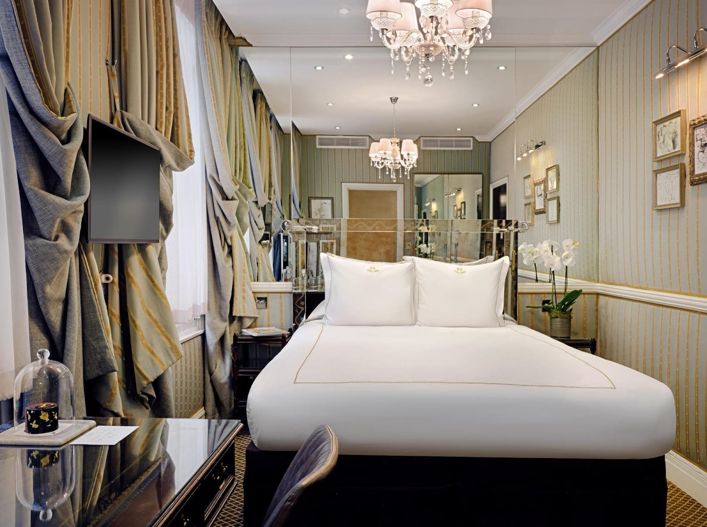

*A narrow double in the hotel's traditional style, with a mirrored wall behind the bed.*

### Hotel 41: 28 rooms and a guests-only lounge

*41 Buckingham Palace Road, SW1W 0PS · Victoria 5 min*

**[Hotel 41](hotelscom:h899176)** is the Rubens' small sister at No. 41, in the same Red Carnation group: **28 rooms and suites** decorated in black and white, and a lounge and dining room open only to residents, where food is laid out daily until late alongside a help-yourself ice-cream fridge.

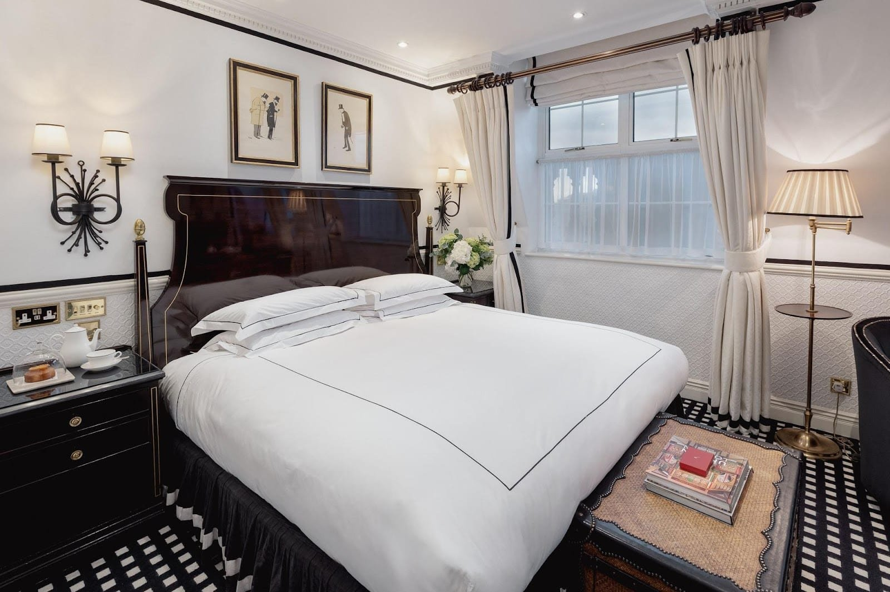

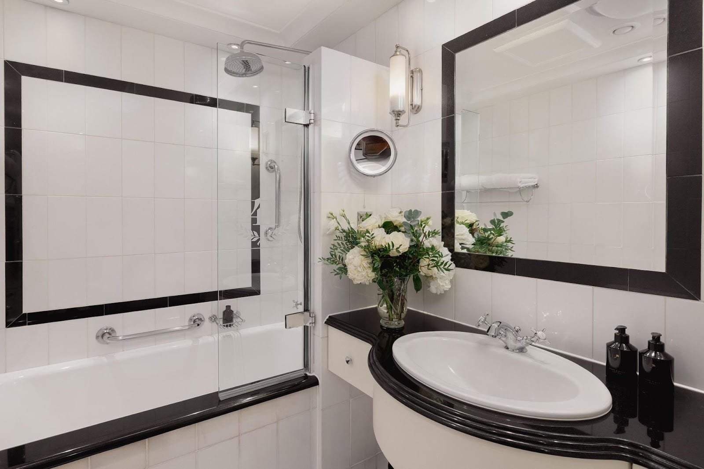

*Black and white down to the carpet, and a bath with a rain shower over it.*

### The Goring: family-owned, by Buckingham Palace

*About £600 · 15 Beeston Place, SW1W 0JW · Victoria 5 min · Breakfast extra*

**[The Goring](hotel:the-goring)** has been run by the same family for four generations since it opened in 1910, and Buckingham Palace is ten minutes' walk. The draw is **the garden behind it**, which the Deluxe Garden View rooms overlook, and afternoon tea on The Veranda (in our [afternoon tea guide](/articles/best-afternoon-tea-london/)). It sells interconnecting family rooms and small Classic rooms for one person.

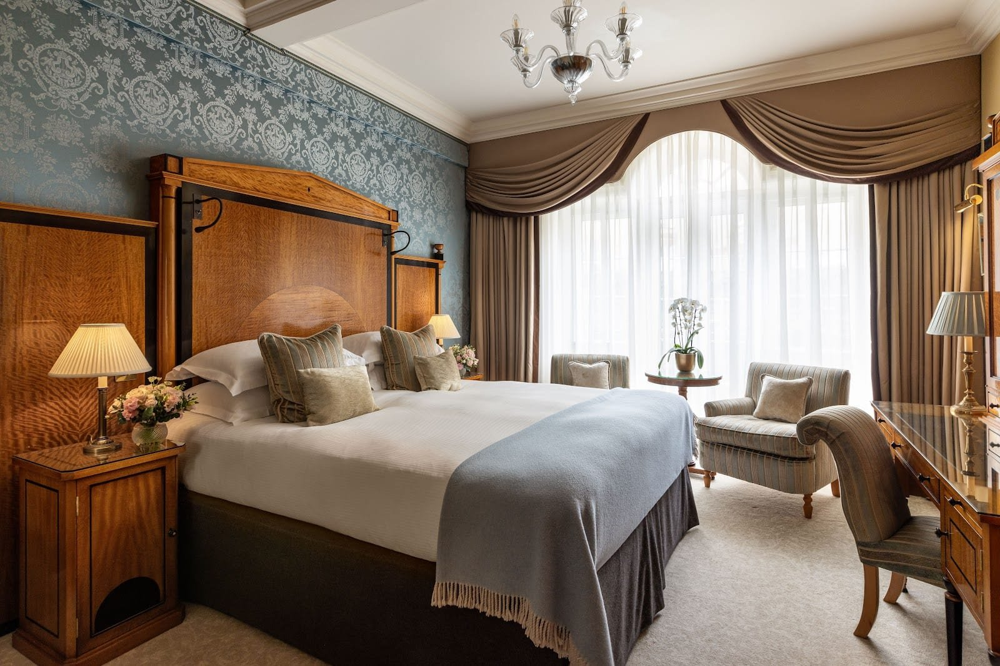

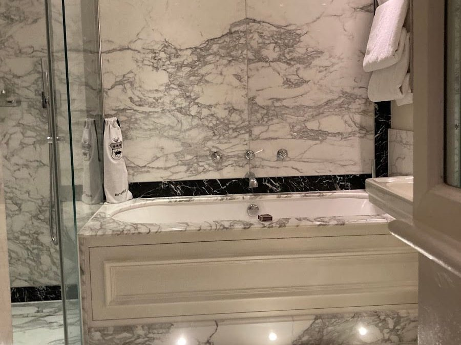

*A room with armchairs in the window, and a marble bathroom with a bath and a separate shower.*

## Pimlico: the B&B streets

### Astor Victoria: dorms, if you are 18 to 39

*Dorms from £18, twins from £99 · 73 Belgrave Road, SW1V 2BG · Pimlico nearest*

**[Astor Victoria](hotel:astor-victoria)** is a hostel with 4- to 15-bed dorms, female-only rooms and private twins. **Shared dorms take only guests aged 18 to 39**, so older travellers and families need a twin. Lockers, towels and breakfast cost extra, there is a guest kitchen, and bags are stored free on arrival. Our [hostels guide](/articles/best-hostels-london/) compares it with the rest.

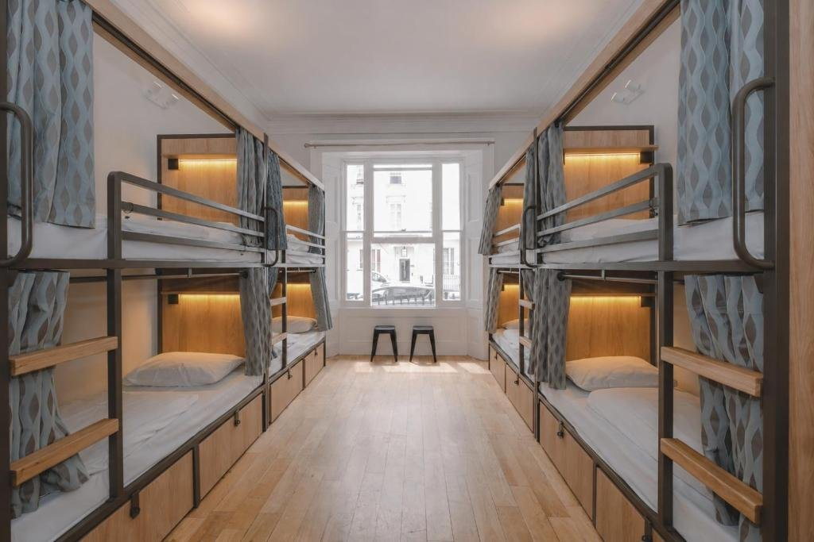

*A dorm: every bunk has its own curtain and reading light, with drawers under the bottom beds.*

### Luna Simone Hotel: family-run since 1970, breakfast included

*47–49 Belgrave Road, SW1V 2BB · Victoria 10–15 min, Pimlico closer · No lift*

**[Luna Simone](hotelscom:h888733)** was opened by the Desira family in 1970 and is run by the founder's two sons. Rooms go from singles to quads, all with their own bathrooms, and a cooked breakfast is served from 7am to 9am. **There is no lift and no air conditioning.** The 24 bus stops outside and runs to Westminster Abbey, Parliament and Trafalgar Square. Check-out is 10am.

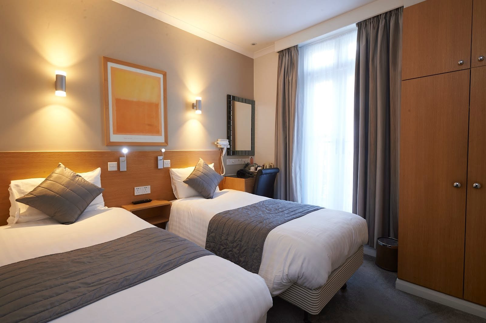

*A twin: two single beds, a built-in wardrobe and a tall window.*

### The Windermere Hotel: the Pimlico B&B with a lift

*142–144 Warwick Way, SW1V 4JE · Victoria about 10 min*

**[The Windermere](hotelscom:h854775)** fills Victorian townhouses built around 1857. It **has a lift**, though some rooms are a few steps from it, and breakfast is served in its own brasserie, The Pimlico Grid, which non-residents use too.

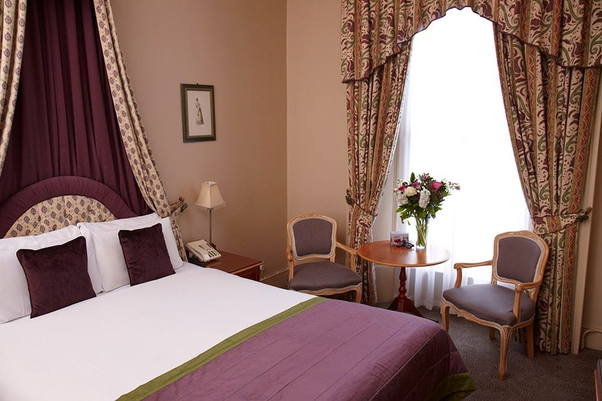

*A double with a fabric canopy over the bed and a table for two in the window.*

### The Georgian House Hotel: the wizard rooms

*About £140 · 35–39 St George's Drive, SW1V 4DG · Victoria 8 min · No lift*

**[The Georgian House](hotel:georgian-house-wizard-chambers)** is a Grade II-listed family-run hotel whose lower ground floor holds the **Wizard Chambers**, themed bedrooms with four-poster beds reached down a candlelit passage. Book them by name, or you get an ordinary room. **There is no lift and no air conditioning** (each room has a fan), and the quad rooms are up stairs. Our [Harry Potter guide](/articles/harry-potter-london/) covers its wizard afternoon tea.

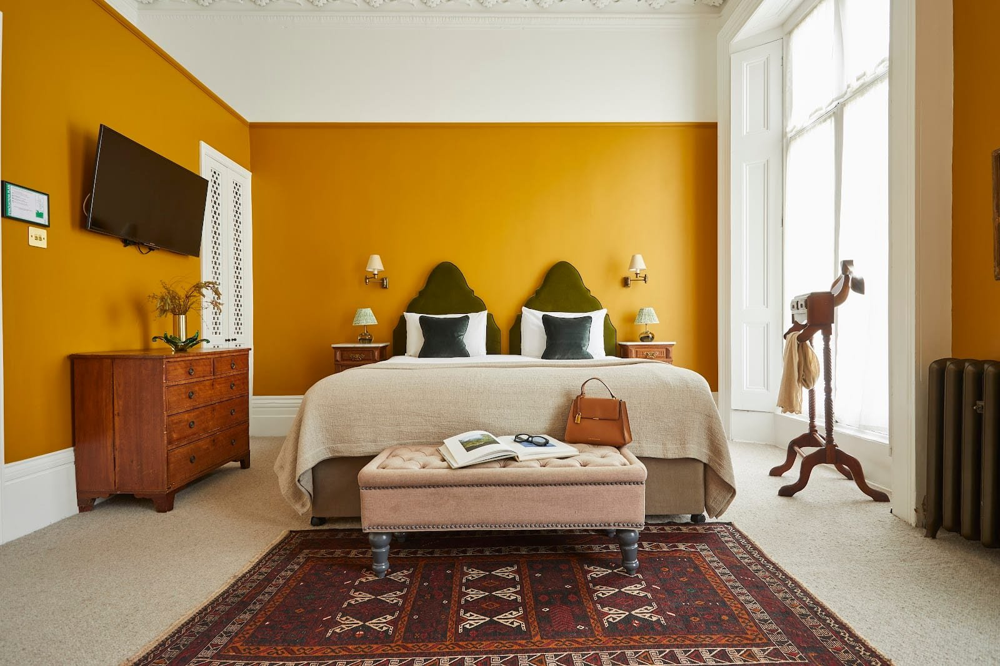

*One of the ordinary rooms, not a Wizard Chamber: period furniture, a high ceiling and a tall sash window.*

### Artist Residence London: ten rooms over a neighbourhood restaurant

*52 Cambridge Street, SW1V 4QQ · Victoria and Pimlico about 10 min*

**[Artist Residence](hotelscom:h11266201)** is a **ten-bedroom** Pimlico townhouse above The Cambridge Street, its all-day neighbourhood café and restaurant, with a cocktail bar. Rooms have air conditioning, breakfast is usually extra, and dogs are welcome in some rooms. Late check-out costs £20 an hour.

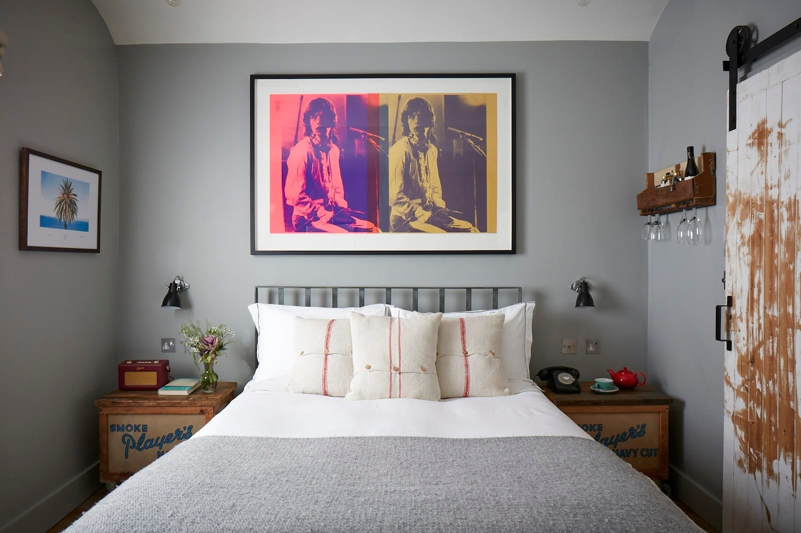

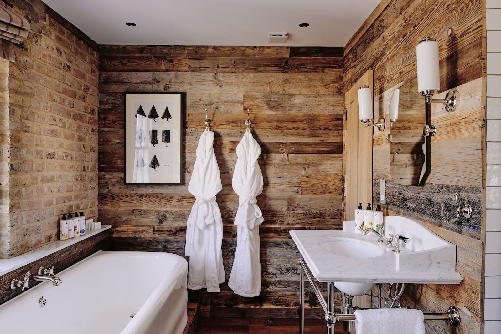

*Crates for bedside tables and a sliding barn door; the bathroom, in reclaimed timber and bare brick, has a bath.*

## Westminster and St James's Park

### hub by Premier Inn London Westminster Abbey: 11-square-metre rooms by the Abbey

*21 Tothill Street, SW1H 9LL · St James's Park nearest*

**[hub Westminster Abbey](https://www.premierinn.com/gb/en/hotels/england/greater-london/london/hub-london-westminster-abbey.html)** is Premier Inn's small-room brand: **Standard rooms are 11 square metres** with a double bed, Bigger rooms 14 with a king. The two Interior grades **have no windows**. There is no car park.

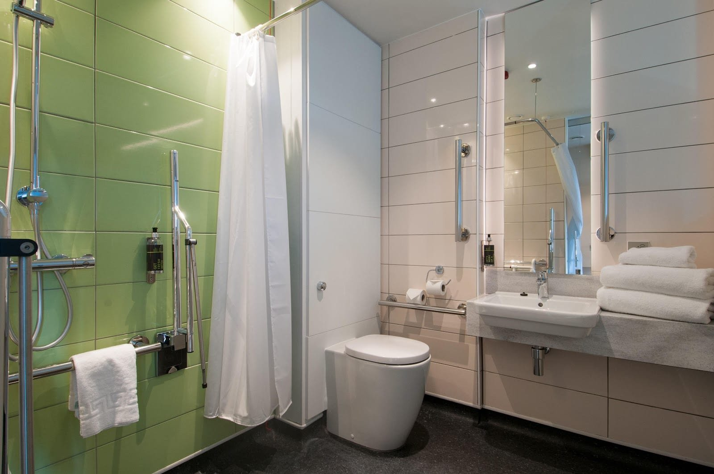

*hub's own photo of the wet room in its accessible rooms, which have a level-floor shower with a folding seat and grab rails.*

### The Sanctuary House Hotel: rooms over a pub, breakfast included

*££ · 35 rooms · 33 Tothill Street, SW1H 9LA · Big Ben a few minutes*

**[The Sanctuary House](hotel:the-sanctuary-house-hotel)** is 35 rooms above a Fuller's pub in a 19th-century building on Tothill Street. **Every rate includes breakfast**, served downstairs from 7am on weekdays and 8am at weekends. There is a lift and air conditioning, and the Deluxe Family room has a king bed and a sofa bed.

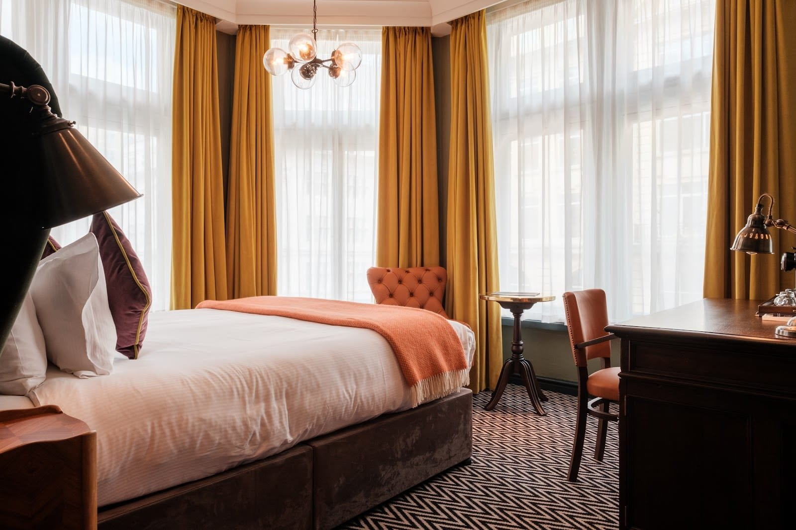

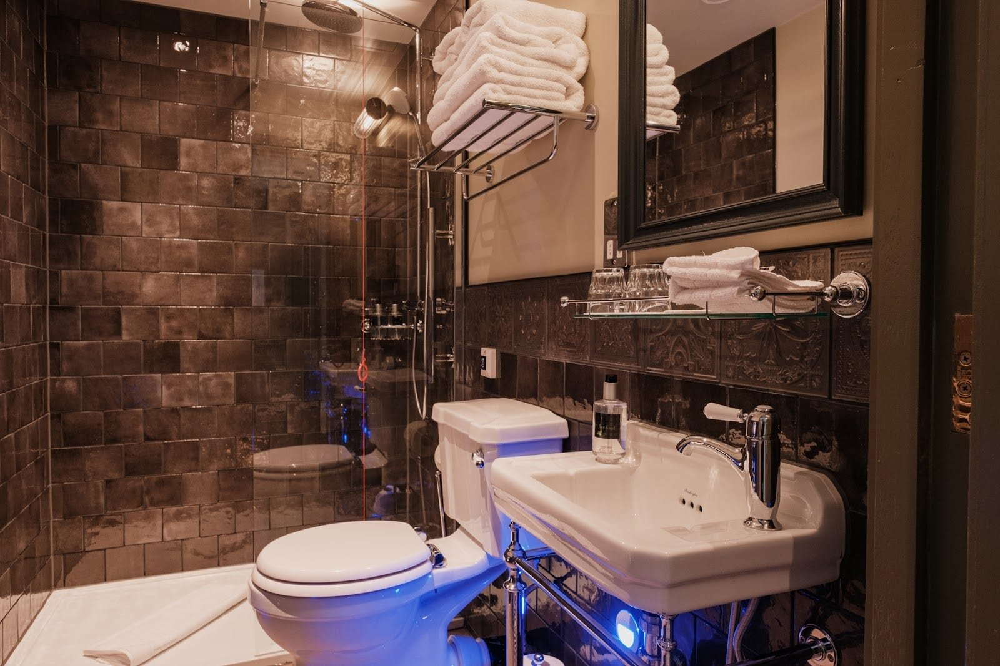

*A bay-windowed double, and a walk-in shower rather than a bath.*

### St Ermin's Hotel: family suites off a courtyard

*About £220 · Caxton Street, SW1H 0QW · St James's Park 100 m · Breakfast extra*

**[St Ermin's](hotel:st-ermins-hotel)** is set back from Caxton Street at the end of a tree-lined courtyard. Superior Doubles are 16 to 18 square metres; for a family, **the Family Room sleeps five in 36 square metres and the Family Suite up to six in 45**. A rooftop kitchen garden and bee terrace supply the Caxton restaurant, and some rooms take pets.

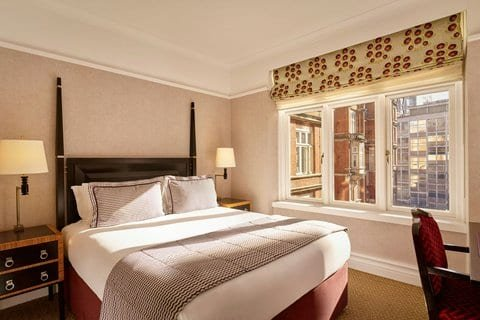

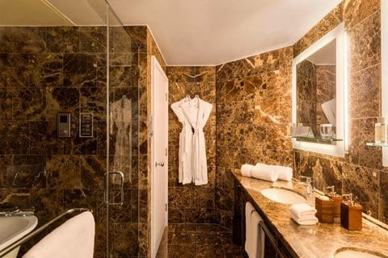

*A double with a window onto red-brick buildings, and a marble bathroom with twin basins.*

### The Guardsman: apartments with kitchens, off Buckingham Gate

*££££ · 1 Vandon Street, SW1H 0AH · St James's Park 2 min · Buckingham Palace 6 min*

**[The Guardsman](hotel:the-guardsman)** is a small five-star on a side street off Buckingham Gate. Alongside its rooms, including singles, it has **six residences of one to three bedrooms**, each with a kitchen and dining area. Booking direct at the best available rate includes breakfast. Dogs are welcome.

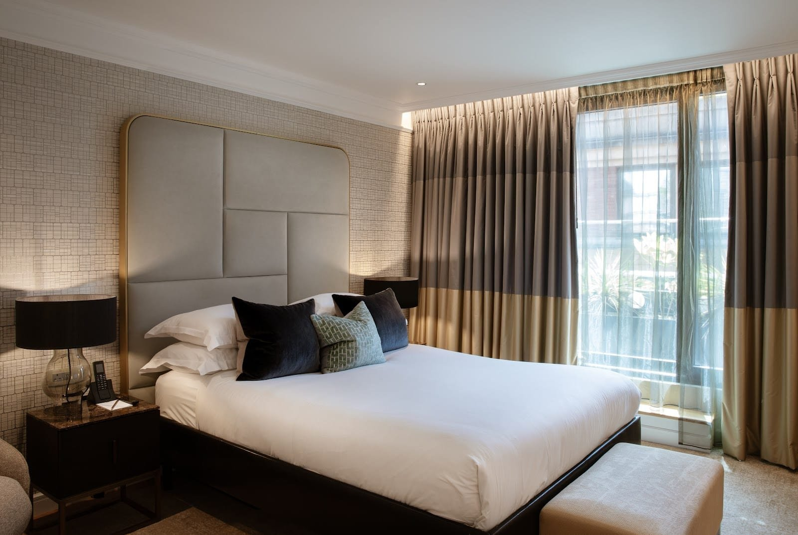

*A double with a full-height window and a headboard in panels of grey leather.*

### St. James' Court, A Taj Hotel: eight Victorian houses round a courtyard

*£££ · 329 rooms · 54 Buckingham Gate, SW1E 6AF · Buckingham Palace 5 min*

**[St. James' Court](hotel:st-james-court)** is eight red-brick townhouses of 1897 built around a courtyard with a Victorian fountain and a carved brick frieze. It has 329 rooms, four restaurants including Quilon and House of Ming, and a spa. Three of the eight houses are a separate Taj property, **Taj 51 Buckingham Gate Suites and Residences**, so check which one you are booking.

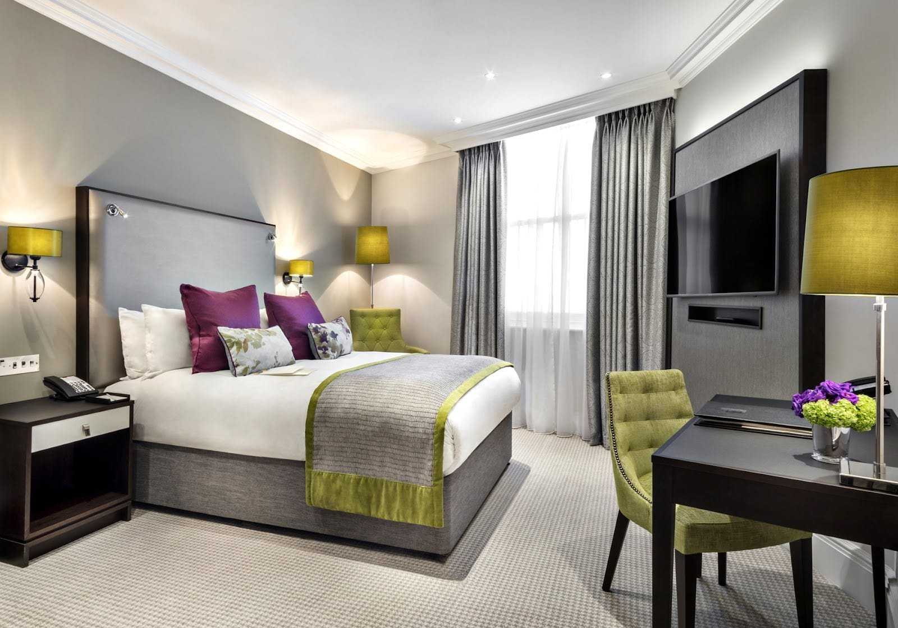

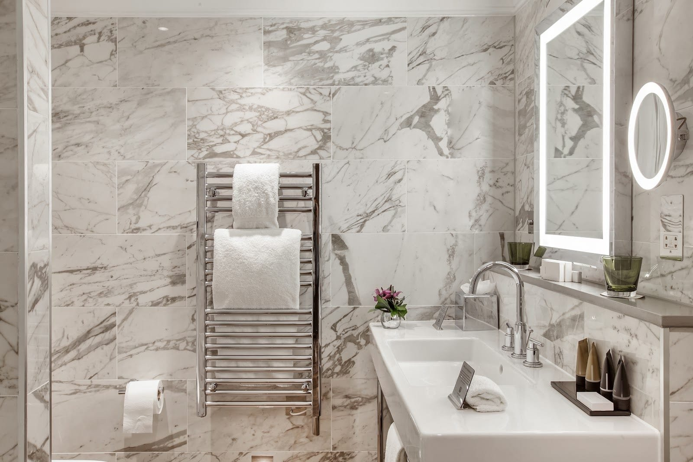

*A double in grey and lime, and a white marble bathroom.*

### Conrad London St. James: between the park and the Abbey

*£££ · 22–28 Broadway, SW1H 0BH · St James's Park 1 min*

**[Conrad London St. James](hotel:conrad-london-st-james)** is Hilton's Conrad brand on Broadway, between St James's Park and Westminster Abbey, a minute from St James's Park station. Hilton Honors points apply.

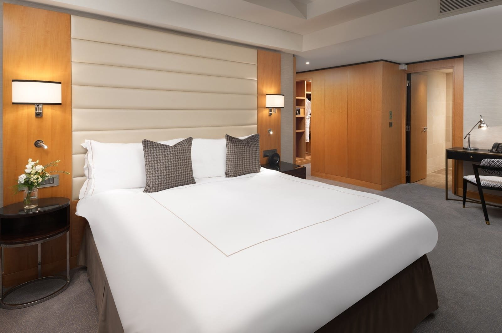

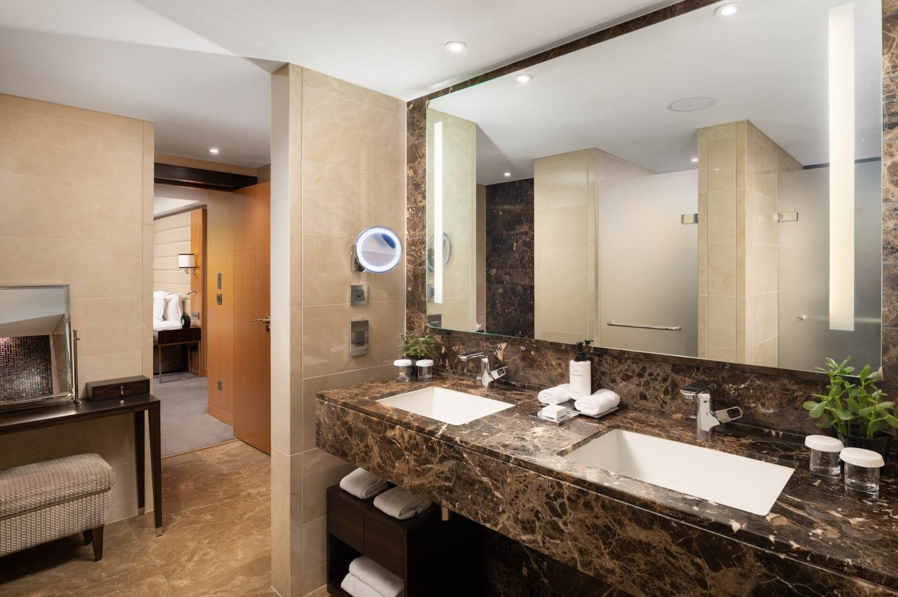

*A room with a walk-in wardrobe, and a bathroom with twin basins in brown marble.*

## Whitehall and Trafalgar Square

### The Trafalgar St. James: on the square

*£££ · 2 Spring Gardens, SW1A 2TS · Charing Cross 3 min*

**[The Trafalgar St. James](hotel:the-trafalgar-st-james)** is a Hilton Curio Collection hotel on the corner of Trafalgar Square. Trafalgar Queen rooms are 28 square metres, and **the Nelson room has two queen beds for up to four adults in 35**. The Landseer Suite looks over Nelson's Column. The newer Spring Garden Suites are on the quiet side, some opening onto an underground garden, and Rockwell Bistro & Wine Bar is at street level.

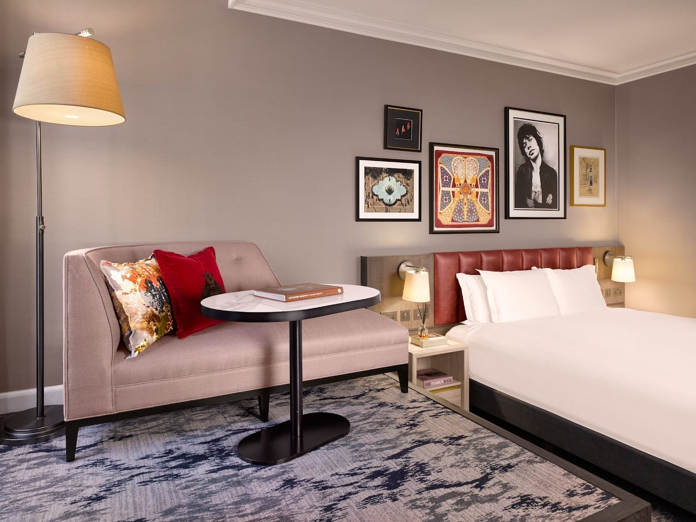

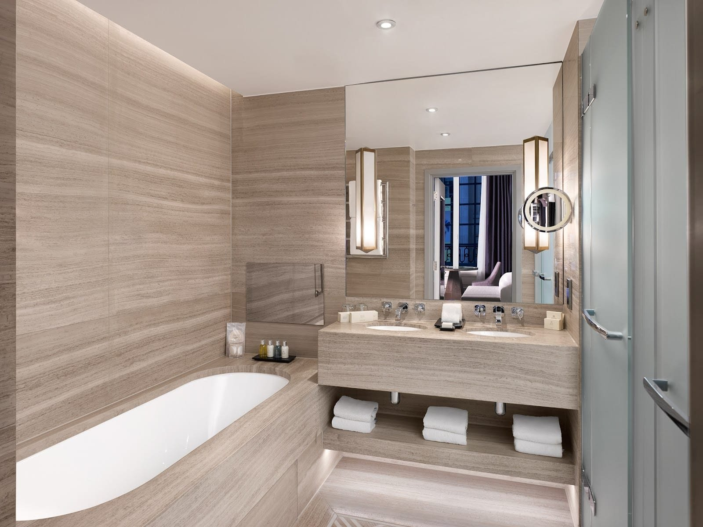

*A room with a chaise and a gallery wall of prints, and a stone bathroom with a bath and a separate shower.*

### Corinthia London: big rooms and a spa pool

*About £750 · 279 rooms · Whitehall Place, SW1A 2BD · Embankment nearest · Breakfast extra*

**[Corinthia](hotel:corinthia-london)** sits between Whitehall and the river, with 279 rooms of which 62 are suites and seven penthouses. The entry-level Deluxe room averages **39 square metres** and can connect to a second. Its spa, Biome, has a **swimming pool**, sauna and steam rooms and a 24-hour gym, with children's pool hours of 8–10am and 4–5pm. Tom Kerridge runs Kerridge's, and tea is served under a Baccarat chandelier.

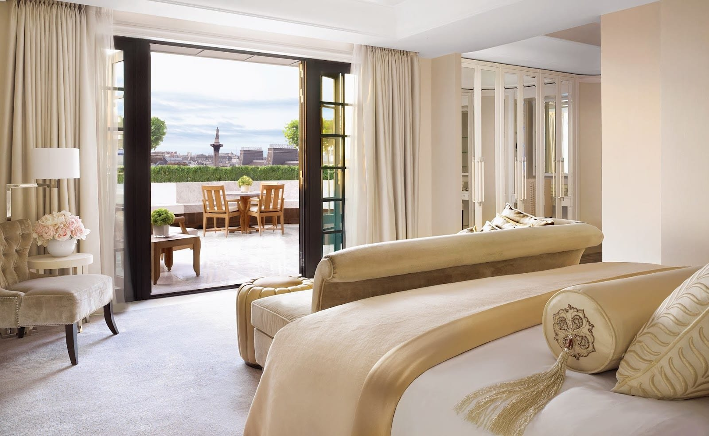

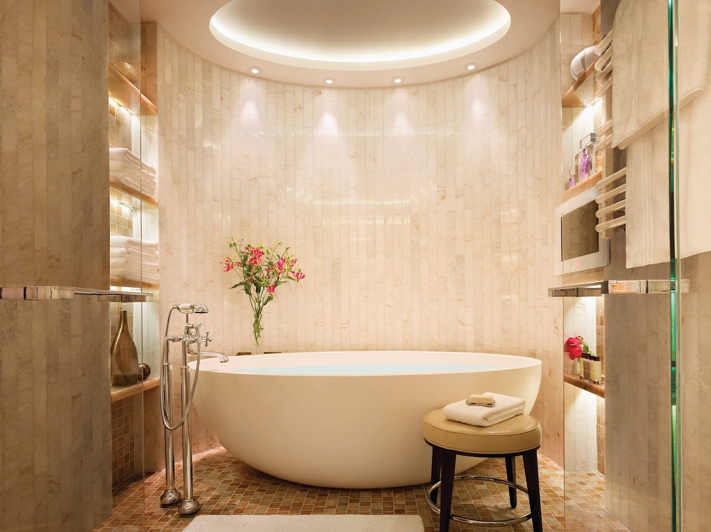

*Both photos show a suite, not the entry-level Deluxe room: a roof terrace looking to Nelson's Column, and a freestanding bath.*

### Raffles London at The OWO: the Old War Office

*About £900 · 120 rooms · 57 Whitehall, SW1A 2BX · Opposite Horse Guards · Breakfast extra*

**[Raffles at The OWO](hotel:raffles-london-owo)** is the Old War Office, where Churchill worked, converted into **120 rooms and suites with butler service**. It has nine restaurants and three bars, including a Mauro Colagreco restaurant and the Spy Bar (Tuesday to Saturday, 5pm to 1am), a Guerlain spa, and a Secrets & Spies afternoon tea that can be paired with a tour of the building.

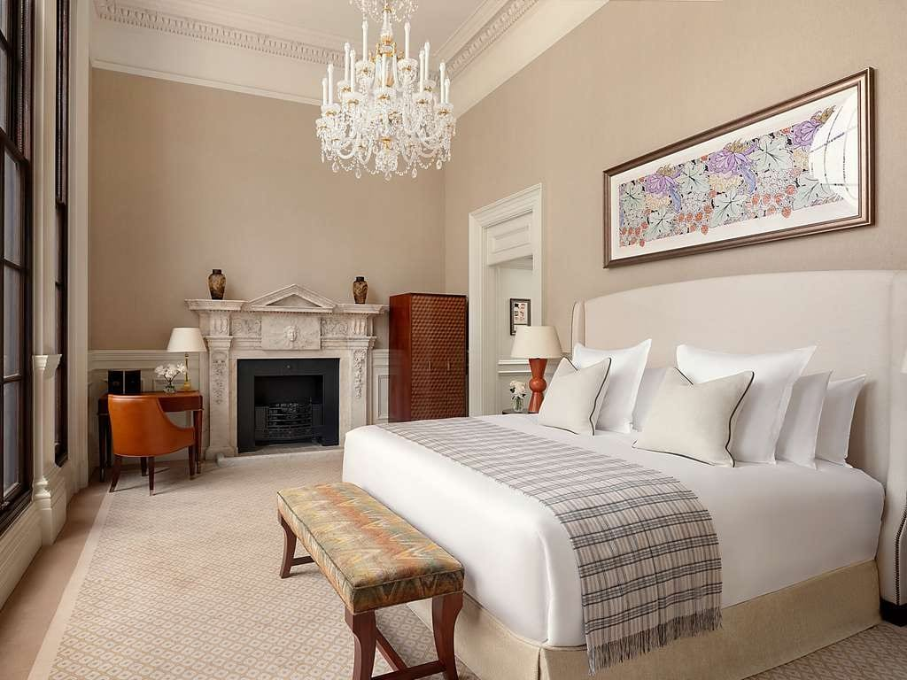

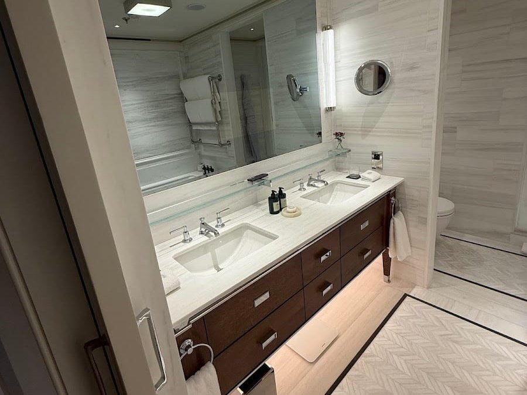

*A room with a carved marble fireplace and a high ceiling, and twin basins in the bathroom.*

## St James's

### Sofitel London St James: French, by Piccadilly Circus

*£££ · 6 Waterloo Place, SW1Y 4AN · Piccadilly Circus 5 min · Check-in 3pm, out noon*

**[Sofitel St James](hotel:sofitel-london-st-james)** fills a Grade II-listed neoclassical building on Waterloo Place, at the foot of Regent Street. Anthony Demetre runs Wild Honey St James and its bistro, the Rose Lounge serves afternoon tea, and the spa runs over three floors. **Pets are not accepted.**

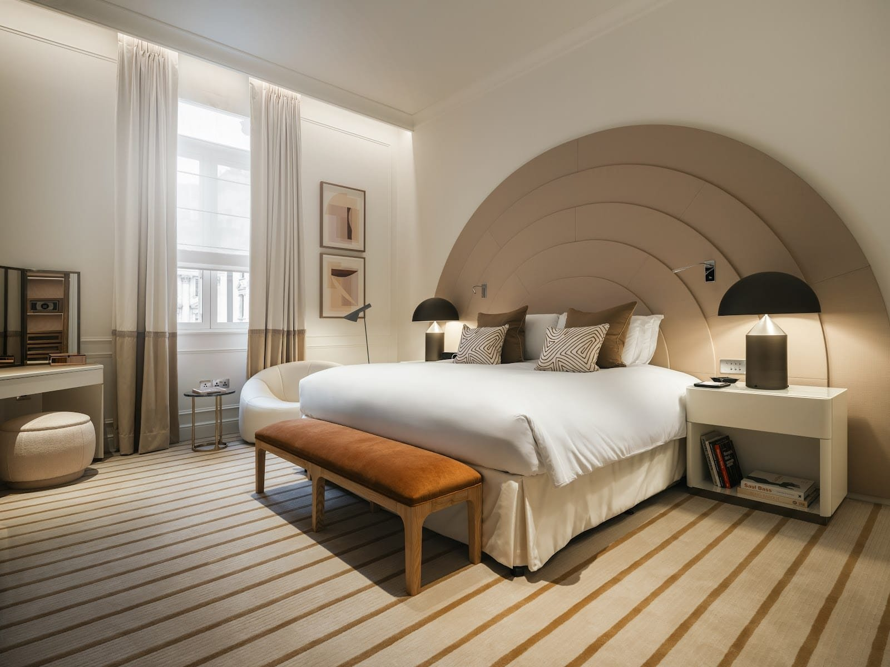

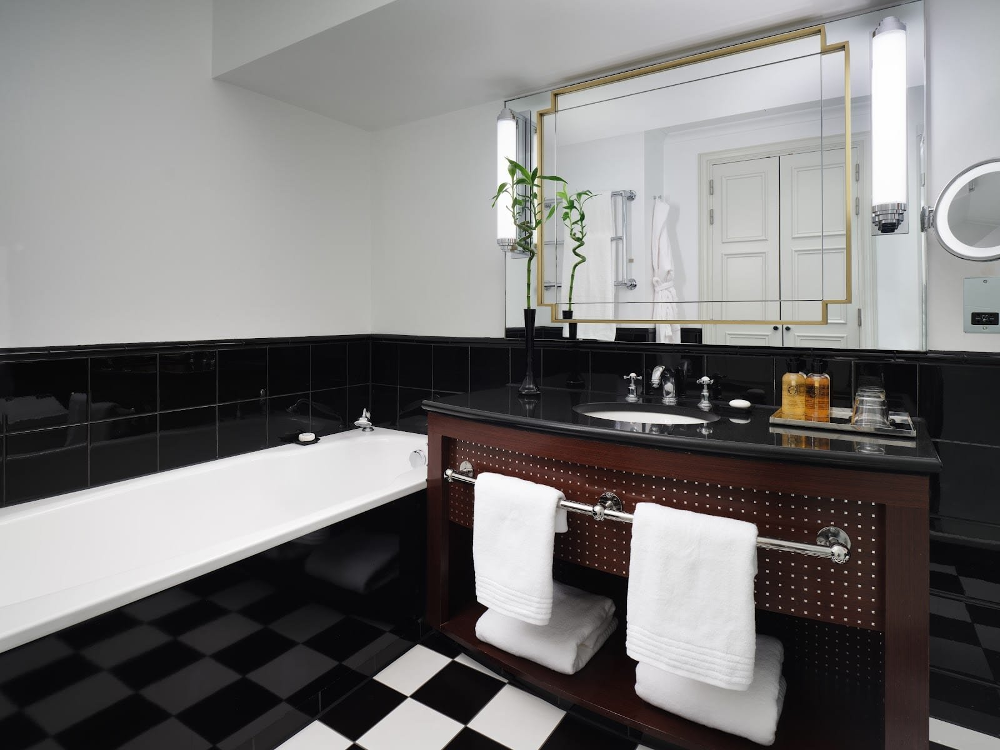

*A room with a huge semicircular headboard, and a black-and-white tiled bathroom with a bath.*

### The Stafford London: three buildings and the American Bar

*££££ · 16–18 St James's Place, SW1A 1NJ · Green Park nearest*

**[The Stafford](hotel:the-stafford-london)** is on St James's Place, off St James's Street, and it is three buildings: the Main House, the Mews House and **the Carriage House, 13 rooms in former stables**. Ask which you are in. The American Bar and Michael Caines' restaurant are downstairs, and the wine cellars, air-raid shelters in the Second World War, keep a small museum. It sells family suites and interconnecting rooms. Dukes London, on the same street, is closed while it is refurbished, though Dukes Bar stays open.

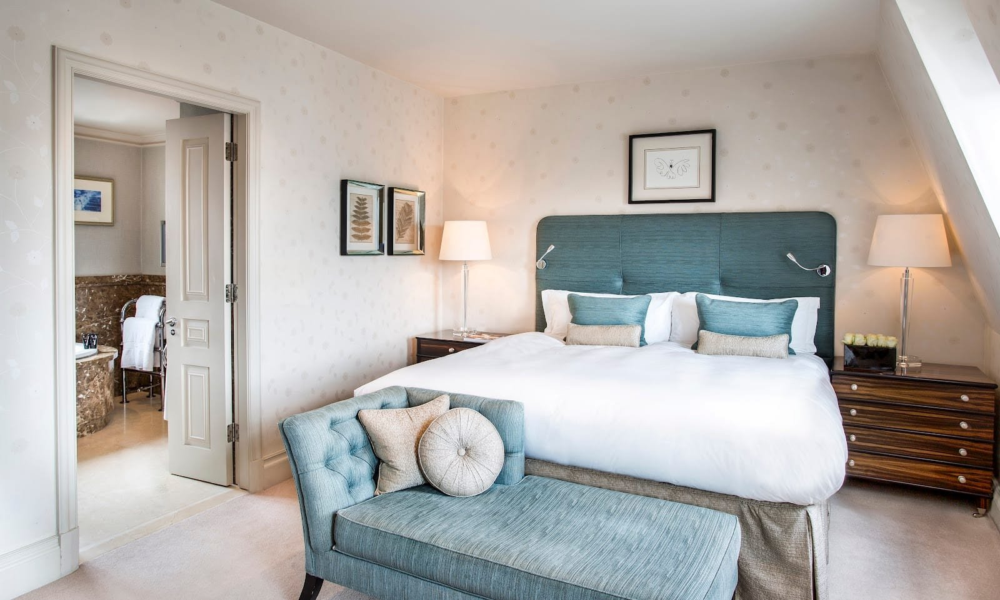

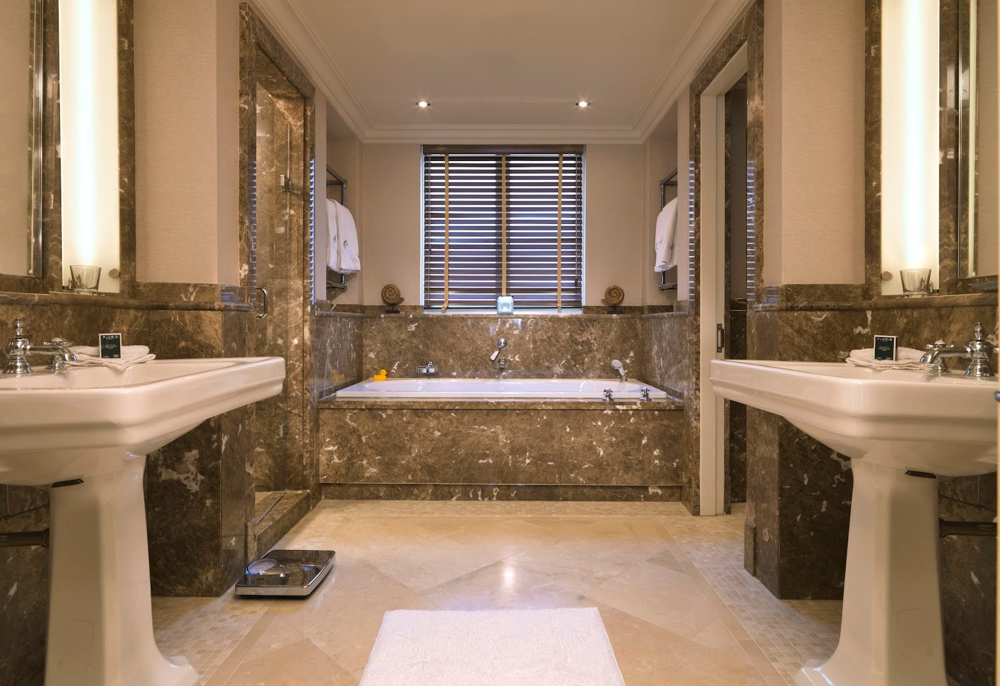

*A room under the eaves, and a marble bathroom with two basins, a bath and a separate shower.*

## If none of these fits

**Mayfair**, across Piccadilly, has The Ritz, Brown's and a £90 underground room: see our [Mayfair stay guide](/articles/where-to-stay-mayfair/). **The South Bank**, over Westminster Bridge, has the County Hall hotels and livelier evenings: see our [South Bank stay guide](/articles/where-to-stay-south-bank/). For restaurants and theatres on the doorstep, compare the [Covent Garden](/articles/where-to-stay-covent-garden/) and [Soho and West End](/articles/where-to-stay-soho-west-end/) guides, and [best areas to stay in London](/articles/best-areas-to-stay-in-london/) sets all of them side by side.

## Getting in and out

**Victoria** is on the Victoria, District and Circle lines, **St James's Park** on the District and Circle, **Westminster** on the Jubilee, District and Circle, **Pimlico** on the Victoria, **Green Park** on the Piccadilly, Victoria and Jubilee, and **Charing Cross** and **Embankment** on the Northern and Bakerloo, with Embankment adding the District and Circle.

**Gatwick**: Southern trains reach Victoria in 32 to 40 minutes for £10.70 off-peak; the Gatwick Express takes about 31 minutes for £24.10. Our [Gatwick guide](/articles/gatwick-airport-to-london/) compares them.

**Heathrow**: take the Piccadilly line to Green Park, one stop from Victoria on the Victoria line and one from Westminster on the Jubilee, or a National Express coach to Victoria Coach Station. Our [Heathrow guide](/articles/heathrow-airport-to-london/) has the options.

**The rail terminals**: Victoria is its own terminus, Waterloo is ten minutes' walk over Westminster Bridge, and King's Cross St Pancras and Euston are direct from Victoria on the Victoria line.

*Typical nightly rates for a double, checked September 2026; rates for The Z Hotel Victoria are from five nights we priced between October 2026 and April 2027. Rail fares as of September 2026.*
