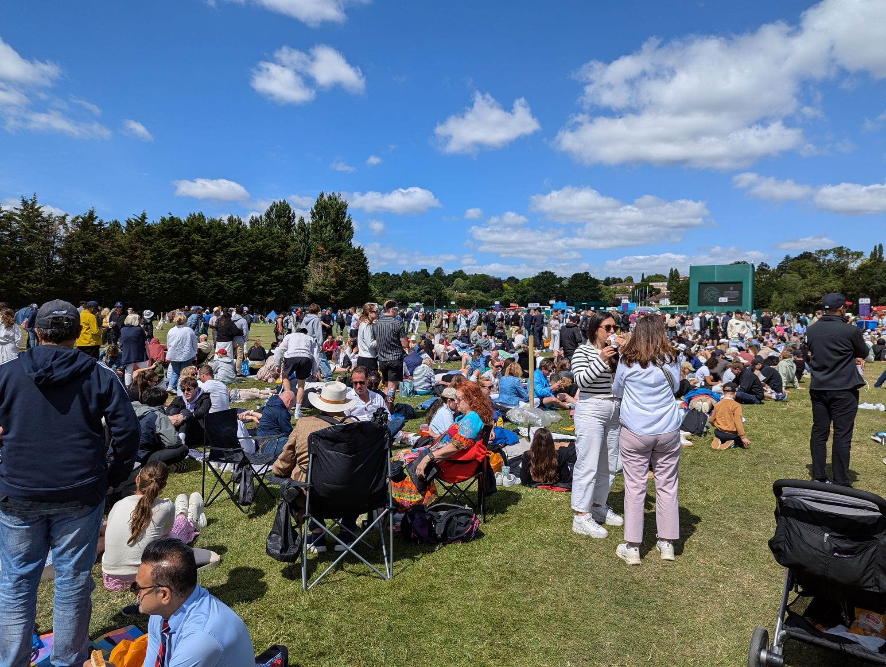
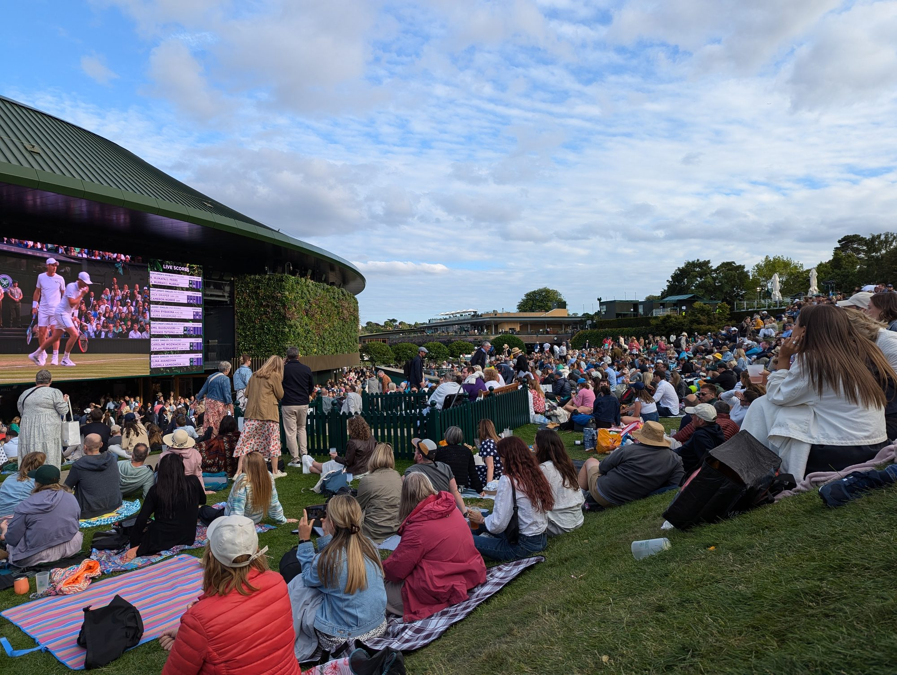

Wimbledon is the only Grand Slam where you can still turn up on the day, pay face value and sit on Centre Court. It is also the hardest tennis ticket in the world to buy in advance.

There are a small number of legitimate ways in, and the All England Club controls every one of them. Everything else — the resale sites, the "guaranteed Wimbledon tickets" ads, the man outside Southfields station — sells you a ticket that is void on arrival.

**The Championships 2027 run from Monday 28 June to Sunday 11 July 2027.** Of the two advance ballots for those tickets, one has already gone: the **LTA opt-in closed at 23:59 on 31 August 2026**. The free **AELTC Public Ballot** is the one still to come, and it opens in early September.

> 💡 **The Short Version:** Enter the **AELTC Public Ballot** — it is free, open to anyone in the world, and opens in **early September**. There is also a **second, separate LTA draw that anyone over 18 can enter for £25 a year**, and you can enter both — but for 2027 **its opt-in closed on 31 August 2026**, so joining now is a plan for 2028. Win that one and **you choose your day and court**, which the public ballot never lets you do. If you miss both, **The Queue** sells **500 tickets each** for Centre, No.1 and No.2 Court every morning at face value, plus thousands of **Grounds Passes from £21**. Once inside, **Ticket Resale** from **3pm** puts Centre Court seats on sale for **£15**. And if you cannot face a 4am start, **arriving after 4pm** gets you in with barely a wait, for tennis that can run to **11pm**. Everything else is hospitality, debentures, or a scam.

---

## The dates you need for 2027

| What | When | Notes |
| --- | --- | --- |
| **LTA ballot opt-in closes** | **23:59, Mon 31 August 2026** | Opened 23 July. Needs LTA Advantage membership — **£25 a year, open to any adult**, or free via a club |
| **Public Ballot opens** | **Early September 2026** (expected) | The 2026 ballot opened Tue 2 Sept 2025. AELTC emailed members on 27 Aug 2026 to say it "opens soon" |
| **Public Ballot closes** | Two to three weeks later | The 2026 ballot closed at **23:59 BST** on Sun 21 Sept 2025 — a hard deadline |
| **LTA ballot draws** | September to November 2026 | Winners contacted through the balloting period |
| **Public Ballot results** | **From October 2026** | Offers arrive by email, with a strict payment deadline |
| **Qualifying** | The week before The Championships | Community Sports Centre, Roehampton — tickets from **£20** |
| **The Queue opens** | **2pm the Sunday before Day 1** | 2pm on Sun 27 June 2027, if 2026's pattern holds |
| **The Championships** | **Mon 28 June – Sun 11 July 2027** | Confirmed by the AELTC |

> ⚠️ **Do the myWimbledon step today, not when the ballot opens.** Signing up for a myWimbledon account is *not* the same as entering the ballot, but you cannot enter without one — and you will not be told the ballot has opened unless you have ticked **'Championships tickets, including the Wimbledon Public Ballot'** in the Email Consents and Preferences section of your profile. Add `info@championships.aeltc-email.com` to your safe senders while you are there; the AELTC's own advice is that its ballot emails routinely land in spam.

### Get the app

The official Wimbledon app is no longer optional. It holds your tickets, it is scanned when you check into The Queue and again when you buy, and it is the only way to join the Ticket Resale virtual queue inside the Grounds. Sign in with the same email as your myWimbledon account.

- **iPhone and iPad:** [Wimbledon on the App Store](https://apps.apple.com/gb/app/id319284643)
- **Android:** [Wimbledon on Google Play](https://play.google.com/store/apps/details?id=com.ibm.events.android.wimbledon)

> ⚠️ **Check your phone is new enough.** The 2026 app required iOS 18 or later, which means **iPhone XR, XS, 11 or newer** — and devices still on iOS 17 had to update even if the handset was on that list.

---

## Where the tickets actually go

**The AELTC has never published a tournament-wide breakdown** of how its 550,000 admissions divide between the ballot, the Queue, debentures, hospitality and guests — so anyone showing you a full pie chart has made it up.

The one published breakdown, reported independently by two outlets, covers **Centre Court**:

| Who gets Centre Court's 14,979 seats | Share |
| --- | --- |
| **The public** — all routes combined | **53.5%** |
| Invited guests — media, schools, overseas tennis associations | 21% |
| **Debentures** — 2,520 seats | **16.7%** |
| Corporate hospitality — 1,340 seats | 8.9% |

Debenture seats are guaranteed to their holders for all fourteen days, so 2,520 Centre Court seats across the fortnight is **35,280 seat-days** committed before a single ballot entry is drawn.

> ⚠️ **The trap: that 53.5% is not the ballot.** It is a lump that contains the Public Ballot, the LTA ballots, the Queue and the on-site resale all together. Nobody publishes how it divides. And it is Centre Court only — it tells you nothing about No.1, No.2, No.3, the outside courts or Grounds Passes, which between them account for the large majority of everyone who comes through the gates.

Two smaller slices are documented. In 2026 the AELTC's **Family Ballot** gave tickets to a record **1,000 guests from more than 50 local schools**, and a further **1,000 refugees** and their support organisations were given tickets.

---

## What a ticket costs

These are the 2026 prices as published by the AELTC. They are the same whichever route you buy through — ballot, LTA or the Queue — so expect 2027 to land close to them.

| | Days 1–2 | Days 3–4 | Days 5–6 | Days 7–8 | Days 9–10 | Day 11 | Day 12 | Days 13–14 |
| --- | --- | --- | --- | --- | --- | --- | --- | --- |
| **Centre Court** rows A–T | £115 | £135 | £175 | £220 | £255 | £300 | £300 | £350 |
| **Centre Court** rows U–Z | £105 | £120 | £160 | £195 | £225 | £265 | £265 | £305 |
| **Centre Court** rows ZA–ZF | £80 | £100 | £125 | £155 | £180 | £215 | £215 | £245 |
| **No.1 Court** rows A–Q | £100 | £125 | £160 | £200 | £235 | £110 | £110 | £65 |
| **No.1 Court** rows R–W | £90 | £110 | £145 | £170 | £210 | £100 | £100 | £55 |
| **No.1 Court** rows X–ZC | £70 | £90 | £115 | £140 | £170 | £70 | £70 | £40 |
| **No.2 Court** | £55 | £70 | £90 | £105 | £55 | — | — | — |
| **No.3 Court** | £55 | £70 | £90 | £70 | — | — | — | — |
| **Grounds Pass** | £33 | £33 | £33 | £33 | £26 | £26 | £21 | £21 |

**No.3 Court** tickets come from the ballot only. You cannot buy one in the Queue.

---

## Route 1: The Wimbledon Public Ballot

This is the ballot that needs no membership of anything, and for most people it is the main advance route. It has run since 1924, it is free to enter, and it is genuinely random — the AELTC states that it gives no preferential treatment to people who have applied for years without success. It is the main way to buy a Show Court ticket at face value months ahead.

### When it runs

It has opened in the first days of September two years running:

| Championships | Ballot opened | Ballot closed | Offers sent |
| --- | --- | --- | --- |
| **2025** | Mon 2 September 2024 | Mon 16 September 2024 | From October 2024 |
| **2026** | Tue 2 September 2025 | **23:59 BST**, Sun 21 September 2025 | From October 2025 |
| **2027** | Not yet announced | Not yet announced | **From October 2026** |

### How it works

You apply once, in a window of two to three weeks. Successful applicants are picked by an automated random selection process and offered **up to two tickets** for one specific day on one specific court.

| | |
| --- | --- |
| **Cost to enter** | Free — no entry fee and no deposit; nothing is charged unless you win and choose to pay |
| **Minimum age** | **16** — applications from anyone 15 or under are voided |
| **Applications allowed** | **One per household, per email address, per myWimbledon account** |
| **Tickets per application** | Up to **two** |
| **Courts you might be offered** | Centre Court, No.1 Court, No.2 Court or No.3 Court — **Show Courts only, never a Grounds Pass** |
| **Can you choose day, court or seat?** | **No** |
| **When you hear** | From **October**, by email |
| **How you pay** | Credit or debit card, by a fixed deadline, by the applicant only |

**Apply from your permanent home address.** The AELTC says an application from a holiday home, a business address or temporary student accommodation is invalid. Students, armed forces personnel and people in permanent houseshares are asked to contact the ticket office.

### What you actually get offered

You may be offered a pair of seats together, or **two single tickets that are not next to each other**. Wimbledon's stands have rows with odd numbers of seats, leaving hundreds of unpaired seats each day, and rather than leave them empty the club offers them as two singles — usually across an aisle, one behind the other, or a few rows apart. You can preview the exact view from both seats before you pay.

Centre Court and No.1 Court use tiered pricing by row band. None of the seats has a restricted view; the bands simply reflect how close you are to the court.

### Declining an offer

> ⚠️ **Declining your offer ends your ballot for that year.** If you turn down the day, court or seats you are given, you cannot change your mind, you will not be offered anything else, and you are out of the Public Ballot for that Championships. The same applies if you accept and later request a refund. There is no swapping for a different day, court or year.

If you are offered two tickets but only want one, you have to ask the AELTC to amend the offer **before** you pay. And only the original applicant can make the payment — you cannot have someone else pay on your behalf.

### Accessible and wheelchair tickets

The **Wheelchair Ballot** runs in the same window as the Public Ballot; you opt into it inside the ordinary application by selecting "Yes" next to "Entry into the Wheelchair Ballot", including when it is your guest rather than you who needs the space. Wheelchair spaces are roughly **90cm wide by 135cm long**.

If you need accessible seating but not a wheelchair space, enter the standard ballot without ticking the wheelchair option. If you hold an Access Card, enter the card ID on the profile page during the application — that is the cleanest way to get suitable seats allocated automatically. Otherwise, contact the ticket office before paying.

The AELTC offers a **complimentary companion ticket** to certain categories of accessibility ticket holder, one per guest, subject to availability. It usually asks to see documentation — PIP, DLA, Attendance Allowance, Carer's Allowance, an Access Card, a War Pensions Mobility Allowance, a blind or partially sighted registration certificate, or a letter from a GP, community nurse or social worker — within five days of booking and no later than two weeks before the day.

### If you are unsuccessful

Unsuccessful ballot applicants are given access to an **online returns shop** in the lead-up to The Championships, where returned tickets go back on sale. The stock comes from the AELTC's own flexible refund policy: ticket holders can return tickets up to 24 hours before their day of play, and those seats have to go somewhere.

Access arrives by email and is tied to your unsuccessful application — there is no public page to bookmark, so it is worth entering the ballot even if you expect to lose. This is a different thing from the on-site **Ticket Resale** covered below: the returns shop is online and runs before The Championships.

---

## Route 2: The LTA ballot

A second, entirely separate draw, run by the Lawn Tennis Association rather than the All England Club. **You can enter both**, and entering both is strictly better than entering one.

The only condition is that you have to be an LTA member.

> 💡 **What almost everyone reading this needs: LTA Advantage Fan+, £25 a year.** Any adult aged 18 or over can sign up online in a few minutes. You do not have to play tennis, belong to a club, or have any connection to the sport. Join, then opt in to the Wimbledon ballot in your Advantage account — the opt-in is a separate step, and joining alone does not enter you.

> ⚠️ **The 2027 opt-in has closed.** It shut at 23:59 on Monday 31 August 2026, so LTA membership no longer buys you a route into next year's Championships. Joining now puts you in position for the **2028** opt-in, which on this year's timing will open around August 2027 — and the free AELTC Public Ballot, opening in the next few weeks, is the one to enter for 2027.

**Two exceptions.** If you already belong to a tennis club, check whether it is LTA-registered: the **Play+** tier is **free** and carries the same ballot entry. And if you play in competitions, **Compete** at £35 includes it too. Otherwise, Fan+ is the one. Note that plain **Fan** and plain **Play** are free but include **no ballot entry** — it is the *plus* tiers that count.

### How it compares with the Public Ballot

| | AELTC Public Ballot | LTA ballot |
| --- | --- | --- |
| **Cost** | Free | **£25 a year** for Fan+ |
| **Open to** | Anyone, anywhere | Any adult who joins the LTA |
| **Choose day and court?** | **No** | **Yes** |
| **What you win** | The right to buy up to two tickets | The right to buy **one pair** |
| **One entry per** | **Household** | **Person** |
| **Results** | From October | September to November |

> 💡 **You choose your day and court.** The AELTC allocates one specific day on one specific court at random, it cannot be exchanged, and declining the offer removes you from that year's ballot. LTA winners pick the date and court before they pay, subject to what is still available.

> 💡 **It is one entry per person, not per household.** The AELTC allows one application per household however many adults live there. The LTA lets every adult enter on their own account, and a household account holder can opt in for under-18s as well. A household of four gets one AELTC entry and four LTA entries.

### Before you pay

- **Nobody publishes the odds.** The AELTC has never released applicant numbers, and the LTA publishes neither its allocation nor how many members enter. Any percentage you see quoted for either ballot was invented.
- **If both draws miss, the £25 is gone.** No refund, no rollover.
- **You still pay full price for the tickets** if you win. Membership buys the entry, not the seat.
- **It auto-renews.** Set a reminder if you only intend to pay for one year.
- **Your membership must be live at the opt-in deadline**, and tickets are non-transferable — the named holder has to attend.

Fan+ is not only a ballot entry, which softens the £25: it also carries priority for LTA tournament tickets, discounts with LTA partners, and one more Wimbledon route.

### The members' resale

Every March the LTA runs a **members-only sale of returned Wimbledon tickets** — in 2026 it ran 25–31 March. It is open to members who lost the ballot or were never made an offer, one pair each, day and court subject to availability.

Two useful details: **you can join after the ballot has closed and still qualify**, so a Fan+ membership bought in February still gets you into the March sale. But it is **Fan+ and Compete only** — the free Play+ tier is excluded.

---

Powered by <a target="_blank" rel="sponsored" href="https://www.getyourguide.com/london-l57/">GetYourGuide</a>

## Route 3: The Queue

Every morning of the fortnight, premium Show Court seats go on sale at face value to whoever is standing in a field in Wimbledon Park.

### What is actually on sale each day

| Ticket | Availability |
| --- | --- |
| **Centre Court** | **500 per day, first 10 days only** — none in the Queue for the last four days |
| **No.1 Court** | **500 per day, every day of The Championships** |
| **No.2 Court** | **500 per day, first 10 days only** |
| **Grounds Pass** | Several thousand daily, until the Grounds reach capacity |

A **Grounds Pass** gets you into the Grounds and every outside court: unreserved seating on No.3 Court, Court 12 and Court 18, plus courts 4–11 and 14–17, and a place on **The Hill** in front of the big screen showing Centre and No.1 Court. For No.3 Court, a separate queue runs from the southern end of the court.

> ⚠️ **You cannot buy a Grounds Pass in advance. At all.** The AELTC's own wording is that a Grounds Pass is "only able to be purchased via The Queue". It is not in the Public Ballot, which allocates Show Court tickets only — Centre, No.1, No.2 or No.3 Court. There is no online sale, no advance booking and no way to reserve one. **If you want the cheapest way into Wimbledon, queueing is not one option among several. It is the only option.**

### What it costs

Queue prices are the same as every other route — see [what a ticket costs](#what-a-ticket-costs) above. A Grounds Pass is **£33** for the first eight days, **£26** for days 9 to 11 and **£21** for the last three.

Tickets are **one per person**, **non-transferable**, and **card only** — no cash at the sales structure.

### The queue card system

When you arrive you walk to the back of the Queue and a steward issues you a **Queue Card**. It is numbered and dated, and that number is your position — entry to the Grounds happens in queue card number order.

The rules:

- **Keep it on you at all times.** It must be presented at the ticket sales structure to buy anything, and stewards can check it at any point.
- **It is strictly non-transferable.** You cannot hold a place in the Queue for someone else.
- **Temporary absence should not exceed 30 minutes** — enough for the toilet or to buy food, not enough for dinner in Wimbledon Village.
- **If the Queue reaches capacity, no more cards are issued.** At that point you are asked not to join the back.

A queue card does not guarantee entry. Once the Grounds hit capacity, further entry is only possible as people leave for the day.

### When you actually have to arrive

The AELTC does not publish arrival times, and demand swings with the weather, the day and who is still in the draw. But the arithmetic is fixed.

Wristbands are handed out from **7.30am, starting at the front**, in **exactly** the number of tickets available. So for a Centre Court ticket in the first week you need to be inside the first 500 queue cards. Cards are issued in arrival order from the moment the Queue opens the afternoon before. That is why Centre Court effectively means camping: 500 people are already in place the evening before.

### What queue number you get, and when

A full Day 1 sequence from 2024, compiled by a queuer from her own card and posts from others around her:

| Arrival | Queue card number |
| --- | --- |
| Friday afternoon, three days early | First 10 |
| Saturday, just after 1pm | First 50 |
| Sunday 8am | Low 100s |
| **Sunday 9pm** | **1,220** |
| Monday 3.30am | 1,500s |
| **Monday 5am** | **2,500s** |
| Monday 6am | 3,700s |
| **Monday 7am** | **6,600s** |
| Monday 8.06am | 8,300s |
| Monday 9am | 9,000 |
| Monday 11.30am | Over 10,000 |

Card 1,220 — arriving at 9pm the night before — got a **No.2 Court** wristband. Centre Court and No.1 Court had already gone.

> ⚠️ **These numbers get worse every year.** One queuer arrived just before 5am in 2017 and got card **1,785**. He arrived at the same time in 2026 and got **4,857**. The AELTC's own chief executive puts it down to social media and hire bikes — people can now reach the Queue from further out without waiting for the first Tube. On Day 1 of 2026, the Queue passed **10,000 by 8.30am** and was described as effectively full.

An AELTC staffer told a reporter in 2026 that to be confident of a Show Court ticket you now need to camp **two nights**, not one. The people who took cards 420 and 421 on Day 1 of 2026 had arrived at 3.30am on the **Saturday** — two nights before play started, and they still found around 100 tents already up.

| What you want | What it realistically takes |
| --- | --- |
| **Centre Court, first week** | Two nights of camping. One night is no longer reliable |
| **No.1 or No.2 Court, first week** | One night, arriving early on the Sunday or before |
| **Show Court, last four days** | No Centre Court in the Queue at all. Only No.1 Court, and demand is high |
| **Grounds Pass, first week** | Pre-dawn, and expect a long wait even so |
| **Grounds Pass, second week** | Much easier — the second Tuesday and the ladies' semi-final Thursday are the quietest days of the fortnight |

> 💡 **Two fan-run accounts post queue updates through the fortnight** — [The Q (@ViewFromTheQ)](https://x.com/ViewFromTheQ) and [The Queue (@TheWimbledonQ)](https://x.com/TheWimbledonQ) on X. Neither is run by the AELTC and neither is guaranteed to be posting on the day you need it, but between them they are the closest thing to a real-time read on how fast the Queue is filling. Check them alongside the official Queue status, not instead of it.

> ⚠️ **Never travel without checking the Queue status first.** The AELTC publishes a live Queue status on wimbledon.com during The Championships, and when the Queue hits capacity it stops issuing cards entirely. In 2025 the club told people to stop travelling once it passed 10,000.

### The Tube problem

**The Tube does not start early enough to get you near the front of the Queue.** The first trains of the day arrive well after the overnight campers are in place, so the earliest you can possibly reach Southfields by Underground is already too late for a Show Court ticket.

First District line trains reaching Southfields from central London, from TfL's own timetable:

| Day | First train into Southfields | Then |
| --- | --- | --- |
| **Monday–Saturday** | **05:16** | 05:28, 05:36, 05:44, 05:58 |
| **Sunday** | **06:46** | 06:53, 07:04, 07:12 |

That 05:16 is the very first train through the station. Coming from central London you will realistically be on a slightly later one — from Earl's Court the first through service gets you in at about **05:44**.

**Wristbands for the Show Courts are issued from 7.30am.** Step off the first Tube at 5.44am and you are joining the back of a queue that thousands of people joined the previous afternoon — which makes it a Grounds Pass queue, not a Centre Court one.

> ⚠️ **Sundays are worse.** There is no Tube to Southfields until **06:46** — an hour and a half later than the rest of the week, and barely 40 minutes before wristbands start being handed out. Middle Sunday and the finals both fall on Sundays.

**To arrive before the Tube runs**, your options are:

- **The N87 night bus**, which runs all night from Trafalgar Square and Vauxhall and stops at Wimbledon Station, Wimbledon Park / Arthur Road and Standen Road in Southfields.
- **A taxi or Uber**, the simplest option at 3am and the most expensive.
- **A hire bike**, which the AELTC's chief executive credits with the recent jump in queue numbers.
- **Staying nearby the night before**, though Wimbledon and Southfields accommodation is scarce and expensive during the fortnight.

### So how long will you actually wait?

Longer than the official guidance implies. **Our own experience:** arriving at around **6.30am** on a first-week day, it took roughly **six hours** to get from joining the Queue to being inside the Grounds — a little after midday, with play already two hours old on the outside courts.

That is typical. Reported waits from recent years:

| Year and day | Arrived | Queue card | Inside the Grounds |
| --- | --- | --- | --- |
| 2025, first week | 4am | 2,642 | **10.30am** |
| 2026, middle Saturday | 4am | — | **12.30pm** |
| 2026, Day 1 | ~4–5am | 5,033 | Front of the queue **just before midday** |
| 2025, first week | 6am | 5,313 | **12.30pm** — about **6½ hours** |
| **Ours, first week** | **6.30am** | — | **~12.30pm — about 6 hours** |
| 2025, Day 3 | 7.45am | ~8,900 | **1pm** |
| 2023, Day 1 | 3.45am | — | **1.15pm** |

The pattern is consistent: **a pre-dawn arrival in the first week gets you in somewhere between 10.30am and 1pm.** The gates open at 10am, but "gates open" is not "you get in". Entry runs strictly in queue card order and the Grounds fill at a controlled rate, so if several thousand people are ahead of you, you wait for several thousand people to clear security first.

And the numbers do not move in a straight line. On Day 3 of 2025 a 7.45am arrival got card 8,900; on Day 4, arriving an **hour earlier** at 6.45am produced a **worse** card of 9,900. Day-to-day variance beats any fixed rule about arrival times.

> 💡 **You can skip almost all of this by turning up in the late afternoon** — see [going in the evening](#going-in-the-evening) below.

Plan the day around it:

- **Bring food and water for the wait**, not just for the tennis. There are outlets, but the coffee vans are overwhelmed — one 2026 account describes a 100-person queue at 7.30am and a 45-minute wait to be served. Bring backup caffeine.
- **Do not plan anything before mid-afternoon.** If you are meeting people, meet them inside.
- **Dress for sun and rain.** You are in an open field with no shelter for hours. Hat, sun cream, waterproof.
- **Bring something to sit on.** A cheap foam mat earns its place — but a camping chair cannot come into the Grounds and will cost you a left-luggage stop.

### Going in the evening

The alternative to a 4am start is to **turn up in the late afternoon and walk in**.

Once capacity is reached, entry switches to **one out, one in**, and from mid-afternoon a steady stream of people leave for the day. Every one of them frees a place. Arriving around **4pm or later**, the wait is typically short — sometimes minutes.

| | |
| --- | --- |
| **Best time to arrive** | **From about 4pm** |
| **Typical wait** | Short — one-out-one-in rather than a queue of thousands |
| **Ticket sales close** | **8pm** |
| **Ticket Resale runs until** | **9pm** (registration at Parkside from 10am to 9pm) |
| **Grounds close** | 45 minutes after the last match |
| **Latest play can run** | **11pm** |

Play on the outside courts runs into the evening, and both **Centre Court and No.1 Court have roofs and floodlights**, so play can continue until the **11pm curfew**.

With a Grounds Pass you watch that on the **big screen on The Hill**, by which point the crowds have thinned and the food queues have gone.

> 💡 **And you can still get a Show Court seat.** Ticket Resale runs to **9pm** and registration is open from 10am, so a late Grounds Pass does not lock you out of it. A 4pm arrival, a £21–£33 Grounds Pass and a £15 resale seat is the cheapest realistic route onto Centre Court that exists.

**The trade-offs:**

- **There is no evening discount.** A Grounds Pass costs the same at 4pm as at 8am — £33 in the first week, dropping to £21 for the last three days. Only Qualifying has a cut-price late ticket. What you save is the six-hour wait, not money.
- **You will miss the day's early matches**, and some outside courts will already have finished.
- **Food outlets and shops wind down**, and if play ends early there may be little left to watch.
- **On a rain-hit day this backfires** — play may be abandoned before you get in, and tickets bought after 5pm are not eligible for a curtailment refund.

**Getting home.** Last trains from Southfields towards central London run to about **00:56 Monday to Saturday**, so an 11pm finish is comfortable. **Sunday is tighter — the last train is around 00:07**, which matters on middle Sunday and finals day.

### The morning timetable

| Time | What happens |
| --- | --- |
| **2pm the day before Day 1** | The Queue opens for the fortnight. Do not arrive before this |
| **5.30–6am** | Stewards wake overnight queuers to pack up tents and form a proper queue |
| **5.30am** | Left luggage 'A' in Wimbledon Park opens for camping kit and oversized bags |
| **7.30am** | **Wristbands issued from the front of the Queue** for Centre, No.1 and No.2 Court — in exactly the number of tickets available that day |
| **10am** | The Grounds open; entry proceeds in queue card number order |
| **11am** | Play begins on the outside courts |
| **1pm / 1.30pm** | Play begins on No.1 Court, then Centre Court |
| **8pm** | Ticket sales finish for the day |

When the 500 Centre Court wristbands run out, everyone behind that point is buying a Grounds Pass instead.

> ⚠️ **Pack your tent away or lose your card.** New wording in the 2026 guide: guests who do not pack their tents away in the morning have their queue cards removed. After being woken you take everything oversized to left luggage and rejoin the line.

> ⚠️ **The one moment you must not be away from your tent.** Queue cards are handed out during the afternoon, at a time the AELTC deliberately does not announce. If the distributors reach your row while you are off buying a coffee, you have missed it — which is why the two-person tent rule matters, as one of you can go while the other holds the position.

### Camping overnight

The rules are tight:

- **Two-person tents only.** No larger tents, and no gazebos at all.
- **One person must be present in the tent at all times.**
- **No barbecues, camping stoves or fires** anywhere in the Queue or Wimbledon Park.
- **No smoking or vaping** anywhere in the Queue.
- **No loud music at any time**, and no music or ball games after 10pm.
- **Unattended items will be removed and may be destroyed by the police.**
- **Takeaway deliveries** must be collected at the **Wimbledon Park Road gate only**, and must arrive **before 10pm**. Nothing after that, and nothing at the Revelstoke Road gate.

Wimbledon Park's pedestrian gates on **Revelstoke Road** and **Home Park Road** open 6.30am–10pm. The **Wimbledon Park Road** main entrance is open **24 hours**, which is the one to use if you are arriving late at night — and the one to come back to if you go out for food after 10pm and find the side gate shut.

### What to actually bring

Three things people forget:

- **Earplugs.** You are in a thin tent inches from strangers.
- **An eye mask.** It is light by 4.30am in early July.
- **Thermals or a warm layer.** Even in a heatwave, the second night gets genuinely cold on open grass.

Beyond that: a pop-up two-person tent, sleeping bag, **inflatable mattress or foam mat** (the ground is hard), a picnic blanket or tarpaulin, a **power bank and cable** — the single most-cited essential — plus waterproofs, an umbrella for sun as much as rain, sun cream, a refillable bottle, snacks, a head torch, a microfibre towel and cards to pass the time.

Plenty of people sleep without a tent, on a mat or under a picnic blanket. It is allowed, though first-hand accounts are consistent that it is a cold, uncomfortable night.

If you arrive without kit, **Decathlon at Southside Shopping Centre**, 55–57 Garratt Lane, SW18 4TF, is the nearest proper camping shop — about 3km north, and directly on the N87 night bus route.

### Leaving the Queue, in practice

The 30-minute rule is real but not enforced with a stopwatch. What is enforced is presence: stewards walk the rows making a note of tents with nobody in them, and people have been ejected after missing several checks with no neighbour able to vouch for them. Queue cards are also checked at the entrance to Wimbledon Park from 10pm, so you need yours to get back in.

In practice, groups send one person out and leave the other holding the tent, which the "one person present at all times" rule allows. A 90-minute run to Southfields for food, with the neighbours knowing where you are, is a normal part of queue life. Disappearing for four hours is not.

**Southfields high street** is the standard supply run — a Sainsbury's Local, a Tesco Express, a Greggs, a Gail's and several coffee shops, all a few minutes from the station. Phoning a local takeaway and collecting is widely reckoned better than the on-site vans. Remember that **deliveries can only be collected at the Wimbledon Park Road gate, and only before 10pm**.

Alcohol in the Queue is not banned — the Code of Conduct prohibits *excessive* consumption and drunken behaviour, not drinking. The strict two-can limit applies to entering the Grounds, not to the field the night before.

### Facilities, luggage and showers

Wimbledon Park has **toilets, baby change, drinking water refill points, phone charging, food and hot drink outlets, a Wimbledon Shop, a bike hub with hire bikes, and first aid**. Once you cross into AELTC Wimbledon Park there is **free Wi-Fi** and more water taps.

**Toilets** were the Queue's weak point for years. For 2026 the AELTC installed **108 mains-connected toilets** on a new sewer, replacing the portaloos that generated years of complaints. Local residents had asked for 200 and still described the provision as inadequate during the first week. Bring your own tissue for the first Sunday; it reliably runs out.

> ⚠️ **There are no showers in the Queue.** The official facilities list has no shower provision of any kind. One queuer's summary of two nights camping: "deliriously happy even if I haven't washed for days — there is no shower."

There is a workaround. **The Gym Group Southfields**, at 231 Wimbledon Park Road, SW18 5RJ, is **open 24 hours, seven days a week**, has showers and lockers, sells a **£12.99 one-day pass** (£20.99 for three days), and is on the same road as the Queue entrance — around **eight minutes' walk**, and barely 50 metres from Southfields station.

The alternatives are worse: **Wimbledon Leisure Centre** on Latimer Road is £4.40 for a swim or £10.20 for the gym, but it does not open until **8am at weekends** — useless before a 7.30am wristband call — and it is over 2km away.

**Left luggage** runs from three kiosks:

| Location | Opens |
| --- | --- |
| Wimbledon Park (serving The Queue) | **5.30am** |
| AELTC Wimbledon Park, opposite Gate 3 | 7.30am |
| Somerset Road | 9am |

All three close **one hour after the end of play**. Charges are **£1 per bag and £5 for larger items** such as overnight camping equipment, **cashless only**, with proceeds going towards improving facilities in Wimbledon Park. Bags must not exceed **60cm x 45cm x 25cm** — aircraft cabin size. Everything is searched before it is accepted, and unclaimed items are kept until the end of The Championships and then given to charity.

> 💡 **The bag trap.** Left luggage takes bags up to 60 x 45 x 25cm, but the limit for bags you carry **into the Grounds** is smaller: **40cm x 30cm x 30cm**. And camping chairs, cool boxes, picnic hampers, hard-sided containers and flasks over 500ml are all banned inside the Grounds. If you queued with a folding chair, it is going into left luggage — budget the £5 and the time.

### Getting to the Queue

The Queue starts in Wimbledon Park. The AELTC calls it a five-minute walk from **Southfields station**; everyone who has done it carrying camping gear says **eight to ten minutes**. The main entrance is on **Wimbledon Park Road at the Woodspring Road junction**, by Car Park 10, and it is the only gate open around the clock. Southfields is also the closest station to the Grounds themselves, about 15 minutes on foot.

| Station | Walk to the Grounds |
| --- | --- |
| **Southfields** (District) | **15 minutes** — the default |
| **Wimbledon** (District, South Western Railway, Trams) | 20 minutes, or take the shuttle |
| **Wimbledon Park** (District) | 25 minutes |

A dedicated Championships shuttle bus runs from **Wimbledon station** to the Grounds at **£3.80 single, £5.90 return**, with return buses leaving from Gate 11a on Somerset Road. Taxi ranks sit at Southfields and Wimbledon stations, on Church Road opposite Gate 4, and on Somerset Road at Gate 12.

If you are arriving from the north at Southfields, use **Gates 1 and 3**. From the south — Wimbledon station or Wimbledon Village — use **Gates 5, 7, 11a or 12**.

Do not plan to drive. The Wimbledon Park car park **closes while the Queue is running**, official AELTC parking needs booking well in advance and sells out, and street parking around the Grounds is restricted through the fortnight in agreement with the Metropolitan Police.

### Queueing with accessibility requirements

There is a dedicated **Accessibility Waiting Area** at the north end of AELTC Wimbledon Park, reached via the gate at **Car Park 10** on Wimbledon Park Road, with a **buggy service** to the ticket sales tent if needed. Queue rules still apply — you wait for your queue card number to be called — and only **one carer or companion** may wait in the area with you.

The AELTC is direct about the limits: stewards are not trained to deliver personal care, and the club cannot provide wheelchairs or mobility aids. If you are queueing overnight with access requirements, bring your own support.

Blue Badge parking is free in **Car Park 6** on Church Road but must be booked in advance.

---

## Route 4: Ticket Resale, once you are inside

This turns a £33 Grounds Pass into a Centre Court seat for £15.

Show Court ticket holders scan out when they leave for the day, and wherever possible their seats are put back on sale. From **3pm**, those returned Centre Court, No.1 Court and No.2 Court seats become available through **Ticket Resale**, near No.1 Court in the Parkside area of the Grounds.

| | |
| --- | --- |
| **Centre Court** | **£15** |
| **No.1 Court** | **£10** |
| **No.2 Court** | **£10** |
| **Where the money goes** | All proceeds, net of VAT, to the **Wimbledon Foundation** |

The queue for it is now **virtual, and run through the Wimbledon app** — a change introduced in 2024 that replaced the old physical scrum.

**How it works, step by step:**

1. **Register.** A steward scans your myWimbledon QR code and you fill in a short form. You can do this at the **Parkside kiosk between 10am and 9pm** — or, if you came through The Queue, **in the Queue Village before you even enter the Grounds**. Registration also closes early if the virtual queue fills.
2. **Go and watch tennis.** You track your position in the app while you do.
3. **Wait for the text.** When your turn comes you get an SMS, and the clock starts: roughly **20 minutes to accept in the app, then about 10 minutes to physically reach Parkside**. Miss the window and you lose it.
4. **Buy.** Sales run from **3pm to 9pm**, or earlier if play on that court finishes.

> 💡 **Register the moment you are through the gates — or before.** Registration costs nothing and does not tie you to a spot, and the earlier you join the virtual queue the better. If you came through The Queue, the Queue Village sign-up is the earliest possible entry point.

**Does it work?** Sometimes. One 2025 visitor queued from 5am for a Grounds Pass on quarter-finals day, registered on entry, got the text mid-afternoon and watched Alcaraz on Centre Court — around £40 for the day at 2025 prices. Another party registered on two consecutive days and got in only very late each time. The stake is tiny, but it is not something to build a trip around.

Ticket Resale raised **£278,000 for the Wimbledon Foundation in 2026**, up from £195,000 the year before. At £15 and £10 a ticket, that is a great many returned seats going back on sale.

Two things before you count on it: resale tickets are **not eligible for a refund** if play is curtailed, and neither is any ticket bought after 5pm. And if you join the virtual queue and then decide you no longer want a seat, or you leave for the day, drop out so someone else moves up.

---

## Route 5: Hospitality, debentures and official packages

If you want a guaranteed ticket on a chosen day and money is the flexible part, these are the official channels. Everything outside them is not.

### Newmarket Holidays — the cheapest guaranteed ticket

**Newmarket Holidays** is the only travel operator the AELTC names on wimbledon.com, and it sells tennis-and-hotel packages with a **reserved No.1 Court seat** included. 2027 packages are on sale now on a **£150pp deposit**:

| Package | From, per person |
| --- | --- |
| **Two days**, make your own way | **£348** |
| Two days, including coach transfers and a tour manager | £365 |
| **Three days**, make your own way | **£486** |
| Three days, including coach transfers | £483 |
| **Four days**, finals weekend, make your own way | **£660** |

For an overseas visitor who wants certainty, that is an order of magnitude below hospitality and includes a bed.

### Keith Prowse — official hospitality

**Keith Prowse** has been the **exclusive Official Hospitality Partner** since 1982. The AELTC states that it has no affiliation with any other hospitality merchant and cannot authenticate tickets bought elsewhere. This is the only route that guarantees a ticket on a court and date of your choosing.

2027 packages are on general sale now and Keith Prowse says they are **over 75% sold out**. Prices are **per person and exclude VAT** — add 20% for the real number.

| Package | What it is | From (ex VAT) |
| --- | --- | --- |
| **The Lawn** | Three courses by a Michelin-starred chef, live music | **£1,395** |
| **The Treehouse** | Premium-informal, lively, live music | £1,445 |
| **Rosewater Pavilion** | Four courses, live music, sports-star interaction | £2,575 |
| **Centre Court Skyview Suites** | Four courses, private space, suite-to-seat access | £2,725 |
| **Le Gavroche at The Lawn** | Five courses by Michel Roux, premium drinks | £2,795 |

**Event Express** is the official accommodation partner, with negotiated rates at hotels near the Grounds — worth checking before you book independently, given how hard southwest London gets during the fortnight.

### Debentures

Debentures are the only Wimbledon tickets that can legally be sold on. Each one buys a premium seat for **five years** plus access to exclusive restaurants and bars, and the money funds improvements around the Grounds. They are FCA-regulated financial instruments issued under a prospectus, not a membership scheme.

| | Centre Court | No.1 Court |
| --- | --- | --- |
| **Seats** | **2,520** | **1,250** |
| **Current series** | 2026–2030 | 2027–2031 |
| **Issue price** | **£116,000** | **£73,000** |
| **Recent trades (2026)** | **£280,500–£296,000** | **£70,500–£73,000** |

Centre Court debentures trade at roughly **2.4 times** their issue price; No.1 Court debentures are currently changing hands at around what they were issued for. The debenture itself is traded through a stockbroker or privately — **Dowgate Capital** runs a weekly auction — and the AELTC publishes live trading prices on its own site.

### Buying a debenture ticket for a single day

You do not need to own a debenture to sit in one of its seats. Debenture holders sell individual day tickets through specialist brokers, and this is entirely legal. It is also the most expensive way in.

Indicative 2027 Centre Court prices from an established broker, **sold as pairs**:

| Day | Round | From, per pair |
| --- | --- | --- |
| Wed 30 June | Second round | **£5,910** |
| Sun 4 July | Fourth round | £8,200 |
| Wed 7 July | Quarter-finals | £10,040 |
| Fri 9 July | **Men's semi-finals** | £18,610 |
| Sat 10 July | **Ladies' Final** | £6,880 |
| Sun 11 July | **Men's Final** | **£23,350** |

> 💡 **Hold those numbers against the ballot.** The cheapest Centre Court debenture pair on that list works out at about **£2,955 a head** for a second-round day. The ballot price for a first-week Centre Court seat is **£115**. The debenture market is roughly **26 times face value**.

Because debenture tickets carry the word "debenture" printed where the price would normally be, they are the one thing on the resale market that is genuinely transferable. That is exactly why unofficial sites like to imply everything they sell is a debenture ticket. Check the ticket, not the claim.

---

## Coming from abroad

Wimbledon no longer runs a separate overseas process. The catch is timing: the decisive moment is **ten months before the tournament**.

1. **Enter the Public Ballot.** The application period is explicitly the same "for all guests, including those from overseas". It is online, it is free, and it needs nothing more than a myWimbledon account and a permanent home address. Do it in September 2026 for the 2027 Championships.
2. **The Queue works for visitors exactly as well as it does for locals.** Anyone can join it — no residency, membership or prior registration required. A **£33 Grounds Pass plus a £15 Ticket Resale seat** is a realistic plan for Centre Court at £48 all-in.
3. **The LTA ballot is a grey area.** Its terms set no residency requirement, and the sign-up form asks for no address or country at all — but the LTA reserves the right to verify a participant's place of residence, and the detailed rules for the 2027 ballots have not been published yet. If you live abroad and are considering paying £25 for it, ask the LTA before you join rather than after.
4. **If you want certainty, Newmarket Holidays is the cheap end of it** — a reserved No.1 Court seat plus a hotel from **£348pp**, against £1,395 plus VAT for the cheapest hospitality package.
5. **Bring photo ID.** You are asked to bring photo identification on the day — a passport, driving licence or travelcard showing your address.
6. **Know how refunds come back.** The AELTC refunds in **pounds sterling, to the original card only**. On a currency that has moved since you paid, a refund is not the same amount you spent.

Do not assume your own national tennis federation has an allocation. The AELTC names exactly one external ballot operator — the **LTA**, as Britain's governing body — and there is no published, verifiable equivalent run by the USTA, Tennis Australia or Tennis Canada. If someone tells you their federation can get you Wimbledon tickets, ask them to show you the official page.

> ⚠️ **The one thing to avoid.** International visitors are the main target for unauthorised sellers, because they are least likely to know the rules and least able to challenge a refusal at the gate. Only the AELTC and those it expressly authorises may sell tickets to The Championships. Anything else is void.

---

## What never works

- **Resale platforms and ticket marketplaces.** Every Wimbledon ticket except a debenture ticket is strictly non-transferable. Advertising, promoting, offering for sale or transferring one voids it — and it is the ticket that gets cancelled, not the seller who gets punished. The AELTC can also cancel **every other ticket that holder has**, with no refund.
- **Ticketmaster.** It is not a Wimbledon ticket seller at all, for any court, in any capacity. Neither is StubHub, Viagogo or any similar platform. Search results for "Wimbledon tickets" are dominated by paid ads from sites that cannot legally sell you one.
- **Touts outside the station.** They will not get you in.
- **An American Express card.** Amex is an Official Partner and cardholders get a hospitality presale plus on-site perks, but it sells no ordinary tickets and there is no cardholder ballot.
- **Buying a ballot ticket from a successful applicant.** Ballot tickets are not transferable and are explicitly unsuitable as gifts. The named purchaser is expected at the gate with photo ID. LTA ballot tickets carry a harsher penalty still: resell one and the LTA's stated position is that your tickets are cancelled and you are banned from attending The Championships.
- **Posting a photo of your ticket.** The AELTC asks people not to share ticket images on social media, because the details are used to defraud others and can leave you with problems at the gate.

> ⚠️ **Be as sceptical of the guides as of the sellers.** Several sites currently publish precise-sounding Wimbledon ballot statistics — applicant numbers, success rates, "record demand" percentages — for ballots that have not yet opened. The AELTC has never published applicant numbers or odds. If you see a figure, it was invented.

---

## Qualifying: the £20 back door

Held the week before The Championships at the **Community Sports Centre in Roehampton**, Qualifying decides the final 16 main-draw places in each singles event, at a fraction of the main event's price.

| | |
| --- | --- |
| **Tickets** | **£20**, on sale from early June |
| **After 4pm** | **£5** at the gate, with **under-16s free** |
| **Children** | Under-5s free; over-5s need a ticket |
| **Gates / play** | Gates 10am, play from 11am |
| **Seating** | Unallocated — 18 match courts, plus 8 practice courts |
| **Left luggage** | **None** — do not bring anything you cannot carry |

Pre-purchased tickets are digital through the Wimbledon app; a small number of paper tickets are sold at the main entrance each day. The nearest station is **Barnes**, a 25-minute walk or a 10-minute taxi; alternatively take the Tube to **East Putney** and the 337 bus towards Richmond to Priory Lane. There is no parking at the venue.

---

## On the day: the practical rules

**Timings.** The Grounds open at **10am** and close 45 minutes after the last match. Play begins at **11am** on the outside courts, **1pm** on No.1 Court and **1.30pm** on Centre Court. On the final weekend, No.1 Court starts at 11am and Centre Court at 1pm.

**Bags.** Maximum **40cm x 30cm x 30cm**. Multi-pocketed backpacks take longer to search — bring something simple.

**Food and drink.** Wimbledon is one of the few major events that lets you bring your own food. **Alcohol is allowed** up to one 750ml bottle of wine or Champagne, or two 500ml cans of beer, or two cans of premixed drinks per person. **No spirits or fortified wine.** No hard-sided containers, picnic hampers, cool boxes, camping chairs or flasks over 500ml.

**Cameras.** No lenses over 300mm when extended, no tripods or monopods, and no flash photography from the stands.

**Children.** Anyone aged five or over needs their own full-price ticket to sit on a Show Court. **Under-fives are not allowed on the Show Courts at all** — but The Hill and the Southern Village big screens are open to everyone, and there is a small family room in Wimbledon Park opposite Gate 3. Under-16s must be accompanied throughout.

**Wi-Fi and charging.** Free Wi-Fi at the gates, on The Hill and along the east side including Parkside and the Tea Lawn. Charging stations sit next to the pharmacy in Parkside, under the big screen on The Hill, at the southeast corner of Centre Court, and in the Southern Village.

**If it rains.** You are entitled to a **full refund if less than one hour** of play happens on your court, and **50% if between one and two hours**, calculated on the Referee's official figures rather than what you personally watched. For a Grounds Pass, play is averaged across all the courts it covers. **Resale tickets and anything bought after 5pm are excluded.** Separately, ordinary tickets can be returned for a refund up to 24 hours before the day of play — though on a ballot ticket, requesting that refund also removes you from the ballot for that year.

---

Powered by <a target="_blank" rel="sponsored" href="https://www.getyourguide.com/london-l57/">GetYourGuide</a>

## Continue planning your London trip

- 🏃 **[London Marathon: How to Get a Place, and How to Watch It](/articles/london-marathon-guide/)**
- 🚇 **[How to Use the London Underground](/articles/how-to-use-the-london-underground/)**
- 💷 **[London Transport Costs and Fares](/articles/london-public-transport-costs-and-fares/)**
- 🌳 **[Best Parks and Gardens in London](/articles/best-parks-gardens-london/)**
- ☔ **[London in the Rain](/articles/london-in-the-rain/)**
- 💷 **[London on a Budget](/articles/london-on-a-budget/)**
- 🗓️ **[Three Days in London](/articles/three-days-in-london-itinerary/)**

---

*Ballot rules, queue procedures, prices and facilities are as published by the All England Lawn Tennis Club, the LTA and the named operators, and checked in August 2026. Ticket prices shown are the 2026 Championships prices; 2027 prices are normally published in the spring. First train times are from Transport for London's own timetable. Queue card numbers and waiting times are from first-hand accounts of the 2023–2026 Championships plus our own — they are a guide to the shape of the Queue, not a promise, and they have got worse every year. AELTC ballot dates for 2027 had not been confirmed at the time of writing: check wimbledon.com and your myWimbledon inbox.*
