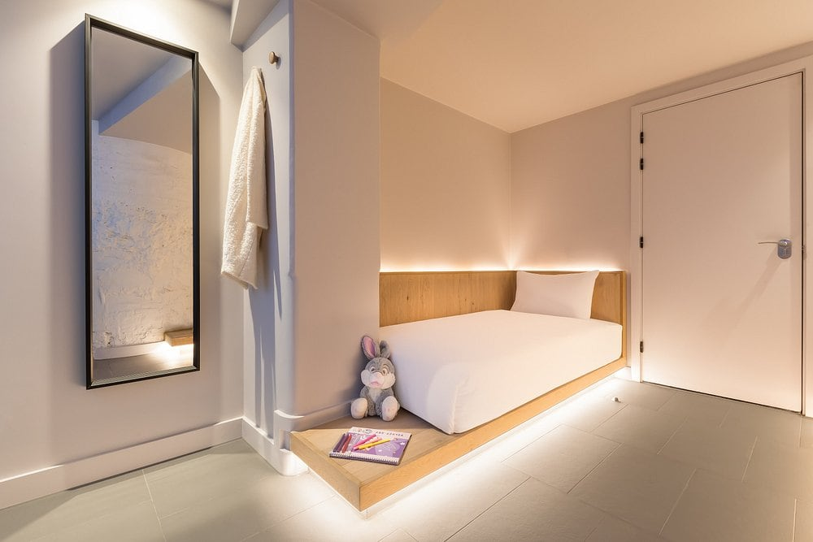

Five London hotels sell you a room with no window at all — not a bad view, not a light well, nothing. They belong to one operator, Zedwell, and they are the reason the phrase "windowless hotel" now means something specific in London rather than sounding like a complaint.

This is what you get, what you give up, and the one thing about the pricing that almost nobody explains.

> 💡 **The Short Version:** A windowless Zedwell room is a **small, private, soundproofed hotel room with an en-suite rainfall shower** and no daylight. For one person it is priced like any other central London room. For **two or more it becomes very good value**, because the second guest adds only about £5 a night. The rooms are cleaned **every four days**, and there is no kettle, no TV and no breakfast.

## What you actually get

*A cocoon room. Small, no window, and a door of its own.*

**Your own room, your own door, your own bathroom.** The smallest is 7 sq m. The bed sits on a lit oak plinth, there is a full-length mirror, hooks rather than a wardrobe, and an **en-suite with a walk-in rainfall shower**.

**The design is built around sleep rather than stay.** Soundproofing on walls, floors and doors; purified, temperature-controlled air instead of an opening window; blackout by default because there is nothing to black out. The bathroom mirror runs circadian-rhythm lighting that mimics a daylight cycle, which is the closest thing to a window in the room.

**Hypnos mattress, Egyptian cotton sheets, Wi-Fi over 50 Mbps.** Reception is staffed 24 hours.

## What you give up, beyond the window

These are the things that decide whether the format suits you, and none of them are on the booking page.

**The room is cleaned every four days, not daily.** Fresh towels come with that clean. You can pay for more, or collect clean towels and bedding yourself from reception at any time.

**There is no kettle, no mini bar and no television**, deliberately. No hairdryer or iron either — those are **£10 to have delivered to the room**. Piccadilly Circus and Tottenham Court Road have free beauty and ironing rooms; Greenwich, Knightsbridge and Park Lane do not.

**There is no breakfast.** Zedwell's own answer to the question is a list of nearby restaurants.

**Check-out is 10am**, which is early, and check-in is 3pm. Both move for money: early check-in from 9am is **£60** at Piccadilly Circus, Knightsbridge, Park Lane and Tottenham Court Road, and **£25** at Greenwich. Late check-out is charged the same way.

**Foreign nationals must upload a passport copy before arrival**, through a secure link emailed after booking. UK residents can check in with any government photo ID. This is the one that catches people out at 11pm.

## The pricing, which works backwards

A windowless room for one person is not a bargain. Across five dates we sampled — a quiet Sunday, a February midweek, an October Saturday, the second Saturday of December and a Saturday in April — a single room at Zedwell Piccadilly Circus ran from **£97 to £287**. That is ordinary money for a central London room, and what you have given up is the window.

**The value is in filling the room.** The Cocoon number is how many people it sleeps, and the price barely moves with it:

| Date sampled | Room for one | Room for two | Difference |
| --- | --- | --- | --- |
| Quiet Sunday | £97 | £102 | **+£5** |
| February midweek | £113 | £117 | **+£4** |
| October Saturday | £253 | £258 | **+£5** |
| December Saturday | £287 | £291 | **+£4** |
| April Saturday | £168 | £172 | **+£4** |

Four or five pounds for a second bed, on a room that swings by nearly two hundred across the year. Tottenham Court Road behaves the same way at £8 or £9.

It keeps going. **A Cocoon 8 sleeps eight for about two and a half times the price of a single**, and those ratios held to within about three per cent on every date we checked, whatever London was charging that week.

**The catch is the beds.** From Cocoon 4 upwards these rooms are built from *double* beds in bunks — a Cocoon 4 is two doubles, not four berths; a Cocoon 8 is four doubles. The per-person price assumes people are sharing a bed. Two couples in a Cocoon 4 is a genuinely good deal. Four friends who each want their own bed are not the customer that price is for.

Floor space works the same way: a Cocoon 8 is 20 sq m for eight people, against 7 sq m for one.

## The five hotels

**Zedwell Piccadilly Circus** is the biggest and the most volatile — the price triples between a quiet Sunday and December. Every room size from 1 to 12, inside the Grade II London Pavilion.

**Zedwell Tottenham Court Road** is London's first hotel entirely below ground, carved out of a disused car park beneath Great Russell Street, with 206 rooms. It **undercut Piccadilly on every date we sampled**, by £16 to £81, for the same product two Tube stops away. Two minutes from the British Museum, and on the Elizabeth, Northern and Central lines. Rooms stop at Cocoon 4.

**Zedwell Greenwich** is the steadiest price in the group and the best value — a room for four starts at £117, and early check-in is £25 rather than £60. By the river for the Cutty Sark, the Observatory and the O2.

**Zedwell Knightsbridge** sells **one room type only**, a Cocoon 2 sleeping two, so there is no single rate and no family option. The cheapest bed in SW1 on a quiet night, and it reprices as hard as the flagship.

**Zedwell Park Lane** is the newest, underground like Tottenham Court Road, at 77 Park Lane. It returned no bookable room on any of five dates we tried across seven months, so book direct.

## Who should not book one

**Do not book a windowless room if** you want to spend daytime in your room, you are claustrophobic, or you are unsure how you react to sleeping without daylight. Two practical notes from guest reviews rather than the marketing: **the rooms run warm**, and the climate control is less individual than it sounds; and there is **no daylight cue at all**, so you wake to an alarm or you do not wake.

Reviewers split harder on this than on almost anything else in London accommodation. One group calls it the best sleep they have had in the city. Another finds it genuinely oppressive. Both reactions are common enough that neither is the outlier — which is the argument for booking one night before you book four.

## Not the same thing as a capsule

Zedwell also runs two **capsule** properties, and confusingly calls the sleeping unit in those a "Capsule Cocoon" — so the word *cocoon* appears on both products. A capsule is a berth in a shared dormitory with shared bathrooms, at roughly a third of the price of a room.

**The word to look for is "Capsule" in the property name.** Our [London capsule hotels guide](/articles/pod-hotels-london/) covers those four properties in full, including what a night in one is actually like.

*Rates sampled on Hotels.com for one adult across five dates on 7 September 2026. Fees, room sizes and policies from Zedwell's own room pages and FAQ on the same date. Prices change nightly — always check your own dates.*
