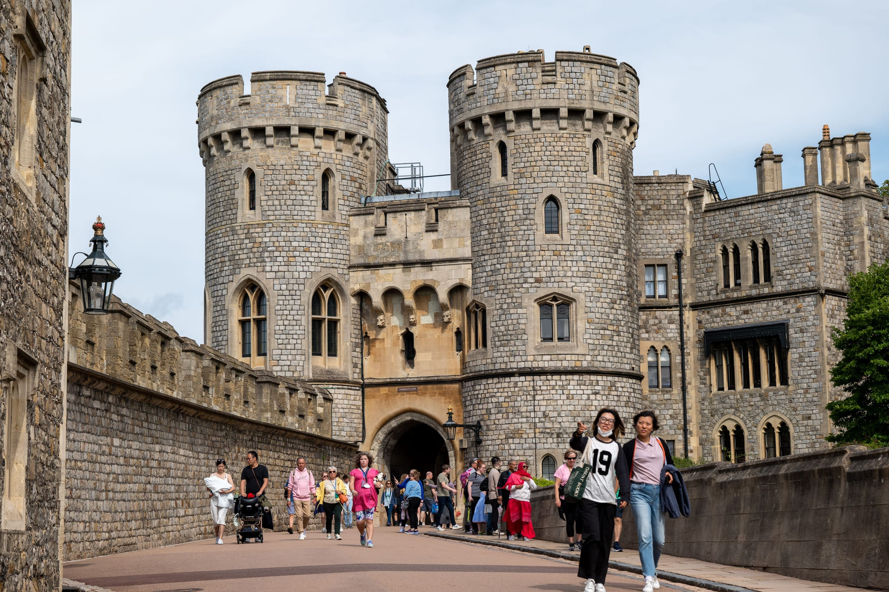
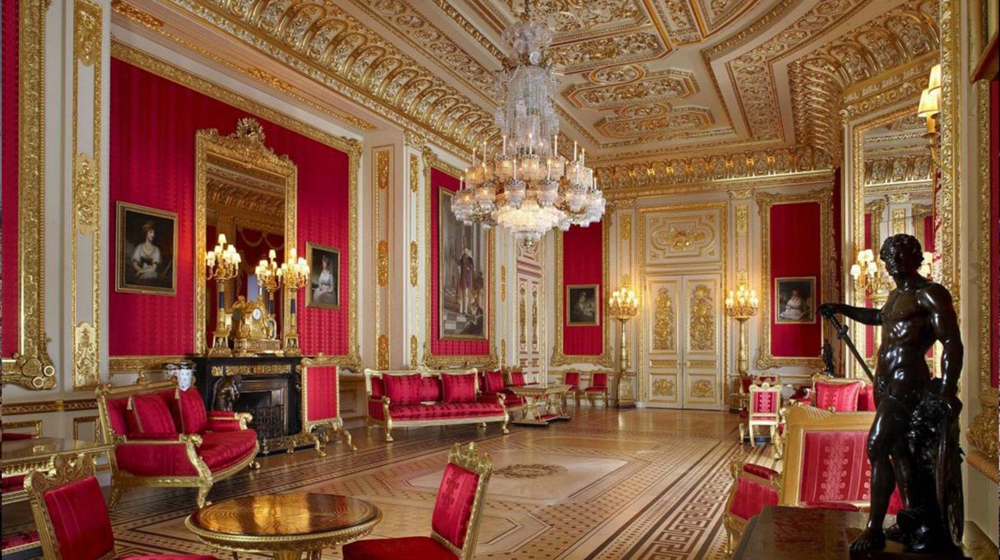
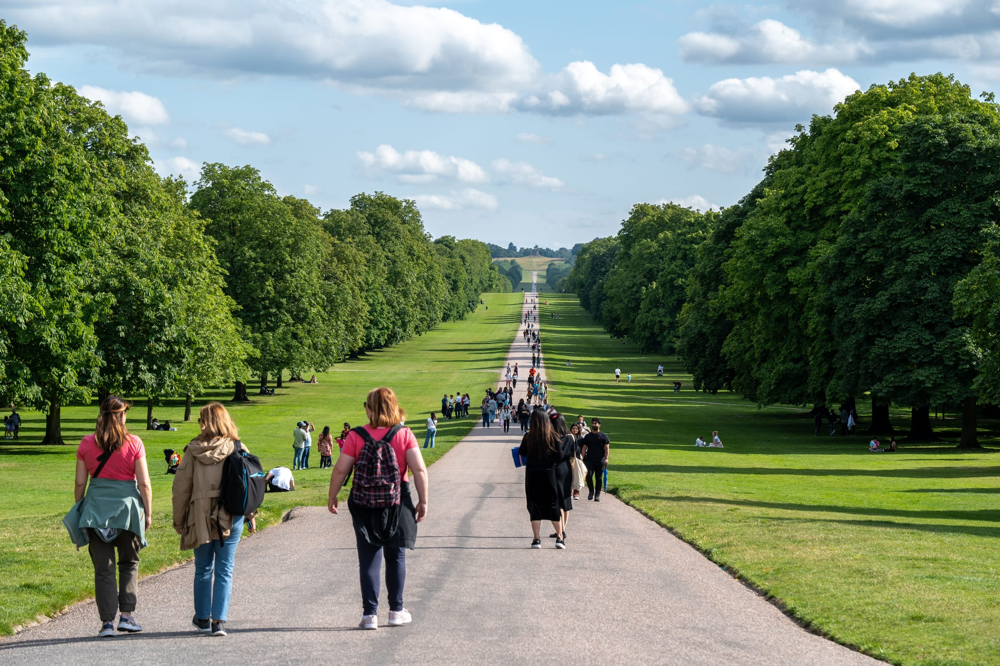
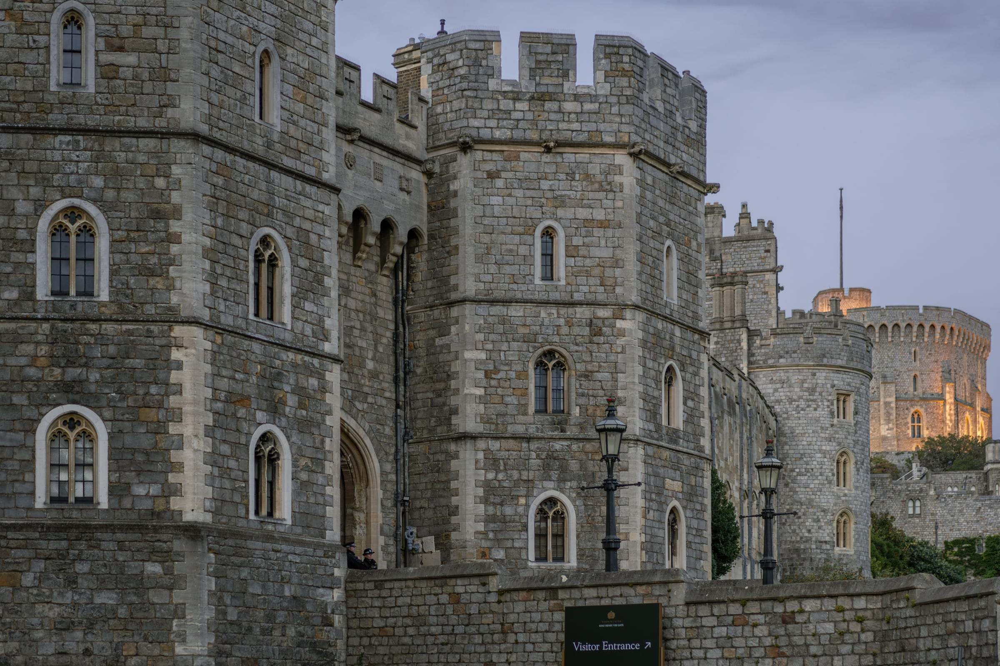

**Windsor Castle costs £32.00 in advance, and it is shut every Tuesday and Wednesday.** Get that one fact wrong and the whole day out collapses, because there is no second great thing in Windsor to fall back on.

It is, otherwise, the easiest big day trip out of London: half an hour from Paddington, payable on contactless, and the station exit is a two-minute walk from the ticket desk.

> 💡 **The Short Version:** **£32.00 adult in advance, £16.00 child, £96.00 for two and two.** **Closed Tuesdays and Wednesdays.** **Paddington via Slough, 28–38 minutes, £7.90 off-peak**, or **Waterloo direct, 53 minutes, £8.90**. **Contactless works, Oyster does not.** **St George's Chapel is shut to visitors on Sundays.** **Changing of the Guard is Thursday and Saturday at 11:00.** Allow **1½ to 2 hours** inside. **2FOR1 does not cover the Castle.** Sign your ticket on the way out and it becomes a **free pass for a year**.

Powered by <a target="_blank" rel="sponsored" href="https://www.getyourguide.com/london-l57/">GetYourGuide</a>

**Book a tour direct:**

- **£80** — <a href="https://www.getyourguide.com/activity/-t71088?partner_id=WWP7I0R&amp;cmp=windsor-day-trip" target="_blank" rel="sponsored nofollow noopener" data-affiliate="gyg">Windsor half-day with castle entry</a>
- **£85** — <a href="https://www.getyourguide.com/activity/-t645578?partner_id=WWP7I0R&amp;cmp=windsor-day-trip" target="_blank" rel="sponsored nofollow noopener" data-affiliate="gyg">LEGOLAND Windsor, entry and coach</a>
- **£89** — <a href="https://www.getyourguide.com/activity/-t388125?partner_id=WWP7I0R&amp;cmp=windsor-day-trip" target="_blank" rel="sponsored nofollow noopener" data-affiliate="gyg">Windsor Castle and Hampton Court</a>

## Getting there

| | Paddington → Windsor & Eton Central | Waterloo → Windsor & Eton Riverside |
| --- | --- | --- |
| **Change** | At Slough | **None** |
| **Time** | **28–38 min** | **53 min** |
| **Off-peak single** | **£7.90** | £8.90 |
| **Peak single** | £12.40 | £13.00 |
| Daily off-peak cap | £24.10 | £26.00 |
| Walk to the Castle | 2 minutes | 5 minutes |
| Station car park | None | 192 spaces |

Peak means **Monday to Friday, 06:30–09:30 and 16:00–19:00**. Trains run roughly every half hour on both routes, and the Slough–Windsor branch itself is a six-minute shuttle.

**Paddington wins on speed and price; Waterloo wins on not having to change.** If you are wrangling a pushchair, or you are already south of the river, the direct train is worth the extra pound.

> ⚠️ **Contactless works to Windsor. Oyster does not.** Both Windsor stations are in the pay-as-you-go area, but TfL classes them as contactless-only — a bank card or phone is fine, an Oyster card is not. There is a second trap in the timing: touch in at Windsor between **09:15** (Central) or **09:10** (Riverside) and 09:30 on a weekday and you are charged a peak fare, though it still counts towards the off-peak cap.

### Coach

Reading Buses' **Green Line 702** runs hourly between central London and LEGOLAND via Slough and Windsor, picking up at **Victoria, Hammersmith and the Royal Albert Hall**. Every single fare on it is **capped at £3**, with a return at £6 bought on the bus, and a group ticket for up to four people all day at £60 on the bus or £50 in the app. It takes considerably longer than the train and costs a third as much. The **703** does the same thing hourly from **Heathrow Terminal 5**, in under an hour.

### Driving

**23 miles and about 52 minutes from Charing Cross** via the A4 and M4. The problem is the other end: **there is no visitor car parking at Windsor Castle**, and the town car parks charge from 09:00 to 21:00 every day, bank holidays included.

| Car park | Over 5 hours |
| --- | --- |
| Victoria Street multi-storey, closest to the Castle | **£22.00** |
| Alexandra Gardens, Alma Road — the only one allowing overnight | £19.00 |
| **Home Park Public and King Edward VII** (Crown Estate) | **£13.00** |

Home Park and King Edward VII are the cheapest full day and they sit beside the Long Walk, which is where you want to be anyway. They can close at weekends and during events, so check before you set off.

## Windsor Castle

*The way in. Photo: Eren Cebeci, Pexels.*

| Ticket | In advance | On the day |
| --- | --- | --- |
| **Adult** | **£32.00** | £36.00 |
| Young person (18–24) | £21.00 | £24.00 |
| **Child (5–17)** | **£16.00** | £18.00 |
| Disabled visitor | £16.00 | £18.00 |
| Access companion | Free | Free |
| Under 5 | Free, ticket still needed | Free |

**There is no family ticket.** Children go half price and that is the whole of the discount, so two adults and two children is £96.00 in advance. On-the-day tickets exist but are subject to availability, and cost £4 more per adult — unlike the [Harry Potter Studio Tour](/articles/harry-potter-studio-tour/), you will not be turned away for arriving without one.

**£1 tickets** are available to people on Universal Credit and other named UK benefits. **Royal Borough of Windsor and Maidenhead Advantage Card** holders get 50% off with one child free per cardholder.

### Opening days, which is the part that catches people

> ⚠️ **Closed every Tuesday and Wednesday.** Open Thursday to Monday, with two exceptions: the Castle opens on **Tuesday 22 and Tuesday 29 December 2026**.

| Season | Opens | Last admission | Closes |
| --- | --- | --- | --- |
| **1 March – 31 October** | 10:00 | **16:00** | 17:15 |
| **1 November – 28 February** | 10:00 | **15:00** | 16:15 |

The State Apartments stop admitting 30 minutes after the last admission time. Tickets carry a **timed entry slot**.

**Closures already on the calendar for 2026:** the Castle is shut on **Monday 19 October** and from **Thursday 24 to Saturday 26 December**. St George's Hall and the Semi-State Rooms are closed on **17 and 18 October**. The **Semi-State Rooms** — George IV's private rooms, the most heavily decorated interiors in the building — are closed until **1 October 2026** and then open through the winter, which is a genuine argument for a cold-weather visit. On days when parts of the Castle are shut, a reduced admission price applies.

### What you actually see

**The State Apartments** are the ceremonial rooms still used for state visits and investitures, hung with Holbein, Van Dyck and Rubens, plus the historic rooms built for Charles II and George IV's Waterloo Chamber. **Queen Mary's Dolls' House** is on permanent display. **St George's Chapel** holds the tombs of eleven monarchs — Queen Elizabeth II, George VI, Henry VIII and Charles I among them — and is where the recent royal weddings happened.

> ⚠️ **The Chapel is closed to visitors on Sundays**, open only for worship. If the Chapel is the reason you are going, do not go on a Sunday. On other days it takes its last entry at 16:00 and closes at 16:15 for the 17:15 evening service, which you are welcome to attend.

**A multimedia guide is included**, introduced by The King, in nine languages plus British Sign Language with subtitles, and there is a children's version for ages 7 to 11 narrated by Scorch the dragon.

### Changing of the Guard

| Day | What happens |
| --- | --- |
| **Thursday and Saturday** | Guards **march through Windsor town** and arrive at the Castle **just before 11:00** for the full ceremony |
| Monday and Friday | A smaller **Captain's Inspection**, inside the Castle only, just before 11:00 |
| Tuesday and Wednesday | Nothing — the Castle is closed |

Weather permitting, and the schedule changes, so check the British Army listing the week before. **The march through town is free to watch.** The ceremony inside needs a ticket.

### Allow less time than you think, and get a year out of it

**Royal Collection Trust suggests 1½ to 2 hours.** That is about right. The route is one-way, the Castle sits at the top of a steep hill, and the distances inside are long.

> 💡 **Sign your ticket before you leave and it becomes a 1-Year Pass.** Print and sign your name in the spaces provided, and your purchase is treated as a donation giving 12 months of free re-admission from the date of your first visit. To come back, either phone **+44 (0)303 123 7334** to lock in a time slot for a £2.00 fee, or turn up with the signed ticket and photo ID and take the next available slot. It does not work on £1 tickets, complimentary tickets, or anything bought through a tour operator or ticket agent.

**Two more things the website buries.** There is **airport-style security screening** on arrival. And **large backpacks and pushchairs are not allowed in the State Apartments** — the cloakroom is at the China Museum, a ten-minute, mostly uphill walk from the Admission Centre.

Powered by <a target="_blank" rel="sponsored" href="https://www.getyourguide.com/london-l57/">GetYourGuide</a>

*The State Apartments, which are what the £32 ticket buys.*

## What 2FOR1 does and does not cover

**Windsor Castle is not in the National Rail 2FOR1 scheme.** Neither is any other Royal Collection Trust site. The Castle is full price however you arrive.

**LEGOLAND Windsor Resort is in it, at one third off** rather than two-for-one — the same treatment every Merlin attraction gets. Two Golden Tours bus tours of Windsor are listed too. The offer needs two people, a valid National Rail ticket and an eVoucher, and contactless does not qualify, which is the whole trick of it: the cheapest way to reach Windsor is the thing that disqualifies you. Full rules in our guide to [National Rail 2FOR1](/articles/national-rail-2for1-london-attractions/).

## What fills the rest of the day

*The Long Walk: free, and the best thing in Windsor after the castle. Photo: Eren Cebeci, Pexels.*

### The Long Walk

**Free, and the best thing in Windsor after the Castle.** Charles II laid it out between 1682 and 1685: almost **2.5 miles** of tree-lined avenue running dead straight from the Castle up to the **Copper Horse**, the 1831 statue of George III at the top of the rise. The view back down to the Castle is the one on the postcards. There and back is about five miles.

It crosses the **Deer Park**, home to roughly **500 red deer**. Rutting season runs from September to early November, the stags get aggressive, and the Deer Park is occasionally closed for it — check before you walk. **No bikes, scooters, skateboards or rollerblades** on the Long Walk or in the Deer Park, not even pushed.

Windsor Great Park beyond it is free and open all year; the charges are for parking, Adventure Play and the Savill Garden. **The Savill Garden** is 35 acres of gardens and woodland, **£14.95 adult and £6.50 child booked ahead**, £18.95 and £8.50 on the day, open 09:00–18:00 with last entry at 17:00. It is across the park at TW20 0UJ, though, and realistically needs a car.

### The river

**French Brothers** sail from **Windsor Promenade**, SL4 1QX. The **40-minute round trip** goes upstream to Boveney Lock past Eton College and the racecourse — **£11.90 adult and £7.90 child online**, £13.50 and £9.00 on the day, with a 2+2 family at £31.70 online. It is an open ticket valid for any 40-minute sailing that day, boats go at least every half hour from 10:00 to 17:00, and dogs travel free.

The **two-hour cruise** goes the other way, through Romney Lock and the private grounds of the Castle to Albert Bridge — **£19.40 adult and £12.90 child online**.

### Eton

Five minutes over Windsor Bridge. **Eton College's museums and exhibition gallery are free and open on Sunday afternoons, 13:30 to 16:00** — the Museum of Eton Life in Brewhouse Yard off the High Street, the Natural History Museum and the Museum of Antiquities on South Meadow Lane. **There are no Heritage Tours in 2026** while essential building works run.

Which sets up a neat trade: **Sunday is the one day the Chapel is shut and the one day Eton's museums are open.**

### LEGOLAND

**This is a separate day out, not an afternoon after the Castle.** It is two miles from Windsor town centre at SL4 4AY, with 55 rides, and it usually runs 10:00 to 18:00.

**Day tickets start at £32 booked online.** Parking is **£13 booked ahead, £15 on the day**, with Priority Parking at £18 per car. Green Line **702 and 703 between them give a half-hourly service** from central Windsor and Slough to the gate for that £3 single. There is also a shuttle bus from stops near both rail stations, but LEGOLAND is careful to say it is **chargeable and not operated by the park** — the 702 is the option with a published price.

### Where to eat

- **Undercroft Café**, inside the Castle, in one of the oldest surviving spaces in the building. Nothing else is edible on site and you cannot eat in the State Apartments or the Chapel.
- **The Two Brewers**, Park Street — Grade II listed, in a 1709 building, pouring since 1792, right by the Castle end of the Long Walk. Children on the outdoor benches only; indoors is 18+. Bookings by phone, 01753 855426.
- **The Boatman**, 10 Thames Side — Windsor's only pub on the river, below the Castle by Eton Bridge, with a terrace over the water.
- **Windsor Royal**, built into the Victorian station beside Windsor & Eton Central, for the straight-off-the-train option.
- **Eton High Street**, for cafés and restaurants without the coach parties.

## Last trains, and how long the day really takes

*Photo: Spencer Davis, Pexels.*

| Route | Weekday | Saturday | Sunday |
| --- | --- | --- | --- |
| **Windsor & Eton Central → Paddington** | **23:56** (arr 00:28) | 23:20 | 23:05 |
| **Windsor & Eton Riverside → Waterloo** | 22:53 direct, 23:37 via Staines | 23:21 (arr 00:22) | 22:59, routed via Hounslow |

> ⚠️ **Sunday engineering work closes the Slough–Windsor branch outright some weeks.** Checking two consecutive Sundays in September 2026 gave no evening service at all on one and a normal service on the other. If you are counting on a late Sunday train home, check that specific date.

**A Castle-only trip is a comfortable half day.** Leave London at 09:30, be inside by 10:30, out by 12:30. **Castle plus the Long Walk, or Castle plus a river trip and Eton, is a full day** and you will still be home for dinner. Anything involving LEGOLAND is a day of its own.

Powered by <a target="_blank" rel="sponsored" href="https://www.getyourguide.com/london-l57/">GetYourGuide</a>

## What people get wrong

- **Going on a Tuesday or Wednesday.** The Castle is closed. There is no plan B.
- **Going on a Sunday for St George's Chapel.** Closed to visitors; worship only.
- **Tapping in with an Oyster card.** Contactless only to both Windsor stations.
- **Expecting a family ticket.** There isn't one. Children are half price and that is it.
- **Booking 2FOR1 for the Castle.** It is not in the scheme, and the contactless fare you paid to get there would have voided the offer anyway.
- **Leaving the Castle without signing the ticket**, and throwing away a year of free re-admission.
- **Driving, then parking in Victoria Street for the day** at £22, when Home Park is £13 and closer to the Long Walk.
- **Treating LEGOLAND as an add-on.** It needs a whole day.

## Continue planning your London trip

- 🎟️ **[National Rail 2FOR1](/articles/national-rail-2for1-london-attractions/)** — which attractions are really in the scheme, and why contactless disqualifies you.
- ⚡ **[Harry Potter Studio Tour](/articles/harry-potter-studio-tour/)** — the other big day trip out of London, and the one where you genuinely cannot buy on the door.
- 🚇 **[London transport costs and fares](/articles/london-public-transport-costs-and-fares/)** — how contactless capping works on a day like this one.
- 🏛️ **[Historic houses in London](/articles/historic-houses-london/)** — palaces and grand interiors without leaving the city.
- 👨‍👩‍👧 **[London with kids](/articles/london-with-children/)** — more family days out, most of them free.
- 🗺️ **[Day trips from London](/articles/day-trips-from-london/)** — what the others cost, how long they take, and which days they are shut.
